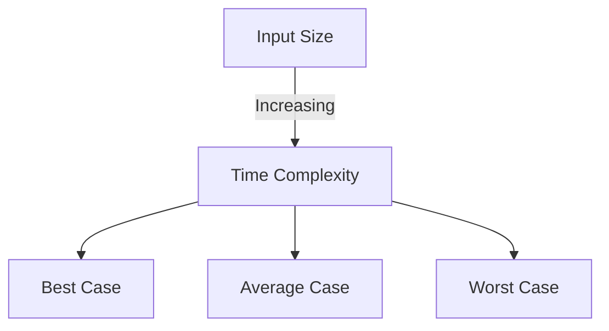
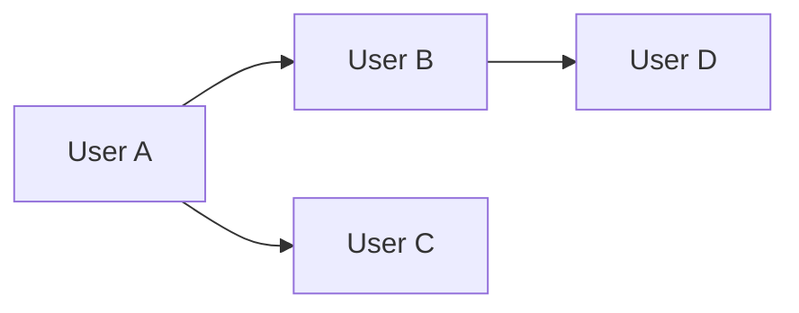
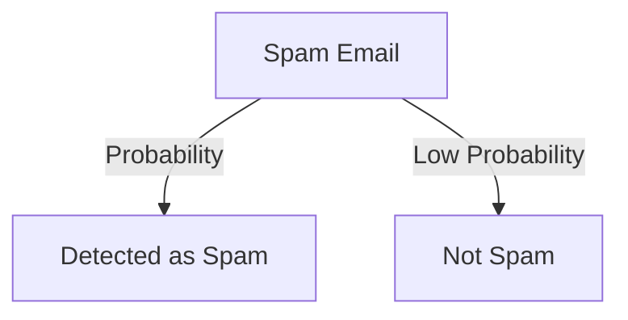
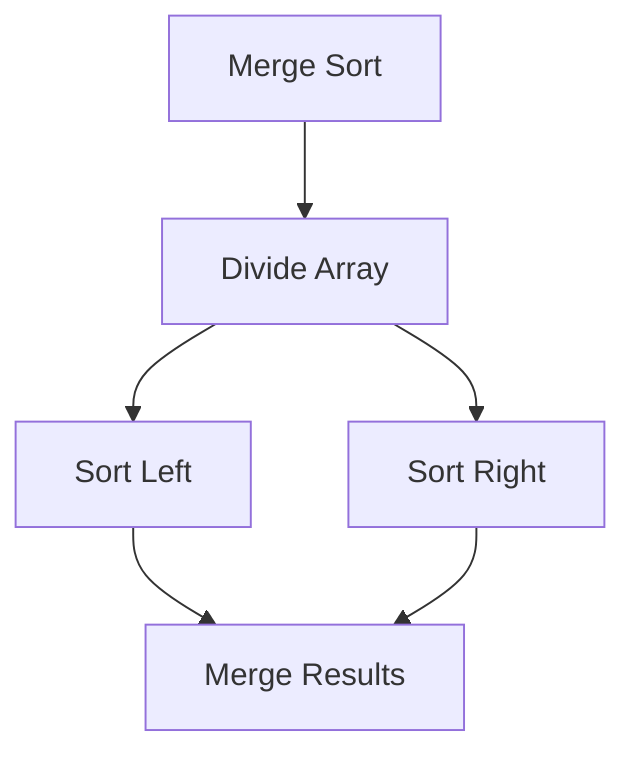
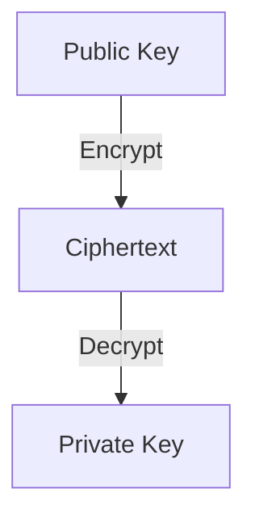
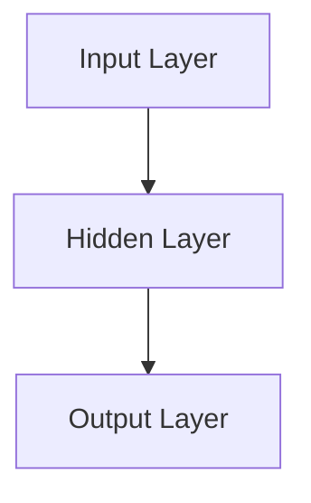

---
import Tabs from '@theme/Tabs';
import TabItem from '@theme/TabItem';
import DSA_Book_Recommendation from './DSA_Book_Recommendation.js';

 
  
    <DSA_Book_Recommendation />  
  
  

---

# Mathematical Foundations of DSA

## Introduction
Mathematics plays a crucial role in Data Structures and Algorithms (DSA). It provides the theoretical foundation for analyzing efficiency, optimizing performance, and developing new algorithms. Concepts like complexity analysis, probability, combinatorics, linear algebra, discrete mathematics, trigonometry, and calculus have real-world applications in fields like artificial intelligence, networking, cryptography, and system optimization.

This document covers the following mathematical foundations of DSA:
- Complexity Analysis & Big-O Notation
- Graph Theory
- Probability & Combinatorics
- Recurrence Relations
- Number Theory & Cryptography
- Linear Algebra in AI & ML
- Discrete Mathematics
- Trigonometry & Calculus

---

## 1. Complexity Analysis & Big-O Notation
Complexity analysis helps in evaluating the efficiency of an algorithm in terms of time and space.

### Real-Life Example in Technology
- **Search Engines**: Google optimizes search queries using logarithmic and linear algorithms to provide results quickly.
- **Sorting Algorithms**: E-commerce websites use efficient sorting algorithms to display products based on relevance.

### Diagram Representation

---

## 2. Graph Theory
Graphs model real-world networks such as social networks, road maps, and communication networks.

### Real-Life Example in Technology
- **Google Maps**: Uses graph theory to find the shortest path between locations.
- **Social Media**: Platforms like Facebook and LinkedIn represent users as nodes and connections as edges.

### Diagram Representation

---

## 3. Probability & Combinatorics
Probability and combinatorics help in randomized algorithms, cryptography, and AI decision-making.

### Real-Life Example in Technology
- **Spam Filters**: Email services use probabilistic models to detect spam.
- **AI & ML**: Bayesian networks are used in recommendation systems like Netflix and Amazon.

### Diagram Representation

---

## 4. Recurrence Relations
Recurrence relations define recursive functions and divide & conquer algorithms.

### Real-Life Example in Technology
- **Merge Sort**: Breaks down a list into smaller sublists and recursively sorts them.
- **Fibonacci Sequence**: Used in financial modeling and computer algorithms.

### Diagram Representation

---

## 5. Number Theory & Cryptography
Number theory is essential for encryption algorithms used in data security.

### Real-Life Example in Technology
- **RSA Encryption**: Secure communication over the internet.
- **Blockchain**: Uses cryptographic hashing for securing transactions.

### Diagram Representation

---

## 6. Linear Algebra in AI & ML
Linear algebra is used in artificial intelligence for image recognition, deep learning, and data analysis.

### Real-Life Example in Technology
- **Computer Vision**: Uses matrices for image processing.
- **Neural Networks**: Represent weight matrices in deep learning models.

### Diagram Representation

---

## 7. Discrete Mathematics
### Definition
Discrete Mathematics deals with countable, distinct elements and is foundational in computer science.

### Role in DSA & Optimization
- **Set Theory**: Helps in relational databases and defining collections of unique elements.
- **Graph Theory**: Fundamental for networking, AI, and optimization problems.
- **Boolean Algebra**: Used in logic gates and computer circuit design.

### Real-Life Example
- **Database Indexing**: Uses set theory and logic for fast data retrieval.

---

## 8. Trigonometry & Calculus
### Definitions
- **Trigonometry** studies angles and their applications.
- **Calculus** focuses on rates of change and accumulation.

### Role in DSA & Optimization
- **Fourier Transforms**: Used in signal processing and compression algorithms.
- **Gradient Descent**: A calculus-based optimization algorithm for machine learning models.

### Real-Life Example
- **Computer Graphics**: Trigonometry is used for rendering 3D graphics.
- **Neural Networks**: Use calculus for training deep learning models.

---

## How Sharpening Math Skills Helps in DSA & Optimization

Mathematics sharpens logical thinking and problem-solving skills, which are crucial in:
- **Algorithm Development**: Understanding complexity leads to efficient algorithm design.
- **Optimization**: Mathematical models help in reducing computational costs.
- **Competitive Programming**: Strong mathematical skills give an edge in solving complex problems.

By practicing mathematical concepts, one can:
- **Improve analytical thinking** for debugging and improving algorithms.
- **Enhance performance** in data science and AI by applying linear algebra and calculus.
- **Develop innovative solutions** by understanding deep mathematical principles.

---

## Further Reading & References
1. [Introduction to Algorithms - MIT Press](https://mitpress.mit.edu/books/introduction-algorithms)
2. [Getting Started with the DSA - CompilerSutra](https://www.compilersutra.com/docs/DSA/)
2. [Graph Theory - MathWorld](https://mathworld.wolfram.com/GraphTheory.html)
3. [Discrete Mathematics - Khan Academy](https://www.khanacademy.org/computing/computer-science/cryptography)
4. [Linear Algebra - MIT OpenCourseWare](https://ocw.mit.edu/courses/mathematics/18-06-linear-algebra-spring-2010/)
5. [Probability & Statistics - Coursera](https://www.coursera.org/courses?query=probability%20statistics)

---

## Conclusion
Mathematics is the backbone of DSA, enabling the development of efficient algorithms for real-world applications. Understanding these concepts helps in optimizing performance, securing systems, and building intelligent solutions. By strengthening math skills, one can excel in programming, system design, a