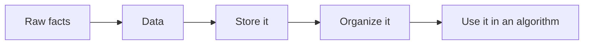

import Head from '@docusaurus/Head';
import Tabs from '@theme/Tabs';
import TabItem from '@theme/TabItem';

<Head>
  <title>What Is Data? | CompilerSutra</title>
  <meta name="description" content="Beginner-friendly explanation of what data is, why it matters, and how it becomes the input that algorithms work on." />
  <meta name="keywords" content="what is data, data in computer science, beginner data, data vs information, DSA foundations, computer science basics" />
  <link rel="canonical" href="https://www.compilersutra.com/docs/dsa/foundations/data/" />
  <meta property="og:type" content="article" />
  <meta property="og:title" content="What Is Data? | CompilerSutra" />
  <meta property="og:description" content="Beginner-friendly explanation of what data is, why it matters, and how it becomes the input that algorithms work on." />
  <meta property="og:url" content="https://www.compilersutra.com/docs/dsa/foundations/data/" />
  <meta property="og:image" content="https://www.compilersutra.com/img/dsa/foundations/dsa-foundations-hero-v2.png" />
  <meta property="og:image:alt" content="CompilerSutra illustration for DSA foundations" />
  <meta name="twitter:card" content="summary_large_image" />
  <meta name="twitter:title" content="What Is Data? | CompilerSutra" />
  <meta name="twitter:description" content="Beginner-friendly explanation of what data is, why it matters, and how it becomes the input that algorithms work on." />
  <meta name="twitter:image" content="https://www.compilersutra.com/img/dsa/foundations/dsa-foundations-hero-v2.png" />
</Head>

# What Is Data?

Data is the raw material that a program stores and uses.

A program cannot solve a problem without something to work on. That something is data.

Data can be a number, a name, a date, a yes/no value, a list, a file, a location, or even a relationship between items.

:::note
If you remember one line, remember this: data is the information your program keeps so it can do something useful with it.
:::

<div style={{display: 'grid', gap: '1.5rem', gridTemplateColumns: 'repeat(auto-fit, minmax(280px, 1fr))', alignItems: 'center', margin: '2rem 0'}}>
  <div>
    <p style={{marginTop: 0, fontWeight: 700}}>Why this matters</p>
    <p>
      Before you choose an algorithm, you need to know what you are storing. The shape of the data changes how easy the next step will be.
    </p>
    <p>
      That is why data comes before algorithms in DSA.
    </p>
  </div>
  <figure style={{margin: 0}}>
    
    <figcaption style={{fontSize: '0.9rem', color: 'var(--ifm-color-emphasis-700)', marginTop: '0.6rem'}}>
      Data is the thing you keep. The algorithm is the thing you do with it.
    </figcaption>
  </figure>
</div>

## Table of Contents

- [Introduction](#introduction)
- [Why Learn This?](#why-learn-this)
- [Real-Life Example](#real-life-example)
- [Intuition](#intuition)
- [Definition](#definition)
- [Visualization](#visualization)
- [Step-by-Step Example](#step-by-step-example)
- [Dry Run](#dry-run)
- [Code](#code)
- [Complexity](#complexity)
- [Comparison Tables](#comparison-tables)
- [Real Applications](#real-applications)
- [Advantages](#advantages)
- [Limitations](#limitations)
- [Common Mistakes](#common-mistakes)
- [Memory Tricks](#memory-tricks)
- [Interview Questions](#interview-questions)
- [FAQs](#faqs)
- [Practice Problems](#practice-problems)
- [Summary](#summary)
- [Read Next](#read-next)
- [References](#references)

## Introduction

Imagine a teacher keeping student records.

The teacher stores names, roll numbers, marks, attendance, and homework status.

Those values are data.

A computer works in the same way. It stores facts first, then uses those facts to make decisions, show results, or run calculations.

## Why Learn This?

You need data in every real program.

If you build a shopping app, data includes products, prices, cart items, and orders.
If you build a study tracker, data includes topics, scores, deadlines, and notes.
If you build a game, data includes player position, health, score, and level.

Without data, there is nothing to process.

:::important
Data is not the same as code. Code tells the computer what to do. Data is the thing the code works on.
:::

## Real-Life Example

Think about your phone contacts.

Each contact may contain:

- a name,
- one or more phone numbers,
- an email address,
- and maybe a photo.

That entire contact entry is data.

Now think about how you use it.

You may search by name, sort by recent calls, or group contacts by family or work.

The data stays the same, but the way you store it changes what becomes easy.

## Intuition

The simplest way to understand data is this:

- data is what you want to remember,
- data structure is how you arrange it,
- algorithm is how you use it.

A list of student names is data.
A table of marks is data.
A graph of friendships is data.

The same facts can be stored in different shapes.
That shape matters because it affects speed, clarity, and memory use.

## Definition

In computer science, data means stored facts or values that represent something real or useful.

Examples include:

- numbers,
- text,
- booleans,
- dates,
- images,
- audio,
- and relationships between objects.

In DSA, data is usually the input you store before you apply an algorithm.

<details>
<summary>Advanced Explanation</summary>

Data becomes more useful when it is organized.

A raw list of values is still data, but once you group, label, or connect those values, you can answer questions faster.

That is why computer science often moves from raw data to structured data.

</details>

## Visualization

Read this flow from left to right:



A small example:

- Raw fact: `Aman`
- Raw fact: `91`
- Raw fact: `math`

Together, these may represent a student record.

## Step-by-Step Example

Suppose you are building a study planner.

You want to store these items:

1. Topic name
2. Priority
3. Last revision date
4. Completion status

Step by step:

1. First, you identify the facts you need.
2. Then, you decide which values belong together.
3. Next, you choose how to store them.
4. Finally, you use those values in search, update, or sorting logic.

The data is the content.
The structure is the container.
The algorithm is the method.

## Dry Run

Imagine these study entries:

| Topic | Priority | Done |
| --- | --- | --- |
| Arrays | High | No |
| Strings | Medium | Yes |
| Sorting | High | No |

Dry run of the idea:

1. Store the topic name.
2. Store the priority.
3. Store whether the topic is done.
4. Use that data later to show the next topic to study.

The program does not need to invent the facts. It only needs to keep them clearly.

## Code

Here is the same study-plan data in three languages.

<Tabs>
<TabItem value="cpp" label="C++">

```cpp
#include <iostream>
#include <vector>
#include <string>
using namespace std;

struct Topic {
    string name;
    int priority;
    bool done;
};

int main() {
    vector<Topic> topics = {
        {"Arrays", 1, false},
        {"Strings", 2, true},
        {"Sorting", 1, false}
    };

    for (const auto& topic : topics) {
        cout << topic.name << " " << topic.priority << " " << topic.done << '\n';
    }
    return 0;
}
```

</TabItem>
<TabItem value="python" label="Python">

```python
topics = [
    {"name": "Arrays", "priority": 1, "done": False},
    {"name": "Strings", "priority": 2, "done": True},
    {"name": "Sorting", "priority": 1, "done": False},
]

for topic in topics:
    print(topic["name"], topic["priority"], topic["done"])
```

</TabItem>
<TabItem value="java" label="Java">

```java
import java.util.*;

class Topic {
    String name;
    int priority;
    boolean done;

    Topic(String name, int priority, boolean done) {
        this.name = name;
        this.priority = priority;
        this.done = done;
    }
}

public class Main {
    public static void main(String[] args) {
        List<Topic> topics = Arrays.asList(
            new Topic("Arrays", 1, false),
            new Topic("Strings", 2, true),
            new Topic("Sorting", 1, false)
        );

        for (Topic topic : topics) {
            System.out.println(topic.name + " " + topic.priority + " " + topic.done);
        }
    }
}
```

</TabItem>
</Tabs>

### What the code shows

- A topic is data.
- A field like `name` or `priority` is also data.
- A collection like a list or vector stores many pieces of data together.

## Complexity

Data itself does not always have a single complexity value.
The cost depends on how you store and use it.

For the example above:

| Operation | Best | Average | Worst | Why |
| --- | --- | --- | --- | --- |
| Read one stored record | `O(1)` | `O(1)` | `O(1)` | A direct field access is constant time. |
| Scan all records | `O(n)` | `O(n)` | `O(n)` | You visit each stored item once. |
| Find a topic in an unsorted list | `O(1)` | `O(n)` | `O(n)` | You may need to check every item. |

:::caution
Do not confuse the cost of storing data with the cost of using it. The same data can be cheap or expensive depending on the structure around it.
:::

## Comparison Tables

### Data vs Information

| Aspect | Data | Information |
| --- | --- | --- |
| Meaning | Raw facts or values | Data that has been organized or interpreted |
| Example | `42`, `CompilerSutra`, `2026-07-02` | "The next revision is due today" |
| Role in DSA | Input you store | Useful meaning you derive from input |

### Data vs Data Structure

| Aspect | Data | Data Structure |
| --- | --- | --- |
| Meaning | The facts themselves | The way those facts are arranged |
| Example | A student name and score | Array, list, map, tree, or graph |
| Goal | Represent real things | Make operations easier |

### Program vs Data

| Aspect | Program | Data |
| --- | --- | --- |
| Meaning | Instructions for the computer | The values the instructions use |
| Can change independently? | Yes | Yes |
| Example | A search function | A list of student names |

## Real Applications

Data is used everywhere.

- **Google Search** stores indexed information so queries can be matched quickly.
- **Linux** keeps process, file, and memory data in internal tables and structures.
- **Databases** store rows, indexes, and metadata as data.
- **Browsers** keep page state, history, cookies, and DOM data.
- **Compilers** store source code, tokens, trees, symbols, and intermediate representations.
- **AI** systems use training data, labels, tensors, and model parameters.
- **Robotics** uses sensor data, maps, and state information.
- **Cloud Computing** moves logs, events, metrics, and configuration data across systems.
- **Operating Systems** manage files, memory, users, and running processes as data.
- **Games** store player state, maps, levels, scores, and physics values.

## Advantages

- Data gives your program something real to work on.
- Data can be stored in many shapes.
- Good organization makes later steps easier.
- Data helps separate input from logic.

## Limitations

- Raw data is not always useful until it is organized.
- Poor structure can make even simple tasks slow.
- Large data sets can use a lot of memory.
- Wrong labels or missing values can lead to wrong results.

## Common Mistakes

1. Thinking data means only numbers.
2. Mixing up data with code.
3. Assuming all data should be stored in a plain list.
4. Forgetting that text, dates, and booleans are also data.
5. Ignoring how the data will be searched later.
6. Ignoring how often the data will change.
7. Storing related values separately when they belong together.
8. Assuming one shape fits every problem.
9. Confusing data with information.
10. Not checking for missing or invalid values.

## Memory Tricks

- **Data is what you keep.**
- **Code is what you do.**
- **Facts first, logic second.**
- **Shape affects speed.**
- **Store related values together.**

## Interview Questions

### Easy

1. What is data in computer science?
2. Give three examples of data.
3. Why is data needed in a program?

### Medium

1. What is the difference between data and information?
2. Why does the shape of data matter?
3. How can the same data be stored in different ways?

### Hard

1. How would you choose a data representation for a study tracker that needs search, sort, and update operations?
2. Why can poor data organization make an algorithm slower?

## FAQs

1. **What is data?** Data is the information a program stores and uses.
2. **Is data always numbers?** No. Data can be text, dates, booleans, images, audio, and more.
3. **Is data the same as information?** No. Data is raw facts. Information is organized or meaningful data.
4. **Why is data important?** Programs need data to produce output or make decisions.
5. **Is data part of DSA?** Yes. DSA starts with understanding what data you have.
6. **Can data be a sentence?** Yes. Text is data.
7. **Can data be a file?** Yes. Files are data containers.
8. **Can data be a graph?** Yes. Relationships can be data too.
9. **What is a data structure?** It is the way data is organized.
10. **Why should I care about data shape?** Because it affects search, update, and memory cost.
11. **What is raw data?** Raw data is unprocessed facts.
12. **What is structured data?** Structured data is data organized into a clear format.
13. **What is unstructured data?** Unstructured data does not follow a fixed table-like format.
14. **Does a program create data?** Sometimes it creates new data, but often it stores and transforms data.
15. **What is an example of data in daily life?** A shopping list is data.
16. **What is an example of data in coding?** A list of student names is data.
17. **Can data be empty?** Yes. Empty values are still data states.
18. **Why do databases care about data?** They store and query data efficiently.
19. **Do AI models use data?** Yes. Training and inference both depend on data.
20. **Do I need DSA to understand data?** No, but DSA helps you organize and use data better.
21. **What should I learn after data?** Learn algorithms and arrays next.
22. **Is a variable data?** A variable can hold data.
23. **Is metadata data?** Yes. Metadata is data about data.
24. **Can data be changed?** Yes. Many programs update data over time.
25. **Why does missing data matter?** Missing data can cause wrong output or crashes.

## Practice Problems

### Easy

- List five kinds of data you use every day.
- Write down the data needed for a phone contact.

### Medium

- Design a simple study tracker and list its data fields.
- Compare how you would store contacts in a list versus a table.

### Hard

- Choose a data shape for a library system that stores books, authors, and availability.
- Explain how the same student record could be stored as a list, table, or object.

### Challenge

- Take one app you use daily and identify at least ten pieces of data it stores.

## Summary

- Data is the raw information a program stores.
- Data can be numbers, text, dates, booleans, files, or relationships.
- The shape of data affects later operations.
- Good DSA starts by understanding the data first.
- Data is not code, but code depends on data.

## Read Next

- [Algorithm](/docs/dsa/foundations/algorithm/)
- [Arrays](/docs/dsa/foundations/arrays/)
- [Strings](/docs/dsa/foundations/strings/)
- [Searching](/docs/dsa/foundations/searching/)
- [Sorting](/docs/dsa/foundations/sorting/)
- [Stack and Queue](/docs/dsa/foundations/stack-and-queue/)
- [Connected Data](/docs/dsa/foundations/connected-data/)
- [Hash Maps and Complexity](/docs/dsa/foundations/hash-map-and-complexity/)

## Previous Lesson

- [What Is DSA?](/docs/dsa/foundations/what-is-dsa/)

## Next Lesson

- [Algorithm](/docs/dsa/foundations/algorithm/)

## Related Articles

- [What Is DSA?](/docs/dsa/foundations/what-is-dsa/)
- [Algorithm](/docs/dsa/foundations/algorithm/)
- [Arrays](/docs/dsa/foundations/arrays/)
- [Strings](/docs/dsa/foundations/strings/)

## Learning Path

1. [DSA Foundations for Absolute Beginners](/docs/dsa/foundations/)
2. [What Is DSA?](/docs/dsa/foundations/what-is-dsa/)
3. [What Is Data?](/docs/dsa/foundations/data/)
4. [Algorithm](/docs/dsa/foundations/algorithm/)
5. [Arrays](/docs/dsa/foundations/arrays/)
6. [Strings](/docs/dsa/foundations/strings/)
7. [Searching](/docs/dsa/foundations/searching/)
8. [Sorting](/docs/dsa/foundations/sorting/)
9. [Stack and Queue](/docs/dsa/foundations/stack-and-queue/)
10. [Connected Data](/docs/dsa/foundations/connected-data/)
11. [Hash Maps and Complexity](/docs/dsa/foundations/hash-map-and-complexity/)

## References

- [MIT Press: Introduction to Algorithms, 4th Edition](https://mitpress.mit.edu/9780262046305/introduction-to-algorithms/)
- [MIT OpenCourseWare: 6.006 Introduction to Algorithms](https://ocw.mit.edu/courses/6-006-introduction-to-algorithms-fall-2011/)
- [Princeton: Algorithms, 4th Edition](https://algs4.cs.princeton.edu/home/)
