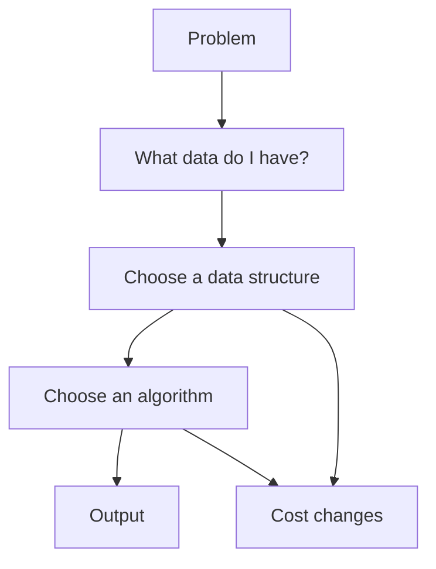

import Head from '@docusaurus/Head';
import Tabs from '@theme/Tabs';
import TabItem from '@theme/TabItem';

<Head>
  <title>What Is DSA? | CompilerSutra</title>
  <meta name="description" content="A beginner-friendly explanation of data structures and algorithms, why they belong together, and how to choose both for a problem." />
  <meta name="keywords" content="data structures, algorithms, DSA, beginner computer science, complexity, hash map, array, linked list, stack, queue, algorithm design" />
  <link rel="canonical" href="https://www.compilersutra.com/docs/dsa/foundations/what-is-dsa/" />
  <meta property="og:type" content="article" />
  <meta property="og:title" content="What Is DSA? | CompilerSutra" />
  <meta property="og:description" content="A beginner-friendly explanation of data structures and algorithms, why they belong together, and how to choose both for a problem." />
  <meta property="og:url" content="https://www.compilersutra.com/docs/dsa/foundations/what-is-dsa/" />
  <meta property="og:image" content="https://www.compilersutra.com/img/dsa/foundations/dsa-foundations-data-vs-algorithm-v2.png" />
  <meta property="og:image:alt" content="CompilerSutra illustration showing data and algorithm as two parts of the same problem-solving process" />
  <meta name="twitter:card" content="summary_large_image" />
  <meta name="twitter:title" content="What Is DSA? | CompilerSutra" />
  <meta name="twitter:description" content="A beginner-friendly explanation of data structures and algorithms, why they belong together, and how to choose both for a problem." />
  <meta name="twitter:image" content="https://www.compilersutra.com/img/dsa/foundations/dsa-foundations-data-vs-algorithm-v2.png" />
</Head>

# What Is DSA?

DSA is short for **data structures and algorithms**.

That sounds like one subject, but it is really two ideas that work together:

- **Data structures** decide how information is stored.
- **Algorithms** decide what steps you take with that information.

If you choose the wrong storage shape, even a good algorithm can become awkward.
If you choose the wrong steps, even a good storage shape can feel slow.

<div style={{display: 'grid', gap: '1.5rem', gridTemplateColumns: 'repeat(auto-fit, minmax(280px, 1fr))', alignItems: 'center', margin: '2rem 0'}}>
  <figure style={{margin: 0}}>
    
    <figcaption style={{fontSize: '0.9rem', color: 'var(--ifm-color-emphasis-700)', marginTop: '0.6rem'}}>
      Data tells you what exists. An algorithm tells you what to do next.
    </figcaption>
  </figure>
  <div>
    <p style={{marginTop: 0}}>
      The easiest beginner mistake is to treat DSA as memorizing names.
      That is not the goal.
    </p>
    <p>
      The real goal is to learn how to store information and process it in a way that fits the problem.
    </p>
  </div>
</div>

## Table of Contents

- [Introduction](#introduction)
- [Why Learn This?](#why-learn-this)
- [Real-Life Example](#real-life-example)
- [Intuition](#intuition)
- [Definition](#definition)
- [Visualization](#visualization)
- [Step-by-Step Explanation](#step-by-step-explanation)
- [Dry Run](#dry-run)
- [Code](#code)
- [Complexity](#complexity)
- [Comparison Tables](#comparison-tables)
- [Real Applications](#real-applications)
- [Advantages](#advantages)
- [Limitations](#limitations)
- [Common Mistakes](#common-mistakes)
- [Memory Tricks](#memory-tricks)
- [Interview Questions](#interview-questions)
- [FAQs](#faqs)
- [Practice Problems](#practice-problems)
- [Summary](#summary)
- [Read Next](#read-next)
- [References](#references)

## Introduction

Imagine you are making a revision planner for exams.

You need to store topic names, due dates, scores, and progress.
You also need to sort topics, find one topic quickly, and update it when you finish a revision.

That is a DSA problem.

## Why Learn This?

DSA matters because real programs are full of choices like these:

- Should I store items in a list, a map, or a tree?
- Should I scan everything or look up one thing directly?
- Should I keep order, or should I optimize lookup?
- Should I use extra memory to save time?

If you understand DSA, these choices stop feeling random.
You start making them on purpose.

## Real-Life Example

Think about a school notebook.

If you keep topics in one long row, it is easy to write them down.
If you want to find one topic fast, a row is not always the best shape.
If you want to group topics by subject or by date, you may need a different structure.

Now add action.

You may want to:

- add a new topic,
- remove a finished topic,
- count how many times a topic appears,
- or sort topics by priority.

The notebook layout is the data structure.
The way you manage the notebook is the algorithm.

## Intuition

The simplest way to think about DSA is this:

- **Data structure** answers: "Where and how should I keep the information?"
- **Algorithm** answers: "What steps should I follow?"

That is why they belong together.

The same information can be stored in different shapes.
The same task can be solved with different steps.
Good DSA means matching both to the problem.

## Definition

In plain language:

- A **data structure** is an organized way to store data so operations become easier.
- An **algorithm** is a finite, ordered set of steps that transforms input into output.
- **DSA** is the study and practice of using both together.

This is the same broad framing used in standard algorithms courses and textbooks, including MIT OCW and CLRS. See the references at the end.

<details>
<summary>Advanced Explanation</summary>

The reason DSA is treated as one subject is that structure affects cost.

If you store data in a shape that supports fast lookup, you may spend less time searching.
If you store data in a shape that supports fast insertion, you may spend less time updating.
An algorithm is then chosen to use those strengths.

That trade-off is the heart of computer science.

</details>

## Visualization

Read the diagram from top to bottom.



The picture shows a simple rule:

- first understand the problem,
- then choose the storage shape,
- then choose the steps,
- then check the cost.

## Step-by-Step Explanation

When you face a problem, ask these questions in order:

1. What information do I need to store?
2. What operations will happen most often?
3. Do I need fast lookup, fast insert, fast delete, or fast ordering?
4. Which data structure fits those operations?
5. Which algorithm uses that structure well?

For example:

- If you need to keep items in order, an array is often a good starting point.
- If you need quick name-based lookup, a hash map is often better.
- If you need a sorted view, a tree-based structure may help.

The key idea is not to memorize a single winner.
The key idea is to match the tool to the job.

## Dry Run

Suppose a student keeps these study topics for one day:

`arrays`, `strings`, `arrays`, `sorting`

The goal is to count how many times each topic appears.

Dry run:

| Step | Topic | Count map |
| --- | --- | --- |
| 1 | arrays | arrays: 1 |
| 2 | strings | arrays: 1, strings: 1 |
| 3 | arrays | arrays: 2, strings: 1 |
| 4 | sorting | arrays: 2, strings: 1, sorting: 1 |

The data structure is a map.
The algorithm is one pass through the list.
Together, they solve the problem cleanly.

## Code

Here is the same idea in three languages.
The data structure is a hash map, and the algorithm is a single scan.

<Tabs>
<TabItem value="cpp" label="C++">

```cpp
#include <iostream>
#include <unordered_map>
#include <vector>
#include <string>
using namespace std;

int main() {
    vector<string> topics = {"arrays", "strings", "arrays", "sorting"};
    unordered_map<string, int> count;

    for (const string& topic : topics) {
        count[topic]++;
    }

    for (const auto& entry : count) {
        cout << entry.first << ": " << entry.second << '\n';
    }
    return 0;
}
```

</TabItem>
<TabItem value="python" label="Python">

```python
topics = ["arrays", "strings", "arrays", "sorting"]
count = {}

for topic in topics:
    count[topic] = count.get(topic, 0) + 1

for topic, total in count.items():
    print(f"{topic}: {total}")
```

</TabItem>
<TabItem value="java" label="Java">

```java
import java.util.HashMap;
import java.util.Map;

public class Main {
    public static void main(String[] args) {
        String[] topics = {"arrays", "strings", "arrays", "sorting"};
        Map<String, Integer> count = new HashMap<>();

        for (String topic : topics) {
            count.put(topic, count.getOrDefault(topic, 0) + 1);
        }

        for (Map.Entry<String, Integer> entry : count.entrySet()) {
            System.out.println(entry.getKey() + ": " + entry.getValue());
        }
    }
}
```

</TabItem>
</Tabs>

### What the code teaches

- The list holds the raw data.
- The map stores the result in a way that is easy to update.
- The loop is the algorithm.
- The choice of structure changes the cost of the solution.

## Complexity

For the counting example above, let `n` be the number of topics and `k` be the number of distinct topics.

| Operation | Best | Average | Worst | Why |
| --- | --- | --- | --- | --- |
| Scan the list once | `O(n)` | `O(n)` | `O(n)` | Every item must be visited at least once. |
| Insert or update in a hash map | `O(1)` | `O(1)` | `O(n)` | Average lookup is fast, but collisions can hurt the worst case. |
| Store the final counts | `O(k)` | `O(k)` | `O(k)` | Only distinct topics are kept. |

The important intuition is simple:

- a better structure can reduce repeated work,
- a better algorithm can reduce unnecessary steps,
- together they determine the real cost.

<details>
<summary>Advanced Explanation</summary>

Complexity is not a score for the code style.
It is a way to estimate how work grows as input grows.

That is why engineers and competitive programmers care about big-O notation.
It helps you predict whether a solution stays practical when the input becomes large.

</details>

## Comparison Tables

### Data vs Information

| Aspect | Data | Information |
| --- | --- | --- |
| Meaning | Raw facts or values | Data that has been organized or interpreted |
| Example | `42`, `CompilerSutra`, `2026-07-02` | "The next revision is due today" |
| Role in DSA | Input you store | Useful meaning you derive from input |

### Program vs Algorithm

| Aspect | Program | Algorithm |
| --- | --- | --- |
| Meaning | A set of instructions written in a language | A step-by-step method for solving a problem |
| Depends on syntax | Yes | No |
| Can be described in pseudocode | No | Yes |
| Example | A Python script | Binary search, BFS, insertion sort |

### Array vs Linked List

| Aspect | Array | Linked List |
| --- | --- | --- |
| Layout | Contiguous memory | Nodes connected by pointers |
| Index access | Fast | Slow |
| Insert in middle | Can be expensive | Can be easier if node is known |
| Good for | Ordered data and indexing | Frequent insertion and deletion in the middle |

### Stack vs Queue

| Aspect | Stack | Queue |
| --- | --- | --- |
| Order rule | Last In, First Out | First In, First Out |
| Real-life example | Undo history | Waiting line |
| Good for | Backtracking, function calls, parsing | Scheduling, buffering, task processing |

### Hash Map vs Tree Map

| Aspect | Hash Map | Tree Map |
| --- | --- | --- |
| Lookup | Average fast | Slower than hash map on average |
| Order | Not sorted by key | Keys stay sorted |
| Good for | Fast key lookup and counting | Sorted traversal and range-based work |

## Real Applications

DSA is used everywhere, even when people do not name it directly.

- **Google Search** uses indexing and fast lookup ideas to find relevant content quickly.
- **Linux** uses data structures in schedulers, caches, file systems, and kernel tables.
- **Databases** use trees, hash tables, and indexes to speed up reads and writes.
- **Browsers** use trees for the DOM and queues for task scheduling.
- **Compilers** use graphs, trees, tables, and passes to represent and transform programs.
- **AI** systems use arrays, tensors, graphs, and queues to process data efficiently.
- **Robotics** uses graphs, queues, and state models for planning and control.
- **Cloud Computing** uses queues, hash maps, and distributed data layouts for scale.
- **Operating Systems** use queues, trees, heaps, and tables for process management.
- **Games** use arrays, grids, graphs, and queues for simulation, AI, and rendering.

The exact implementation changes from system to system.
The pattern stays the same: choose storage and steps that fit the work.

## Advantages

- It helps you solve problems in a structured way.
- It improves speed and memory use.
- It makes code easier to reason about.
- It helps you explain trade-offs clearly.
- It gives you vocabulary for interviews and code reviews.

## Limitations

- No single data structure is best for every task.
- A fast structure can still be a bad fit if the operations are wrong.
- A simple algorithm can become slow on large inputs.
- A good idea still needs testing on edge cases.

## Common Mistakes

1. Treating DSA as memorizing definitions instead of learning how to choose tools.
2. Picking a data structure before understanding the operations.
3. Ignoring whether order matters.
4. Ignoring whether fast lookup matters more than fast insertion.
5. Writing code before restating the problem in plain language.
6. Forgetting to estimate time and space cost.
7. Using an array when frequent middle insertions are the main task.
8. Using a hash map when sorted order is required.
9. Mixing up a program with an algorithm.
10. Assuming one solution style works for every problem.

## Memory Tricks

- **Data is what you keep. Algorithm is what you do.**
- **Shape first, steps second.**
- **Lookup, insert, delete, order, and scan** are the five questions to ask.
- **If the task is counting, think map.**
- **If the task is keeping order, think array or list.**

## Interview Questions

### Easy

1. What is the difference between data and an algorithm?
2. Why do we study data structures and algorithms together?
3. Give one real-life example of a data structure.

### Medium

1. When would you prefer a hash map over an array?
2. Why can the same problem have multiple valid solutions?
3. How does the choice of data structure affect time complexity?

### Hard

1. How would you design a study tracker that supports fast lookup and sorted review order?
2. Why can a solution with the right algorithm still be slow in practice?

## FAQs

1. **What does DSA stand for?** DSA stands for data structures and algorithms.
2. **Is DSA only for interviews?** No. It is used in real software, not just interviews.
3. **Why are data structures important?** They control how information is stored and accessed.
4. **Why are algorithms important?** They control the steps used to solve a problem.
5. **Should I learn algorithms before data structures?** No. Learn them together.
6. **Is an array a data structure?** Yes.
7. **Is sorting an algorithm?** Yes.
8. **Is a program the same as an algorithm?** No. A program is written code; an algorithm is the method.
9. **What is the simplest data structure to start with?** An array or list is usually the easiest start.
10. **What is the simplest algorithm to understand?** A linear scan is a good first example.
11. **Why do we care about big-O notation?** It helps estimate how cost grows with input size.
12. **Is the fastest algorithm always the best?** No. It may use too much memory or be too hard to maintain.
13. **What is a hash map used for?** Fast key-based lookup and counting.
14. **What is a stack used for?** Last-in, first-out tasks like undo or parsing.
15. **What is a queue used for?** First-in, first-out tasks like scheduling.
16. **Why do some structures use more memory?** They store extra links, tables, or helper information.
17. **Can one problem have many valid data structures?** Yes.
18. **Can one problem have many valid algorithms?** Yes.
19. **Do I need advanced math to start DSA?** No. Start with logic and simple cost ideas.
20. **What should I do when I get stuck?** Write down the data, operations, and constraints first.
21. **What is the best way to practice DSA?** Solve small problems and explain your choice out loud.
22. **Is DSA only about coding?** No. It is also about thinking and modeling.
23. **Why do interviews ask DSA questions?** They test problem solving, trade-offs, and clarity.
24. **How do I know which structure to choose?** Start from the operations you need most often.
25. **What should I read after this page?** Read the Data page, then Algorithm, then Arrays.

## Practice Problems

### Easy

- Store your daily study topics in a list and print them in order.
- Count how many times each subject appears in a revision schedule.

### Medium

- Build a task list that can find a task by name quickly.
- Sort a list of revision tasks by priority and deadline.

### Hard

- Design a system that stores tasks in order and also supports quick lookup by name.
- Compare the cost of solving the same problem with a list, a hash map, and a tree-based structure.

### Challenge

- Explain, in your own words, why the same information may need a different structure for search, update, and sorting.

## Summary

- DSA means data structures and algorithms.
- A data structure stores information in a useful shape.
- An algorithm is the step-by-step method you apply to that information.
- Good solutions come from choosing both together.
- The best choice depends on the problem, the operations, and the cost you can afford.

## Read Next

- [Data](/docs/dsa/foundations/data/)
- [Algorithm](/docs/dsa/foundations/algorithm/)
- [Arrays](/docs/dsa/foundations/arrays/)
- [Strings](/docs/dsa/foundations/strings/)
- [Searching](/docs/dsa/foundations/searching/)
- [Sorting](/docs/dsa/foundations/sorting/)
- [Stack and Queue](/docs/dsa/foundations/stack-and-queue/)
- [Connected Data](/docs/dsa/foundations/connected-data/)
- [Hash Maps and Complexity](/docs/dsa/foundations/hash-map-and-complexity/)

## Previous Lesson

- [DSA Foundations for Absolute Beginners](/docs/dsa/foundations/)

## Next Lesson

- [Data](/docs/dsa/foundations/data/)

## Related Articles

- [Algorithm](/docs/dsa/foundations/algorithm/)
- [Arrays](/docs/dsa/foundations/arrays/)
- [Strings](/docs/dsa/foundations/strings/)
- [Searching](/docs/dsa/foundations/searching/)
- [Sorting](/docs/dsa/foundations/sorting/)
- [Stack and Queue](/docs/dsa/foundations/stack-and-queue/)
- [Connected Data](/docs/dsa/foundations/connected-data/)
- [Hash Maps and Complexity](/docs/dsa/foundations/hash-map-and-complexity/)

## Learning Path

1. [DSA Foundations for Absolute Beginners](/docs/dsa/foundations/)
2. What Is DSA?
3. [Data](/docs/dsa/foundations/data/)
4. [Algorithm](/docs/dsa/foundations/algorithm/)
5. [Arrays](/docs/dsa/foundations/arrays/)
6. [Strings](/docs/dsa/foundations/strings/)
7. [Searching](/docs/dsa/foundations/searching/)
8. [Sorting](/docs/dsa/foundations/sorting/)
9. [Stack and Queue](/docs/dsa/foundations/stack-and-queue/)
10. [Connected Data](/docs/dsa/foundations/connected-data/)
11. [Hash Maps and Complexity](/docs/dsa/foundations/hash-map-and-complexity/)

## References

- [MIT Press: Introduction to Algorithms, 4th Edition](https://mitpress.mit.edu/9780262046305/introduction-to-algorithms/)
- [MIT OpenCourseWare: 6.006 Introduction to Algorithms](https://ocw.mit.edu/courses/6-006-introduction-to-algorithms-fall-2011/)
- [Princeton: Algorithms, 4th Edition](https://algs4.cs.princeton.edu/home/)
