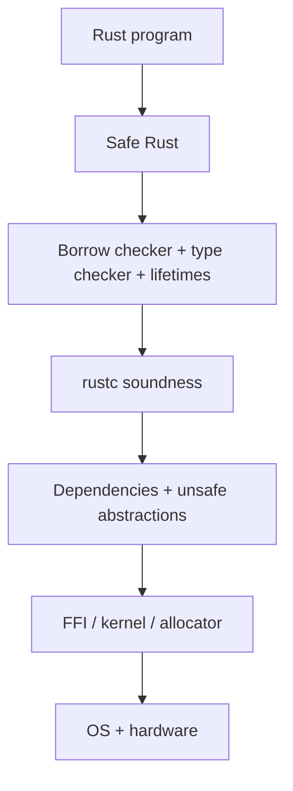
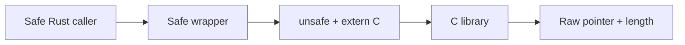
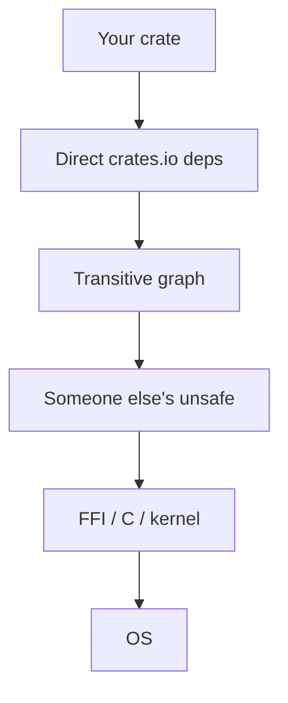
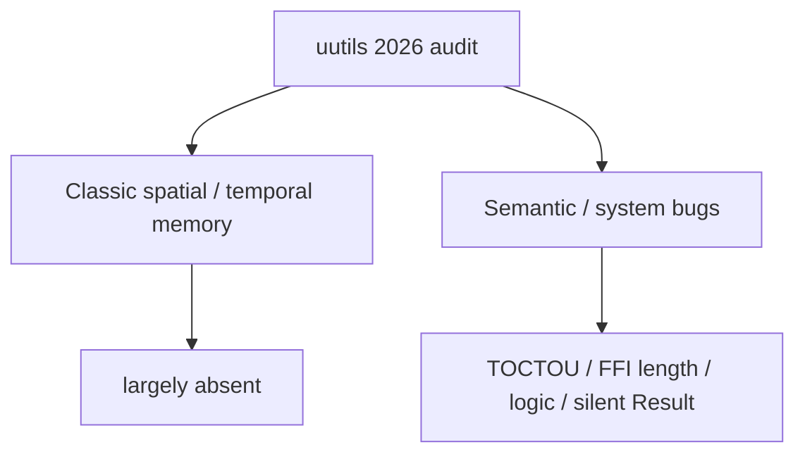
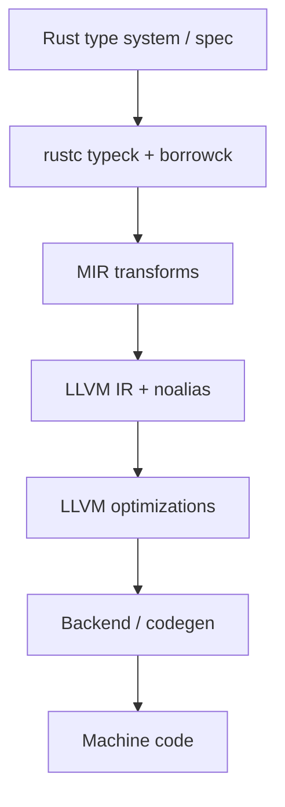
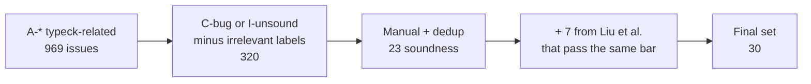
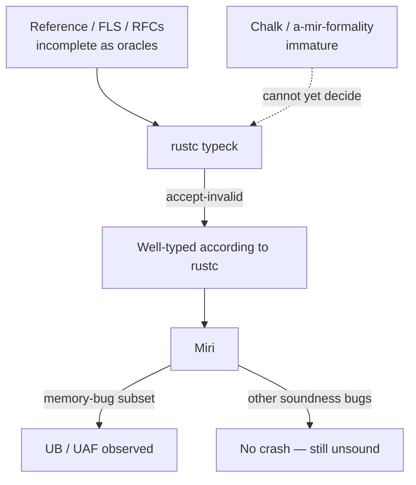
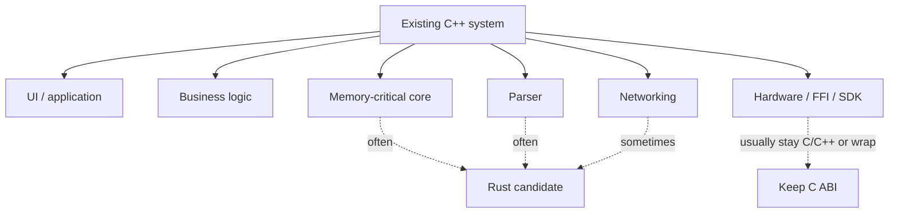

import Tabs from '@theme/Tabs';
import TabItem from '@theme/TabItem';
import Head from '@docusaurus/Head';

<Head>
  <meta name="description" content="What 'Rust is memory safe' actually means: bug-class threat model, ISSTA 2026 rustc soundness study, rustc/MIR/LLVM failure boundaries, unsafe + FFI + deps." />
</Head>

# Rust Claims, a Reality Check: Safety, Tools, and Systems Programming

:::note
Related: [Rust vs Modern C++: Memory Safety Beyond the Hype](/docs/articles/rust-vs-modern-cpp-memory-safety-beyond-the-hype) · [Rustc Pipeline vs C++ Compilation Pipeline](/docs/articles/rustc-pipeline-vs-cpp-compilation-pipeline). Those compare a cache and two compilers. This one tests the slogan against the type system, rustc, LLVM, and production `unsafe`.
:::

I started this the way a lot of compiler people do: take the slogan at face value, then try to break it.

**Rust is memory safe.** That is true enough to be useful, and incomplete enough to be abused. Safe Rust will refuse programs that C and C++ will happily compile. I wanted to know where that refusal actually stops — in `unsafe`, in a dependency, in FFI, or in rustc itself.

The interesting question, after a few evenings of compiling things, was not “is the slogan false.” It was how many extra clauses you have to attach before it becomes a theorem.

## Table of Contents

- [0. What I actually came away with](#0-what-i-actually-came-away-with)
- [1. The claim](#1-the-claim)
- [2. What memory safety actually means](#2-what-memory-safety-actually-means)
- [3. Experiment: C vs C++ vs safe Rust](#3-experiment-c-vs-c-vs-safe-rust)
- [4. Failures that get sold as memory unsafety](#4-failures-that-get-sold-as-memory-unsafety)
- [5. The `unsafe` boundary](#5-the-unsafe-boundary)
- [6. Dependencies and FFI](#6-dependencies-and-ffi)
- [7. Case study: uutils](#7-case-study-uutils)
- [8. The compiler boundary](#8-the-compiler-boundary)
- [9. Research: ISSTA 2026 rustc soundness study](#9-research-issta-2026-rustc-soundness-study)
- [10. Case study: rustc #25860](#10-case-study-rustc-25860)
- [11. What moved, and what did not](#11-what-moved-and-what-did-not)
- [12. Systems language, tools, and 2026 leftovers](#12-systems-language-tools-and-2026-leftovers)
- [13. Where Rust wins, where C++ stays](#13-where-rust-wins-where-c-stays)
- [14. 2026 scorecard](#14-2026-scorecard)
- [15. How to evaluate the next claim](#15-how-to-evaluate-the-next-claim)
- [16. Limits](#16-limits)
- [17. References](#17-references)

## 0. What I actually came away with

If you only want the residue: safe Rust really does make UAF, spatial overflow, and data races on Rust-shared memory hard to write by accident. I could not get rustc 1.93.1 to accept a dangling local or `a[10]` on a `[T; 4]`. gcc and g++ 13.3 built both.

What I expected to vanish, and did not: TOCTOU, silent `Result::ok()`, FFI length mistakes, and — once I stopped looking at application crates — rustc itself. [ISSTA 2026](https://conf.researchr.org/details/issta-2026/issta-2026-research-papers/129/Rust-s-Type-Checker-Implementation-is-Unsound-An-Empirical-Study-on-Soundness-Bugs-i) is the census of that last layer (30 accept-invalid typeck reports; implied bounds and trait objects among the ones that can become memory unsafety). Miri helps *after* rustc already said yes.

Android, Firefox, Cloudflare, and Rust-for-Linux did not adopt a bumper sticker. They adopted a default that moves one class of obligations onto the compiler. The compiler is a stack. That is the whole article.

## 1. The claim

The slide says:

> Rust is memory safe.

After writing the extra clauses out, I landed here — not as a slogan, as the only sentence I could defend:

> **Safe Rust**, compiled by a **sound rustc**, with **no unsound `unsafe` in the crate or its dependencies**, does not exhibit use-after-free, spatial buffer overflow, data races on shared memory, null dereference, or reads of uninitialized memory.

Every extra clause is a place I later found a hole. The borrow checker can be doing its job and that sentence can still be false.

I also had to stop treating three internet fights as one. A 2015 tools rant (can you find `String::replace` in rustdoc search? is rustc still slow? can `Iterator` yield a borrow from `&mut self`?) is not a memory-safety argument. A 2023 “Rust is not a systems language” thread is not a borrow-checker argument. Mixing them is how you get heat and no measurement.

## 2. What memory safety actually means

Memory safety here means: loads, stores, and pointer operations stay inside the object the language can name, for the lifetime the language can prove, without a data race on that memory. It is not “the program does what you meant.”

### 2.1 Threat model — which bug class?

| Bug class | Safe Rust | `unsafe` Rust | C / C++ |
|---|---|---|---|
| Use-after-free | Generally prevented | Possible | Possible |
| Spatial buffer overflow | Generally prevented | Possible | Possible |
| Double free | Generally prevented | Possible | Possible |
| Data race (shared memory) | Generally prevented | Possible | Possible |
| Null dereference | Generally prevented | Possible | Possible |
| Uninitialized read | Generally prevented | Possible | Possible |
| Integer overflow | **Not generally prevented** (debug panic / release wrap; not C-style UB) | Same | Often UB |
| TOCTOU | Not prevented | Not prevented | Not prevented |
| Logic bug | Not prevented | Not prevented | Not prevented |
| Resource exhaustion | Not prevented | Not prevented | Not prevented |
| FFI contract violation | Not prevented at the boundary | Possible | Possible |
| Compiler soundness / miscompile | Not prevented | Not prevented | Not prevented |

A panic on `slice[i]` is the *safe* failure. Continuing past a smashed heap canary is the unsafe one. OOM abort, leaks, and deadlocks were never in the theorem.

### 2.2 The safety stack

Rust’s memory-safety story is not a single mechanism. It is a stack of assumptions:



I used to stop the picture at the borrow checker, because that is where the textbook examples stop. The first production crate I grepped (`unsafe`, `from_raw_parts`, `mmap`) made that feel silly. The hole can sit in rustc, in a dependency, or in a libc length, and the layer above is still “correct.”

## 3. Experiment: C vs C++ vs safe Rust

I compiled the next four on one machine: **rustc 1.93.1**, **gcc/g++ 13.3.0**, `-Wall -Wextra`, no sanitizers unless named. Not a SPEC run. I cared about a simpler question: does the frontend even argue.

### 3.1 Use-after-free

<Tabs groupId="exp-uaf">
  <TabItem value="c" label="C — compiles">

```c
char *p = malloc(32);
free(p);
printf("%s", p);   /* gcc: warning -Wuse-after-free; still links */
```

  </TabItem>
  <TabItem value="cxx" label="C++ — compiles">

```cpp
auto* s = new std::string("secret");
std::string_view v = *s;
delete s;
std::cout << v;    // g++ 13.3: no warning, binary produced
```

  </TabItem>
  <TabItem value="rs" label="Rust — rejected">

```rust
fn dangling() -> &'static str {
    let s = String::from("secret");
    &s
}
```

```text
error[E0515]: cannot return reference to local variable `s`
```

  </TabItem>
</Tabs>

The part that surprised me was not rustc. It was g++: no diagnostic, binary on disk. gcc at least printed `-Wuse-after-free` and then linked anyway. ASan would have caught both C and C++ *if* I had turned it on and hit the path. I did not, on purpose — the slogan is about the default build, not the build you remember to sanitize.

### 3.2 Constant bounds violation

<Tabs groupId="exp-oob">
  <TabItem value="c" label="C / C++ — compiles">

```c
int a[4] = {0};
a[10] = 42;        /* gcc/g++ 13.3 -Wall -Wextra: no diagnostic, binary produced */
```

  </TabItem>
  <TabItem value="rs" label="Rust — rejected">

```rust
let mut a = [0; 4];
a[10] = 42;
```

```text
error: this operation will panic at runtime
  a[10] = 42;
  ^^^^^ index out of bounds: the length is 4 but the index is 10
note: `#[deny(unconditional_panic)]` on by default
```

  </TabItem>
</Tabs>

A runtime `a[i]` in safe Rust still compiles; it panics if `i` is hot. That is memory-safe. People sometimes paste the panic and call it a crash. I would rather have the panic than the smash gcc just emitted with no warning.

### 3.3 TOCTOU — still open

```text
stat(path) / access(path)     ← check
        │
        ▼
   attacker swaps the path
        │
        ▼
open(path) / chmod(path)      ← use
```

Rust `std::fs` is path-shaped. The borrow checker does not see the inode. The 2026 uutils/Canonical CVE set is mostly this class. GNU coreutils has the same class *and* still ships spatial bugs; Rust removed one pile, not both.

### 3.4 FFI — the guarantee stops



Past `extern "C"`, rustc is trusting a C ABI and a comment. Wrong `len`, a `NULL` that the man page calls success, a truncated `mmap` — none of that is a borrow-checker miss. If a talk only shows the first two tests, they showed the claim. The last two are where I spent the rest of the week.

## 4. Failures that get sold as memory unsafety

A few things I kept seeing in comment threads, sold as “so much for memory safety”:

OOM abort and `slice[i]` panic are the *safe* outcomes. `mmap` SIGBUS after another process truncates the file is an `unsafe` + kernel invariant rustc cannot see. `File::from_raw_fd(stdin)` without `dup` is fd ownership, not aliasing UAF. `dd` computing LCM(`ibs`,`obs`) until the allocator gives up is DoS. Integer wrap that never becomes a slice length is defined wrap in release, not a smash. Leaks, deadlocks, logic, TOCTOU — never in the theorem I wrote down in §1.

I am not trying to excuse those bugs. I am trying not to count them as the same bug as `strcpy` past a heap buffer.

## 5. The `unsafe` boundary

`unsafe` is not a confession that the language failed. It is the boundary where the compiler stops proving and starts trusting.

The failure mode that actually hurts is a **safe function** that hides an unsound `unsafe` block. Callers write ordinary Rust and still get undefined behavior. The type system launders the lie:

```rust
pub fn as_static(s: &str) -> &'static str {
    unsafe { std::mem::transmute(s) }
}

fn main() {
    let dangling = {
        let owned = String::from("secret-token-do-not-leak");
        as_static(&owned)
    };
    println!("{dangling}");
}
```

No `unsafe` in `main`. Still UAF. This is the first “gotcha” people mailed me. It does not test the slogan. It tests whether rustc re-proves the body of every `unsafe` block at every call site. It does not. It trusts the signature. `std` is full of `unsafe` for the same reason: hide the dangerous bit. The interesting failure is when that hiding is a lie.

### 5.1 How much `unsafe` is too much?

“500 `unsafe` blocks, still safer than C?” is the wrong yes/no. I have seen both: a crate with two tiny `unsafe` blocks behind a boring API, and a crate that is basically libc with a Rust accent. The first is the design. The second is C with extra steps. The thing I count, informally:

```text
Unsafe surface ≈
    unsafe blocks
  + unsafe fn
  + extern / FFI boundaries
  + from_raw_parts / offset / transmute
  + invariants the compiler cannot see (mmap, fds, kernel)
```

Not a security metric. A way to stop arguing in the abstract. I would rather ship two audited `unsafe` blocks behind a boring safe API than a crate that reimplements libc in every module and still calls itself “memory safe because it is Rust.”

## 6. Dependencies and FFI

The claim already said: *no unsound `unsafe` in the crate **or its dependencies***. That clause needs its own diagram, because modern Rust is not `my code → rustc`.



`cargo audit` finds *known* advisories. It does not prove the graph is sound. I have stopped treating “our crate has no `unsafe`” as a complete sentence once `Cargo.lock` is in the picture.

FFI is the same story with a C ABI instead of a crate name. `CStr::from_ptr`, `from_raw_parts(ptr, len)`, `File::from_raw_fd` — the length came from libc. rustc never saw it.

## 7. Case study: uutils

One production data point, not a meta-analysis.

Ubuntu 25.10 ships uutils (Rust coreutils). Canonical commissioned Zellic ahead of 26.04. The public write-up, [Bugs Rust Won’t Catch](https://corrode.dev/blog/bugs-rust-wont-catch/), is explicit: the CVE pile is TOCTOU, filesystem races, permission-after-create, GNU-parity logic, discarded `Result`s — including [CVE-2026-35344](https://github.com/advisories/GHSA-wh8p-h9hw-x2mc) (`dd` truncation swallowed with `Result::ok()`). The audit did **not** report buffer overflows, use-after-free, or uninitialized reads. GNU coreutils, over a comparable recent window, still shipped heap overwrites and OOB reads (`split --line-bytes`, `od --strings`, `unexpand --tabs`, `numfmt`).



On a 2026 tree I grepped, `src/` still had on the order of two hundred `unsafe` keyword hits (libc, Win32, `mmap`, `from_raw_parts`). One that stuck: BSD `getmntinfo` can return `0` with `NULL`; a wrapper that only rejected `len < 0` then called `slice::from_raw_parts(null, 0)`. That is UB after a wrong libc check, not a missed borrow.

When I started looking at Rust memory-safety claims, I expected the interesting bugs to disappear. They did not. The obvious UAF and bounds bugs became much harder to write. The remaining pile moved toward FFI, filesystem races, swallowed `Result`s, and — once I left application code — the compiler. That is what the audit actually supports. It does not support “Rust has no CVEs,” and it does not support “the rewrite was pointless.”

## 8. The compiler boundary

Safe Rust’s theorem is only as strong as the compiler that implements it. The implementation is a pipeline, and each stage can fail independently.



| Layer | Possible failure |
|---|---|
| Type system / spec | Design hole (implied bounds, variance) |
| rustc typeck / borrowck | Soundness bug: accepts a program the spec forbids |
| MIR transformation | Invalid rewrite of a well-typed program |
| LLVM IR generation | Wrong `noalias`, wrong provenance, wrong ABI |
| LLVM optimization | Miscompile under aliasing rustc promised |
| Backend | Wrong machine code |
| FFI | Contract the IR cannot see |
| `unsafe` abstraction | Invalid invariant rustc was told to trust |

I used to treat `noalias` as a backend curiosity. Then I watched what a dangling `&'static` *means* once it has been blessed by typeck: LLVM is allowed to treat that pointer as a real object and delete “impossible” loads. Memory safety is not the same as memory-model correctness. `&mut` is a uniqueness theorem. rustc lowers that into LLVM `noalias`. Stacked Borrows and Tree Borrows are the operational stories of what those references may do. If the source-level story and the LLVM-level story disagree, “safe” code can be miscompiled, or `unsafe` that was careful under one model is UB under another. Miri can catch some of this. rustc + LLVM is what ships.

A pointer is not an integer. That is the missing sentence in most Rust-vs-C threads. An implied-bounds hole is not a type-theory puzzle. It is a license for the optimizer.

I mapped the IRs in the [rustc vs C++ pipeline piece](/docs/articles/rustc-pipeline-vs-cpp-compilation-pipeline). Below is the empirical evidence that typeck has, in fact, said yes to programs it should have rejected.

## 9. Research: ISSTA 2026 rustc soundness study

Yusung Sim (KAIST), Sukyoung Ryu (KAIST), and Jaemin Hong (UNIST), *[Rust's Type Checker Implementation is Unsound: An Empirical Study on Soundness Bugs in rustc](https://conf.researchr.org/details/issta-2026/issta-2026-research-papers/129/Rust-s-Type-Checker-Implementation-is-Unsound-An-Empirical-Study-on-Soundness-Bugs-i)*, ISSTA 2026 (Oakland, 3–9 October 2026, co-located with SPLASH). Artifact: [Zenodo 10.5281/zenodo.20698055](https://doi.org/10.5281/zenodo.20698055) (analysis sheets for RQ1–RQ4; files restricted at time of writing).

I went looking for a measurement, not another anecdote. This paper is that measurement. It is not a study of buggy Rust *programs*. It is a study of buggy *type checking*: rustc accepted a program the type rules should have rejected.

### 9.1 What they mean by a soundness bug

Rust is marketed as a *type-sound* language: well-typed safe programs do not exhibit the undefined behaviors the type system is designed to rule out, including memory bugs. A **soundness bug in rustc** is narrower and more serious than an ICE or a false compile error:

```text
program P should be rejected at typeck
        │
        ▼
rustc accepts P          ← soundness bug (this paper)
        │
        ▼
P may then exhibit UB, a broken invariant,
or a memory bug — with no `unsafe` in P
```

A crash in rustc is a reliability bug. Rejecting a valid program is a completeness / false-reject bug. **Accepting an invalid program** is the soundness bug. Only the last one can launder a use-after-free through a green `cargo build`.

Liu et al., *An Empirical Study of Bugs in the rustc Compiler* (OOPSLA 2025, [doi:10.1145/3763800](https://doi.org/10.1145/3763800)), is the broader rustc-bug census (crashes, miscompiles, false rejects). Sim, Ryu, and Hong *specialize* that space to type-soundness accept-invalid, and they explicitly reconcile their set against Liu et al.

### 9.2 How the dataset was built

Window: issues reported **1 January 2022 – 1 September 2025**, chosen to stay near recent rustc releases.



| Stage | Count | What it is |
|---|---|---|
| Crawl | 969 | rustc GitHub issues with area labels (`A-*`) tied to type checking |
| Label filter | 320 | Keep `C-bug` or `I-unsound`; drop labels that mark the issue as not a soundness report |
| Manual | 23 | Human read; duplicates removed; “is this actually accept-invalid?” |
| + Liu et al. | +7 of 18 unique-to-Liu | Same manual bar; **final N = 30** |

I almost cited N=23 and stopped. That is what the conference abstract leads with. The artifact is explicit that they then folded in 7 issues from Liu et al. that passed the same manual bar, and the analysis set is 30. Both numbers are real. They measure different cuts. I use 30 as the analyzed set and 23 as the crawl-only set, and I wish the abstract had said that in one sentence.

The artifact’s sheets answer **RQ1–RQ4** along the axes the paper names for every issue:

| Axis | Question the authors ask |
|---|---|
| Affected feature | Which type-system feature is broken? |
| Symptom | *How* is it mishandled (wrong bound, skipped WF, bad coercion, …)? |
| Consequence | What undesirable behavior becomes possible? |
| Triggering features | Which *other* features must combine to fire it? |
| Community consensus | Did rustc maintainers treat it as a real soundness bug? |
| Lifecycle | When introduced, when found, when (if) fixed — Figure 1 in the paper |

### 9.3 Five findings, read as a compiler threat model

The abstract states five results. Mapped onto the safety stack in §2 and the pipeline in §8:

| # | Finding | What it means for the slogan |
|---|---|---|
| 1 | Some soundness bugs, typically fired by **implied bounds** or **trait objects**, compromise **memory safety**. | Not every accept-invalid is a memory bug — but the ones that are, break the bumper sticker with no `unsafe` in the crate. |
| 2 | Sound typeck is strained by **associated types** and by **lifetimes interacting with traits**. | The hard region is not `Vec` indexing. It is the trait solver + region checker + well-formedness. |
| 3 | **Most bugs persist from the introduction of the feature** and take a long time to be discovered. | These are not “a bad weekend in 2024.” They are latent in the feature from day one. #25860 (2015) is the extreme of this shape, even though it sits outside their 2022–2025 *report* window. |
| 4 | **Miri** can detect the subset that becomes a memory bug at run time. **a-mir-formality** and **Chalk** are still too immature to serve as oracles for the other categories. | You cannot test rustc soundness by “running the program” unless the hole is observable as UB. Many holes are “wrong type accepted” with no immediate crash. |
| 5 | The **Rust Reference**, **FLS**, and **RFCs** often do not state the semantics precisely enough to be an oracle. | There is no complete, executable spec against which to differential-test rustc. The implementation *is* the spec more often than compiler engineers would like. |

Finding 1 is why I put the paper in a memory-safety article at all. Finding 5 is why #25860 can sit open since 2015: if implied bounds plus variance are not an executable judgment, you cannot fail rustc with a spec test. You fail it with a program that should not compile and a human argument. That is a slow way to run a compiler test suite.

**Implied bounds** (see the [rustc-dev-guide](https://rustc-dev-guide.rust-lang.org/traits/implied-bounds.html)): from `&'a &'b T` the checker may assume `'b: 'a` without the user writing it. If that assumption is dropped under variance, fn-pointer reification, HRTB supertrait elaboration, or projection in an impl header, you get exactly the lifetime-laundering pattern in §10. Related open issues in the same family include [#100051](https://github.com/rust-lang/rust/issues/100051) (projections in impl headers) and [#84591](https://github.com/rust-lang/rust/issues/84591) (HRTB supertrait upcast). The guide itself lists those three as known unsoundnesses from implicit implied bounds.

**Trait objects** (`dyn Trait`): well-formedness of the object type, lifetime bounds in the vtable, and “does `dyn Trait<P>: Trait<P>` imply the trait’s where-clauses?” have a long `I-unsound` history (e.g. [#44454](https://github.com/rust-lang/rust/issues/44454)). A hole here is not a style issue. It is a lie about what the vtable may be called with.

**Associated types + lifetimes-in-traits**: projections can normalize on one path (call site) and stay unnormalized on another (impl checking), so an implied bound is assumed in the impl body and never proven at the use. That is a solver/WF bug, not an `unsafe` block.

### 9.4 Oracles: what can actually test rustc?

The paper’s second job is to ask whether existing artifacts could *find* these bugs, not just describe them after a human files GitHub issue #NNNNN.

| Oracle | What it is | What the study reports |
|---|---|---|
| [Miri](https://github.com/rust-lang/miri) | MIR interpreter; Stacked/Tree Borrows | Useful **after** rustc accepts the program, if the hole is observable as UB / a memory bug. Not a typeck oracle: it never sees rejected programs. |
| [Chalk](https://github.com/rust-lang/chalk) | Logic-based trait solver (not production rustc) | Potential for trait-related holes; **immature** as a rustc soundness oracle. |
| [a-mir-formality](https://github.com/rust-lang/a-mir-formality) | Formal model of a Rust subset | Same: potential, not yet a drop-in differential test vs rustc. |
| Rust Reference | Informal language doc | Too imprecise to decide many edge cases. |
| [FLS](https://spec.ferrocene.dev/) (Ferrocene Language Specification) | Qualification-oriented spec | Same limit: not a complete executable type-soundness oracle. |
| RFCs | Design intent | Record what was *meant*; not what rustc *does* on the weird program. |

C and C++ also lack a complete executable type-soundness spec, so I am not scoring this as a unique humiliation. The difference is the *claim*. Rust’s slogan depends on typeck being sound. If the oracles cannot decide the edge, what you have is an engineering process — issue tracker, types team, next-gen solver — not a finished theorem.



### 9.5 What this paper does *not* say

- It does not say everyday `String` / `Vec` code is unsafe. The triggers are implied bounds, trait objects, associated types, lifetime–trait interaction.
- It does not measure how often these programs appear on crates.io. N=30 is a census of *reports*, not a prevalence study.
- It does not replace uutils. uutils is about production `unsafe` + TOCTOU. This paper is about rustc accepting *safe* programs it should reject.
- The full per-issue coding sheets live in a restricted artifact. Counts below the five abstract findings (exact split of memory-safety vs other consequences, median days-to-discovery) are not reproduced here as invented numbers.

I am not going to pretend everyday `HashMap` code is in this set. I am also not going to pretend the set is empty. §10 is the one I actually compiled.

## 10. Case study: rustc #25860

Ordinary application bugs live in *your* crate. Compiler soundness bugs live in *every* crate that hits the feature.

| Category | Typical shape |
|---|---|
| Lifetimes / implied bounds | Nested references, outlives dropped under variance |
| Variance | Lifetime expansion through subtyping |
| HRTB | `for<'a>` fn-pointer / trait-bound coercion |
| Trait system | Associated types, projections that skip WF |
| Trait objects | Vtable / type-id assumptions |
| MIR | Invalid transform of a well-typed body |
| LLVM / codegen | Miscompile, wrong `noalias` |

[#25860](https://github.com/rust-lang/rust/issues/25860) is the long-lived lifetime/variance case. Filed May 2015. Still open. The types team has treated a real fix as blocked on binders-with-where-clauses and the next-generation trait solver. [PR #156077](https://github.com/rust-lang/rust/pull/156077) (May 2026) was closed without landing; it did not bootstrap rustc. A June 2026 higher-ranked variant was closed as a duplicate.

The `cve-rs` exploit uses **zero** `unsafe`. A sound helper

```rust
fn lifetime_translator<'a, 'b, T: ?Sized>(
    _val_a: &'a &'b (),
    val_b: &'b T,
) -> &'a T {
    val_b
}
```

is coerced to `for<'x> fn(_, &'x T) -> &'b T`. The implied `'b: 'a` is dropped. A `&&()` with `'static` then “proves” any lifetime:

```rust
const STATIC_UNIT: &&() = &&();

pub fn as_static<T: ?Sized>(x: &T) -> &'static T {
    let f: for<'x> fn(_, &'x T) -> &'static T = lifetime_translator;
    f(STATIC_UNIT, x)
}
```

I compiled this on **rustc 1.93.1**. It accepted it. Zero `unsafe`. After dropping the `String` and allocating something the same size, debug aborted inside `ptr::copy_nonoverlapping`; release printed zeroes. That was the moment the “if it compiled, rustc proved it” sentence died for me — not as a claim about `Vec`, as a claim about rustc.

Everyday application code does not look like HRTB fn-pointer coercion. If you lead a *tools* argument with this file, a competent reply is “compiler bug.” Fair. Lead with rustdoc search and compile wait if that is the argument. I am keeping the file here because I ran it, and because ISSTA 2026 is why I no longer treat it as a one-off.

## 11. What moved, and what did not

I already said this in the uutils section, so I will not dress it up again. Spatial and temporal memory bugs got much rarer in the safe subset. TOCTOU, GNU-parity logic, resource exhaustion, and FFI contracts did not. §3 is the lab version of the first half. uutils is the production version of the second. Waiting on rustc and not finding `replace` from a `String` search box is a third axis entirely — developer time, not CVEs.

## 12. Systems language, tools, and 2026 leftovers

### 12.1 The 2023 thread, compressed

[Why are some people against the Rust-Lang?](https://users.rust-lang.org/t/why-are-some-people-against-the-rust-lang/93906) started from awkward `asm!`, missing protected-mode ops, and “Linux has apt-get, they didn’t add it.” ZiCog’s reply aged well: protected-mode code is a tiny kernel fraction; Linus saying Rust is “not altogether a bad idea” is, for Linus, praise; **Rust and C live together**; nobody is annotating a billion lines of old C.

2026: Rust-for-Linux is in-tree, politically noisy, still mostly C. `asm!` is not the 2015 toy page; privileged ops still live in `.S` / `global_asm!` / a C stub, same as C kernels. kornel’s non-technical pile (anti-hype, C careers, “bugs are bad programmers”) still describes the internet. It does not decide whether `Vec` indexing is bounds-checked.

### 12.2 2015 tools, scored without theology

The useful mid-2010s post skipped the borrow checker and judged the tools. 2026:

| Then | Now | Verdict |
|---|---|---|
| rustdoc: known unknowns; `replace` lives on `str` | `String` lists Deref methods; **search still ignores Deref** | Half-fixed. rust-analyzer is the real fix. |
| rustc is slow; future looks promising | Parallel frontend ~20–30% in tests, not default; Cranelift a few % | Still a tool defect. Promising for a decade. |
| Need type-based serialize | serde + derive | Solved. Fight is zero-copy. |
| Cannot ship apps | `cargo install`, [cargo-dist](https://github.com/axodotdev/cargo-dist), [cargo-binstall](https://github.com/cargo-bins/cargo-binstall) | Solved enough if you opt in. |
| Abstract return types | `impl Trait`, stable 1.26 | Solved. |
| Streaming / lending `Iterator` | GATs exist; **std has no `LendingIterator`** | Same hole. [rust-streaming](https://github.com/emk/rust-streaming). |
| `num` / const generics | `const N: usize` yes; `generic_const_exprs` incomplete | Mostly moved on. |

I actually typed `replace` into rustdoc search on a `String` page. Deref methods are listed if you already know to scroll. Search still does not walk Deref. rust-analyzer does. That was the original hypothesis — rustdoc is good for known unknowns — and it is still true on the website.

If you want to argue in *that* 2015 voice, those three leftovers are the argument. #25860 is a different argument. I keep mixing them in conversation; I am trying not to on the page.

## 13. Where Rust wins, where C++ stays

Do not ask “is Rust better than C++?” Ask **which component benefits from stronger invariants.**



I would reach for Rust on a new parser, a concurrent cache, anything where ownership is the actual problem and the C ABI surface is small enough to wrap. I would not reach for it as a moral upgrade of a 400 kLoC platform SDK wrapper, or a SIMD kernel that is already correct in C++ and paid for. Compile time is not a footnote on those teams. Hardware poke is not a footnote either.

### 13.1 Selective entry, not rewrite

“Rewrite it in Rust” is a meme I am tired of arguing with. New drivers, new Android native code, a sealed cache — those are plans. The [cache comparison](/docs/articles/rust-vs-modern-cpp-memory-safety-beyond-the-hype) is the piece I would send for one greenfield component.

### 13.2 Could C++ adopt the ideas?

It already adopted some: RAII, `unique_ptr` / `shared_ptr`, `std::span`, `string_view` (which also makes dangling easier to type), sanitizers, lifetime profiles, contracts experiments, Safe C++ / circle-style borrow checking. The remaining question is defaults: does C++ need Rust, or does C++ need the dangerous path to stop being the default? Both can be true. Sanitizers are opt-in and miss untested paths; rustc is opt-out for safe code and still has holes in rustc itself.

## 14. 2026 scorecard

| Claim you hear | Fair reading |
|---|---|
| Rust is memory safe. | **Safe** Rust is, modulo rustc soundness and unsound `unsafe` in the dep graph. |
| If it compiles, it cannot dangle. | False as an absolute. True for ordinary safe code that does not hit a compiler hole. ISSTA 2026: 30 rustc accept-invalid reports; #25860 is still open. |
| `unsafe` in `std` means the language is a con. | No. Encapsulation is the point. Unsound encapsulation is the bug. Count surface area. |
| Rust has no memory bugs in production. | Fewer *spatial/temporal* ones. Plenty of TOCTOU, logic, FFI-length. |
| Rust is not a systems language. | It is. It is not a drop-in for every privileged instruction or every C tree. |
| rustdoc and cargo solved onboarding. | rust-analyzer did more than rustdoc search. Compile time and lending iterators did not. |
| Rewrite it in Rust. | Usually a meme. New, sealed components are the realistic path. |

## 15. How to evaluate the next claim

When the next post says Rust “solved memory safety,” I now ask a smaller set of questions than I used to. Is this safe code or a kernel wrapper? Which rustc, and is the hole still open — ISSTA 2026 is the census for 2022–2025 reports; #25860 still is. Which bug class — a TOCTOU CVE does not refute a bounds check, and a GNU `split` heap overwrite does not vanish because Rust can panic. How much `unsafe` and FFI is actually in the tree. What did typeck, MIR, and `noalias` have to get right.

When the post says Rust is overhyped, I ask the reverse: did they show a safe, no-`unsafe`, not-a-compiler-bug UAF? The `transmute` snippet in §5 is not that demo. I compiled that one too. It is the escape hatch.

## 16. Limits

- UAF/OOB snippets: rustc 1.93.1 and gcc/g++ 13.3.0 on one machine; no sanitizers in the “compiles” column.
- #25860 checked on rustc 1.93.1; the tracking issue remains open.
- ISSTA 2026 details follow the [conference abstract](https://conf.researchr.org/details/issta-2026/issta-2026-research-papers/129/Rust-s-Type-Checker-Implementation-is-Unsound-An-Empirical-Study-on-Soundness-Bugs-i) and [artifact record](https://doi.org/10.5281/zenodo.20698055). The per-issue coding sheets were restricted; this article does not invent splits or medians that the public abstract does not state. Abstract N=23 (crawl) vs artifact N=30 (crawl + Liu complement) are both reported.
- uutils remarks are from 2026 public audit writing, not a claim that every Rust CLI is clean.
- Compile-time and rustdoc-search behavior change release to release.
- This article does not measure serde vs rkyv, count in-tree Linux Rust drivers, or treat a soundness-hole SIGSEGV as evidence that typical application Rust is unsafe.

I keep coming back to the 2023 thread because it already had the stance I ended up with, before I had compiled anything: C and Rust can live together; programmer time is still the expensive input; compile-time checking is a bet that machines got cheaper faster than attention did. I just wanted the theorem written down, with the extra clauses visible.

## 17. References

1. [Why are some people against the Rust-Lang?](https://users.rust-lang.org/t/why-are-some-people-against-the-rust-lang/93906), users.rust-lang.org, May 2023.
2. [rust-lang/rust#25860](https://github.com/rust-lang/rust/issues/25860), implied bounds + variance (open since 2015).
3. [PR #156077](https://github.com/rust-lang/rust/pull/156077), attempted fix (closed May 2026, did not land).
4. [cve-rs](https://github.com/Speykious/cve-rs), lifetime expansion in safe Rust.
5. Yusung Sim, Sukyoung Ryu, Jaemin Hong, [Rust's Type Checker Implementation is Unsound: An Empirical Study on Soundness Bugs in rustc](https://conf.researchr.org/details/issta-2026/issta-2026-research-papers/129/Rust-s-Type-Checker-Implementation-is-Unsound-An-Empirical-Study-on-Soundness-Bugs-i), ISSTA 2026 (KAIST / UNIST).
6. Artifact, [10.5281/zenodo.20698055](https://doi.org/10.5281/zenodo.20698055) (RQ1–RQ4 sheets; 969 → 320 → 23 → 30).
7. Zixi Liu, Yang Feng, Yunbo Ni, Shaohua Li, Xizhe Yin, Qingkai Shi, Baowen Xu, Zhendong Su, [An Empirical Study of Bugs in the rustc Compiler](https://doi.org/10.1145/3763800), Proc. ACM Program. Lang. 9, OOPSLA2 (2025).
8. rustc-dev-guide, [Implied bounds](https://rustc-dev-guide.rust-lang.org/traits/implied-bounds.html) (lists #25860, #84591, #100051).
9. [Miri](https://github.com/rust-lang/miri), [Chalk](https://github.com/rust-lang/chalk), [a-mir-formality](https://github.com/rust-lang/a-mir-formality); [Ferrocene Language Specification](https://spec.ferrocene.dev/).
10. [Bugs Rust Won’t Catch](https://corrode.dev/blog/bugs-rust-wont-catch/), uutils / Canonical CVE set.
11. [CVE-2026-35344](https://github.com/advisories/GHSA-wh8p-h9hw-x2mc), uutils `dd` / `Result::ok()`.
12. rustdoc book, [Search](https://doc.rust-lang.org/nightly/rustdoc/read-documentation/search.html) (Deref ignored).
13. [rust-lang/rust#19190](https://github.com/rust-lang/rust/issues/19190), rustdoc methods via auto-deref.
14. Rust project goals, [Promoting Parallel Front End (2026)](https://rust-lang.github.io/rust-project-goals/2026/parallel-front-end.html).
15. Nicholas Nethercote, [How to speed up the Rust compiler in July 2026](https://nnethercote.github.io/2026/07/31/how-to-speed-up-the-rust-compiler-in-july-2026.html).
16. [axodotdev/cargo-dist](https://github.com/axodotdev/cargo-dist), [cargo-binstall](https://github.com/cargo-bins/cargo-binstall).
17. [emk/rust-streaming](https://github.com/emk/rust-streaming).
18. Linus Walleij, [*Rust in Perspective*](https://people.kernel.org/linusw/rust-in-perspective).
19. Ralf Jung et al., Stacked Borrows; Tree Borrows (operational aliasing models; Miri).
20. [Rust vs Modern C++: Memory Safety Beyond the Hype](/docs/articles/rust-vs-modern-cpp-memory-safety-beyond-the-hype).
21. [Rustc Pipeline vs C++ Compilation Pipeline](/docs/articles/rustc-pipeline-vs-cpp-compilation-pipeline).
