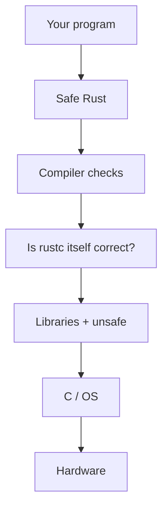

import Tabs from '@theme/Tabs';
import TabItem from '@theme/TabItem';
import Head from '@docusaurus/Head';

<Head>
  <meta name="description" content="Plain English: what 'Rust is memory safe' really means, what it does not cover, and a rustc bug with no unsafe keyword." />
</Head>

# Rust Claims, a Reality Check: Safety, Tools, and Systems Programming

:::note
Related: [Rust vs Modern C++](/docs/articles/rust-vs-modern-cpp-memory-safety-beyond-the-hype) · [How rustc compiles vs C++](/docs/articles/rustc-pipeline-vs-cpp-compilation-pipeline)
:::

People say **Rust is memory safe**. I wanted to know what that actually means. So I compiled small programs, looked at a real Rust project, and read a 2026 paper about bugs in rustc (the Rust compiler).

This is not “Rust is fake.” It is also not “Rust already fixed everything.” It is: the claim is real, but it is smaller than the short sentence on slides.

There are three different fights online. Do not mix them.

1. **Memory safety** — can the program smash memory?
2. **Tools** — is rustc slow? is the docs search bad?
3. **Systems work** — can you write a kernel, or only small apps?

Those are different questions.

## Table of Contents

- [The short answer](#the-short-answer)
- [What “memory safe” means here](#what-memory-safe-means-here)
- [What I compiled](#what-i-compiled)
- [The `unsafe` keyword](#the-unsafe-keyword)
- [Libraries and C code](#libraries-and-c-code)
- [A real project: uutils](#a-real-project-uutils)
- [The compiler can also be wrong](#the-compiler-can-also-be-wrong)
- [A 2026 research paper](#a-2026-research-paper)
- [Bug #25860, which I compiled](#bug-25860-which-i-compiled)
- [Old tool complaints, today](#old-tool-complaints-today)
- [Would I pick Rust?](#would-i-pick-rust)
- [Limits](#limits)
- [References](#references)

## The short answer

**Safe Rust** (code with no `unsafe` keyword) really does stop many memory bugs that C and C++ still allow.

I could not make rustc 1.93.1 accept:

- a pointer to a local `String` after the function ends
- writing `a[10]` on an array of size 4

gcc and g++ 13.3 built both of those.

Rust does **not** magically stop:

- logic bugs (the program does the wrong thing)
- file races (check a path, then someone changes the file)
- mistakes when talking to C
- bugs **inside rustc itself**

A 2026 paper (ISSTA) counted rustc bugs where the compiler said “ok” to code it should have rejected. Miri (a Rust checker) can catch some of those **after** rustc already accepted the code.

Big companies use Rust because it moves one class of bugs to compile time. That is useful. The compiler is still software. Software has bugs.

## What “memory safe” means here

**Memory safety** means: the program only reads and writes memory it is allowed to use, and only while that memory is still alive. Two threads should not write the same memory at the same time with no lock.

It does **not** mean “the program is correct.” A program can be memory-safe and still delete the wrong file.

Simple names:

| Name | Plain meaning |
|---|---|
| Use-after-free (UAF) | Use memory after you freed it |
| Buffer overflow | Write past the end of an array |
| Double free | Free the same memory twice |
| Data race | Two threads touch the same memory in a bad way |
| Null | Use a pointer that is empty |
| Uninit | Read memory you never set |
| TOCTOU | Check a file, then it changes before you use it |
| FFI | Rust calling C (or C calling Rust) |
| Soundness bug | The compiler accepts code it should reject |

| Kind of bug | Safe Rust | `unsafe` or C FFI | C / C++ |
|---|---|---|---|
| UAF, overflow, double-free, data race, null, uninit | Usually stopped | Possible | Possible |
| Integer wrap (numbers too big) | Debug: panic. Release: wrap. Not the same as C “undefined” smash | Same | Often dangerous |
| TOCTOU, logic bugs, out of memory | Not stopped | Not stopped | Not stopped |
| Bad C API / compiler bug | Not stopped | Possible | Possible |

If you write `slice[i]` and `i` is too big, **safe Rust panics** (the program stops). That is the *safe* failure. In C the same index often corrupts memory and keeps running.

I used to think “the borrow checker is the whole story.” Then I searched a real crate for `unsafe`. The hole can be in your `unsafe` block, in a library, in C, or in rustc. The layer above can still look fine.



## What I compiled

Same computer. **rustc 1.93.1**. **gcc/g++ 13.3**. Warnings on. No extra sanitizer tools unless I say so.

### 1. Use memory after free

<Tabs groupId="exp-uaf">
  <TabItem value="c" label="C — still builds">

```c
char *p = malloc(32);
free(p);
printf("%s", p);   /* gcc warns, then still makes a program */
```

  </TabItem>
  <TabItem value="cxx" label="C++ — no warning">

```cpp
auto* s = new std::string("secret");
std::string_view v = *s;
delete s;
std::cout << v;    // g++ 13.3: no warning
```

  </TabItem>
  <TabItem value="rs" label="Rust — error">

```rust
fn dangling() -> &'static str {
    let s = String::from("secret");
    &s
}
```

```text
error[E0515]: cannot return reference to local variable `s`
```

  </TabItem>
</Tabs>

What surprised me was C++, not Rust. g++ made a binary and said nothing. gcc at least warned, then still linked. Tools like AddressSanitizer can catch the C/C++ bugs **if you turn them on**. I did not turn them on. The slogan is about the normal build, not the special test build.

### 2. Write past the array

C and C++, array of 4, write index 10: **no warning**, program built.

Rust:

```text
error: this operation will panic at runtime
  a[10] = 42;
```

If the index is a **variable** (not the number 10 in the source), safe Rust still compiles. At run time it panics if the index is too big. Some people call that a crash. I would rather have a panic than silent memory corruption.

### 3. File race (TOCTOU)

You check a file path. Then someone swaps the file. Then you open the path. The compiler does not see that. Rust `std::fs` uses paths, like many C programs. The 2026 Ubuntu / uutils security review found many bugs of this kind. GNU coreutils has those too — **and** still has overflow bugs.

### 4. Talking to C

When Rust calls C (`extern "C"`), rustc trusts the C side. Wrong length. A null pointer that the C docs call “success.” A memory map that another process shrinks. That is not the borrow checker failing. That is a contract with C.

If a talk only shows tests 1 and 2, they showed the claim. Tests 3 and 4 are the rest of the story.

People also point at “out of memory, process dies” or “program panics” and say Rust is not safe. Those are not the same as `strcpy` past a buffer. They are still bugs. They are a different class.

## The `unsafe` keyword

`unsafe` means: “compiler, trust me here.” It is not a confession that Rust failed. It is the door out of the proof.

This is the first trick people send:

```rust
pub fn as_static(s: &str) -> &'static str {
    unsafe { std::mem::transmute(s) }
}
```

`main` has no `unsafe`. The program can still use memory after it is freed. Why? rustc checks the **function type**, not the proof inside `unsafe`. `std` uses `unsafe` too, on purpose: hide the dangerous bit. The bad case is when that hiding is a lie.

Is a project with 500 `unsafe` blocks still safer than C? There is no yes/no. Two small `unsafe` blocks behind a clean API is the design. A crate that is basically C with Rust syntax is C with extra steps. I count, roughly: `unsafe` blocks, `unsafe fn`, `extern`, raw pointer tricks, and things rustc cannot see (file descriptors, `mmap`). That is not a science score. It is a way to talk in numbers.

## Libraries and C code

“Our crate has no `unsafe`” is not the full story. Your `Cargo.lock` may pull in other crates that do. `cargo audit` finds **known** security reports. It does not prove every library is correct.

Calling C is the same idea with a C API instead of a crate name. `from_raw_parts(pointer, length)` — the length came from C. rustc never checked it.

## A real project: uutils

**uutils** is GNU coreutils rewritten in Rust (`ls`, `dd`, `cp`, …). Ubuntu 25.10 ships it. Canonical paid a security firm (Zellic) to review it.

The public write-up [Bugs Rust Won’t Catch](https://corrode.dev/blog/bugs-rust-wont-catch/) says: the CVEs were mostly file races, permission bugs, “not the same as GNU,” and ignored errors. One example: [CVE-2026-35344](https://github.com/advisories/GHSA-wh8p-h9hw-x2mc) — `dd` hid a truncate error with `.ok()`. They did **not** report classic overflow / UAF. GNU, in a similar time window, still had heap overwrites.

I searched a 2026 tree. About two hundred `unsafe` hits in `src/`. One bad case: a BSD C function can return length 0 and a null pointer. The Rust wrapper only rejected negative length, then built a slice from null. That is undefined behavior from a wrong C check.

I expected the “interesting” bugs to go away. They did not. Overflow and UAF got much harder. The remaining bugs moved to files, C, ignored `Result`s, and later the compiler. That is not “Rust has no CVEs.” It is also not “the rewrite was useless.”

## The compiler can also be wrong

Safe Rust is only as strong as rustc. Code goes: types → rustc checks → MIR (Rust’s middle IR) → LLVM → machine code. Any step can fail.

I used to ignore LLVM `noalias`. Then I saw what happens if rustc **wrongly** says a pointer lives forever (`&'static`). LLVM may treat that pointer as real and delete loads it thinks are impossible. **Memory safety** (don’t smash the heap) is not the same as **memory-model rules** (what the optimizer is allowed to assume). `&mut` means “only I can write.” rustc turns that into `noalias` for LLVM. If those two stories disagree, even “safe” code can be compiled wrong.

A pointer is not “just a number.” Most internet fights skip that. A hole in lifetime rules is not a word game. It is permission for the optimizer.

The [pipeline article](/docs/articles/rustc-pipeline-vs-cpp-compilation-pipeline) draws those steps.

## A 2026 research paper

Yusung Sim, Sukyoung Ryu (KAIST), Jaemin Hong (UNIST) wrote [Rust's Type Checker Implementation is Unsound](https://conf.researchr.org/details/issta-2026/issta-2026-research-papers/129/Rust-s-Type-Checker-Implementation-is-Unsound-An-Empirical-Study-on-Soundness-Bugs-i) for ISSTA 2026. Extra files: [Zenodo](https://doi.org/10.5281/zenodo.20698055).

This paper is **not** “Rust apps have bugs.” It is “rustc sometimes accepts programs it should reject.”

Three different compiler bugs:

1. rustc **crashes** — annoying, not a memory smash in your app
2. rustc **rejects good code** — also annoying
3. rustc **accepts bad code** — this is the soundness bug. This one can hide a use-after-free behind `cargo build` with no `unsafe`

Another paper (Liu et al., OOPSLA 2025) counted many kinds of rustc bugs. This ISSTA paper looks only at type (3), and compares with Liu.

How they built the list: GitHub issues from Jan 2022 to Sep 2025 about types (969) → bug / unsound labels (320) → read by hand (**23**). The short abstract says 23. I almost stopped there. The extra files add 7 more from Liu. Final study set: **30**. I wish the abstract said both numbers.

What they found, in simple words:

- Some of these bugs (often “implied bounds” or trait objects) can break memory safety.
- Hard cases are associated types and lifetimes mixed with traits — not `Vec` indexing.
- Many bugs were there from the day the feature shipped. Issue #25860 (2015) is the long example, even though it is older than their 2022–2025 window.
- **Miri** can catch the ones that blow up at run time. Other formal tools (Chalk, a-mir-formality) are not ready as a full test of rustc.
- The official docs are often not precise enough to use as an automatic test.

Why #25860 can stay open for years: if the rule is not written as a machine-checkable test, you cannot fail rustc with a spec. You fail it with a program plus a human saying “this should not compile.” That is slow.

The [compiler guide](https://rustc-dev-guide.rust-lang.org/traits/implied-bounds.html) already lists this family: #25860, [#84591](https://github.com/rust-lang/rust/issues/84591), [#100051](https://github.com/rust-lang/rust/issues/100051).

C and C++ also do not have a full machine spec of “this must be rejected.” I am not picking on Rust for that. The difference is the **claim**. Rust’s short sentence needs rustc to be right. If tests cannot decide the edge, you have a team process (issues, types team, new solver), not a finished proof.

Normal `HashMap` code is not this set. The set is also not empty. Next is the file I compiled.

## Bug #25860, which I compiled

[#25860](https://github.com/rust-lang/rust/issues/25860) has been open since May 2015. A real fix is waiting on bigger type-system work. [PR #156077](https://github.com/rust-lang/rust/pull/156077) in May 2026 was closed. It did not even build rustc.

The [cve-rs](https://github.com/Speykious/cve-rs) example uses **zero** `unsafe`. A helper that is fine on its own:

```rust
fn lifetime_translator<'a, 'b, T: ?Sized>(
    _val_a: &'a &'b (),
    val_b: &'b T,
) -> &'a T {
    val_b
}
```

gets copied as a function pointer in a way that drops a lifetime rule. Then a dummy `&&()` is used to pretend a short-lived value lives forever:

```rust
const STATIC_UNIT: &&() = &&();

pub fn as_static<T: ?Sized>(x: &T) -> &'static T {
    let f: for<'x> fn(_, &'x T) -> &'static T = lifetime_translator;
    f(STATIC_UNIT, x)
}
```

I compiled this with **rustc 1.93.1**. It accepted it. I dropped a `String`, allocated something the same size, then read the “forever” string. Debug build stopped inside a copy check. Release printed zeros. That is when “if it compiled, rustc proved it” died for me — not for normal `Vec` code, for rustc.

Normal app code does not look like this. If you start a tools argument with this file, people will say “that is a compiler bug.” They are right. Start with docs search if that is your point. I keep this file because I ran it.

## Old tool complaints, today

Around 2015, some Rust users said: skip the borrow-checker fight, look at the tools. Some of that is fixed: serde, `impl Trait` (since 1.26), `cargo install` and cargo-dist, `const N: usize`. Three things are not.

**Docs search.** I typed `replace` in rustdoc on the `String` page. The methods from `str` are listed if you scroll. Search still does not find them through `Deref`. rust-analyzer (the editor helper) does. The website is still weak for “I don’t know the name yet.”

**Compile time.** rustc is still slow. A parallel frontend is a 2026 goal (about 20–30% faster in tests, not the default yet). Small extra wins exist. People have said “the future looks good” for a long time.

**Streaming iterators.** A standard `Iterator` cannot yield a borrow from inside itself. You still cannot write, in std, a parser that hands out `&str` from its own buffer. Other crates exist ([rust-streaming](https://github.com/emk/rust-streaming)).

A May 2023 [forum thread](https://users.rust-lang.org/t/why-are-some-people-against-the-rust-lang/93906) asked why people dislike Rust. Some said inline assembly is awkward, or “Linux only has apt-get, they did not add Rust.” Fair replies: a tiny part of a kernel is special CPU instructions; Rust and C can live together; nobody will rewrite a billion lines of old C. In 2026, some Linux kernel code is Rust, most is still C. Special CPU ops still live in `.S` assembly files, like in C kernels. A lot of online hate is hype-backlash, not “`Vec` has no bounds check.”

Docs search and compile wait are one argument. #25860 is another. I mix them when I talk. They are not the same.

## Would I pick Rust?

Yes, for new code where ownership is hard: a parser, a cache with threads, a small C API you can wrap.

No, as a “moral upgrade” of a huge old C/C++ SDK wrapper, or a math kernel that is already correct and fast in C++. Waiting on rustc is a real cost on those teams.

“Rewrite it in Rust” is usually a bad plan. New drivers or a new sealed component can be a plan. For one new cache, see the [Rust vs C++ comparison](/docs/articles/rust-vs-modern-cpp-memory-safety-beyond-the-hype).

C++ already copied some ideas: RAII, smart pointers, `span`, sanitizers. `string_view` also made dangling pointers easier to type. The real question is the **default**. Sanitizers are extra flags and miss paths you never run. rustc checks safe code by default — and rustc still has holes.

When someone says “Rust solved memory safety,” I now ask: safe code or kernel wrapper? which rustc? which kind of bug? how much `unsafe` is in the tree? When someone says “Rust is hype,” I ask: did they show a use-after-free with no `unsafe` and not a known compiler bug? The `transmute` snippet is not that demo. That is the escape hatch. I compiled that too.

## Limits

The small C/C++/Rust programs and #25860 were run on rustc 1.93.1 and gcc 13.3 on one machine. #25860 is still open. ISSTA numbers come from the public abstract and artifact; I did not invent extra stats. uutils notes come from public 2026 write-ups, not “every Rust CLI is clean.” Docs search and compile speed change every release.

C and Rust can live together. People are still the expensive part. Checking more at compile time is a bet that computers got cheaper faster than human attention. I just wanted the extra words on the claim written down.

## References

1. [Why are some people against the Rust-Lang?](https://users.rust-lang.org/t/why-are-some-people-against-the-rust-lang/93906), May 2023.
2. [rust-lang/rust#25860](https://github.com/rust-lang/rust/issues/25860).
3. [PR #156077](https://github.com/rust-lang/rust/pull/156077) (closed, did not land).
4. [cve-rs](https://github.com/Speykious/cve-rs).
5. Sim, Ryu, Hong, [Rust's Type Checker Implementation is Unsound](https://conf.researchr.org/details/issta-2026/issta-2026-research-papers/129/Rust-s-Type-Checker-Implementation-is-Unsound-An-Empirical-Study-on-Soundness-Bugs-i), ISSTA 2026.
6. Artifact [10.5281/zenodo.20698055](https://doi.org/10.5281/zenodo.20698055).
7. Liu et al., [Bugs in the rustc Compiler](https://doi.org/10.1145/3763800), OOPSLA 2025.
8. rustc-dev-guide, [Implied bounds](https://rustc-dev-guide.rust-lang.org/traits/implied-bounds.html).
9. [Miri](https://github.com/rust-lang/miri), [Chalk](https://github.com/rust-lang/chalk), [a-mir-formality](https://github.com/rust-lang/a-mir-formality), [FLS](https://spec.ferrocene.dev/).
10. [Bugs Rust Won’t Catch](https://corrode.dev/blog/bugs-rust-wont-catch/).
11. [CVE-2026-35344](https://github.com/advisories/GHSA-wh8p-h9hw-x2mc).
12. rustdoc [Search](https://doc.rust-lang.org/nightly/rustdoc/read-documentation/search.html); [#19190](https://github.com/rust-lang/rust/issues/19190).
13. [Parallel Front End (2026)](https://rust-lang.github.io/rust-project-goals/2026/parallel-front-end.html); Nethercote, [July 2026](https://nnethercote.github.io/2026/07/31/how-to-speed-up-the-rust-compiler-in-july-2026.html).
14. [cargo-dist](https://github.com/axodotdev/cargo-dist), [cargo-binstall](https://github.com/cargo-bins/cargo-binstall), [rust-streaming](https://github.com/emk/rust-streaming).
15. Walleij, [*Rust in Perspective*](https://people.kernel.org/linusw/rust-in-perspective).
16. [Rust vs Modern C++](/docs/articles/rust-vs-modern-cpp-memory-safety-beyond-the-hype); [Rustc pipeline](/docs/articles/rustc-pipeline-vs-cpp-compilation-pipeline).
