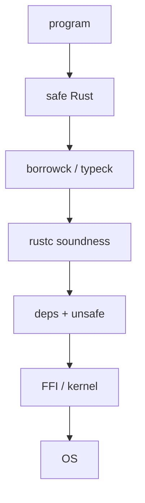

import Tabs from '@theme/Tabs';
import TabItem from '@theme/TabItem';
import Head from '@docusaurus/Head';

<Head>
  <meta name="description" content="What 'Rust is memory safe' actually means after compiling C/C++/Rust demos, reading uutils, and the ISSTA 2026 rustc soundness study." />
</Head>

# Rust Claims, a Reality Check: Safety, Tools, and Systems Programming

:::note
Related: [Rust vs Modern C++](/docs/articles/rust-vs-modern-cpp-memory-safety-beyond-the-hype) · [Rustc vs C++ pipeline](/docs/articles/rustc-pipeline-vs-cpp-compilation-pipeline)
:::

I started this the way I start most compiler arguments: take the slogan literally, then try to make rustc accept something it should not.

**Rust is memory safe.** After a few evenings with rustc 1.93.1 and gcc 13.3, that sentence is still useful. It is also missing half its assumptions. I wanted the missing half on the page — not as a takedown, as the extra clauses I had to write down before I could defend the claim.

I also had to stop treating three fights as one. A 2015 tools rant (can you find `replace` from a `String` page? is rustc still slow?) is not a memory-safety argument. A 2023 “not a systems language” thread is not a borrow-checker argument. Mixing them is how comment sections stay loud.

## Table of Contents

- [Where I landed](#where-i-landed)
- [The sentence I can actually defend](#the-sentence-i-can-actually-defend)
- [Which bugs are even in scope](#which-bugs-are-even-in-scope)
- [Four programs I compiled](#four-programs-i-compiled)
- [`unsafe`, deps, FFI](#unsafe-deps-ffi)
- [uutils](#uutils)
- [The compiler is in the threat model](#the-compiler-is-in-the-threat-model)
- [ISSTA 2026](#issta-2026)
- [#25860, on this machine](#25860-on-this-machine)
- [Tools leftover from 2015](#tools-leftover-from-2015)
- [Would I use it](#would-i-use-it)
- [Limits](#limits)
- [References](#references)

## Where I landed

Safe Rust really does make use-after-free, spatial overflow, and data races on Rust-shared memory hard to write by accident. I could not get rustc to accept a dangling local or `a[10]` on a `[T; 4]`. gcc and g++ built both.

What I expected to vanish, and did not: TOCTOU, swallowed `Result`s, FFI length mistakes, and — once I stopped grepping application crates — rustc itself. [ISSTA 2026](https://conf.researchr.org/details/issta-2026/issta-2026-research-papers/129/Rust-s-Type-Checker-Implementation-is-Unsound-An-Empirical-Study-on-Soundness-Bugs-i) is the census of that last layer. Miri helps *after* rustc already said yes.

Android and Rust-for-Linux did not adopt a slogan. They adopted a default that moves one class of work onto the compiler. The compiler is a stack. That is the residue.

## The sentence I can actually defend

The slide says “Rust is memory safe.” After writing the extra clauses out:

> **Safe Rust**, compiled by a **sound rustc**, with **no unsound `unsafe` in the crate or its dependencies**, does not exhibit use-after-free, spatial buffer overflow, data races on shared memory, null dereference, or reads of uninitialized memory.

Every extra clause is a place I later found a hole. The borrow checker can be doing its job and that sentence can still be false.

## Which bugs are even in scope

Memory safety here means loads and stores stay inside the object the language can name, for the lifetime it can prove, without a data race on that memory. It is not “the program does what you meant.”

| Bug class | Safe Rust | `unsafe` / FFI | C / C++ |
|---|---|---|---|
| UAF, spatial overflow, double-free, data race, null, uninit | Generally prevented | Possible | Possible |
| Integer overflow | Debug panic / release wrap — not C-style UB | Same | Often UB |
| TOCTOU, logic, resource exhaustion | Not in the theorem | Same | Same |
| FFI contract / compiler soundness | Not prevented | Possible | Possible |

A panic on `slice[i]` is the safe outcome. Continuing past a smashed canary is the other one. OOM abort, leaks, and deadlocks were never in the sentence above.

I used to stop the picture at the borrow checker. The first production crate I grepped (`unsafe`, `from_raw_parts`, `mmap`) made that feel silly. The hole can sit in rustc, in a dependency, or in a libc length, and the layer above is still “correct.”



## Four programs I compiled

Same machine: **rustc 1.93.1**, **gcc/g++ 13.3.0**, `-Wall -Wextra`, no sanitizers unless I say so. Not a SPEC run. I only cared whether the frontend argued.

<Tabs groupId="exp-uaf">
  <TabItem value="c" label="C — links">

```c
char *p = malloc(32);
free(p);
printf("%s", p);   /* gcc: -Wuse-after-free, then a binary */
```

  </TabItem>
  <TabItem value="cxx" label="C++ — silent">

```cpp
auto* s = new std::string("secret");
std::string_view v = *s;
delete s;
std::cout << v;    // g++ 13.3: no warning
```

  </TabItem>
  <TabItem value="rs" label="Rust — E0515">

```rust
fn dangling() -> &'static str {
    let s = String::from("secret");
    &s
}
```

```text
error[E0515]: cannot return reference to local variable `s`
```

  </TabItem>
</Tabs>

The surprise was not rustc. It was g++: no diagnostic, binary on disk. gcc at least complained and then linked anyway. ASan would have caught both *if* I had turned it on. I did not, on purpose. The slogan is about the default build.

Constant `a[10]` on a four-element array: gcc/g++ still silent. rustc:

```text
error: this operation will panic at runtime
  a[10] = 42;
note: `#[deny(unconditional_panic)]` on by default
```

A runtime `a[i]` in safe Rust still compiles and panics if `i` is hot. People paste that panic and call it a crash. I would rather have the panic than the smash gcc just emitted.

TOCTOU is still open. `std::fs` is path-shaped. The borrow checker does not see the inode. The 2026 uutils/Canonical CVE set is mostly that class. GNU coreutils has the same class *and* still ships spatial bugs.

Past `extern "C"`, rustc is trusting a C ABI and a comment. Wrong `len`, a `NULL` the man page calls success, a truncated `mmap` — none of that is a missed borrow. If a talk only shows the first two tests, they showed the claim. The last two are where I spent the rest of the week.

Comment threads keep selling OOM abort, `mmap` SIGBUS, `File::from_raw_fd(stdin)` without `dup`, and `dd` allocating until the process dies as “so much for memory safety.” Those are real defects. They are not `strcpy` past a heap buffer. I am not trying to excuse them. I am trying not to count them twice.

## `unsafe`, deps, FFI

The first “gotcha” people sent me was this:

```rust
pub fn as_static(s: &str) -> &'static str {
    unsafe { std::mem::transmute(s) }
}
```

No `unsafe` in `main`. Still UAF. That does not test the slogan. It tests whether rustc re-proves the body of every `unsafe` block at every call site. It does not. It trusts the signature. `std` is full of `unsafe` for the same reason: hide the dangerous bit. The interesting failure is when that hiding is a lie.

“500 `unsafe` blocks, still safer than C?” is the wrong yes/no. I have seen a crate with two tiny blocks behind a boring API, and a crate that is libc with a Rust accent. Informally I count blocks, `unsafe fn`, `extern`, `from_raw_parts` / `transmute`, and invariants rustc cannot see (`mmap`, fds). Not a security metric. A way to stop arguing in the abstract.

`cargo audit` finds known advisories. It does not prove `Cargo.lock` is sound. I have stopped treating “our crate has no `unsafe`” as a complete sentence. FFI is the same story with a C ABI instead of a crate name. The length came from libc. rustc never saw it.

## uutils

Ubuntu 25.10 ships the Rust coreutils. Canonical had Zellic look at them ahead of 26.04. [Bugs Rust Won’t Catch](https://corrode.dev/blog/bugs-rust-wont-catch/) is explicit: the CVE pile is TOCTOU, filesystem races, GNU-parity logic, discarded `Result`s — including [CVE-2026-35344](https://github.com/advisories/GHSA-wh8p-h9hw-x2mc) (`dd` truncation swallowed with `.ok()`). They did **not** report buffer overflows, UAF, or uninitialized reads. GNU, over a comparable window, still shipped heap overwrites (`split --line-bytes`, `od --strings`, and friends).

On a 2026 tree I grepped, `src/` still had on the order of two hundred `unsafe` hits. One that stuck: BSD `getmntinfo` can return `0` with `NULL`; a wrapper that only rejected `len < 0` then called `from_raw_parts(null, 0)`. UB after a wrong libc check.

When I started, I expected the interesting bugs to disappear. They did not. UAF and bounds bugs became much harder to write. The remaining pile moved toward FFI, races, swallowed `Result`s, and eventually the compiler. That is what the audit supports. It does not support “no CVEs” and it does not support “the rewrite was pointless.”

## The compiler is in the threat model

Safe Rust’s theorem is only as strong as the compiler that implements it. Type system, rustc typeck, MIR, LLVM `noalias`, LLVM opts, backend — each stage can fail without the stage above being “wrong.” I mapped those IRs in the [pipeline piece](/docs/articles/rustc-pipeline-vs-cpp-compilation-pipeline).

I used to treat `noalias` as a backend curiosity. Then I watched what a dangling `&'static` *means* once typeck has blessed it: LLVM may treat that pointer as a real object and delete “impossible” loads. Memory safety is not the same as memory-model correctness. `&mut` is a uniqueness theorem. rustc lowers it to `noalias`. Stacked Borrows and Tree Borrows are the operational stories. If those stories disagree, “safe” code can be miscompiled. Miri can catch some of this. rustc + LLVM is what ships.

A pointer is not an integer. That is the sentence most Rust-vs-C threads skip. An implied-bounds hole is not a type-theory puzzle. It is a license for the optimizer.

## ISSTA 2026

Yusung Sim, Sukyoung Ryu (KAIST), Jaemin Hong (UNIST), *[Rust's Type Checker Implementation is Unsound](https://conf.researchr.org/details/issta-2026/issta-2026-research-papers/129/Rust-s-Type-Checker-Implementation-is-Unsound-An-Empirical-Study-on-Soundness-Bugs-i)*, ISSTA 2026. Artifact: [Zenodo](https://doi.org/10.5281/zenodo.20698055) (sheets restricted).

I went looking for a measurement, not another anecdote. This is a study of buggy *type checking* — rustc accepted a program the rules should have rejected — not a study of buggy application crates.

A rustc crash is a reliability bug. Rejecting a valid program is a false reject. **Accepting an invalid program** is the soundness bug. Only the last one can launder a use-after-free through a green `cargo build`. Liu et al. (OOPSLA 2025) is the broader rustc-bug census. Sim, Ryu, and Hong specialize to accept-invalid and reconcile against Liu.

They crawled `A-*` typeck issues from Jan 2022–Sep 2025 (969), kept `C-bug` / `I-unsound` (320), then read them by hand (23). The conference abstract leads with 23. I almost cited that and stopped. The artifact then folds in 7 issues from Liu that pass the same bar. Analysis set: **30**. I wish the abstract had said that in one sentence.

Five results, in the order they matter to me:

Some holes, typically implied bounds or trait objects, compromise memory safety. Sound typeck is strained by associated types and lifetimes-in-traits — not by `Vec` indexing. Most of these bugs were latent from the day the feature landed; #25860 (2015) is the extreme of that shape even though it sits outside their *report* window. Miri can see the subset that becomes a memory bug at run time; Chalk and a-mir-formality are not yet oracles. The Reference, FLS, and RFCs are often too vague to differential-test against.

Finding 1 is why the paper belongs in a memory-safety article. Finding 5 is why #25860 can sit open for a decade: if implied bounds plus variance are not an executable judgment, you cannot fail rustc with a spec test. You fail it with a program and a human argument. That is a slow test suite.

The [dev guide](https://rustc-dev-guide.rust-lang.org/traits/implied-bounds.html) already lists the family: #25860 (fn-pointer / variance), [#84591](https://github.com/rust-lang/rust/issues/84591) (HRTB supertrait), [#100051](https://github.com/rust-lang/rust/issues/100051) (projections in impl headers). Trait-object WF is the other long-running pile ([#44454](https://github.com/rust-lang/rust/issues/44454)).

Miri never sees rejected programs, so it is not a typeck oracle. C and C++ also lack a complete executable soundness spec. I am not scoring that as a unique humiliation. The difference is the *claim*. Rust’s slogan depends on typeck being sound. If the oracles cannot decide the edge, what you have is an engineering process — issue tracker, types team, next-gen solver — not a finished theorem.

I am not going to pretend everyday `HashMap` code is in this set. I am also not going to pretend the set is empty. The next section is the file I actually compiled. The artifact sheets were restricted; I did not invent medians the abstract does not state.

## #25860, on this machine

[#25860](https://github.com/rust-lang/rust/issues/25860) has been open since May 2015. The types team has treated a real fix as blocked on binders-with-where-clauses and the next-gen solver. [PR #156077](https://github.com/rust-lang/rust/pull/156077) (May 2026) was closed without landing; it did not bootstrap rustc.

The `cve-rs` pattern uses **zero** `unsafe`. A sound helper

```rust
fn lifetime_translator<'a, 'b, T: ?Sized>(
    _val_a: &'a &'b (),
    val_b: &'b T,
) -> &'a T {
    val_b
}
```

is coerced to `for<'x> fn(_, &'x T) -> &'b T`. The implied `'b: 'a` is dropped. A `&&()` with `'static` then “proves” any lifetime:

```rust
const STATIC_UNIT: &&() = &&();

pub fn as_static<T: ?Sized>(x: &T) -> &'static T {
    let f: for<'x> fn(_, &'x T) -> &'static T = lifetime_translator;
    f(STATIC_UNIT, x)
}
```

I compiled this on **rustc 1.93.1**. It accepted it. After dropping the `String` and allocating something the same size, debug aborted inside `ptr::copy_nonoverlapping`; release printed zeroes. That was the moment “if it compiled, rustc proved it” died for me — not as a claim about `Vec`, as a claim about rustc.

Everyday application code does not look like HRTB fn-pointer coercion. If you lead a *tools* argument with this file, a competent reply is “compiler bug.” Fair. Lead with rustdoc search if that is the argument. I am keeping the file here because I ran it.

## Tools leftover from 2015

The useful mid-2010s post skipped the borrow checker and judged the tools. serde, `impl Trait` (1.26), `cargo install` / cargo-dist / cargo-binstall, and `const N: usize` mostly closed their original asks. Three did not.

I typed `replace` into rustdoc search on a `String` page. Deref methods are listed if you already know to scroll. Search still does not walk Deref. rust-analyzer does. That was the original hypothesis — rustdoc is good for known unknowns — and it is still true on the website.

rustc is still slow. Parallel frontend is a 2026 goal (~20–30% in tests, not default). Cranelift is a few percent. The future has looked promising for a decade.

`Iterator::Item` still cannot borrow from `&mut self`. GATs made a lending trait writable. std still does not have one. Zero-copy line parse is still crate-land ([rust-streaming](https://github.com/emk/rust-streaming)).

The May 2023 [users.rust-lang.org thread](https://users.rust-lang.org/t/why-are-some-people-against-the-rust-lang/93906) started from awkward `asm!` and “Linux has apt-get.” ZiCog’s reply aged well: protected-mode code is a tiny kernel fraction; Rust and C live together; nobody is annotating a billion lines of old C. In 2026 Rust-for-Linux is in-tree and still mostly C. Privileged ops still live in `.S` files, same as C kernels. kornel’s pile (anti-hype, C careers, “bugs are bad programmers”) still describes the internet. It does not decide whether `Vec` indexing is bounds-checked.

I keep mixing the tools leftovers with #25860 in conversation. They are different arguments.

## Would I use it

I would reach for Rust on a new parser, a concurrent cache, anything where ownership is the actual problem and the C ABI surface is small enough to wrap. I would not reach for it as a moral upgrade of a 400 kLoC SDK wrapper, or a SIMD kernel that is already correct in C++ and paid for. Compile time is not a footnote on those teams.

“Rewrite it in Rust” is a meme I am tired of arguing with. New drivers, a sealed cache — those are plans. The [cache comparison](/docs/articles/rust-vs-modern-cpp-memory-safety-beyond-the-hype) is the piece I would send for one greenfield component.

C++ already took pieces: RAII, smart pointers, `span`, sanitizers, lifetime profiles. `string_view` also made dangling easier to type. The remaining question is defaults. Sanitizers are opt-in and miss untested paths. rustc is opt-out for safe code and still has holes in rustc itself.

When the next post says Rust “solved memory safety,” I now ask: safe code or a kernel wrapper? which rustc? which bug class? how much `unsafe` is actually in the tree? When it says Rust is overhyped, I ask the reverse: did they show a safe, no-`unsafe`, not-a-compiler-bug UAF? The `transmute` snippet above is not that demo. I compiled that one too. It is the escape hatch.

## Limits

UAF/OOB snippets and #25860: rustc 1.93.1, gcc/g++ 13.3.0, one machine. #25860 is still open. ISSTA numbers follow the public abstract and artifact; I did not invent per-issue splits. uutils remarks are from public 2026 write-ups, not a claim that every Rust CLI is clean. rustdoc search and compile times move every release.

I keep coming back to that 2023 thread because it already had the stance I ended up with, before I had compiled anything: C and Rust can live together; programmer time is still the expensive input; compile-time checking is a bet that machines got cheaper faster than attention did. I just wanted the extra clauses visible.

## References

1. [Why are some people against the Rust-Lang?](https://users.rust-lang.org/t/why-are-some-people-against-the-rust-lang/93906), May 2023.
2. [rust-lang/rust#25860](https://github.com/rust-lang/rust/issues/25860).
3. [PR #156077](https://github.com/rust-lang/rust/pull/156077) (closed, did not land).
4. [cve-rs](https://github.com/Speykious/cve-rs).
5. Sim, Ryu, Hong, [Rust's Type Checker Implementation is Unsound](https://conf.researchr.org/details/issta-2026/issta-2026-research-papers/129/Rust-s-Type-Checker-Implementation-is-Unsound-An-Empirical-Study-on-Soundness-Bugs-i), ISSTA 2026.
6. Artifact [10.5281/zenodo.20698055](https://doi.org/10.5281/zenodo.20698055).
7. Liu et al., [Bugs in the rustc Compiler](https://doi.org/10.1145/3763800), OOPSLA 2025.
8. rustc-dev-guide, [Implied bounds](https://rustc-dev-guide.rust-lang.org/traits/implied-bounds.html).
9. [Miri](https://github.com/rust-lang/miri), [Chalk](https://github.com/rust-lang/chalk), [a-mir-formality](https://github.com/rust-lang/a-mir-formality), [FLS](https://spec.ferrocene.dev/).
10. [Bugs Rust Won’t Catch](https://corrode.dev/blog/bugs-rust-wont-catch/).
11. [CVE-2026-35344](https://github.com/advisories/GHSA-wh8p-h9hw-x2mc).
12. rustdoc [Search](https://doc.rust-lang.org/nightly/rustdoc/read-documentation/search.html); [#19190](https://github.com/rust-lang/rust/issues/19190).
13. [Parallel Front End (2026)](https://rust-lang.github.io/rust-project-goals/2026/parallel-front-end.html); Nethercote, [July 2026](https://nnethercote.github.io/2026/07/31/how-to-speed-up-the-rust-compiler-in-july-2026.html).
14. [cargo-dist](https://github.com/axodotdev/cargo-dist), [cargo-binstall](https://github.com/cargo-bins/cargo-binstall), [rust-streaming](https://github.com/emk/rust-streaming).
15. Walleij, [*Rust in Perspective*](https://people.kernel.org/linusw/rust-in-perspective).
16. [Rust vs Modern C++](/docs/articles/rust-vs-modern-cpp-memory-safety-beyond-the-hype); [Rustc pipeline](/docs/articles/rustc-pipeline-vs-cpp-compilation-pipeline).
