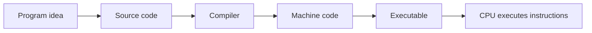
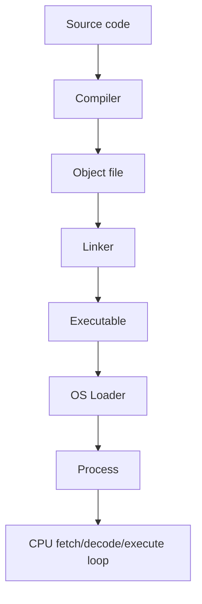

import Tabs from '@theme/Tabs';
import TabItem from '@theme/TabItem';

# What Is a Computer Program?

When you open a browser, press play in a game, or run a compiler, you are not just starting a file. You are starting a program: a set of instructions that makes the computer behave in a specific way. That is why this idea matters early. If you understand what a program is, the rest of programming basics become easier to place in your head.

Reading time: about 8-12 minutes.

:::info Quick answer
A computer program is a set of instructions that tells a computer what to do. Source code is one way to write that program, and a binary executable is one way to run it.
:::

## What You'll Learn

- What a program is
- Difference between program and source code
- Difference between source code and executable
- Why binaries exist
- How programs eventually run on the CPU

## Start With The Idea

A program starts as an intention.

Maybe you want to add two numbers. Maybe you want a web browser to fetch a page. Maybe you want a game to react to keyboard input. The idea comes first, and the code comes second. That is the part many beginners skip.

Once you have the idea, you write it in a programming language as source code. Later, tools translate that source into machine code so the CPU can actually run it.

That gives us the basic chain:

```text
Program
-> Source Code
-> Compiler
-> Machine Code
-> Executable
-> CPU Execution
```

:::tip
Source code is for humans. Machine code is for the CPU.
:::

## Mermaid Diagram: The Big Picture



## Program, Source Code, and Executable

These three terms are closely related, but they are not the same.

### Program
A program is the thing you want the computer to do.

The program is the behavior, not the file format.

### Source Code
Source code is the readable version of that behavior.

You write source code in a programming language such as C, C++, Rust, or Python. Humans can read it, review it, and change it. The CPU cannot.

### Compiler
A compiler reads source code and translates it into a lower-level form. In native compilation, that path eventually leads to machine code.

:::note
A compiler is itself a program.
:::

### Machine Code
Machine code is the instruction set the CPU understands.

This is the level where the processor sees instructions to move data, compare values, branch, load memory, or call functions. The CPU does not understand C++, Rust, or Python source directly.

### Executable
An executable is the file the operating system can start.

It usually contains machine instructions plus metadata the OS needs, such as:
- entry point
- code and data sections
- imports or library references
- layout information for loading the file into memory

### CPU Execution
Once the executable is loaded, the CPU begins executing machine instructions. At that point the program is not just a file on disk anymore. It is a running process in memory.

## Mermaid Diagram: From Source to CPU



## Real Examples

| Example | Program idea | What the program does |
| --- | --- | --- |
| Calculator | Add two numbers | Takes input, computes a result, shows output |
| Browser | Open and render web pages | Loads pages, runs JavaScript, draws UI |
| Game | Respond to input and rules | Renders frames, updates physics, plays audio |
| WhatsApp | Send and receive messages | Syncs chats, delivers notifications, manages media |
| Compiler | Translate source code | Turns source into machine code or another lower-level form |

:::info Did You Know?
Google Chrome, VS Code, your operating system, and a compiler are all programs. They just have different jobs.
:::

## Better Analogies

A few analogies help here, but only if we use them carefully.

- A recipe tells you the steps to make a meal; a program tells the computer the steps to finish a task.
- A movie script describes what should happen on screen; source code describes what the software should do.
- A blueprint describes a building before it exists; a program describes the behavior before the machine runs it.
- A music sheet is not the performance itself, but it contains the instructions for one.
- An instruction manual tells a person how to operate a device; a program tells the computer how to behave.
- Google Maps gives a route, but it does not move the car for you; source code gives instructions, but the CPU still has to execute them.

:::warning
Analogies help, but they are not perfect. A program is not just a description. It is a set of instructions that can actually be executed after translation.
:::

## Same Program, Different Source Code

The same program idea can be written in different languages.

The idea here is simple: read two numbers, add them, and print the result.

<Tabs groupId="language" queryString>
  <TabItem value="c" label="C">

```c
#include <stdio.h>

int main(void) {
    printf("%d\n", 2 + 3);
    return 0;
}
```

  </TabItem>
  <TabItem value="cpp" label="C++">

```cpp
#include <iostream>

int main() {
    std::cout << (2 + 3) << '\n';
    return 0;
}
```

  </TabItem>
  <TabItem value="rust" label="Rust">

```rust
fn main() {
    println!("{}", 2 + 3);
}
```

  </TabItem>
  <TabItem value="python" label="Python">

```python
print(2 + 3)
```

  </TabItem>
</Tabs>

Output:

```text
5
```

The code is different, but the program idea is the same. That is the useful mental model: one problem, many source languages.

In C, C++, and Rust, the source code is usually compiled into a native executable. In Python, the source code is typically run by an interpreter program that reads and executes it.

## How the CPU Actually Runs a Program

The CPU does not run source code directly. What it runs is machine instructions that have already been prepared by the toolchain and loaded into memory by the operating system.

A simple sequence looks like this:

1. You write source code
2. The compiler translates it
3. The assembler and linker finish the native binary when needed
4. The OS loader loads the executable into memory
5. The OS creates a process and sets up the entry point
6. The CPU begins the fetch-decode-execute loop on machine instructions

This is the part that matters most for systems work. The source is a description. The executable is the package. The CPU only sees instructions.

<details>
<summary>Advanced note: compiled and interpreted programs</summary>

Some languages are compiled to native machine code. Some are interpreted. Some use both. Python, JavaScript, and Java still involve translation steps, but the runtime model differs from native C or C++ compilation.

The key rule stays the same: the CPU only executes machine instructions. Source code is for humans.

</details>

## Common Misconceptions

| Myth | Reality |
| --- | --- |
| Program = source code | Source code is one way to express a program, not the program itself |
| Program = executable | An executable is a packaged form of a program, not the only form |
| CPU understands C++ | The CPU understands machine instructions only |
| Compiler runs your code | A compiler translates code; it does not execute your program logic |
| Python is a program | Python is a programming language; the interpreter is a program |

## Common Patterns You Will See Later

When you read compiler, linker, and loader articles, keep this split in mind:

- source code is written by humans
- machine code is executed by the CPU
- the executable is the bridge between the two
- the OS loader turns a file into a running process

That model shows up again in every deeper systems topic.

## Internal Links

- [Start Here](/docs/start-here)
- [Overview](/docs/basic-terminology/overview)
- [From Source Code to Binary](/docs/compilers/sourcecode_to_executable)
- [What Is a Compiler?](/docs/compilers/Compiler)
- [How Computers Work](/docs/gpu/gpu_programming/how_computer_works/)
- [Basic Terminology in COA](/docs/coa/basic_terminology_in_coa)
- [LLVM](/docs/llvm/)

## Summary

- A computer program is the behavior or task you want the computer to perform
- Source code is the human-readable way to describe that program
- Machine code is what the CPU executes directly
- An executable is a packaged file the OS can load and run
- A compiler translates source code into lower-level forms
- The CPU does not understand C++, Rust, or Python source directly
- The OS loader turns an executable into a running process
- Source code is for humans, machine code is for the CPU
- Programs can be written in different languages while keeping the same idea

## Interview Questions

1. What is a computer program?
2. What is the difference between a program and source code?
3. Why can't the CPU run C++ source code directly?
4. What does a compiler produce?
5. What is the difference between an executable and a running process?

## Quick Quiz

<details>
<summary>1. Which statement best describes a computer program?</summary>

A. A file that only contains numbers
B. Instructions that tell a computer what to do
C. A physical part of the CPU
D. A monitor setting

Answer: B

</details>

<details>
<summary>2. What is source code?</summary>

A. Human-readable text written to create a program
B. The final CPU instruction bytes
C. A type of keyboard shortcut
D. A compressed image file

Answer: A

</details>

<details>
<summary>3. What does a compiler do?</summary>

A. It displays windows on the screen
B. It translates source code into another form
C. It replaces the operating system
D. It stores data permanently

Answer: B

</details>

<details>
<summary>4. What does the CPU understand directly?</summary>

A. C++
B. Python
C. Machine code
D. Markdown

Answer: C

</details>

<details>
<summary>5. What is an executable?</summary>

A. A human-written design document
B. A file the operating system can load and run
C. A compiler warning
D. A text editor project file

Answer: B

</details>

## What to Learn Next

| Step | Read next |
| --- | --- |
| Program | [What Is a Computer Program?](/docs/basic-terminology/what-is-a-computer-program) |
| Source Code | [From Source Code to Binary](/docs/compilers/sourcecode_to_executable) |
| Compiler | [What Is a Compiler?](/docs/compilers/Compiler) |
| Assembler | [From Source Code to Binary](/docs/compilers/sourcecode_to_executable) |
| Object File | [From Source Code to Binary](/docs/compilers/sourcecode_to_executable) |
| Linker | [From Source Code to Binary](/docs/compilers/sourcecode_to_executable) |
| Executable | [From Source Code to Binary](/docs/compilers/sourcecode_to_executable) |
| Loader | [How Computers Work](/docs/gpu/gpu_programming/how_computer_works/) |
| Process | [How Computers Work](/docs/gpu/gpu_programming/how_computer_works/) |
| CPU Execution | [Basic Terminology in COA](/docs/coa/basic_terminology_in_coa) |
