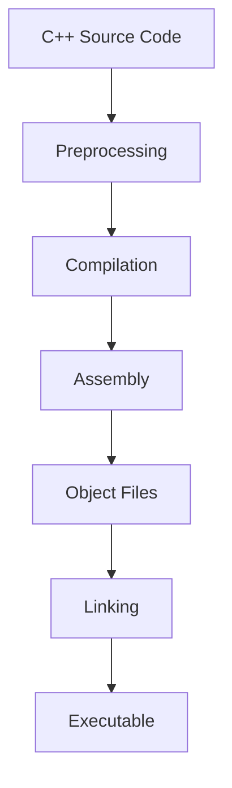

import Tabs from '@theme/Tabs';
import TabItem from '@theme/TabItem';
import { CreateBox, CreateCircle, CreateTriangle } from '@site/src/components/shape_for_md/shapes.js';
import AdBanner from '@site/src/components/AdBanner';
import BrowserOnly from '@docusaurus/BrowserOnly';


> **When you run a C++ program for the first time, something magical seems to happen.**  
>  
> You write a few lines of **high-level C++ code**, press compile, and suddenly a **binary executable** appears ready to run on your machine.  
>  
> But in that moment, most developers don’t really know **what happened in between**.
>  

> - ***How did human-readable C++ turn into machine instructions?*** 
> - ***Who checked your syntax, types, and logic?***
> - ***Where did optimization happen and why does the binary depend on your OS and CPU?***
>  
> This article answers those questions by walking through the **entire C++ compilation journey** from source code to executable step by step. You’ll see exactly how a compiler thinks, how each phase works, and why understanding this pipeline makes you a **better C++ developer**.
>  
> By the end, compiling C++ will no longer feel like magic it will feel **predictable, debuggable, and powerful**.


## Table of Contents

1. [Introduction: What Happens When You Compile C++](#1-introduction-what-happens-when-you-compile-c)
2. [Why C++ Needs a Compiler](#2-why-c-needs-a-compiler)
3. [The C++ Compilation Pipeline](#3-the-c-compilation-pipeline)
4. [Errors in C++ Compilation](#4-errors-in-c-compilation)
5. [Popular C++ Compilers](#5-popular-c-compilers)
6. [Conclusion](#6-conclusion-think-like-a-compiler)

## 1. Introduction: What Happens When You Compile C++

When you compile a C++ program, it feels instantaneous.

You write code, run a command like `g++ main.cpp`, and an executable appears.  
No visible steps. No explanation. Just a binary that runs.

This creates a dangerous illusion: that compilation is a **single action**.

It isn’t.

Compilation is a **pipeline of reasoning steps**, each one answering a very specific question about your program. The compiler is not translating C++ line by line into machine code. It is *analyzing*, *proving*, *restructuring*, and *lowering* your program until it becomes something a CPU can execute safely and efficiently.

At a high level, the compiler must answer three fundamental questions:

1. **Is this program well-formed?**  
   (Does it obey the syntax and rules of C++?)

2. **What does this program mean?**  
   (Which values flow where, along all possible execution paths?)

3. **How can this meaning be expressed efficiently on real hardware?**  
   (Registers, memory, instructions, calling conventions.)

To answer these questions, the compiler gradually abandons the surface structure of your code.  
Comments disappear.  
Whitespace disappears.  
Even variable names eventually disappear.

What replaces them is structure:
- graphs instead of lines,
- values instead of variables,
- flows instead of statements.

By the time machine code is generated, your original C++ source is no longer recognizable. Yet the compiler guarantees that the executable behaves *as if* it were your program on every valid execution path.

Understanding this transformation is not just academic curiosity.

It explains:
- why certain errors appears

:::tip  Key Insight
Given the same source code, compiler version, flags, and platform,
a compiler will always produce the **same binary**.
This is crucial for reproducible builds.
:::

<div>
  <AdBanner />
</div>

## 2. Why C++ Needs a Compiler

C++ is built for situations where a programmer needs **direct control over the machine**.  
This control is the reason C++ programs can be extremely fast   and also the reason C++ cannot work without a compiler.

Think of a computer like a **factory machine**.  
The machine does not understand ideas like *classes*, *objects*, or *templates*.  
It understands only very basic actions: move data, compare values, and jump to another instruction.

A CPU understands only:
- load data
- store data
- arithmetic operations
- control flow (jumps)

So when you write C++, you are not speaking to the CPU directly.  
You are writing instructions for a **translator** that converts human ideas into machine actions.  
That translator is the **compiler**.

:::tip  Real-Life Analogy: Language Translation  
Writing C++ is like writing a document in English for someone who understands only numbers.  
The compiler acts as a professional translator   if the sentence is unclear or incorrect, it refuses to translate it.
:::

#### Static Language, Static Decisions

C++ is a **statically typed, statically compiled** language.  
This means many decisions are made **before the program ever runs**.

Think of it like **constructing a building**.

Before construction starts, engineers decide:
- how strong the pillars must be,
- where the walls go,
- how much load each floor can handle.

They do not decide these while people are already inside the building.

In the same way, the compiler decides in advance:
- which function is called,
- how much memory an object needs,
- how data is laid out in memory.

:::tip  Beginner Insight  
Because these decisions are made early, C++ programs don’t pause at runtime to “figure things out.”  
This is a big reason C++ is fast.
:::

:::caution  Common Beginner Mistake  
If your program fails to compile, the problem is not the CPU   it is the compiler protecting you from an unsafe program.
:::

#### Performance Is a Compile-Time Promise

C++ is used where performance is **not optional**:
- operating systems
- game engines
- embedded systems
- real-time software

Imagine a **race car**.

You don’t adjust engine timing or tire pressure during the race.  
Everything is tuned **before the car hits the track**.

The compiler does this tuning:
- it keeps frequently used values in CPU registers,
- it removes unnecessary calculations,
- it rearranges instructions to avoid delays.

:::tip  Important Reality  
C++ is fast not because it skips safety, but because the compiler does the heavy work *ahead of time*.
:::

#### Portability Through Recompilation

C++ source code is portable, but executables are not.

Think of source code as a **recipe**.

The same recipe can be used in different kitchens, but:
- gas stoves and electric stoves work differently,
- tools and measurements may vary.

The compiler is the **local chef**:
- it adapts the recipe to the available kitchen (CPU and OS),
- it produces a dish suited for that environment.

:::caution  Portability Warning  
A program compiled on Linux will not run on Windows.  
Always share **source code**, not executables.
:::

#### Safety Through Early Errors

Finding mistakes early is always cheaper.

If a bridge design is wrong, it’s better to discover it **on paper**, not after people start using it.

The compiler checks:
- type correctness,
- correct usage of functions,
- scope and lifetime rules.

Many bugs that would crash programs at runtime in other languages are caught **before execution** in C++.

:::tip  Debugging Mindset  
If the compiler complains, it is doing you a favor   it is stopping a broken program from ever running.
:::

#### The Core Idea

C++ needs a compiler because its goals demand it.

You cannot have:
- low-level control,
- predictable performance,
- zero-cost abstractions,

without analyzing the entire program **ahead of time**.

The compiler is not just a tool that converts code into binaries.  
It is the mechanism that turns human intent into safe, efficient machine behavior.

Once you understand this, compilation stops feeling mysterious   and starts feeling necessary.

<div>
  <AdBanner />
</div>

## 3. The C++ Compilation Pipeline

When people say *“the compiler compiled my program”*, they usually mean **everything worked**.  
But in reality, compilation is not a single step   it is a **pipeline**, like an assembly line.

Think of building a **car**.

You don’t take raw metal and instantly get a car.
The metal goes through multiple stations:
- cutting,
- shaping,
- assembly,
- inspection,
- final testing.

C++ compilation works the same way.  
Your source code passes through **well-defined stages**, and each stage has a specific responsibility.

:::tip  Big Picture First  
If you remember only one thing, remember this:
C++ code does **not** go directly to machine code.
It is transformed step by step.
:::

#### The High-Level Flow

At a very high level, the pipeline looks like this:



Each arrow represents a **checkpoint** where something important happens.

Lets understand this whole pipeline using a cpp example where we will take
- a basic code to calculate the area of a circle.

#### Walking Through the C++ Compilation Pipeline (Step by Step)

Let’s take a **real C++ program** and watch how it transforms at **each stage of compilation**.  
No theory. No assumptions. Just what actually happens.

#### The Source Code (`example.cpp`)

```cpp
#define PI 3.14   // Preprocessor defines a constant

int main() {
    float r = 5;
    float area = PI * r * r;  // PI replaced by 3.14 by preprocessor
    return 0;
}
```

This is **human-written C++**.
It contains:

* a macro (`#define PI`)
* variables
* expressions
* comments

The CPU understands **none of this**.

Now we run:

```bash
g++ -save-temps example.cpp
```

This single command tells the compiler:

> “Compile normally, but **don’t delete intermediate files**.”

After running it, we get:

```
a-example.ii
a-example.s
a-example.o
a.out
example.cpp
```

Each file represents **one transformation step**.

#### Step 1: Preprocessing

#### File: `a-example.ii`

This is the output of the **preprocessor**.

What the preprocessor does:

* removes comments
* expands macros
* includes header files
* performs text substitution

If you open `a-example.ii`, you’ll see something like:

```cpp
int main() {
    float r = 5;
    float area = 3.14 * r * r;
    return 0;
}
```

#### What changed?

* `#define PI 3.14` is **gone**
* `PI` is replaced with `3.14`
* comments are removed
* the code is now **pure C++ without preprocessor directives**

:::tip 💡 Real-Life Analogy
This is like replacing shortcuts in a document:

* “FYI” → “For your information”
* “ASAP” → “As soon as possible”

The meaning doesn’t change — only the text expands.
:::

:::caution ⚠️ Important
The preprocessor does **not understand C++**.
It blindly replaces text.
This is why macros can sometimes cause strange bugs.
:::

#### Step 2: Compilation (High-Level Understanding)

#### File: `a-example.s`

This is **assembly code**, generated by the compiler.

Here, the compiler has:

* checked syntax
* checked types
* verified scopes
* built an internal model of your program
* optimized it (if enabled)

The output is **CPU-specific instructions**, for example:

```asm
movss   xmm0, DWORD PTR .LC0[rip]
mulss   xmm0, DWORD PTR .LC1[rip]
```

You don’t need to understand assembly fully.
What matters is **what this represents**.

#### What changed?

* Variables like `r` and `area` may no longer exist as names
* Values are placed into registers
* High-level math becomes low-level instructions

:::tip 💡 Mental Model
This is the point where your program stops looking like C++
and starts looking like **machine logic**.
:::

#### Step 3: Assembly → Object Code

#### File: `a-example.o`

This file contains **binary machine code**.

It is:

* no longer human-readable
* specific to your CPU and OS
* still **not runnable**

Why not runnable?

Because:

* memory addresses are not final
* external references (if any) are unresolved

:::tip 💡 Real-Life Analogy
Think of this as a **manufactured engine**.
Perfectly built — but not installed in a vehicle yet.
:::

#### Step 4: Linking

#### File: `a.out`

This is the **final executable**.

The linker:

* connects object files
* links standard libraries
* fixes memory addresses
* produces a runnable program

Now the OS can:

* load it into memory
* start execution at `main`

:::tip Key Insight
If you see errors like:

```
undefined reference to ...
```

they happen **here**, not during compilation.
:::

#### Step 5: Execution (Running the Program)  
#### File: `a.out`

Once linking is complete, the output file (`a.out` by default) is a **fully formed executable**.

When you run:

```bash
./a.out
```

This is what actually happens:

* The **operating system loader** takes control
* It loads the executable into memory
* Required shared libraries are loaded (if dynamically linked)
* Memory for stack and heap is prepared
* Execution starts from a special entry point
* Control eventually reaches `main()`

At this point:

* the compiler is no longer involved
* the linker is no longer involved
* everything is handled by the OS and CPU

:::tip Real-Life Analogy
Compilation and linking are like manufacturing a device.
Running the program is like **turning the power on**.
:::

:::caution Important
If your program crashes here (segmentation fault, crash, wrong output),
it is a **runtime problem**, not a compilation problem.
:::

In your example:

```cpp
float r = 5;
float area = 3.14 * r * r;
```

The CPU executes the machine instructions generated earlier.
There are no variables named `r` or `area` anymore — only registers and memory.


#### Step 6: Cleanup and What Usually Gets Hidden

Normally, you never see these intermediate files.

If you compile without `-save-temps`:

```bash
g++ example.cpp
```

the compiler will:

* generate `.ii`, `.s`, `.o` internally
* **delete them automatically**
* keep only the final executable

That is why beginners often believe:

> “The compiler directly converts C++ to an executable.”

In reality, all intermediate steps still happen — they’re just hidden.

:::tip 💡 Why `-save-temps` Is Special
It turns the compiler from a black box into a **glass box**.
You can see every transformation clearly.
:::

#### What Each File Is Used For (Final Recap)

| File           | Role                               |
| -------------- | ---------------------------------- |
| `example.cpp`  | Your original intent               |
| `a-example.ii` | Text after macro expansion         |
| `a-example.s`  | CPU-level instructions (readable)  |
| `a-example.o`  | Binary instructions (not runnable) |
| `a.out`        | Runnable program                   |

#### When You Should Use `-save-temps`

* Learning how compilers work
* Debugging macro-related issues
* Teaching compilation stages
* Understanding optimization effects

:::tip 💡 Beginner Habit
Use `-save-temps` when learning.
Remove it in real projects to keep directories clean.
:::

At this point, you’ve seen **every stage your C++ code passes through** —
from text written by a human to instructions executed by silicon.


#### One Line Summary of Each File

| File           | What it represents                         |
| -------------- | ------------------------------------------ |
| `example.cpp`  | Human-written C++ source                   |
| `a-example.ii` | Preprocessed C++ (macros expanded)         |
| `a-example.s`  | Assembly code (CPU instructions, readable) |
| `a-example.o`  | Object file (binary, not runnable)         |
| `a.out`        | Final executable                           |

##### Why `-save-temps` Is Powerful

This single flag lets you:

* see every compilation stage
* debug preprocessing issues
* understand optimizations
* explain compilation visually

:::tip 💡 Beginner Tip
If something looks confusing, inspect the **previous file** in the pipeline.
Most answers reveal themselves there.
:::


:::caution  Beginner Trap  
Preprocessing does not understand C++ logic.
It blindly replaces text.
Many confusing bugs come from macros behaving differently than expected.
:::

#### Why This Pipeline Matters

Understanding the pipeline helps you:
- diagnose errors faster,
- know *where* a problem occurred,
- stop treating the compiler as a black box.

:::tip  Debugging Shortcut  
When something fails, ask:
“Which stage broke?”
This single question solves most beginner confusion.
:::

Once this pipeline is clear in your head, everything else   errors, optimizations, performance   starts making sense.

<div>
  <AdBanner />
</div>

## 4. Errors in C++ Compilation

When something goes wrong in a C++ program, beginners often feel that **everything broke at once**.  
In reality, errors happen at **specific stages**, and each stage complains in its own way.

Understanding *where* an error comes from is more important than memorizing the error message itself.

<Tabs>
<TabItem value="compile" label="Compile-Time Errors">

Compile-time errors are detected **before the program ever runs**.  
They occur when the compiler cannot understand, analyze, or validate your code
according to C++ language rules.

When a compile-time error happens, **no executable is produced**.

#### Common Real Examples

**1. Type Mismatch**

```cpp
int x = "hello";   // assigning string to int
```

The compiler stops because the types are incompatible.

**2. Missing Semicolon**

```cpp
int x = 10
int y = 20;
```

This single missing character can confuse the compiler and cause multiple errors.

**3. Undeclared Variable**

```cpp
int main() {
    x = 5;   // x not declared
}
```

The compiler does not know what `x` is.

**4. Incorrect Function Call**

```cpp
void foo(int a) {}

int main() {
    foo();   // missing argument
}
```

The function signature does not match the call.

**5. Syntax Errors**

```cpp
if (x > 5 {
    // missing closing parenthesis
}
```

The compiler cannot understand the structure of the code.

#### Why the Compiler Stops Immediately

The compiler must **fully understand the program** before generating machine code.
If meaning is unclear or invalid, continuing would be unsafe.

**Real-life analogy:**
If a blueprint is invalid, construction stops immediately.

:::tip Beginner Insight
If the compiler refuses to produce an executable,
your program is not safe enough to run.
:::

:::tip Practical Command
To check only compile-time errors (no executable generated):

```bash
g++ -fsyntax-only main.cpp
```

:::

</TabItem>


<TabItem value="link" label="Link-Time Errors">

Link-time errors happen **after successful compilation**, during the **linking stage**.  
At this point, each source file has been compiled correctly, but the linker cannot
connect everything into a single executable.

The most famous error looks like this:

```
undefined reference to `foo`
```

This means:
- the compiler saw that `foo` was *declared*
- but the linker could not find its *definition*

##### Common Real Examples

**1. Function Declared but Never Defined**

```cpp
// file1.cpp
void foo();   // declaration

int main() {
    foo();    // call
}
```

No definition exists for `foo`.

Result:

```
undefined reference to `foo()`
```

**2. Definition Exists, but File Not Linked**

```cpp
// file1.cpp
void foo();

int main() {
    foo();
}
```

```cpp
// file2.cpp
void foo() {}
```

Compiled incorrectly:

```bash
g++ file1.cpp
```

Correct linking:

```bash
g++ file1.cpp file2.cpp
```

**3. Missing Library During Linking**

```cpp
#include <cmath>

int main() {
    double x = sqrt(25);
}
```

Wrong:

```bash
g++ main.cpp
```

Correct:

```bash
g++ main.cpp -lm
```

**4. Wrong Linking Order**

```bash
g++ -lmath main.o    # may fail
g++ main.o -lmath    # correct
```

Libraries usually come **after** object files.

#### Why the Compiler Can’t Catch This

The compiler works **file by file**.
It assumes that declared functions will be found later.

Only the linker sees:

* all object files together
* all libraries together

So only the linker can detect missing connections.

**Real-life analogy:**
You wrote a book chapter correctly, but the final book is missing pages.

:::tip Debugging Shortcut
If the error mentions **reference**, **symbol**, or **linker**,
stop checking syntax — check:

* which files you compiled
* which libraries you linked
* the order of arguments
  :::

:::caution Important Reality
Link-time errors mean your code is *correct*, but *incomplete*.
:::

</TabItem>

<TabItem value="runtime" label="Runtime Errors">

Runtime errors occur **after the program starts running**.  
The compiler has already done its job, but something goes wrong **while the program is executing**.

#### Common Examples

**1. Segmentation Fault (Invalid Memory Access)**

```cpp
int* p = nullptr;
*p = 10;   // accessing memory that doesn't exist
```

This crashes because the program tries to write to memory it does not own.

**2. Division by Zero**

```cpp
int x = 10;
int y = 0;
int z = x / y;   // undefined behavior
```

The compiler allows this code, but the CPU cannot perform the operation safely.

**3. Accessing Out-of-Bounds Memory**

```cpp
int arr[3] = {1, 2, 3};
int x = arr[5];   // invalid index
```

This may crash, or worse, silently corrupt memory.

**4. Using Uninitialized Variables**

```cpp
int x;
std::cout << x;   // value is unpredictable
```

The program runs, but the output is meaningless.

#### Why the Compiler Cannot Catch These

Runtime errors depend on:

* actual input values
* which code paths are taken
* the state of memory at runtime

The compiler cannot predict these safely in advance.

**Real-life analogy:**
The house was built correctly, but someone tripped inside it.

:::caution Important Reality
A program that compiles successfully is not guaranteed to be correct.
Compilation checks rules — not logic.
:::

:::tip Debugging Advice
If a program crashes while running, use tools like:

* debuggers (`gdb`)
* sanitizers (`-fsanitize=address`)
  to find the exact cause.
  :::

</TabItem>


  <TabItem value="warnings" label="Warnings">

Warnings are messages where the compiler says:

> “This code is legal, but suspicious.”

**Examples:**

* unused variables
* implicit type conversions
* unreachable code

Beginners often ignore warnings.
Experienced developers treat them seriously.

:::tip Best Practice
Always compile with warnings enabled:

```bash
g++ -Wall -Wextra
```

Warnings are early signals of bugs.
:::

  </TabItem>

  <TabItem value="reading" label="How to Read Errors (Calmly)">

When a compiler shows an error, it can feel overwhelming — especially when
you see **multiple errors at once**.  
The key is to slow down and follow a **fixed process**.

#### 1. Read the *First* Error Only

Compilers often print many errors, but:
- the **first error** is usually the real problem
- later errors are often **side effects**

**Why this happens:**  
If the compiler misunderstands one line, everything after it may look wrong.

Think of it like reading a paragraph with one missing word —  
every sentence after it feels confusing.

#### 2. Trust the Line Number (But Read Around It)

The line number points to **where the compiler got confused**, not always
where the mistake truly began.

Best practice:
- check the reported line
- also check the **line just above it**

Many errors are caused by:
- missing semicolons
- unmatched braces
- incomplete statements

#### 3. Identify *Which Stage* Is Complaining

Ask yourself:

- **Compile-time error?**  
  → syntax, types, or language rules  
- **Link-time error?**  
  → missing definitions or libraries  
- **Runtime error?**  
  → logic or memory issues  

Knowing the stage immediately tells you **where to look**.

#### 4. Fix One Error at a Time

Do not try to fix everything at once.

Instead:
- fix the first error
- recompile
- repeat

Most of the time, **many errors disappear automatically** after fixing the first one.

:::tip Calm Debugging Rule
The compiler is not judging you.  
It is describing *why it cannot continue safely*.
:::

Once you treat errors as **guidance instead of punishment**, debugging becomes
systematic and much less stressful.

</TabItem>

</Tabs>

<div>
  <AdBanner />
</div>

## 5. Popular C++ Compilers

When you write C++ code, **the language itself is only half the story**.  
The other half is **which compiler** turns that code into an executable.

Think of C++ like **sheet music**.

The same sheet music can be played by:
- a piano,
- a violin,
- an orchestra.

The notes are the same, but the sound depends on the performer.

C++ compilers work the same way:
- they all follow the C++ standard,
- but their tools, diagnostics, and optimizations differ.

#### GNU Compiler Collection

GCC is one of the **oldest and most widely used** C++ compilers.

It is commonly used on:
- Linux
- Unix systems
- embedded platforms
- competitive programming environments

Why people use GCC:
- very strong optimizations,
- wide platform support,
- strict standard compliance,
- huge community and documentation.

Real-life analogy:  
GCC is like a **heavy-duty industrial machine**   reliable, powerful, and everywhere.

Common command:
```bash
g++ main.cpp -o program
```

:::tip  Beginner Tip
If you are learning C++ on Linux, you are almost certainly using GCC.
:::

#### Clang

Clang is a modern C++ compiler built on top of LLVM.

It is known for:

* very clear and readable error messages,
* fast compilation,
* excellent tooling support.

Clang is the default compiler on:

* macOS
* many IDEs and code analysis tools

Real-life analogy:
Clang is like a **teacher who explains mistakes clearly**, instead of just pointing them out.

Common command:

```bash
clang++ main.cpp -o program
```

:::tip  Beginner-Friendly Feature
Clang’s error messages are often easier to understand than GCC’s.
If an error confuses you, try compiling with Clang.
:::

#### MSVC (Microsoft Visual C++)

MSVC is Microsoft’s C++ compiler for Windows.

It is tightly integrated with:

* Visual Studio
* Windows APIs
* Windows debugging tools

It is commonly used for:

* Windows desktop applications,
* game development on Windows,
* enterprise software.

Real-life analogy:
MSVC is like a **specialist tool** designed specifically for one environment   Windows.

Compilation usually happens inside Visual Studio, but can also be done from the command line:

```bash
cl main.cpp
```

:::caution  Platform Note
Code that compiles with GCC or Clang may need small changes to compile with MSVC.
This is normal and expected.
:::

#### Do Different Compilers Change the Program?

The **behavior** of a correct C++ program should remain the same across compilers.

But compilers may differ in:

* error messages,
* warning strictness,
* optimization strategies,
* compile-time performance.

:::tip  Practical Advice
If your code works on multiple compilers,
it is usually well-written and standard-compliant.
:::

#### Which Compiler Should You Use?

There is no single “best” compiler.

A simple rule:

* **Linux** → GCC or Clang
* **macOS** → Clang
* **Windows** → MSVC

What matters most is:

* understanding how compilers work,
* reading their error messages carefully,
* writing clear, standard-compliant C++.

Once you understand one compiler well, the others become easy to adapt to.

At this point, you’ve seen:

* how C++ code flows through the pipeline,
* how it becomes optimized machine code,
* how different tools perform that job.

The final step is not technical   it’s a mindset shift.

<div>
  <AdBanner />
</div>


## 6. Conclusion: Think Like a Compiler

By now, the C++ compilation process should no longer feel like magic.

You’ve seen that a compiler is not a single black box, but a **series of careful transformations**:
- your code is checked,
- understood,
- optimized,
- connected,
- and finally turned into something the machine can execute.

The most important shift is not technical   it’s **mental**.

Beginners think:
> “I wrote code. Why didn’t it work?”

Experienced C++ developers think:
> “At which stage did this fail   preprocessing, compilation, linking, or runtime?”

That single question changes everything.

When you understand how compilers work:
- error messages stop feeling random,
- optimization flags stop feeling mysterious,
- performance issues become explainable,
- and debugging becomes systematic.

You also stop fighting the compiler.

You begin to see it as:
- a strict reviewer,
- a performance engineer,
- and a safety net rolled into one.

C++ rewards this mindset more than most languages.  
The closer you think to how the compiler thinks, the more predictable and powerful your code becomes.

Mastering C++ is not about memorizing syntax.  
It is about understanding **how your ideas become machine instructions**.

And the compiler is the bridge that makes that possible.

# More

<Tabs>
  <TabItem value="docs" label="📚 Documentation">
             - [CompilerSutra Home](https://compilersutra.com)
                - [CompilerSutra Homepage (Alt)](https://compilersutra.com/)
                - [Getting Started Guide](https://compilersutra.com/get-started)
                - [Skip to Content (Accessibility)](https://compilersutra.com#__docusaurus_skipToContent_fallback)


  </TabItem>

  <TabItem value="tutorials" label="📖 Tutorials & Guides">

        - [AI Documentation](https://compilersutra.com/docs/Ai)
        - [DSA Overview](https://compilersutra.com/docs/DSA/)
        - [DSA Detailed Guide](https://compilersutra.com/docs/DSA/DSA)
        - [MLIR Introduction](https://compilersutra.com/docs/MLIR/intro)
        - [TVM for Beginners](https://compilersutra.com/docs/tvm-for-beginners)
        - [Python Tutorial](https://compilersutra.com/docs/python/python_tutorial)
        - [C++ Tutorial](https://compilersutra.com/docs/c++/CppTutorial)
        - [C++ Main File Explained](https://compilersutra.com/docs/c++/c++_main_file)
        - [Compiler Design Basics](https://compilersutra.com/docs/compilers/compiler)
        - [OpenCL for GPU Programming](https://compilersutra.com/docs/gpu/opencl)
        - [LLVM Introduction](https://compilersutra.com/docs/llvm/intro-to-llvm)
        - [Introduction to Linux](https://compilersutra.com/docs/linux/intro_to_linux)

  </TabItem>

  <TabItem value="assessments" label="📝 Assessments">

        - [C++ MCQs](https://compilersutra.com/docs/mcq/cpp_mcqs)
        - [C++ Interview MCQs](https://compilersutra.com/docs/mcq/interview_question/cpp_interview_mcqs)

  </TabItem>

  <TabItem value="projects" label="🛠️ Projects">

            - [Project Documentation](https://compilersutra.com/docs/Project)
            - [Project Index](https://compilersutra.com/docs/project/)
            - [Graphics Pipeline Overview](https://compilersutra.com/docs/The_Graphic_Rendering_Pipeline)
            - [Graphic Rendering Pipeline (Alt)](https://compilersutra.com/docs/the_graphic_rendering_pipeline/)

  </TabItem>

  <TabItem value="resources" label="🌍 External Resources">

            - [LLVM Official Docs](https://llvm.org/docs/)
            - [Ask Any Question On Quora](https://compilersutra.quora.com)
            - [GitHub: FixIt Project](https://github.com/aabhinavg1/FixIt)
            - [GitHub Sponsors Page](https://github.com/sponsors/aabhinavg1)

  </TabItem>

  <TabItem value="social" label="📣 Social Media">

            - [🐦 Twitter - CompilerSutra](https://twitter.com/CompilerSutra)
            - [💼 LinkedIn - Abhinav](https://www.linkedin.com/in/abhinavcompilerllvm/)
            - [📺 YouTube - CompilerSutra](https://www.youtube.com/@compilersutra)
            - [💬 Join the CompilerSutra Discord for discussions](https://discord.gg/DXJFhvzz3K)

  </TabItem>
</Tabs>
