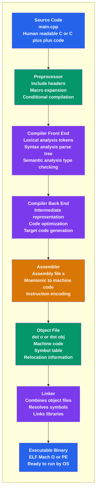

import Tabs from '@theme/Tabs';
import TabItem from '@theme/TabItem';
import { CreateBox, CreateCircle, CreateTriangle } from '@site/src/components/shape_for_md/shapes.js';
import AdBanner from '@site/src/components/AdBanner';
import BrowserOnly from '@docusaurus/BrowserOnly';


> **When you run a C++ program for the first time, something magical seems to happen.**  
>  
> You write a few lines of **high-level C++ code**, press compile, and suddenly a **binary executable** appears ready to run on your machine.  
>  
> But in that moment, most developers don’t really know **what happened in between**.
>  

> - ***How did human-readable C++ turn into machine instructions?*** 
> - ***Who checked your syntax, types, and logic?***
> - ***Where did optimization happen and why does the binary depend on your OS and CPU?***
>  
> This article answers those questions by walking through the **entire C++ compilation journey** from source code to executable step by step. You’ll see exactly how a compiler thinks, how each phase works, and why understanding this pipeline makes you a **better C++ developer**.
>  
> By the end, compiling C++ will no longer feel like magic it will feel **predictable, debuggable, and powerful**.


## Table of Contents

- [Introduction](#introduction)
- [Visualizing Each Stage of the C++ Compilation Pipeline](#visualizing-each-stage-of-the-c-compilation-pipeline)
- [Why C++ Uses a Compiler](#why-c-uses-a-compiler)
- [C++ Compilation Process](#c-compilation-process)
- [C++ Compilation Pipeline (Visual Overview)](#c-compilation-pipeline-visual-overview)
- [Preprocessing](#1-preprocessing)
- [Lexical Analysis](#2-lexical-analysis)
- [Syntax Analysis](#3-syntax-analysis)
- [Semantic Analysis](#4-semantic-analysis)
- [Intermediate Code Generation](#5-intermediate-code-generation)
- [Code Optimization](#6-code-optimization)
- [Code Generation](#7-code-generation)
- [Linking](#8-linking)
- [Compiler Architecture](#compiler-architecture)
- [Errors Detected by a C++ Compiler](#errors-detected-by-a-c-compiler)
- [Popular C++ Compilers](#popular-c-compilers)
- [Conclusion](#conclusion)


## Introduction

A **C++ compiler** is an essential system software that converts **C++ source code (`.cpp`)** into **machine-executable instructions** that can be directly understood and executed by a computer’s processor. Since C++ is a **statically typed and compiled programming language**, the entire program must be analyzed and translated before execution. This ensures that errors are detected early and the resulting program is both correct and efficient.

The compilation process involves several well-defined stages, including preprocessing, lexical analysis, syntax analysis, semantic analysis, intermediate code generation, optimization, and final code generation. During these stages, the compiler checks for syntax errors, enforces strict type rules, validates variable scopes, and ensures that function calls and expressions follow the semantics of the C++ language. These checks help prevent many runtime errors by identifying issues at compile time.


:::tip 💡 Key Insight
Given the same source code, compiler version, flags, and platform,
a compiler will always produce the **same binary**.
This is crucial for reproducible builds.
:::

---
<div>
  <AdBanner />
</div>
---


One of the most important responsibilities of a C++ compiler is **code optimization**. Modern compilers apply a wide range of optimization techniques such as dead code elimination, loop unrolling, constant folding, and function inlining. These optimizations significantly improve execution speed and reduce memory consumption without altering the logical behavior of the program. As a result, C++ programs compiled with advanced optimizers can achieve performance close to hand-written assembly code.

Another key aspect of C++ compilation is **platform dependency**. Unlike interpreted languages, C++ compilers generate executables that are specific to the target architecture and operating system. This allows C++ programs to fully utilize hardware capabilities such as CPU registers, cache hierarchies, and instruction-level parallelism. However, it also means that the same source code may need to be recompiled for different platforms.

C++ compilers also work closely with **linkers and loaders**. After compilation, object files are combined with libraries either statically or dynamically during the linking phase to produce a final executable. This modular approach supports large-scale software development by allowing programs to be split into multiple source files and reused libraries.

Popular C++ compilers such as **GCC**, **Clang**, and **Microsoft Visual C++ (MSVC)** implement the C++ standard while providing powerful diagnostic messages and debugging support. These tools play a vital role in modern software development, from operating systems and game engines to embedded systems and high-performance computing applications.

---
<div>
  <AdBanner />
</div>
---

## Visualizing Each Stage of the C++ Compilation Pipeline

While the compilation stages are often discussed theoretically, C++ allows developers to **explicitly observe each stage** using compiler flags. This makes the compilation process more transparent and easier to understand in practice.

The following examples use **GCC (`g++`)**, but similar options are available in other compilers such as Clang and MSVC.

---

### 1. Preprocessing Only

To stop compilation after the **preprocessing stage**, use the `-E` flag.  
This command expands macros, includes header files, and removes comments.
Lets take a sample code as eg

```cpp
// main.cpp
#define SQUARE(x) ((x) * (x))
int main() {
    int a = 5;
    int result = SQUARE(a);
    return result;
}

```

```bash
g++ -E main.cpp > main.i

cat main.i
# 0 "eg.cpp"
# 0 "<built-in>"
# 0 "<command-line>"
# 1 "eg.cpp"

int main() {
    int a = 5;
    int result = ((a) * (a));
    return result;
}
```

**Output:**

* `main.i` → Preprocessed source file  
* Macro expansion and directive processing are performed at this stage  
* No compilation, semantic analysis, or code generation occurs

This stage is useful for debugging macro expansions and preprocessing-related issues.


### 2. Compile to Assembly Code

To convert the source code into **assembly language**, use the `-S` flag.

```bash
g++ -S main.cpp
cat main.s
	.arch armv8.5-a
	.build_version macos,  16, 0
	.text
	.align	2
	.globl _main
_main:
LFB0:
	sub	sp, sp, #16
LCFI0:
	mov	w0, 5
	str	w0, [sp, 12]
	ldr	w0, [sp, 12]
	mul	w0, w0, w0
	str	w0, [sp, 8]
	ldr	w0, [sp, 8]
	add	sp, sp, 16
LCFI1:
	ret
LFE0:
```

**Output:**

* `main.s` → Assembly code generated for the target architecture  
* High-level C++ constructs are translated into target-specific machine instructions  
* No object file is produced at this stage

This stage is useful for understanding compiler optimizations, instruction selection, and calling conventions.

### 3. Compile to Object File

To generate an **object file** without linking, use the `-c` flag.

```bash
g++ -c main.cpp
```


**Output:**


* `main.o` → Object file

An object file contains:

* Machine code for the compiled source file
* Symbol information (functions and variables)
* Unresolved references that will be fixed during linking

In simple terms, an object file is a **partially finished program**.
It is compiled but **not yet connected** to libraries or other source files.

Multiple object files are later combined by the linker to create the final executable.


### 4. Full Compilation and Linking

To perform all stages preprocessing, compilation, assembly, and linking in one step:

```bash
g++ main.cpp -o main
```

**Output:**

* `main` → Final executable file

To check syntax and semantics **without generating any output files**, use:

**Use case:**

* Quickly validate code correctness
* Ideal for CI checks and editors

---
<Tabs>
  <TabItem value="analogy" label="Real-World Analogy">

| Compilation Stage | Real-World Analogy |
|------------------|-------------------|
| Preprocessing (`.i`) | Raw materials prepared |
| Compilation (`.s`) | Blueprint converted to machine steps |
| Object File (`.o`) | Individual parts manufactured |
| Linking (Executable) | All parts assembled into a product |

  </TabItem>

  <TabItem value="pipeline" label="Compilation Pipeline">

| Step | Command | Output | Description |
|-----|--------|--------|-------------|
| Preprocessing | `g++ -E main.cpp` | `main.i` | Expands macros |
| Compilation | `g++ -S main.cpp` | `main.s` | Generates assembly |
| Object Generation | `g++ -c main.cpp` | `main.o` | Produces machine code |
| Linking | `g++ main.o` | `a.out` | Creates executable |

  </TabItem>

  <TabItem value="files" label="File Types">

| File Type | Name | Simple Explanation |
|----------|------|-------------------|
| `.o` | Object file | One compiled piece of code |
| `.a` | Static library | Collection of object files |
| `.so` | Shared library | Loaded at runtime |
| Executable | `a.out` / `.exe` | Fully runnable program |


  </TabItem>

</Tabs>

### 5. Save All Intermediate Files

To preserve **all intermediate outputs** (preprocessed, assembly, object files):

```bash
g++ -save-temps main.cpp
```

**Generated files may include:**

* `main.i` → preprocessed code
* `main.s` → assembly
* `main.o` → object file

This is extremely useful for learning and debugging.

---

### 6. Enable Common Warnings (Highly Recommended)

To enable helpful compiler warnings:

```bash
g++ -Wall -Wextra -Wpedantic main.cpp
```

**Why this matters:**

* Detects suspicious code
* Encourages safer and cleaner C++ practices

---
<div>
  <AdBanner />
</div>
---


### 7. Specify the C++ Standard Explicitly

To compile with a specific C++ standard:

```bash
g++ -std=c++17 main.cpp
```

Other common standards:

* `-std=c++11`
* `-std=c++14`
* `-std=c++20`
* `-std=c++23`

---

### 8. Generate Dependency Files (Used in Build Systems)

To see header file dependencies:

```bash
g++ -M main.cpp
```

To exclude system headers:

```bash
g++ -MM main.cpp
```

**Use case:**

* Makefiles
* Incremental builds

### 9. Optimization Levels

To control optimization behavior:

```bash
g++ -O0 main.cpp   # No optimization (debugging)
g++ -O1 main.cpp
g++ -O2 main.cpp   # Commonly used
g++ -O3 main.cpp   # Aggressive optimization
```

**Tip:**
Higher optimization may make debugging harder.

---

### 10. Debug Symbol Generation

To include debugging information:

```bash
g++ -g main.cpp
```

Used with debuggers like `gdb`.

---

### 11. Measure Compilation Time per Phase

To analyze where the compiler spends time:

```bash
g++ -ftime-report main.cpp
```

**Useful for:**

* Large projects
* Compiler research
* Performance tuning

---

### 12. Generate Assembly with Intel Syntax

```bash
g++ -S -masm=intel main.cpp
```

This makes assembly easier to read for many developers.

---
<div>
  <AdBanner />
</div>
---


### Why This Matters

Using these commands helps developers:

* Debug compilation issues more effectively
* Understand how source code transforms at each stage
* Learn optimization and performance behavior
* Prepare for compiler-related interview questions

Visualizing the compilation pipeline bridges the gap between **theory and real-world C++ development**.

<div>
  <AdBanner />
</div>

## Why C++ Uses a Compiler

C++ is widely used in domains such as **system software, operating systems, game engines, embedded systems, real-time applications, and high-performance computing**, where efficiency and low-level control are critical. To achieve this level of performance and reliability, C++ relies on a compiler rather than an interpreter.

A compiler is necessary for C++ because modern **CPUs can execute only machine-level instructions**, not high-level programming constructs. The compiler translates human-readable C++ code into optimized machine code tailored to the target hardware. Additionally, C++ enforces **strict type checking at compile time**, allowing many errors to be detected early in the development process rather than during execution.


:::tip 💡 Portability Insight
The same C++ source code may generate **different binaries** on:
- Different CPUs (x86 vs ARM)
- Different OSes (Linux vs Windows)

Recompilation is required for each platform.
:::

Compilation also enables **powerful optimization techniques** such as loop unrolling, inlining, and dead code elimination, which significantly improve execution speed and reduce memory usage. Furthermore, C++ compilers generate **platform-specific executables**, allowing programs to fully utilize system architecture features such as registers, caches, and instruction pipelines. This combination of safety, performance, and control makes compilation essential to the C++ programming model.

---
<div>
  <AdBanner />
</div>
---

## C++ Compilation Process
The C++ compilation process is a structured, multi-stage pipeline that transforms high-level C++ source code into an executable program. Each stage performs a specific task to ensure correctness, efficiency, and platform compatibility.

## C++ Compilation Pipeline (Visual Overview)

The following diagram shows how a C++ program is transformed step by step from **source code** into a **final executable**.



### How to Read the Diagram

* **Source Code**: Human-written C++ (`.cpp`)
* **Preprocessor**: Expands macros and headers
* **Compiler**: Performs analysis and optimization
* **Assembler**: Converts assembly to machine code
* **Object Files**: Intermediate compiled units
* **Linker**: Combines objects and libraries
* **Executable**: Final runnable binary


### Why this diagram is valuable
- Makes the pipeline **instantly understandable**
- Great for **students, exams, and interviews**
- Complements the GCC command examples perfectly
- Works cleanly in **Docusaurus / MDX**

---
<div>
  <AdBanner />
</div>
---

### 1. Preprocessing

The **preprocessor** is the first stage of compilation and operates on the source code **before actual compilation begins**. It processes **preprocessor directives**, which start with the `#` symbol and control how the source code is prepared.

The main responsibilities of the preprocessor include:

* **Header file inclusion (`#include`)**
  Replaces the directive with the complete contents of the specified header file, enabling code reuse and modular programming.

* **Macro expansion (`#define`)**
  Replaces macro identifiers with their defined values or code blocks before compilation.

* **Conditional compilation (`#ifdef`, `#ifndef`, `#if`, `#else`)**
  Includes or excludes parts of the code based on conditions, commonly used for debugging, feature toggles, and platform-specific code.

During preprocessing, **comments are removed**, and **all macros are expanded**.

#### Preprocessor Command

Using **GCC**, you can stop compilation **after preprocessing** with the following command:

```bash
g++ -E main.cpp
```

This command:

* Runs **only the preprocessor**
* Outputs the **expanded source code** to standard output

To save the preprocessed output to a file:

```bash
g++ -E main.cpp > main.i
```

Here, `main.i` contains:

* Fully expanded headers
* Expanded macros
* No comments or preprocessor directives

---

**Output:**
A single expanded source file (`.i`) that is free of preprocessor directives and ready for the compilation stage.

---

:::tip 💡 Debugging Insight
If compilation fails, identifying the stage helps isolate the issue quickly:

* **Preprocessor** → macro errors or missing headers
* **Compiler** → syntax or semantic errors
* **Linker** → undefined references or missing libraries

Understanding compilation stages significantly reduces debugging time.
:::

---
<div>
  <AdBanner />
</div>
---

### 2. Lexical Analysis

Lexical analysis, also known as **scanning**, is the phase in which the compiler reads the **preprocessed source code** character by character and groups them into meaningful units called **tokens**. Tokens are the smallest building blocks of a C++ program and include **keywords, identifiers, operators, literals, and punctuation symbols**.

During this phase, the compiler:

* Ignores **whitespace** and line breaks (except for tracking line numbers)
* Removes **comments**
* Classifies character sequences into valid tokens
* Detects **lexical errors** such as invalid symbols or malformed literals

If an invalid sequence of characters is encountered, the compiler reports a **lexical error** and stops further processing.

---

#### Example

```cpp
int x = 10;
```

**Tokens generated:**

* `int` → keyword
* `x` → identifier
* `=` → assignment operator
* `10` → integer literal
* `;` → statement terminator

---

### Compiler Command (Practical Insight)

In **GCC**, lexical analysis is **not exposed as a standalone output**, but it occurs internally during compilation.

You can still check code **up to syntax checking** (which includes lexical analysis):

```bash
g++ -fsyntax-only main.cpp
```

This command:

* Performs **lexical and syntax analysis**
* Produces **no object or executable**
* Reports **lexical and syntax errors only**

---

### Lexer Generator Tools (Conceptual Knowledge)

Lexical analyzers are often built using tools like:

* **Lex**
* **Flex**

These tools automatically generate scanners that convert input text into tokens based on defined rules.

---

### Output of Lexical Analysis

* A **stream of tokens**
* Each token has:

  * Token type
  * Lexeme (actual value)
  * Line number (for error reporting)

This token stream is passed to the **syntax analysis** phase.

---

:::tip 💡 Error Reading Strategy
Always read compiler errors from **top to bottom**.
The **first error** is usually the real cause; the rest are side effects.
:::


---
<div>
  <AdBanner />
</div>
---

### 3. Syntax Analysis

Syntax analysis, also known as **parsing**, is the compilation phase in which the compiler verifies whether the **sequence of tokens** produced by lexical analysis conforms to the **grammar rules of the C++ language**. These rules are formally defined using **context-free grammars**.

During this phase, the compiler:

* Checks the **order and structure** of tokens
* Builds a **parse tree** or **syntax tree** that represents the hierarchical structure of the program
* Identifies constructs such as **expressions, statements, declarations, and blocks**

If the token sequence violates the grammar rules, the compiler reports a **syntax error** and stops further compilation.

#### Example

```cpp
int = x 10; // Syntax error
```

In this example, the **token order is invalid**. An identifier must follow the data type, and the assignment operator must be used correctly. The parser detects this structural violation.

### Compiler Command

Using **GCC**, syntax analysis can be checked without generating output files:

```bash
g++ -fsyntax-only main.cpp
```

This command:

* Performs **lexical and syntax analysis**
* Reports **syntax errors only**
* Does not produce object or executable files


**Output:**
A validated parse structure (internal) or a syntax error message if grammar rules are violated.

:::tip 💡 Common Beginner Mistake
A program that **compiles successfully** may still crash at runtime.
Compilation checks **syntax and semantics**, not runtime logic.
:::

---
<div>
  <AdBanner />
</div>
---


### 4. Semantic Analysis

Semantic analysis is the compilation phase in which the compiler verifies that the program is **logically and meaningfully correct**, not just syntactically valid. While syntax analysis ensures grammatical correctness, semantic analysis checks whether the program **makes sense according to C++ language rules**.

During this phase, the compiler performs checks such as:

* **Type checking**: Ensures operations are performed on compatible data types.
* **Declaration before use**: Confirms that variables and functions are declared before they are used.
* **Scope resolution**: Determines correct visibility of identifiers across blocks, functions, classes, and namespaces.
* **Function argument matching**: Verifies correct number, order, and types of arguments in function calls.
* **Return type checking**: Ensures returned values match the function’s declared return type.

If any semantic rule is violated, the compiler reports a **semantic error** and stops compilation. This phase ensures program correctness before code generation begins.

---

### Compiler Commands (Semantic Checks)

Using **GCC**, semantic analysis happens automatically during compilation. The following commands help detect semantic issues early:

```bash
g++ -Wall -Wextra main.cpp
```

This command:

* Enables common and extra warnings
* Helps detect semantic issues like type mismatches, unused variables, and implicit conversions

```bash
g++ -fsyntax-only main.cpp
```

This command:

* Performs **lexical, syntax, and semantic analysis**
* Does **not** generate object or executable files
* Reports semantic errors and warnings only

```bash
g++ -std=c++17 -Wall -Werror main.cpp
```

This command:

* Enforces a specific C++ standard
* Treats warnings as errors
* Helps catch semantic mistakes strictly

---

:::tip 💡 Interview Favorite: Understanding `undefined reference`

Errors like:

```text
undefined reference to `foo`
```

This means compilation (including semantic analysis) succeeded, but the **linker** could not find the definition of `foo`.

📌 **Key Insight:**
An “undefined reference” error is a **link-time error**, not a semantic or syntax error.
:::


---
<div>
  <AdBanner />
</div>
---

### 5. Intermediate Code Generation

Intermediate Code Generation is the phase in which the compiler converts the **semantically correct source program** into an **Intermediate Representation (IR)**. This representation is **independent of both the source language (C++) and the target machine architecture**.

The IR acts as a bridge between the **compiler front end** and **back end**. By translating the program into an intermediate form, the compiler can:

* Apply **machine-independent optimizations**
* Simplify analysis of control flow and data flow
* Support code generation for **multiple target architectures**

Common forms of intermediate representation include:

* **Three-address code**
* **Control flow graphs (CFG)**
* **Static Single Assignment (SSA) form**

At this stage, complex C++ constructs such as expressions, loops, and function calls are broken down into simpler, low-level operations. This structured form preserves program logic while making it easier to optimize and later translate into efficient machine code.

### Compiler Commands (Practical View)

Using **GCC**, intermediate code generation happens internally. You can observe a close approximation of this stage using the following commands:

```bash
g++ -S main.cpp
```

This command:

* Runs preprocessing, lexical, syntax, semantic analysis, and IR generation
* Stops **before object code generation**
* Produces an **assembly file (`.s`)**, which reflects optimized IR lowered to assembly

For a more optimization-focused view:

```bash
g++ -S -O2 main.cpp
```

This command:

* Generates optimized intermediate structures
* Shows how IR-based optimizations affect the final assembly output

**Output:**
A structured intermediate representation (internal) that preserves program logic and enables optimization and target-specific code generation.

:::tip 💡 Advanced Learning
Comparing assembly output generated with and without optimization flags (`-O0`, `-O2`, `-O3`) helps understand how intermediate code and optimizations transform a program.
:::

---

### 6. Code Optimization

Code optimization is the compilation phase in which the compiler improves the **performance and efficiency** of a program **without changing its external behavior or output**. The primary goals are to reduce execution time, minimize memory usage, and utilize hardware resources more effectively.

During this phase, the compiler applies both **machine-independent** and **machine-dependent** optimization techniques, such as:

* **Dead code elimination**: Removes statements and computations that are never executed or whose results are never used.
* **Loop optimization**: Improves loop efficiency using techniques like loop unrolling, loop fusion, and loop-invariant code motion.
* **Constant folding**: Evaluates constant expressions at compile time instead of runtime.
* **Function inlining**: Replaces function calls with the function body to reduce call overhead and improve execution speed.
* **Register allocation**: Keeps frequently used variables in CPU registers to reduce memory access.

These optimizations help transform the intermediate representation into more efficient low-level code before final code generation.

### Compiler Commands (Optimization Levels)

Using **GCC**, optimization is controlled through flags:

```bash
g++ -O0 main.cpp
```

* No optimization (default)
* Easier to debug, slower execution

```bash
g++ -O1 main.cpp
```

* Basic optimizations
* Improves performance without aggressive transformations

```bash
g++ -O2 main.cpp
```

* Most commonly used level
* Enables extensive optimizations without significant compile-time cost

```bash
g++ -O3 main.cpp
```

* Aggressive optimizations
* May increase code size and compile time

To observe the effect of optimization on generated code:

```bash
g++ -S -O2 main.cpp
```

This allows you to compare optimized and unoptimized assembly output.

---

Effective code optimization is one of the key reasons why C++ is widely used in **high-performance**, **system-level**, and **resource-constrained** applications.

---
<div>
  <AdBanner />
</div>
---

### 7. Code Generation

Code generation is the compilation phase in which the compiler translates the **optimized Intermediate Representation (IR)** into **target-specific machine code**. The output of this phase is typically a **relocatable object file**, such as `.o` on Unix/Linux systems or `.obj` on Windows.

During code generation, the compiler:

* Converts IR operations into **CPU-specific instructions**
* Performs **instruction selection** based on the target architecture
* Handles **register allocation** to efficiently use CPU registers
* Applies **instruction scheduling** to improve pipeline utilization and execution speed

The generated object code includes:

* **Machine instructions**
* **Symbol table** entries for functions and variables
* **Relocation information** for unresolved addresses

At this stage, the program is **not yet executable**, because references to external symbols (libraries, other object files) may still be unresolved.

### Compiler Commands (Code Generation)

Using **GCC**, you can stop the compilation process **after code generation** with the following command:

```bash
g++ -c main.cpp
```

This command:

* Performs preprocessing, compilation, optimization, and code generation
* Produces an **object file** `main.o`
* Does **not** perform linking

You can also generate object code from assembly explicitly:

```bash
g++ -c main.s
```

To inspect the generated machine code:

```bash
objdump -d main.o
```
**Output:**
Platform-specific object files (`.o` / `.obj`) containing machine code, symbols, and relocation data, ready for the **linking** phase.

:::tip 💡 Important Distinction
Object files contain machine code but **cannot run directly**.
They must be combined by the **linker** to produce an executable.
:::

---
<div>
  <AdBanner />
</div>
---


### 8. Linking

Linking is the final stage of the compilation process in which the **linker** combines multiple **object files** and required **libraries** into a single **executable file**. During this phase, the linker resolves references to external functions and variables, ensuring that every symbol used in the program has a valid definition.

In large C++ programs, source code is usually split across multiple files. Each file is compiled independently into an object file, and the linker’s job is to connect these object files together and attach the necessary standard or user-defined libraries so that the program can run correctly.

There are two main types of linking:

* **Static linking**
  All required library code is copied directly into the executable at link time. This produces a larger executable but removes dependency on external libraries at runtime.

* **Dynamic linking**
  Library code is linked at runtime. The executable is smaller, and multiple programs can share the same library in memory, but the required libraries must be present on the system.

Once linking completes successfully, the executable is ready to be loaded and executed by the operating system.

---

### Linker Commands

Using **GCC**, linking is performed automatically if no special flags are used:

```bash
g++ main.o -o main
```

This command:

* Invokes the linker
* Resolves symbols across object files
* Produces an executable named `main`

Linking multiple object files:

```bash
g++ file1.o file2.o file3.o -o program
```

Static linking (when supported):

```bash
g++ -static main.o -o main
```

Dynamic linking with a library:

```bash
g++ main.o -lm -o main
```

To see detailed linker activity:

```bash
g++ -Wl,--verbose main.o -o main
```

---

:::tip 💡 Best Practice
Always compile and link with warnings enabled:

```bash
g++ -Wall -Wextra -Wpedantic
```
:::
---
<div>
  <AdBanner />
</div>
---

## Compiler Architecture

A C++ compiler is typically organized into three major components, each responsible for a specific part of the compilation process. This modular architecture makes compilers easier to design, maintain, and extend for multiple platforms.

- **Front End**:  
  The front end is responsible for analyzing the source code. It includes preprocessing, lexical analysis, syntax analysis, and semantic analysis. The front end checks whether the program follows the rules of the C++ language, reports compile-time errors, and converts the source code into an intermediate representation. This phase is largely independent of the target machine.

- **Middle End**:  
  The middle end focuses on **code optimization**. It operates on the intermediate representation and applies machine-independent optimization techniques such as dead code elimination, loop transformations, and constant propagation. The goal of the middle end is to improve performance and reduce resource usage without altering program behavior.

- **Back End**:  
  The back end handles **code generation and target-specific optimizations**. It translates the optimized intermediate code into machine instructions for a specific CPU architecture, performs register allocation, instruction scheduling, and produces object files or executables tailored to the target platform.

This three-stage architecture allows the same C++ source code to be compiled efficiently for different hardware and operating systems with minimal changes.

---
<div>
  <AdBanner />
</div>
---


## Errors Detected by a C++ Compiler

During the compilation process, a C++ compiler detects and reports various types of errors to ensure that the program is correct before execution. These errors are identified at different stages of compilation and help developers fix issues early in the development cycle.

- **Lexical Errors**:  
  Occur during lexical analysis when the compiler encounters invalid characters or malformed tokens. Examples include illegal symbols, incorrect numeric formats, or invalid identifiers.

- **Syntax Errors**:  
  Detected during syntax analysis when the program violates the grammatical rules of the C++ language. Common examples include missing semicolons, unmatched brackets, incorrect statement structure, or misplaced keywords.

- **Semantic Errors**:  
  Found during semantic analysis when statements are syntactically correct but logically incorrect. Examples include type mismatches, use of undeclared variables, incorrect function arguments, or accessing variables outside their scope.

By identifying these errors at compile time, the C++ compiler improves program reliability and prevents many runtime failures.

---
<div>
  <AdBanner />
</div>
---

## Popular C++ Compilers

Several mature and widely used compilers are available for C++, each with its own strengths, target platforms, and use cases.

- **:contentReference[oaicite:0]{index=0} (GNU Compiler Collection)**  
  GCC is one of the most widely used open-source C++ compilers. It supports multiple programming languages and runs on a wide range of platforms, including Linux, macOS, and Windows (via MinGW). GCC is known for its powerful optimization capabilities, strict standard compliance, and extensive community support. It is commonly used in system software, embedded systems, and competitive programming.

- **:contentReference[oaicite:1]{index=1}**  
  Clang is a modern C++ compiler built on the LLVM infrastructure. It is designed for fast compilation, modular architecture, and highly readable error and warning messages. Clang is widely used in development tools, IDEs, and large-scale projects due to its excellent diagnostics and tooling support. It is the default compiler on many macOS systems.

- **:contentReference[oaicite:2]{index=2} (Microsoft Visual C++)**  
  MSVC is Microsoft’s C++ compiler for the Windows platform. It is tightly integrated with Visual Studio and provides strong support for Windows APIs, debugging tools, and performance profilers. MSVC is commonly used for developing Windows desktop applications, games, and enterprise software.

Each of these compilers follows the C++ standard while offering unique features, making them suitable for different development environments and project requirements.


---
<div>
  <AdBanner />
</div>
---

## Conclusion

C++ compilers play a fundamental role in transforming high-level C++ source code into highly efficient machine-level executables. Through a carefully structured compilation pipeline ranging from lexical and semantic analysis to optimization and code generation compilers ensure correctness, performance, and reliability. Their ability to apply advanced optimizations and produce platform-specific executables is a key reason why C++ continues to be widely used in system software, game engines, embedded systems, and other performance-critical domains.

Understanding how a C++ compiler works provides programmers with deeper insight into how their code is analyzed and executed. This knowledge helps developers write cleaner, more efficient, and more predictable programs, while also enabling better debugging and optimization decisions. Ultimately, mastering the compilation process empowers programmers to fully leverage the power of C++, bridging the gap between high-level design and low-level machine execution.

:::tip 💡 Final Takeaway: Think Like a Compiler Engineer

To truly master C++, don’t treat the compiler as a black box.  
Instead, **think like a compiler engineer**:

- When writing code, ask *how this will be tokenized, parsed, optimized, and translated*.
- When debugging, identify whether the issue belongs to **compilation, linking, or runtime**.
- When optimizing, remember that the compiler already performs many optimizations your job is to write **clear, well-structured code** that enables them.

A strong mental model of the compilation pipeline helps you:
- Write faster and more predictable programs
- Diagnose errors with confidence
- Understand performance trade-offs
- Stand out in system-level and C++ interviews

Ultimately, great C++ developers are not those who memorize syntax, but those who understand **how their code becomes machine instructions**. Mastering the compiler mindset bridges the gap between high-level design and low-level execution.
:::
---
<div>
  <AdBanner />
</div>
---


