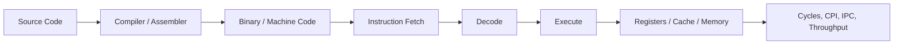
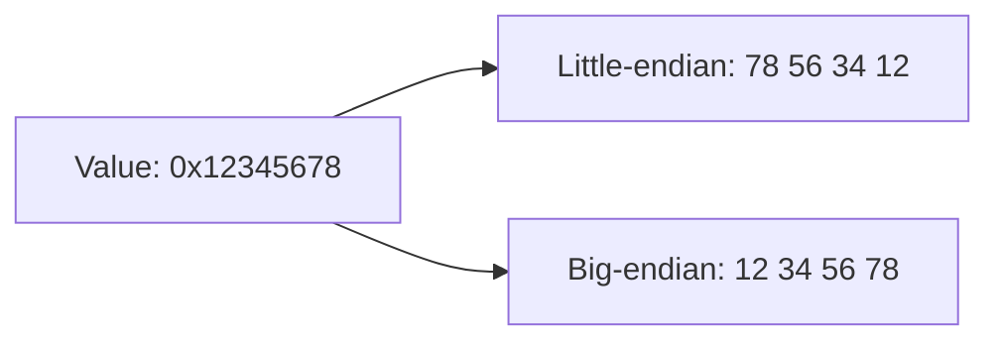
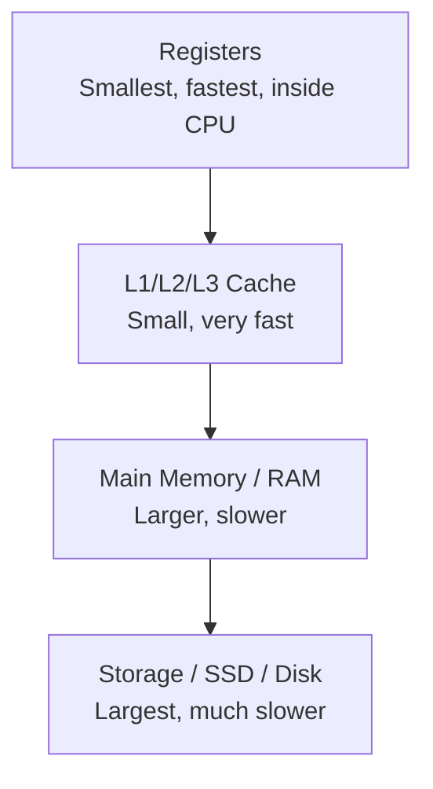
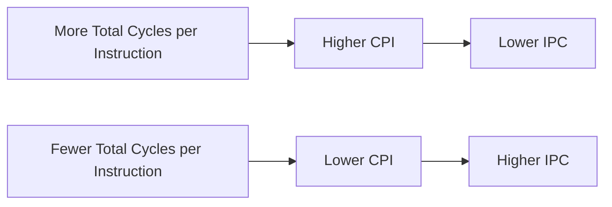

import AdBanner from '@site/src/components/AdBanner';
import Tabs from '@theme/Tabs';
import TabItem from '@theme/TabItem';

# Basic Terminology in Computer Organization and Architecture

## Quick Definitions

- **Bit**: the smallest unit of digital data, either `0` or `1`
- **Byte**: a group of 8 bits, usually the basic unit of memory addressing
- **Instruction**: one machine-level operation the CPU can execute
- **ISA**: the rulebook that defines the instructions and behavior software can rely on
- **Register**: tiny, very fast storage inside the CPU
- **Cache**: small, fast memory that keeps frequently used data close to the CPU
- **CPI**: cycles per instruction, or how many cycles each instruction costs on average
- **IPC**: instructions per cycle, or how much instruction work finishes each cycle on average

Computer Organization and Architecture can feel heavy at the start because many articles throw around words like **ISA**, **register**, **cache**, **pipeline**, **CPI**, and **IPC** before building any intuition.

If you've ever wondered:

- Why some programs run faster than others
- Why cache matters more than CPU speed
- What actually happens when your code runs

This article will connect all the core ideas in one clear mental model.

If you are new here, read these first:

- [How Source Code Becomes Binary](/docs/compilers/sourcecode_to_executable)
- [How CPUs Execute Binary](/docs/coa/cpu_execution)

Those two articles give the bigger picture. This one focuses on the vocabulary you need once the binary already exists and the CPU is already executing it.

## Who is this for?

This is for:

- beginners learning CPU basics or COA for the first time
- students moving from source code to machine-level thinking
- compiler learners who want to understand what generated code does on real hardware

## Follow CompilerSutra

- [🐦 Twitter - CompilerSutra](https://twitter.com/CompilerSutra)
- [💼 LinkedIn - Abhinav](https://www.linkedin.com/in/abhinavcompilerllvm/)
- [📺 YouTube - CompilerSutra](https://www.youtube.com/@compilersutra)
- [📘 Facebook - CompilerSutra](https://www.facebook.com/profile.php?id=61577245012547)
- [📝 Quora - CompilerSutra](https://compilersutra.quora.com/)


## Table of Contents

1. [Why this terminology matters](#why-this-terminology-matters)
2. [A simple code example first](#a-simple-code-example-first)
3. [One connected view of execution](#one-connected-view-of-execution)
4. [Data representation terms](#data-representation-terms)
5. [Instruction and execution terms](#instruction-and-execution-terms)
6. [CPU internal component terms](#cpu-internal-component-terms)
7. [Memory hierarchy terms](#memory-hierarchy-terms)
8. [What you should remember so far](#what-you-should-remember-so-far)
9. [Performance and pipeline terms](#performance-and-pipeline-terms)
10. [Why execution does not always move smoothly](#why-execution-does-not-always-move-smoothly)
11. [System-level terms](#system-level-terms)
12. [Common beginner mistakes](#common-beginner-mistakes)
13. [Try this thought experiment](#try-this-thought-experiment)
14. [Quick revision](#quick-revision-1-minute-recap)
15. [Interview insight](#interview-insight)
16. [Final thought](#final-thought)


<div>
    <AdBanner />
</div>


## Why this terminology matters

COA is not about memorizing hardware names. It is about understanding how software turns into machine activity.

When a program runs, the CPU is not thinking in terms of variables, loops, classes, or functions. It sees bits, bytes, instructions, addresses, registers, memory requests, and execution over cycles.

So if you want to understand why a program runs fast or slow, why one compiler generates better code than another, or why two processors behave differently, you need this vocabulary.

📩 Interested in deep dives like pipelines, cache, and compiler optimizations?
<div
  style={{
    width: '100%',
    maxWidth: '900px',
    margin: '1rem auto',
  }}
>
  <iframe
    src="https://docs.google.com/forms/d/e/1FAIpQLSebP1JfLFDp0ckTxOhODKPNVeI1e21rUqMJ0fbBwJoaa-i4Yw/viewform?embedded=true"
    style={{
      width: '100%',
      minHeight: '620px',
      border: '0',
      borderRadius: '12px',
      background: '#fff',
    }}
    loading="lazy"
  >
    Loading…
  </iframe>
</div>

## A Simple Code Example First

Take a simple line of code:

```c
sum = a + b;
```

At source level, that looks like one small step. At machine level, it may turn into something closer to:

```asm
load a -> register
load b -> register
add registers
store result
```

From the CPU's point of view, the rough flow is:

1. fetch the instruction bytes
2. decode the instruction
3. read operands from registers or memory
4. do the add in an execution unit
5. write the result back

That single example already touches [ISA](/docs/coa/cpu_execution), registers, [cache](/docs/coa/cpu_execution), and [pipeline](/docs/coa/cpu_execution) behavior. That is why these terms matter together, not separately.

## One Connected View of Execution

Before going term by term, it helps to see the whole flow once:



If this diagram already makes sense, the rest of the article will feel much easier.

## Data representation terms

<Tabs>
    <TabItem value="bit" label="Bit">
                At the lowest level, a computer works with **bits**. A bit is the smallest unit of information in a digital system, and it can hold only one of two values: `0` or `1`.

                Everything is built on top of bits. Numbers, characters, memory addresses, instructions, images, and entire programs all become patterns of bits.
</TabItem>

<TabItem value="byte" label="Byte">
        When bits are grouped in sets of eight, we call that a **byte**. In most modern systems, the byte is the basic addressable unit of memory.

        That means a memory address usually points to a byte. It is also why memory sizes such as kilobytes, megabytes, and gigabytes are measured as collections of bytes.
</TabItem>

<TabItem value="word" label="Word">
    You will also hear the term **word**. A word is the natural unit of data a processor handles efficiently.

    Its size depends on the architecture. On a 32-bit machine, a word is often 32 bits. On a 64-bit machine, it is often 64 bits. Word size influences instruction design, alignment rules, and how data moves through the machine.
    </TabItem>
</Tabs>

Once you understand these data units, it becomes much easier to talk about instructions and execution.

### Endianness

Another common basic term is **endianness**.

Endianness tells you the order in which bytes of a multi-byte value are stored in memory.

- **Little-endian** stores the least significant byte first
- **Big-endian** stores the most significant byte first

For example, if the 32-bit value is:

```text
0x12345678
```

then memory may store it like this:



This matters when you read memory dumps, work with binary files, or deal with network protocols.

## Instruction and execution terms

### Instruction

An **instruction** is one machine-level operation. It might add two numbers, load a value from memory, store a value back to memory, compare operands, or change control flow.

When we say a program is running, what we really mean is that the CPU is stepping through a sequence of instructions and updating machine state.

### Machine Code and Assembly

The binary form of those instructions is called **machine code**. This is what the CPU executes directly.

The readable form is **assembly language**. Assembly is not what the hardware runs, but it gives humans a close view of what the hardware is being told to do. That is why assembly is so useful when studying COA.

### ISA

The **Instruction Set Architecture**, or **ISA**, is the software-visible contract of the machine. It defines the instruction set, registers, data sizes, addressing rules, and the behavior software can rely on.

When people say x86-64, ARM, or RISC-V, they are talking about ISAs.

### ISA vs Microarchitecture

An ISA does not tell the whole performance story. Two CPUs can support the same ISA and still perform very differently.

That is where **microarchitecture** comes in. Microarchitecture is the internal hardware design used to implement the ISA. It includes details such as pipeline depth, branch prediction, execution units, cache hierarchy, scheduling logic, and out-of-order execution.

This distinction matters a lot. The ISA tells you what the machine promises. The microarchitecture tells you how that promise is delivered.

For example, an Intel Core i7 and an AMD Ryzen both implement the **x86-64 ISA**, but their microarchitectures, such as branch prediction, scheduling, and out-of-order execution behavior, are different.

### Why This Matters for Compilers

Compilers do not just translate syntax. They shape how efficiently the CPU will execute the final binary.

A compiler may try to:

- keep values in registers
- reduce unnecessary loads and stores
- pick instructions that fit the target ISA well
- reorder operations when it is safe
- generate code that behaves better with cache and pipeline flow

So when you study compilers, these terms stop being hardware trivia. They become the language needed to understand code quality.

## CPU internal component terms

### Registers

When the CPU executes instructions, it needs places to hold values temporarily. The fastest of those places are **registers**.

Registers are tiny storage locations inside the processor. They hold operands, intermediate results, addresses, loop counters, function arguments, and other values the CPU is actively working with.

**Registers are the fastest storage inside the CPU.**

### Program Counter

The **Program Counter**, or **PC**, stores the address of the next instruction to fetch.

After one instruction executes, the PC usually moves to the next one. If the instruction is a jump or branch, the PC may move somewhere else instead.

### ALU

The **ALU**, or **Arithmetic Logic Unit**, performs basic arithmetic and logical work such as addition, subtraction, comparisons, and bitwise operations.

In simple CPU diagrams, this is often shown as the place where computation happens.

### Control Unit

The **control unit** helps direct the work. It manages fetching, decoding, selecting hardware paths, and coordinating data movement through the machine.

These terms matter because they describe the CPU parts involved in the path from instruction to result.

## Memory hierarchy terms

### Main Memory

Registers are not enough to hold an entire program, so the rest of the code and data live in **memory**, usually meaning RAM.

Memory holds program instructions, data, the stack, the heap, and everything else needed while the program runs.

### Cache

The problem is that main memory is much slower than CPU-internal storage. That speed gap is one of the central facts of computer architecture.

That is why processors use **cache**. A cache is a smaller, faster memory placed much closer to the CPU. Its job is to keep recently used or frequently needed data and instructions nearby.

This is also why [How CPUs Execute Binary](/docs/coa/cpu_execution) spends so much time on data movement and execution flow. In real systems, data location often matters as much as the instruction itself.

### Cache Hit vs Cache Miss

A **cache hit** means the processor finds the needed data quickly in cache.

A **cache miss** means the data is not there, so the processor has to go farther down the memory hierarchy and pay a higher time cost.

In real workloads, cache behavior often matters more than raw arithmetic speed.

**Key idea:** CPU performance often depends more on data movement than raw computation.

### Memory Hierarchy Visual

Here is the memory hierarchy as a simple speed ladder:



The closer the data is to the CPU, the faster it is usually accessed. That is the core idea behind the memory hierarchy.

## What You Should Remember So Far

- programs run as machine instructions, not as high-level source code
- registers are the CPU's fastest working storage
- the ISA defines the visible machine model, but microarchitecture drives real performance
- cache exists because main memory is too slow to feed the CPU directly
- understanding execution means tracking both instructions and data movement


## Performance and pipeline terms

### Instruction

An **instruction** is one unit of machine work the CPU can execute.

Examples include:

- adding two values
- loading data from memory
- storing data back to memory
- comparing values
- changing control flow with a branch or jump

When a program runs, the CPU is really moving through a sequence of instructions.

### Clock Cycle

In COA, time is usually described in **clock cycles** rather than seconds.

A **clock cycle** is one tick of the processor clock. When people say an operation takes one cycle, four cycles, or two hundred cycles, they are describing how much processor time that work consumes relative to the machine's clock.

For example, if a CPU runs at `2 GHz`, that means it has roughly:

```text
2 billion cycles per second
```

If a piece of work takes `6 cycles`, the hardware has consumed six clock ticks to finish it.

### What a Cycle Really Means

A cycle is not the same thing as a full instruction. It is better to think of it as one small time step during which hardware does part of its work.

Depending on the processor design, one cycle may be used to fetch instruction bytes, decode an opcode, read operands, perform an ALU operation, access memory, or move a result toward writeback.

So when we say an instruction takes multiple cycles, we mean the processor needed multiple hardware steps to finish it.

Here is a simple way to visualize one instruction spread across cycles:


### How Many Cycles Does One Instruction Take?

There is no fixed answer for every instruction.

A simple register-to-register add may finish quickly because the operands are already inside the CPU. A load instruction often takes more work because the CPU must calculate an address and fetch data from **[cache](/docs/coa/cpu_execution)** or memory. A branch may also cost more because the next execution path depends on the branch outcome.

So the cycle count of one instruction depends on things like:

- where the operands come from
- whether memory must be accessed
- whether earlier instructions are still blocking progress
- whether control flow changes
- how complex the hardware operation is

That is exactly why metrics like **[CPI](/docs/coa/cpu_execution)** and **[IPC](/docs/coa/cpu_execution)** exist. They describe average behavior across many instructions, not just one isolated instruction.

### Pipeline

Once you understand cycles, it becomes easier to understand a **pipeline**.

A pipeline breaks instruction execution into stages so that different instructions can be in different phases of execution at the same time. A common simplified model uses fetch, decode, execute, memory access, and writeback.

The key idea is overlap. One instruction may be in decode while another is in execute and a third is being fetched. That does not make one instruction finish instantly, but it can greatly improve overall throughput.

Here is a simplified pipeline view:


If you want a deeper walkthrough of this execution flow, read [How CPUs Execute Binary](/docs/coa/cpu_execution).

### Latency and Throughput

**Latency** is the time it takes one operation to complete.

**Throughput** is how much total work the machine completes over time.

That distinction matters because a processor can have noticeable latency for a single operation and still deliver high throughput if the hardware stays busy.

Simple intuition:

- if one instruction needs `4 cycles`, its latency is 4 cycles
- if the pipeline completes `2 instructions per cycle` on average, the throughput is 2 instructions per cycle

### CPI and IPC

Two more terms appear all the time in performance discussions: **CPI** and **IPC**.

**CPI** means **Cycles Per Instruction**. It tells you how many cycles the processor spends per instruction on average for a workload. You can think of it as the average cost of each instruction.

Formula:

```text
CPI = Total Cycles / Total Instructions
```

Worked example:

```text
Total Cycles       = 600
Total Instructions = 300

CPI = 600 / 300 = 2
```

This means the processor spent 2 cycles per instruction on average.

**IPC** means **Instructions Per Cycle**. It tells you how many instructions the processor completes per cycle on average. You can think of it as the average amount of instruction work completed in each cycle.

Formula:

```text
IPC = Total Instructions / Total Cycles
```

Worked example:

```text
Total Instructions = 300
Total Cycles       = 600

IPC = 300 / 600 = 0.5
```

This means the processor completes half an instruction per cycle on average.

These two metrics are closely related:

```text
IPC = 1 / CPI
CPI = 1 / IPC
```

You can think of the relationship like this:



Another useful formula is basic instruction throughput:

```text
Throughput = Total Work / Total Time
```

In CPU-style discussions, that often becomes:

```text
Instruction Throughput = Total Instructions / Total Cycles
```

So in many simple examples, instruction throughput and IPC are numerically the same.

One more worked example:

```text
A program executes 800 instructions in 400 cycles.

IPC = 800 / 400 = 2
CPI = 400 / 800 = 0.5
```


<div>
    <AdBanner />
</div>


### Latency vs Throughput vs CPI vs IPC

| Term | What it means | Simple question | What usually improves performance |
| --- | --- | --- | --- |
| **Latency** | Time taken by one operation to finish | How long until the result is ready? | Lower |
| **Throughput** | Amount of work completed over time | How much work can the CPU keep finishing? | Higher |
| **CPI** | Average cycles spent per instruction | How many cycles does each instruction cost on average? | Lower |
| **IPC** | Average instructions completed per cycle | How much useful instruction work happens each cycle? | Higher |

### Performance Insight

Two programs can have the same number of instructions and still run at very different speeds.

Why?

- cache behavior, especially hits vs misses
- pipeline efficiency
- stalls and hazards
- instruction-level parallelism

That is why performance is not just about *how many instructions* you run, but *how those instructions interact with the hardware*.

If you want to go deeper into that interaction, the most useful ideas to track are **[cache](/docs/coa/cpu_execution)**, **[pipeline](/docs/coa/cpu_execution)**, **[CPI](/docs/coa/cpu_execution)**, and **[IPC](/docs/coa/cpu_execution)** behavior during execution.


<div>
    <AdBanner />
</div>

## Why Execution Does Not Always Move Smoothly

### Stall

A **stall** happens when the processor cannot move forward as expected and has to wait.

That waiting may happen because data has not arrived yet, because a previous instruction has not produced its result, because a branch has not been resolved, or because a needed hardware resource is busy.

### Hazard

A **hazard** is a condition that can disrupt normal pipelined execution.

- a **data hazard** appears when one instruction depends on another
- a **control hazard** appears when the next path depends on a branch decision
- a **structural hazard** appears when multiple operations compete for the same resource

These terms matter because real performance is more complicated than counting instructions. Two programs may execute the same number of instructions and still behave very differently because of stalls, hazards, cache misses, and branch behavior.

## System-level terms

You will also repeatedly see the words **core**, **thread**, **bus**, and **I/O**.

### Core

A **core** is an independent execution engine inside a processor. A modern CPU may contain several cores, allowing multiple instruction streams to make progress in parallel.

### Thread

A **thread** is a unit of execution within a program. Threads matter because real systems run many instruction streams, not just one.

### Bus

A **bus** is a communication path for moving data, addresses, or control information between hardware components.

### I/O

**I/O**, or input/output, refers to communication with external or peripheral devices such as disks, keyboards, displays, and network interfaces.

## Common Beginner Mistakes

These mistakes show up again and again:

- thinking the **ISA** and the CPU are the same thing
- assuming one instruction always takes one cycle
- mixing up **latency** and **throughput**
- treating **cache** like just a smaller version of RAM
- confusing **CPI** and **IPC**
- assuming clock speed alone explains performance
- forgetting that the CPU executes machine code, not C, C++, or Python directly

If you keep those distinctions clear, later topics become much easier to understand.

## Try This Thought Experiment

Which one will likely be faster?

1. A program with fewer instructions but many cache misses
2. A program with more instructions but most data in cache

Answer:

The second one is often faster.

Because memory latency from cache misses can dominate execution time far more than instruction count.

This is the point where COA stops feeling like theory and starts feeling practical.


<div>
    <AdBanner />
</div>


## Quick Revision (1-Minute Recap)

If you want a fast revision pass, remember these anchors:

- **bit, byte, word** describe the basic data units
- **instruction, machine code, assembly** describe what the CPU executes and how humans inspect it
- **ISA** defines the software-visible contract of the machine
- **microarchitecture** is the internal design that implements that contract
- **registers, PC, ALU, control unit** are core CPU execution terms
- **cache and memory** explain where code and data come from
- **cycle and pipeline** explain how execution progresses over time
- **latency, throughput, CPI, IPC** explain performance
- **stall and hazard** explain why execution does not always move smoothly

## Interview Insight

In interviews, people often want more than a memorized definition. They want to see whether you can connect concepts.

For example, if someone asks why two processors with the same ISA can perform differently, the strong answer is that the ISA defines what software can rely on, but the microarchitecture decides how efficiently that work is delivered through cache design, execution units, pipeline behavior, and scheduling.

## Final Thought

These terms are not isolated dictionary entries. They belong to one execution story.

Source code becomes binary. The binary contains machine instructions. The CPU fetches and executes those instructions using registers, execution units, caches, and memory. That execution unfolds over cycles, often through a pipeline. The result is described using words like latency, throughput, CPI, IPC, stall, and hazard.

Once you see the terms as one connected model, COA becomes much easier to read and reason about.

> Same code. Same instructions. Different performance.  
> The difference is hidden in cache, pipeline, and microarchitecture.

## What to Read Next

- [How Source Code Becomes Binary](/docs/compilers/sourcecode_to_executable)
- [How CPUs Execute Binary](/docs/coa/cpu_execution)
- [Computer Architecture vs Computer Organization](/docs/coa/intro_to_coa)
- [Computer Architecture Roadmap](/docs/coa)


<Tabs>
  <TabItem value="docs" label="📚 Documentation">
             - [CompilerSutra Home](https://compilersutra.com)
                - [CompilerSutra Homepage (Alt)](https://compilersutra.com/)
                - [Getting Started Guide](https://compilersutra.com/get-started)
                - [Newsletter Signup](https://compilersutra.com/newsletter)
                - [Skip to Content (Accessibility)](https://compilersutra.com#__docusaurus_skipToContent_fallback)


  </TabItem>

  <TabItem value="tutorials" label="📖 Tutorials & Guides">

        - [AI Documentation](https://compilersutra.com/docs/Ai)
        - [DSA Overview](https://compilersutra.com/docs/DSA/)
        - [DSA Detailed Guide](https://compilersutra.com/docs/DSA/DSA)
        - [MLIR Introduction](https://compilersutra.com/docs/MLIR/intro)
        - [TVM for Beginners](https://compilersutra.com/docs/tvm-for-beginners)
        - [Python Tutorial](https://compilersutra.com/docs/python/python_tutorial)
        - [C++ Tutorial](https://compilersutra.com/docs/c++/CppTutorial)
        - [C++ Main File Explained](https://compilersutra.com/docs/c++/c++_main_file)
        - [Compiler Design Basics](https://compilersutra.com/docs/compilers/compiler)
        - [OpenCL for GPU Programming](https://compilersutra.com/docs/gpu/opencl)
        - [LLVM Introduction](https://compilersutra.com/docs/llvm/intro-to-llvm)
        - [Introduction to Linux](https://compilersutra.com/docs/linux/intro_to_linux)

  </TabItem>

  <TabItem value="assessments" label="📝 Assessments">

        - [C++ MCQs](https://compilersutra.com/docs/mcq/cpp_mcqs)
        - [C++ Interview MCQs](https://compilersutra.com/docs/mcq/interview_question/cpp_interview_mcqs)

  </TabItem>

  <TabItem value="projects" label="🛠️ Projects">

            - [Project Documentation](https://compilersutra.com/docs/Project)
            - [Project Index](https://compilersutra.com/docs/project/)
            - [Graphics Pipeline Overview](https://compilersutra.com/docs/The_Graphic_Rendering_Pipeline)
            - [Graphic Rendering Pipeline (Alt)](https://compilersutra.com/docs/the_graphic_rendering_pipeline/)

  </TabItem>

  <TabItem value="resources" label="🌍 External Resources">

            - [LLVM Official Docs](https://llvm.org/docs/)
            - [Ask Any Question On Quora](https://compilersutra.quora.com)
            - [GitHub: FixIt Project](https://github.com/aabhinavg1/FixIt)
            - [GitHub Sponsors Page](https://github.com/sponsors/aabhinavg1)

  </TabItem>

  <TabItem value="social" label="📣 Social Media">

            - [🐦 Twitter - CompilerSutra](https://twitter.com/CompilerSutra)
            - [💼 LinkedIn - Abhinav](https://www.linkedin.com/in/abhinavcompilerllvm/)
            - [📺 YouTube - CompilerSutra](https://www.youtube.com/@compilersutra)

  </TabItem>
</Tabs>
