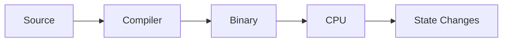
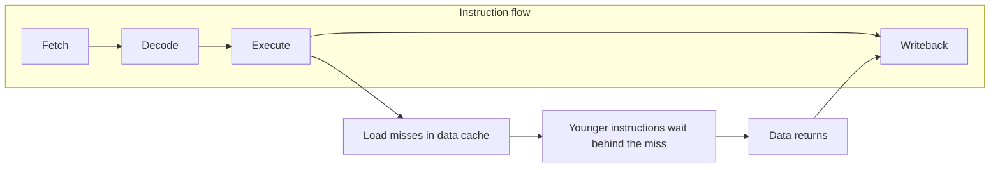
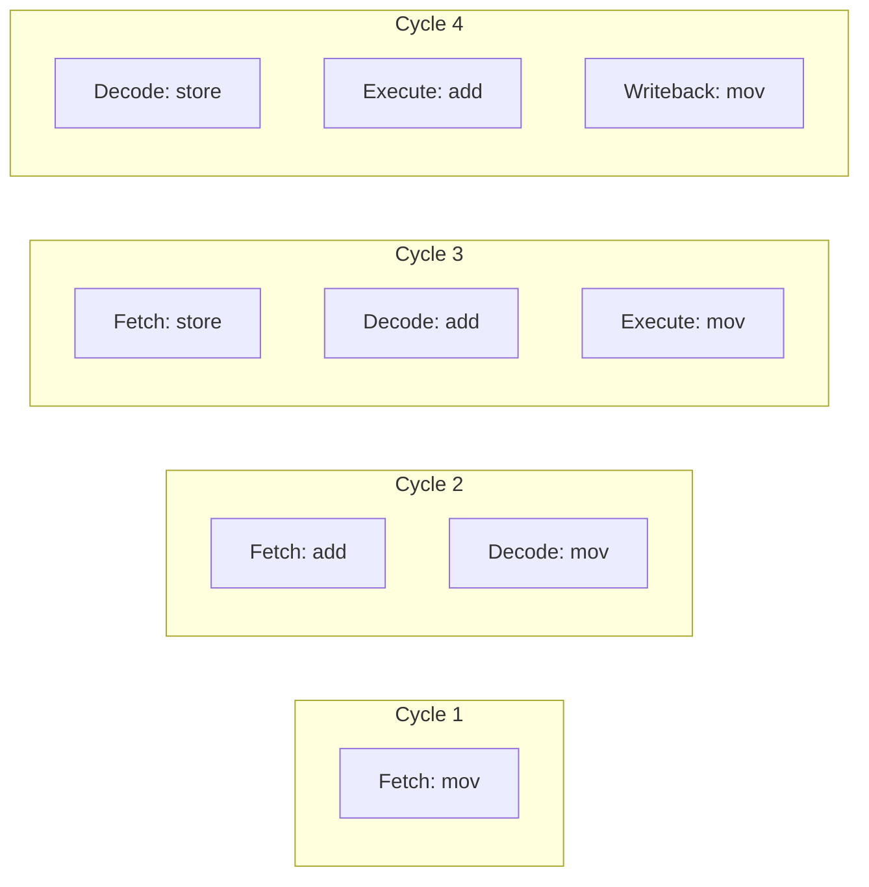
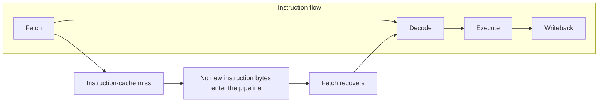

import AdBanner from '@site/src/components/AdBanner';
import Tabs from '@theme/Tabs';
import TabItem from '@theme/TabItem';
import PipelineAnimation from '@site/src/components/PipelineAnimation';
import { ComicQA } from '../mcq/interview_question/Question_comics' ;

# How CPU Executes Binary: Fetch–Decode–Execute Explained

Your CPU runs billions of instructions per second, but every one of those instructions still has to move through real hardware step by step. Once source code has become a binary and the loader places it in memory, the important question is this:

:::caution How does the CPU actually run it?
:::

If you are new to this topic, it is worth reading [From Source Code to Binary](/docs/compilers/sourcecode_to_executable) first. That article explains how source code becomes machine code. This article starts after that point, when the binary already exists and the CPU begins running it.

At this level, the important idea is the **[instruction set architecture](#faq)** or **[ISA](#faq)**. The ISA is the rulebook the CPU and low-level software agree on. It defines the [instructions](#faq), [registers](#faq), and basic memory rules a program uses to run correctly. Assembly language is the human-readable form of those machine instructions, and the assembler converts it into the [binary](#faq) form the CPU can execute. In real programs, a small set of instructions is used again and again, which is why those common instructions matter so much when we study datapaths, control, and [pipelining](#faq).

*Source note: inspired by **COMPUTER ORGANIZATION AND DESIGN: THE HARDWARE/SOFTWARE INTERFACE, RISC-V EDITION**, Chapter 2, Section 2.1 Introduction, page 166. Reference PDF: [HandP_RISCV.pdf](https://www.cse.iitd.ac.in/~rijurekha/col216_2025/HandP_RISCV.pdf).*

The CPU does not run C, Rust, Python, or LLVM IR directly. It runs bytes. Those bytes are machine [instructions](#faq) already placed in memory by the loader. The [program counter](#faq), usually called the [`PC`](#faq), holds the address of the next instruction. The CPU then repeats the same job again and again: [fetch](#faq) bytes from memory, [decode](#faq) what they mean, [execute](#faq) the operation, [write back](#faq) the result, and move to the next instruction.

:::tip Key Idea
This loop is called the instruction cycle.
:::
It happens billions of times per second, and it is the hardware reality behind compiler decisions like instruction selection, scheduling, and code layout.

This article focuses on that execution cycle. It starts with the simple fetch-decode-execute-writeback model, then shows how pipelining overlaps those stages to improve throughput on modern CPUs. The pipeline sections include cycle-by-cycle animations so you can see the machine moving, not just read definitions.

:::important What You Should Leave With
- The CPU executes machine state, not source-level ideas
- One instruction still takes multiple stages
- Pipelining improves throughput by overlapping instructions
- Memory stalls and dependencies often dominate performance
:::

:::caution Practice MCQs

Once complete, you can practice MCQs here:

- [COA MCQs Home](/docs/mcq/questions/domain/coa)
- [COA MCQs Quiz](/docs/mcq/questions/domain/coa/quiz)
:::


<div>
    <AdBanner />
</div>

## Table of Contents

1. [What Executing Binary Really Means](#what-executing-binary-really-means)
2. [The Instruction Cycle: Overview](#the-instruction-cycle-overview)
3. [Stage 1: Fetch](#stage-1-fetch)
4. [Stage 2: Decode](#stage-2-decode)
5. [Stage 3: Execute](#stage-3-execute)
6. [Stage 4: Writeback](#stage-4-writeback)
7. [How Pipelining Makes It Faster](#how-pipelining-makes-it-faster)
8. [Real Example: Walking Through Execution](#real-example-walking-through-execution)
9. [Common Misconceptions](#common-misconceptions)
10. [FAQ](#faq)


## What Executing Binary Really Means

When a binary starts running, the CPU is not looking at source code anymore. It is not reading variable names, loop syntax, or function definitions. All of that has already been lowered into machine instructions and memory state.



At runtime, the CPU works with a very small and very concrete view of the world:

* instruction bytes already placed in memory
* data bytes already placed in memory
* [registers](#faq) that hold temporary values and addresses
* the [program counter](#faq) (`PC`), which points at the next instruction
* control and status state such as flags and mode bits

That is enough to run a whole program. The CPU does not need to know that a certain memory location used to be called `x` in C++, or that a group of instructions came from a `for` loop. It only needs the current machine state and the next encoded instruction.

This is why execution is best understood as **state change**.
A CPU executes state transitions encoded as instructions.
One instruction reads part of the current state, performs some work, and produces an updated state. A load instruction changes a [register](#faq) by bringing in data from memory. An arithmetic instruction changes a register by computing a new value. A store instruction changes memory. A [branch](#faq) changes the next instruction address by updating control flow.

:::tip Read This Section In One Sentence
Executing a binary means repeatedly applying encoded instructions to the current machine state and producing the next machine state.
:::

For example, suppose the original source code was:

```cpp
x = x + 1;
```

By the time the CPU sees it, the operation is no longer a high-level statement. It looks more like a sequence such as:

```asm
mov eax, [addr_x]
add eax, 1
mov [addr_x], eax
```

Even here, the CPU still does not think in terms of “variable `x`.” It sees an address, some bytes, a register, and an add operation. First it reads bytes for the load instruction, then it reads the value at `addr_x`, then it adds `1`, then it writes the updated value back. That is the real machine-level meaning of “executing a program.”

So when we say “the CPU executes binary,” what we really mean is this: the processor keeps taking encoded instructions, combining them with the current machine state, and producing the next machine state. That idea will stay the same through fetch, decode, execute, writeback, and pipelining.

## The Instruction Cycle: Overview

At a high level, one instruction goes through the same sequence:

1. **[Fetch](#faq)**: read instruction bytes from the memory address in [`PC`](#faq)
2. **[Decode](#faq)**: interpret those bytes as an operation and identify operands
3. **[Execute](#faq)**: perform the operation using the [ALU](#faq), load/store unit, [branch](#faq) unit, or other execution hardware
4. **[Writeback](#faq)**: write the result to [registers](#faq) or complete the store path
5. **Update [`PC`](#faq)**: move to the next sequential instruction or branch target

This is the basic loop behind machine-code execution. The exact details change across CPUs and [microarchitectures](#faq), but the overall structure stays the same.

:::important ⚠️
Real CPUs have varying pipeline stages; refer to ISA and microarchitecture documentation for exact details.
:::

:::tip Quick Summary
One instruction goes through Fetch, Decode, Execute, Writeback, and PC update. Pipelining later overlaps these steps across multiple instructions.
:::


## Stage 1: Fetch

Fetch begins with the program counter.

The CPU uses the address in `PC` to ask for the next instruction bytes. It usually checks the instruction cache first. If the bytes are already there, fetch is fast. If not, the CPU may have to wait while the request goes deeper into the memory system.

What happens during fetch:

* the frontend reads bytes from the address in `PC`
* the instruction cache supplies recently used instructions when possible
* the processor figures out how many bytes belong to the current instruction
* the next `PC` is computed as either the next instruction or a branch target

Latency matters here too. A simple memory-speed intuition is:

| Location | Typical latency |
| --- | --- |
| L1 cache | 4 cycles |
| L2 cache | 12 cycles |
| L3 cache | 40 cycles |
| DRAM | 200+ cycles |

Instruction fetch usually comes from the instruction cache, but the same idea applies: if the CPU cannot get bytes quickly, the rest of the pipeline waits.

Example:

```asm
; PC = 0x1000
mov eax, [rdi]
; after fetch, the CPU has the bytes for this instruction
; the next sequential PC depends on the instruction length
```

On AArch64, instruction fetch is simpler because instructions are always 4 bytes long. On x86, instruction length can vary, so the CPU must also figure out where one instruction ends and the next begins.

## Stage 2: Decode

Decode turns instruction bytes into something the CPU can act on.

At this stage, the CPU identifies:

* the opcode
* the source and destination operands
* whether the instruction uses an immediate
* whether it needs memory access
* which execution resources will be involved

For fixed-length ISAs, decode is more regular. For x86, decode is harder because instruction length can vary and one instruction may trigger several internal actions.

Example:

```asm
add eax, [rbx + rcx*4]
```

Architecturally, that is one x86 instruction. Internally, it may decode into multiple µops:

```text
µop 1: compute address and load from [rbx + rcx*4]
µop 2: add loaded value to eax
```

That distinction matters on x86: one line of assembly may still turn into multiple internal operations. So even when the source looks like “one instruction,” the CPU frontend may still have to decode and feed several smaller pieces of work into the machine.

That is why compiler engineers often care about `µops`, not just instruction count. A short assembly sequence is not always a light sequence for the CPU frontend.

Decode speed can limit performance. On modern x86 cores, the frontend often handles only a limited number of `µops` per cycle. Very complex instructions may expand into many more internal operations.

<div>
    <AdBanner />
</div>

## Stage 3: Execute

Execute is where the CPU actually does the work described by the instruction.

Different hardware blocks handle different kinds of work:

* the ALU performs integer arithmetic and logic
* the FPU handles floating-point arithmetic
* the AGU computes memory addresses
* load/store hardware talks to the data cache
* the branch unit resolves control-flow decisions

Memory access is part of execution too. A load instruction executes by computing an address and reading data. A store instruction executes by computing an address and preparing data to be written.

Example:

```asm
mov eax, [rdi]
```

Execution for this instruction includes:

* AGU computes the address from `rdi`
* load unit reads data from the cache hierarchy
* the loaded value becomes the result that will later be written to `eax`

If the load hits in L1, the result may come back in a few cycles. If it misses L1 and has to go to L2, L3, or DRAM, the instruction may wait much longer.

### Dependency Chains vs Independent Work

Latency and throughput are different.

* **Latency** is how long one instruction takes to produce its result.
* **Throughput** is how often a core can start similar instructions.

Example:

```asm
; dependency chain
add eax, ebx
add eax, ecx
add eax, edx
```

Each instruction depends on the new value of `eax` from the previous one, so they cannot all make progress at the same time.

Contrast that with:

```asm
; independent work
add eax, ebx
add ecx, edx
add esi, edi
```

These instructions write to different registers, so the processor can overlap them more easily if hardware resources are available.

Another practical example is multiply. A multiply may take a few cycles before its result is ready, but the CPU may still be able to start a new multiply every cycle.

### Memory Cost Usually Dominates

When code runs slowly, the expensive part is often not the arithmetic. It is waiting for memory.

```asm
mov eax, [rbx]
add ecx, eax
```

If `[rbx]` hits in L1, this is cheap. If it misses out to DRAM, the `add` is effectively waiting on a 200+ cycle event.

That is why compiler optimizations such as better locality, loop tiling, vectorization, and alias analysis often matter more than removing one arithmetic instruction from a hot loop.

<div>
    <AdBanner />
</div>

### Animated Pipeline View: Execute Stall from a Data Cache Miss

Use this small example:

```asm
mov eax, [rdi]
add eax, 5
mov [rsi], eax
```

What happens in this stall case:

1. In the early cycles, the first instruction `mov eax, [rdi]` moves through Fetch and Decode.
2. Then it reaches Execute and tries to load data from memory.
3. That load misses in the data cache, so the value is not ready yet.
4. Because `add eax, 5` needs the loaded value in `eax`, later instructions cannot move forward normally.
5. The pipeline stalls until the missing data arrives.
6. Then execution resumes and dependent work can move again.



| Cycle | Fetch | Decode | Execute | Writeback | Update PC | Reason |
| --- | --- | --- | --- | --- | --- | --- |
| Cycle 1 | `mov eax, [rdi]` | — | — | — | next | The CPU starts by fetching the load instruction from the address in the program counter. No earlier instruction is in the pipeline yet. |
| Cycle 2 | `add eax, 5` | `mov eax, [rdi]` | — | — | next | The load instruction is being decoded, and the CPU fetches the next instruction, `add eax, 5`, behind it. This is normal pipeline filling. |
| Cycle 3 | `sub ebx, 2` | `add eax, 5` | `mov eax, [rdi]` | — | wait | The load instruction is now in Execute and is trying to read the memory value stored at the address in `rdi`. That value has not come back yet, so the CPU cannot produce the new value for `eax` yet. |
| Cycle 4 | `xor ecx, ecx` | `sub ebx, 2` | `mov eax, [rdi] MISS` | — | stalled | The CPU discovers that the needed memory value is not in the fast data cache. This is a cache miss, so the processor must wait for the value to come from a slower level of memory. |
| Cycle 5 | `xor ecx, ecx STALL` | `sub ebx, 2 STALL` | `mov eax, [rdi] waiting for data` | — | stalled | The missing data is still not back. The next important instruction, `add eax, 5`, cannot run yet because it needs the loaded value that `mov eax, [rdi]` is supposed to place into `eax`. Since that input is missing, later work is blocked. |
| Cycle 6 | `xor ecx, ecx STALL` | `sub ebx, 2 STALL` | `mov eax, [rdi] READY` | — | resume | The requested memory value has finally arrived from the cache hierarchy or main memory. The load instruction now has the data it needed and can finish, which means `eax` will soon contain the correct loaded value. |
| Cycle 7 | `mov [rsi], eax` | `xor ecx, ecx` | `add eax, 5` | `mov eax, [rdi]` | next | The load result is now available, so `add eax, 5` can finally use that loaded value as its input. The stall ends because the dependency on the memory data has been resolved. |

This is the backend-side failure mode: the miss happens in Execute, and the visible result is backpressure behind it.

<PipelineAnimation scenario="executeStall" />

## Stage 4: Writeback

Writeback is the stage where the result becomes officially visible to the program.

At this stage:

* ALU or load results are written into destination registers
* condition codes or flags may be updated
* store data moves into the store path so the memory update can complete
* the CPU is ready to keep fetching later instructions

Example:

```asm
add eax, 5
```

After Execute computes the sum, Writeback updates `eax` with the new value.

Write bandwidth matters too. Register files have limited read and write ports, so the CPU cannot do unlimited register updates in the same cycle.

## How Pipelining Makes It Faster

Without pipelining, the CPU would finish one instruction before starting the next. With pipelining, stages overlap, so different instructions can sit in Fetch, Decode, Execute, and Writeback at the same time.

| Cycle | Fetch | Decode | Execute | Writeback |
| --- | --- | --- | --- | --- |
| 1 | `mov eax, [rdi]` | - | - | - |
| 2 | `add eax, 5` | `mov eax, [rdi]` | - | - |
| 3 | `mov [rsi], eax` | `add eax, 5` | `mov eax, [rdi]` | - |
| 4 | next instruction | `mov [rsi], eax` | `add eax, 5` | `mov eax, [rdi]` |

After the pipeline fills, the machine can complete about one instruction per cycle in this simplified model, even though each instruction still needs several stages to finish.

The key idea is throughput versus latency:

* latency is how long one instruction takes from Fetch to Writeback
* throughput is how often the pipeline finishes another instruction once it is full

Pipelining improves throughput by overlapping work from different instructions.

### Animated Pipeline View: Normal Flow

Imagine these instructions:

```asm
mov eax, [rdi]
add eax, 5
mov [rsi], eax
```

What happens in the normal case:

1. Cycle 1: the CPU fetches the first instruction.
2. Cycle 2: the first instruction moves to Decode, and the second instruction is fetched.
3. Cycle 3: the first instruction moves to Execute, the second goes to Decode, and the third is fetched.
4. Cycle 4: the first instruction reaches Writeback while the other instructions keep moving forward.
5. After that, the pipeline stays busy because different instructions occupy different stages at once.



| Cycle | Fetch | Decode | Execute | Writeback | Update PC |
| --- | --- | --- | --- | --- | --- |
| Cycle 1 | `mov eax, [rdi]` | — | — | — | next |
| Cycle 2 | `add eax, 5` | `mov eax, [rdi]` | — | — | next |
| Cycle 3 | `sub ebx, 2` | `add eax, 5` | `mov eax, [rdi]` | — | next |
| Cycle 4 | `xor ecx, ecx` | `sub ebx, 2` | `add eax, 5` | `mov eax, [rdi]` | next |
| Cycle 5 | `mov [rsi], eax` | `xor ecx, ecx` | `sub ebx, 2` | `add eax, 5` | next |
| Cycle 6 | next instruction | `mov [rsi], eax` | `xor ecx, ecx` | `sub ebx, 2` | next |
| Cycle 7 | next instruction | next instruction | `mov [rsi], eax` | `xor ecx, ecx` | next |

This is the steady-state case. Instructions keep moving one stage per cycle once the pipeline fills.

<PipelineAnimation scenario="normal" />

### Pipeline Hazards

Pipelining introduces hazards:

* **Data hazard**: an instruction needs a result that is not ready yet
* **Control hazard**: a branch changes the `PC`, so fetched instructions may be wrong
* **Structural hazard**: two instructions need the same hardware resource in the same cycle

Modern CPUs reduce these costs with techniques such as forwarding and branch prediction, but the key beginner-level idea is simpler: pipelining improves throughput by overlapping stages. It does not make each instruction free.

Branch mispredictions are expensive because the CPU must throw away work from the wrong path and restart fetch from the correct target. A typical modern penalty is often around 15 to 20 cycles.

### Animated Pipeline View: Fetch Stall from an I-Cache Miss

Imagine this instruction stream:

```asm
mov eax, [rdi]
add eax, 5
mov [rsi], eax
```

What happens in this fetch-stall case:

1. The CPU starts by fetching the first few instructions normally.
2. Then Fetch asks for the next instruction bytes.
3. Those instruction bytes are not in the instruction cache.
4. Because Fetch cannot get the next instruction quickly, the frontend cannot keep feeding the pipeline.
5. Some later stages may still finish the work already inside the pipeline.
6. The pipeline partially empties until the missing instruction bytes arrive.
7. Once the bytes arrive, Fetch starts feeding instructions again.



| Cycle | Fetch | Decode | Execute | Writeback | Update PC |
| --- | --- | --- | --- | --- | --- |
| Cycle 1 | `mov eax, [rdi]` | — | — | — | next |
| Cycle 2 | `add eax, 5` | `mov eax, [rdi]` | — | — | next |
| Cycle 3 | `sub ebx, 2` | `add eax, 5` | `mov eax, [rdi]` | — | next |
| Cycle 4 | `xor ecx, ecx MISS` | `sub ebx, 2` | `add eax, 5` | `mov eax, [rdi]` | stalled |
| Cycle 5 | `STALL` | — | `sub ebx, 2` | `add eax, 5` | stalled |
| Cycle 6 | `STALL` | — | — | `sub ebx, 2` | stalled |
| Cycle 7 | `xor ecx, ecx READY` | — | — | — | next |
| Cycle 8 | `mov [rsi], eax` | `xor ecx, ecx` | — | — | next |

As explained in the Fetch stage, instruction bytes normally come from the instruction cache. Here we focus only on the failure case: Fetch cannot supply new bytes because the instruction stream missed in the cache hierarchy.

<PipelineAnimation scenario="fetchStall" />

## Real Example: Walking Through Execution

<Tabs>
  <TabItem value="x86" label="x86 Example">

```asm
mov eax, [rdi]
add eax, 5
mov [rsi], eax
```

**Cycle-by-cycle in a simplified pipeline**

1. **Fetch**: `PC` points to `mov eax, [rdi]`. The CPU fetches the instruction bytes from the instruction cache.
2. **Decode**: The frontend identifies a load into `eax` using address in `rdi`.
3. **Execute**: The AGU computes the address from `rdi`, and the load unit requests the data from the cache hierarchy.
4. **Writeback**: If the load hits in L1, the loaded value is written into `eax`.
5. **Fetch**: The CPU fetches `add eax, 5`.
6. **Decode**: Decode identifies source `eax`, immediate `5`, and destination `eax`.
7. **Execute**: The integer ALU adds `5` to the value in `eax`.
8. **Writeback**: The new value is written back to `eax`.
9. **Fetch/Decode**: The CPU brings in `mov [rsi], eax`.
10. **Execute**: Address generation computes the store address from `rsi`.
11. **Writeback/Store path**: The value is sent into the store path so memory can be updated.

The real performance factor is often the first instruction. If the load misses L1 and goes to L2, L3, or DRAM, the whole sequence slows down while it waits for data.

  </TabItem>
  <TabItem value="arm" label="ARM Example">

```asm
ldr w0, [x1]
add w0, w0, #5
str w0, [x2]
```

The execution pattern is conceptually the same:

1. fetch the `ldr`
2. decode it as a load
3. execute address generation and data-cache access
4. write the loaded value into `w0`
5. fetch and decode `add`
6. execute the integer addition
7. write the result back to `w0`
8. fetch and decode `str`
9. execute address generation and place the value on the store path

The key architectural difference is that AArch64 is a load-store ISA with fixed 4-byte instruction length. That makes fetch and decode more regular than x86, but the overall instruction cycle is the same.

  </TabItem>
</Tabs>

### Instruction Timeline View

The live timeline is built into the animation widget above. Use `Play`, `Pause`, `Step`, and `Reset` to watch one instruction move forward while other instructions overlap behind it. The point of the timeline is to make two facts obvious:

* each instruction still spends multiple cycles inside the CPU
* multiple instructions overlap, so the CPU can still complete work every cycle once the pipeline is full

## Why This Matters for Compiler Engineers

Compiler engineers do not just emit correct instructions. They emit instruction sequences that have to run on real pipelines, real caches, and real execution hardware.

That matters in practice because:

* instruction selection affects how many internal operations the CPU may need to execute
* instruction scheduling affects whether dependent work stalls or overlaps cleanly
* register allocation affects pressure on registers and spill traffic to memory
* code layout affects fetch behavior, instruction-cache locality, and branch cost
* memory access patterns affect whether loads hit in cache or stall for much longer

This is the bridge between compiler output and hardware performance. If you understand how the CPU executes binary, backend decisions stop looking abstract and start looking mechanical.


## Common Misconceptions

1. **"The CPU runs one instruction fully, then starts the next one."**  
   Not usually. In a pipeline, several instructions can be in different stages at the same time.

2. **"Higher GHz always means faster programs."**  
   Not always. Cache misses, stalls, decode limits, and branch penalties can dominate.

3. **"RISC is always faster than CISC."**  
   Not automatically. Real performance depends on the whole CPU design, not just the ISA label.

4. **"The CPU understands loops, variables, and functions."**  
   It does not. It executes machine instructions and updates machine state.

5. **"Hardware can always fix poorly written code."**  
   Hardware can hide some costs, but it cannot remove true data dependencies or erase cache misses.

## FAQ

Before the questions, here is a quick glossary for terms that may feel unfamiliar.

| Term | Simple definition |
| --- | --- |
| Binary | The final machine-code program that the CPU can run |
| Instruction | One machine-level operation such as load, add, or store |
| Program Counter (`PC`) | A register that stores the address of the next instruction |
| Register | Very small, very fast storage inside the CPU |
| Fetch | The stage where the CPU reads instruction bytes |
| Decode | The stage where the CPU figures out what an instruction means |
| Execute | The stage where the CPU does the actual work |
| Writeback | The stage where the result is written to a register or store path |
| Pipeline | A design where multiple instructions are in different stages at the same time |
| Throughput | How much work the CPU finishes over time |
| Latency | How long one operation takes to finish |
| Cache | Small, fast memory that keeps recently used data or instructions close to the CPU |
| L1 / L2 / L3 | Different cache levels, with L1 usually being the smallest and fastest |
| DRAM | Main memory; much larger than cache but much slower |
| Frontend | The part of the CPU that fetches and decodes instructions |
| Backend | The part of the CPU that executes instructions and handles results |
| ALU | Arithmetic Logic Unit, used for integer math and logic |
| FPU | Floating Point Unit, used for decimal-number arithmetic |
| AGU | Address Generation Unit, used to compute memory addresses |
| ISA | Instruction Set Architecture, the rules and instruction format visible to software |
| Microarchitecture | The internal CPU design used to implement an ISA |
| `µop` | A small internal operation that a CPU may break an instruction into |
| Branch | An instruction that changes control flow, such as a jump or conditional jump |
| Branch prediction | Hardware guessing which branch path will be taken |
| Stall | A cycle where part of the pipeline cannot move forward |
| Hazard | A situation that prevents smooth pipeline flow |
| Data hazard | A later instruction needs a result that is not ready yet |
| Control hazard | The CPU may have fetched the wrong instructions because of a branch |
| Structural hazard | Two instructions need the same hardware resource at the same time |
| Out-of-order execution | A CPU feature that lets independent instructions run earlier to hide delays |

### How does the CPU know how many bytes belong to one instruction?

On CPUs with fixed-size instructions, such as AArch64, every instruction has the same size. On x86, instruction size can vary, so the decode hardware must figure out instruction boundaries from the byte stream.

### What happens when the CPU fetches an invalid instruction?

The CPU detects that the bytes do not represent a valid instruction. It raises an illegal-instruction exception, and the operating system usually stops the program with a signal such as `SIGILL`.

### Why do branch mispredictions cost so much?

Because the CPU may already have fetched and partially processed instructions from the wrong path. It then has to throw away that work and restart from the correct path.

### Can the CPU execute instructions out of order?

Yes, many modern CPUs can run independent instructions out of order to keep hardware busy. The final visible result still stays correct.

### How do I tell whether code is fetch-bound or execution-bound?

You usually check performance counters. Frontend stall counters can point to fetch or decode problems, while cycle counts, CPI, and memory counters can point to execution or memory bottlenecks.

## More Articles

1. [From Source Code to Binary](/docs/compilers/sourcecode_to_executable) - How your code becomes machine code
2. [Computer Architecture vs Organization](/docs/coa/intro_to_coa) - The ISA and microarchitecture distinction
3. [LLVM IR Introduction](/docs/llvm/llvm_ir/intro_to_llvm_ir) - How compilers represent code before lowering
4. [Static Single Assignment](/docs/llvm/llvm_Curriculum/level0/Static_Single_Assignment) - Compiler IR that enables optimization


<Tabs>
  <TabItem value="docs" label="📚 Documentation">
             - [CompilerSutra Home](https://compilersutra.com)
                - [CompilerSutra Homepage (Alt)](https://compilersutra.com/)
                - [Getting Started Guide](https://compilersutra.com/get-started)
                - [Skip to Content (Accessibility)](https://compilersutra.com#__docusaurus_skipToContent_fallback)


  </TabItem>

  <TabItem value="tutorials" label="📖 Tutorials & Guides">

        - [AI Documentation](https://compilersutra.com/docs/Ai)
        - [DSA Overview](https://compilersutra.com/docs/DSA/)
        - [DSA Detailed Guide](https://compilersutra.com/docs/DSA/DSA)
        - [MLIR Introduction](https://compilersutra.com/docs/MLIR/intro)
        - [TVM for Beginners](https://compilersutra.com/docs/tvm-for-beginners)
        - [Python Tutorial](https://compilersutra.com/docs/python/python_tutorial)
        - [C++ Tutorial](https://compilersutra.com/docs/c++/CppTutorial)
        - [C++ Main File Explained](https://compilersutra.com/docs/c++/c++_main_file)
        - [Compiler Design Basics](https://compilersutra.com/docs/compilers/compiler)
        - [OpenCL for GPU Programming](https://compilersutra.com/docs/gpu/opencl)
        - [LLVM Introduction](https://compilersutra.com/docs/llvm/intro-to-llvm)
        - [Introduction to Linux](https://compilersutra.com/docs/linux/intro_to_linux)

  </TabItem>

  <TabItem value="assessments" label="📝 Assessments">

        - [C++ MCQs](https://compilersutra.com/docs/mcq/cpp_mcqs)
        - [C++ Interview MCQs](https://compilersutra.com/docs/mcq/interview_question/cpp_interview_mcqs)

  </TabItem>

  <TabItem value="projects" label="🛠️ Projects">

            - [Project Documentation](https://compilersutra.com/docs/Project)
            - [Project Index](https://compilersutra.com/docs/project/)
            - [Graphics Pipeline Overview](https://compilersutra.com/docs/The_Graphic_Rendering_Pipeline)
            - [Graphic Rendering Pipeline (Alt)](https://compilersutra.com/docs/the_graphic_rendering_pipeline/)

  </TabItem>

  <TabItem value="resources" label="🌍 External Resources">

            - [LLVM Official Docs](https://llvm.org/docs/)
            - [Ask Any Question On Quora](https://compilersutra.quora.com)
            - [GitHub: FixIt Project](https://github.com/aabhinavg1/FixIt)
            - [GitHub Sponsors Page](https://github.com/sponsors/aabhinavg1)

  </TabItem>

  <TabItem value="social" label="📣 Social Media">

            - [🐦 Twitter - CompilerSutra](https://twitter.com/CompilerSutra)
            - [💼 LinkedIn - Abhinav](https://www.linkedin.com/in/abhinavcompilerllvm/)
            - [📺 YouTube - CompilerSutra](https://www.youtube.com/@compilersutra)
            - [💬 Join the CompilerSutra Discord for discussions](https://discord.gg/d7jpHrhTap)

  </TabItem>
</Tabs>
