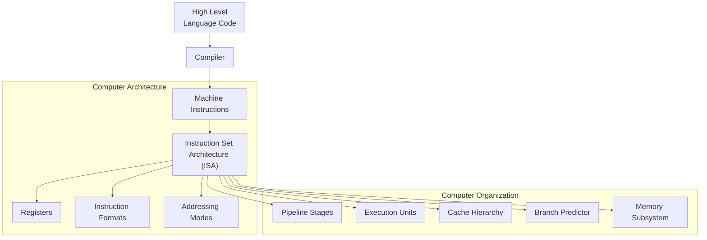

import AdBanner from '@site/src/components/AdBanner';
import Tabs from '@theme/Tabs';
import TabItem from '@theme/TabItem';
import { ComicQA } from '../mcq/interview_question/Question_comics' ;

# Computer Architecture vs Computer Organization:
>>  What Every Compiler Programmer Should Know
:::tip Why Every Compiler Engineer Should Understand the Difference
:::

Modern computing systems operate through a carefully designed interaction between **software abstractions and physical hardware implementation**.

For compiler engineers, systems programmers, GPU developers, and low-level software engineers, understanding this relationship is essential.

Two fundamental concepts describe this interaction:

* **Computer Architecture**
* **Computer Organization**

Although these terms are often used interchangeably, they represent **different layers of computer system design**.

Understanding the distinction is critical for anyone working in:

* compiler development
* operating systems
* GPU programming
* AI/ML infrastructure
* high-performance computing (HPC)
* performance engineering
* low-level systems programming

Before diving into the definitions, it is important to understand **why this topic matters in modern computing systems.**


:::caution Why This Topic Matters
:::

Designing a computer system is a complex engineering challenge.

A computer designer must determine **which attributes are most important for a new machine**, and then design the system to maximize:

* performance
* energy efficiency
* scalability

while staying within constraints such as:

* cost
* power consumption
* manufacturing limitations
* cooling and packaging constraints

This task involves many aspects of system design, including:

* instruction set design
* functional organization of the processor
* logic design
* hardware implementation

The implementation itself may include areas such as:

* integrated circuit design
* chip packaging
* power delivery
* cooling and thermal management

Optimizing such systems requires familiarity with a **wide range of technologies**, spanning both software and hardware domains, including:

* compilers
* operating systems
* runtime systems
* digital logic design
* semiconductor manufacturing
* packaging technologies

:::important Expanding scope of Computer Architecture
:::
Several years ago, the term **computer architecture** was often used in a much narrower sense. It was commonly associated only with **instruction set design**.

Other aspects of computer system design were categorized as **implementation** or **computer organization**, sometimes implying that they were less important or less challenging.

However, this view is misleading.

The role of a computer architect goes far beyond defining an instruction set. In fact, many of the most difficult engineering challenges arise in areas such as:

* pipeline design
* cache hierarchy design
* parallel execution models
* memory systems
* power efficiency
* hardware specialization for AI workloads

Modern processors must efficiently support workloads such as:

* graphics rendering on GPUs
* large-scale cloud computing
* scientific simulations
* machine learning training and inference

To support these workloads, modern systems increasingly include specialized hardware such as:

* **GPUs**
* **AI accelerators**
* **tensor processing units**
* **vector processing units**
* **domain-specific accelerators**

Designing such systems requires coordination across multiple layers of the computing stack.

For example:

* **Compilers** must generate instructions that efficiently utilize hardware resources.
* **Operating systems** must manage memory and scheduling across heterogeneous devices.
* **Hardware architects** must design pipelines, caches, and execution units that support modern workloads efficiently.

Because of this deep interaction between hardware and software, understanding the difference between **computer architecture** and **computer organization** is crucial.


Let's begin today's topic on Computer Architecture Vs Computer Organization


Social Media


<Tabs>
  <TabItem value="social" label="📣 Social Media">

            - [🐦 Twitter - CompilerSutra](https://twitter.com/CompilerSutra)
            - [💼 LinkedIn - Abhinav](https://www.linkedin.com/in/abhinavcompilerllvm/)
            - [📺 YouTube - CompilerSutra](https://www.youtube.com/@compilersutra)
            - [💬 Join the CompilerSutra Discord for discussions](https://discord.gg/d7jpHrhTap)

  </TabItem>
</Tabs>


<div>
    <AdBanner />
</div>


## Table of Contents

1. [Why This Topic Is Important](#section-1-why-this-topic-is-important)  
2. [What is Computer Architecture?](#section-2-what-is-computer-architecture)  
3. [What is Computer Organization?](#section-3-what-is-computer-organization)  
4. [Key Differences Between Architecture and Organization](#section-4-key-differences-between-computer-architecture-and-computer-organization)  
5. [Real Examples from Modern Processors](#section-5-real-examples-from-modern-processors)  
6. [Why Compiler Engineers Care About Computer Architecture](#section-6-why-compiler-engineers-care-about-computer-architecture)  
7. [Why Computer Organization Still Matters for Performance](#section-7-why-computer-organization-still-matters-for-performance)  
8. [Simple Analogy to Understand the Difference](#simple-analogy-to-understand-the-difference)  
[Key Takeaways](#key-takeaways)
---

## Architecture and Organization in a Computer System


<details> 
<summary> Digram Explanation</summary>

### Software Layer

At the highest level, developers write programs using **high-level programming languages** such as C, C++, Python, Rust, or CUDA. These languages are designed to make programming easier and more portable across different systems. However, processors cannot directly execute high-level code. A **compiler** (such as GCC, Clang, LLVM, or MLIR-based compilers) translates this code into **machine instructions** that a processor can understand. This compilation process acts as the bridge between software written by developers and the underlying hardware that executes it.


### Computer Architecture

Computer architecture defines the **programmer-visible interface of the machine**, which is primarily represented by the **Instruction Set Architecture (ISA)**. The ISA specifies what operations a processor supports and how software interacts with it. This includes elements such as registers, instruction formats, addressing modes, data types, and the memory model. For example, an instruction like `ADD R1, R2, R3` is defined by the ISA, meaning the processor must add values from registers R2 and R3 and store the result in R1. The ISA acts as a **contract between software and hardware**, allowing different processors to run the same programs as long as they implement the same ISA.


### Computer Organization

Computer organization describes **how the processor is internally built to execute the ISA instructions efficiently**. It focuses on the internal hardware structures and design techniques used to achieve high performance. Examples include pipeline stages, execution units such as ALUs and FPUs, cache hierarchies (L1, L2, L3), branch prediction mechanisms, and the memory subsystem. Two processors may implement the same ISA but use completely different organizations. For instance, one processor may use a simple pipeline while another may use superscalar or out-of-order execution to improve performance.


### Physical Hardware

At the lowest level, the processor is implemented using **physical electronic components**. These include transistors, integrated circuits, chip packaging, power delivery networks, and cooling systems. These physical aspects determine important characteristics such as power consumption, heat generation, manufacturing cost, and overall reliability of the system. Advances in semiconductor technology and chip design directly influence how efficiently a processor can implement its architecture and organization.


:::tip Key Insight for Compiler Engineers and GPU Programmers

For compiler engineers and low-level system developers, the difference between **computer architecture** and **computer organization** directly impacts how efficient software becomes on real hardware. Compilers primarily target the **Instruction Set Architecture (ISA)** because it defines the instructions, registers, memory operations, and control flow that software can use. However, generating high-performance code requires understanding aspects of **computer organization**, such as pipeline depth, instruction latency, cache hierarchy, and the availability of parallel execution units. For example, a compiler may schedule instructions differently depending on pipeline behavior or attempt vectorization to utilize SIMD or GPU execution units more effectively. In modern systems—especially **GPUs and AI accelerators**—this relationship becomes even more critical. The architecture defines operations like vector instructions or tensor operations, while the organization determines how thousands of threads, execution units, and memory systems actually execute those instructions efficiently. As a result, advanced compilers and runtime systems must carefully balance architectural correctness with organizational awareness to fully exploit hardware capabilities.
:::


</details>

:::note
The diagram illustrates an important idea:

* **Software and compilers interact with architecture**
* **Hardware engineers implement that architecture through organization**

:::

<div>
  <AdBanner />
</div>

## Section 1: Why This Topic Is Important 

When writing software, especially system software, developers rarely think about how the processor executes instructions internally. However, for compiler developers and systems programmers, these details matter significantly.

Consider a simple C statement:

```cpp
int c = a + b;
```

A compiler converts this into machine instructions:

```asm
ADD R1, R2, R3
```

<Tabs>

<TabItem value="case1" label="Case 1: Three-Operand ADD">

Many RISC architectures such as **ARM, MIPS, and RISC-V** support a three-operand format:

```
ADD R3, R1, R2
```

Meaning:
```
R3 = R1 + R2
```

This instruction performs the entire operation in a **single instruction** without modifying the source registers.

This design simplifies compiler optimizations and instruction scheduling. Because the architecture supports this form directly, the compiler can generate efficient code with minimal instructions.

</TabItem>

<TabItem value="case2" label="Case 2: Two-Operand ADD">

Some architectures, particularly **x86**, use a two-operand format where the destination is also one of the source operands.

```

MOV R3, R1
ADD R3, R2

```

Meaning:

```

R3 = R1
R3 = R3 + R2

```

Here, the same computation requires **two instructions instead of one**. This difference arises from the design of the instruction set architecture.

Even though both sequences perform the same computation, the architectural design influences how the compiler generates code.

</TabItem>

<TabItem value="case3" label="Case 3: Using LEA">

On x86 processors, compilers sometimes use the `LEA` instruction:

```

LEA R3, [R1 + R2]

```

Even though `LEA` stands for **Load Effective Address**, it can also perform arithmetic operations.

This instruction computes:

```

R3 = R1 + R2

```

without accessing memory.

Internally, this instruction may use a different execution unit (the **Address Generation Unit**) compared to the `ADD` instruction, which typically uses the **Arithmetic Logic Unit (ALU)**.

Because of this, the compiler might sometimes choose `LEA` to improve instruction-level parallelism depending on how the processor is organized internally.

</TabItem>

<TabItem value="case4" label="Case 4: Bitwise OR (Incorrect Choice)">

A processor might also support instructions such as:

```

OR R3, R1, R2

```

Meaning:

```

R3 = R1 | R2

```

However, this operation performs a **bitwise OR**, not addition.

For example:

```

a = 2  → 010
b = 3  → 011

```

Addition produces:

```

2 + 3 = 5 → 101

```

Bitwise OR produces:

```

2 | 3 = 3 → 011

```

Because the results are different, the compiler **cannot replace addition with OR**, since it would change the program’s behavior.

Compilers must always preserve the **exact semantics of the original program**.

</TabItem>

<TabItem value="case5" label="Case 5: Multiply vs Shift Optimization">

Consider the operation:

```

x * 8

```

A straightforward implementation could use a multiplication instruction:

```

MUL R1, R2, 8

```

Meaning:

```

R1 = R2 * 8

```

However, because **8 is a power of two**, the compiler can generate a more efficient instruction:

```

SHL R1, R2, 3

```

Meaning:

```

R1 = R2 << 3

```

This works because:

```

x * 2^n  =  x << n

```

Advantages of using shift instead of multiply:

- usually **lower latency**
- simpler hardware execution
- better pipeline efficiency


</TabItem>

</Tabs>

---

:::tip Modern compilers
:::
Modern compilers frequently perform such optimizations automatically. This demonstrates how compilers consider both the **instruction set architecture** and the **underlying hardware organization** to generate efficient machine code.

This instruction belongs to the **instruction set architecture (ISA)** of the processor.

But internally, the processor might execute it using:

* multiple execution units
* instruction pipelines
* register renaming
* speculative execution

These mechanisms belong to **computer organization**.

Understanding this distinction helps developers:

* design better compilers
* optimize performance-critical software
* understand CPU and GPU performance behavior
* reason about system-level performance bottlenecks

---


:::caution Let's undertsand what is Computer Architecture in the Section 2
:::


<div>
  <AdBanner />
</div>

## Section 2: What is Computer Architecture?

:::caution What is Computer Architecture?
:::

Computer architecture refers to the **design of a computer system that is visible to programmers and software**.

In simple terms, it describes **how software communicates with the processor**.

When a program runs, the compiler converts high-level code into **machine instructions** that the processor understands.
The rules that define **which instructions exist and how they behave** are part of the computer architecture.

You can think of computer architecture as the **interface between software and hardware**.


***Components of Computer Architecture***

> Several important elements form the architecture of a computer system.

>> - **Instruction Set Architecture (ISA)**
>>> The ISA defines the instructions that a processor can execute, such as arithmetic operations, memory access, and control flow.

>> - **Registers**
>>> Registers are small, fast storage locations inside the processor used to hold data during execution.

>> - **Data Types**
>>> Architectures define what types of data can be processed, such as integers, floating-point numbers, or vectors.

>> - **Instruction Format**
>>> This defines how an instruction is encoded in binary so the processor can understand it.

>> - **Addressing Modes**
>>> These determine how instructions access data in memory.

>> - **Memory Model**
>>> The architecture specifies how memory is organized and accessed by programs.

Together, these components form a **contract between hardware and software**.
Software must follow these rules, and hardware must implement them correctly.

***Example: Instruction Set Architecture (ISA)***

Consider a simple instruction:

```asm
ADD R1, R2, R3
```

This instruction means:

```
R1 = R2 + R3
```

In other words, the processor adds the values stored in registers **R2** and **R3**, and stores the result in **R1**.

The architecture defines several things about this instruction:

* what the `ADD` instruction does
* how registers are used
* how the instruction is encoded in binary
* how many registers exist in the processor

Compilers rely on this information to generate correct machine code.


Different processors implement different architectures.

| Architecture | Common Usage                                                   |
| ------------ | -------------------------------------------------------------- |
| **x86**      | Desktop computers and servers                                  |
| **ARM**      | Smartphones, tablets, embedded systems                         |
| **RISC-V**   | Open and customizable processors used in research and industry |

Even though processors may differ internally, programs rely on the **architecture** to know which instructions are available.

For example, a compiler generating code for **ARM** will produce different instructions than a compiler targeting **x86**.


:::tip Key Idea
Computer architecture answers the question:
:::

**“What operations can this computer perform?”**

It defines the capabilities of the processor that **software and compilers depend on**.

The internal implementation of these capabilities is handled by **computer organization**, which we will explore next.

<div>
  <AdBanner />
</div>


## Section 3: What is Computer Organization?

Computer organization describes **how the physical hardware of a computer is arranged to implement the computer architecture**.

While computer architecture defines **what operations a computer can perform**, computer organization explains **how the hardware actually performs those operations internally**.

In other words:

* **Computer Architecture → what the machine does**
* **Computer Organization → how the machine does it**

Computer organization focuses on the **internal structure and working of the processor**, including how different hardware components interact to execute instructions efficiently.

These internal implementation details are usually **hidden from software and programmers**, but they play a critical role in determining system performance.

**Components of Computer Organization**

>> Several hardware components work together inside the processor to execute instructions defined by the architecture.
Some of the most important components include:

>>> - **Arithmetic Logic Unit (ALU)**
>>>> The ALU performs arithmetic and logical operations such as addition, subtraction, multiplication, comparisons, and bitwise operations.

>>> - **Instruction Pipeline**
>>>> A pipeline divides instruction execution into multiple stages so that several instructions can be processed simultaneously.

>>> - **Execution Units**
>>>> These units perform specific types of operations, such as integer arithmetic, floating-point operations, or vector calculations.

>>> - **Cache Hierarchy**
>>>> Modern processors include multiple levels of cache (L1, L2, L3) to reduce the time required to access frequently used data.

>>> - **Control Unit**
>>> The control unit coordinates the operation of the processor by directing data flow and controlling execution of instructions.

>>> - **Data Paths**
>>> Data paths define how data moves between registers, execution units, and memory components inside the processor.

>>> - **Memory Subsystem**
>>> This includes caches, memory controllers, and connections to main memory (DRAM).

Together, these components determine **how efficiently the processor executes programs**.

**Example: Pipeline Design**

Even though the computer architecture defines an instruction like:

```asm
ADD R1, R2, R3
```

the processor does not execute this instruction in a single step.
Instead, it breaks the execution into multiple stages such as:

```
Fetch → Decode → Execute → Memory → Writeback
```

Each stage performs a specific part of the instruction execution process:

| Stage     | Description                                        |
| --------- | -------------------------------------------------- |
| Fetch     | The instruction is fetched from memory             |
| Decode    | The processor determines what operation to perform |
| Execute   | The ALU performs the required operation            |
| Memory    | Data may be read from or written to memory         |
| Writeback | The result is stored in a register                 |

Because these stages operate like an **assembly line**, multiple instructions can be processed simultaneously at different stages.

This technique is known as **instruction pipelining**, and it significantly improves processor performance.

***Microarchitecture***

The detailed internal design of a processor is often referred to as its **microarchitecture**.

While the **architecture defines the instructions**, the **microarchitecture determines how those instructions are implemented** in hardware.

For example, several processors may support the same instruction set architecture but use completely different internal designs.

Examples of well-known microarchitectures include:

* **Intel Skylake**
* **AMD Zen**
* **ARM Cortex**

All of these processors may support similar instruction sets, but their internal organization — including pipeline depth, cache design, and execution units — can vary significantly.


:::caution Key Insight
:::
Different processors can implement the **same computer architecture** but use **different computer organizations**.

This means:

* Software can run on multiple processors without modification.
* Hardware designers can innovate internally to improve performance.

For example, both Intel and AMD processors implement the **x86 architecture**, but their internal organizations differ, which leads to differences in performance, power consumption, and efficiency.


:::tip Key Idea
Computer organization answers the question:
:::
**“How does the computer actually perform those operations?”**

It describes how the processor internally implements architectural features using components such as pipelines, execution units, caches, and memory subsystems.

While computer architecture defines the capabilities of the machine, **computer organization determines how efficiently those capabilities are executed in hardware**.


<div>
  <AdBanner />
</div>

## Section 4: Computer Architecture and Computer Organization {#section-4-key-differences-between-computer-architecture-and-computer-organization}

If you have reached this point, it means you have already explored the basic ideas behind **computer architecture** and **computer organization**. You now know that both concepts describe how a computer system works, but they focus on different layers of the system.

Computer architecture focuses on the **programmer-visible design of the system**. It defines the rules that software must follow when interacting with the processor. These rules include the instruction set, register structure, memory model, and instruction formats.

Computer organization, on the other hand, describes **how the internal hardware components of the processor are arranged and connected to implement the architecture**. It focuses on how different hardware units cooperate to execute instructions efficiently.

In simple terms:

- **Computer Architecture → What the machine is capable of doing**
- **Computer Organization → How the machine actually performs those operations**

Understanding this difference is important because **software depends on architecture**, while **performance depends heavily on organization**.

<Tabs>

<TabItem value="architecture" label="Architectural Perspective">

From the perspective of software developers and compiler engineers, the most important layer is **computer architecture**.

Architecture defines:

- which instructions exist
- how registers behave
- how memory is accessed
- what operations the processor supports

For example, a compiler generating code for the **RISC-V architecture** must know:

- how many registers exist
- how instructions are encoded
- which arithmetic and memory instructions are available

This information allows the compiler to generate **correct and valid machine code** that follows the rules defined by the architecture.

</TabItem>

<TabItem value="organization" label="Organizational Perspective">

Computer organization focuses on **how the processor hardware executes those instructions internally**.
Even though an architecture might define a simple instruction such as:

```asm
ADD R1, R2, R3
```

the processor may internally execute this instruction using several hardware mechanisms:

* instruction pipelines
* multiple execution units
* out-of-order execution
* branch prediction
* cache hierarchies

These internal mechanisms are not visible to the program, but they greatly influence **execution speed, parallelism, and overall efficiency**.
</TabItem>
</Tabs>


:::important Architecture defines what the processor can do, while organization determines how efficiently it does it
:::


The following table summarizes the key differences between **computer architecture** and **computer organization** in a clearer and more detailed way.

| Aspect | Computer Architecture | Computer Organization |
|------|----------------------|----------------------|
| Core Question | **What can the computer do?** | **How does the computer actually do it?** |
| Definition | The logical design and programmer-visible interface of a computer system | The internal hardware implementation that realizes the architecture |
| Level of Abstraction | High-level system design | Low-level hardware implementation |
| Visibility | Visible to programmers, compilers, and operating systems | Mostly hidden from software |
| Primary Focus | Instruction set, registers, data types, addressing modes, memory model | ALU design, pipelines, execution units, cache systems |
| Relationship with Software | Directly affects program execution and code generation | Indirectly affects performance and efficiency |
| Relationship with Compilers | Compilers generate machine code based on the architecture | Compilers optimize code based on knowledge of organization |
| Examples of Components | Instruction formats, register sets, memory addressing | Pipeline stages, cache hierarchy, branch predictors |
| Stability | Usually stable for long periods to maintain software compatibility | Frequently updated to improve performance and power efficiency |
| Design Responsibility | Computer architects and ISA designers | Hardware and microarchitecture engineers |
| Example | x86, ARM, RISC-V instruction set architectures | Intel Skylake microarchitecture, AMD Zen microarchitecture |
| Impact on Performance | Defines what operations are possible | Determines how efficiently those operations are executed |


<div>
  <AdBanner />
</div>


## Section 5: Real Examples from Modern Processors

Understanding the difference between **computer architecture** and **computer organization** becomes easier when we examine real processors used in modern systems.

Processors used in desktops, servers, mobile devices, and GPUs all follow this layered design:

1. **Architecture defines the programming interface**
2. **Organization defines the internal hardware implementation**

To see how these concepts apply in practice, let us look at examples from **modern CPUs and GPUs**.


**CPU Example**

Consider a processor that implements the **x86 architecture**, which is widely used in desktop and server systems.

The architecture defines instructions that software and compilers can use. For example:

```asm
MOV RAX, RBX
ADD RAX, RCX
```

These instructions specify operations that the processor must support.

For instance:

```
ADD RAX, RCX
```

means the processor adds the value stored in register **RCX** to **RAX**, and stores the result back in **RAX**.

This behavior is defined by the **instruction set architecture (ISA)**.

A compiler generating code for x86 must know:

* which instructions exist
* how many registers are available
* how instructions are encoded
* how memory addressing works

All of these are aspects of **computer architecture**.


**Internal CPU Implementation**

Although the architecture defines the instructions, modern processors rarely execute them in a simple sequential manner.

Instead, modern CPUs implement sophisticated internal mechanisms to improve performance. These mechanisms are part of **computer organization**.

Some important techniques include:

>> - **Out-of-Order Execution**
>>> Instructions may be executed in a different order than they appear in the program to better utilize execution units.

>> - **Register Renaming**
>>> Internal hardware registers are used to eliminate false dependencies between instructions.

>> - **Branch Prediction**
>>> The processor predicts the outcome of conditional branches to avoid pipeline stalls.

>> - **Speculative Execution**
>>> Instructions may be executed before it is known whether they are needed.

These mechanisms allow modern processors to execute **multiple instructions simultaneously**, significantly improving performance.

However, these implementation details are **not visible to the software**.

From the perspective of a program, the processor still behaves according to the **x86 architecture**.


**GPU Example**

Graphics Processing Units (GPUs) follow a different architectural design compared to CPUs.

GPUs are optimized for **massive parallel execution**, where thousands of threads can run simultaneously.

***GPU Architecture***

GPU architectures define several key concepts that programmers and compilers must understand:

* thread execution model
* synchronization primitives
* vector or SIMD instructions
* memory hierarchy

For example, GPU programming models often include concepts such as:

```
SIMD execution
Thread blocks
Warp scheduling
Shared memory
```

These architectural features allow programs to exploit large amounts of parallelism.


**GPU Hardware Organization**

Internally, GPUs implement these architectural concepts using specialized hardware structures.

Typical GPU hardware components include:
>> - **Streaming Multiprocessors (SMs)**
>>> These are the main processing units responsible for executing groups of threads.

>> - **Warp Schedulers**
>>> Warp schedulers manage groups of threads (warps) and decide which instructions to execute.

>> - **Vector ALUs**
>>> These units perform arithmetic operations on multiple data elements simultaneously.

>> - **Memory Subsystems**
>>> GPUs include multiple memory levels such as global memory, shared memory, and caches.

These internal components determine **how efficiently the GPU executes parallel workloads**, but they remain largely hidden from software.


:::tip Key Insight
:::
These CPU and GPU examples highlight an important principle:

* **Computer architecture defines the interface that software interacts with.**
* **Computer organization defines how the hardware internally implements that interface.**

Because of this separation:

* software compiled for an architecture can run on many processors
* hardware designers can improve performance without breaking compatibility

For example, many generations of processors implement the **x86 architecture**, yet their internal organizations differ significantly in pipeline depth, cache size, and execution units.

This layered design is what allows computing systems to **evolve while maintaining software compatibility**.


<div>
  <AdBanner />
</div>


## Section 6 {#section-6-why-compiler-engineers-care-about-computer-architecture}
## Why Compiler Engineers Care About Computer Architecture

Compilers mainly work with **computer architecture**, because they generate instructions that follow the **Instruction Set Architecture (ISA)** of the processor.

When a programmer writes code in a high-level language such as C or C++, the compiler converts that code into machine instructions that the processor understands.

Because of this, the compiler must know:

- what instructions exist  
- how registers work  
- how memory is accessed  

These things are defined by the **computer architecture**.

<Tabs>

<TabItem value="instruction" label="Instruction Selection">

One important task of the compiler is **instruction selection**.

The compiler first converts code into an intermediate representation such as **LLVM IR**.

Example:

```llvm
%1 = add i32 %a, %b
````

This instruction means we want to add two numbers.

When generating machine code, the compiler must choose an instruction supported by the processor.

Example assembly:

```asm
ADD R1, R2, R3
```

Different architectures may support different instruction formats.

For example:

* **RISC processors** often use three operands (`ADD R1, R2, R3`)
* **x86 processors** often use two operands

So the compiler must know the architecture in order to generate the correct instruction.

</TabItem>

<TabItem value="register" label="Register Allocation">

Processors use **registers** to store values while executing instructions.

Different architectures have different numbers of registers.

Example:

```
x86      → fewer general-purpose registers
RISC-V   → larger number of registers
```

If the processor has fewer registers, the compiler may need to store some values in **memory** instead of registers.

Accessing memory is slower, so this can reduce performance.

Because of this, the number of registers in an architecture directly affects how the compiler allocates registers.

</TabItem>

<TabItem value="memory" label="Memory Model">

Computer architecture also defines how **memory operations behave**.

This includes rules such as:

* memory alignment
* atomic operations
* memory ordering

These rules are especially important in **multi-threaded programs**, where multiple threads access memory at the same time.

The compiler must generate code that follows these rules so that programs run correctly.

</TabItem>

<TabItem value="summary" label="Key Idea">

Computer architecture defines the **rules that compilers must follow** when generating machine code.

Because of this, compiler engineers need to understand things like:

* available instructions
* registers
* memory rules

This knowledge helps compilers generate code that is **correct and efficient** on real processors.

</TabItem>

</Tabs>


<div>
  <AdBanner />
</div>

## Section 7: Why Computer Organization Still Matters for Performance

Even though compilers mainly target the **Instruction Set Architecture (ISA)**, the **computer organization** of the processor strongly affects how fast programs actually run.

Many internal hardware mechanisms influence performance. While these details are usually hidden from software, compilers often try to generate code that works well with these mechanisms.

<Tabs>

<TabItem value="pipeline" label="Pipeline Depth">

Modern processors use **instruction pipelines** to execute multiple stages of different instructions at the same time.

A pipeline may include stages such as:

- instruction fetch  
- instruction decode  
- execution  
- memory access  
- write-back  

Deep pipelines allow processors to execute **many instructions per second**.

However, deep pipelines can also introduce delays if instructions depend on each other or if the processor must wait for branch results.

Because of this, compilers try to schedule instructions in a way that **keeps the pipeline busy and avoids stalls**.

</TabItem>

<TabItem value="cache" label="Cache Hierarchy">

Processors use a **memory hierarchy** to reduce the cost of accessing memory.

Typical hierarchy:

```
L1 Cache → L2 Cache → L3 Cache → Main Memory (DRAM)

```

- **L1 Cache** is very fast but small  
- **L2 Cache** is larger but slightly slower  
- **L3 Cache** is shared across cores  
- **DRAM** is large but much slower

Accessing data from cache is **much faster** than accessing main memory.

Because of this, compilers often try to organize programs so that **data stays in cache as much as possible**.

</TabItem>

<TabItem value="branch" label="Branch Prediction">

Programs often contain conditional branches such as:

```c
if (x > 10)
```

Processors use **branch predictors** to guess which path the program will take.

If the prediction is correct, the processor continues executing instructions without delay.

If the prediction is wrong, the pipeline must be flushed and restarted, which causes **performance loss**.

Compilers can sometimes arrange code in ways that **improve branch prediction accuracy**.

</TabItem>

<TabItem value="ilp" label="Instruction-Level Parallelism">

Modern processors can execute **multiple instructions at the same time**.

This capability is called **Instruction-Level Parallelism (ILP)**.

For example, if two instructions do not depend on each other, they may execute simultaneously in different execution units.

Compilers attempt to expose this parallelism through optimizations such as:

* **loop unrolling**
* **instruction scheduling**
* **reordering independent instructions**

These optimizations help the processor execute **more instructions per cycle**.

</TabItem>

</Tabs>


> While compilers generate instructions based on the **architecture**, the **organization of the processor determines how efficiently those instructions run**.


## Simple Analogy to Understand the Difference

A very easy way to understand the difference between **computer architecture** and **computer organization** is to compare them with the **design and construction of a building**.

| Concept | Analogy |
|-------|---------|
| **Computer Architecture** | Blueprint or design of a building |
| **Computer Organization** | Actual construction of the building |

**Blueprint (Architecture)**

Before a building is constructed, architects create a **blueprint**.  
This blueprint describes **what the building will look like and what features it will have**.

For example, the blueprint specifies:

```python
how many rooms the building has
where doors and windows are placed
how many floors the building contains
how the rooms are connected
```

Anyone looking at the blueprint can understand **what the building is designed to do**, but it does not explain how the building will actually be constructed.

In the same way, **computer architecture describes the features that a computer provides to software**.

It defines things such as:

- which instructions the processor supports
- how many registers are available
- how memory can be accessed
- what operations programs can perform

Programs and compilers rely on this information when generating machine code.


***Construction Process (Organization)***

Once the blueprint is ready, engineers and workers start **building the structure**.

During construction they decide:

```python
which materials to use
how the electrical wiring will be arranged
how plumbing will be installed
how the structure will be supported
```

Two buildings may follow the **same blueprint**, but their construction methods may differ depending on materials, engineering decisions, and technology.

Similarly, **computer organization describes how the processor hardware is built internally to implement the architecture**.

This includes components such as:

- pipelines
- execution units
- cache systems
- memory subsystems

These components determine **how efficiently the processor executes programs**, but they are usually not visible to the software.

:::tip Key Idea

Computer architecture defines **what the computer can do**.

Computer organization defines **how the computer actually performs those tasks internally**.
:::


## Key Takeaways

1. Computer architecture defines the **programmer-visible behavior of a processor**.
2. Computer organization describes **how hardware implements that architecture**.
3. Compilers primarily interact with **architecture**, especially the instruction set.
4. Hardware performance depends heavily on **organization**, including pipelines and caches.
5. Understanding both concepts helps engineers design better compilers and optimize software.


# FAQ

<ComicQA
question="Why do compiler engineers care more about computer architecture than computer organization?"
answer="Compilers generate instructions defined by the architecture (ISA). They do not control how pipelines or execution units are implemented internally."
code={`ADD R1, R2, R3`}
example="The compiler emits the instruction, but the processor decides how to execute it."
whenToUse="When designing compiler backends or code generation passes"
/>

<ComicQA
question="Can two processors share the same architecture but have different performance?"
answer="Yes. Processors implementing the same ISA can have different internal designs and therefore different performance characteristics."
code={`MOV RAX, RBX`}
example="Intel and AMD processors both implement x86 but use different microarchitectures."
whenToUse="When comparing CPU generations"
/>

<ComicQA
question="Why is computer organization important for performance tuning?"
answer="Because performance is strongly influenced by pipelines, caches, and execution units, which belong to the processor's organization."
code={`for(int i=0;i<n;i++){ sum += a[i]; }`}
example="Cache-friendly loops can improve performance significantly."
whenToUse="When optimizing performance-critical systems code"
/>


## End point
For compiler engineers and systems programmers, understanding both architecture and organization provides a powerful advantage.

Architecture helps ensure **correct code generation**, while organization helps understand **performance behavior**.

Future topics worth exploring include:

* Instruction Level Parallelism
* Memory Consistency Models
* GPU Execution Models
* Advanced Compiler Backend Optimizations


### More Article

- [how LLVM solve MXN Problem](https://www.compilersutra.com/docs/llvm/llvm_basic/Why_What_Is_LLVM)
- [How to  Understand LLVM IR](https://www.compilersutra.com/docs/llvm/llvm_basic/markdown-features)
- [LLVM Tools](https://www.compilersutra.com/docs/llvm/llvm_extras/manage_llvm_version)
- [learn LLVM Step By Step](https://www.compilersutra.com/docs/llvm/llvm_extras/translate-your-site)
- [Power of the LLVM](https://www.compilersutra.com/docs/llvm/llvm_extras/llvm-guide)
- [How to disable LLVM Pass](https://www.compilersutra.com/docs/llvm/llvm_extras/disable_pass)
- [see time of each pass LLVM](https://www.compilersutra.com/docs/llvm/llvm_extras/llvm_pass_timing)
- [Learn LLVM step by Step](https://www.compilersutra.com/docs/llvm/intro-to-llvm)
- [Create LLVM Pass](https://www.compilersutra.com/docs/llvm/llvm_basic/pass/Function_Count_Pass)

<Tabs>
  <TabItem value="docs" label="📚 Documentation">
             - [CompilerSutra Home](https://compilersutra.com)
                - [CompilerSutra Homepage (Alt)](https://compilersutra.com/)
                - [Getting Started Guide](https://compilersutra.com/get-started)
                - [Skip to Content (Accessibility)](https://compilersutra.com#__docusaurus_skipToContent_fallback)


  </TabItem>

  <TabItem value="tutorials" label="📖 Tutorials & Guides">

        - [AI Documentation](https://compilersutra.com/docs/Ai)
        - [DSA Overview](https://compilersutra.com/docs/DSA/)
        - [DSA Detailed Guide](https://compilersutra.com/docs/DSA/DSA)
        - [MLIR Introduction](https://compilersutra.com/docs/MLIR/intro)
        - [TVM for Beginners](https://compilersutra.com/docs/tvm-for-beginners)
        - [Python Tutorial](https://compilersutra.com/docs/python/python_tutorial)
        - [C++ Tutorial](https://compilersutra.com/docs/c++/CppTutorial)
        - [C++ Main File Explained](https://compilersutra.com/docs/c++/c++_main_file)
        - [Compiler Design Basics](https://compilersutra.com/docs/compilers/compiler)
        - [OpenCL for GPU Programming](https://compilersutra.com/docs/gpu/opencl)
        - [LLVM Introduction](https://compilersutra.com/docs/llvm/intro-to-llvm)
        - [Introduction to Linux](https://compilersutra.com/docs/linux/intro_to_linux)

  </TabItem>

  <TabItem value="assessments" label="📝 Assessments">

        - [C++ MCQs](https://compilersutra.com/docs/mcq/cpp_mcqs)
        - [C++ Interview MCQs](https://compilersutra.com/docs/mcq/interview_question/cpp_interview_mcqs)

  </TabItem>

  <TabItem value="projects" label="🛠️ Projects">

            - [Project Documentation](https://compilersutra.com/docs/Project)
            - [Project Index](https://compilersutra.com/docs/project/)
            - [Graphics Pipeline Overview](https://compilersutra.com/docs/The_Graphic_Rendering_Pipeline)
            - [Graphic Rendering Pipeline (Alt)](https://compilersutra.com/docs/the_graphic_rendering_pipeline/)

  </TabItem>

  <TabItem value="resources" label="🌍 External Resources">

            - [LLVM Official Docs](https://llvm.org/docs/)
            - [Ask Any Question On Quora](https://compilersutra.quora.com)
            - [GitHub: FixIt Project](https://github.com/aabhinavg1/FixIt)
            - [GitHub Sponsors Page](https://github.com/sponsors/aabhinavg1)

  </TabItem>

  <TabItem value="social" label="📣 Social Media">

            - [🐦 Twitter - CompilerSutra](https://twitter.com/CompilerSutra)
            - [💼 LinkedIn - Abhinav](https://www.linkedin.com/in/abhinavcompilerllvm/)
            - [📺 YouTube - CompilerSutra](https://www.youtube.com/@compilersutra)
            - [💬 Join the CompilerSutra Discord for discussions](https://discord.gg/d7jpHrhTap)

  </TabItem>
</Tabs>


