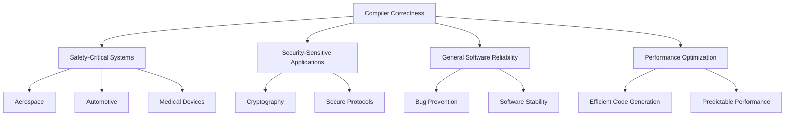
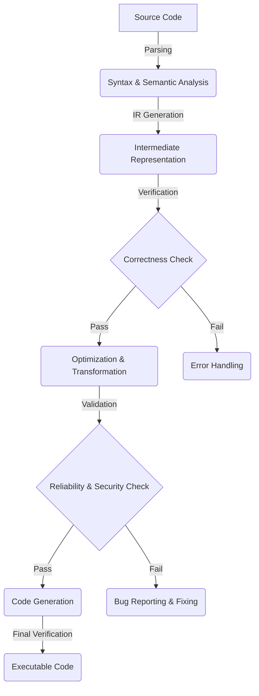
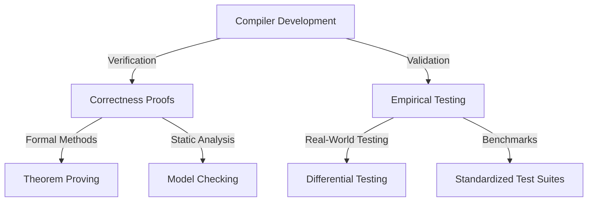

import Tabs from '@theme/Tabs';
import TabItem from '@theme/TabItem';

Before diving into verification and validation, a common question arises: "***What job opportunities will I get, and which companies hire for these skills?***
" .

Understanding the career landscape and industry demand can help you align your learning with real-world applications.

## Companies Using Verification and Validation for Compiler

``Verification`` and ``validation`` are crucial in compiler development to ensure correctness, performance, and security. Below are key sectors and companies hiring for compiler verification and validation roles:

<Tabs>

<TabItem value="Tech and Software" label="Tech and Software">

Companies in the tech and software sector use verification and validation for compiler reliability and performance:  

- [Google (LLVM/Clang Team)](https://www.google.com)  
- [Microsoft (MSVC Team)](https://www.microsoft.com)  
- [Apple (Swift and Clang)](https://www.apple.com)  
- [IBM (XL C/C++ Compiler)](https://www.ibm.com)  
- [Intel (Intel Compiler Team)](https://www.intel.com)  
- [ARM (LLVM and Compiler Optimization)](https://www.arm.com)  
- [LLVM Foundation](https://llvm.org)  

</TabItem>

<TabItem value="Embedded Systems and Automotive" label="Embedded Systems and Automotive">

Embedded systems require verified and validated compilers for safety-critical applications:  

- [Tesla](https://www.tesla.com)  
- [Qualcomm](https://www.qualcomm.com)  
- [Bosch](https://www.bosch.com)  
- [NXP Semiconductors](https://www.nxp.com)  
- [Renesas](https://www.renesas.com)  

</TabItem>

<TabItem value="Networking and Security" label="Networking and Security">

High-performance networking and security solutions depend on verified compilers:  

- [Cisco](https://www.cisco.com)  
- [Palo Alto Networks](https://www.paloaltonetworks.com)  
- [Juniper Networks](https://www.juniper.net)  

</TabItem>

</Tabs>

---

## Exploring Verification and Validation Career Paths and Projects

Compilers are essential tools that convert human-readable code into machine-executable instructions. But how do we ensure that a compiler generates correct and optimized code without errors? This is where **compiler verification** and **validation** come in.

---
<details>
<summary> ***Verification***</summary>
:::info 🛠️ Verification  
**Verification** ensures that a compiler’s transformations are **mathematically correct** and follow formal rules.  
It involves **logical proofs** to confirm that the compiler does not introduce errors when translating code.  
It is commonly used in **critical systems** like aerospace, medical software, and safety-critical applications.  
:::
</details>

<details>
<summary> ***Validation***</summary>
:::tip ✅ Validation  
**Validation** ensures that the compiler works correctly by **running test programs** and comparing the output with expected results.  
It focuses on **real-world correctness** rather than mathematical proof.  
Validation is widely used in **software development, industry benchmarks, and performance testing**.  
:::
</details>

---


Understanding these concepts is crucial for anyone interested in compiler development, programming languages, or software reliability. This beginner-friendly guide will walk you through the fundamentals, real-world examples, and challenges in this field. You'll also find project ideas to help you get hands-on experience!

---

## Table of Contents
- [Introduction](#introduction)
- [What is Verification](#what-is-verification)
  - [Example of Verification](#examples-of-verification)
  - [Defination of Compiler Verification](#definition-of-compiler-verification)
  - [Key Aspect of the Verification](#key-aspects-of-compiler-verification)
- [What is Validation](#what-is-validation)
  - [Examples of Validation](#examples-of-validation)
  - [Definition of Compiler Validation](#definition-of-compiler-validation)
  - [Key Aspects of Compiler Validation](#key-aspects-of-compiler-validation)
- [Compiler Verification Vs Validation](#compiler-verification-vs-validation)
- [Real-World Bug Cases](#real-world-software--hardware-bugs-that-affected-organization)
- [Challenges in Compiler Verification](#challenges-in-compiler-verification-and-validation)
- [AI in Compiler Verification and Validation](#future-directions-ai-in-compiler-verification-and-validation)

---

## Introduction  

Compiler correctness is fundamental to software reliability, security, and system integrity. It ensures that a compiler translates source code into correct and efficient machine code, preventing unintended behavior. This is particularly critical in various domains:

- **Safety-Critical Systems**: Used in aerospace, automotive, and medical devices, where any malfunction can have catastrophic consequences.  
- **Security-Sensitive Applications**: Cryptographic implementations require absolute correctness to prevent vulnerabilities that could be exploited.  
- **General Software Reliability**: Ensures applications run as intended, avoiding subtle bugs that can cause unexpected failures.  
- **Performance Optimization**: Incorrect compiler optimizations can introduce hard-to-debug issues, making correctness essential for predictable performance.  
---
### Importance of Compiler Correctness  


---
## What is Verification?

Verification is the process of ensuring that a system or software behaves as expected and meets its specifications. In the context of compilers, verification ensures that the compiler translates source code correctly without introducing ``errors`` or ``unexpected behavior``.
<details>
<summary> For LayMan</summary>
:::note
In LayMan Terms:
Think of verification like double-checking that something is done correctly. Imagine a translator converting a book from English to Hindi—verification ensures that the meaning of the sentences remains the same after translation, without adding or removing important details.
:::
</details>

<details>
<summary> Easy Examples</summary>  

1. **Compiler Example** –  
   - If you write `2 + 3` in a program, the compiler should generate instructions that correctly perform the addition.  
   - If the compiler mistakenly produces an instruction that subtracts instead of adding, verification would catch this error.  
</details>  

---

## Examples of Verification  
---
Here are some example of the `Verification`:
### Hardware Verification  
- Before manufacturing, chip designs are verified using **simulation and formal methods** to ensure correct functionality.  
- **Example:** A CPU manufacturer runs simulations to check if an **ALU (Arithmetic Logic Unit)** correctly performs **addition, subtraction, and multiplication** before fabricating the chip.  

### Software Verification  
- Unit tests verify that **individual functions return expected results**.  
- **Example:** A banking app checks whether a function correctly calculates **interest on savings** before releasing an update.  

### Compiler Verification  
- Ensures that **compiler optimizations do not alter program logic**.  
- **Example:** If a compiler optimizes a loop for better performance, verification ensures that the loop still **produces the same output** as the original unoptimized version.  

### Embedded Systems Verification  
- Ensures that **software running on hardware (like in cars or medical devices) functions correctly** under all conditions.  
- **Example:** A **self-driving car’s braking system software** is verified to ensure it responds **correctly** in different traffic scenarios before deployment.  
---

## Definition of Compiler Verification
Compiler verification is the **rigorous process** of ensuring that a compiler **correctly translates** source code into executable code while preserving the **intended semantics and behavior** of the original program.  


<details>
<summary>🔍 **Rigorous Process? – Easy Examples**</summary>  

:::note  
A **rigorous process** refers to a **thorough, systematic, and highly structured** approach that minimizes errors and ensures correctness at every step. It involves:  

- **Precision** – Carefully analyzing how code is transformed at each stage.  
- **Strict Validation** – Using formal methods and testing frameworks to detect inconsistencies.  
- **Comprehensive Coverage** – Examining all possible execution paths and edge cases.  
:::  

</details>


## Key Aspects of Compiler Verification  

Compiler verification ensures that the transformation of source code into machine-executable code is **accurate, reliable, and optimized** without introducing errors or altering the intended program behavior.  

### 1. Correctness  
Ensures that the compiled code maintains the original logic and expected behavior of the source code.

<details>
<summary>✅ Steps to Achieve Correctness</summary>  

- **Syntax Analysis (Parsing)** – Ensures that the source code follows language grammar rules.  
- **Semantic Analysis** – Verifies that the code has meaningful and valid operations.  
- **Intermediate Representation (IR) Verification** – Ensures transformations maintain program semantics.  
- **Equivalence Checking** – Confirms that optimized and unoptimized versions produce identical outputs.  
- **Symbol Table Management** – Ensures correct scoping, variable declarations, and type consistency.  
- **Abstract Syntax Tree (AST) Validation** – Verifies correct tree structure representation of the program.  
- **Type Checking** – Ensures that operations are applied to compatible data types.  
- **Control Flow & Data Flow Analysis** – Verifies that program execution follows correct logical paths.  
- **Formal Methods** – Uses mathematical proofs to verify correctness at the theoretical level.  
- **Testing Against Reference Implementations** – Compares outputs against a trusted compiler to validate accuracy.  

</details>


---

## 2. Reliability  
Ensures the compiler produces **consistent and error-free outputs** under various conditions.  

<details>
<summary>✅ Steps to Ensure Reliability</summary>  

- **Regression Testing** – Continuously tests compiler changes to prevent new bugs.  
- **Error Handling Mechanisms** – Detects and reports compilation errors accurately.  
- **Cross-Platform Consistency** – Ensures that the compiler generates equivalent code across different target architectures.  
- **Optimization Stability** – Ensures optimizations do not introduce errors or performance regressions.  
- **Fuzz Testing** – Uses randomly generated inputs to detect unexpected compiler crashes or incorrect behavior.  
- **Stress Testing** – Runs the compiler under extreme conditions (e.g., large inputs, nested loops) to check robustness.  
- **Deterministic Behavior** – Ensures that given the same input, the compiler always produces identical output.  
- **Exception Safety** – Ensures the compiler gracefully handles unexpected situations without crashes or undefined behavior.  
- **Memory Safety** – Prevents issues like buffer overflows, memory leaks, and invalid memory accesses.  
- **Concurrency Handling** – Ensures correct behavior when the compiler runs in multi-threaded environments.  

</details>

---

### 3. Systematic Approach  
A structured methodology to **verify compilation correctness** at different stages.  

<details>
<summary>✅ Key Techniques in a Systematic Approach</summary>  

1. **Formal Verification** – Uses mathematical proofs to confirm that the compiler preserves program semantics.  
2. **Systematic Testing** – Runs predefined test cases to detect errors in various compilation stages.  
3. **Translation Validation** – Compares source and target program behaviors after compilation to ensure correctness.  
4. **Randomized Testing (Fuzzing)** – Generates random inputs to uncover unexpected compiler failures and vulnerabilities.  
5. **Automated Debugging Tools** – Identifies and traces errors introduced during compilation using log analysis and debugging frameworks.  
6. **Differential Testing** – Runs the same input through multiple compilers and compares outputs for inconsistencies.  
7. **Property-Based Testing** – Verifies that compiled code maintains fundamental program properties (e.g., correctness, determinism).  
8. **Symbolic Execution** – Analyzes all possible execution paths in the compiled code to detect logical inconsistencies.  
9. **Constraint Solving Techniques** – Uses solvers like Z3 to verify that compiler transformations do not alter program behavior.  
10. **Benchmarking & Profiling** – Evaluates compiler output performance to ensure optimizations are effective and do not degrade execution speed.  

</details>


---

### 4. Performance and Optimization Validation  
Ensures that **compiler optimizations improve performance** without altering program behavior.  

<details>
<summary>✅ Validation Methods</summary>  

1. **Performance Profiling** – Measures execution speed, CPU usage, memory footprint, and power consumption before and after optimization.  
2. **Benchmark Testing** – Runs industry-standard workloads (e.g., SPEC, Geekbench) to evaluate compiler efficiency under real-world conditions.  
3. **Comparative Analysis** – Compares program output and performance across different optimization levels (`-O0, -O2, -O3`) to ensure correctness and efficiency.  
4. **Runtime Validation** – Uses dynamic instrumentation tools (e.g., Valgrind, AddressSanitizer) to ensure correctness at execution time.  
5. **Static Analysis of Optimized Code** – Examines transformations like loop unrolling, instruction scheduling, and inlining to detect unwanted changes.  
6. **Microbenchmarking** – Evaluates the impact of specific optimizations (e.g., vectorization, register allocation) on performance.  
7. **Cache & Memory Behavior Analysis** – Assesses memory access patterns to ensure optimizations do not introduce excessive cache misses or performance regressions.  
8. **Throughput & Latency Measurement** – Measures throughput (tasks per second) and latency (response time) to validate optimization benefits.  
9. **Code Size Analysis** – Ensures optimizations do not unnecessarily increase the size of the compiled binary.  
10. **Regression Prevention** – Ensures that newer optimizations do not degrade performance compared to previous compiler versions.  

</details>

---

## 5. Security and Safety Verification  
Ensures that compiled code is **free from vulnerabilities** and adheres to **safety standards** to prevent runtime errors or security exploits.  

<details>
<summary>✅ Security Measures</summary>  

1. **Control Flow Integrity (CFI) Checks** – Prevents unintended jumps in execution flow by ensuring function calls and branches follow expected paths.  
2. **Memory Safety Analysis** – Detects vulnerabilities like buffer overflows, use-after-free errors, and memory leaks using tools like AddressSanitizer (ASan) and MemorySanitizer (MSan).  
3. **Undefined Behavior Detection** – Identifies operations that may cause unpredictable results, such as integer overflows, null pointer dereferencing, or data races.  
4. **Static and Dynamic Analysis** – Uses tools like Clang Static Analyzer (static) and Valgrind (dynamic) to scan for vulnerabilities before execution.  
5. **Data Flow Analysis** – Tracks how data propagates through the program to detect tainted inputs or insecure information flow.  
6. **Secure Compilation Flags** – Enforces safety using flags like `-fstack-protector`, `-D_FORTIFY_SOURCE`, and `-Wformat-security`.  
7. **Pointer and Array Bounds Checking** – Ensures safe memory access to prevent out-of-bounds errors.  
8. **Code Auditing and Compliance** – Verifies adherence to security standards such as **MISRA C**, **CERT C**, and **ISO 26262** (for automotive safety).  
9. **Mitigation Against Code Injection** – Identifies and prevents vulnerabilities like buffer overflow exploits and return-oriented programming (ROP) attacks.  
10. **Safe Optimization Validation** – Ensures that optimizations do not weaken security features, such as removing critical checks for performance gains.  

</details>

---

### Compiler Verification Process – Flow Diagram  


---
## What is Validation?  

Validation is the process of ensuring that a system, software, or component meets the **intended user requirements** and functions correctly in real-world scenarios.  

In the context of **compilers**, validation ensures that the compiler not only produces **correct output** but also meets **performance, usability, and integration requirements**. A validated compiler should generate executable code that runs **efficiently** and integrates well with different environments.  

---

<details>
<summary> 🏷️ For Layman </summary>  
:::note  
In Layman Terms:  
Think of validation like **test-driving a car** after it’s built. Even if all parts (engine, brakes, lights) are correctly assembled (**verified**), validation ensures that the car **runs smoothly on the road**, meets safety standards, and provides a good driving experience.  

Similarly, a compiler is **validated** by running real-world programs to ensure that it not only compiles code correctly but also **executes efficiently without crashing**.  
:::
</details>  

---
## Examples of Validation
Here are some example of the ``Validation``:

<details>
<summary> ✅ Easy Examples </summary>  

### **1. Compiler Validation**  
- Suppose a compiler successfully translates `for (int i = 0; i < 10; i++)` into machine code.  
- **Verification** checks whether the machine code correctly represents the loop logic.  
- **Validation** ensures that when executed, the loop **runs efficiently**, does not cause excessive memory usage, and works on different hardware platforms.  

### **2. Software Validation**  
- A **banking application** might be verified to ensure that **interest calculation is correct**.  
- Validation ensures that it works properly **for all users**, including handling high traffic without delays.  

### **3. Hardware Validation**  
- A **smartphone processor** is verified using simulations to check if **its logic is correct**.  
- Validation ensures that, when manufactured, it does not **overheat**, crash, or slow down under real-world workloads.  

### **4. Self-Driving Car Software**  
- Verification ensures that the AI **correctly identifies traffic lights** from input images.  
- Validation ensures that the **car correctly stops at red lights** in real-world driving conditions.  

### **5. Medical Device Software**  
- A **heart monitor software** might be verified to correctly detect pulse rates.  
- Validation ensures that it provides **accurate readings under different patient conditions** (movement, temperature variations, etc.).  
</details>  
---

## Definition of Compiler Validation  

Compiler validation is the **process of ensuring** that a compiler not only generates **correct machine code** but also meets **performance, stability, and usability requirements**. It involves **rigorous testing methodologies, benchmarking, and real-world application assessments** to validate the compiler’s effectiveness.  

---

<details>
<summary> 🔍 **Rigorous Validation? – Easy Examples** </summary>  

:::note  
A **rigorous validation process** ensures that a compiler is **functionally correct** and **practically usable** in real-world scenarios. It includes:  

- **Functional Validation** – Ensuring compiled code runs correctly across different platforms and input cases.  
- **Performance Benchmarking** – Evaluating execution speed, memory usage, and optimization effectiveness.  
- **Robustness Testing** – Running stress tests and handling edge cases without failure.  
- **Usability & Integration** – Checking compatibility with different OS, hardware, and development environments.  
:::
</details>  
---


## Key Aspects of Compiler Validation  

Compiler validation ensures that a compiler **functions correctly, efficiently, and consistently** across different environments and use cases.

---

### 1. Functional Testing  
Ensures that the compiler produces the correct output for a given input.

<details>
<summary>✅ Steps to Perform Functional Testing</summary>

- **Unit Testing** – Tests individual compiler components (lexer, parser, optimizer, etc.).  
- **End-to-End Compilation Tests** – Compiles full programs and checks expected outputs.  
- **Golden Reference Testing** – Compares compiled output against pre-validated reference outputs.  
- **Negative Testing** – Ensures the compiler correctly rejects invalid inputs.  
- **Edge Case Testing** – Validates how the compiler handles extreme or uncommon cases.  
- **Self-Hosting Tests** – Recompiles the compiler with itself to verify correctness.  
- **Differential Testing** – Compares outputs between different compiler versions.  

</details>

---

### 2. Performance Benchmarks  
Evaluates the compiler's efficiency in generating optimized code.

<details>
<summary>✅ Steps to Measure Performance</summary>

- **Execution Speed Testing** – Compares execution times of compiled programs.  
- **Code Size Analysis** – Ensures optimizations do not excessively increase binary size.  
- **Optimization Effectiveness** – Measures improvements in speed, memory, and power efficiency.  
- **Profiling and Bottleneck Analysis** – Identifies areas in the compiler that slow down compilation.  
- **SPEC & Industry Benchmarks** – Uses standard performance benchmarks for validation.  
- **Comparison Against Other Compilers** – Evaluates performance differences with competing compilers.  

</details>

---

### 3. Regression Testing  
Ensures that new updates do not introduce errors or break previous functionality.

<details>
<summary>✅ Steps for Regression Testing</summary>

- **Automated Test Suites** – Runs a collection of known test cases after each update.  
- **Continuous Integration (CI) Testing** – Ensures that every commit maintains stability.  
- **Bisecting & Debugging** – Identifies the exact commit that introduced a regression.  
- **Compiler Fuzzing** – Detects unforeseen errors by testing with random inputs.  
- **Recompilation of Large Codebases** – Ensures stability with real-world projects.  

</details>

---

### 4. Cross-Platform Validation  
Verifies the compiler's ability to work across different hardware and software environments.

<details>
<summary>✅ Steps to Validate Cross-Platform Support</summary>

- **Multi-Architecture Testing** – Ensures correct output across x86, ARM, RISC-V, etc.  
- **Different OS Environments** – Validates compilation on Windows, Linux, macOS, etc.  
- **32-bit vs. 64-bit Support** – Ensures compatibility across different word sizes.  
- **Embedded System Validation** – Tests compiled output on resource-constrained devices.  
- **Cloud & Distributed Computing Testing** – Ensures performance and scalability in cloud environments.  

</details>

---

### 5. Integration Testing  
Ensures compatibility between the compiler and other development tools.

<details>
<summary>✅ Steps for Integration Testing</summary>

- **Linker Compatibility Testing** – Verifies seamless integration with different linkers.  
- **Debugger Support Validation** – Ensures debugging tools work correctly with compiled binaries.  
- **IDE & Build System Integration** – Tests compiler behavior within IDEs like VS Code, Clangd, etc.  
- **Library & Dependency Compatibility** – Ensures correct linking with standard and third-party libraries.  
- **Interoperability with Other Compilers** – Verifies compatibility when mixing object files from different compilers.  

</details>

---
## Compiler Verification vs Validation

### **Introduction**
Compiler verification and validation are essential processes to ensure that a compiler correctly translates source code into machine code while maintaining correctness, efficiency, and compliance with language specifications. These processes help in identifying bugs, improving reliability, and ensuring the accuracy of the generated code.

### **Definition**
- **Compiler Verification**: Ensures that the compiler is implemented correctly and adheres to formal specifications without executing compiled code.
- **Compiler Validation**: Ensures that the compiled output is correct and behaves as expected when executed on target hardware.

### **Key Differences**
| Aspect            | Compiler Verification | Compiler Validation |
|------------------|----------------------|----------------------|
| Purpose         | Checks correctness of compiler implementation | Ensures correctness of compiled output |
| Process         | Static analysis, formal methods | Dynamic testing, execution-based validation |
| Performed By    | Compiler developers, formal verification experts | Compiler users, QA engineers |
| Methods Used    | Formal proofs, static analysis, theorem proving | Test suites, differential testing, conformance testing |
| Timing         | Early stage of compiler development | Final testing before deployment |
| Focus Area     | Ensures the correctness of the compiler logic and transformations | Ensures correctness of the compiled program execution |
| Error Detection | Finds logical errors in compiler code before execution | Detects runtime errors, miscompilations, and incorrect optimizations |
| Tool Examples  | Coq, Isabelle/HOL, SMT solvers | LLVM Test Suite, GCC torture tests, SPEC benchmarks |
---

### **Examples for Better Understanding**
- **Compiler Verification Example**: Suppose we are developing a new C++ compiler. Before testing it on real code, we use **formal verification methods** to prove that the compiler’s optimization phase does not alter program semantics. For instance, we may formally prove that constant propagation (e.g., replacing `int x = 2 + 3;` with `int x = 5;`) does not introduce unintended side effects.
- **Compiler Validation Example**: Assume we have compiled a simple C program using our compiler. To validate its correctness, we run a set of test cases where the output of the compiled program is compared against expected results. If `printf("Hello, World!")` produces the correct output on all target platforms, the validation is successful.

### **Methods of Compiler Verification**
1. **Formal Verification**: Using mathematical proofs to verify compiler correctness.
2. **Static Analysis**: Analyzing compiler code without execution to find potential issues.
3. **Translation Validation**: Ensuring correctness of individual compilation steps.
4. **Regression Testing**: Running predefined tests to check for consistency across versions.
5. **Equivalence Checking**: Verifying that transformed code is functionally equivalent to the original.

### **Methods of Compiler Validation**
1. **Test Suites**: Running benchmark programs to verify correctness.
2. **Differential Testing**: Comparing outputs of multiple compilers on the same input.
3. **Conformance Testing**: Ensuring compliance with language standards (e.g., C++ standard compliance tests).
4. **Performance Testing**: Evaluating the efficiency of compiled code on hardware.
5. **Fuzz Testing**: Running randomly generated inputs to detect unexpected compiler behavior.

### **Importance of Compiler Verification & Validation**
- Ensures correctness and reliability of compiled programs.
- Detects translation errors and miscompilations.
- Improves performance and optimizations without breaking correctness.
- Enhances compiler robustness for production use.
- Reduces security vulnerabilities arising from incorrect compilation.
- Ensures compliance with programming language standards.

### **Conclusion**
Compiler verification and validation are critical to ensuring that compilers generate correct, efficient, and reliable machine code. Verification focuses on proving correctness before execution, while validation ensures the correctness of compiled code through rigorous testing. Both processes are essential for developing high-quality compilers, reducing errors, and ensuring predictable performance in real-world applications.

---

## Real-World Software & Hardware Bugs That Affected Organization

<details>
<summary>1. Intel's Pentium FDIV Bug (1994)</summary>

- **Issue:** A hardware flaw in Intel’s Pentium processors caused incorrect floating-point division results for certain values.  
- **Root Cause:** A missing lookup table entry in the floating-point unit led to calculation errors.  
- **Impact:**  
  - Affected scientific and financial computations.  
  - Intel had to recall and replace faulty chips, costing **$475 million**.  
- **Lesson:** Hardware design verification and extensive testing are crucial for arithmetic logic.  
- **More Info:** [Pentium FDIV Bug](https://en.wikipedia.org/wiki/Pentium_FDIV_bug)

</details>

<details>
<summary>2. NASA’s Mars Climate Orbiter Failure (1999)</summary>

- **Issue:** A mismatch between metric and imperial units caused the spacecraft to enter Mars’ atmosphere incorrectly.  
- **Root Cause:** One team used **pound-seconds (lbf⋅s)** while another used **Newton-seconds (N⋅s)** in calculations.  
- **Impact:**  
  - According to NASA, the cost of the mission was $327.6 million ($571.41 million in 2023)[16] total for the orbiter and lander, comprising $193.1 million ($336.81 million in 2023)  
  - Highlighted the need for stricter **unit verification in software**.  
- **Lesson:** Use **strict type systems** and enforce unit consistency in mission-critical applications.  
- **More Info:** [Mars Climate Orbiter](https://en.wikipedia.org/wiki/Mars_Climate_Orbiter)

</details>

<details>
<summary>3. Apple’s SSL/TLS Bug ("goto fail"; 2014)</summary>

- **Issue:** A flaw in Apple’s SecureTransport library caused SSL/TLS encryption validation to fail, making connections vulnerable to man-in-the-middle attacks.  
- **Root Cause:** A duplicated `goto fail;` statement in the code led to unintended execution flow.  
- **Impact:**  
  - Millions of **iOS and macOS users** were at risk of having their encrypted communications intercepted.  
  - Forced Apple to issue emergency security updates.  
- **Lesson:** Code review and static analysis tools should detect **unintended duplicated control statements**.  
- **More Info:** [goto fail Bug](https://www.imore.com/understanding-apples-ssl-tls-bug)

</details>

<details>
<summary>4. GCC Optimization Bug in glibc (2008)</summary>

- **Issue**  
A bug in **GCC's optimization passes** caused incorrect code generation in **glibc**, particularly in memory management functions like `malloc()` and `free()`.

- **Root Cause**  
Aggressive compiler optimizations (e.g., `-O2`/`-O3`) led to **incorrect assumptions about pointer aliasing**, resulting in memory corruption.

- **Impact**  
- Crashes in applications due to **memory corruption**.  
- Potential **security vulnerabilities**, though no widespread exploits were documented.  
- In rare cases, could contribute to **privilege escalation** if combined with other flaws.  

- **Lessons Learned**  
1. **Compiler optimizations must be rigorously tested**, especially for low-level libraries like glibc.  
2. **Security-critical code** should be tested under different optimization levels.  
3. **Debug symbols and assertions** help catch optimization-induced bugs early.  

- **More info:**
- [GCC Bug Report #38458: Incorrect optimization with `-O2` (2008)](https://gcc.gnu.org/bugzilla/show_bug.cgi?id=38458)  
- [glibc mailing list discussion (2008)](https://sourceware.org/legacy-ml/libc-alpha/2008-12/msg00005.html)  
- [LWN.net article on GCC/glibc interactions](https://lwn.net/Articles/278137/)  

</details>

<details>
<summary>5. Therac-25 Radiation Overdose (1985-1987)</summary>

- **Issue:** Software bugs in the **Therac-25** radiation therapy machine led to **massive overdoses of radiation** being administered to patients.  
- **Root Cause:**  
  - **Race conditions** in the software caused incorrect mode settings.  
  - **Optimizations removed safety checks**, leading to undetected errors.  
- **Impact:**  
  - At least **six patients died**, and several others were severely injured.  
- **Lesson:** Safety-critical systems require **extensive testing, redundancy, and fail-safes**.  
- **More Info:** [Therac-25 Incident](https://en.wikipedia.org/wiki/Therac-25)

</details>

<details>
<summary>6. The Ariane 5 Flight 501 Explosion (1996)</summary>

- **Issue:** A conversion error in the control software caused a **64-bit floating-point number** to be incorrectly stored in a **16-bit integer**, leading to an overflow.  
- **Root Cause:** The **inherited software from Ariane 4** wasn't tested for the new rocket’s conditions.  
- **Impact:**  
  - The **$370 million** rocket self-destructed **40 seconds after launch**.  
  - Set back European space efforts.  
- **Lesson:** Software should be **rigorously tested when reused across projects**.  
- **More Info:** [Ariane 5 Failure](https://en.wikipedia.org/wiki/Ariane_5_Flight_501)

</details>

<details>
<summary>7. The Heartbleed Bug in OpenSSL (2014)</summary>

- **Issue:** A buffer over-read issue in OpenSSL due to improper bounds checking led to **sensitive data leakage**.  
- **Root Cause:** A missing bounds check in the **Heartbeat extension** allowed attackers to read private memory.  
- **Impact:**  
  - Millions of websites and services were compromised.  
  - Exposed **passwords, private keys, and other sensitive information**.  
- **Lesson:** **Memory safety checks** and fuzz testing should be standard in cryptographic software.  
- **More Info:** [Heartbleed Vulnerability](https://en.wikipedia.org/wiki/Heartbleed)

</details>

<details>
<summary>8. Spectre and Meltdown (2018)</summary>

- **Issue:** Exploits based on speculative execution allowed attackers to read sensitive memory data across different processes.  
- **Root Cause:**  
  - **Speculative execution optimizations** in modern processors leaked information.  
  - Software didn't isolate memory properly.  
- **Impact:**  
  - Security vulnerabilities affected **almost all modern processors**.  
  - Required costly patches, **causing performance slowdowns**.  
- **Lesson:** Hardware security needs **better microarchitectural design** with software-side mitigations.  
- **More Info:** [Spectre & Meltdown](https://en.wikipedia.org/wiki/Meltdown_(security_vulnerability))

</details>

---
:::note
For a deeper dive into compiler bugs, check out the study:  
**"A Systematic Impact Study for Fuzzer-Found Compiler Bugs"** ([arXiv Link](https://arxiv.org/abs/1902.09334))
:::

:::caution
>Tip: Compiler validation is essential for delivering a reliable, high-performance, and user-friendly compiler that meets industry and developer expectations.
:::
---

## Challenges in Compiler Verification and Validation

``Compiler verification`` and ``validation`` ensure that a compiler correctly translates source code while maintaining intended behavior. These processes are critical for reliability, security, and performance. However, several challenges make both verification and validation difficult tasks.

### Challenges in Compiler Verification and Validation

<Tabs>

<TabItem value="Verification" label="Verification">

### 1. Complexity of Compiler Transformations
Modern compilers implement numerous optimizations and transformations, making it challenging to verify correctness across all compilation phases. Some key concerns include:
- **Intermediate Representation (IR) Transformations**: Ensuring semantic equivalence before and after transformation.
- **Optimization Effects**: Verifying that optimizations (e.g., loop unrolling, constant folding) preserve correctness.

### 2. Undefined and Implementation-Defined Behavior
Languages like C and C++ contain undefined and implementation-defined behaviors, making it difficult to verify correctness because:
- Different compilers may handle the same source code differently.
- Compiler optimizations may alter behavior in unexpected ways.

### 3. Formal Verification Challenges
Formal methods like theorem proving and model checking can be used for verification, but they face challenges such as:
- **Scalability Issues**: Verifying large and complex compilers is computationally expensive.
- **Specification Complexity**: Defining formal semantics for a complete programming language is difficult.

### 4. Testing Limitations
Testing-based approaches, such as differential testing and fuzz testing, have limitations:
- **Incomplete Coverage**: It is impossible to test all possible inputs.
- **Oracle Problem**: Determining the correct output for arbitrary inputs can be challenging.

### 5. Compiler Bugs and Regressions
Despite rigorous testing, compilers still contain bugs that may regress over time due to:
- Frequent codebase updates and modifications.
- Lack of exhaustive testing for all compiler paths.

### 6. Performance vs. Correctness Trade-offs
- Aggressive optimizations may lead to subtle correctness bugs.
- Ensuring correctness while maintaining high performance is a major challenge.

</TabItem>

<TabItem value="Validation" label="Validation">

### 1. Real-World Code Validation Complexity
- Applications often rely on compiler-generated code, making it difficult to validate real-world scenarios.
- Ensuring correctness across diverse software environments is challenging.

### 2. Lack of Standardized Benchmarks
- Compiler validation requires well-defined test suites, but standardized benchmarks may not cover all edge cases.
- Benchmarking across different architectures introduces variability.

### 3. Ensuring Functional Equivalence
- Validating a compiler requires checking that compiled programs produce functionally equivalent outputs.
- Differences in floating-point precision and hardware-specific behaviors complicate this process.

### 4. Automation Limitations
- While automated validation frameworks exist, they often struggle with handling large-scale, complex programs.
- Detecting subtle semantic deviations in large codebases remains a challenge.

</TabItem>

</Tabs>

## Compiler Verification vs Validation

---

## KeyTake
:::tip
**Compiler verification** and **validation** are essential for ensuring correctness, reliability, and security. However, challenges such as complexity, undefined behavior, and testing limitations make these processes difficult. 

:::note
Future advancements in formal methods, automated testing, and standardized validation frameworks will help improve compiler reliability.
:::


---
## Future Directions: AI in Compiler Verification and Validation  

Compiler verification ensures that a compiler correctly translates source code into machine code without introducing errors. With modern compilers supporting **multiple architectures**, **performance optimizations**, and **advanced language features**, traditional verification methods are hitting their limits.  

🔹 **Can AI transform compiler verification?**  
🔹 **Will AI replace jobs in compiler validation?**  
🔹 **What challenges come with AI-driven testing?**  

This article explores these questions, detailing traditional methods, AI-driven innovations, and future trends.  

---

### 🏛 Traditional Compiler Verification and Validation  

Historically, compilers have been verified using a mix of **formal verification, extensive testing, and manual debugging**.  

#### 📌 **Key Traditional Methods**  

| Method                   | Description |
|-------------------------|------------|
| **Formal Methods**      | Mathematical proofs ensuring correctness, e.g., **CompCert**. |
| **Regression Testing**  | Running test suites after each update (e.g., **LLVM Test Suite**, **GCC’s DejaGNU**). |
| **Differential Testing** | Comparing outputs from multiple compilers or versions (**Csmith** tool). |
| **Fuzz Testing**        | Generating random inputs to test compiler resilience (**AFL, LangFuzz**). |
| **Manual Debugging**    | Engineers manually inspect logs and traces to find bugs. |

🔎 **Why These Methods Are Not Enough**  
✅ **Time-consuming** ⏳  
✅ **Requires deep domain expertise** 🎓  
✅ **Can miss rare, complex bugs** 🐞  

---

### 🤖 AI’s Role in Compiler Verification and Validation  

AI is revolutionizing compiler testing by improving bug detection, test case generation, and performance analysis.  

#### 🚀 **How AI is Transforming Compiler Verification**  

| AI Technique                 | Application in Compiler Verification |
|-----------------------------|-------------------------------------|
| **AI-Driven Bug Detection** | ML models predict potential failures from past logs. |
| **Automated Test Case Generation** | AI generates diverse, high-coverage test cases. |
| **AI-Enhanced Fuzz Testing** | AI-guided fuzzing focuses on critical compiler paths. |
| **Intelligent Performance Analysis** | AI analyzes execution profiles for better optimizations. |
| **Self-Learning Verification** | AI models learn from valid and invalid transformations. |

#### 🔥 **Example: AI-Enhanced Fuzzing**  

```python
## Example of AI-driven fuzzing for compiler validation
import tensorflow as tf
from random import randint

def generate_test_case():
    """ AI-generated random test case """
    return f"int x = {randint(0, 100)}; return x * 2;"

test_case = generate_test_case()
print(f"Generated Code: {test_case}")
```

🔹 **Outcome:** AI **reduces testing time** and **improves bug detection coverage**.  

---

### 🛠 AI vs. Human Engineers: Will AI Replace Jobs?  

AI raises concerns about **job displacement**, but the reality is more nuanced.  

#### 🔄 **How AI Will Change Roles**  

✅ **AI as an Assistant, Not a Replacement**  
✅ **Engineers will transition from manual testing to AI-assisted validation**  
✅ **New demand for AI-compiler specialists**  

#### 📊 **Job Market Shift**  

| Role                       | Future Impact |
|---------------------------|--------------|
| **Compiler Tester**        | Evolving into AI-assisted validation engineer. |
| **AI-Compiler Engineer**   | High demand for expertise in both AI and compiler design. |
| **Bug Detection Expert**   | More focus on **interpreting AI reports** rather than manual debugging. |

💡 **AI will make testing faster, but human oversight will always be needed.**  

---

### ⚠️ Challenges and Ethical Considerations  

Despite its benefits, AI introduces new challenges:  

#### **1. AI Explainability**  
📌 AI models are **black boxes**—debugging AI decisions can be difficult.  

#### **2. Training Data Quality**  
📌 Poor-quality training data leads to incorrect verification results.  

#### **3. False Positives & False Negatives**  
📌 AI may **flag correct transformations as errors** or **miss subtle bugs**.  

#### **4. Ethical Risks**  
📌 Over-reliance on AI-generated test cases may lead to compilers **optimizing for AI-detected bugs rather than real-world scenarios**.  

---

### 🏆 Conclusion  

AI is set to **revolutionize compiler verification**, making it **faster, more reliable, and less labor-intensive**. However, it will **augment** rather than replace human engineers.  

#### 🔮 **Key Takeaways**  
✅ **AI-driven compiler testing will reduce verification time**  
✅ **AI will create new job roles instead of eliminating them**  
✅ **Hybrid AI-human testing approaches will dominate the future**  

🎯 **What’s next?**  
Compiler engineers must **adapt** by learning **AI-driven testing techniques**, ensuring a balance between **automation and human expertise**.  

---

🔥 _Interested in AI-driven compiler verification? Follow_ [CompilerSutra](https://compilersutra.com) _for more deep-dive articles!_  


---

> Compiler engineers must adapt by **embracing AI-assisted workflows** and developing skills in **both compilers and machine learning**. The future is **not about AI vs. humans but AI + humans working together**. 🚀 
---

