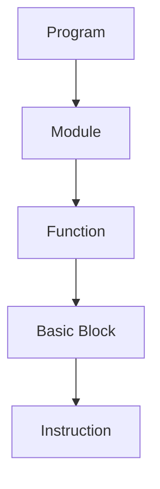
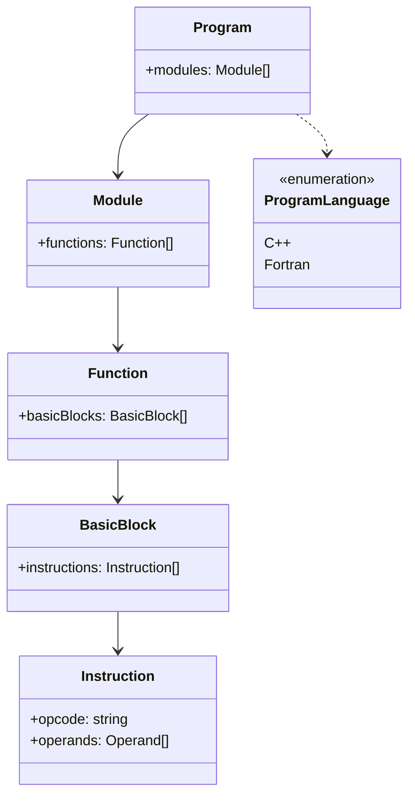
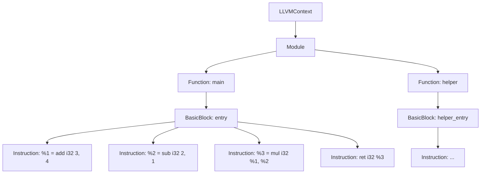
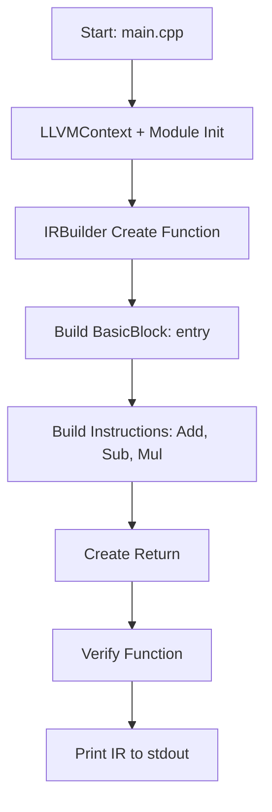

import Tabs from '@theme/Tabs';
import TabItem from '@theme/TabItem';

# Table of Contents
1. [Build Your First Compiler with LLVM](#build-your-first-compiler-with-llvm-in-100-lines)
2. [Prerequisites](#prerequisites)
     - [Ubuntu / Debian](#)
     - [macOS (using Homebrew)](#)
     - [Windows (using WSL)](#)
3. [Folder Structure](#folder-structure)
4. [main.cpp — The Compiler Code](#maincpp--the-compiler-code)
5. [How to build it](#build-script-buildsh)
6. [Run and Inspect](#run-and-inspect)
7. [What You Just Built](#what-you-just-built)
8. [IR Generation Flow ](#ir-generation-flow)
9. [What’s Next?](#whats-next)
10. [Like Tutorials Like This?](#like-tutorials-like-this)
11. [FAQ](#faq)


---

If you encounter any difficulties, feel free to email us at [info@compilersutra.com](mailto:info@compilersutra.com).

## Build Your First Compiler with LLVM in 100 Lines

Have you ever wondered how powerful compilers like **Clang** and **GCC** transform source code into machine-readable instructions? What magic happens under the hood to turn human-readable code into optimized binaries?

In this hands-on tutorial, we'll demystify the process by building a **toy arithmetic compiler** using **LLVM's C++ API** — all in just **100 lines of code**. No need for a complex parser or frontend; we'll focus purely on **LLVM Intermediate Representation (IR)** generation, which is the heart of most modern compilers.

By the end of this tutorial, you'll gain practical experience with:

- **LLVM IR Generation**: Understand the key concepts of LLVM's intermediate code.
- **Creating Functions and Basic Blocks**: Learn how to structure your compiler's logic.
- **Working with LLVM Tools**: Use LLVM's suite of tools to generate, inspect, and execute your code.



Ready to dive into the world of compilers? Let's get started!
:::note
---
<details>
<summary> IR Hierarchy Summary (Code → IR)</summary>

### Program
- **Definition**: Represents the entire codebase of a program, typically corresponding to the compiled version of a project.
- **Example**: A compiled executable or library, such as `main.exe` (in C/C++), or `a.out`, which is the final output of the compilation process.
- **Details**: 
  - The program is the highest abstraction level in the IR hierarchy.
  - It contains multiple modules that were compiled together to form the final application or library.

---

### Module
- **Definition**: Represents a single source file or unit of code. In most cases, it corresponds to a specific file in the project.
- **Example**: `math.cpp`, `utils.f90`, `main.c`, or `program.asm`.
- **Details**:
  - A module typically contains one or more functions, classes, or subroutines that form the logical building blocks of the program.
  - Modules are independent in their compilation but can reference or interact with other modules through external links or imports.

---

## Function
- **Definition**: A function is a named block of code that performs a specific task. It is the basic unit of computation in most programs.
- **Example**: 
  ```cpp
  int add(int a, int b) { 
      return a + b; 
  }
- **Details**:
    - A **function consists** of a name, parameters, a body, and sometimes a return type
    - During compilation, the function is translated into a series of intermediate representations that describe the computations and control flow of the function
    - Functions can be broken down into multiple basic blocks to facilitate optimizations and transformations.
---

## Basic Block
- **Definition**: A basic block is a sequence of instructions where control flows linearly without any jumps or branches, except at the end.
- **Example**: The body of a loop, the condition in an if statement, or a simple sequence of operations within a function.
- **Details**:
  - Each basic block ends with either a jump (conditional or unconditional) or a function return.
  - Control flow between basic blocks is analyzed to identify possible optimization opportunities (e.g., loop unrolling, instruction reordering).
  - The **entry point** of a basic block is the first instruction, and the **exit point** is the last instruction.

---

## Instruction
- **Definition**: An instruction is a single low-level operation that is typically a machine operation or an assembly-like operation.

- **Example**:
  ```llvm
  %1 = add i32 %2, %3
  ```
- **Details**:
    - ***Opcode*** : This represents the action or operation to be performed (e.g., add, mul, sub, load, store, jmp).
    
    - ***Operands***: The variables or constants on which the instruction operates. These could be registers, memory addresses, or immediate values.
    
    - Instructions can be atomic operations like arithmetic, logical, memory load/store, or control flow operations.
    
    - Each instruction in the IR serves as a step in simulating the computation or data transformation described by the higher-level program.

### Relationships Between Each Level
- **Program → Module**: A program consists of multiple modules. Each module typically corresponds to a source file and is independently compiled.

- **Module → Function**: Each module contains one or more functions, which represent logical units of work (e.g., computation or IO operations).

- **Function → Basic Block**: Functions are broken into basic blocks, representing smaller pieces of code that execute sequentially.

- **Basic Block → Instruction**: Basic blocks are composed of instructions, which represent individual low-level operations.
</details>
:::
---

## Prerequisites

- LLVM installed (`llvm-config`, `opt`, `lli`, `clang++`)
- Basic understanding of C++
- Familiarity with terminal and shell scripts

<details>
<summary>🖥️ Installation Guide (click to expand)</summary>

<Tabs>
<TabItem value="Ubuntu / Debian">

```bash
sudo apt update
sudo apt install llvm clang -y
```

</TabItem>
<TabItem value="macOS (using Homebrew">

```bash
brew install llvm
```
Add LLVM to your path:
```bash
echo 'export PATH="/opt/homebrew/opt/llvm/bin:$PATH"' >> ~/.zshrc
source ~/.zshrc
```
</TabItem>

<TabItem value="Windows (using WSL)">

1. Install [WSL](https://docs.microsoft.com/en-us/windows/wsl/install)
2. Launch Ubuntu from Windows Store
3. Run:

```bash
sudo apt update
sudo apt install llvm clang -y
```

</TabItem>

</Tabs>

</details>

---

## Folder Structure

```
toy-compiler/
├── main.cpp
├── CMakeLists.txt
```

---

## main.cpp — The Compiler Code

In these section we will see what actually we need to do. We are using a LLVM API the goal of these api is to:
1. **Generate LLVM IR**: We will generate the LLVM IR from the source code.
2. **View the IR**: We will check the IR generated to understand its structure.
3. **Run IR**: We will execute the IR using the LLVM interpreter (`lli`).
4. **Compile the IR**: We'll convert the IR to an object file.
5. **Link the Object File**: We'll link the object file to create an executable.
6. **Run the Program**: Finally, we'll run the executable and see the result.

```cpp
#include "llvm/IR/IRBuilder.h"
#include "llvm/IR/LLVMContext.h"
#include "llvm/IR/Module.h"
#include "llvm/IR/Verifier.h"

using namespace llvm;

int main() {
  LLVMContext Context;
  Module *TheModule = new Module("toy", Context);
  IRBuilder<> Builder(Context);

  // Create printf declaration
  FunctionType *PrintfType = FunctionType::get(
      IntegerType::getInt32Ty(Context), PointerType::get(Type::getInt8Ty(Context), 0), true);
  FunctionCallee PrintfFunc = TheModule->getOrInsertFunction("printf", PrintfType);

  // Create main function: int main()
  FunctionType *FT = FunctionType::get(Type::getInt32Ty(Context), false);
  Function *MainFunc = Function::Create(FT, Function::ExternalLinkage, "main", TheModule);

  // Create entry block
  BasicBlock *BB = BasicBlock::Create(Context, "entry", MainFunc);
  Builder.SetInsertPoint(BB);

  // Build expression: (3 + 4) * (2 - 1)
  Value *L = Builder.CreateAdd(ConstantInt::get(Context, APInt(32, 3)),
                               ConstantInt::get(Context, APInt(32, 4)));
  Value *R = Builder.CreateSub(ConstantInt::get(Context, APInt(32, 2)),
                               ConstantInt::get(Context, APInt(32, 1)));
  Value *Res = Builder.CreateMul(L, R);

  // Create a global format string: "%d\n"
  Value *FormatStr = Builder.CreateGlobalStringPtr("%d\n");

  // Call printf
  Builder.CreateCall(PrintfFunc, {FormatStr, Res});

  // Return 0 from main
  Builder.CreateRet(ConstantInt::get(Context, APInt(32, 0)));

  // Validate & print IR
  verifyFunction(*MainFunc);
  TheModule->print(outs(), nullptr);
  return 0;
}

```

---


  ---
## 🔍 Code Explanation

In this section, we break down the code and explain the purpose of each **LLVM API** used.

---

<details>
<summary>1. <code>#include</code> Directives</summary>

These headers bring in the necessary LLVM APIs:

- `IRBuilder.h`: Provides `IRBuilder` for generating IR instructions easily.
- `LLVMContext.h`: Manages the memory and types used during IR generation.
- `Module.h`: Represents a single unit of compiled code (like a translation unit).
- `Verifier.h`: Used to verify if the generated IR is valid.

</details>

---

<details>
<summary>2. <code>LLVMContext Context;</code></summary>

Creates a global context object that holds LLVM's global information like types and constants during IR generation.

</details>

---

<details>
<summary>3. <code>Module *TheModule = new Module("toy", Context);</code></summary>

Creates a new module named `"toy"` which acts like a container for functions, global variables, and IR instructions.

</details>

---

<details>
<summary>4. <code>IRBuilder&lt;&gt; Builder(Context);</code></summary>

Instantiates an `IRBuilder`, which provides an easy interface to generate LLVM instructions such as addition, multiplication, function calls, etc.

</details>

---

<details>
<summary>5. Create <code>printf</code> Declaration</summary>

- Defines the type of `printf`: a function returning `int32` and taking a variable number of arguments, starting with a `char*`.
- Registers `printf` as an external function within the module using `getOrInsertFunction`.

</details>

---

<details>
<summary>6. Create <code>main</code> Function</summary>

- Defines the `main()` function to return `int32` and take no parameters.
- Creates the function object and inserts it into the module.

</details>

---

<details>
<summary>7. <code>BasicBlock *BB = BasicBlock::Create(...);</code></summary>

Creates a new basic block called `"entry"` inside the `main` function where all instructions will be inserted.

</details>

---

<details>
<summary>8. <code>Builder.SetInsertPoint(BB);</code></summary>

Sets the insertion point so that all new instructions are added into the `"entry"` block.

</details>

---

<details>
<summary>9. Build Expression <code>(3 + 4)</code></summary>

Generates an IR instruction that adds constants `3` and `4` and stores the result.

</details>

---

<details>
<summary>10. Build Expression <code>(2 - 1)</code></summary>

Generates an IR instruction that subtracts `1` from `2` and stores the result.

</details>

---

<details>
<summary>11. Build Expression <code>(L * R)</code></summary>

Multiplies the results of `(3 + 4)` and `(2 - 1)` together.

</details>

---

<details>
<summary>12. Create Global String <code>"%d\n"</code></summary>

Creates a global constant string `"%d\n"` in memory to use as a format string for `printf`.

</details>

---

<details>
<summary>13. Call <code>printf</code> with the Result</summary>

Generates a call instruction to `printf`, passing the format string and the result of the expression.

</details>

---

<details>
<summary>14. Return <code>0</code> from main</summary>

Creates a return instruction that returns `0`, signaling successful execution.

</details>

---

<details>
<summary>15. <code>verifyFunction(*MainFunc);</code></summary>

Checks the `main` function for errors in the generated IR. Ensures that the IR is valid.

</details>

---

<details>
<summary>16. <code>TheModule->print(outs(), nullptr);</code></summary>

Prints the entire generated LLVM IR code to the standard output.

</details>

---
:::tip  
## 📝 Summary

The program computes the expression `(3 + 4) * (2 - 1)`, prints the result using `printf`, and returns `0` from the `main` function. It builds and prints the corresponding LLVM Intermediate Representation (IR).

LLVM APIs helped by:
- Managing memory and constants with `LLVMContext`.
- Structuring the program with `Module`.
- Creating IR instructions easily with `IRBuilder`.
- Declaring and calling external functions like `printf`.
- Validating the IR using `verifyFunction`.
- Outputting the generated IR with `TheModule->print`.
:::
---

---

## Build Script: `build.sh`

```bash
#!/bin/bash
clang++ main.cpp `llvm-config --cxxflags --ldflags --system-libs --libs core` -o toy
```
---
<Tabs>
<TabItem value="CMakeLists.txt File" label= "CMakeLists.txt file">

```bash
toy-compiler/
├── main.cpp
├── CMakeLists.txt
├── build
```
```cpp
cmake_minimum_required(VERSION 3.13)
project(ToyCompiler)
# Find LLVM package
find_package(LLVM REQUIRED CONFIG)
message(STATUS "Found LLVM ${LLVM_PACKAGE_VERSION}")
message(STATUS "Using LLVMConfig.cmake in: ${LLVM_DIR}")
# Set C++ standard
set(CMAKE_CXX_STANDARD 17)
set(CMAKE_CXX_STANDARD_REQUIRED YES)
# Include LLVM directories and definitions
include_directories(${LLVM_INCLUDE_DIRS})
add_definitions(${LLVM_DEFINITIONS})
# Add the main executable (toy compiler)
add_executable(toy main.cpp)
# Link against necessary LLVM libraries
llvm_map_components_to_libnames(llvm_libs core support irreader)
target_link_libraries(toy ${llvm_libs})
# Define output files
set(OUT_LL ${CMAKE_CURRENT_BINARY_DIR}/out.ll)
set(OUT_O  ${CMAKE_CURRENT_BINARY_DIR}/out.o)
set(TOY_OUT ${CMAKE_CURRENT_BINARY_DIR}/toy.out)
# Step 1: Generate out.ll by running 'toy'
add_custom_command(
  OUTPUT ${OUT_LL}
  COMMAND ${CMAKE_COMMAND} -E echo "Generating ${OUT_LL}..."
  COMMAND toy > ${OUT_LL}
  DEPENDS toy
  COMMENT "Generating IR (out.ll)"
)
# Step 2: Compile out.ll to out.o using llc
add_custom_command(
  OUTPUT ${OUT_O}
  COMMAND llc ${OUT_LL} -filetype=obj -o ${OUT_O}
  DEPENDS ${OUT_LL}
  COMMENT "Compiling IR to Object file (out.o)"
)
# Step 3: Link out.o into final executable toy.out
# Handle Linux: add -no-pie if on Linux
if (UNIX AND NOT APPLE)
  set(LINK_FLAGS "-no-pie")
endif()
add_custom_command(
  OUTPUT ${TOY_OUT}
  COMMAND clang ${LINK_FLAGS} ${OUT_O} -o ${TOY_OUT}
  DEPENDS ${OUT_O}
  COMMENT "Linking Object file into final Executable (toy.out)"
)
# Create custom targets for each step
add_custom_target(ir_gen DEPENDS ${OUT_LL})
add_custom_target(obj_gen DEPENDS ${OUT_O})
add_custom_target(link_exe DEPENDS ${TOY_OUT})
# Master build_all target
add_custom_target(build_all ALL
  DEPENDS link_exe
)
# Clean generated files on make clean
set_directory_properties(PROPERTIES ADDITIONAL_MAKE_CLEAN_FILES "toy;out.ll;out.o;toy.out")
```

</TabItem>
<TabItem value="CMakeLists.txt" label="CMakeLists.txt Explanation">

### 🛠️ Step-by-step Breakdown

| Step | Code | What & Why |
|------|------|------------|
| 1 | `cmake_minimum_required(VERSION 3.13)` | Sets the minimum CMake version required to avoid compatibility issues. |
| 2 | `project(ToyCompiler)` | Defines the project name shown in IDEs and logs. |
| 3 | `find_package(LLVM REQUIRED CONFIG)` | Finds the installed LLVM toolchain (required to access headers, tools, and link libraries). |
| 4 | `message(...)` | Debug output showing LLVM version and path, helpful for validation. |
| 5 | `set(CMAKE_CXX_STANDARD 17)` | Ensures we're using C++17, which LLVM itself uses (important for features like `std::optional`). |
| 6 | `include_directories(${LLVM_INCLUDE_DIRS})` | Tells the compiler where to find LLVM headers. |
| 7 | `add_definitions(${LLVM_DEFINITIONS})` | Adds necessary compile-time definitions for LLVM. |
| 8 | `add_executable(toy main.cpp)` | Builds your compiler code (`main.cpp`) into an executable named `toy`. |
| 9 | `llvm_map_components_to_libnames(...)` | Dynamically resolves names of LLVM libraries like `core`, `support`, `irreader`. |
| 10 | `target_link_libraries(toy ${llvm_libs})` | Links your executable to the necessary LLVM libraries. |

---

### 🏗️ Build Pipeline Steps (IR → Object → Executable)

| Step | Code | What & Why |
|------|------|------------|
| 11 | `add_custom_command(OUTPUT out.ll ...)` | Runs the `toy` binary and redirects its IR output to `out.ll`. This is your generated LLVM IR. |
| 12 | `add_custom_command(OUTPUT out.o ...)` | Uses `llc` to convert `out.ll` (IR) to an object file `out.o`. |
| 13 | `add_custom_command(OUTPUT toy.out ...)` | Uses `clang` to link the object file into an executable named `toy.out`. |

---

### 🎯 Final Target

| Step | Code | What & Why |
|------|------|------------|
| 14 | `add_custom_target(build_all ALL DEPENDS toy.out)` | Creates a top-level target so you can just run `make` to trigger the full pipeline. |
| 15 | `set_directory_properties(...)` | Adds generated files (`toy`, `out.ll`, `out.o`, `toy.out`) to the clean list. Useful for `make clean`. |

</TabItem>
</Tabs>

---


### 🛠️ What this command does:

| Part | Explanation |
|------|-------------|
| `clang++ main.cpp` | Compile the source file with Clang's C++ compiler. |
| `` `llvm-config --cxxflags` `` | Adds LLVM-specific include paths and C++ compile flags. |
| `` `llvm-config --ldflags` `` | Adds linker flags needed for LLVM. |
| `` `llvm-config --system-libs` `` | Adds system libraries LLVM depends on. |
| `` `llvm-config --libs core` `` | Links the core LLVM libraries for IR generation. |
| `-o toy-compiler` | Output executable name. |

---

## Run and Inspect
<Tabs>
<TabItem value="Manually Steps"  label="Manual Steps how to do">

```bash
./toy-compiler > out.ll    # Save LLVM IR
cat out.ll                  # View IR
lli out.ll                  # Run using LLVM interpreter
llc out.ll -filetype=obj    # Compile to object file
clang out.o -o toy.out      # Link and build executable
./toy.out                   # Output: 7 * 1 = 7
```
</TabItem>
<TabItem value="With CMakeLists.txt"  label="With CMake How to Build">

```bash
mkdir build
cd  build
cmake ..
make
./toy.out
7
```
</TabItem>
</Tabs>

---

## What You Just Built

### 1. LLVM Module with a `main()` Function
We started by creating an LLVM module named `"toy"` using `LLVMContext` and `Module`.  
A `main()` function of type `i32()` was defined using `FunctionType` and `Function`.

This setup forms the foundational structure of any LLVM-based program.

---

### 2. Arithmetic Expression: `(3 + 4) * (2 - 1)`
We constructed an arithmetic expression manually using LLVM’s `IRBuilder`.  
Each part of the expression was built using LLVM instructions:
- `CreateAdd` for `3 + 4`
- `CreateSub` for `2 - 1`
- `CreateMul` for multiplying the results

This demonstrates LLVM's ability to model mathematical operations.

---

### 3. LLVM IR Generation
After constructing the logic, the IR was verified using `verifyFunction()` to ensure correctness.  
The IR was printed to standard output using `TheModule->print(...)`.

This IR is human-readable and forms a low-level, typed representation of the program.

---

### 4. Compiled to Object Code and Executable
Using the LLVM toolchain:
- `llc` was used to compile the `.ll` file into an object file (`.o`)
- `clang` was used to link the object file into an executable

This shows how to take generated IR and produce a working native binary.
  

---

## IR Generation Flow 



---

## What’s Next?

- Add variables and expressions via CLI
- Build a recursive descent parser
- Add support for conditionals or loops
- Explore MLIR for high-level IR

---

## Like Tutorials Like This?

Subscribe to the [CompilerSutra Newsletter](https://compilersutra.com) to get weekly content on:

- LLVM, MLIR, Clang internals
- Compiler optimization techniques
- C++ tooling & performance
- Hands-on compiler projects


**Stay curious, and keep compiling! 🔧**

See more article about:
-  **History of Parallel Programming** - "History to Parallel programming"
          [Intro to parallel programming](https://www.compilersutra.com/docs/parallel-programming-evolution)
        
- **Intro to Parallel Programming** - "Introduction to Parallel Programming"[https://www.compilersutra.com/docs/gpu/Parallel_Programming/Intro_to_Parallel_Programming]

- **LLVM:** Follow the [LLVM Installation Guide](https://www.compilersutra.com/docs/llvm/intro-to-llvm)  
- **GCC:** Set up GCC with the [GCC Build Instructions](https://www.seas.upenn.edu/~ese5320/fall2022/handouts/_downloads/788d972ffe62083c2f1e3f86b7c03f5d/gccintro.pdf)  
- **LLVM Official Documentation:** [LLVM.org Docs](https://llvm.org/docs/)  
- **Learn Compilers:** [Compiler Introduction](https://www.compilersutra.com/docs/compilers/intro)  


---
## FAQ
:::note 
<details>
<summary> FAQ </summary>

### Q: What is LLVM?
LLVM is a collection of modular and reusable compiler and toolchain technologies, used for code generation, optimization, and more. It is widely used for building compiler backends, code analysis tools, and runtime environments.

### Q: What is Clang?
Clang is a compiler front-end for the C, C++, and Objective-C programming languages, built as part of the LLVM project. It provides diagnostics and optimization for code and is known for its fast compilation speed and high-quality error messages.

### Q: What does `llvm-config` do?
`llvm-config` is a helper tool that prints the compile and link flags required to use LLVM libraries. It's often used to obtain necessary information about LLVM's installed components and to configure build systems.

### Q: Can I use LLVM on Windows?
Yes, LLVM can be used on Windows. We recommend using WSL (Windows Subsystem for Linux) for a Linux-like environment, or alternatively, you can use MSVC (Microsoft Visual C++) to integrate LLVM on Windows.

### Q: Where should I go next after learning LLVM basics?
Once you have a basic understanding of LLVM, you can dive deeper into building compilers, working with the LLVM Intermediate Representation (IR), or integrating MLIR (Multi-Level Intermediate Representation) for domain-specific compilers.

### Q: How do I set up LLVM for my project?
To set up LLVM, you need to install the LLVM toolchain and ensure that the necessary paths are configured in your build system. Detailed installation instructions can be found on the LLVM website for various operating systems.

### Q: How does LLVM optimize code?
LLVM applies a series of optimization passes on the Intermediate Representation (IR) to improve performance, reduce code size, and enhance other aspects of the code. These optimizations include dead code elimination, constant propagation, loop unrolling, and others.

### Q: What are LLVM IR and its use cases?
LLVM IR is a low-level programming language used by LLVM to represent programs during compilation. It is a platform-independent intermediate representation that allows for various optimizations and code generation across different architectures.

### Q: How does Clang compare to GCC?
Clang and GCC are both compiler front-ends, but Clang is known for producing more user-friendly error messages, faster compilation times, and better integration with modern development tools. GCC, on the other hand, has been around longer and offers better support for certain languages and features.

### Q: How do I integrate LLVM into my own project?
To integrate LLVM into your project, you can use its libraries to build custom tools like compilers, static analyzers, or optimizers. LLVM's modularity makes it easy to pick and choose the components you need.

### Q: Can I use LLVM for just optimization without a full compiler setup?
Yes, LLVM provides powerful optimization passes that can be used independently of the full compiler setup. You can use it to optimize specific pieces of code or data structures in your applications.
</details>
:::
<!-- Tags -->
<div>
  <strong>Tags:</strong> LLVM, Compiler, Beginner, C++, IR Generation
</div>
---
