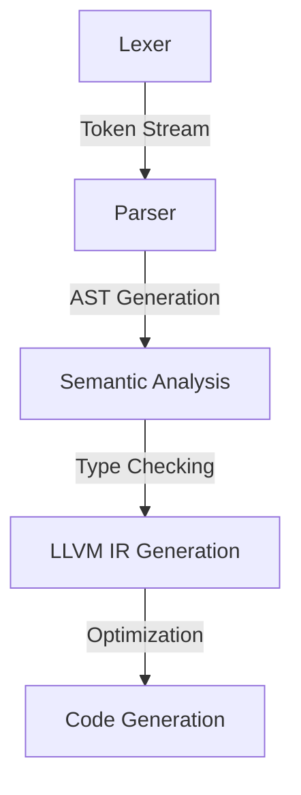
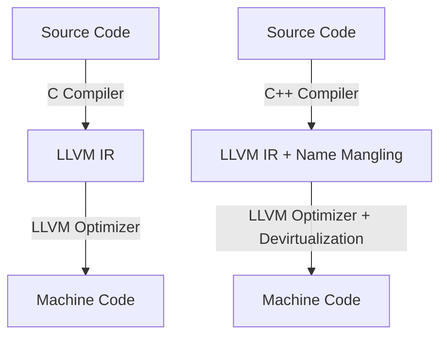

import Tabs from '@theme/Tabs';
import TabItem from '@theme/TabItem';

# **Compiler Perspective: C vs. C++ Compilation in Clang**

Clang, a frontend for LLVM, processes C and C++ differently due to their distinct language features. This guide provides a detailed comparison and practical steps to observe these differences, from frontend parsing to backend code generation.

## **1. Frontend: Parsing & Lexical Analysis**

### **Parsing Algorithms**
| Language | Parsing Type | Complexity |
|----------|--------------|-------------|
| C        | LL(1) Predictive Parsing | Simple Recursive Descent |
| C++      | GLR with Backtracking    | Handles Complex Syntax |



### **Example Code: C vs. C++ Parsing**
<Tabs>
<TabItem value="C">

#### **C Code (test.c)**
```c
#include <stdio.h>
void hello() {
    printf("Hello, C!\n");
}
int main() {
    hello();
    return 0;
}
```
</TabItem>
<TabItem value="C++">

#### **C++ Code (test.cpp)**
```cpp
#include <iostream>
class Greeter {
public:
    void hello() {
        std::cout << "Hello, C++!" << std::endl;
    }
};
int main() {
    Greeter g;
    g.hello();
    return 0;
}
```
</TabItem>
</Tabs>

### **Observing Tokenization**
```sh
clang -E -P test.c
clang++ -E -P test.cpp
```

## **2. Semantic Analysis & AST Differences**
| Feature | C | C++ |
|---------|---|-----|
| Function Resolution | Direct Lookup | Overloading, Name Mangling |
| Type Checking | Basic | Complex (Templates, Inheritance) |
| Virtual Functions | N/A | Uses Vtable |

### **AST Analysis Example**
```sh
clang -Xclang -ast-dump -fsyntax-only test.c | less
clang++ -Xclang -ast-dump -fsyntax-only test.cpp | less
```

## **3. Function Resolution Algorithms**

### **Symbol Table Examination**


A **symbol table** is a data structure used by the compiler and linker to store information about program symbols, such as functions and variables. The `nm` command helps inspect the symbols in object files and executables, making it a valuable tool for debugging and understanding compiled code.  

## Why Use `nm`?  
- Analyze **global and local symbols** in object files.  
- Debug **linking issues** by identifying undefined or duplicate symbols.  
- Inspect **function and variable symbols** in compiled binaries.  
- Understand **C and C++ name mangling** in object files.  

<Tabs>
<TabItem value="C">

#### **C Code Object Geneation (test.c)**
```c
clang --version
sudo apt-get install clang  #if clang is not present
clang -c test.c -o test.o
nm test.o
```
</TabItem>
<TabItem value="C++">

#### **C++ Code Object Generation (test.cpp)**
```cpp
clang++ --version
sudo apt-get install clang++  #if clang is not present
clang++ -c test.cpp -o testcpp.o
nm testcpp.o

```
</TabItem>
</Tabs>
If you dont understand what `-c` flag does you can visit 👉 [here](https://www.compilersutra.com/docs/compilers/know_your_compilers/#7-object-code-generation)

## **4. LLVM Intermediate Representation (IR) Differences**
| Language | IR Features |
|----------|------------|
| C        | Direct function calls |
| C++      | Name mangling, vtable, template instantiation |

### **IR Generation Example**
```sh
clang -S -emit-llvm test.c -o test_c.ll
clang++ -S -emit-llvm test.cpp -o test_cpp.ll
```

## **5. Optimization Techniques**

### **Common Optimizations**
- Dead Code Elimination (DCE)
- Loop Unrolling
- Constant Folding
- Function Inlining
- Common Subexpression Elimination (CSE)

### **C++-Specific Optimizations**
- **Devirtualization**
- **Template Instantiation Removal**
- **RTTI Optimization**

### **Observing Optimizations**
```sh
clang++ -O2 -S -emit-llvm test.cpp -o test_cpp_opt.ll
clang++ -O2 -Rpass=inline -Rpass=devirtualization test.cpp -o test_cpp
```

## **6. Backend: Code Generation & Linking Differences**

| Language | Linking Type |
|----------|-------------|
| C        | Static Linking |
| C++      | Requires vtable setup, RTTI, dynamic linking |



### **Assembly Code Generation**
```sh
clang -S test.c -o test_c.s
clang++ -S test.cpp -o test_cpp.s
```

## **7. Practical Compilation & Binary Comparison**
```sh
clang test.c -o test_c
clang++ test.cpp -o test_cpp
ls -lh test_c test_cpp
```

## **8. Conclusion**
- **C compilation** is simpler without name mangling or vtable management.
- **C++ compilation** is complex due to templates, function overloading, and polymorphism.
- LLVM optimizations adapt to C and C++ features differently.

By following these steps, you can observe Clang's distinct handling of C and C++ from frontend parsing to backend code generation.

# Also Interested In:
- [CompilerSutra Compiler Documentation](https://compilersutra.com/docs/compilers/compiler)
- [LLVM Basics](http://compilersutra.com/docs/llvm/llvm_basic/)
- [TVM for Beginners](http://compilersutra.com/docs/tvm-for-beginners/)

## Have Questions? 🤔  

If you have any questions or need further clarification, feel free to ask on our **Quora Space**:  👉 [**CompilerSutra on Quora**](https://compilersutra.quora.com)  

Join the discussion on compilers, LLVM, MLIR, and much more!


