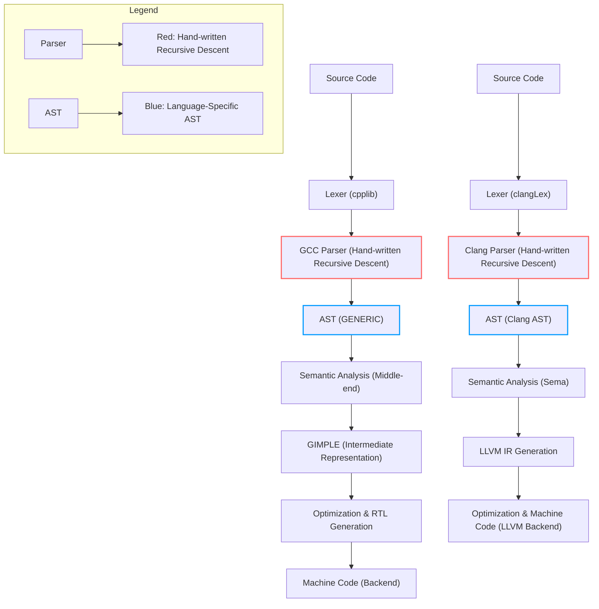

import Tabs from '@theme/Tabs';
import TabItem from '@theme/TabItem';

---

## The Parser: The Unsung Hero of Compiler Design

In the intricate world of software development, compilers act as the bridge between human-readable code and machine-executable instructions. At the heart of this translation process lies an unsung hero: **the parser**.

Parsers play a pivotal role in analyzing the structure of source code, ensuring it adheres to the syntax and grammar rules of the programming language. Without them, developers would be lost in a sea of ambiguous code, struggling with errors and inefficiencies.

A parser takes tokens produced by the lexical analyzer and transforms them into a structured format like the **Abstract Syntax Tree (AST)**. This structure forms the backbone of further compiler processes such as semantic analysis, optimization, and code generation. Whether it’s a simple language or a complex one like C++ or JavaScript, every compiler needs a robust parser to function effectively.

---

## **Table of Contents**

1. [What is a Parser?](#what-is-a-parser)
2. [Why Are Parsers Essential?](#why-are-parsers-essential)
3. [Types of Parsers](#types-of-parsers)
    * [Top-Down Parsers](#top-down-parsers)
    * [Bottom-Up Parsers](#bottom-up-parsers)
4. [Parser Output: Abstract Syntax Tree (AST)](#parser-output-abstract-syntax-tree-ast)
5. [Error Handling in Parsers](#error-handling-in-parsers)
6. [Parser Design in GCC vs Clang](#parser-design-in-gcc-vs-clang)
7. [ Parsing Digram](#parsing-digram-recursive-decent-parser-and-bison)
8. [Conclusion](#conclusion)
9. [References and Read More](#references-and-read-more-articles)
10. [FAQ](#❓-faq-understanding-parsers-in-compilers)

---

## What is a Parser?

A **parser** is a crucial component of a compiler that processes the source code of a program to check its syntactic structure according to the grammar of the programming language. It takes the linear sequence of tokens produced by the lexer (lexical analyzer) and arranges them into a tree-like structure called the **Abstract Syntax Tree (AST)**.

The parser ensures that the program follows the grammatical rules of the language and reports any syntax errors. If the code is syntactically correct, the parser constructs the AST, which represents the hierarchical structure of the source code and serves as the foundation for further compiler stages like semantic analysis and code generation.

---

## Why Are Parsers Essential?

* **Syntax Validation:** Ensures code follows language rules.
* **Error Detection:** Identifies and reports syntax errors early.
* **Structural Representation:** Generates an AST for further compiler phases.
* **Enables Tooling:** Powers IDEs, linters, and static analyzers.

Without parsers, compilers couldn’t proceed beyond raw tokenization, making them indispensable.

---

## Types of Parsers

### Top-Down Parsers

Start from the root (program structure) and expand downward to leaves (tokens).

* **Recursive Descent Parser:**

  * Hand-written, follows grammar rules recursively.
  * Easy to implement but may struggle with left recursion.
* **LL Parsers (Left-to-right, Leftmost derivation):**

  * Uses a parsing table for predictive analysis.
  * Efficient for simple grammars (e.g., LL(1)).

### Bottom-Up Parsers

Start from tokens and build up to the root.

* **LR Parsers (Left-to-right, Rightmost derivation in reverse):**

  * More powerful, handles complex grammars (e.g., LR(1), LALR).
  * Used in tools like **Yacc/Bison**.
* **Shift-Reduce Parsers:**

  * Uses a stack to shift tokens and reduce them into grammar rules.

---

## Parser Output: Abstract Syntax Tree (AST)

The **AST** is a simplified, hierarchical representation of code, stripping away unnecessary syntax (e.g., braces, semicolons) while preserving logical structure.

**Example:**

```plaintext
x = 10 + 5 * 2
AST Representation:

    Assignment  
    /      \  
  'x'      Add  
          /   \  
        10    Multiply  
              /     \  
            5       2  
```

---

## Error Handling in Parsers

Good parsers:

* ✔ Detect errors (e.g., missing semicolons, mismatched brackets).
* ✔ Recover gracefully (skip invalid parts, continue parsing).
* ✔ Provide meaningful feedback (line numbers, expected tokens).

**Example Error Message:**

```plaintext
Error at line 5: Expected ')' after function arguments.
```

---

## Parser Design in GCC vs Clang

While historically GCC's C and Objective-C front-ends have relied on LALR parsers generated by tools like Bison, and Clang's parser design is rooted in hand-written recursive descent techniques, it's more accurate to say that:

- **GCC's C and Objective-C front-ends primarily utilize LALR parsers generated by Bison for syntax analysis.**  
  The C++ front-end in GCC (`cp/`) transitioned early on to a hand-written recursive descent parser to handle the complexity and context-sensitivity of C++ more effectively.

- **Clang employs hand-written recursive descent parsers for C, C++, and Objective-C.**  
  This design choice provides:
  - Better control over parsing logic.
  - Enhanced error diagnostics and recovery.
  - Tight coupling between parsing and Abstract Syntax Tree (AST) construction.

> 📝 **Note:** Recursive descent parsing offers flexibility and precision, especially valuable for C++'s intricate grammar, which is why both Clang and modern GCC C++ front-ends adopt it.


**Tools:**

* **ANTLR:** Generates parsers for multiple languages from grammar.
* **Bison/Yacc:** Classic parser generators for C/C++.

---
When understanding how compilers parse source code, it's essential to recognize the fundamental design choices behind different front-ends. Here’s a comparison of parsing strategies in **GCC** and **Clang**, especially across **C**, **C++**, and **Objective-C**.

---

##  Summary

| Language      | GCC Frontend Parser Type       | Clang Frontend Parser Type     |
|---------------|-------------------------------|-------------------------------|
| C             | Bison-generated (LALR)         | Hand-written Recursive Descent |
| C++           | Hand-written Recursive Descent | Hand-written Recursive Descent |
| Objective-C   | Bison-generated (via C parser) | Hand-written Recursive Descent |

---

##  Detailed Explanation

### GCC

- **C and Objective-C**:
  - Uses **Bison-generated LALR parsers** ([`c-parser.c`](https://github.com/gcc-mirror/gcc/blob/master/gcc/c/c-parser.cc), [`c-parse.h`](https://github.com/gcc-mirror/gcc/blob/master/gcc/c/c-parser.h)).
  - Traditional bottom-up parsing approach.
  - Relies on parse tables and grammar files.
  
- **C++**:
  - Uses **hand-written recursive descent parser** ([`parser.cc`](https://github.com/gcc-mirror/gcc/blob/master/gcc/cp/parser.cc), [`parser.h`](https://github.com/gcc-mirror/gcc/blob/master/gcc/cp/parser.h)).
  - Allows greater flexibility and more direct handling of complex and context-sensitive C++ syntax.

---

### 🔧 Clang

- **C, C++, Objective-C**:
  - Clang uses **hand-written recursive descent parsers** for all three languages.
  - This design choice offers:
    - **Better control** over parsing logic.
    - **Enhanced error diagnostics and recovery**.
    - **Tight coupling** between parsing and Abstract Syntax Tree (AST) construction.

- You can explore Clang's parser source code on [GitHub](https://github.com/llvm/llvm-project/tree/main/clang/lib/Parse).

---

## 📝 Why Recursive Descent?

Recursive descent parsing provides **flexibility and precision**, especially beneficial for languages like **C++**, which have intricate and context-sensitive grammar. 

### Advantages:
- **Fine-grained error recovery**: Recursive descent can detect errors at a more localized level and report meaningful diagnostics.
- **Direct AST Construction**: Parsing is closely tied with AST creation, making the entire parsing process more efficient and easier to debug.

:::important
Both **Clang** and the modern **GCC C++ front-end** rely on recursive descent parsing due to its ability to handle **complex language features** and provide **clear diagnostics**. While GCC still uses Bison for its C and Objective-C front-ends, Clang maintains a unified recursive descent approach across all supported languages.
:::

---

##  Parsing Digram Recursive Decent Parser and Bison

<details>
<summary> Parsing </summary>


</details>

---

#  Viewing Parser Output in GCC vs Clang

To see the parser output and inspect intermediate representations in **GCC** and **Clang**, you can use various flags. Here's how to do it in both compilers:

---

##  Commands for Viewing Parser Output

<Tabs>
<TabItem value="GCC" label="GCC">
- **Dump the translation unit** (syntax, AST, and more):
  ```bash
  g++ fdump-lang-raw your_file.cpp
  ```
  :::note
  <details>
    <summary>What each flag do?</summary>
    
    - `g++`: The GCC compiler command.
    - `-fdump-lang-raw`:  Print a raw representation of the compiler’s internal trees. By default, GCC pretty-prints trees into a C-like format, but this option outputs the internal structures in a raw, detailed format useful for examining how GCC internally represents the source code(this option only work for cpp)

    - `-fdump-tree-all`: Dumps GCC's internal tree representation at every stage of tree-based optimization, showing how the compiler transforms the Abstract Syntax Tree (AST) through each pass.


  </details>
  :::

</TabItem>

<TabItem value="clang" label="clang">
- **Dump the translation unit** (syntax, AST, and more):
  ```bash
  clang -Xclang -ast-dump -fsyntax-only your_file.c
  ```
:::note
<details>
  <summary>What each flag do?</summary>
  
  - `clang`: The Clang compiler command.
  - `-Xclang`: Passes options directly to Clang's internal components.
  - `-ast-dump`: Outputs the Abstract Syntax Tree (AST) for the source file.
  - `-fsyntax-only`: Stops after syntax checking and AST generation (no compilation).
  - `your_file.c`: The input source file for Clang.

</details>
:::

</TabItem>

</Tabs>

## Conclusion

Parsers are the quiet architects of the compilation process. They convert raw, unstructured code into a meaningful form that compilers can understand and transform — forming the critical bridge between human-written syntax and machine-understandable semantics.

A parser doesn’t work alone. It takes **a stream of tokens** as input — those tokens are produced by the **lexer**, which scans the raw source code. The parser then analyzes these tokens according to the language grammar and produces an **Abstract Syntax Tree (AST)** or **Parse Tree** as output. This tree is the foundation for further stages like semantic analysis, optimization, and code generation.

In modern compilers like **GCC** and **Clang**, the parser plays a vital role in enabling not just compilation, but also developer tools like static analyzers, linters, IDE autocompletion, and error diagnostics.

So the next time you compile your code, remember:  
💡 The parser is the brain that reads your intentions and turns them into structure — quietly enabling every optimization, every warning, and every successful build.  
It’s the unsung hero of the software you write

## References and Read More articles
## 📚 References

- [Compilers: Principles, Techniques, and Tools (Dragon Book)](https://en.wikipedia.org/wiki/Compilers:_Principles,_Techniques,_and_Tools) – Classic textbook on compiler design.
- [GCC Internals Documentation](https://gcc.gnu.org/onlinedocs/gccint/) – Official documentation on how GCC works internally, including parsing.
- [Clang Documentation](https://clang.llvm.org/docs/) – Learn how Clang handles parsing and AST generation.
- [LLVM AST Introduction](https://clang.llvm.org/docs/IntroductionToTheClangAST.html) – Deep dive into Clang’s AST and parsing system.
- [Bison: The GNU Parser Generator](https://www.gnu.org/software/bison/) – Used in tools like GCC for automatic parser generation.
- [ANTLR (Another Tool for Language Recognition)](https://www.antlr.org/) – A powerful parser generator used in many modern language tools.
- [Clang AST Dump Example](https://clang.llvm.org/docs/ClangCommandLineReference.html#cmdoption-clang-xclang-ast-dump) – Learn how to use `clang -Xclang -ast-dump`.

- [Compiler Explorer](https://godbolt.org/) – See how your C++ code is parsed and compiled in real time with Clang, GCC, and others.

<details>
<summary>Read More Artilces</summary>

- [Introduction to LLVM](https://www.compilersutra.com/docs/llvm/intro-to-llvm/)
- [Why LLVM?](https://www.compilersutra.com/docs/llvm/llvm_basic/Why_What_Is_LLVM)
- [LLVM IR Tutorial: From Beginner to Expert](https://www.compilersutra.com/docs/llvm/llvm_basic/markdown-features)
- [Building Compilers in 100 Word](https://www.compilersutra.com/docs/compilers/build_your_compiler)
- [How to Disable LLVM Passes](https://www.compilersutra.com/docs/llvm/llvm_extras/disable_pass)
</details>

---

## ❓ FAQ: Understanding Parsers in Compilers

**Q1. What is a parser in a compiler?**  
A parser reads a sequence of tokens (generated by the lexer) and transforms them into a structured format known as an Abstract Syntax Tree (AST).

**Q2. What is the purpose of parsing in a compiler?**  
Parsing verifies the syntactic correctness of the code and organizes it into a tree structure for further processing such as semantic analysis and code generation.

**Q3. What is the difference between syntax and semantic analysis?**  
Syntax analysis checks for correct use of grammar (e.g., missing semicolons), while semantic analysis checks for logical correctness (e.g., undeclared variables or type mismatches).

**Q4. What are the two main types of parsers?**  
Top-down parsers (e.g., Recursive Descent) and Bottom-up parsers (e.g., LR, LALR parsers).

**Q5. What is an Abstract Syntax Tree (AST)?**  
An AST is a tree representation of the abstract syntactic structure of the source code, where each node denotes a construct occurring in the code.

**Q6. What is a Concrete Syntax Tree (Parse Tree)?**  
A parse tree includes every detail of the syntax based on the grammar rules, unlike ASTs which omit redundant details like parentheses or semicolons.

**Q7. How does a recursive descent parser work?**  
It consists of a set of functions where each function implements one of the grammar rules and calls other functions to parse subcomponents.

**Q8. What are the advantages of top-down parsing?**  
Top-down parsing is easier to understand and implement. It is good for small and simple grammars and allows better error reporting.

**Q9. What are the disadvantages of top-down parsing?**  
It does not handle left-recursive grammars well and may require backtracking or lookahead to disambiguate grammar rules.

**Q10. What is an LL parser?**  
LL stands for Left-to-right scan of input, Leftmost derivation. It is a top-down parser that parses from left to right and builds the leftmost derivation of the input.

**Q11. What is an LR parser?**  
LR stands for Left-to-right scan of input and Rightmost derivation in reverse. It is a bottom-up parser capable of handling a wider range of grammars than LL parsers.

**Q12. How does GCC implement its parser?**  
GCC uses hand-written recursive descent parsers supplemented with Bison for some language grammars. C++ parsing code is located in `cp/parser.c`.

**Q13. How does Clang implement its parser?**  
Clang uses a modular recursive descent parser with tight integration between parsing and semantic analysis. Located in `clang/lib/Parse/Parser.cpp`, it produces a clean AST.

**Q14. Which parser is better: GCC’s or Clang’s?**  
Clang’s parser is better for tooling and static analysis due to its modularity and cleaner AST. GCC’s parser is more traditional and optimized for mature codebases.

**Q15. What is the role of semantic actions in parsing?**  
Semantic actions are snippets of code executed during parsing to perform tasks such as building AST nodes or symbol table entries.

**Q16. What are lookahead tokens in parsing?**  
Lookahead tokens are used to peek at upcoming tokens without consuming them, allowing the parser to make better parsing decisions.

**Q17. Can a parser recover from syntax errors?**  
Yes, many parsers include error recovery mechanisms that allow parsing to continue after encountering an error, especially in IDEs and compilers.

**Q18. What is backtracking in parsing?**  
Backtracking is a parsing strategy where the parser reverts to a previous state if a parsing path fails and tries an alternative rule.

**Q19. What tools are used to generate parsers?**  
Common tools include Bison (GNU), Yacc, ANTLR, and JavaCC. These tools generate parsing code based on a formal grammar description.

**Q20. How can I visualize the output of a parser?**  
You can use tools like Clang's AST dumper (`clang -Xclang -ast-dump`) or GCC’s `-fdump-tree-*` options to view intermediate representations like ASTs.

---