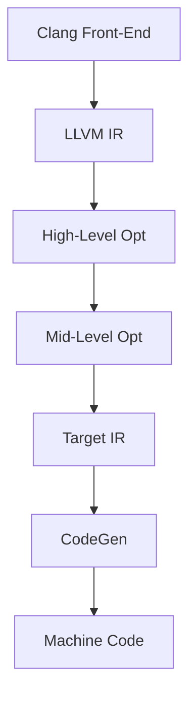
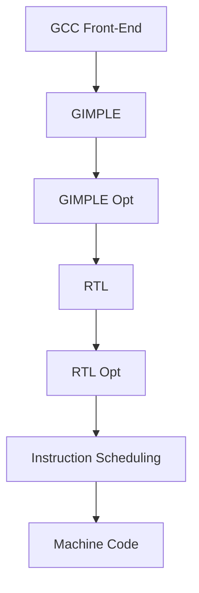

---

title: "LLVM vs GCC: Optimization Techniques & Benchmarks in Practice"
description: "A practical guide comparing LLVM and GCC optimization levels, flags, binary performance, and real-world benchmarks. Dive into hands-on examples and learn how to choose the right compiler optimizations."

keywords:
  - best compiler for high-performance computing
  - LLVM vs GCC for deep learning
  - GCC vs Clang for embedded programming
  - why Clang produces better error messages than GCC
  - LLVM vs GCC vectorization performance
  - LLVM vs GCC
  - GCC vs Clang
  - LLVM Clang vs GCC
  - GCC optimization
  - LLVM optimization
  - compiler performance comparison
  - LLVM IR vs GIMPLE
  - Clang vs GCC benchmarks
  - GCC code generation
  - LLVM backend
  - GCC backend
  - static analysis in LLVM
  - static analysis in GCC
  - LLVM sanitizers
  - GCC sanitizers
  - Clang vs GCC diagnostics
  - link-time optimization LLVM
  - link-time optimization GCC
  - just-in-time compilation LLVM
  - ahead-of-time compilation GCC
  - LLVM for embedded systems
  - GCC for embedded systems
  - LLVM cross-compilation
  - GCC cross-compilation
  - GCC vs LLVM for C++
  - GCC vs LLVM for Rust
  - GCC vs LLVM for Fortran
  - LLVM IR optimizations
  - GCC intermediate representation
  - LLVM MLIR
  - GCC tree SSA
  - LLVM vs GCC OpenMP support
  - LLVM vs GCC CUDA support
  - LLVM vs GCC vectorization
  - LLVM vs GCC auto-parallelization
  - LLVM vs GCC inline assembly
  - Clang vs GCC error messages
  - LLVM vs GCC Windows support
  - LLVM vs GCC Linux support
  - LLVM vs GCC macOS support
  - LLVM vs GCC embedded AI
  - LLVM vs GCC for gaming
  
tags:
  - LLVM
  - GCC
  - Clang
  - Compiler Comparison
  - Compiler Optimization
  - Code Generation
  - Performance Benchmarking
  - Link-Time Optimization
  - Static Analysis
  - Just-In-Time Compilation
  - Ahead-Of-Time Compilation
  - Embedded Systems
  - Cross Compilation
  - OpenMP
  - CUDA
  - Vectorization
  - Auto-Parallelization
  - MLIR
  - AI Compilation
  - Code Analysis
---

import Tabs from '@theme/Tabs';
import TabItem from '@theme/TabItem';
import AdBanner from '@site/src/components/AdBanner';

<div>
    <AdBanner />
</div>

# LLVM vs GCC: Optimization Techniques & Benchmarks in Practice

Welcome to **Part 2** of our LLVM vs GCC comparison series. This article focuses on **practical compiler optimization**: how GCC and LLVM apply optimizations (`-O0` to `-Ofast`), how they affect performance and size, and how to interpret results using free industry benchmarking tools. We also introduce techniques like **PGO**, **LTO**, and offer use-case recommendations.

:::caution Didn't Read Part 1?
Part 1, titled ["LLVM vs GCC: Performance, Optimization, and Use Cases Compared"](https://www.compilersutra.com/docs/compilers/gcc_vs_llvm), covers architecture, IRs (LLVM IR vs GIMPLE), licensing, and modularity.
:::

---

## 📚 Table of Contents

- [Optimization Levels Overview](#optimization-levels-overview)
- [Benchmark Configuration](#-benchmark-configuration)
- [Phoronix Test Suite Benchmarks: Best All-Rounder](#phoronix-test-suite-benchmarks-best-all-rounder)
- [How to Benchmark GCC vs LLVM on Linux](#-how-to-benchmark-gcc-vs-llvm-on-linux)
- [Comparing Benchmark Results with Phoronix Test Suite](#-comparing-benchmark-results-with-phoronix-test-suite)
- [Sample GCC vs Clang Results (Apache Build)](#-sample-gcc-vs-clang-results-apache-build)
- [Compiler Optimization Pipelines](#compiler-optimization-pipelines)
- [Summary of Findings](#summary-of-findings)
- [Further Reading](#further-reading)
- [More Articles](#more-articles)
- [Frequently Asked Questions (FAQ)](#-frequently-asked-questions-faq)


<div>
    <AdBanner />
</div>

## Optimization Levels Overview

Compiler optimization levels control how much ***effort the compiler*** puts into ***improving performance***, ***reducing binary size***, or speeding up compilation. Each level enables a specific set of transformations and analyses.

<Tabs>
<TabItem value="table" label="Table Summary" default>

| Optimization Level | Description                                                                  | Ideal Use Case                   | GCC Support | LLVM Support |
| ------------------ | ---------------------------------------------------------------------------- | -------------------------------- | ----------- | ------------ |
| `-O0`              | Disables all optimizations. Full debug symbols, no code rearrangement.       | Debugging, stepping through code | ✅           | ✅            |
| `-O1`              | Enables minimal optimizations for compile speed without significant changes. | Fast builds, testing pipelines   | ✅           | ✅            |
| `-O2`              | Enables nearly all safe optimizations, including inlining and loop opts.     | General production builds        | ✅           | ✅            |
| `-O3`              | Includes `-O2` plus aggressive inlining, loop unrolling, vectorization.      | HPC, performance-critical code   | ✅           | ✅            |
| `-Ofast`           | `-O3` + unsafe math opts (`-ffast-math`), disables strict standards          | Scientific computing, AI/ML      | ✅           | ✅            |
| `-Os`              | Optimizes for size over speed by disabling inlining and unrolling            | Embedded systems, firmware       | ✅           | ✅            |
| `-Oz`              | Further size reduction than `-Os` by disabling even more aggressive codegen  | WebAssembly, mobile apps         | ❌           | ✅            |

</TabItem>
</Tabs>


<div>
    <AdBanner />
</div>

### Why Optimization Levels Matter

* `-O3` and `-Ofast`: Improve runtime for compute-heavy apps
* `-O0`: Fast compiles and best for debugging
* `-Os`, `-Oz`: Save binary size for mobile or embedded

:::caution ⚠️ Default Optimization Behavior

```javascript
gcc file.c
```

means you're using `-O0`:

* 🐞 Best for **debugging**
* ❌ **No performance gains**
* 🐌 Slower, bulkier binaries

<Tabs>
<TabItem value="GCC" label="GCC (Verbose Mode)" default>

```javascript
gcc -v file.c
```

</TabItem>
<TabItem value="Clang" label="Clang (Dry Run Mode)">

```javascript
clang -### file.c
```

</TabItem>
</Tabs>
:::

---

<div>
    <AdBanner />
</div>

## 🧪 Benchmark Configuration

<Tabs>
<TabItem value="System Specs" label="🖥️ System Specs" default>

| Component            | Specification                              |
| -------------------- | ------------------------------------------ |
| **Device**           | Dell/Lenovo/Other (Intel-based) Laptop     |
| **CPU**              | Intel Core i7-1065G7 (4C/8T @ 1.30–3.90GHz) |
| **RAM**              | 16 GB DDR4                                 |
| **Operating System** | Linux (e.g., Ubuntu 22.04)                 |
| **Architecture**     | x86_64                                     |

</TabItem>
<TabItem value="Compilers" label="🧵 Compiler Versions">

| Compiler  | Version  | Source                     |
| --------- | -------- | -------------------------- |
| **Clang** | 14.0.0   | sudo apt-get install clang |
| **GCC**   | 11.4.0   | sudo apt-get install gcc   |

> ✅ Used: `-march=native -flto`

</TabItem>
<TabItem value="Utilities" label="🛠️ Toolchain Utilities">

| Tool        | Purpose                                 |
| ----------- | --------------------------------------- |
| `perf`      | Performance profiling                   |
| `time`      | Wall-clock and system/user breakdown    |
| `hyperfine` | Repeated timing with statistical output |
| `clang/gcc` | Compilers used with same flags          |

</TabItem>
</Tabs>

---

<div>
    <AdBanner />
</div>


## Phoronix Test Suite Benchmarks: Best All-Rounder

The **Phoronix Test Suite (PTS)** is a powerful, open-source benchmarking framework used to evaluate and compare compiler performance across workloads. It works well with **GCC**, **Clang/LLVM**, and many other compilers.

### 🌟 Why Use PTS?

* Real-world & synthetic test coverage
* Cross-compiler benchmarking support
* JSON, XML, and HTML report generation
* Statistical insights with charts
* Easy compiler switching via environment variables

---

## 🔧 How to Benchmark GCC vs LLVM on Linux

```javascript
# Step 1: Install Phoronix Test Suite
sudo apt update
sudo apt install phoronix-test-suite
```
:::note
> If Phoronix Test Suite is not present, you can manually install it:
:::
```javascript
wget https://phoronix-test-suite.com/releases/phoronix-test-suite-10.8.4.tar.gz
tar -xvzf phoronix-test-suite-10.8.4.tar.gz
cd phoronix-test-suite
sudo ./install-sh
```
```javascript
# Step 2: Install a benchmark (e.g., Apache build)
phoronix-test-suite install pts/build-apache
```

### ▶️ Benchmark with LLVM (Clang)

```javascript
export CC=clang
export CXX=clang++
phoronix-test-suite run pts/build-apache
```

### ▶️ Benchmark with GCC

```javascript
export CC=gcc
export CXX=g++
phoronix-test-suite run pts/build-apache
```

---

<div>
    <AdBanner />
</div>


## 📊 Comparing Benchmark Results with Phoronix Test Suite

### 🗂️ Step 1: List Saved Test Cases

Before comparing, check which test results are available:

```javascript
phoronix-test-suite list-saved-results
```

Example output:

```
clangtestcase
gcctestcase
```

---

<div>
    <AdBanner />
</div>


### 🔀 Step 2: Merge Test Results

Merge the results you want to compare:

```javascript
phoronix-test-suite merge-results clangtestcase gcctestcase
```

---


### 📤 Step 3: Save & Share Results

Export the merged result to a readable format:

```javascript
phoronix-test-suite result-file-to-text <result-id>
```

To upload the result to OpenBenchmarking.org for sharing:

```javascript
phoronix-test-suite upload-results
```

> Replace `<result-id>` with the identifier of the merged result, if applicable.
---

## 📝 Notes

* Always reset your environment between compiler runs to avoid cache contamination.
* Use the same flags (e.g., `-O2`, `-march=native`, `-flto`) for fairness.
* For more benchmarks, run:

```javascript
phoronix-test-suite list-available-tests
```

* For a full system summary:

```javascript
phoronix-test-suite system-info
```

---


<div>
    <AdBanner />
</div>


## 🔄 Sample GCC vs Clang Results (Apache Build)

### GCC Test Case

```
Test Name:     gcctestcase
Compiler:      GCC 11.4.0
Result:        57.62 seconds

System Info:
  CPU:          Intel Core i7-1065G7 @ 3.90GHz (4C/8T)
  Memory:       12GB
  Disk:         SK hynix BC511 NVMe 512GB
  OS:           Ubuntu 22.04 (Kernel: 6.8.0-60-generic)
  Graphics:     Intel Iris Plus G7
```

### Clang Test Case

```
Test Name:     clang_testcase
Compiler:      Clang 14.0.0-1ubuntu1.1
Result:        54.09 seconds

System Info:
  CPU:          Intel Core i7-1065G7 @ 3.90GHz (4C/8T)
  Memory:       12GB
  Disk:         SK hynix BC511 NVMe 512GB
  OS:           Ubuntu 22.04 (Kernel: 6.8.0-60-generic)
  Graphics:     Intel Iris Plus G7
```

### Summary Table

| Compiler | Time to Compile Apache 2.4.63 | Lower is Better |
| -------- | ----------------------------- | --------------- |
| GCC      | 57.62 seconds                 |                 |
| Clang    | 54.09 seconds                 | ✅ Faster        |

<details> 
<summary>  Summary explanation </summary>

### 🔍 Explanation

This table compares the **compile time performance** of two compilers — **GCC** and **Clang** — when building the **Apache HTTP Server version 2.4.63**.

| Column | Meaning |
|--------|---------|
| **Compiler** | The name of the compiler used (`GCC` or `Clang`) |
| **Time to Compile Apache 2.4.63** | The total time (in seconds) it took for each compiler to build the Apache server |
| **Lower is Better** | Indicates that **shorter compile times are preferred**, as they reflect faster performance |

### ✅ Key Insight

- **Clang** took **54.09 seconds** to compile, while **GCC** took **57.62 seconds**.
- That makes **Clang faster by ~3.5 seconds**, hence marked with a ✅ in the table.
- This suggests **Clang is more efficient in this scenario**, at least in terms of build time.
</details>
---

<div>
    <AdBanner />
</div>


:::caution Why is Clang Faster in This Benchmark

Clang typically has:
- A faster front-end for parsing and lexing
- Better multithreading behavior during compilation
- More modern codebase and memory optimizations

You can use  `-ftime-report` or tools like `perf` to get breakdowns of each compiler phase.
:::

## Compiler Optimization Pipelines

<Tabs>
<TabItem value="llvm" label="LLVM Pipeline">



</TabItem>
<TabItem value="gcc" label="GCC Pipeline">



</TabItem>
</Tabs>

---


## Summary of Findings

| Feature           | GCC | LLVM |
| ----------------- | --- | ---- |
| Compilation Speed | ✅   | ✅✅   |
| Binary Size       | ✅✅  | ✅✅✅  |
| Runtime Perf      | ✅   | ✅✅✅  |
| Embedded Use      | ✅✅  | ✅    |
| Tooling/IR        | ✅   | ✅✅✅  |

---

## Further Reading

* [LLVM Optimization Passes](https://llvm.org/docs/Passes.html)
* [GCC Optimization Options](https://gcc.gnu.org/onlinedocs/gcc/Optimize-Options.html)
* [Phoronix Test Suite](https://www.phoronix-test-suite.com/)
* [Compiler Explorer](https://godbolt.org/)

---

<div>
    <AdBanner />
</div>


## More Articles

<Tabs>
  <TabItem value="docs" label="📚 Documentation">
             - [CompilerSutra Home](https://compilersutra.com)
                - [CompilerSutra Homepage (Alt)](https://compilersutra.com/)
                - [Getting Started Guide](https://compilersutra.com/get-started)
                - [Newsletter Signup](https://compilersutra.com/newsletter)
                - [Skip to Content (Accessibility)](https://compilersutra.com#__docusaurus_skipToContent_fallback)


  </TabItem>

  <TabItem value="tutorials" label="📖 Tutorials & Guides">

        - [AI Documentation](https://compilersutra.com/docs/Ai)
        - [DSA Overview](https://compilersutra.com/docs/DSA/)
        - [DSA Detailed Guide](https://compilersutra.com/docs/DSA/DSA)
        - [MLIR Introduction](https://compilersutra.com/docs/MLIR/intro)
        - [TVM for Beginners](https://compilersutra.com/docs/tvm-for-beginners)
        - [Python Tutorial](https://compilersutra.com/docs/python/python_tutorial)
        - [C++ Tutorial](https://compilersutra.com/docs/c++/CppTutorial)
        - [C++ Main File Explained](https://compilersutra.com/docs/c++/c++_main_file)
        - [Compiler Design Basics](https://compilersutra.com/docs/compilers/compiler)
        - [OpenCL for GPU Programming](https://compilersutra.com/docs/gpu/opencl)
        - [LLVM Introduction](https://compilersutra.com/docs/llvm/intro-to-llvm)
        - [Introduction to Linux](https://compilersutra.com/docs/linux/intro_to_linux)

  </TabItem>

  <TabItem value="assessments" label="📝 Assessments">

        - [C++ MCQs](https://compilersutra.com/docs/mcq/cpp_mcqs)
        - [C++ Interview MCQs](https://compilersutra.com/docs/mcq/interview_question/cpp_interview_mcqs)

  </TabItem>

  <TabItem value="projects" label="🛠️ Projects">

            - [Project Documentation](https://compilersutra.com/docs/Project)
            - [Project Index](https://compilersutra.com/docs/project/)
            - [Graphics Pipeline Overview](https://compilersutra.com/docs/The_Graphic_Rendering_Pipeline)
            - [Graphic Rendering Pipeline (Alt)](https://compilersutra.com/docs/the_graphic_rendering_pipeline/)

  </TabItem>

  <TabItem value="resources" label="🌍 External Resources">

            - [LLVM Official Docs](https://llvm.org/docs/)
            - [Ask Any Question On Quora](https://compilersutra.quora.com)
            - [GitHub: FixIt Project](https://github.com/aabhinavg1/FixIt)
            - [GitHub Sponsors Page](https://github.com/sponsors/aabhinavg1)

  </TabItem>

  <TabItem value="social" label="📣 Social Media">

            - [🐦 Twitter - CompilerSutra](https://twitter.com/CompilerSutra)
            - [💼 LinkedIn - Abhinav](https://www.linkedin.com/in/abhinavcompilerllvm/)
            - [📺 YouTube - CompilerSutra](https://www.youtube.com/@compilersutra)

  </TabItem>
</Tabs>

---

<div>
    <AdBanner />
</div>


## ❓ Frequently Asked Questions (FAQ)

### 1. **Which compiler should I use — GCC or LLVM?**

It depends on your use case:

* Use **GCC** if you're targeting legacy codebases, embedded systems, or need Fortran support.
* Use **Clang/LLVM** for faster compile times, better diagnostics, modern tooling, and tighter integration with languages like Rust and Swift.

---

### 2. **Is Clang always faster than GCC?**

Not always. Clang typically has a faster frontend and better parallelism during builds, but GCC can outperform Clang in certain backend optimizations, especially for highly tuned HPC or loop-intensive workloads.

---

### 3. **Do both compilers support the same optimization flags?**

Mostly yes, for common flags like `-O0`, `-O2`, `-O3`, `-Ofast`, and `-Os`. However, some flags (like `-Oz`, `-ffast-math`, or certain target-specific options) behave differently or are only available in one compiler.

---

### 4. **Can I use both compilers on the same system?**

Yes! Most Linux systems support side-by-side installation:

```bash
sudo apt install gcc clang
```

Use `export CC=gcc` or `export CC=clang` to switch between them.

---

### 5. **Which compiler is better for debugging?**

**Clang** tends to offer clearer, more human-readable error messages and warnings. But **GCC** supports broader platform debugging tools in some embedded environments.

---

### 6. **What about Link-Time Optimization (LTO)?**

Both support LTO:

* GCC uses `-flto` and integrates well with `ld.bfd`.
* Clang uses `-flto` too but typically requires `lld` for best performance.

---

### 7. **Can I mix GCC and Clang compiled objects?**

Technically possible, but **not recommended** unless you fully control the build system. ABI differences or metadata mismatches can cause runtime issues.

---

### 8. **How can I benchmark my own code like in this article?**

Use the Phoronix Test Suite or tools like `time`, `perf`, and `hyperfine`. Follow the instructions above to isolate and measure compile time, binary size, and runtime performance.

---

<div>
    <AdBanner />
</div>
