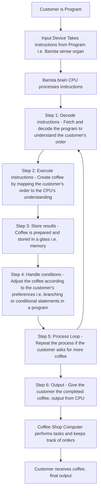
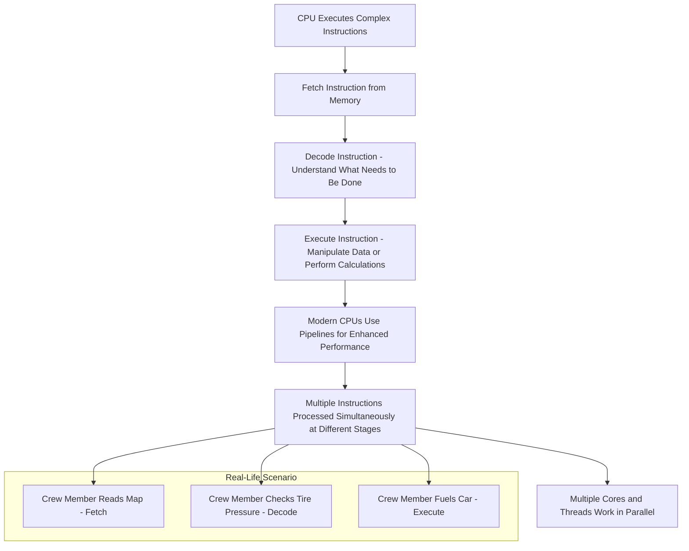
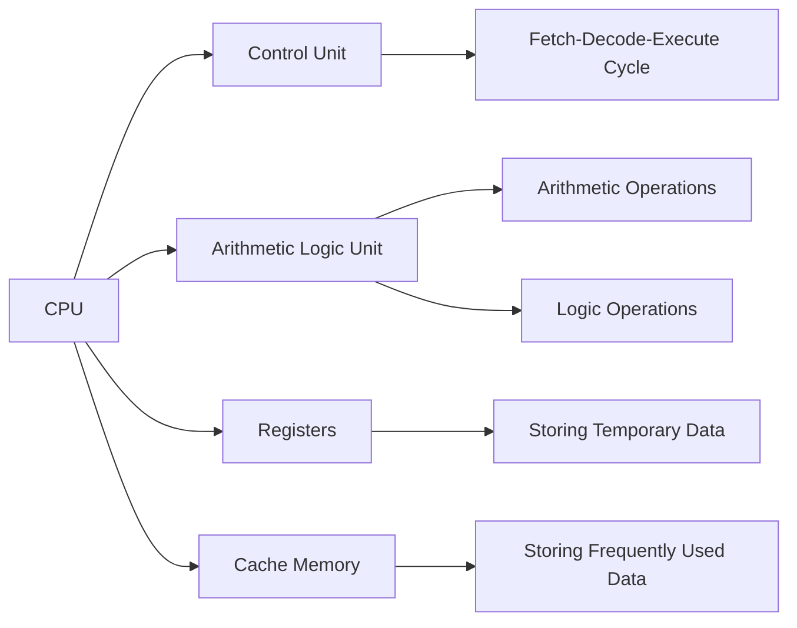
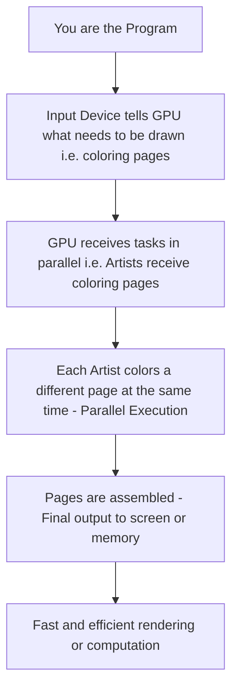
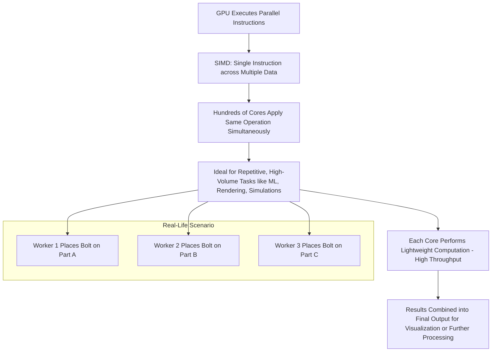
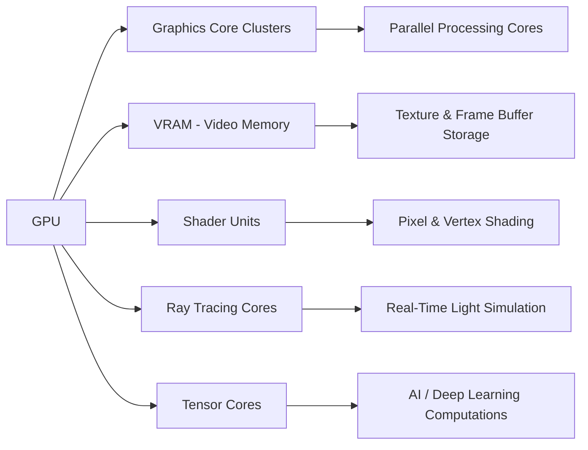

> [Subscribe](https://compilersutra.com/newsletter)

import Tabs from '@theme/Tabs';
import TabItem from '@theme/TabItem';

import Parallel_Programming from './Parallel_Programming/Parallel_Progamming_Book.js';

  
    <Parallel_Programming />  

  

---
## Introduction

<Tabs>
  <TabItem value="curiosity" label="🌟 Why Should You Care?">
  
>***Do you still believe GPUs are just for gamers?***

From ``training cutting-edge`` AI models to accelerating ``high-frequency trading`` algorithms, ``GPUs`` are quietly reshaping our digital world. Ever wondered why your smartphone runs smoother, how ChatGPT responds in seconds, or how Tesla’s autopilot makes lightning-fast decisions?

Behind the scenes, ``GPUs`` are doing the ``heavy lifting``.

Understanding the difference between CPUs and GPUs isn't just tech trivia—it's your gateway to modern computing, innovation, and career-defining opportunities.

🤔 Curious yet?

  </TabItem>

  <TabItem value="why-learn" label="🎯 Why Learn This?">
  

Whether you're an aspiring developer, a machine learning enthusiast, or a system architect, understanding **GPU fundamentals** can elevate your skills to new heights. Here's how:

- **🚀 Supercharge performance** in data-heavy applications, enabling faster computations and higher throughput.
- **🧠 Design cutting-edge AI and deep learning pipelines** with GPUs, accelerating model training and inference processes.
- **🎮 Dive into graphics programming** for immersive AR/VR experiences and gaming technologies—powering the future of interactive media.
- **⚙️ Optimize software for real-world scalability**, ensuring your applications can handle complex tasks efficiently across diverse systems.

It’s not just about speed; it’s about *smart computing*.

By grasping the differences between **GPU vs. CPU**, you'll gain the edge needed to make more informed architectural decisions, whether you're building AI models, crafting immersive digital experiences, or scaling software for millions of users.

Let’s try to learn as much as possible improvement you can do in your applications with **GPU-driven innovation**!

  </TabItem>

  <TabItem value="skills" label="🏢 In-Demand Skills Companies Want">

Top tech companies are actively searching for engineers who are experts in GPU technology. Here’s a snapshot of what they’re after:

- 🔧 **CUDA/OpenCL programming** (NVIDIA, AMD)
- 📊 **TensorRT / PyTorch / TensorFlow GPU optimization**
- 🎞️ **Vulkan, DirectX, Metal** for advanced graphics
- 🧬 **Parallel computing & distributed systems**
- 💻 **GPU memory management** and deep, low-level hardware expertise

**NVIDIA, AMD, Tesla, Meta, OpenAI, DeepMind, Apple,** and **Google** are all doubling down on their investments in GPU talent, knowing it’s essential for pushing the boundaries of modern technology.

Whether it's shaping the future of **autonomous vehicles**, powering **data centers**, revolutionizing **gaming**, or advancing **AI research**—**GPU expertise isn’t just a skill, it's your unfair advantage.**

  </TabItem>
</Tabs>

---

 Table of Contents

## Table of Contents

- [⚙️ What Is a CPU?](#what-is-cpu)
  - [Key Functions](#key-functions-of-a-cpu)
  - [Core CPU Features](#core-cpu-features))
- [🎮 What Is a GPU?](#what-is-a-gpu)
  - [Key Functons](#key-functions-of-a-gpu)
  - [Core GPU Feature](#core-feature-of-gpu)
- [🔍 CPU vs. GPU: The Difference](#cpu-vs-gpu-comparison)
- [💡 When To Choose a GPU/CPU ](#when-to-use-cpu-gpu-or-both)
- [💬 CPU vs. GPU FAQ](#-cpu-vs-gpu-faq)

---

## What Is a CPU?

The **Central Processing Unit (CPU)** is the primary component in a computer responsible for executing instructions and performing calculations. It acts as the “brain” of the computer, managing the operations of the system. CPUs are used in various devices such as desktops, laptops, smartphones, and even in embedded systems like cars and smart appliances. Without the CPU, your device wouldn’t be able to process instructions or run any software.

 **For Beginners** :

Think of the CPU as the **control center** of your computer. If your computer were a **factory**, the CPU would be the **manager** who oversees every worker, telling them what to do and when. When you open an app, the CPU tells your computer how to run that app, making sure everything works smoothly.

**Real-Life Scenario**:  
Imagine you’re at a coffee shop. You ask the barista(*person who is skilled in preparing and serving coffee*) to make a coffee. The barista then reads the order (instruction), prepares the coffee (processes the data), and hands it to you. In this analogy, the **barista** is like the **CPU**. The coffee shop is the computer, and your order is the **program** or **task** the CPU has to handle.

:::caution
Lets understand above digram
## Coffee Shop Analogy of a Program Execution

### 1. **Customer is Program**
   - **In Computer:** This represents the program that is being run. The program (like an application) contains instructions or operations that need to be processed by the CPU. The customer (program) has specific tasks or goals to achieve.
   - **Real-World Analogy:** Just like the customer enters a coffee shop with a goal (getting coffee), the program has a task it wants the computer to complete.

---

### 2. **Input Device Takes Instructions from Program (i.e., Barista)**
   - **In Computer:** This step represents the input devices (keyboard, mouse, etc.) that provide data to the computer. The data is received by the CPU, which uses this information to execute tasks. In the analogy, the input device is like the order the customer places with the barista (input from the customer to the barista).
   - **Real-World Analogy:** The customer tells the barista their order. This is similar to how a user interacts with a program by providing instructions or commands (e.g., clicking a button, typing a command).

---

### 3. **Barista Brain (CPU) Processes Instructions**
   - **In Computer:** This represents the CPU, the brain of the computer, which processes instructions. The CPU fetches, decodes, and executes the instructions from the program (or customer in this case).
   - **Real-World Analogy:** The barista (like the CPU) processes the order, understands it, and starts figuring out how to make the coffee based on the customer's request.

---

### 4. **Step 1: Decode Instructions - Fetch and Decode the Program to Understand the Customer's Order**
   - **In Computer:** The CPU fetches the instruction from memory and decodes it. The decoding process breaks down the instruction to understand what operation needs to be performed (e.g., adding two numbers, opening a file, etc.).
   - **Real-World Analogy:** The barista reads the order and decodes it, figuring out exactly what the customer wants, whether it’s a black coffee, cappuccino, or latte.

---

### 5. **Step 2: Execute Instructions - Create Coffee by Mapping the Customer's Order to the CPU's Understanding**
   - **In Computer:** The CPU executes the decoded instruction by performing the required operation (e.g., calculating, storing data, or displaying something). This is where the work is done.
   - **Real-World Analogy:** The barista starts brewing the coffee based on the decoded order. This is the actual work the CPU does to fulfill the program's request.

---

### 6. **Step 3: Store Results - Coffee is Prepared and Stored in a Glass (Memory)**
   - **In Computer:** Once the task is completed, the results are stored in memory (RAM). In this case, the "coffee" is the result of the program's execution.
   - **Real-World Analogy:** The barista prepares the coffee and places it in a glass. The coffee (just like the program’s result) is now ready and stored until the customer picks it up.

---

### 7. **Step 4: Handle Conditions - Adjust the Coffee According to the Customer's Preferences (Branching/Conditionals)**
   - **In Computer:** The CPU may need to handle conditional statements based on the input it received (like `if` or `else` statements in the program). Depending on the conditions, the program might need to perform different actions.
   - **Real-World Analogy:** If the customer asks for extra sugar or no milk, the barista will adjust the coffee based on those preferences. This is similar to how a program uses `if` statements to change behavior based on specific conditions.

---

### 8. **Step 5: Process Loop - Repeat the Process if the Customer Asks for More Coffee**
   - **In Computer:** A loop allows a program to repeat a task multiple times. This is done until a certain condition is met (for example, the customer stops ordering coffee).
   - **Real-World Analogy:** If the customer asks for another coffee, the barista repeats the entire process. The program in a computer may loop, repeatedly performing tasks like fetching input, executing instructions, and providing output, until the program ends or the user stops interacting.

---

### 9. **Step 6: Output - Give the Customer the Completed Coffee (Output from CPU)**
   - **In Computer:** The final output of the program is provided after the CPU has processed the instructions and stored the results. This is the result that the program (like a game, calculator, or website) presents to the user.
   - **Real-World Analogy:** The barista gives the customer the coffee, which is the final product of the barista's work (like the final output of the CPU processing the program’s instructions).

---

### 10. **Coffee Shop Computer Performs Tasks and Keeps Track of Orders**
   - **In Computer:** The coffee shop computer (or system) is responsible for managing the flow of orders and keeping track of tasks, just like a program might manage multiple processes or tasks simultaneously.
   - **Real-World Analogy:** The computer helps the coffee shop keep track of which orders have been fulfilled and which are still pending. Similarly, a computer system manages multiple processes, ensuring that everything runs smoothly.

---

### 11. **Customer Receives Coffee (Final Output)**
   - **In Computer:** The final output is presented to the user (like showing the results of a program on the screen or printing a document).
   - **Real-World Analogy:** The customer receives the coffee, which is the final output of the entire process. Similarly, the user receives the final result of the program's execution.

---

### Recap of Key Computer Terms in the Analogy:
- **Program (Customer):** The software or code that runs on a computer, providing instructions to be executed.
- **Input Device:** Devices like a keyboard or mouse that allow users to give input to the program.
- **CPU (Barista Brain):** The processor that executes the program’s instructions.
- **Memory (Glass):** Where results are temporarily stored during execution.
- **Condition Handling:** The process of adjusting program flow based on conditions.
- **Loops:** Repeating certain tasks in a program based on user input or other conditions.
- **Output:** The final result provided by the program after processing.

:::

---

 **For Advanced**:

A CPU executes complex instructions through its **fetch-decode-execute cycle**. It fetches an instruction from memory, decodes it to understand what needs to be done, and then executes it by manipulating data or performing calculations.

Modern CPUs use **pipelines** to enhance performance by allowing multiple instructions to be processed simultaneously at different stages. The design and architecture of a CPU, such as the number of **cores** and **threads**, can significantly affect how well it performs under load.

**Real-Life Scenario**:  
In a high-performance **racing team**, there are multiple tasks happening simultaneously. A crew member is reading the map (fetch), another is checking the tire pressure (decode), and another is fueling the car (execute). They work in parallel, but each has its specific role. Similarly, modern CPUs with multiple cores work in parallel to handle different tasks more efficiently.

### Key Functions of a CPU:
<Tabs>
  <TabItem value="functions" label="🔧 Key Functions of a CPU" default>

  ### Key Functions of a CPU

  - **Arithmetic and Logic Operations**  
    Performs mathematical operations (add, subtract, multiply, divide) and logical operations (AND, OR, NOT, XOR) via the ALU.

  - **Control Unit (CU)**  
    Coordinates the flow of instructions and data across the CPU, memory, and I/O devices.

  - **Memory Management**  
    Manages data access from RAM and cache, including address translation and memory protection using the MMU.

  - **Instruction Fetch-Decode-Execute Cycle**  
    The CPU repeatedly fetches instructions, decodes them, and executes them to run programs.

  - **Multitasking and Thread Scheduling**  
    Handles multiple tasks by scheduling threads across cores, enabling true multitasking.

  - **Interrupt Handling**  
    Quickly responds to user or system-generated interrupts like I/O requests or error alerts.

  - **Data Transfer and I/O Control**  
    Manages data exchange between CPU, memory, and peripheral devices using internal buses and ports.

  </TabItem>

  <TabItem value="features" label="⚙️ Strengths & Features">

  ### Strengths and Features of a CPU

  - **High Speed**  
    Measured in GHz, determines how fast instructions are processed.

  - **Multicore Architecture**  
    Supports parallelism — multiple cores for handling several processes or threads simultaneously.

  - **Power Efficiency**  
    Advanced manufacturing like 5nm or 7nm processes improve performance per watt.

  - **Security**  
    Built-in hardware security features (e.g., Intel SGX, AMD SEV) for secure execution and memory.

  - **Scalability**  
    From tiny mobile CPUs to powerful server processors, adaptable to every need.

  - **Compatibility**  
    Works with a wide range of OS, hardware platforms, and legacy applications.

  - **Advanced Instruction Sets**  
    SIMD sets like SSE, AVX accelerate multimedia, AI, and scientific tasks.

  - **Integrated Graphics**  
    Built-in GPUs in many CPUs reduce the need for a dedicated graphics card in casual use cases.

  - **Virtualization**  
    Support for virtual machines with features like Intel VT-x and AMD-V for efficient VM execution.

  </TabItem>
</Tabs>

---
### Core CPU Features:

- **Clock Speed**  
  Measured in **GHz (Gigahertz)**, this determines how many cycles per second the CPU can perform. A higher clock speed generally means a faster CPU, but it's not the only factor in performance. It's like the heartbeat of the processor — the faster it ticks, the more instructions it can process in a given time.

- **Cores**  
  Modern CPUs have multiple **cores**, which are essentially independent processing units within the same chip. Dual-core, quad-core, hexa-core, and octa-core CPUs are common. Each core can handle its own task or thread, improving multitasking and performance in parallelizable workloads like video editing, gaming, and compiling code.

- **Threads and Hyper-Threading**  
  **Threads** are virtual cores. Some CPUs use technologies like Intel's Hyper-Threading or AMD's SMT (Simultaneous Multi-Threading) to allow a single core to handle two threads simultaneously. This improves performance in multi-threaded applications by maximizing core utilization.

- **Cache**  
  CPUs have a small but ultra-fast memory known as **cache** (usually divided into L1, L2, and L3). It stores frequently accessed data and instructions to reduce the time it takes to fetch them from RAM.  
  - **L1 Cache**: Fastest, but smallest.  
  - **L2 Cache**: Larger than L1, slightly slower.  
  - **L3 Cache**: Shared among cores, largest, but slower than L1 and L2.

- **Instruction Set Architecture (ISA)**  
  This defines the set of operations a CPU can perform. Popular ISAs include **x86, x86-64, ARM, and RISC-V**. The ISA determines how software communicates with hardware.

- **Integrated Graphics Processing Unit (iGPU)**  
  Some CPUs come with a built-in GPU to handle graphics tasks without the need for a dedicated graphics card. This is ideal for general use, media consumption, and light gaming.

- **Thermal Design Power (TDP)**  
  Measured in **watts**, TDP indicates how much heat the CPU will produce and how much cooling it requires. Lower TDP is better for laptops and compact systems, while higher TDP CPUs are common in performance desktops.

- **Fabrication Process (nm)**  
  Indicates the size of transistors used in the CPU (e.g., 5nm, 7nm, 10nm). Smaller nodes are more power-efficient and allow more transistors to fit on the chip, improving performance and reducing heat.

- **Bus Interface**  
  The connection between the CPU and other components (like RAM, GPU, storage). **PCIe (Peripheral Component Interconnect Express)** lanes are used for fast communication with high-speed devices.

- **CPU Socket Type**  
  Determines the physical interface between the CPU and the motherboard. Common desktop CPU sockets include **Intel’s LGA** series and **AMD’s AM** series. Ensures compatibility between CPU and motherboard.

---

Together, these features determine how powerful and efficient a CPU is for different workloads — from basic web browsing to complex simulations and high-end gaming.

---
:::tip
### In Summary:
- **CPU**: Executes instructions, performs computations, and coordinates all activities in a computer.
- **For beginners**: The CPU acts like the brain of your computer, ensuring all tasks are performed efficiently and in the correct order.
- **For advanced users**: CPUs use complex cycles like the fetch-decode-execute process and parallelism through multi-core designs to enhance performance. The number of cores, threads, and clock speed are key factors in determining how well a CPU performs under load.
:::

---
###  CPU Architecture Overview
To help visualize the internal structure of a CPU, here is a simple diagram that shows the different components of a CPU and their interactions.

---
<!-- Markdown comment after cpu -->

## What Is a GPU?

The **Graphics Processing Unit (GPU)** is a specialized processor designed to accelerate the rendering of images and visual output. Originally created to handle complex graphics in video games, GPUs are now extensively used in **parallel computing**, **machine learning**, **scientific simulations**, and **cryptocurrency mining** because of their high-speed data processing capabilities.

 **For Beginners** :

Think of the GPU as a **painting team** inside your computer. If the CPU is the manager, the GPU is like a group of artists working together to quickly paint every detail on your screen or process data in chunks.

**Real-Life Scenario**:  
Imagine you're organizing a coloring contest with hundreds of pages to color. You can either color them one by one (CPU style) or give each page to a different friend to color at the same time (GPU style). This is why GPUs are great at doing the **same task repeatedly but faster**.

:::caution
Let's understand the analogy of GPU parallelism

## Coloring Contest Analogy of a GPU

### 1. **You are the Program**
   - You represent a task needing lots of repetitive work, like coloring many pages (rendering frames or doing matrix calculations).

### 2. **Input Device tells GPU what needs to be done**
   - Like how you hand over tasks to the GPU, the input device provides instructions or data.

### 3. **GPU receives tasks in parallel**
   - GPUs are designed with thousands of smaller cores that can work simultaneously.
   - Each core gets one part of the job (one coloring page).

### 4. **Parallel Execution**
   - All artists (GPU cores) color their pages at the same time.
   - This is the GPU's strength: handling large, repetitive tasks in parallel.

### 5. **Assemble and Output**
   - Once all the pages are done, they’re assembled back as the final image or data output.

---

### Recap of Key GPU Terms in the Analogy:
- **Program:** The overall task (coloring pages).
- **Input Device:** Instructions on what to color.
- **GPU Cores:** Artists working on different pages.
- **Parallelism:** Everyone working at the same time.
- **Output:** Completed coloring book (final image/data).
:::

---

 **For Advanced** :

A **GPU** operates on the **SIMD (Single Instruction, Multiple Data)** principle, meaning it applies the same instruction across multiple data points in parallel. This is ideal for matrix multiplication, vector operations, and high-throughput tasks.

GPUs contain **hundreds or thousands of smaller cores**, unlike CPUs which have fewer but more powerful cores. They're optimized for tasks where the same set of operations must be done repeatedly on large datasets (like image processing or neural network computations).

**Real-Life Scenario**:  
Think of a **factory assembly line** where each worker is doing the same task, like placing a bolt on a car part. Each task is simple, but done repeatedly and simultaneously, speeding up the production. Similarly, GPU cores excel at performing simple computations on multiple data points concurrently.

---

### Key Functions of a GPU:

<Tabs>
  <TabItem value="functions" label="🎮 Key Functions of a GPU" default>

  ### Key Functions of a GPU

  - **Parallel Processing of Graphics Data**  
    Processes thousands of threads simultaneously for tasks like image rendering and video processing.

  - **Vertex and Pixel Shading**  
    Handles geometric transformations and color/lighting effects for realistic visuals in games and simulations.

  - **Matrix and Vector Operations**  
    Performs high-speed math operations essential for graphics, deep learning, and simulations.

  - **Rendering Pipelines**  
    Manages different stages of rendering like geometry, rasterization, and shading.

  - **Acceleration of AI/ML Workloads**  
    Optimized for neural networks and tensor computations in machine learning frameworks like TensorFlow or PyTorch.

  - **General-Purpose Computing (GPGPU)**  
    Uses GPU hardware for non-graphics tasks via APIs like CUDA or OpenCL.

  - **Frame Buffer Management**  
    Stores rendered frames before sending them to the display for smooth video output.

  </TabItem>

  <TabItem value="features" label="⚡ Strengths & Features">

  ### Strengths and Features of a GPU

  - **Massive Parallelism**  
    Thousands of cores designed for simultaneous execution of small tasks.

  - **High Throughput**  
    Optimized for bandwidth and compute-intensive operations.

  - **Dedicated Memory (VRAM)**  
    Fast-access memory designed specifically for handling graphic textures and frame data.

  - **Real-Time Rendering**  
    Enables real-time visuals in games, simulations, and AR/VR applications.

  - **Programmability**  
    Modern GPUs support programmable shaders and custom compute kernels.

  - **Hardware Acceleration**  
    For video decoding (H.264, AV1), physics simulations, and 3D applications.

  - **AI and Deep Learning Support**  
    Tensor cores (e.g., in NVIDIA GPUs) are dedicated units for accelerating matrix ops in AI workloads.

  - **Cross-Platform APIs**  
    Compatible with frameworks like DirectX, Vulkan, OpenGL, CUDA, and Metal.

  - **Energy-Efficient for Parallel Tasks**  
    More efficient than CPUs for specific workloads like rendering, ML inference, or mining.

  </TabItem>
</Tabs>

---

### Core GPU Features:

- **Parallel Processing Cores**  
  GPUs contain hundreds or thousands of **small cores** optimized for parallel tasks. Unlike CPU cores that focus on sequential processing, GPU cores execute thousands of threads simultaneously — perfect for graphics rendering and data-intensive computations like machine learning and scientific simulations.

- **VRAM (Video RAM)**  
  A GPU uses **VRAM** to store textures, frame buffers, and other graphical data. The more VRAM available, the more complex visuals a GPU can handle smoothly, especially in high-resolution gaming and 3D rendering.

- **Shader Units**  
  GPUs use **shader processors** (also called CUDA cores on NVIDIA or Stream Processors on AMD) to calculate lighting, shading, and pixel effects. There are:  
  - **Vertex shaders**: Transform 3D coordinates to 2D.  
  - **Pixel shaders**: Determine the color of each pixel.  
  - **Geometry shaders**: Add or modify geometry like points or triangles.

- **Clock Speed**  
  Like CPUs, GPU performance is influenced by **clock speed** (measured in MHz or GHz), but raw clock speed isn’t everything—parallelism and memory bandwidth matter more.

- **Compute APIs**  
  Modern GPUs support compute APIs such as **CUDA, OpenCL, DirectCompute, and Vulkan**, allowing general-purpose computation (GPGPU) beyond traditional graphics tasks.

- **Ray Tracing Cores**  
  Some modern GPUs include **dedicated ray tracing hardware** (like NVIDIA's RT Cores), which simulate how light interacts with objects to create lifelike graphics in real-time.

- **Tensor Cores / Matrix Units**  
  Specialized units in GPUs like NVIDIA's **Tensor Cores** (or AMD's Matrix Cores) are designed for high-speed **AI/ML operations**, especially for deep learning workloads like matrix multiplications.

- **Memory Bandwidth**  
  The speed at which data can move between VRAM and GPU cores. High memory bandwidth is critical for performance in texture-heavy applications and large-scale computation.

- **TDP and Cooling**  
  Like CPUs, GPUs have **Thermal Design Power**, indicating how much heat they generate and how much cooling is required. High-performance GPUs can have TDPs over 300W and require robust cooling solutions.

- **PCIe Interface**  
  GPUs connect to the motherboard via the **PCIe slot**, and the version (e.g., PCIe 4.0 or 5.0) affects data transfer rates between the GPU and the system.

---

:::tip
### In Summary:
- **GPU**: Specializes in rendering images, video, and animations, and excels in parallel data processing.
- **For beginners**: Think of the GPU as the artist — it draws everything you see on the screen.
- **For advanced users**: GPUs leverage thousands of cores, shaders, and high-bandwidth memory to perform SIMD (Single Instruction, Multiple Data) operations at scale. Modern GPUs are also key in AI acceleration, deep learning, and 3D rendering.
:::

---

### GPU Architecture Overview
To help visualize how a GPU works internally, here’s a diagram using Mermaid that illustrates the key components and data flow:

---

## CPU vs GPU Comparison

You've reached the core of the article — the **CPU vs GPU showdown**. By now, you understand what CPUs and GPUs are individually. But to truly grasp when to use what, it's crucial to compare them side-by-side.

Let’s break it down using key factors that matter in real-world applications.

<Tabs>
<TabItem value="design" label="Design Philosophy">

| Feature           | CPU (Central Processing Unit)                                            | GPU (Graphics Processing Unit)                                           |
|------------------|---------------------------------------------------------------------------|--------------------------------------------------------------------------|
| Core Architecture | Few powerful cores                                                       | Thousands of smaller, efficient cores                                    |
| Instruction Flow  | Optimized for sequential processing                                       | Designed for parallel data processing                                    |
| Control Logic     | Complex logic and branching capability                                   | Simplified logic for repetitive computation                              |
| Versatility       | General-purpose tasks and OS-level control                               | Specialized for mathematical and graphical tasks                         |
| Bottleneck Focus  | Latency-sensitive                                                        | Throughput-sensitive                                                     |

</TabItem>

<TabItem value="architecture" label="Architectural Differences">

| Component              | CPU                                             | GPU                                                 |
|------------------------|--------------------------------------------------|------------------------------------------------------|
| Core Count             | 2 to 32 high-performance cores                   | Hundreds to thousands of simpler cores              |
| Cache Hierarchy        | Large (L1, L2, L3) per core                      | Smaller caches, often shared (L1/shared memory)     |
| Memory Access          | Optimized for low-latency access                | Optimized for high-throughput memory operations     |
| Thread Management      | OS-level threading and task switching           | Hardware-level massive multithreading              |
| Instruction Sets       | General-purpose (x86, ARM, etc.)                | Specialized for SIMD and matrix operations          |
| Control Flow           | Complex branching supported                     | Linear, predictable flows favored                   |
| Thermal Design Power   | Typically lower TDP (35–125W)                   | Higher TDP (up to 600W+ for high-end GPUs)          |
| Scalability            | Limited horizontal scaling                      | Highly scalable via multi-GPU setups (e.g., clusters) |

</TabItem>

<TabItem value="throughput" label="Throughput vs Latency">

| Metric                 | CPU                                                | GPU                                                   |
|------------------------|----------------------------------------------------|--------------------------------------------------------|
| Latency                | Optimized for low latency tasks                    | Higher latency per task                                |
| Throughput             | Lower throughput overall                           | High throughput for parallel data tasks                |
| Ideal Workload Type    | Sequential, low-latency applications               | Data-parallel, high-throughput applications            |
| Branching              | Handles branching well                             | Branch divergence reduces efficiency                   |
| Task Switching         | Fast context switching                             | Expensive or limited in comparison                     |
| Pipeline Stalls        | Handles hazards with advanced prediction           | Often minimized through parallel execution             |

</TabItem>

<TabItem value="usage" label="Use Case Scenarios">

| Use Case                    | CPU                                                                 | GPU                                                                    |
|----------------------------|----------------------------------------------------------------------|------------------------------------------------------------------------|
| Operating Systems           | Core part of OS, task scheduling, process management                 | Not used                                                               |
| Gaming                     | Supports game logic, audio, and AI processing                         | Handles rendering, shading, and visual effects                         |
| Machine Learning            | Limited training capabilities                                        | Accelerates training and inference massively                           |
| Data Analysis               | Handles sequential, logic-heavy analytics                            | Performs parallel batch processing (e.g., matrix operations)           |
| Video Rendering             | Moderate performance                                                 | High-speed encoding and rendering                                      |
| Web Browsing                | Primary driver of interaction                                        | Occasionally supports rendering-heavy content                          |
| Virtualization              | Strong for VM and container environments                             | Rarely used for virtualization tasks                                   |

</TabItem>

<TabItem value="performance" label="Performance Metrics">

| Criteria            | CPU                                               | GPU                                                |
|---------------------|----------------------------------------------------|----------------------------------------------------|
| Clock Speed         | Higher per-core clock speed                        | Lower per-core, but massively parallel             |
| Multitasking        | Excellent                                           | Limited in general-purpose multitasking            |
| Parallelism         | Limited parallelism (e.g., 4–16 threads)           | Massive parallelism (hundreds to thousands of threads) |
| Power Consumption   | Moderate                                           | High                                                |
| Memory Access       | Prioritizes cache for fast access                  | Designed for bulk memory operations                |
| Heat Management     | Easier to cool under normal use                    | Requires robust cooling solutions (fans, liquid)   |

</TabItem>

<TabItem value="cost" label="Cost Efficiency">

| Perspective         | CPU                                              | GPU                                               |
|---------------------|--------------------------------------------------|---------------------------------------------------|
| Initial Cost        | Relatively cheaper for basic usage               | Can be very expensive depending on model          |
| Performance per $   | Less parallel workload efficiency                | Higher for workloads like AI, rendering, etc.     |
| Upgrade Cycle       | Longer lifecycle, fewer upgrades needed          | Shorter cycle in fast-moving AI/gaming sectors    |
| Maintenance         | Minimal overhead                                 | More frequent driver updates, thermal care needed |

</TabItem>

<TabItem value="realworld" label="Real-World Application Fit">

| Domain                 | Ideal Processor         | Reason                                                                 |
|------------------------|-------------------------|------------------------------------------------------------------------|
| Software Development   | CPU                     | Better suited for compiling, debugging, and general dev tasks          |
| Deep Learning          | GPU                     | Massive parallelism boosts training time drastically                   |
| Crypto Mining          | GPU                     | Optimized for repeated hash calculations                               |
| 3D Modelling/Animation | GPU                     | Optimized for vertex and pixel shaders                                 |
| Office Productivity    | CPU                     | Handles documents, spreadsheets, and browser tasks efficiently         |
| Edge Computing/IoT     | CPU                     | Power-efficient and versatile for embedded environments                |

</TabItem>
</Tabs>

---

## When to Use CPU, GPU, or Both?

<Tabs>
<TabItem value="cpu" label="🧠 CPU-Preferred Scenarios">

Use the **CPU alone** when:

- Tasks are sequential or logic-heavy
- Real-time responsiveness is critical
- You're running small or single-threaded workloads
- You need full OS-level control

**Examples:**

| Scenario              | Why CPU is Ideal                             |
|-----------------------|----------------------------------------------|
| Web Servers           | Handles concurrent I/O and HTTP logic        |
| Compiling Code        | Requires complex branching and OS interaction |
| Database Querying     | Transaction-heavy, logic-intensive           |
| Browser Apps          | Mostly serial DOM processing and scripting   |
| Virtual Machines (VM) | OS abstraction and scheduling handled better |

</TabItem>

<TabItem value="gpu" label="🎮 GPU-Preferred Scenarios">

Use the **GPU alone** when:

- The task is **massively parallelizable**
- High throughput is more important than low latency
- Tasks involve large volumes of repetitive computations
- You’re working on graphics or neural networks

**Examples:**

| Scenario              | Why GPU is Ideal                             |
|-----------------------|----------------------------------------------|
| Deep Learning         | Optimized for matrix and tensor operations   |
| 3D Rendering          | Handles pixel shading and geometry transforms |
| Video Transcoding     | Accelerated media processing                 |
| Crypto Mining         | Fast parallel hash calculations              |
| Physics Simulations   | Parallelizable particle and object dynamics  |

</TabItem>

<TabItem value="both" label="🔄 Hybrid (CPU + GPU) Workloads">

Use **both CPU and GPU** when:

- You need both logic control and heavy parallel processing
- Tasks can be split into sequential + parallel stages
- Coordination is needed for managing GPU tasks efficiently

**Examples:**

| Scenario                   | CPU Role                            | GPU Role                          |
|----------------------------|-------------------------------------|-----------------------------------|
| AI Model Training          | Data prep, scheduling               | Model training, backpropagation   |
| Gaming                     | Game logic, input handling          | Rendering, effects, animations    |
| Video Editing              | Timeline, UI controls               | Effect rendering, encoding        |
| Scientific Computing (HPC) | Control flow, data management       | Heavy numerical simulation        |
| Robotics & Automation      | Path planning, motor control        | Vision and object detection       |

</TabItem>

<TabItem value="summary" label="🚀 Summary Table">
| Task Type                                | Use CPU | Use GPU | Use Both |
|------------------------------------------|---------|---------|----------|
| Complex logic & branching                | ✅      | ❌      | ✅ (when logic is complex, but parallelism is required) |
| Massive parallel math tasks              | ❌      | ✅      | ✅ (GPU handles parallel math, but CPU can assist in control) |
| Real-time OS-level control               | ✅      | ❌      | ❌ (real-time control requires low latency, typically handled by the CPU) |
| Training neural networks                 | ❌      | ✅      | ✅ (GPU for parallel training, CPU for preprocessing and management) |
| General-purpose multitasking             | ✅      | ❌      | ❌ (multitasking is handled by CPU as it runs the OS and processes) |
| Rendering graphics or videos             | ❌      | ✅      | ✅ (GPU handles rendering, CPU may assist in logic and managing assets) |

</TabItem>
</Tabs>

---

## Summary

:::tip 
**Quick Takeaway**  
CPUs are your go-to for general-purpose computing — they're great for multitasking, running operating systems, and handling applications that require logic, control, and low latency. GPUs, on the other hand, excel at tasks that can be massively parallelized — like rendering graphics, training machine learning models, and accelerating simulations.
:::

:::note
**When in Doubt**  
If your workload involves heavy computation on large data sets, repeated mathematical operations, or high-throughput parallel processing — lean toward GPUs. But for versatile, logic-heavy, and system-critical tasks, CPUs are still irreplaceable.
:::

---

## 💬 CPU vs. GPU FAQ

When it comes to choosing between a **CPU** (Central Processing Unit) and a **GPU** (Graphics Processing Unit), understanding their core differences can help in making informed decisions. Let’s explore some frequently asked questions about these two powerful components.

<strong>Q:</strong> What is the main difference between a CPU and a GPU?

The primary difference lies in the design and purpose of each component. A **CPU** is designed for general-purpose tasks, like running applications, operating systems, and handling single-threaded computations. It excels at performing complex logic and operations. On the other hand, a **GPU** is built for highly parallel tasks such as rendering images and videos or performing computations in machine learning.

<strong>Q:</strong> When should I use a CPU over a GPU?

You should choose a **CPU** when your task involves:

- Running general applications and operating systems  
- Performing single-threaded computations or complex logic-heavy processes  
- Handling tasks that don’t require extensive parallel processing  
- Managing input/output operations or dealing with a lot of branching decisions in the program  

<strong>Q:</strong> When should I use a GPU over a CPU?

A **GPU** is the right choice for tasks that need:

- High levels of parallel processing (e.g., deep learning, scientific simulations)  
- Graphics rendering, video editing, or intensive image processing  
- Tasks with repetitive computations that can be parallelized  

<strong>Q:</strong> Can a GPU replace a CPU?

A **GPU** cannot replace a **CPU**. While a GPU excels at parallel computations, it’s not designed to handle general-purpose computing tasks. The CPU runs the OS, coordinates hardware, and handles logic-heavy tasks.

<strong>Q:</strong> Do GPUs only work for gaming?

**No**. GPUs are used in:

- Machine learning & AI  
- Cryptocurrency mining  
- Scientific research (e.g., weather forecasting)  

They're essential in many high-performance computing domains.

<strong>Q:</strong> Which is better for gaming, CPU or GPU?

The **GPU** is crucial for rendering graphics, but the **CPU** handles logic, physics, and game input. Both need to be balanced for smooth gameplay.

<strong>Q:</strong> Is it possible to use both CPU and GPU together?

Yes, modern systems use both. The **CPU** manages the OS and general tasks; the **GPU** handles heavy computation like graphics and ML acceleration.

<strong>Q:</strong> How do CPUs and GPUs affect machine learning?

- **CPU**: Good for inference or small-scale training  
- **GPU**: Ideal for training large models due to parallel processing  

<strong>Q:</strong> Can I upgrade my CPU for better GPU performance?

Not directly, but a weak **CPU** can bottleneck **GPU** performance. A balanced system ensures optimal GPU usage.

<strong>Q:</strong> Which is more energy-efficient, CPU or GPU?

- **CPU**: More efficient for general tasks  
- **GPU**: More efficient for parallel tasks like ML or rendering  

Energy efficiency depends on the workload.

---

This FAQ section gives readers clarity on common queries related to **CPUs and GPUs** and provides them with the information needed to understand when and why to use each component in different scenarios.

---

## 📚 References

1. **NVIDIA Developer Blog** – "What’s the Difference Between a CPU and a GPU?"  
   A detailed breakdown of the differences between CPUs and GPUs, their design philosophy, and their respective use cases.  
   [https://blogs.nvidia.com/blog/whats-the-difference-between-a-cpu-and-a-gpu/](https://blogs.nvidia.com/blog/whats-the-difference-between-a-cpu-and-a-gpu/)

2. **Intel** – "How GPUs Accelerate Machine Learning"  
   Intel's insights into how GPUs enhance the performance of machine learning tasks and the role of parallel processing.  
   [https://www.intel.com/content/www/us/en/artificial-intelligence/what-are-gpus-for-machine-learning.html](https://www.intel.com/content/www/us/en/artificial-intelligence/what-are-gpus-for-machine-learning.html)

3. **CDW** – "CPU vs. GPU : What’s the Difference?"  
   A comparison of the roles of CPUs and GPUs  
   [https://www.cdw.com/content/cdw/en/articles/hardware/cpu-vs-gpu.html#:~:text=Modern%20Computing%20Components-,What's%20the%20Difference%20Between%20a%20CPU%20and%20a%20GPU%3F,many%20smaller%20tasks%20at%20once.](https://www.cdw.com/content/cdw/en/articles/hardware/cpu-vs-gpu.html#:~:text=Modern%20Computing%20Components-,What's%20the%20Difference%20Between%20a%20CPU%20and%20a%20GPU%3F,many%20smaller%20tasks%20at%20once.)

4. **TechSpot** – "What is the Difference Between CPU and GPU?"  
   A comprehensive article that compares CPU and GPU architecture, performance, and use in both consumer and industrial applications.  
   [https://www.techspot.com/review/2790-faster-gpu-vs-faster-cpu//](https://www.techspot.com/review/2790-faster-gpu-vs-faster-cpu//)

5. **Wikipedia** – "Graphics Processing Unit"  
   A general overview of the history, architecture, and functions of GPUs in computing.  
   [https://en.wikipedia.org/wiki/Graphics_processing_unit](https://en.wikipedia.org/wiki/Graphics_processing_unit)

6. **History of Parallel Programming** - "History to Parallel programming"
          [Intro to parallel programming](https://www.compilersutra.com/docs/parallel-programming-evolution)
        
7. **Intro to Parallel Programming** - "Introduction to Parallel Programming"
[https://www.compilersutra.com/docs/gpu/Parallel_Programming/Intro_to_Parallel_Programming]

---
