import Parallel_Programming from './Parallel_Programming/Parallel_Progamming_Book.js';

  
    <Parallel_Programming />  
  
  

# Evolution of Parallel Programming: A New Era in Computing

---
## Introduction

A natural question that comes to mind is: why even bother with parallel programming? In the 1970s, 1980s, and even part of the 1990s, single-threaded programming, also known as serial programming, was the norm. You wrote a program to accomplish a task, and once completed, the job was done. However, certain computationally intensive tasks, such as particle simulations and image processing, demanded significantly more processing power. 

```mermaid
graph TD
  A["🖥️ Single-Core CPUs"] --> B["🖥️ Multi-Core CPUs"]
  B --> C["🔗 Shared Memory Model"]
  C --> D["📱 Message Passing Model"]
  D --> E["📊 Data Parallelism"]
  E --> F["🛠️ Task Parallelism"]
  F --> G["🎮 GPU Computing"]
  G --> H["🚀 Future Trends"]

  %% Simple Challenges Section
  A -.->|⚠️ Heat & Power Limits| X1["1980s-2004 Processors"]
  B -.->|⚠️ Software Adaptation| X2["Intel & AMD Dual-Core"]
  C -.->|⚠️ Race Conditions| X3["OpenMP, PThreads"]
  D -.->|⚠️ Data Overhead| X4["MPI, Distributed Systems"]
  E -.->|⚠️ Memory Limits| X5["GPUs, CUDA, OpenCL"]
  F -.->|⚠️ Load Balancing| X6["OpenMP, TBB"]
  G -.->|⚠️ Memory Transfers| X7["Deep Learning, Graphics"]
  H -.->|⚠️ Complexity| X8["SYCL, OpenCL"]
```

## The Rise of Faster CPUs

Before 2004, CPU manufacturers like IBM, Intel, and AMD provided higher performance by increasing CPU clock speeds. Starting from 16 MHz, processors gradually reached speeds of 100 MHz, 200 MHz, and beyond. This trend made computing faster and more efficient for decades. Software developers relied on these hardware improvements to achieve better performance without making major modifications to their code.

## The Technological Limitation

By 2004, it became evident that simply increasing clock speeds was not sustainable. Higher speeds resulted in excessive heat generation and power consumption, making further improvements increasingly difficult. The power consumption of CPUs follows the equation:

> Power ∝ Voltage² × Frequency

As frequency increased, so did power consumption, leading to thermal limits that silicon-based processors could not overcome. To continue enhancing performance, CPU makers introduced multi-core processors—placing two or more CPU cores within a single processor. This architectural shift provided an alternative to raw frequency scaling while allowing for greater computational power.

## The Multi-Core Revolution

Multi-core processors, though a breakthrough in hardware, introduced new challenges in software development. Two CPUs running at 200 MHz each could outperform a single-core 300 MHz processor (2 × 200 > 300). However, this potential could only be realized if programs were designed to efficiently utilize multiple cores. 

### Early Multi-Core Systems

The initial adoption of multi-core systems was slow, as most existing software was written with single-threaded execution in mind. Many legacy applications could not take advantage of additional cores. Developers had to rethink their approach to programming, leading to the rise of parallel programming paradigms.

## The Challenges of Parallel Programming

The introduction of multiple cores meant that programmers had to adopt parallel programming techniques. This shift raised several concerns:

- Could parallel programming deliver twice the speed of a single core?
- What if one core remained idle due to a lack of workload distribution?
- How can developers write efficient parallel code to maximize performance?
- What synchronization mechanisms are required to avoid race conditions and ensure data consistency?

### The Difficulty of Writing Parallel Code

Parallel programming requires dividing tasks into smaller sub-tasks that can be executed concurrently. However, splitting workloads is not always straightforward. Some tasks are inherently sequential and cannot be parallelized effectively. Furthermore, multi-threaded programs must handle:

- **Thread Synchronization** – Ensuring that multiple threads do not overwrite shared data.
- **Deadlocks** – Preventing circular waiting conditions where threads wait indefinitely for resources.
- **Load Balancing** – Evenly distributing work across all CPU cores to avoid bottlenecks.
- **Scalability** – Ensuring that performance scales efficiently as more cores are added.

### Programming Models for Parallel Computing

To tackle these challenges, developers use various programming models:

1. **Shared Memory Model:** Threads share the same memory space and communicate via shared variables. This model requires synchronization mechanisms like mutexes and semaphores.
2. **Message Passing Model:** Threads or processes communicate by sending and receiving messages, commonly used in distributed computing and frameworks like MPI (Message Passing Interface).
3. **Data Parallelism:** The same operation is performed on multiple data elements simultaneously, used in SIMD (Single Instruction Multiple Data) architectures.
4. **Task Parallelism:** Different tasks run concurrently on different cores, seen in multi-threaded applications using OpenMP or TBB (Threading Building Blocks).

## Timeline of Parallel Programming Evolution

| Era            | Key Developments                                        | Technologies & Models                 |
|---------------|--------------------------------------------------|--------------------------------|
| 1950s-1970s  | Early parallel computing research                 | Vector Processing, SIMD       |
| 1980s        | Emergence of multiprocessors and parallel algorithms | MPI, OpenMP                   |
| 1990s        | Distributed computing and clusters                | Beowulf clusters, PVM         |
| 2000s        | Multi-core processors and GPU acceleration        | CUDA, OpenCL                  |
| 2010s        | Heterogeneous computing and cloud-based parallelism | TensorFlow, OpenACC, Spark    |
| 2020s        | AI-driven parallelism and quantum computing       | AI accelerators, Quantum Computing |

## 2️⃣ Evolution of Parallel Computing

### 🔹 **Single-Core Era**
- Early computers relied on increasing clock speeds.
- **Limitations**: Power consumption and heat dissipation.

### 🔹 **Multi-Core Revolution**
- Multiple cores on a single chip enabled true parallelism.
- **Challenge**: Efficiently distributing workloads.

### 🔹 **Rise of GPUs**
- Designed for parallel workloads (graphics, AI, scientific computing).
- **Massively parallel architecture** handles thousands of threads.

### 🔹 **HPC & AI Accelerators**
- Specialized hardware (TPUs, FPGAs) designed for deep learning and HPC.

---

## 3️⃣ Parallel Programming Models

## The Role of Modern Parallel Computing

With the rise of GPUs, FPGAs, and specialized accelerators, parallel computing has extended beyond CPUs. **GPGPU (General-Purpose computing on Graphics Processing Units)** enables highly parallel workloads, making GPUs essential for applications like deep learning, scientific simulations, and cryptocurrency mining.

```mermaid
graph TD
  A["🖥️ Single-Core CPUs"]
  B["🖥️ Multi-Core CPUs"]
  C["🔗 Shared Memory Model"]
  D["📱 Message Passing Model"]
  E["📊 Data Parallelism"]
  F["🛠️ Task Parallelism"]
  G["🎮 GPU Computing"]
  H["🚀 Future Trends"]

  subgraph Stack ["🗄 Evolution of Parallel Programming"]
    direction TB
    H --> G
    G --> F
    F --> E
    E --> D
    D --> C
    C --> B
    B --> A
  end

  %% Challenges Section
  A -.->|⚠️ Heat & Power Limits| X1["1980s-2004 Processors"]
  B -.->|⚠️ Software Adaptation| X2["Intel & AMD Dual-Core"]
  C -.->|⚠️ Race Conditions| X3["OpenMP, PThreads"]
  D -.->|⚠️ Data Overhead| X4["MPI, Distributed Systems"]
  E -.->|⚠️ Memory Limits| X5["GPUs, CUDA, OpenCL"]
  F -.->|⚠️ Load Balancing| X6["OpenMP, TBB"]
  G -.->|⚠️ Memory Transfers| X7["Deep Learning, Graphics"]
  H -.->|⚠️ Complexity| X8["SYCL, OpenCL"]
```

### Real-World Applications of Parallel Programming

Parallel programming continues to evolve with advancements in hardware and software. **Heterogeneous computing**, where CPUs, GPUs, and accelerators work together, is shaping the future of computing.

## The Future of Parallel Programming

Parallel programming continues to evolve with advancements in hardware and software. **Heterogeneous computing**, where CPUs, GPUs, and accelerators work together, is becoming the norm. New programming languages and frameworks like CUDA, OpenCL, and SYCL simplify parallel programming while maximizing performance.

### Challenges Ahead

While parallel computing has unlocked tremendous performance improvements, challenges remain:
- **Programming Complexity:** Writing efficient parallel code still requires deep expertise.
- **Memory Bottlenecks:** Data transfer between cores and memory hierarchy limitations can impact performance.
- **Security Risks:** Multi-threaded applications introduce new vulnerabilities, such as side-channel attacks.

## Frequently Asked Questions (FAQ)

### 1. What is parallel programming?
Parallel programming is a method of executing multiple tasks or computations simultaneously by leveraging multiple processing units, such as CPU cores or GPUs.

### 2. Why did CPUs shift from single-core to multi-core architectures?
Due to physical limitations in increasing clock speeds, CPU manufacturers adopted multi-core architectures to enhance performance without excessive power consumption and heat generation.

### 3. How does a GPU help in parallel programming?
GPUs have thousands of smaller cores optimized for parallel execution, making them ideal for tasks like deep learning, simulations, and graphics rendering.

### 4. How does GPU solve computational problems?
GPUs process large datasets efficiently by executing many smaller tasks in parallel, significantly accelerating workloads like image processing, deep learning, and numerical simulations.

### 5. What are the biggest challenges in parallel programming?
Common challenges include synchronization, deadlocks, load balancing, scalability, and debugging multi-threaded applications.

### 6. What are some popular parallel programming models?
Shared memory, message passing, data parallelism, and task parallelism are common models used in parallel programming.

### 7. How does parallel computing impact real-world applications?
Parallel computing is crucial for scientific simulations, AI, high-performance computing, and graphics rendering, improving efficiency and performance in complex computations.

## Conclusion

The evolution of parallel programming has reshaped modern computing. While multi-core processors offer higher computational power, their efficiency depends on software that can effectively distribute workloads across cores. Understanding and mastering parallel programming is essential for leveraging the full potential of multi-core architectures. With continuous advancements in hardware and software, parallel computing will remain a critical aspect of future technological growth.

---

