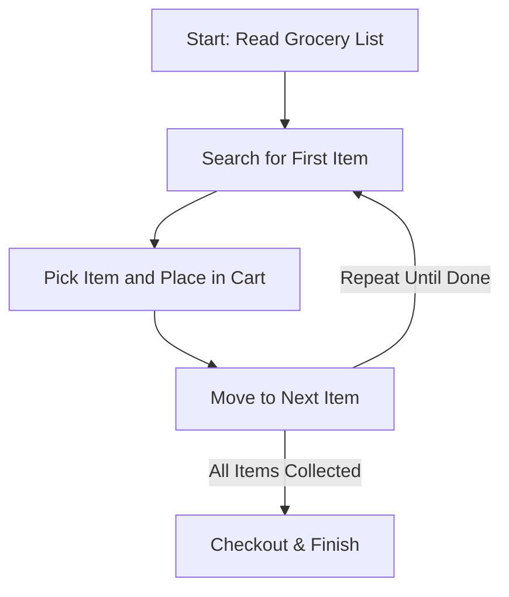
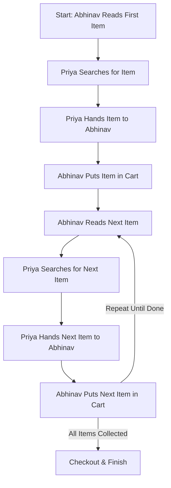
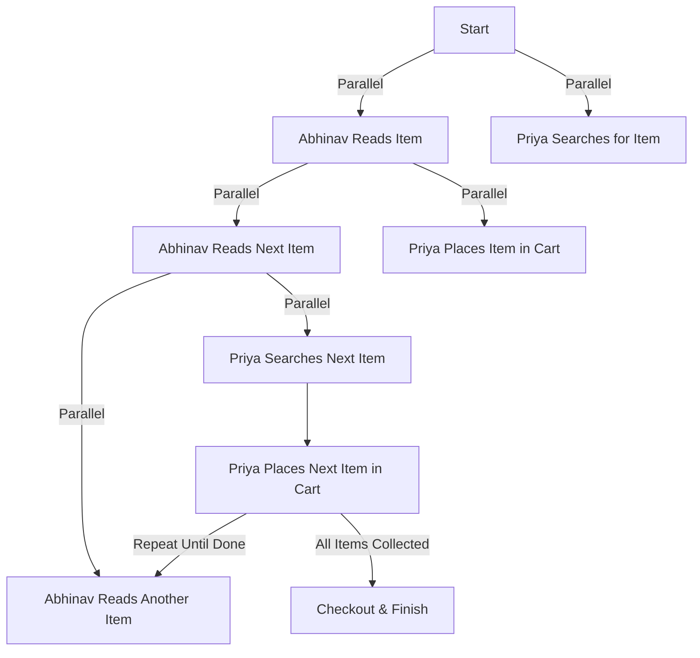

import Parallel_Programming from './Parallel_Progamming_Book.js';
import Tabs from '@theme/Tabs';
import TabItem from '@theme/TabItem';
import 'katex/dist/katex.min.css';
import { InlineMath, BlockMath } from 'react-katex';

---
## **📚 Recommended Books**  
<div>  
    <Parallel_Programming />  
 </div>  

---
# Getting Started
---
:::tip
>Tips
>Parallel programming improves efficiency by utilizing multiple computing units to perform tasks simultaneously. This concept can be better understood through a real-life analogy: grocery shopping.
---
:::
## Understanding Parallel Programming With Scenarios    
Imagine Abhinav and Priya go shopping. Their goal is to buy all the items on their list efficiently. Each scenario represents a different computing execution model.

<Tabs>

<TabItem value="single-core" label="Single-Core Execution">

### Single-Core, Single-Thread Execution (Basic CPU Execution)
Abhinav alone does all the work step by step, similar to how a basic CPU executes one instruction at a time.

**Steps:**
1. Reads the grocery list.
2. Searches for the first item in the store.
3. Picks the item and places it in the cart.
4. Moves to the next item on the list.
5. Repeats until all items are collected.

**Problem:** Only one instruction is executed at a time, making the process slow.

**Analogy in Computing:** A single-core CPU executes one task at a time, waiting for each step to complete before starting the next.



</TabItem>

<TabItem value="pipeline" label="Instruction Pipeline">

### Two-Core CPU, No True Parallelism (Instruction Pipeline)
Abhinav and Priya work together, but without real parallelism. One reads while the other searches.

**Steps:**
1. Abhinav reads an item from the list.
2. Priya searches for the item while Abhinav reads the next one.
3. Priya finds the item and hands it to Abhinav to put in the cart.
4. The process continues for all items.

**Problem:** Even with two people involved, there is no real parallelism. The second task (finding) must wait for the first task (reading).

**Analogy in Computing:** A dual-core CPU with instruction pipelining, where one stage fetches instructions while another executes them, but both depend on each other.



</TabItem>

<TabItem value="no-thread-parallelism" label="No Thread-Level Parallelism">

### No Thread-Level Parallelism (Task Dependency)
Abhinav and Priya work together, but each task must complete before the next can begin.

**Steps:**
1. Abhinav reads the list and gives an item name to Priya.
2. Priya searches for the item while Abhinav waits.
3. Once Priya finds it, she hands it to Abhinav, who puts it in the cart.
4. This process repeats, creating dependencies between tasks.

**Problem:** Despite two people working, they are not fully utilizing parallelism because each task depends on the completion of the previous one.

**Analogy in Computing:** A system where multi-core processors exist but are not efficiently utilized due to task dependencies, preventing thread-level parallelism.

</TabItem>

<TabItem value="true-parallel" label="True Parallelism">

### Two-Core CPU with True Parallelism
Abhinav and Priya now work independently, in true parallel execution.

**Steps:**
1. Abhinav reads the shopping list and moves to the next item.
2. Priya searches for the item and places it in the cart at the same time.
3. Both continue simultaneously, reducing total execution time.

**Advantage:** The total time taken is nearly halved because tasks run in parallel.

**Analogy in Computing:** A true dual-core CPU, where each core executes independent tasks simultaneously without waiting for the other.



</TabItem>

<TabItem value="gpu" label="GPU Parallelism">

### GPU Parallelism (Massive Multi-Core Execution)
A scenario where multiple workers in the store each take responsibility for one aisle.

**Steps:**
1. Each worker searches for their assigned items simultaneously.
2. Items are collected at the same time into multiple carts.
3. Checkout happens all at once.

**Advantage:** Execution time is drastically reduced because many operations happen in parallel.

**Analogy in Computing:** A GPU with thousands of cores, where many small tasks are executed at the same time.

</TabItem>

</Tabs>

## Key Takeaways

| Execution Model      | Example                     | Cores   | Parallelism | Best Use Case                              |
|----------------------|----------------------------|---------|-------------|--------------------------------------------|
| Single-Core         | Abhinav shopping alone     | 1       | No          | Simple, low-power tasks                   |
| Dual-Core (Pipeline) | Abhinav reads, Priya searches | 2       | Limited     | Faster execution, but not full parallelism |
| No Thread Parallelism | Task dependency limits speed | 2       | No          | Multi-core system without efficiency      |
| True Dual-Core      | Both work independently    | 2       | Yes         | Fast multitasking, independent execution  |
| GPU Execution      | Multiple workers in a store | 1000+   | High        | Highly parallelizable tasks like AI, graphics |

---
# Table of Contents

## **[1. Introduction to Parallel Programming](#1-introduction-to-parallel-programming)**  
- [1.1 What is a Core? (Explained with the Abhinav & Priya Shopping Analogy)](#what-is-core)  
- [1.2 Cores vs Threads *(TabItem: Cores | Threads)*](#12-cores-vs-threads)  
- [1.3 Does More Cores Always Mean More Parallelism?](#13-does-more-cores-always-mean-more-parallelism)  
- [1.4 More Threads or More Cores for Better Parallelism?](#14-more-threads-or-more-cores-for-better-parallelism)  
## **[2. Our First Serial Program (Matrix Multiplication)](#2-our-first-serial-program-matrix-multiplication)**  
- [2.1 How Does Matrix Multiplication Work?](#21-how-does-matrix-multiplication-work)  
- [2.2 Matrix Multiplication Code in Different Languages *(TabItem: C++ | Java | Python | Rust)*](#22-matrix-multiplication-code-in-different-languages)  
- [2.3 Performance Analysis (C++ Chosen for Benchmarking)](#23-performance-analysis-c-chosen-for-benchmarking)  

## **[3. How We Can Make It Parallel?](#3-how-we-can-make-it-parallel)**  
- [3.1 Understanding Dependencies in Parallel Computing *(RAW, WAR, RAR, WAW)*](#31-understanding-dependencies-in-parallel-computing-raw-war-rar-waw)  
- [3.2 Matrix Multiplication Dependencies Explained](#32-matrix-multiplication-dependencies-explained)  
- [3.3 How the CPU Executes Matrix Multiplication in Parallel](#33-how-the-cpu-executes-matrix-multiplication-in-parallel) 
- [3.4 Optimized Parallel Code](#34-matrix-multiplication-benchmark-parallel-vs-non-parallel-using-openmp)


## **[4. Common Questions & Challenges in Parallel Computing](#4-common-questions-challenges-in-parallel-computing)**  

## [5. References](#references-blog-links)

---


## What is Core
A **CPU core** is like an individual worker in a team, capable of executing tasks independently.\
The more cores a CPU has, the more tasks it can handle simultaneously.

A **core** is the fundamental processing unit of a CPU. Each core can execute its own set of instructions, allowing for multitasking and improved performance in multi-threaded applications. Modern CPUs have multiple cores to enhance speed and efficiency.

---


A **CPU core** is like an individual worker in a team, capable of executing tasks independently.\
The more cores a CPU has, the more tasks it can handle simultaneously.

A **core** is the fundamental processing unit of a CPU. Each core can execute its own set of instructions, allowing for multitasking and improved performance in multi-threaded applications. Modern CPUs have multiple cores to enhance speed and efficiency.

---

###  ***Understanding CPU Cores with a Shopping Analogy***

To understand how CPU cores work, let's consider a **real-life analogy** of **Abhinav and Priya** shopping for groceries.

---

### 🛒 How Different CPU Configurations Work?

<details>
<summary>🛒 Single-Core Execution (One Person Shopping)</summary>

- Imagine **Abhinav** is shopping alone.
- He reads the grocery list, finds an item, places it in the cart, and repeats this process until everything is collected.
- 🛑 **Problem:** Since Abhinav is doing everything **step by step**, the process is slow.

**💻 Computing Analogy:** A **single-core CPU** executes **one instruction at a time**. It must complete **one task before moving to the next**.

##### **📝 Step-by-Step Process**

1️⃣ Read first item from the list.\
2️⃣ Walk to the location, pick up the item.\
3️⃣ Read the next item, walk to its location, pick it up.\
🔄 Repeat until all items are collected.

</details>

---

<details>
<summary>🛍️ Two-Core CPU Without True Parallelism (Instruction Pipelining)</summary>

- Now, **Abhinav and Priya** shop together, but with a dependency.
- **Abhinav** reads the next item on the list while **Priya** searches for the previous one.
- Priya can only start **after** Abhinav reads the item, introducing a **slight delay**.

#### **📌 Instruction Pipelining Diagram**

```
🧑 Abhinav (Reads Items) ---> 🧑 Priya (Searches Items)
🧑 Reads item 1 → 🧑 Starts searching item 1
🧑 Reads item 2 → 🧑 Starts searching item 2
🧑 Reads item 3 → 🧑 Starts searching item 3
```

</details>

---

<details>
<summary>🔄 True Parallelism with Two Cores & Two Threads</summary>

- This time, **Abhinav and Priya** each have their **own list** and shop **independently**.
- They collect items at the **same time**, doubling the speed.
- ✅ **No dependency or delay**—both work efficiently in parallel.

#### **📌 True Parallelism Diagram**

```
🧑 Abhinav (Shops Independently) → Places Item 1
🧑 Priya (Shops Independently) → Places Item 2
🧑 Places Item 3 → 🧑 Places Item 4
```

### **🛒 How Do Both Place Items?**

When **both Abhinav and Priya** shop independently, they place items in the cart simultaneously. This mirrors how multi-core CPUs process instructions concurrently. Each core executes its own set of instructions without waiting for the other, maximizing efficiency and reducing completion time.

✅ **Example in Computing:**
- If **Abhinav** represents **Core 1** and **Priya** represents **Core 2**, then both cores work in parallel on different tasks.
- When Abhinav places an item, Priya can simultaneously place another item.
- This reduces the overall shopping time, just like a **multi-core CPU** improves processing speed by handling multiple tasks at once.

</details>

---

## **1.2 Cores vs Threads**

Understanding the difference between **CPU cores** and **threads** is essential in grasping how modern processors handle multiple tasks efficiently.

- A **CPU core** is a **physical processing unit** that independently executes instructions.
- A **thread** is a **logical unit** that allows a core to manage multiple tasks simultaneously, improving efficiency but not truly doubling performance.

To make this concept intuitive, let’s explore it using the **Abhinav & Priya Shopping Analogy**! 🛍️

---

### ***🧠 Cores vs Threads  ***

#### **🛒 Scenario 1: Two Independent Shoppers (Cores)**

<details>
<summary>🧑💻 **Cores: Two Shoppers with Separate Lists**</summary>

- Imagine **Abhinav and Priya** enter a shopping mall, each with their **own shopping list**.
- They split up and **shop independently**, each picking items for their respective lists **at the same time**.
- Since they don’t interfere with each other, they finish shopping **twice as fast**.

**💻 Computing Analogy:**
- Each **CPU core** in a multi-core processor functions like an **independent shopper**, capable of executing its own set of instructions simultaneously.
- More cores mean **true parallel execution**, leading to better performance for multi-threaded tasks.

✅ **True parallelism: Faster, independent execution!**

</details>

---

### **🔄 Scenario 2: A Single Shopper with a Helper (Threads)**

<details>
<summary>🔄 **Threads: One Shopper with an Assistant**</summary>

- Now, imagine **Abhinav goes shopping alone**, but he brings along his brother **Aditya** to help.
- They have only **one shopping cart**. While Aditya can assist by looking at the list and suggesting what’s next, only **one person can pick items at a time**.
- This **speeds up the process** compared to a single shopper, but it's **not as fast as two independent shoppers**.

**💻 Computing Analogy:**
- A **thread** is like a helper within a **single core**. It improves multitasking (e.g., hyper-threading), but still **shares the same physical resources**.
- Threads allow the CPU to work more efficiently but don’t double the speed like multiple cores do.

✅ **More efficient than a single worker, but still resource-limited!**

</details>

---

## **📊 Cores vs Threads: Key Differences**

| Feature           | Cores 🧑💻 (Independent Shoppers) | Threads 🔄 (Helper System) |
|------------------|---------------------------------|---------------------------|
| **Definition**   | Physical CPU unit | Virtual processing unit within a core |
| **Execution**    | True parallel execution | Time-sliced execution (shared resources) |
| **Performance**  | Higher performance, truly independent | Improves multitasking but doesn't double speed |
| **Efficiency**   | More cores = faster execution | More threads = better resource utilization |
| **Example**      | Two people shopping separately | One person shopping with a helper |

---

## **🎯 Summary: Which Matters More?**

- More **cores** = Better performance for multi-threaded applications (e.g., gaming, video editing, rendering, AI workloads).
- More **threads** = Better multitasking, but performance gains depend on software optimization (e.g., hyper-threading in Intel CPUs).
- **For most users**, a balance of **high-core-count and multi-threading** provides the best experience!

📌 **Next time you buy a CPU, check both the number of cores and whether it supports multi-threading!** 🚀

---

## **1.3 Does More Cores Always Mean More Parallelism?**

### **💡 The Myth of More Cores = More Speed**

It’s a common belief that adding more cores to a CPU automatically results in better parallelism and faster performance. While this is **partially true**, the reality is more nuanced.

#### **🔍 Understanding the Limits of Parallelism**

- **Not All Workloads Are Parallelizable:** Some tasks can’t be split across multiple cores effectively. For example, a single-threaded application won’t benefit from multiple cores.
- **Diminishing Returns:** Adding more cores can improve performance **only up to a certain point**. If a program isn’t optimized for multi-threading, extra cores remain underutilized.
- **Synchronization Overhead:** More cores require better coordination. If tasks need to share data frequently, the overhead of synchronization can reduce efficiency.
- **Memory and Bandwidth Constraints:** More cores mean higher demand for memory access. If the memory bandwidth doesn’t scale accordingly, cores may sit idle waiting for data.

#### ***📊 When More Cores Help (and When They Don’t)***

| Scenario                          | More Cores Help? | Why? |
|------------------------------------|----------------|------|
| **Multi-threaded applications**   | ✅ Yes        | Tasks can be split across cores. |
| **Single-threaded programs**      | ❌ No         | They run on only one core. |
| **Gaming**                        | ⚠️ Sometimes  | Depends on game optimization. |
| **Video rendering & AI workloads** | ✅ Yes        | Highly parallelizable tasks. |
| **General web browsing**          | ❌ No         | Not CPU-intensive. |

#### **🚀 Key TakeAway: More Cores ≠ Always Faster**

- More cores **can** improve performance, but only when software is designed to utilize them efficiently.
- A **balance** between core count, clock speed, and software optimization is crucial for real-world performance gains.

:::tip
**Next time you choose a CPU, consider your workload instead of just the core count!** 
:::
---

## **1.4 More Threads or More Cores for Better Parallelism?**

### **🧩 The Core vs. Thread Dilemma**

When it comes to boosting parallelism, both **cores** and **threads** play vital roles—but they work differently.

- **Cores** are the **physical** units of computation.
- **Threads** are **logical** or **virtual** divisions of those cores.

So which one gives better performance for parallel tasks? Let's break it down.

---

## **🔬 Threads: Lighter but Limited**

- Threads are designed to improve utilization of a core by allowing it to work on multiple tasks via **time-slicing**.
- Technologies like **Intel Hyper-Threading** and **SMT (Simultaneous Multi-Threading)** allow one core to manage more than one thread.
- But remember: **threads share the same core resources** (cache, execution units), so performance gains are **not linear**.

🧠 **Best for:** Light-weight, high-concurrency tasks like I/O handling, web servers, or UI responsiveness.

---

## **💪 Cores: Heavier but True Parallelism**

- Cores can handle separate instructions **truly in parallel**.
- More cores mean you can run more threads **independently**, without them fighting for shared resources.

🧠 **Best for:** Heavy, compute-bound workloads like rendering, simulations, compilation, and gaming (if optimized).

---

## **⚖️ The Balanced Perspective**

| Feature         | More Cores 💻 | More Threads 🔁 |
|----------------|----------------|------------------|
| Type            | Physical       | Logical          |
| Resource Sharing | No             | Yes              |
| Speed Boost     | ✅ Higher       | ⚠️ Moderate      |
| Best Use Case   | CPU-intensive  | I/O-intensive     |

---

## **🚀 Verdict: Use Both—But Know Your Workload**

- More **cores** give you **raw parallel power**.
- More **threads** let you **keep your cores busy** and improve responsiveness.
- The best performance comes from a **balanced architecture** paired with software that knows how to use it.
:::tip
🎯 **Know your task. Choose wisely. Optimize accordingly.**
:::
---

## 2. Our First Serial Program (Matrix Multiplication)

### 2.1 How Does Matrix Multiplication Work?

Matrix multiplication is the process of taking two matrices, **A** and **B**, and producing a third matrix **C**, where each element `C[i][j]` is computed as the dot product of the `i`-th row of **A** and the `j`-th column of **B**.

#### Formula:


<blockquote>
  Let A be an m × n matrix and B be an n × p matrix. Then C = A × B is:
</blockquote>

<BlockMath math="C[i][j] = \sum_{k=0}^{n-1} A[i][k] \times B[k][j]" />


- **Matrix A**: dimensions *m × n*  
- **Matrix B**: dimensions *n × p*  
- **Result Matrix C**: dimensions *m × p*

---

### 2.2 Matrix Multiplication Code in Different Languages

<Tabs>

<TabItem value="cpp" label="C++">

```cpp
#include <iostream>
#include <vector>
using namespace std;

int main() {
    int m = 2, n = 2, p = 2;
    vector<vector<int>> A = {{1, 2}, {3, 4}};
    vector<vector<int>> B = {{5, 6}, {7, 8}};
    vector<vector<int>> C(m, vector<int>(p, 0));

    for (int i = 0; i < m; ++i)
        for (int j = 0; j < p; ++j)
            for (int k = 0; k < n; ++k)
                C[i][j] += A[i][k] * B[k][j];

    for (auto row : C) {
        for (auto val : row) cout << val << " ";
        cout << endl;
    }
    return 0;
}
```

</TabItem>

<TabItem value="java" label="Java">

```java
public class MatrixMultiplication {
    public static void main(String[] args) {
        int[][] A = {{1, 2}, {3, 4}};
        int[][] B = {{5, 6}, {7, 8}};
        int[][] C = new int[2][2];

        for (int i = 0; i < 2; i++)
            for (int j = 0; j < 2; j++)
                for (int k = 0; k < 2; k++)
                    C[i][j] += A[i][k] * B[k][j];

        for (int[] row : C) {
            for (int val : row)
                System.out.print(val + " ");
            System.out.println();
        }
    }
}
```

</TabItem>

<TabItem value="python" label="Python">

```python
A = [[1, 2], [3, 4]]
B = [[5, 6], [7, 8]]

C = [[0 for _ in range(2)] for _ in range(2)]

for i in range(2):
    for j in range(2):
        for k in range(2):
            C[i][j] += A[i][k] * B[k][j]

for row in C:
    print(" ".join(map(str, row)))
```

</TabItem>

<TabItem value="rust" label="Rust">

```rust
fn main() {
    let a = [[1, 2], [3, 4]];
    let b = [[5, 6], [7, 8]];
    let mut c = [[0; 2]; 2];

    for i in 0..2 {
        for j in 0..2 {
            for k in 0..2 {
                c[i][j] += a[i][k] * b[k][j];
            }
        }
    }

    for row in &c {
        for val in row {
            print!("{} ", val);
        }
        println!();
    }
}
```

</TabItem>

</Tabs>

---

### 2.3 Performance Analysis (C++ Chosen for Benchmarking)

To benchmark matrix multiplication in **C++**, we avoid using `chrono` and instead demonstrate platform-specific timing tools.

<Tabs>

<TabItem value="wsl" label="WSL (Linux)">

Use the `time` command on Linux or WSL:

```sh
clang++ matrix.cpp -o matrix
/usr/bin/time -f "%e seconds" ./matrix
```

This will show real execution time in seconds.

</TabItem>

<TabItem value="mac" label="macOS">

Use the built-in `time` utility:

```sh
clang++ matrix.cpp -o matrix
time ./matrix
```
</TabItem>

</Tabs>

This reports real, user, and sys time.

:::note
This experiment is done on mac os
:::
**Example Output:**

```sh
time ./a.out
19 22
43 50
./a.out  0.00s user 0.00s system 1% cpu 0.353 total
```

**Explanation:**
- `19 22` and `43 50`: This is the output of your matrix multiplication program (i.e., the result matrix).
- `0.00s user`: The amount of time the CPU spent in user mode (your program's code).
- `0.00s system`: Time spent by the system (kernel) on behalf of your program.
- `1% cpu`: Percentage of CPU used during the total time.
- `0.353 total`: The real (wall-clock) time it took to run the program from start to finish.

:::tip
🧠 **Insight:**  
For large-scale matrix operations, use high-performance libraries such as:
- **C++**: [Eigen](https://eigen.tuxfamily.org), **OpenBLAS**
- **Python**: [NumPy](https://numpy.org), [SciPy](https://scipy.org)
:::

---
## How can we Make it Parallel
## 3.1 Understanding Dependencies in Parallel Computing *(RAW, WAR, RAR, WAW)*

When parallelizing code, it's essential to understand and manage **data dependencies** to maintain correctness and avoid race conditions. The four fundamental types of dependencies are:
When parallelizing code, it's essential to understand and manage **data dependencies** to maintain correctness and avoid race conditions. These dependencies define how data is used and shared between different operations or threads, and failing to handle them properly can lead to incorrect results or difficult-to-debug behavior.

<details>
<summary>The Four Types of Data Dependencies </summary>
#### The Four Types of Data Dependencies and Why They Matter:

1. **True Dependency (Read After Write - RAW)**  
   Occurs when a statement depends on the result of a previous statement.  
   **Why it matters:** If the dependent instruction is executed before the data is written, it may read an incorrect or stale value.

2. **Anti-Dependency (Write After Read - WAR)**  
   Happens when a statement writes to a location that a previous statement is reading from.  
   **Why it matters:** If the write happens before the read completes, it may overwrite the data too soon.

3. **Output Dependency (Write After Write - WAW)**  
   Arises when two statements write to the same location.  
   **Why it matters:** The final result can be unpredictable if the order of writes changes.

4. **Input Dependency (Read After Read - RAR)**  
   Occurs when two statements read from the same location.  
   **Why it matters:** This is generally safe, but understanding it helps optimize memory access patterns for performance.

These dependencies determine the **scheduling and synchronization** required to safely parallelize sections of code.
</details>
<Tabs>
<TabItem value="RAW (Read After Write)" label="RAW (Read After Write)">

### **RAW (Read After Write) – *True Dependency***

Occurs when an instruction needs to read a value that must be written by a previous instruction.

**Example in Matrix Multiplication:**
```cpp
C[i][j] = A[i][k] * B[k][j];  // Write to C[i][j]
sum = C[i][j] + temp;         // Read from C[i][j]
```
Here, `sum` depends on the value written to `C[i][j]` earlier. This must be preserved when parallelizing.

</TabItem>

<TabItem value="WAR (Write After Read)" label="WAR (Write After Read)">

### **WAR (Write After Read) – *Anti-Dependency***

Occurs when an instruction needs to write to a location that must be read by a previous instruction.

**Example in Matrix Multiplication:**
```cpp
temp = C[i][j];               // Read from C[i][j]
C[i][j] = A[i][k] * B[k][j];  // Write to C[i][j]
```
Here, the read of `C[i][j]` must occur before it is overwritten, or the result will be incorrect.

</TabItem>

<TabItem value="RAR (Read After Read)" label="RAR (Read After Read)">

### **RAR (Read After Read) – *No Dependency***

Occurs when multiple instructions read from the same location. This is safe to parallelize.

**Example in Matrix Multiplication:**
```cpp
x = C[i][j];
y = C[i][j];
```
Both instructions read the same data, but do not interfere with each other.

</TabItem>

<TabItem value="WAW (Write After Write)" label="WAW (Write After Write)">

### **WAW (Write After Write) – *Output Dependency***

Occurs when multiple instructions write to the same location. The final value must reflect the correct ordering.

**Example in Matrix Multiplication:**
```cpp
C[i][j] = A[i][k1] * B[k1][j];
C[i][j] = A[i][k2] * B[k2][j];
```
If both writes are performed in parallel without control, the final value of `C[i][j]` will be non-deterministic.

</TabItem>
</Tabs>

:::note
***Understanding and handling these dependencies is crucial for writing correct and efficient parallel programs***
:::


---

### 3.2 Matrix Multiplication Dependencies Explained

In matrix multiplication, we are given:

- Matrix **A** of size `M x K`
- Matrix **B** of size `K x N`
- Result matrix **C** of size `M x N`

Each element in the result matrix `C[i][j]` is computed as:

```
C[i][j] = A[i][0] * B[0][j] + A[i][1] * B[1][j] + ... + A[i][K-1] * B[K-1][j]
```

Or more generally:

```
C[i][j] = ∑ (A[i][k] * B[k][j]) for k = 0 to K-1
```

---

#### 🔍 Dependency Analysis

To compute `C[i][j]`, we need:
- The **`i`-th row** of matrix A: `A[i][0] ... A[i][K-1]`
- The **`j`-th column** of matrix B: `B[0][j] ... B[K-1][j]`

Therefore:
- **`C[i][j]` is only dependent on one row from A and one column from B.**
- It does **not** depend on any other element of the result matrix C.

---

#### ✅ Independence of Computations

Because each `C[i][j]` uses only:
- A specific row from A
- A specific column from B

And **no other element of C is involved**, this means:

- There are **no read-write conflicts** between different elements of C
- Each computation of `C[i][j]` is **independent** of others

This independence allows us to compute all `C[i][j]` values **in parallel**.

---
<details>
<summary>Before Parallelism</summary>
:::note
### 📝  Before Parallelism

Before assuming parallelism is ideal, always:
- Verify that the environment supports efficient parallel operations (e.g., hardware capabilities)
- Check if memory bandwidth and synchronization overhead are within acceptable limits
- Ensure that there are no side effects (e.g., shared memory writes) that break independence

Only after confirming the above conditions, matrix multiplication becomes an ideal candidate for parallel execution.

:::caution
🔁 ***Always analyze the dependencies*** in your code ``before making it parallel``. Incorrect assumptions can lead to ``race conditions``, incorrect results, or ``degraded performance``.

Only after ``confirming the above conditions``, matrix multiplication becomes an ideal candidate for parallel execution.
:::

</details>
---

:::tip
####  Ideal for Parallelization

Since all computations are independent:
- Multiple threads (in CPU) or cores (in GPU) can compute different elements of C simultaneously
- No need to wait for other values to be computed
- **Massive performance boost** using parallel programming

This is why matrix multiplication is often used as a classic example of **parallel-friendly algorithms** in high-performance computing (HPC), GPU computing, and multi-threaded CPU programming.
:::

---
### 3.3 How the CPU Executes Matrix Multiplication in Parallel

Modern CPUs execute tasks in parallel using several hardware and architectural features that significantly boost performance for data-heavy operations like matrix multiplication:

- **Multiple Cores**: Modern processors come with several cores, each capable of executing instructions independently. By dividing a matrix multiplication task among different cores, we can compute multiple portions of the result matrix concurrently.
  
- **Vectorization (SIMD - Single Instruction, Multiple Data)**: SIMD instructions allow one instruction to perform the same operation on multiple pieces of data. For example, SIMD can multiply multiple elements from a row of matrix A and a column of matrix B simultaneously, reducing the total number of instructions.

- **Pipelining**: CPUs execute instructions in stages (fetch, decode, execute, etc.), and pipelining allows different instructions to be at different stages simultaneously. This overlapping reduces idle time and increases throughput.

#### Example Strategy for Parallel Matrix Multiplication:

- **Thread-Level Parallelism**: Assign each thread the task of computing a specific cell `C[i][j]` in the result matrix.
- **SIMD-Level Parallelism**: Use SIMD registers to compute multiple partial products (e.g., 4 or 8 floating point operations) in a single instruction.
- **Cache Optimization**: Improve data locality to maximize usage of the CPU’s L1/L2 cache, reducing memory access time.

---

### Understanding Data Dependencies in Parallel Execution

When writing parallel code, understanding **data dependencies** is critical. These define how instructions relate to each other in terms of the data they read from and write to. Dependencies affect the order in which operations can safely execute, and ignoring them can lead to incorrect results or race conditions.

#### The Four Types of Data Dependencies and Why They Matter

1. **True Dependency (Read After Write - RAW)**  
   - **Definition**: Instruction B depends on the result of instruction A.  
     Example:  
     ```cpp
     a = b + c;  // A  
     d = a * e;  // B (depends on result of A)
     ```
   - **Why it matters**: If B executes before A, it uses the wrong or uninitialized value of `a`, leading to incorrect results.

2. **Anti-Dependency (Write After Read - WAR)**  
   - **Definition**: Instruction B writes to a variable that instruction A reads from.  
     Example:  
     ```cpp
     d = a + b;  // A  
     a = e * f;  // B (writes to 'a' after it's read in A)
     ```
   - **Why it matters**: If B executes before A, the original value of `a` may be overwritten before it's used, again resulting in incorrect behavior.

3. **Output Dependency (Write After Write - WAW)**  
   - **Definition**: Both instructions write to the same variable.  
     Example:  
     ```cpp
     a = b + c;  // A  
     a = e - f;  // B
     ```
   - **Why it matters**: The final value of `a` depends on which instruction completes last. Reordering these without synchronization can produce nondeterministic results.

4. **Input Dependency (Read After Read - RAR)**  
   - **Definition**: Both instructions read the same variable.  
     Example:  
     ```cpp
     d = a + b;  // A  
     e = a * f;  // B
     ```
   - **Why it matters**: RAR dependencies generally do not cause correctness issues. However, they can affect cache behavior and performance, especially in systems with non-uniform memory access (NUMA) or weak memory models.

---

Understanding and handling these dependencies helps:
- Avoid **race conditions** and **data corruption**.
- Guide safe instruction reordering.
- Optimize **synchronization** between threads or vector operations.
- Improve **performance** while maintaining **correctness** in parallelized code.

---

## 3.4 Matrix Multiplication Benchmark (Parallel vs Non-Parallel using OpenMP)

This benchmark compares the performance of **non-parallel** and **OpenMP-parallelized** matrix multiplication using `std::chrono` for precise timing.

---

<Tabs>
<TabItem value="Key Features">
## ✅ Key Features

- Matrix size: **1000 x 1000**
- Uses **OpenMP** to parallelize the multiplication.
- Uses **`std::chrono`** for accurate time measurement in milliseconds.
- Manually sets OpenMP threads using `omp_set_num_threads(4);`
- Compares results for correctness.
</TabItem>

<TabItem value="Code Explanation">
## 🧠 Code Explanation

### 1. **Includes and Setup**
```cpp
#include <iostream>
#include <vector>
#include <chrono>
#include <omp.h>
```
- `iostream`, `vector`: Standard C++ headers.
- `chrono`: For high-resolution timing.
- `omp.h`: OpenMP for multithreading.

---

### 2. **Matrix Dimension Constants**
```cpp
const int m = 1000, n = 1000, p = 1000;
```
Defines the matrix sizes:  
- A: `m x n`  
- B: `n x p`  
- C: `m x p` (result)

### 3. **Matrix Initialization**
```cpp
void fill_matrix(std::vector<std::vector<int>> &mat)
```
Fills the matrix with values using a simple formula `(i + j) % 100`.

---

### 4. **Non-Parallel Matrix Multiplication**
```cpp
void multiply_non_parallel(...)
```
Standard triple-loop implementation of matrix multiplication without multithreading.

---

### 5. **Parallel Matrix Multiplication**
```cpp
void multiply_parallel(...)
```
Uses OpenMP directive `#pragma omp parallel for collapse(2)` to parallelize the outer two loops.

```cpp
omp_set_num_threads(4);
```
Manually sets the number of threads to 4.

---

### 6. **Timing & Comparison**
```cpp
auto start = high_resolution_clock::now();
// multiply
auto end = high_resolution_clock::now();
auto duration = duration_cast<milliseconds>(end - start);
```
Measures and prints time taken in milliseconds.

---

### 7. **Validation**
```cpp
bool same = true;
for (...) {
    if (C1[i][j] != C2[i][j]) same = false;
}
```
Checks if the output matrices from both methods are identical.
</TabItem>

<TabItem value="💻 Full Code">
## 💻 Full Code

```cpp
#include <iostream>
#include <vector>
#include <chrono>
#include <omp.h>

using namespace std;
using namespace std::chrono;

const int m = 1000, n = 1000, p = 1000;

void fill_matrix(vector<vector<int>> &mat) {
    for (int i = 0; i < mat.size(); ++i)
        for (int j = 0; j < mat[0].size(); ++j)
            mat[i][j] = (i + j) % 100;
}

void multiply_non_parallel(const vector<vector<int>> &A, const vector<vector<int>> &B, vector<vector<int>> &C) {
    for (int i = 0; i < m; ++i)
        for (int j = 0; j < p; ++j)
            for (int k = 0; k < n; ++k)
                C[i][j] += A[i][k] * B[k][j];
}

void multiply_parallel(const vector<vector<int>> &A, const vector<vector<int>> &B, vector<vector<int>> &C) {
    omp_set_num_threads(4);
    #pragma omp parallel for collapse(2)
    for (int i = 0; i < m; ++i)
        for (int j = 0; j < p; ++j)
            for (int k = 0; k < n; ++k)
                C[i][j] += A[i][k] * B[k][j];
}

int main() {
    vector<vector<int>> A(m, vector<int>(n));
    vector<vector<int>> B(n, vector<int>(p));
    vector<vector<int>> C1(m, vector<int>(p, 0));
    vector<vector<int>> C2(m, vector<int>(p, 0));

    fill_matrix(A);
    fill_matrix(B);

    auto start = high_resolution_clock::now();
    multiply_non_parallel(A, B, C1);
    auto end = high_resolution_clock::now();
    auto duration_non_parallel = duration_cast<milliseconds>(end - start).count();

    start = high_resolution_clock::now();
    multiply_parallel(A, B, C2);
    end = high_resolution_clock::now();
    auto duration_parallel = duration_cast<milliseconds>(end - start).count();

    bool same = true;
    for (int i = 0; i < m && same; ++i)
        for (int j = 0; j < p; ++j)
            if (C1[i][j] != C2[i][j]) {
                same = false;
                break;
            }

    cout << "Non-parallel time: " << duration_non_parallel << " ms" << endl;
    cout << "Parallel time:     " << duration_parallel << " ms" << endl;
    cout << "Results match:     " << (same ? "Yes ✅" : "No ❌") << endl;
    return 0;
}
```
</TabItem>

<TabItem value="Compile & Run">
## 📆 Compile & Run

```bash
sudo apt-get install clang++ //note test is done on mac os
clang++ -fopenmp -O2 -std=c++11 matrix_benchmark.cpp -o matrix_benchmark
./matrix_benchmark
```
> **Note**  
> If you are facing any issue [mailto:info@compilersutra.com](mailto:info@compilersutra.com)

</TabItem>

<TabItem value="Output Result">
## 🔮 Output Result

```
Non-parallel time: 1014 ms
Parallel time:     357 ms
Results match: Yes ✅
```
</TabItem>

<TabItem value="Interpretation">
## 🧠 Interpretation

- The **parallel execution is ~3x faster**, demonstrating the benefits of multithreading on CPU-bound workloads.
- **OpenMP** distributes loop iterations across **4 threads**, utilizing multiple cores efficiently.
- The matrix size (**1000 x 1000**) is sufficiently large, allowing each thread to perform enough work to **offset the overhead** of thread creation and synchronization.
- For smaller matrix sizes or fewer operations per thread, the **parallel version may be slower or provide minimal speedup** due to overheads.
- The **correctness check confirms** that the parallel and non-parallel implementations produce identical results.
</TabItem>

<TabItem value="Tips">
## 🔧 Tips

- You can try with `omp_set_num_threads(2);`, `8`, `16`, etc.
- For smaller matrix sizes, parallelism may **not help** due to thread overhead.
- Experiment with `collapse(3)` or `schedule(dynamic)` if needed for uneven work.
- Make sure your CPU supports enough hardware threads to benefit.
</TabItem>

<TabItem value="Next Steps">
## 🚀 Next Steps

- Export time results to CSV for plotting.
- Try with `float` or `double` instead of `int`.
- Test on different CPU architectures.
- Benchmark on systems with different core/thread counts.
- Compare performance using `schedule(static)` vs `schedule(dynamic)` in OpenMP.
</TabItem>
</Tabs>

---

## 4. Common Questions & Challenges in Parallel Computing

<details>
<summary>4.1 Limitations of Parallel Computing</summary>

::::note
**Parallelism is powerful but not limitless. Understanding its constraints is key.**
::::

**Common limitations:**
- **Diminishing returns**: Adding more cores doesn't always lead to proportional speedup.
- **Scalability**: Algorithms may not scale well with increasing number of threads.
- **Overheads**: Thread creation, synchronization, and context switching.
- **Data races and deadlocks**: Increased complexity in debugging and correctness.
- **Memory bottlenecks**: Shared resources can become points of contention.

> ⚠️ Effective parallel computing requires balancing task decomposition, hardware utilization, and code maintainability.

</details>

<details>
<summary>4.2 What Are the Main Challenges in Parallel Computing?</summary>

::::warning
**Challenge Accepted – but with trade-offs.**
::::

**Key challenges:**
- **Task decomposition**: Breaking a problem into independent units of work is not always straightforward.
- **Load balancing**: Ensuring all processors get equal work can be difficult, especially in dynamic or irregular workloads.
- **Communication overhead**: Data sharing and synchronization can introduce latency.
- **Debugging complexity**: Parallel programs are more prone to concurrency bugs.
- **Hardware heterogeneity**: Adapting code to different architectures (e.g., CPUs, GPUs) increases complexity.

</details>

<details>
<summary>4.3 Does Everything Need to be Parallelized?</summary>

::::tip
**Short Answer:** No. Not every task benefits from parallelism.
::::

**Explanation:**
- Parallelization introduces **complexity** and **overhead**.
- **Amdahl’s Law** limits the potential speedup if a portion of the code remains serial.
- Some problems are **inherently sequential** (e.g., recursive dependencies, I/O operations).
- Poorly parallelized code can lead to **lower performance** than a well-optimized serial version.

</details>

<details>
<summary>4.4 When Should We Avoid Parallelism?</summary>

::::warning
**Avoid parallelism when it introduces more problems than it solves.**
::::

**Cases to avoid parallelism:**
- **Small-scale tasks**: Overhead can outweigh the benefits.
- **Highly dependent tasks**: Frequent communication or synchronization can create bottlenecks.
- **Limited hardware**: No significant gain on single-core or lightly threaded systems.
- **Real-time systems**: Deterministic behavior is often more important than speed.

</details>

<details>
<summary>4.5 What Are Common Questions in Parallel Computing?</summary>

**Q1: Can I convert any serial code into parallel code?**  
*A1: Not always. Some code depends heavily on sequential logic and doesn’t benefit from parallelization.*

**Q2: Is multi-threading the same as parallelism?**  
*A2: Not exactly. Multi-threading is one form of parallelism, but parallelism can also occur across multiple processors or machines.*

**Q3: Will parallelism always make my program faster?**  
*A3: No. Due to overheads and limited scalability, it may not lead to speedup and can even slow things down.*

**Q4: Do I need special hardware for parallel computing?**  
*A4: Depends on the task. Many consumer CPUs support parallelism, but for GPU-based or large-scale parallelism, specialized hardware may help.*

</details>

---
## References (Blog Links)

### 1. Introduction to Parallel Programming
- [History of Parallel Programming](https://www.compilersutra.com/docs/parallel-programming-evolution)
- [What is a CPU Core? – SuperMicro](https://www.supermicro.com/en/glossary/core)
- [Threads vs Cores](https://www.namehero.com/blog/cpu-cores-vs-threads-everything-you-need-to-know/)
- [Does More Cores Always Mean Better Performance? – TechSpot](https://www.techspot.com/article/1784-how-many-cpu-cores-do-you-need/)
- [Parallel Programming Basics – NVIDIA Blog](https://developer.nvidia.com/blog/even-easier-introduction-cuda/)

### 2. Our First Serial Program (Matrix Multiplication)
- [Matrix Multiplication in C++ – Programiz](https://www.programiz.com/cpp-programming/examples/matrix-multiplication)
- [Matrix Multiplication in Python – GeeksforGeeks](https://www.geeksforgeeks.org/python-program-to-multiply-two-matrices/)
- [Matrix Multiplication Performance Analysis – Stack Overflow Discussion](https://stackoverflow.com/questions/54978127/why-is-matrix-multiplication-so-slow-in-python)

### 3. How We Can Make It Parallel?
- [Understanding Data Dependencies in Parallel Code – Intel Developer Blog](https://cvw.cac.cornell.edu/parallel/data-communication/parallelism-dependency)
- [Matrix Multiplication with OpenMP – LLNL Tutorials](https://hpc-tutorials.llnl.gov/openmp/)
- [Optimizing Matrix Multiplication – NVIDIA Developer Blog](https://developer.nvidia.com/blog/how-optimize-data-transfers-cuda-cc/)
