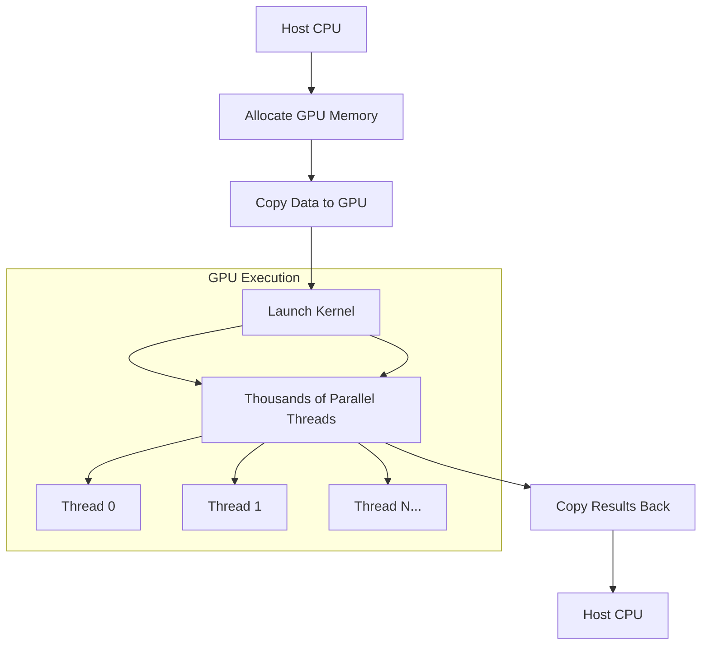

import AdBanner from '@site/src/components/AdBanner';
import Tabs from '@theme/Tabs';
import TabItem from '@theme/TabItem';
import { ComicQA } from '../../mcq/interview_question/Question_comics' ;

# Getting Started with GPU Programming: Complete Setup Guide

<div class="text--center">
  <i>Unlock the massive parallel computation power of GPUs for AI, scientific computing, and high-performance applications</i>
</div>

## Overview

GPUs have evolved far beyond their original role as **graphics rendering engines**. Modern GPUs are **general-purpose parallel processors** capable of accelerating highly demanding computational workloads, including scientific simulations, deep learning, real-time data analytics, financial modeling, and high-performance computing (HPC).  

Understanding GPU programming is no longer optional for developers interested in performance-critical applications. With the advent of frameworks like **[CUDA](https://developer.nvidia.com/cuda-toolkit)** for NVIDIA and **[ROCm/OpenCL](https://rocmdocs.amd.com/en/latest/)** for AMD, developers can harness the massive parallelism of GPUs to execute thousands of operations simultaneously, achieving speed-ups that are impossible on traditional CPUs.

This guide is designed to take developers **from zero to running their first GPU-accelerated program**, covering both **[NVIDIA](https://www.nvidia.com/Download/index.aspx) and [AMD](https://www.amd.com/en/support)** ecosystems. 

:::tip You will learn:
- How to **detect and verify GPU hardware** on your system.
- Installation of **GPU drivers** and runtime toolkits.
- Essential **Linux commands and tools** for GPU development.
- How to **compile and run GPU programs**.
- Writing your **first GPU kernel** and understanding basic parallel execution.
- Best practices, tips, and troubleshooting strategies to ensure a smooth development workflow.
:::

:::important By the end of this guide,
 you will have a fully functional **GPU development environment**, the knowledge to write simple GPU-accelerated programs, and the foundation to explore more complex parallel computing projects.

:::

For more in-depth reference:  
- [CUDA Documentation](https://docs.nvidia.com/cuda/)  
- [OpenCL Specification](https://www.khronos.org/opencl/)  
- [ROCm Documentation](https://rocmdocs.amd.com/en/latest/)

<div>
  <AdBanner />
</div>

---

## Table of Contents

1. [Prerequisites](#prerequisites)
2. [Essential Linux Tools for GPU Developers](#essential-linux-tools-for-gpu-developers)
3. [GPU Hardware Detection](#gpu-hardware-detection)
4. [Driver Installation](#driver-installation)
5. [Programming Environment Setup](#programming-environment-setup)
6. [Verification and Testing](#verification-and-testing)
7. [Your First GPU Program](#your-first-gpu-program)
8. [Understanding GPU Kernels](#understanding-gpu-kernels)
9. [Troubleshooting Common Issues](#troubleshooting-common-issues)
10. [Next Steps](#next-steps)
11. [FAQ](#faq)

---

## Prerequisites

Before beginning, ensure you have:

- A system with a **discrete GPU** (NVIDIA or AMD)
- **Linux distribution** (Ubuntu 20.04+ recommended)
- **sudo privileges** for package installation
- Basic familiarity with **command line operations**
- **GCC** and essential build tools

```rust
# Install basic development tools
sudo apt update && sudo apt upgrade -y
sudo apt install -y build-essential git wget curl cmake ninja-build pkg-config
sudo apt install -y python3 python3-pip python3-venv
sudo apt install -y unzip tar

```

---

## Essential Linux Tools for GPU Developers

<Tabs>
  {/* Generic Linux GPU & System Tools */}
  <TabItem value="generic" label="Generic">
    <ul>
      <li>
        <strong>Command:</strong> `lspci | grep -E "(VGA|3D)"`<br />
        <strong>Tool:</strong> lspci<br />
        <strong>Purpose:</strong> Lists all PCI devices<br />
        <strong>Usage:</strong> Filter graphics devices (VGA/3D)<br />
        <strong>When to use:</strong> Check which GPUs are physically present
      </li>
      <li>
        <strong>Command:</strong> `lsmod | grep -E "(nvidia|amdgpu)"`<br />
        <strong>Tool:</strong> lsmod<br />
        <strong>Purpose:</strong> Lists loaded kernel modules<br />
        <strong>Usage:</strong> Filter GPU drivers (NVIDIA/AMD)<br />
        <strong>When to use:</strong> Verify drivers are loaded correctly
      </li>
      <li>
        <strong>Command:</strong> `htop`<br />
        <strong>Tool:</strong> htop<br />
        <strong>Purpose:</strong> Interactive process viewer and system monitor<br />
        <strong>Usage:</strong> Monitor CPU, memory, swap, processes<br />
        <strong>When to use:</strong> Monitor system load during GPU workloads
      </li>
      <li>
        <strong>Command:</strong> `dmesg | tail -50`<br />
        <strong>Tool:</strong> dmesg<br />
        <strong>Purpose:</strong> Displays kernel messages<br />
        <strong>Usage:</strong> Show last 50 lines<br />
        <strong>When to use:</strong> Debug driver or hardware issues
      </li>
      <li>
        <strong>Command:</strong> `grep -i "error|gpu|nvidia|amd" /var/log/syslog`<br />
        <strong>Tool:</strong> grep<br />
        <strong>Purpose:</strong> Search logs for GPU errors<br />
        <strong>When to use:</strong> Quickly identify GPU issues in logs
      </li>
      <li>
        <strong>Command:</strong> `awk '/GPU/ {print $1, $2, $5}' logfile.txt`<br />
        <strong>Tool:</strong> awk<br />
        <strong>Purpose:</strong> Parse structured text files<br />
        <strong>Usage:</strong> Print specific columns for GPU lines<br />
        <strong>When to use:</strong> Extract GPU metrics from logs
      </li>
      <li>
        <strong>Command:</strong> `sed -n '/error/,/end/p' logfile.txt`<br />
        <strong>Tool:</strong> sed<br />
        <strong>Purpose:</strong> Stream editor<br />
        <strong>Usage:</strong> Extract section from error to end<br />
        <strong>When to use:</strong> Isolate multi-line errors
      </li>
      <li>
        <strong>Command:</strong> `lshw -C display`<br />
        <strong>Tool:</strong> lshw<br />
        <strong>Purpose:</strong> Shows GPU hardware details<br />
        <strong>Usage:</strong> Display vendor, memory, driver<br />
        <strong>When to use:</strong> Verify hardware specs and drivers
      </li>
      <li>
        <strong>Command:</strong> `inxi -G`<br />
        <strong>Tool:</strong> inxi<br />
        <strong>Purpose:</strong> Summary of graphics hardware<br />
        <strong>When to use:</strong> Quick GPU overview
      </li>
      <li>
        <strong>Command:</strong> `glxinfo | grep "OpenGL"`<br />
        <strong>Tool:</strong> glxinfo<br />
        <strong>Purpose:</strong> OpenGL renderer info<br />
        <strong>When to use:</strong> Verify GPU usage for OpenGL apps
      </li>
      <li>
        <strong>Command:</strong> `sensors`<br />
        <strong>Tool:</strong> lm-sensors<br />
        <strong>Purpose:</strong> Monitor CPU/GPU temps<br />
        <strong>When to use:</strong> Check overheating
      </li>
      <li>
        <strong>Command:</strong> `iotop`<br />
        <strong>Tool:</strong> iotop<br />
        <strong>Purpose:</strong> Monitor disk I/O<br />
        <strong>When to use:</strong> Identify storage bottlenecks
      </li>
    </ul>
  </TabItem>

  {/* NVIDIA GPU Tools */}
  <TabItem value="nvidia" label="NVIDIA">
    <ul>
      <li>
        <strong>Command:</strong> `nvidia-smi`<br />
        <strong>Tool:</strong> NVIDIA System Management Interface<br />
        <strong>Purpose:</strong> Monitor GPU utilization, memory, temperature, processes<br />
        <strong>When to use:</strong> Real-time monitoring of NVIDIA GPUs
      </li>
      <li>
        <strong>Command:</strong> `nvidia-smi -q`<br />
        <strong>Purpose:</strong> Detailed GPU info including clocks and power<br />
        <strong>When to use:</strong> Inspect GPU specs
      </li>
      <li>
        <strong>Command:</strong> `nvidia-settings`<br />
        <strong>Purpose:</strong> GUI tool to tweak GPU clocks, fans, monitors<br />
        <strong>When to use:</strong> Adjust GPU performance or inspect temperature
      </li>
      <li>
        <strong>Command:</strong> `watch -n 1 nvidia-smi`<br />
        <strong>Purpose:</strong> Live NVIDIA GPU monitoring every second<br />
        <strong>When to use:</strong> Track GPU usage during workloads
      </li>
      <li>
        <strong>Command:</strong> `clinfo`<br />
        <strong>Purpose:</strong> OpenCL-capable device info<br />
        <strong>When to use:</strong> Check compute units for GPU workloads
      </li>
    </ul>
  </TabItem>

  {/* AMD GPU Tools */}
  <TabItem value="amd" label="AMD">
    <ul>
      <li>
        <strong>Command:</strong> `rocm-smi -a`<br />
        <strong>Tool:</strong> ROCm System Management Interface<br />
        <strong>Purpose:</strong> Monitor AMD GPU usage, temperature, clocks<br />
        <strong>When to use:</strong> Real-time AMD GPU monitoring
      </li>
      <li>
        <strong>Command:</strong> `rocminfo`<br />
        <strong>Purpose:</strong> List AMD GPU hardware and compute units<br />
        <strong>When to use:</strong> Verify GPU presence and capabilities
      </li>
      <li>
        <strong>Command:</strong> `hipcc --version`<br />
        <strong>Purpose:</strong> Check ROCm HIP compiler installation<br />
        <strong>When to use:</strong> Compile HIP/CUDA-to-HIP workloads
      </li>
      <li>
        <strong>Command:</strong> `watch -n 1 rocm-smi`<br />
        <strong>Purpose:</strong> Live AMD GPU usage monitoring<br />
        <strong>When to use:</strong> Track GPU utilization during parallel workloads
      </li>
      <li>
        <strong>Command:</strong> `clinfo`<br />
        <strong>Purpose:</strong> OpenCL-capable device info (works for AMD GPUs)<br />
        <strong>When to use:</strong> Check compute units for OpenCL workloads
      </li>
    </ul>
  </TabItem>
  <TabItem value="Script" label="Script">

  ```rust
  #!/bin/bash
# gpu_debug_toolkit.sh
# A comprehensive GPU debugging and monitoring toolkit for Linux

# Colors for output
RED="\033[0;31m"
GREEN="\033[0;32m"
YELLOW="\033[1;33m"
BLUE="\033[0;34m"
NC="\033[0m" # No Color

# Print help menu
function show_help() {
    echo -e "${BLUE}GPU Debug Toolkit - Help${NC}"
    echo "Usage: $0 [option]"
    echo
    echo "Options:"
    echo "  --all         Run all checks (default)"
    echo "  --nvidia      Run NVIDIA GPU checks only"
    echo "  --amd         Run AMD GPU checks only"
    echo "  --generic     Run generic Linux GPU & system checks"
    echo "  --logs        Show recent system logs related to GPU"
    echo "  --help        Show this help menu"
    echo
}

# ---------------- GENERIC GPU & SYSTEM CHECKS ----------------
function generic_checks() {
    echo -e "${YELLOW}### Generic GPU & System Checks ###${NC}"
    echo "PCI devices:"
    lspci | grep -E "(VGA|3D)"
    echo

    echo "Loaded GPU modules:"
    lsmod | grep -E "(nvidia|amdgpu)"
    echo

    echo "GPU hardware details:"
    lshw -C display 2>/dev/null
    echo

    echo "Graphics summary:"
    inxi -G 2>/dev/null
    echo

    echo "OpenGL info:"
    glxinfo | grep "OpenGL" 2>/dev/null
    echo

    echo "Temperatures (CPU/GPU):"
    sensors 2>/dev/null
    echo

    echo "Disk I/O:"
    iotop -b -n 3 2>/dev/null
    echo
}

# ---------------- NVIDIA GPU CHECKS ----------------
function nvidia_checks() {
    if ! command -v nvidia-smi &>/dev/null; then
        echo -e "${RED}NVIDIA tools not found!${NC}"
        return
    fi

    echo -e "${YELLOW}### NVIDIA GPU Checks ###${NC}"
    echo "nvidia-smi:"
    nvidia-smi
    echo

    echo "Detailed GPU info:"
    nvidia-smi -q
    echo

    echo "Live monitoring (5 seconds, 1 sec interval):"
    watch -n 1 nvidia-smi
    # Note: user can Ctrl+C to exit
    echo

    echo "OpenCL info:"
    clinfo | grep -i nvidia 2>/dev/null
    echo
}

# ---------------- AMD GPU CHECKS ----------------
function amd_checks() {
    if ! command -v rocm-smi &>/dev/null; then
        echo -e "${RED}AMD ROCm tools not found!${NC}"
        return
    fi

    echo -e "${YELLOW}### AMD GPU Checks ###${NC}"
    echo "rocm-smi:"
    rocm-smi -a
    echo

    echo "AMD GPU info:"
    rocminfo 2>/dev/null
    echo

    echo "HIP compiler version:"
    hipcc --version 2>/dev/null
    echo

    echo "OpenCL info:"
    clinfo | grep -i amd 2>/dev/null
    echo

    echo "Live monitoring (5 seconds, 1 sec interval):"
    watch -n 1 rocm-smi
    # Note: user can Ctrl+C to exit
    echo
}

# ---------------- SYSTEM LOGS ----------------
function gpu_logs() {
    echo -e "${YELLOW}### GPU-related System Logs ###${NC}"
    echo "Last 50 kernel messages:"
    dmesg | tail -50
    echo

    echo "GPU errors from syslog:"
    grep -i "error\|gpu\|nvidia\|amd" /var/log/syslog 2>/dev/null
    echo
}

# ---------------- RUN BASED ON USER INPUT ----------------
case "$1" in
    --nvidia)
        nvidia_checks
        ;;
    --amd)
        amd_checks
        ;;
    --generic)
        generic_checks
        ;;
    --logs)
        gpu_logs
        ;;
    --help)
        show_help
        ;;
    --all|"")
        generic_checks
        nvidia_checks
        amd_checks
        gpu_logs
        ;;
    *)
        echo -e "${RED}Unknown option: $1${NC}"
        show_help
        exit 1
        ;;
esac
  ```
**GPU Debug Toolkit - Help Guide**

The **GPU Debug Toolkit** is a bash script for monitoring and debugging **NVIDIA and AMD GPUs** on Linux.

**Features**

* Detects all GPUs (NVIDIA & AMD)
* Shows GPU usage, memory, temperature, and processes
* Displays driver/kernel/module info
* Shows recent logs and errors
* Offers per-vendor checks via a help menu


**Usage**

```rust
# Run all checks
./gpu_debug_toolkit.sh --all

# Run only NVIDIA GPU checks
./gpu_debug_toolkit.sh --nvidia

# Run only AMD GPU checks
./gpu_debug_toolkit.sh --amd

# Run generic Linux GPU/system checks
./gpu_debug_toolkit.sh --generic

# Show GPU-related system logs
./gpu_debug_toolkit.sh --logs

# Show help menu
./gpu_debug_toolkit.sh --help
```


**How to Run the Script**

1. Save as `gpu_debug_toolkit.sh`
2. Make it executable:

```rust
chmod +x gpu_debug_toolkit.sh
```

3. Run all checks:

```rust
./gpu_debug_toolkit.sh --all
```


  </TabItem>
</Tabs>


💡 **Summary:**

| Tool/Command | Purpose                    | GPU Dev Use                       |
| ------------ | -------------------------- | --------------------------------- |
| `lspci`      | List PCI devices           | Identify installed GPUs           |
| `lsmod`      | Show loaded kernel modules | Check GPU driver loaded           |
| `htop`       | Interactive system monitor | Monitor CPU/GPU usage indirectly  |
| `nvidia-smi` | NVIDIA GPU status          | Real-time GPU monitoring          |
| `dmesg`      | Kernel messages            | Debug driver/hardware issues      |
| `grep`       | Search text                | Search GPU errors in logs         |
| `awk`        | Process structured text    | Extract metrics from logs         |
| `sed`        | Stream edit text           | Extract multi-line error sections |


### Development Tools

```rust
# Compilers and build systems
gcc --version                         # GNU Compiler Collection
clang --version                      # LLVM Clang compiler
make --version                       # Build automation tool
cmake --version                      # Cross-platform build system

# Package management
apt list --installed | grep -i cuda   # Check installed CUDA packages
dpkg -l | grep nvidia                 # List NVIDIA packages
```

<details>
<summary>💡 Pro Tip: Create GPU Monitoring Dashboard</summary>

```rust
# Create a simple monitoring script
cat > gpu-monitor.sh << 'EOF'
#!/bin/bash
echo "=== GPU Monitoring Dashboard ==="
echo "Time: $(date)"
echo
echo "--- GPU Status ---"
if command -v nvidia-smi &> /dev/null; then
    nvidia-smi --query-gpu=name,temperature.gpu,utilization.gpu,memory.used,memory.total --format=csv
else
    echo "NVIDIA tools not available"
fi
echo
echo "--- System Memory ---"
free -h
echo
echo "--- Active Processes ---"
ps aux --sort=-%mem | head -10
EOF

chmod +x gpu-monitor.sh
watch -n 2 ./gpu-monitor.sh
```

</details>

---

## GPU Hardware Detection

### Identify Your GPU

```bash
# Comprehensive GPU detection
lspci -v | grep -A 10 -E "(VGA|3D)"

# NVIDIA specific
lspci | grep -i nvidia

# AMD specific  
lspci | grep -i "amd/ati"

# Additional hardware info
sudo lshw -C display
```

**Example Output:**
```
01:00.0 VGA compatible controller: NVIDIA Corporation GA104 [GeForce RTX 3070] (rev a1)
02:00.0 VGA compatible controller: Advanced Micro Devices, Inc. [AMD/ATI] Navi 22 [Radeon RX 6700 XT]
```

### Verify Kernel Recognition

```rust
# Check if GPU is detected by kernel
dmesg | grep -i "gpu\|drm\|nvidia\|amd"

# Check loaded graphics modules
lsmod | grep -E "nvidia|amdgpu|radeon"
```

---

## Driver Installation

### AMD GPU Drivers

#### Method 1: ROCm (Recommended for Compute)

```bash
# Add ROCm repository
wget https://repo.radeon.com/rocm/rocm.gpg.key
sudo apt-key add rocm.gpg.key
echo 'deb [arch=amd64] https://repo.radeon.com/rocm/apt/5.7/ ubuntu main' | sudo tee /etc/apt/sources.list.d/rocm.list

# Install ROCm
sudo apt update
sudo apt install rocm-hip-sdk rocm-opencl-sdk

# Add user to render group
sudo usermod -a -G render $USER
sudo usermod -a -G video $USER

# Verify installation
clinfo | head -20
```

#### Method 2: AMDGPU-PRO

```bash
# Download from AMD website (replace with actual version)
wget https://drivers.amd.com/drivers/linux/amdgpu-pro-22.20.3-220809.tar.xz
tar -xf amdgpu-pro-*.tar.xz
cd amdgpu-pro-*/

# Install (headless for compute focus)
sudo ./amdgpu-install --no-dkms --headless --opencl=legacy,pal

# Reload environment
sudo reboot
```

### NVIDIA GPU Drivers

<div class="alert alert--info">
  <strong>🚧 NVIDIA Section Coming Soon</strong>
  <p>We're currently expanding our NVIDIA coverage with detailed installation guides, CUDA setup, and optimization techniques. Check back soon for comprehensive NVIDIA GPU programming content!</p>
</div>

<details>
<summary>📋 Driver Comparison Table</summary>

| Feature | AMD ROCm | AMD GPU-PRO | NVIDIA |
|---------|----------|-------------|---------|
| **Target Use** | HPC & AI | Professional Graphics | AI & HPC |
| **OpenCL Support** | ✅ | ✅ | ✅ |
| **HIP Support** | ✅ | ❌ | ❌ |
| **Installation** | Package Manager | Manual Install | Package Manager |
| **License** | Open Source | Proprietary | Proprietary |
| **Best For** | Developers & Researchers | Enterprise | AI/ML Workloads |

</details>

---

## Programming Environment Setup

### OpenCL Development Setup

```bash
# Install OpenCL development packages
sudo apt install ocl-icd-opencl-dev clinfo opencl-headers

# Alternative: Install vendor-specific implementations
sudo apt install beignet-opencl-icd    # Intel (for integrated graphics)
sudo apt install nvidia-opencl-icd     # NVIDIA
```

### Compiler Setup

```bash
# Install modern C/C++ compilers
sudo apt install gcc-12 g++-12 clang-15

# Set alternatives (optional)
sudo update-alternatives --install /usr/bin/gcc gcc /usr/bin/gcc-12 100
sudo update-alternatives --install /usr/bin/g++ g++ /usr/bin/g++-12 100
```

### Build System Configuration

```cmake
# Sample CMakeLists.txt for GPU projects
cmake_minimum_required(VERSION 3.10)
project(GPUExample)

set(CMAKE_C_STANDARD 11)
set(CMAKE_CXX_STANDARD 14)

# Find OpenCL package
find_package(OpenCL REQUIRED)

# Add executable
add_executable(vector_add vector_add.c)
target_link_libraries(vector_add OpenCL::OpenCL)

# Compiler flags
target_compile_options(vector_add PRIVATE -Wall -Wextra)
```

---

## Verification and Testing

### System Health Check

```bash
#!/bin/bash
# gpu-health-check.sh

echo "=== GPU System Health Check ==="
echo

echo "1. Hardware Detection:"
lspci | grep -i "vga\|3d" || echo "No GPU detected"

echo
echo "2. Driver Status:"
if lsmod | grep -q "nvidia"; then
    echo "✅ NVIDIA drivers loaded"
    nvidia-smi --query | head -10
elif lsmod | grep -q "amdgpu"; then
    echo "✅ AMD drivers loaded"
    dmesg | grep "amdgpu" | tail -5
else
    echo "❌ No GPU drivers loaded"
fi

echo
echo "3. OpenCL Platforms:"
if command -v clinfo &> /dev/null; then
    clinfo | grep "Platform Name" || echo "No OpenCL platforms found"
else
    echo "clinfo not installed"
fi

echo
echo "4. Compute Capability:"
if command -v rocminfo &> /dev/null; then
    rocminfo | grep -A 5 "Agent.*gfx"
fi
```

### OpenCL Platform Verification

```c
// opencl_check.c - Verify OpenCL installation
#include <stdio.h>
#include <stdlib.h>
#include <CL/cl.h>

int main() {
    cl_uint platform_count;
    cl_platform_id *platforms;
    
    // Get platform count
    clGetPlatformIDs(0, NULL, &platform_count);
    printf("Found %d OpenCL platform(s)\n", platform_count);
    
    if (platform_count == 0) {
        printf("❌ No OpenCL platforms found\n");
        return 1;
    }
    
    // Get platform details
    platforms = (cl_platform_id*)malloc(sizeof(cl_platform_id) * platform_count);
    clGetPlatformIDs(platform_count, platforms, NULL);
    
    for (cl_uint i = 0; i < platform_count; i++) {
        char name[128], vendor[128];
        clGetPlatformInfo(platforms[i], CL_PLATFORM_NAME, 128, name, NULL);
        clGetPlatformInfo(platforms[i], CL_PLATFORM_VENDOR, 128, vendor, NULL);
        printf("Platform %d: %s (%s)\n", i, name, vendor);
    }
    
    free(platforms);
    printf("✅ OpenCL environment verified\n");
    return 0;
}
```

Compile and run:
```bash
gcc opencl_check.c -o opencl_check -lOpenCL
./opencl_check
```

---

## Your First GPU Program

### Simple Vector Addition in OpenCL

#### Host Code (main.c)

```c
#include <stdio.h>
#include <stdlib.h>
#include <CL/cl.h>

#define MAX_SOURCE_SIZE (0x100000)
#define VECTOR_SIZE 1024

int main() {
    printf("🚀 Running First GPU Program: Vector Addition\n");
    
    // Initialize data
    int *A = (int*)malloc(VECTOR_SIZE * sizeof(int));
    int *B = (int*)malloc(VECTOR_SIZE * sizeof(int)); 
    int *C = (int*)malloc(VECTOR_SIZE * sizeof(int));
    
    for (int i = 0; i < VECTOR_SIZE; i++) {
        A[i] = i;
        B[i] = VECTOR_SIZE - i;
    }
    
    // Load OpenCL kernel source
    FILE *fp = fopen("vector_add.cl", "r");
    if (!fp) {
        fprintf(stderr, "Failed to load kernel.\n");
        exit(1);
    }
    char *source_str = (char*)malloc(MAX_SOURCE_SIZE);
    size_t source_size = fread(source_str, 1, MAX_SOURCE_SIZE, fp);
    fclose(fp);
    
    // Get platform and device
    cl_platform_id platform_id = NULL;
    cl_device_id device_id = NULL;
    cl_uint ret_num_devices, ret_num_platforms;
    
    clGetPlatformIDs(1, &platform_id, &ret_num_platforms);
    clGetDeviceIDs(platform_id, CL_DEVICE_TYPE_GPU, 1, &device_id, &ret_num_devices);
    
    // Create context and command queue
    cl_context context = clCreateContext(NULL, 1, &device_id, NULL, NULL, NULL);
    cl_command_queue command_queue = clCreateCommandQueueWithProperties(context, device_id, 0, NULL);
    
    // Create memory buffers
    cl_mem a_mem_obj = clCreateBuffer(context, CL_MEM_READ_ONLY, VECTOR_SIZE * sizeof(int), NULL, NULL);
    cl_mem b_mem_obj = clCreateBuffer(context, CL_MEM_READ_ONLY, VECTOR_SIZE * sizeof(int), NULL, NULL);
    cl_mem c_mem_obj = clCreateBuffer(context, CL_MEM_WRITE_ONLY, VECTOR_SIZE * sizeof(int), NULL, NULL);
    
    // Copy data to buffers
    clEnqueueWriteBuffer(command_queue, a_mem_obj, CL_TRUE, 0, VECTOR_SIZE * sizeof(int), A, 0, NULL, NULL);
    clEnqueueWriteBuffer(command_queue, b_mem_obj, CL_TRUE, 0, VECTOR_SIZE * sizeof(int), B, 0, NULL, NULL);
    
    // Create program from kernel source
    cl_program program = clCreateProgramWithSource(context, 1, (const char**)&source_str, (const size_t*)&source_size, NULL);
    clBuildProgram(program, 1, &device_id, NULL, NULL, NULL);
    
    // Create kernel
    cl_kernel kernel = clCreateKernel(program, "vector_add", NULL);
    
    // Set kernel arguments
    clSetKernelArg(kernel, 0, sizeof(cl_mem), (void*)&a_mem_obj);
    clSetKernelArg(kernel, 1, sizeof(cl_mem), (void*)&b_mem_obj);
    clSetKernelArg(kernel, 2, sizeof(cl_mem), (void*)&c_mem_obj);
    
    // Execute kernel
    size_t global_item_size = VECTOR_SIZE;
    size_t local_item_size = 64;
    clEnqueueNDRangeKernel(command_queue, kernel, 1, NULL, &global_item_size, &local_item_size, 0, NULL, NULL);
    
    // Read results
    clEnqueueReadBuffer(command_queue, c_mem_obj, CL_TRUE, 0, VECTOR_SIZE * sizeof(int), C, 0, NULL, NULL);
    
    // Verify results
    int errors = 0;
    for (int i = 0; i < VECTOR_SIZE; i++) {
        if (C[i] != A[i] + B[i]) {
            errors++;
            if (errors < 5) printf("Error at index %d: %d + %d = %d (expected %d)\n", i, A[i], B[i], C[i], A[i] + B[i]);
        }
    }
    
    if (errors == 0) {
        printf("✅ Vector addition successful! All %d elements correct.\n", VECTOR_SIZE);
        printf("Sample results: %d + %d = %d\n", A[0], B[0], C[0]);
        printf("Sample results: %d + %d = %d\n", A[100], B[100], C[100]);
    } else {
        printf("❌ Found %d errors in computation\n", errors);
    }
    
    // Cleanup
    clFlush(command_queue);
    clFinish(command_queue);
    clReleaseKernel(kernel);
    clReleaseProgram(program);
    clReleaseMemObject(a_mem_obj);
    clReleaseMemObject(b_mem_obj);
    clReleaseMemObject(c_mem_obj);
    clReleaseCommandQueue(command_queue);
    clReleaseContext(context);
    
    free(A);
    free(B);
    free(C);
    free(source_str);
    
    return 0;
}
```

#### Kernel Code (vector_add.cl)

```opencl
__kernel void vector_add(__global const int* A, 
                         __global const int* B, 
                         __global int* C) {
    // Get index of the current element
    int i = get_global_id(0);
    
    // Do the operation
    C[i] = A[i] + B[i];
}
```

#### Build and Run Script (build_run.sh)

```bash
#!/bin/bash
echo "Building GPU Vector Addition Program..."

# Compile the host code
gcc -O2 -Wall -Wextra main.c -o vector_add -lOpenCL

if [ $? -eq 0 ]; then
    echo "✅ Build successful!"
    echo "🚀 Running program..."
    ./vector_add
else
    echo "❌ Build failed!"
    exit 1
fi
```

```bash
chmod +x build_run.sh
./build_run.sh
```

---

## Understanding GPU Kernels

### What is a GPU Kernel?

A **kernel** is a small function that executes in parallel across thousands of GPU threads. Unlike CPU code that runs sequentially, kernels leverage massive parallelism.



### Kernel Execution Model

```opencl
// Simple kernel that doubles array elements
__kernel void double_elements(__global float* input, 
                              __global float* output) {
    int idx = get_global_id(0);        // Unique thread ID
    output[idx] = input[idx] * 2.0f;   // Parallel execution
}
```

**Key Concepts:**
- **Work-item**: Single execution instance (thread)
- **Work-group**: Collection of work-items
- **NDRange**: N-dimensional range of work-items

---

## Troubleshooting Common Issues

### Driver Issues

```bash
# Check if GPU is properly initialized
dmesg | grep -i "drm\|gpu\|nvidia\|amd"

# Verify kernel module loading
sudo modprobe amdgpu
lsmod | grep amdgpu

# Check for conflicting drivers
sudo apt remove nvidia-*  # If switching from NVIDIA to AMD
```

### OpenCL Runtime Issues

```bash
# Check available OpenCL implementations
update-alternatives --config opencl-icd

# Test with different devices
clinfo -l  # List all platforms and devices
```

### Permission Issues

```bash
# Add user to necessary groups
sudo usermod -a -G video $USER
sudo usermod -a -G render $USER

# Verify permissions
groups $USER
```

### Build Issues

```bash
# Ensure development packages are installed
sudo apt install opencl-headers ocl-icd-opencl-dev

# Check library paths
ldconfig -p | grep OpenCL
```

---

## Next Steps

### Advanced Learning Path

1. **Performance Optimization**
   - Memory access patterns
   - Work-group size optimization
   - Local memory usage

2. **GPU Programming Models**
   - **HIP** (AMD's CUDA alternative)
   - **SYCL** (Cross-platform C++ abstraction)
   - **OpenMP** GPU offloading

3. **Real-world Applications**
   - Image processing pipelines
   - Machine learning inference
   - Scientific simulations

### Recommended Projects

```bash
# Clone and experiment with these projects
git clone https://github.com/GPUOpen-LibrariesAndSDKs/rodinia
git clone https://github.com/OpenCL/OpenCL-Examples
```

---

## FAQ

<ComicQA
question="How do I check if my GPU is properly detected and working?"
answer="Use lspci for hardware detection, dmesg for kernel messages, and vendor tools like clinfo or nvidia-smi for runtime status."
code={`lspci | grep -i vga\ndmesg | grep -i gpu\nclinfo | head -10`}
example="Complete GPU status check"
whenToUse="After driver installation and when troubleshooting"
/>

<ComicQA  
question="What's the difference between OpenCL and CUDA?"
answer="OpenCL is cross-platform (AMD, NVIDIA, Intel, etc.) while CUDA is NVIDIA-specific but has better tooling and ecosystem for AI workloads."
code={`# OpenCL: Cross-platform\nclGetPlatformIDs(1, &platform, NULL);\n\n# CUDA: NVIDIA only (example)\ncudaMalloc(&device_ptr, size);`}
example="Platform vs vendor-specific programming"
whenToUse="When choosing which GPU technology to learn"
/>

<ComicQA
question="Why is my GPU not being used by OpenCL programs?"
answer="Common issues: missing drivers, incorrect ICD configuration, or permission problems. Verify with clinfo and check user groups."
code={`clinfo | grep "Device Name"\ngroups $USER\nsudo usermod -a -G video $USER`}
example="Diagnosing OpenCL device detection issues"
whenToUse="When programs run on CPU instead of GPU"
/>

<ComicQA
question="How can I monitor GPU usage and temperature?"
answer="Use nvidia-smi for NVIDIA, rocm-smi for AMD ROCm, or watch with these tools for real-time monitoring."
code={`# NVIDIA\nwatch -n 1 nvidia-smi\n\n# AMD ROCm\nwatch -n 1 rocm-smi\n\n# Generic\nhtop`}
example="Real-time GPU monitoring dashboard"
whenToUse="During GPU-intensive computations and debugging"
/>

---

## Summary

Congratulations! You've successfully:

✅ **Set up a complete GPU development environment**  
✅ **Installed and configured AMD GPU drivers**  
✅ **Verified hardware and software compatibility**  
✅ **Written and executed your first GPU kernel**  
✅ **Learned essential Linux tools for GPU programming**  

### Key Takeaways

- **GPUs provide massive parallelism** for compute-intensive tasks
- **Proper driver installation** is crucial for performance
- **OpenCL enables cross-platform GPU programming**
- **System monitoring tools** are essential for debugging
- **Start simple** with vector operations before complex algorithms

<div>
  <AdBanner />
</div>

### Continue Your Journey

Ready for more? Explore these advanced topics:

- **GPU Memory Hierarchy** - Local vs global memory optimization
- **Performance Profiling** - Using ROCm Profiler or NVIDIA Nsight
- **Multi-GPU Programming** - Scaling across multiple devices
- **AI Framework Integration** - PyTorch and TensorFlow GPU acceleration

---

<div class="text--center">
  <i>Happy GPU Computing! 🚀</i>
</div>