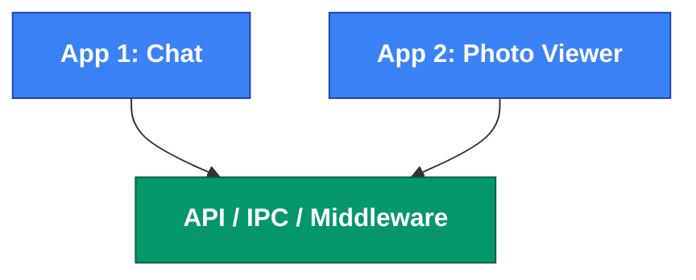
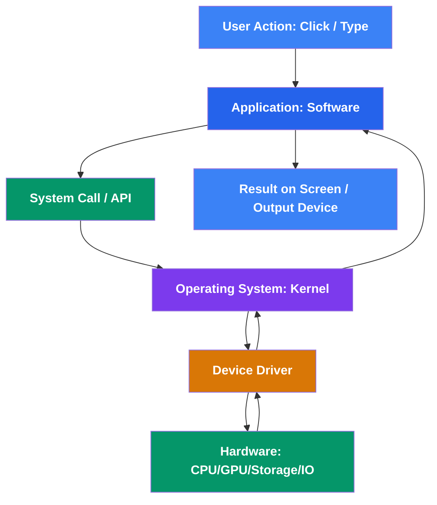

import Tabs from '@theme/Tabs';
import TabItem from '@theme/TabItem';
import { CreateBox, CreateCircle, CreateTriangle } from '@site/src/components/shape_for_md/shapes.js';
import AdBanner from '@site/src/components/AdBanner';
import BrowserOnly from '@docusaurus/BrowserOnly';

# How Your Computer Works

Think about the ***computer*** or ***phone*** in front of you. You might ***`press a key`*** , **click a button**, or tap the screen
and within a fraction of a second, it responds. 

From making a payment to sending a message (or even arguing with someone online 😅), to ordering food, streaming your favorite show, scrolling endlessly on social media, gaming, joining a video call, booking tickets, learning on YouTube, and wasting time on reels like you will  immortal or even controlling the lights in your home everything happens almost instantly.

***On the surface***, it feels effortless almost magical.  

:::note
<BrowserOnly>
  {() => (
    

      

        Your computer 💻 is 
         far from idle ⚡. It’s a 
         tireless powerhouse 🔧, tirelessly 
         crunching millions of calculations , 
         shuffling data , 
         passing messages back and forth , and executing instructions 
         with pinpoint precision , all in less time than it takes you to 
         blink 👁️, breathe, or even begin a yawn 😴.
    

      

    

  )}
</BrowserOnly>
:::

  <iframe
    src="https://www.youtube.com/embed/2jtmDTQbYf4"
    title="How Computer Works"
    style={{ position: 'absolute', top: 0, left: 0, width: '100%', height: '100%' }}
    frameBorder="0"
    allow="accelerometer; autoplay; clipboard-write; encrypted-media; gyroscope; picture-in-picture"
    allowFullScreen
  />

**Every tap**, ***click, or command triggers*** a hidden chain reaction. Circuits switch, code executes, and tiny electrical signals race through pathways at lightning speed.

  All of this happens so quickly and silently that you never notice the complexity you only see the results.

:::tip 💡 What We’ll Explore
In this article, we’ll zoom out to see the bigger picture: how your computer actually *works*. From the flow of electricity to the dance of logic and software, we’ll uncover the hidden story behind the screen. Once you understand it, you won’t just *use* your device you’ll appreciate the invisible orchestra that powers it.
:::

  <AdBanner />

## Table of Contents

1. [Intro: The Magic Behind Your Computer](#intro-the-magic-behind-your-computer)  
2. [Phase 1: Hardware](#phase-1-hardware)  
3. [Phase 2: Software](#phase-2-software)  
   - [Types of Software](#types-of-software)
   - [Application Software](#application-software)
   - [System Software](#system-software)  
   - [How Software Commmunicate With OS and Other Software](#how-software-communicates-with-the-os-and-other-software)
   - [API vs Syscall](#api-vs-syscall)
4. [Operating Systems](#operating-systems-the-master-coordinator)  
   - [Kernel Space vs User Space](#kernel-space-vs-user-space-safety-first)) 
   - [Device driver](#device-drivers-translators-between-os-and-hardware)
   - [ABI](#abi--the-hidden-contract)
5. [All together](#phase-3-bringing-it-all-together--the-complete-computer-workflow)
6. - [What’s Next](#what-next)  
7. - [More Artcle](#more-articles)
8. - [FAQ](#faq)

  <AdBanner />

## Intro: The Magic Behind Your Computer

Have you ever paused to think about what happens when you click an app or type on your keyboard?  
At first, it might feel like magic.But it’s not magic  it’s a **carefully orchestrated machine** at 
work. Every action you take sets off a chain of events, all happening in the blink of an eye.

At a high level, a computer has **two main parts**:

**First**, the **hardware** :— the physical components you can see and touch. These are the muscles and bones of the machine.

**Second**, the **software** :— the programs and instructions that tell the hardware what to do. This is the brain, directing every move.

These two parts communicate constantly through the **Operating System (OS)**, which acts as the translator, the bridge, making sure your commands are understood and executed instantly.

:::caution 
Computers execute billions of instructions per second, yet from a user’s perspective, it feels seamless.  

- **Hardware**: the physical body (CPU, RAM, GPU, storage)  
- **Software**: the instructions controlling hardware  
- **Operating System**: the manager that makes everything usable  
:::

Every tap, every click, every command triggers this hidden symphony. And the amazing part? You don’t see the complexity you only see the results.

:::tip
A computer is not “one thing.” It’s a collaboration between **hardware, software, and the OS**.  
:::

To really grasp how a computer functions, it’s useful to break it down into three key components:
- [hardware](#phase-1-hardware)
- [software](#phase-2-software)
- [operating system](#why-operating-systems-matter) 

This three will gives you a clear view of how each part interacts and contributes to the overall system.

  <AdBanner />

## Phase 1: Hardware

 Imagine your computer as a living organism. Just like a body needs organs to function, a computer needs physical components to process information, store data, and interact with the world. These components forms the **hardware** the backbone that makes computation possible.

:::caution Defination
:::
**Hardware** is the set of **physical components** that perform computation, store data, and enable input/output.
Think of it as the **body of the computer**, providing the raw capability needed for all digital operations.

:::important  Examples of Hardware
:::
* **CPU (Central Processing Unit):** 
  - The “brain” that executes instructions, performs calculations, and coordinates other hardware.
* **RAM (Random Access Memory):** 
  - Fast, temporary memory for data actively in use.
* **GPU (Graphics Processing Unit):** 
  - Handles graphics rendering, parallel computation, and specialized tasks like AI acceleration.
* **Storage Devices:** 
  - SSDs, HDDs, and external drives for long-term storage of data and programs.
* **Input Devices:** 
  - Keyboard, mouse, camera, microphone—tools for humans to interact with the machine.
* **Output Devices:** 
  - Monitor, speakers, printers—hardware that presents processed data to users.
* **Motherboard:** 
  - The central circuit hub connecting all components.
* **Power Supply:** 
  - Provides reliable electricity to all hardware components.
* **Cooling Systems:** 
  - Fans, heat sinks, or liquid cooling to prevent overheating.
* **Network Interface Cards (NICs):**
  - Allow computers to communicate over networks.
* **Peripheral Devices:** 
  - Scanners, game controllers, USB devices, and more.

:::tip Key Idea
Hardware **enables** the computer to perform work, but it cannot act alone. Without software to give instructions and an OS to manage tasks, hardware is just a collection of parts. Think of it as muscles without a brain—they can move, but they need direction.
:::

:::caution point to note 
* **Performance Factors:** CPU speed, RAM size, and storage type significantly affect how fast and efficiently a computer runs.
* **Evolution:** Hardware has evolved dramatically—from vacuum tubes to microprocessors, HDDs to NVMe SSDs, and mechanical GPUs to advanced AI accelerators.
* **Interdependence:** Hardware works hand-in-hand with software and the OS. For example, a GPU is powerful only if programs are written to leverage it.
:::

 Human body as a computer part

| **Human Body System**          | **Specific Organ / Function**       | **Computer Component**                                 | **Role / Analogy**                                                                                                                                                             |
| :----------------------------- | :---------------------------------- | :----------------------------------------------------- | :------------------------------------------------------------------------------------------------------------------------------------------------------------------------------ |
| **The Senses (Input)**         | Eyes                                | Camera, Scanner, Sensors                               | **Input:** Captures visual data from the external environment.                                                                                                                  |
|                                | Ears                                | Microphone                                             | **Input:** Captures audio data from the external environment.                                                                                                                   |
|                                | Skin (Touch)                        | Touchscreen, Mouse, Button                             | **Input:** Captures tactile interaction and pressure.                                                                                                                           |
| **The Voice & Actions (Output)** | Mouth                               | Speakers, Audio Output                                 | **Output:** Produces sound and audio communication.                                                                                                                             |
|                                | Hands / Muscles                     | Printer, Monitor, Robotic Arm (Actuators)              | **Output:** Takes action in the physical world (printing, displaying, moving).                                                                                                  |
| **The Physical Body**          | Skeleton & Shape                    | Computer Case / Chassis                                | Provides the physical structure, support, and protection for all internal components.                                                                                           |
|                                | Heart                               | Power Supply Unit (PSU)                                | Pumps energy (electricity) to every part of the system to keep it alive and functioning.                                                                                        |
|                                | Skin & Sweat Glands                 | Cooling System (Fans, Heat sinks, Liquid Cooling)      | Regulates temperature to prevent overheating and maintain a stable operating environment.                                                                                       |
|                                | Immune System                       | Antivirus, Firewall, Security Software/Hardware        | Defends against external threats (viruses, malware) and internal failures.                                                                                                      |
|                                | Digestive System                    | Storage Devices (HDD, SSD)                             | Intakes, processes, and stores energy (data) for long-term use.                                                                                                                 |
| **The Nervous System**         | Spinal Cord & Peripheral Nerves     | Motherboard, Cables, Buses (e.g., PCIe, USB)           | The central wiring and network that connects all components, allowing them to communicate and transmit signals.                                                                 |
| **The Brain**                  | Prefrontal Cortex (Conscious Thought) | **CPU** (Central Processing Unit)                      | The "self" or general manager. Handles complex decision-making, logic, reasoning, and directs the overall operation of the system.                                              |
|                                | Visual Cortex                       | **GPU** (Graphics Processing Unit)                     | A **specialized region** for processing visual patterns, rendering complex scenes, and performing massive parallel calculations.                                                |
|                                | Cerebellum (Muscle Memory)          | **DPU** (Data Processing Unit) / SmartNIC              | A **specialized subsystem** that handles repetitive, coordinated tasks (network traffic, storage management) automatically, without bothering the main conscious brain (CPU). |
|                                | Autonomic Nervous System            | **DPU** (continued) / Firmware                         | Manages critical subconscious functions (heartbeat, digestion). The DPU manages vital data flow without CPU intervention.                                                       |
|                                | Intuition / Pattern Recognition     | **NPU** (Neural Processing Unit)                       | A **specialized region** for fast, efficient processing of sensory patterns (faces, speech). Accelerates AI and machine learning tasks with high efficiency.                    |
| **The Mind**                   | Short-Term / Working Memory         | **RAM** (Random Access Memory)                         | Your immediate mental workspace for active thoughts, tasks, and applications. Volatile and fast.                                                                                |
|                                | Long-Term Memory                    | **Storage Devices** (SSD, HDD)                         | Your vast library of knowledge, memories, and skills. Non-volatile and persistent, but slower to access.                                                                        |

:::tip point to note
<BrowserOnly>
  {() => (
    

      

        Before anything else, we need to have the 
         hardware ready  the actual physical parts of a computer, like the 
         CPU, 
         memory, and 
         storage. These form the “body” of the machine.  

          

        Once the hardware is powered up and connected, 
         electricity flows ⚡ through it, enabling it to work. 
        Only then can 
         software step in to give instructions, control the machine, and make it do useful tasks.  

          

        Think of it like building the 
         skeleton 🦴 and organs  of a body before it can move and think.
      

    

  )}
</BrowserOnly>
:::

  <AdBanner />

---

## Phase 2: Software

Just as the body needs a brain to tell muscles what to do, a computer needs **software** to instruct hardware on what tasks to perform. Software provides the intelligence, rules, and logic that make the machine useful.

:::caution Definition
:::
**Software** is the set of **programs, instructions, and data** that tells the hardware how to perform tasks.  
Think of it as the **mind of the computer**, translating raw capability into meaningful action.

:::caution Common Confusion Many people wonder: `If the CPU is the brain, then how software can be mind of the computer ?`

:::tip Here’s the clarification:

* **CPU = Brain (Hardware):** 
       - *Executes instructions and controls the machine.*
       - *It is the physical part of the computer that `thinks` in terms of computation.*
* **Software = Mind:** 
       - *Provides instructions, logic, and purpose to the CPU. Without software, the CPU has no direction.*
* **Operating System = Nervous System / Manager:** 
       - Coordinates all `activities`, `manages resources`, and `ensures` that hardware and `software communicate` effectively.

**Analogy Table:**

| Human Analogy  | Computer Component | Role                                                   |
| -------------- | ------------------ | ------------------------------------------------------ |
| Brain          | CPU (Hardware)     | Executes instructions and controls the system          |
| Mind           | Software           | Gives purpose and instructions to the CPU              |
| Nervous System | Operating System   | Coordinates hardware and software for smooth operation |

:::important Think of it like this: 
a **brain without a mind** is capable but idle; a **mind without a brain** is imaginative but next to impossible. 
Together, they make a functional computer.

:::note **In LayMan Term**
> - A mind without a brain cannot exist the CPU is required to actually “run” the `software`. 
> - Similarly, the software without a CPU is just ***a set of instructions that does nothing***. 
> - Together, they make a functional computer.
:::

:::important Examples of Software
:::
* **Operating System (OS):** 
  - The central manager that controls hardware resources, schedules tasks, and provides a platform for applications.
* **Applications:** 
  - Programs for end-users, like word processors, web browsers, games, and media players.
* **Utilities:** 
  - Tools for system maintenance, such as antivirus, disk cleanup, and backup software.
* **Drivers:** 
  - Specialized programs that allow the OS and applications to communicate with hardware devices.
* **Firmware:** 
  - Low-level software embedded in hardware for essential control functions.
* **Middleware:** 
  - Software that connects applications with operating systems or databases, enabling communication and data management.

:::tip Key Idea
Software **gives instructions** to hardware, turning raw computational power into usable functionality. Without software, a computer is just a collection of circuits and chips. Think of it like a mind without a body—it has ideas but cannot act.
:::

:::caution Points to Note
* **Types:** System software (OS, drivers, firmware) vs. Application software (games, productivity tools).  
* **Dependency:** Software relies on hardware to execute instructions, and on the OS to manage resources efficiently.  
* **Updates:** Software evolves constantly to add features, improve performance, and fix security issues.  
:::

<BrowserOnly>
  {() => (
    

      

        Once the hardware is ready, we install and run 
         software the instructions and programs that tell the machine what to do.  

          

        Applications allow users to perform tasks, like writing documents, browsing the web, or playing games.  
        System Software manages hardware resources and ensures the machine runs smoothly.  
        Drivers and Firmware 🔧 ensure communication between hardware and software layers.  

          

        Think of software as the brain and nervous system of the computer—it instructs muscles (hardware) to act, ensures coordination, and brings the machine to life.
      

    

  )}
</BrowserOnly>

### Types of Software

To understand how computer work , we can classify software into **two main parts**: **system software** and **application software**. This classification helps us see how the mind of the computer is structured—how some programs manage the hardware while others help you accomplish tasks.

###### System Software

System software manages the **hardware and basic operations** of a computer. It ensures the machine functions efficiently and provides a platform for applications to run.

**Examples:**

* **Operating System (OS):** Windows, Linux, macOS – manages hardware, memory, processes, and file systems.
* **Device Drivers:** Allow hardware components like printers, GPUs, and cameras to communicate with the OS.
* **Utility Programs:** Antivirus, file management tools, disk cleanup, backup software.

**Key Idea:** System software acts like the **nervous system** of the computer, coordinating hardware and other software.

###### Application Software

Application software is designed to help users **perform specific tasks**. It is the “mind in action” directing the CPU to execute meaningful work.

**Examples:**

* Word processors (Microsoft Word, Google Docs) – for writing and editing documents.
* Web browsers (Chrome, Firefox) – for accessing the internet.
* Media players and editors – for audio, video, and graphics.
* Games and productivity tools – for entertainment and work tasks.

**Key Idea:** Application software is **purpose-driven**. It cannot function without the system software and hardware underneath.

###### How Software Communicates With the OS and Other Software

Just like humans need a **nervous system** to coordinate muscles, organs, and senses, software needs the **operating system (OS)** and intermediary layers to communicate with hardware and other programs. This communication ensures the computer works smoothly and efficiently.

:::caution Explanation
:::
**Software Communication** is the process by which programs exchange instructions, data, and requests with the operating system, hardware, or other software components.
Think of it as the **messenger system of the computer**, enabling coordination and proper functioning.

:::tip Key Idea
Without proper communication:
* Applications cannot access hardware efficiently.
* Programs may conflict or overwrite each other’s data.
* Tasks could fail or run slowly.
:::

:::tip `The OS acts as the **central coordinator**, managing requests, allocating resources, and ensuring each program runs safely and correctly.`
:::

###### Mechanisms of Communication

* **System Calls:**
    - Applications use predefined interfaces (system calls) to request services from the OS, like reading a file, allocating memory, or sending network data.
    -  **Example**: 
          > `open()` in Linux opens a file using the OS.

* **APIs (Application Programming Interfaces):**
    - Standardized methods that allow software to interact with libraries, frameworks, or other programs.
    - **Example**:
      >  Web apps using browser APIs to access device features like camera or GPS.

* **Inter-Process Communication (IPC):**
    - Mechanisms that allow multiple programs to exchange data or signals safely.
    - **Examples**:
        >  Pipes, sockets, shared memory, message queues.

* **Middleware:**
    - Acts as a bridge between software components, helping applications communicate across platforms, networks, or databases.
    -  **Example**: 
        > Database middleware connecting a web app to a SQL server.

* **Device Drivers:**
    - Specialized programs that translate general OS instructions into hardware-specific commands.
    - **Example**: 
        > Printer drivers converting print requests into signals the printer can understand.

 

Analogy With Human Body 

| Human Analogy          | Computer Component / Concept      | Role                                                                  |
| ---------------------- | --------------------------------- | --------------------------------------------------------------------- |
| Nervous System         | Operating System (OS)             | Coordinates all signals and ensures smooth operation of all programs. |
| Messenger / Translator | System Calls / APIs / Middleware  | Helps software request services and communicate effectively.          |
| Muscle Response        | Device Drivers                    | Executes OS instructions on hardware accurately.                      |
| Collaboration          | Inter-Process Communication (IPC) | Allows multiple programs to work together and share data safely.      |

<BrowserOnly>
  {() => (
    

      

        Think of the OS as the central nervous system.  
        It relays instructions between the hardware (muscles, organs) and software (the mind).  
      

    Applications don’t directly talk to the hardware they send requests via system calls.  
    Drivers act like translators, converting these requests into hardware-friendly signals.  
    IPC ensures multiple programs share information safely, while middleware connects different software components seamlessly.
  

)} </BrowserOnly>

###### API VS SYSCALL

Here’s a clear **comparison table of API vs System Call (Syscall)**:

| Feature            | API (Application Programming Interface)                                                              | System Call (Syscall)                                                         |
| ------------------ | ---------------------------------------------------------------------------------------------------- | ----------------------------------------------------------------------------- |
| **Definition**     | A set of functions provided by libraries or frameworks that allow programs to perform specific tasks | A mechanism for programs to request services from the operating system kernel |
| **Level**          | Higher-level interface                                                                               | Lower-level interface (closer to hardware/OS)                                 |
| **Execution Mode** | Runs in **user mode**                                                                                | Runs in **kernel mode**                                                       |
| **Purpose**        | Simplifies programming by providing easy-to-use functions                                            | Provides direct access to OS resources like files, processes, and devices     |
| **Examples**       | `printf()`, `malloc()`, `fopen()` in C                                                               | `read()`, `write()`, `open()`, `fork()` in Linux                              |
| **Dependency**     | Depends on underlying syscalls or libraries                                                          | Depends on OS kernel implementation                                           |
| **Safety**         | Safer, as it abstracts hardware and kernel details                                                   | Less safe if misused; can crash OS or cause security issues                   |
| **Speed**          | Slightly slower due to abstraction overhead                                                          | Faster for low-level operations, but requires context switch                  |
| **Portability**    | Usually portable across different OSes                                                               | OS-specific, less portable                                                    |

## Operating Systems: The Master Coordinator

After understanding **hardware** and **software**, it’s time to explore the **Operating System (OS)** the software that coordinates everything between hardware and applications.

:::caution The OS is the **resource manager** of a computer:
* It schedules processes.
* It manages memory.
* It provides a safe and abstract interface for applications to interact with hardware.
:::

> *Think of the OS as a **manager in a company**, ensuring that employees (applications) use resources efficiently, without conflicts, and follow company rules (system constraints).*

---

###### Kernel Space vs User Space: Safety First

Modern OSs separate execution into **two modes**:

* **User Space:** Where applications run. Apps **cannot access hardware directly**.
* **Kernel Space:** Where the OS core runs, with **full access to hardware**.

**Analogy:**

* Apps = Employees
* Kernel = Manager with the master key
> *Employees must request resources via **system calls**, just like employees requesting approval from a manager.*

:::important **Historical Insight:**
The concept of **user mode and kernel mode** originated from **Fernando J. Corbató** in the 1960s during his work on **CTSS (Compatible Time-Sharing System at MIT)**.
This separation ensures **security, stability, and controlled access** to the computer’s hardware.
:::
---

###### Device Drivers: Translators Between OS and Hardware

Drivers are **specialized software** that allow the OS to communicate with hardware. Without drivers, hardware is **essentially useless**.

* Every hardware device has a corresponding driver.
* Drivers convert OS instructions into **hardware-specific signals**.
* Drivers reside in **kernel space** to safely access hardware.

**Example:** Installing a printer requires its driver; otherwise, the OS cannot “talk” to the printer.

###### ABI – The Hidden Contract

The **Application Binary Interface (ABI)** defines **how programs communicate with the OS at the binary level**:

* System call numbers
* Register usage
* Data passing conventions

:::caution **Analogy:** 
:::
*ABI is like **grammar rules** programs in any language (C, C++, Rust) can communicate with the OS if they follow these rules.*

---

###### How Applications Communicate

Applications interact with **other applications**, the **OS**, and **hardware** via well-defined channels:

:::tip 1️⃣ App ↔ App (User-space only)

:::

**Flow:** 
            - App → API / IPC → Other App
**Example:** 
            -   A chat app opens a photo in a photo viewer app already loaded in memory.

**Analogy:** 
>> *Two employees consult the **shared company playbook** directly.*

**Flow:** App → Syscall → ABI → Kernel → Driver → Hardware

**Example:** Reading a file from disk: App requests → Kernel validates → Driver converts → Disk hardware executes.

**Analogy:** Employee → Manager → Specialist → Vault.

---

Unified Analogy Table

| Human Analogy        | Computer Component / Concept | Role                                                              |
| -------------------- | ---------------------------- | ----------------------------------------------------------------- |
| Nervous System       | Operating System (OS)        | Coordinates all activities and ensures smooth operation           |
| Employees            | Applications                 | Perform tasks but cannot access hardware directly                 |
| Manager / Supervisor | Kernel                       | Enforces rules, allocates resources, and controls hardware access |
| Translators          | Drivers                      | Convert OS instructions into hardware-specific signals            |
| Grammar Rules        | ABI                          | Ensures programs communicate correctly regardless of language     |
| Collaboration        | IPC / APIs / Middleware      | Enables safe and effective software-to-software communication     |

:::caution Key Takeaways

* **Hardware = Body**, **Software = Brain**, **OS = Manager**
* **APIs / IPC / Middleware** handle software ↔ software communication
* **Syscalls** handle software ↔ OS / hardware communication
* **Kernel/User separation** ensures security and stability
* **Drivers** are essential translators for hardware
* **ABI** ensures binary compatibility across programs
* The **user/kernel concept** was pioneered by **Fernando J. Corbató** (1960s, MIT CTSS)
:::

:::tip **Tip for Learners:**
Think of OS as the **conductor of an orchestra**. The hardware are instruments, applications are musicians, and the OS ensures every note is played in harmony without crashing the performance.
:::

  <AdBanner />

###### Phase 3: Bringing It All Together – The Complete Computer Workflow

So far, we’ve explored **hardware**, **software**, and the **operating system** separately. But in reality, a computer is a **tightly coordinated system**, where these three layers constantly collaborate to make your commands work seamlessly.

Think of it as a **highly efficient company**:

* **Hardware = Body / Muscles** – Performs the work, executes instructions, and stores data.
* **Software = Mind / Employees** – Decides what needs to be done and issues instructions.
* **Operating System = Manager / Nervous System** – Coordinates activities, allocates resources, and ensures smooth communication.

**Step-by-Step Flow: From Command to Action**

1. **You give a command**
   * Click a button, type a file name, or open an app.
2. **Software interprets your action**
   * The application determines what needs to be done (e.g., open a file, display a photo).
3. **OS gets involved**
   * The app requests resources via **system calls**.
   * OS checks permissions, allocates memory, and prepares hardware access.
4. **Drivers translate OS requests**
   * The OS sends instructions to hardware-specific **drivers**, which convert commands into signals the hardware understands.
5. **Hardware executes the task**
   * CPU processes data, GPU renders graphics, storage reads/writes, and I/O devices perform input/output.
6. **Results flow back to software**
   * Hardware responses are sent back via drivers → OS → application.
   * The application presents the output: image on screen, sound in speakers, or saved file.

---

**Digrama in Action**

**Analogy:**

* User = Audience asking for a performance
* Application = Musicians interpreting the request
* OS = Conductor coordinating the orchestra
* Drivers = Translators converting sheet music into instructions for instruments
* Hardware = Instruments producing the final sound or output

### Key Takeaways

* The computer is **not just hardware or software**—it’s the **orchestration of all three**.
* **Applications alone** cannot act without **OS guidance** and **hardware execution**.
* **OS alone** is powerful, but without **software and hardware**, it cannot perform tasks.
* Understanding this flow helps you appreciate **why computers are fast, secure, and reliable**.

:::tip 💡 Quick Mental Model

> Think of your computer as a **smart factory**: software plans the work, OS manages resources and schedules tasks, drivers operate machines, and hardware executes the work. Every layer depends on the others to function correctly.
:::

  <AdBanner />

#### What Next 

You’ve just peeled back the layers of your computer and seen the incredible symphony of hardware, software, and operating systems working in harmony. What was once magic is now an understandable, elegant system.

You now know that the CPU needs **binary machine code** to execute anything. But how does the human-readable code that developers write turn into those zeros and ones that the hardware understands?

**This is where the magic of compilers, assemblers, and linkers comes in.**

In the next article, we will dive deep into the journey of a single line of code. We'll explore how your source code gets translated, optimized, and packaged into an executable binary that the operating system can load and the CPU can run.

We'll answer questions like:
*   What does a compiler *actually* do?
*   What is assembly language, and why is it a crucial middle ground?
*   How do different pieces of code get linked together into a single program?
*   What really happens inside an executable file?

The most powerful skill you can develop is **curiosity**. The next time you compile a program, you'll see it not as a mysterious command, but as the final step in a fascinating transformation process.

:::tip **👉 Next Up: From Source to Binary: How Your Code Becomes a Program**
:::

## More Articles

<Tabs>
  <TabItem value="docs" label="📚 Documentation">
             - [CompilerSutra Home](https://compilersutra.com)
                - [CompilerSutra Homepage (Alt)](https://compilersutra.com/)
                - [Getting Started Guide](https://compilersutra.com/get-started)
                - [Newsletter Signup](https://compilersutra.com/newsletter)
                - [Skip to Content (Accessibility)](https://compilersutra.com#__docusaurus_skipToContent_fallback)

  </TabItem>

  <TabItem value="tutorials" label="📖 Tutorials & Guides">

        - [AI Documentation](https://compilersutra.com/docs/Ai)
        - [DSA Overview](https://compilersutra.com/docs/DSA/)
        - [DSA Detailed Guide](https://compilersutra.com/docs/DSA/DSA)
        - [MLIR Introduction](https://compilersutra.com/docs/MLIR/intro)
        - [TVM for Beginners](https://compilersutra.com/docs/tvm-for-beginners)
        - [Python Tutorial](https://compilersutra.com/docs/python/python_tutorial)
        - [C++ Tutorial](https://compilersutra.com/docs/c++/CppTutorial)
        - [C++ Main File Explained](https://compilersutra.com/docs/c++/c++_main_file)
        - [Compiler Design Basics](https://compilersutra.com/docs/compilers/compiler)
        - [OpenCL for GPU Programming](https://compilersutra.com/docs/gpu/opencl)
        - [LLVM Introduction](https://compilersutra.com/docs/llvm/intro-to-llvm)
        - [Introduction to Linux](https://compilersutra.com/docs/linux/intro_to_linux)

  </TabItem>

  <TabItem value="assessments" label="📝 Assessments">

        - [C++ MCQs](https://compilersutra.com/docs/mcq/cpp_mcqs)
        - [C++ Interview MCQs](https://compilersutra.com/docs/mcq/interview_question/cpp_interview_mcqs)

  </TabItem>

  <TabItem value="projects" label="🛠️ Projects">

            - [Project Documentation](https://compilersutra.com/docs/Project)
            - [Project Index](https://compilersutra.com/docs/project/)
            - [Graphics Pipeline Overview](https://compilersutra.com/docs/The_Graphic_Rendering_Pipeline)
            - [Graphic Rendering Pipeline (Alt)](https://compilersutra.com/docs/the_graphic_rendering_pipeline/)

  </TabItem>

  <TabItem value="resources" label="🌍 External Resources">

            - [LLVM Official Docs](https://llvm.org/docs/)
            - [Ask Any Question On Quora](https://compilersutra.quora.com)
            - [GitHub: FixIt Project](https://github.com/aabhinavg1/FixIt)
            - [GitHub Sponsors Page](https://github.com/sponsors/aabhinavg1)

  </TabItem>

  <TabItem value="social" label="📣 Social Media">

            - [🐦 Twitter - CompilerSutra](https://twitter.com/CompilerSutra)
            - [💼 LinkedIn - Abhinav](https://www.linkedin.com/in/abhinavcompilerllvm/)
            - [📺 YouTube - CompilerSutra](https://www.youtube.com/@compilersutra)

  </TabItem>
</Tabs>
> ***Will cover more in upcoming artilce***

  <AdBanner />

## FAQ

import { ComicQA } from '../../mcq/interview_question/Question_comics';

<ComicQA
  question="1) What is a computer?"
  answer="An electronic machine that processes data and performs tasks based on instructions."
  code={``}
  example="Like a chef following recipes to prepare dishes."
  whenToUse="Understanding the fundamental purpose of a computer."
/>

<ComicQA
  question="2) What are the main components of a computer?"
  answer="CPU, Memory (RAM), Storage, Input/Output devices, and Software."
  code={``}
  example="Like a kitchen: chef (CPU), ingredients (RAM), pantry (Storage), utensils (I/O), recipes (Software)."
  whenToUse="Whenever analyzing or building a computer system."
/>

<ComicQA
  question="3) What is the role of the CPU?"
  answer="The Central Processing Unit executes instructions, performs calculations, and manages data flow."
  code={``}
  example="Like the brain of a chef, deciding what steps to do next."
  whenToUse="To understand how tasks are processed inside a computer."
/>

<ComicQA
  question="4) What is software?"
  answer="Programs and instructions that tell the hardware what to do."
  code={``}
  example="Like recipes that guide the chef (CPU) on what to cook."
  whenToUse="Understanding how computers perform meaningful tasks."
/>

<ComicQA
  question="5) What is an Operating System (OS)?"
  answer="Software that manages hardware resources and provides services to applications."
  code={``}
  example="Like the kitchen manager who coordinates chefs, ingredients, and cooking tools."
  whenToUse="To know how applications interact with hardware."
/>

<ComicQA
  question="6) What is the difference between kernel space and user space?"
  answer="User space is where applications run, kernel space is where the OS core runs with full hardware access."
  code={``}
  example="Employees work on tasks (user space), manager handles sensitive controls (kernel space)."
  whenToUse="To understand security and controlled access in computers."
/>

<ComicQA
  question="7) How does the OS communicate with hardware?"
  answer="Through device drivers and system calls; drivers convert OS instructions to hardware-specific signals."
  code={``}
  example="Manager communicates with specialized workers via translators."
  whenToUse="Whenever analyzing hardware-software interactions."
/>

<ComicQA
  question="8) What is memory and how does it work?"
  answer="Memory stores instructions and data temporarily (RAM) or permanently (Storage)."
  code={``}
  example="Like a workstation counter (RAM) for immediate use and pantry (Storage) for long-term ingredients."
  whenToUse="To understand data processing and retrieval in a computer."
/>

<ComicQA
  question="9) What is a system call?"
  answer="A controlled way for an application to request services from the OS."
  code={``}
  example="Like asking the manager for permission to use a special tool."
  whenToUse="When software needs hardware access securely."
/>

<ComicQA
  question="10) How do applications communicate with each other?"
  answer="Through APIs, IPC, and middleware which the OS facilitates."
  code={``}
  example="Like employees using a shared playbook to coordinate tasks."
  whenToUse="Understanding multi-application workflows."
/>

