import AdBanner from '@site/src/components/AdBanner';
import Tabs from '@theme/Tabs';
import TabItem from '@theme/TabItem';


# Writing and Running Your First OpenCL Kernel

***OpenCL (Open Computing Language)*** enables you to write programs that execute across `heterogeneous platforms`, including CPUs, GPUs, and more. In this guide, we’ll walk you through writing and executing your ***first OpenCL kernel***, explaining the host-device setup, memory models, and build mechanics.

:::note This tutorial builds on prior foundational concepts

:::important 📚 Prerequisite Topics

<details>
<summary><strong>📌 Please ensure you have completed the following tutorials first:</strong></summary>

<br/>

| 📘 **OpenCL Tutorial Topic**                  | 🔗 **Read More**                                                                                   |
|----------------------------------------------|----------------------------------------------------------------------------------------------------|
| Introduction to OpenCL                       | [What is OpenCL?](https://www.compilersutra.com/docs/gpu/opencl/basic/what_is_opencl)             |
| Installing and Setting Up OpenCL             | [Setting Up OpenCL](https://www.compilersutra.com/docs/gpu/opencl/basic/setting_up_opencl)        |
| Running Your First OpenCL Program (Part 1)   | [Part 1: First Code](https://www.compilersutra.com/docs/gpu/opencl/basic/running_first_opencl_code) |
| Exploring OpenCL Code in Depth (Part 2)      | [Part 2: Deep Dive](https://www.compilersutra.com/docs/gpu/opencl/basic/running_first_opencl_code_part2_a) |
| Detecting OpenCL Support on Android Devices  | [Detect GPU on Android](https://www.compilersutra.com/docs/gpu/opencl/basic/detecting_opencl_gpu_on_android) |

</details>

:::


:::caution [Github link](https://github.com/aabhinavg1/OpenCLModular)


:::tip What’s Covered

* What is a kernel in OpenCL?
* Writing your first kernel
* Setting up the host program
* Compiling and executing the kernel
* Debugging, performance insights, and next steps
* github link
:::


<div>
   <AdBanner />
</div>


# **Table of Contents**

- **Introduction**
        * [What is an OpenCL Kernel?](#what-is-an-opencl-kernel)
        * [Prerequisites](#prerequisites)
- **Core Tutorial**
        1. [Writing Your First Kernel](#step-1-write-your-kernel-code)
        2. [Folder Strucute In detail](#step-2-folder-structure-and-basic)

- **Maind Body**
      * [Host Code ](#host-code)
      * [Kernel Code runs on the device](#writing-and-running-your-first-opencl-kernel)
      * [Device Code](#device-gpu-side--kernel-execution-flow)
      * [Host vs Kernel Chat Sheet](#host-vs-kernel-cheat-sheet)


- **References**
      * [Full Code Example](#step-1-write-your-kernel-code)
      * [Related Tutorials](#prerequisites)

---

**Introduction**

### What is an OpenCL Kernel?

An OpenCL **kernel** is a special function written in **OpenCL C** that is designed to run on parallel compute devices—such as **GPUs**, **CPUs**, or **FPGAs**—within the OpenCL framework. Unlike traditional C functions, a kernel is compiled and executed at runtime by the OpenCL driver and is **invoked from the host program** (usually written in C/C++).

:::important more about kernel
***Kernels are the core unit of execution in OpenCL***.
-  Each kernel is executed across multiple **work-items** that can run in parallel, enabling massive `data-level parallelism.`
 > ***A kernel typically performs a small operation on a large dataset and is deployed across many compute units in the device to achieve high throughput***
:::

At runtime, the host application loads the kernel source code, compiles it for the target device using `clBuildProgram()`, sets up the input/output memory buffers, and finally dispatches the kernel using `clEnqueueNDRangeKernel()`.


:::tip Refer to
>  [this section](https://www.compilersutra.com/docs/gpu/opencl/basic/running_first_opencl_code#1%EF%B8%8F%E2%83%A3-what-is-a-kernel-in-opencl) for more context.
:::

##### Prerequisites

Before proceeding, make sure:
:::caution Note
* You’ve installed OpenCL SDK and headers
* Understand the OpenCL execution model
* Know how to detect and target a compute device
:::tip > ***Refer to***:
    * [Setting up OpenCL](https://www.compilersutra.com/docs/gpu/opencl/basic/setting_up_opencl/)
    * [Running your first OpenCL program](https://www.compilersutra.com/docs/gpu/opencl/basic/running_first_opencl_code/)
:::


---

<div>
  <AdBanner />
</div>

---

## Section 1: Core Concept

### Step 1: Write Your Kernel Code

In this section, we introduce the **OpenCL kernel function** — the core unit of work in an OpenCL program. A kernel is a special function marked with the `__kernel` keyword, which tells the OpenCL runtime to execute this function on a parallel device like a GPU or CPU.

>> ***In order to write an OpenCL kernel, we should first understand a few key things:***
:::note Things to Know
:::caution here
* The **syntax** used to define a kernel (`__kernel`, `__global`, etc.)
* **What the kernel is supposed to do** — in our case, perform element-wise addition of two arrays
* The concept of **parallel execution** using **work-items**
* How to use **indexing functions** like `get_global_id()` to assign each work-item its part of the job
* The different **memory spaces** (global, local, private) and how to declare pointers for device memory
:::
With that foundation, we'll now write a simple kernel called `vector_add`, which adds elements from arrays `A` and `B`, and stores the result in array `C`. Each addition is done independently by one work-item running in parallel — showcasing OpenCL’s data-parallel power.


<Tabs>
  <TabItem value="syntax" label="Syntax Keyword">

`__kernel` marks the function as an OpenCL **kernel**.  
Kernels are executed in **parallel** on OpenCL-compatible devices (GPU/CPU).  
They must be declared with this keyword to be recognized by the OpenCL runtime.

  </TabItem>

  <TabItem value="explanation" label="What Are We Writing?">

We are writing a kernel called `vector_add` that:

- Takes two input arrays `A` and `B`
- Adds each corresponding element
- Stores the result in output array `C`

Each element operation is handled by one **work-item** (thread) running in parallel.

  </TabItem>

  <TabItem value="code" label="Kernel Code">

  **Algorithm: Vector Addition using OpenCL Kernel**

**Goal**: For two input vectors `A` and `B` of size `N`, compute `C[i] = A[i] + B[i]` for all `i` from `0` to `N-1` using parallel GPU threads.

📌 ***Input***:

            >  * `A[]`: First input vector of integers.
            >  * `B[]`: Second input vector of integers.
            >  * `N`: Size of vectors.

> ***Both `A` and `B` must be of the same size, and `C` is the output vector to store results.***
🔁 ***Parallel Algorithm:***

For **each work-item (thread)** running on the GPU:

1. Get the global thread ID:
   `id = get_global_id(0)`

2. Access elements at index `id` in vectors `A` and `B`.

3. Compute their sum:
   `sum = A[id] + B[id]`

4. Store the result in output vector `C`:
   `C[id] = sum`

```rust
// File: kernels/vector_add.cl

__kernel void vector_add(__global const int* A,
                         __global const int* B,
                         __global int* C) {
    int id = get_global_id(0);  // Get thread index
    C[id] = A[id] + B[id];      // Perform vector addition
}
````
:::tip  Note:

* The OpenCL runtime automatically launches **`N` parallel threads** (one per element).
* Each thread **only works on a single index**, making the computation highly parallel and efficient.
:::

  </TabItem>

  <TabItem value="concepts" label="🧪 Key Concepts">

| Keyword            | Description                                                                                  |
| ------------------ | -------------------------------------------------------------------------------------------- |
| `__kernel`         | A qualifier used to declare a function as a kernel. Kernels are entry points that run on the GPU or other OpenCL device and are called from the host (CPU). |
| `__global`         | A qualifier that indicates a pointer refers to global memory on the device. Global memory is shared among all work-items and has the highest latency. |
| `get_global_id(0)` | A built-in OpenCL function that returns the global ID (or index) of the current work-item in dimension 0. This ID uniquely identifies the work-item among all launched threads and is often used to index arrays. |


  </TabItem>
</Tabs>

---

### Step 2: Folder Structure and Basic


Before running your OpenCL kernels, it's essential to set up your host-side C++ program and organize your project structure in a modular and scalable way.

:::tip We’ve already explained the following in detail in the two-part guide below:
:::
:::important topics
* **Why device detection matters in OpenCL**
* **OpenCL initialization flow**
* **Usage of key APIs**: `clGetPlatformIDs`, `clGetDeviceIDs`, `clGetDeviceInfo`
* **GPU detection logic** (step-by-step)
* **Full working C++ example with explanation**
* **Execution instructions and next steps**

:::caution 🧠 **Please review these before continuing**:

* 🔗 [Part 1: Running First OpenCL Code](https://www.compilersutra.com/docs/gpu/opencl/basic/running_first_opencl_code)
* 🔗 [Part 2: Running First OpenCL Code – Part 2](https://www.compilersutra.com/docs/gpu/opencl/basic/running_first_opencl_code_part2_a)
:::

:::important Folder Structure
<details>
<summary><strong> Click here </strong></summary>

```rust
OpenCLModular
├── include/
│   ├── device_model.h
│   └── platform_model.h
├── opencl_headers
├── kernels/
│   └── vector_add.cl
├── libs/
│   └── arm64-v8a/libOpenCL.so
├── src/
│   ├── main.cpp
│   ├── device_model.cpp
│   └── platform_model.cpp
├── CMakeLists.txt
└── toolchain_android.cmake
```
<details>
<summary><strong>📁 Project Structure Breakdown (Updated)</strong></summary>
<Tabs groupId="project-structure" defaultValue="core" values={[
  { label: '🔧 Core Structure', value: 'core' },
  { label: '⚙️ Execution Components', value: 'execution' },
  { label: '📦 Build & Dependencies', value: 'build' }
]}>

<TabItem value="core">

| 📂 Path               | 📘 Description                                                                                                                                                             |
|----------------------|-----------------------------------------------------------------------------------------------------------------------------------------------------------------------------|
| `include/`           | Contains C++ **header files** to define interfaces and modularize logic.                                                                                                    |
| ├── `device_model.h` | Declares functions related to **device discovery**, querying properties, and abstraction helpers.                                                                           |
| └── `platform_model.h` | Declares **platform-related utilities** such as platform enumeration, context setup, and error handling.                                                                 |
| `opencl_headers/`    | 🔗 Cloned from [KhronosGroup/OpenCL-Headers](https://github.com/KhronosGroup/OpenCL-Headers). Provides **platform-independent OpenCL headers** like `CL/cl.h`.              |

</TabItem>

<TabItem value="execution">

| 📂 Path               | 📘 Description                                                                                                                                                             |
|----------------------|-----------------------------------------------------------------------------------------------------------------------------------------------------------------------------|
| `src/`               | Hosts all **C++ implementation files** that drive the OpenCL logic on the CPU side.                                                                                         |
| ├── `main.cpp`       | Acts as the **entry point**: initializes OpenCL platform/device, loads kernels, manages memory buffers, and handles kernel execution.                                      |
| ├── `device_model.cpp` | Implements device-specific helpers: fetches available GPU/accelerator info and performs device selection.                                                                 |
| └── `platform_model.cpp` | Handles platform discovery, creates **OpenCL context and command queues**, and prepares the execution environment.                                                      |
| `kernels/`           | Contains OpenCL `.cl` files written in **OpenCL C** for GPU-side computation.                                                                                               |
| └── `vector_add.cl`  | A sample kernel performing **vector addition**: `C[i] = A[i] + B[i]`. Demonstrates basic buffer and execution model.                                                        |

</TabItem>

<TabItem value="build">

| 📂 Path                  | 📘 Description                                                                                                                                                          |
|-------------------------|--------------------------------------------------------------------------------------------------------------------------------------------------------------------------|
| `libs/`                 | Holds compiled **OpenCL runtime libraries**, especially for embedded or mobile targets.                                                                                  |
| └── `arm64-v8a/libOpenCL.so` |  📥 Precompiled **OpenCL shared object** for Android ARM64, pulled using `adb` from a target device. Required during **NDK-based cross-compilation and linking**.   builds.                                                                            |
| `CMakeLists.txt`        | 🧱 Primary CMake configuration file: defines project build targets, includes headers, links libraries, and sets compiler flags.                                           |
| `toolchain_android.cmake` | Toolchain file used to **cross-compile** this project for Android using the NDK. Sets ABI, platform version, and toolchain paths.                                     |

</TabItem>

</Tabs>


</details>
</details>
:::


<div>
  <AdBanner />
</div>


## Host Code

The **host code** runs on the CPU and acts as the **controller** for your OpenCL program. Its job is to set up and manage the interaction between your application and the OpenCL-compatible device (like a GPU, CPU, or NPU).

:::tip In short, the host code:

```mermaid
flowchart LR  
    A(["<b>Select Platform & Device</b><br>(e.g., Qualcomm/Mali GPU)"])
    B(["<b>Create Context & Command Queue</b><br>(setup communication)"])
    C(["<b>Prepare Data & Allocate Device Memory</b><br>(send arrays to GPU)"])
    D(["<b>Load & Build Kernel</b><br>(compile .cl file)"])
    E(["<b>Set Kernel Args & Launch</b><br>(Run kernel on device)"])
    F(["<b>Read Back Results</b><br>(copy from GPU to host)"])
    G(["<b>Release Resources</b><br>(cleanup memory, queue, context)"])

    A --> B --> C --> D
    D --> E
    E --> F --> G
```


<details>

<summary> Here what host do </summary>
1. **Selects a platform and device**
   (e.g., picks Qualcomm/Mali and its GPU)

2. **Creates a context and command queue**
   (used to talk to the device and send commands)

3. **Prepares data and allocates memory on the device**
   (e.g., sends input arrays to GPU memory)

4. **Loads and builds the OpenCL kernel**
   (compiles your `.cl` file for the selected device)

5. **Sets kernel arguments and launches the kernel**
   (e.g., tells GPU to run a vector addition)

6. **Reads back results from the device to host memory**
   (copies the output back for use/display)

7. **Releases all resources**
   (cleans up memory, queue, context)
</details>
:::

#### The **Kernel Code** runs on the **device** (GPU, CPU, etc.)

Its job is to define the parallel computation – what each "worker" (called a work-item) should do.
You write this in OpenCL C and compile it at runtime or offline.


:::tip In short, the kernel does:


<details>

<summary>What the kernel code (device side) does</summary>

1. **Defines the kernel function**
   Marked with `__kernel`, like:

   ```c
   __kernel void vector_add(__global int* A, __global int* B, __global int* C) {
       int id = get_global_id(0);
       C[id] = A[id] + B[id];
   }
   ```

2. **Uses work-item IDs**
   Functions like `get_global_id(0)` or `get_local_id(1)` help identify which thread is running.

3. **Performs computation**
   Each work-item independently processes one element (or more) of data.

4. **Accesses memory buffers**
   Kernel arguments use qualifiers like `__global`, `__local`, or `__private` to access device memory.

5. **Completes execution**
   After all work-items finish, control returns to the host code.

</details>
:::

#### **Device (GPU) Side – Kernel Execution Flow**

This is what each **work-item** (GPU thread) does on the device when the kernel is launched.

:::tip In short, the device-side (kernel) does:


<details>
<summary>Explanation of each step on the GPU</summary>

1. **Entry Point**:
   Each GPU thread starts from a function tagged with `__kernel`.

   ```c
   __kernel void vector_add(__global int* A, __global int* B, __global int* C)
   ```

2. **Identify Work-Item**:
   Each thread gets a unique ID using `get_global_id(0)` (or 1/2 for higher dimensions).

3. **Access Input Data**:
   The kernel reads input from buffers passed by the host. These are pointers to device memory.

4. **Compute**:
   Performs the actual arithmetic or logic (e.g., `C[id] = A[id] + B[id]`).

5. **Write Output**:
   The result is stored back into output buffer (global memory).

6. **Finish**:
   Once done, the thread exits. All work-items finish in parallel (barring sync issues).

</details>
:::


<Tabs>

<TabItem value="host" label="🔧 Host Code Responsibilities">
:::important Point to note
| 📌 Responsibility            | 📁 File                              | 🧠 Purpose                                                                 |
|-----------------------------|---------------------------------------|----------------------------------------------------------------------------|
| 🌍 Platform & Device Setup  | `platform_model.h`, `device_model.h`  | Helper functions like `getPlatform()`, `getDevice()`, `getPlatformName()` |
| 📦 Kernel Source Loader     | `main.cpp`, `kernel_loader.h`         | `loadKernel()` – loads OpenCL source code from a `.cl` file               |
| 🧠 Main Host Logic          | `main.cpp`, `host.cpp`                | Handles context, queue, buffers, kernel build & execution                 |
| 📄 Kernel Code              | `vector_add.cl`                       | The actual OpenCL kernel logic                                            |
:::
</TabItem>

<TabItem value="kernel" label="📦 Kernel Loading">

The OpenCL kernel is stored in a `.cl` file (e.g., `vector_add.cl`) and needs to be loaded and compiled on the host side.

 <details>
<summary><strong> `loadKernel()` Function</strong></summary>

```cpp
std::string loadKernel(const std::string& fileName) {
    std::ifstream file(fileName);
    if (!file.is_open()) {
        throw std::runtime_error("Cannot open kernel file.");
    }
    return std::string(std::istreambuf_iterator<char>(file),
                       std::istreambuf_iterator<char>());
}
```
</details>
<details>

<summary><strong> Usage in `main.cpp`</strong></summary>

- **It loads the kernel source from a file (vector_add.cl) using loadKernel.**

- **It creates a program object from that kernel source.**
  >> ***Then, it compiles (builds) the kernel for the GPU using clBuildProgram.***
- **If there's a compilation error, it prints the detailed build log so you can debug.**
```cpp
std::string kernelSource = loadKernel("vector_add.cl");
const char* src = kernelSource.c_str();
cl_program program = clCreateProgramWithSource(context, 1, &src, nullptr, nullptr);

cl_int build_err = clBuildProgram(program, 1, &device, nullptr, nullptr, nullptr);
if (build_err != CL_SUCCESS) {
    size_t log_size;
    clGetProgramBuildInfo(program, device, CL_PROGRAM_BUILD_LOG, 0, nullptr, &log_size);
    std::vector<char> log(log_size);
    clGetProgramBuildInfo(program, device, CL_PROGRAM_BUILD_LOG, log_size, log.data(), nullptr);
    std::cerr << "Build failed:\n" << log.data() << "\n";
    return 1;
}
```

</details>

This ensures your `.cl` file is compiled for the target device.

</TabItem>

<TabItem value="gpu" label="🚀 GPU Side Execution">

Once the program is built, the host sets up the kernel and enqueues it to run on the GPU:

* **Create Kernel**

```cpp
cl_kernel kernel = clCreateKernel(program, "vector_add", nullptr);
```

* **Set Kernel Arguments**

```cpp
clSetKernelArg(kernel, 0, sizeof(cl_mem), &a_buf);
clSetKernelArg(kernel, 1, sizeof(cl_mem), &b_buf);
clSetKernelArg(kernel, 2, sizeof(cl_mem), &c_buf);
```

* **Launch Kernel**

```cpp
size_t global_size = n;
clEnqueueNDRangeKernel(queue, kernel, 1, nullptr, &global_size, nullptr, 0, nullptr, nullptr);
clFinish(queue);
```

* **Read Result from Device**

```cpp
clEnqueueReadBuffer(queue, c_buf, CL_TRUE, 0, sizeof(int) * n, C.data(), 0, nullptr, nullptr);
```

>> ✅ ***This is the actual **parallel compute phase**, where your OpenCL kernel (`vector_add`) runs on the GPU and the result is copied back to host memory***.

:::tip Things at GPU and CPU
| Step                        | Happens Where?         | Explanation                                                  |
| --------------------------- | ---------------------- | ------------------------------------------------------------ |
| `clCreateProgramWithSource` | CPU (host side)        | Loads kernel source code from `.cl` file                     |
| `clBuildProgram`            | CPU compiles for GPU   | Compiles the kernel *for the target device*, typically a GPU |
| `clCreateKernel`            | CPU creates kernel obj | Prepares a handle to the function you want to run            |
| `clSetKernelArg`            | CPU sets args          | Kernel arguments are assigned by the host                    |
| `clEnqueueNDRangeKernel`    | GPU runs the kernel    | Launches execution of the kernel on the **GPU**              |

:::
</TabItem>

</Tabs>


## Host vs. Kernel Cheat Sheet

This cheat sheet gives a side-by-side comparison of what the host code (CPU-side) and kernel code (device-side) are responsible for in an OpenCL application.

<sub>

| 🔹 Aspect              | 🖥️ Host Code (CPU)                                         | 🧠 Kernel Code (Device - GPU/CPU/NPU)                  |
| ---------------------- | ----------------------------------------------------------- | ------------------------------------------------------ |
| **Role**               | Controller / Coordinator                                    | Worker / Executor                                      |
| **Language**           | C, C++, Python, or any OpenCL host API supported language   | OpenCL C                                               |
| **Execution Location** | Runs on CPU (host)                                          | Runs on OpenCL device (e.g., GPU/CPU/NPU)              |
| **Main Purpose**       | Setup, data transfer, and kernel launch                     | Perform computation on data in parallel                |
| **Memory Management**  | Allocates memory (buffers), sends data to/from device       | Accesses memory via `__global`, `__local`, `__private` |
| **Program Structure**  | Sequential steps: init → transfer → launch → read → cleanup | Each kernel runs in parallel over many work-items      |
| **Parallelism**        | Mostly serial (unless multithreaded manually)               | Massively parallel (each thread does part of the job)  |
| **Communication**      | Sends data/commands to GPU via Command Queue                | Doesn't talk back—just executes and writes output      |
| **Kernel Interaction** | Builds program, sets arguments, launches kernel             | Reads args, uses `get_global_id`, runs logic           |
| **Code Example**       | `clEnqueueNDRangeKernel(...)`                               | `__kernel void my_kernel(...) { ... }`                 |
| **Error Handling**     | Uses `cl_int` return codes                                  | No direct error checking; fails silently or via crash  |
| **Cleanup**            | Releases context, queue, memory, etc.                       | Nothing—device cleans up per kernel run                |

</sub>


## OpenCLModular - Usage Guide

This guide helps you build and run the OpenCLModular project on **Linux** and **Android (via NDK)**.


🖥️ **Linux / macOS / Windows**

**Requirements**
- CMake ≥ 3.10
- OpenCL SDK installed (e.g., Intel, AMD, NVIDIA, or POCL)
- GCC / Clang compiler

🔧 **Build Steps**

```rust
git clone https://github.com/aabhinavg1/OpenCLModular
cd OpenCLModular
mkdir build
cd build
cmake .. -DDEBUG=ON
make
```
:::tip linking
> 💡 On macOS, OpenCL is linked using `-framework OpenCL`.
> On Linux/Windows, it links with `-lOpenCL`.
:::

<Tabs>
  <TabItem value="android" label="🤖 Android (NDK)" default>

```rust

cmake .. -DCMAKE_TOOLCHAIN_FILE=../../toolchain_android.cmake -DENABLE_AUTO_CLONE_OPENCL_HEADERS=ON 
make
````
<Tabs>
  <TabItem value="Pull libOpenCL.so" label="⚠️ Pull libOpenCL.so">
  
  If `libOpenCL.so` is missing from your Android device, pull it using:

  ```bash
  adb pull /vendor/lib64/libOpenCL.so libs/arm64-v8a
````

  </TabItem>

  <TabItem value="Push Kernel" label="📤 Push Kernel">

Push your kernel file to the device:

```bash
adb push /path/vector_add.cl /data/local/tmp/vector_add.cl
```

  </TabItem>

  <TabItem value="Run Program" label="▶️ Run Program">

> ✅ **Ensure:** You have pushed the binary (`opencl_app`) to the Android device and navigated to the correct location using `adb shell`.

Run the program using:

```bash
./opencl_app kernels/vector_add.cl
```

  </TabItem>

  <TabItem value="Sample Output" label="🧾 Sample Output">

```text
[INFO] Input vector A: 2 2 2 2 2 2 2 2 2 2
[INFO] Input vector B: 3 3 3 3 3 3 3 3 3 3
[INFO] Reading back results from device...
[RESULT] C = 5 5 5 5 5 5 5 5 5 5
[INFO] Cleaning up OpenCL resources...
[INFO] Execution complete.
```

  </TabItem>
</Tabs>
</TabItem>

  <TabItem value="linux" label="🐧 Linux">

```rust
cmake ../.. -DENABLE_AUTO_CLONE_OPENCL_HEADERS=ON 
make
```

* ▶️ Running the Program

Run with a sample kernel (e.g., `kernels/vector_add.cl`):

```bash
./opencl_app kernels/vector_add.cl
```

* ✅ Prerequisites

Ensure that `libOpenCL.so` is available on your system.
You can install OpenCL runtime using:

**Ubuntu/Debian:**

```bash
sudo apt install ocl-icd-opencl-dev
```

**Fedora:**

```bash
sudo dnf install ocl-icd-devel
```

  </TabItem>

  <TabItem value="macos" label="🍎 macOS">

```bash
cmake .. -DENABLE_AUTO_CLONE_OPENCL_HEADERS=ON 
make
```

* ▶️ Running the Program

Run with a sample kernel (e.g., `kernels/vector_add.cl`):

```bash
./opencl_app kernels/vector_add.cl
```

* ✅ Notes

macOS includes OpenCL support by default.
No need to install additional runtime.

  </TabItem>

</Tabs>

## What’s Next

* Explore OpenCL memory optimizations (`__local`, pinned memory)
* Use `clSetKernelArgSVMPointer` for SVM (OpenCL 2.0+)
* Implement tiled matrix multiplication for performance benchmarks

---

## References

* [OpenCL Official Docs](https://registry.khronos.org/OpenCL/)
* [CompilerSutra OpenCL Tutorials](https://www.compilersutra.com/docs/gpu/opencl)
* [Github Example](https://github.com/aabhinavg1/OpenCLModular)

## More Articles

<Tabs>
  <TabItem value="docs" label="📚 Documentation">
             - [CompilerSutra Home](https://compilersutra.com)
                - [CompilerSutra Homepage (Alt)](https://compilersutra.com/)
                - [Getting Started Guide](https://compilersutra.com/get-started)
                - [Newsletter Signup](https://compilersutra.com/newsletter)
                - [Skip to Content (Accessibility)](https://compilersutra.com#__docusaurus_skipToContent_fallback)


  </TabItem>

  <TabItem value="tutorials" label="📖 Tutorials & Guides">

        - [AI Documentation](https://compilersutra.com/docs/Ai)
        - [DSA Overview](https://compilersutra.com/docs/DSA/)
        - [DSA Detailed Guide](https://compilersutra.com/docs/DSA/DSA)
        - [MLIR Introduction](https://compilersutra.com/docs/MLIR/intro)
        - [TVM for Beginners](https://compilersutra.com/docs/tvm-for-beginners)
        - [Python Tutorial](https://compilersutra.com/docs/python/python_tutorial)
        - [C++ Tutorial](https://compilersutra.com/docs/c++/CppTutorial)
        - [C++ Main File Explained](https://compilersutra.com/docs/c++/c++_main_file)
        - [Compiler Design Basics](https://compilersutra.com/docs/compilers/compiler)
        - [OpenCL for GPU Programming](https://compilersutra.com/docs/gpu/opencl)
        - [LLVM Introduction](https://compilersutra.com/docs/llvm/intro-to-llvm)
        - [Introduction to Linux](https://compilersutra.com/docs/linux/intro_to_linux)

  </TabItem>

  <TabItem value="assessments" label="📝 Assessments">

        - [C++ MCQs](https://compilersutra.com/docs/mcq/cpp_mcqs)
        - [C++ Interview MCQs](https://compilersutra.com/docs/mcq/interview_question/cpp_interview_mcqs)

  </TabItem>

  <TabItem value="projects" label="🛠️ Projects">

            - [Project Documentation](https://compilersutra.com/docs/Project)
            - [Project Index](https://compilersutra.com/docs/project/)
            - [Graphics Pipeline Overview](https://compilersutra.com/docs/The_Graphic_Rendering_Pipeline)
            - [Graphic Rendering Pipeline (Alt)](https://compilersutra.com/docs/the_graphic_rendering_pipeline/)

  </TabItem>

  <TabItem value="resources" label="🌍 External Resources">

            - [LLVM Official Docs](https://llvm.org/docs/)
            - [Ask Any Question On Quora](https://compilersutra.quora.com)
            - [GitHub: FixIt Project](https://github.com/aabhinavg1/FixIt)
            - [GitHub Sponsors Page](https://github.com/sponsors/aabhinavg1)

  </TabItem>

  <TabItem value="Courses" label="📣 Explore Cirriculum">
            - [GPU Programming from non CS to Expert](https://www.compilersutra.com/docs/gpu/gpu_programming/gpu_programming_toc/)
            - [C++ Tutorial](https://www.compilersutra.com/docs/c++/cpp-learning-roadmap)
  </TabItem>
  <TabItem value="social" label="📣 Social Media">

    - [🐦 Twitter - CompilerSutra](https://twitter.com/CompilerSutra)  
    - [💼 LinkedIn - Abhinav](https://www.linkedin.com/in/abhinavcompilerllvm/)  
    - [📺 YouTube - CompilerSutra](https://www.youtube.com/@compilersutra)  
    - [📘 Facebook - CompilerSutra](https://www.facebook.com/profile.php?id=61577245012547)  
    - [📝 Quora - CompilerSutra](https://compilersutra.quora.com/)  


  </TabItem>
</Tabs>


