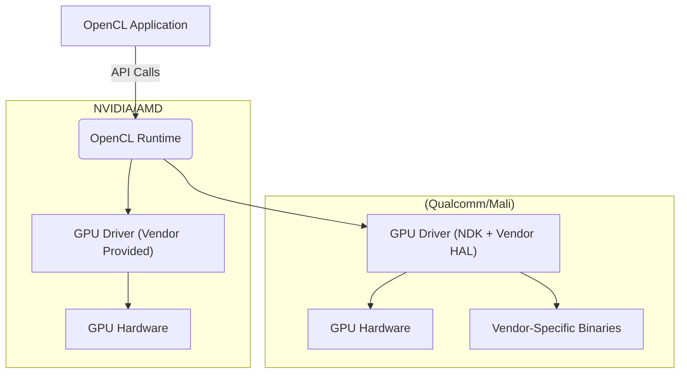
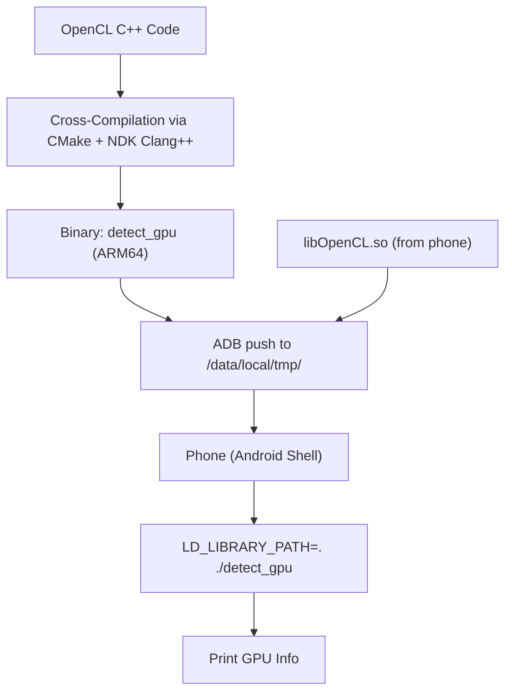

import Tabs from '@theme/Tabs';
import TabItem from '@theme/TabItem';
import AdBanner from '@site/src/components/AdBanner';

# Running OpenCL Code on Android Phones: GPU Detection Guide

**Previous Part**: [Running Your First OpenCL Code (Part 2a): Detecting GPU](https://www.compilersutra.com/docs/gpu/opencl/basic/running_first_opencl_code_part2_a)

In this hands-on tutorial, we'll bridge the gap between desktop and mobile development by:

- **Cross-compiling** OpenCL code for ARM architecture  
- **Deploying** executables to Android devices via ADB  
- **Detecting** phone GPU capabilities using native code  
- **Troubleshooting** common mobile OpenCL issues  

:::tip Why This Matters
Modern smartphones contain powerful GPUs (Adreno, Mali, PowerVR) capable of parallel computing. This guide unlocks their potential for:
- Machine learning inference
- Image/video processing
- Scientific computing
- Game engine development
:::

<div>
    <AdBanner />
</div>

## Table of Contents

1. [Mobile vs Desktop OpenCL: Key Differences](#mobile-vs-desktop-opencl-key-differences)
2. [Android Setup Checklist](#android-setup-checklist)
3. [Understanding the Toolchain](#understanding-the-toolchain)
4. [Cross-Compilation Walkthrough](#cross-compilation-walkthrough)
5. [Deployment and Execution](#build--deploy-on-android)
7. [Troubleshooting Guide](#troubleshooting-guide)
8. [Explore More Article](#whats-next)
8. [References](#7-references)

<div>
    <AdBanner />
</div>

## Mobile vs Desktop OpenCL: Key Differences

Before you run OpenCL code on a mobile device, it helps to understand how phones and desktops are different when it comes to GPU programming.

On a desktop, OpenCL support is typically provided by companies like **NVIDIA** or **AMD**, and you have access to large amounts of memory and powerful debugging tools.

But on **Android devices**, things work a bit differently:

* **GPU drivers** are provided by the hardware manufacturer usually **Qualcomm (Adreno)** or **ARM (Mali)**.
* **Memory is limited**, so you need to be careful with how much data your code uses.
* **Phones heat up quickly**, and this can slow things down (called **thermal throttling**).
* **Debugging is harder** you'll need tools like **ADB** and `logcat` to figure out what your code is doing.
* **Running OpenCL programs** on Android requires using the **NDK toolchain**, not just running a binary like on a PC.

Here’s a simple table comparing the two:

| Aspect                | Desktop                      | Android                       |
| --------------------- | ---------------------------- | ----------------------------- |
| OpenCL Implementation | Vendor-provided (NVIDIA/AMD) | Qualcomm/ARM-specific drivers |
| Memory Constraints    | Generous (GBs)               | Limited (100s of MB)          |
| Thermal Throttling    | Minimal                      | Frequent                      |
| Debugging Tools       | Easy: gdb, valgrind, etc.    | ADB, logcat                   |
| Binary Distribution   | Direct execution             | Requires NDK toolchain        |

> 📝 **Tip**: Always test your OpenCL code on actual hardware early. What works well on a PC might run slowly or fail completely on a phone due to these limitations.


<details>
<summary> Explanation</summary>

* **OpenCL Application**: Your C/C++ (or Java via JNI) code written to run on GPU.
* **OpenCL Runtime**: Common API provided by OpenCL spec (e.g., `clEnqueueNDRangeKernel`, `clBuildProgram`).
* On **Desktop**:

  * Runtime talks to **NVIDIA/AMD drivers**, which handle memory management, kernel compilation, and dispatch.
  * These drivers are robust, well-documented, and support high-performance desktop GPUs.
* On **Android**:

  * The runtime interacts with drivers via the **NDK and vendor HAL (Hardware Abstraction Layer)**.
  * These drivers are **closed-source** and vary between **Qualcomm (Adreno)** and **ARM (Mali)** GPUs.
  * You often need to compile with **NDK** and test on the device since toolchains are fragmented.

> 🔍 Unlike desktop OpenCL, on mobile devices you don’t get access to detailed driver logs or vendor-level tools so debugging is more “black box.”
</details>

<div>
    <AdBanner />
</div>


## Android Setup Checklist

Setting up your Android device properly is essential for debugging and deploying OpenCL binaries. Follow these steps to ensure your development environment is ready.


***1. Enable Developer Mode***

1. Open **Settings → About Phone**
2. Tap **Build Number** **seven times**
   → You’ll see: *“You are now a developer!”*
3. Return to **Settings → System → Developer Options**
   (On some devices, this may be under **Additional Settings**)


**2. Enable USB Debugging & Installation**

1. In **Developer Options**, enable:

   *  **USB Debugging**
   *  **Install via USB** *(if available on your device)*
2. Connect your Android phone to your development machine using a **USB cable**.

> 💡 Tip:
>
> * Use a **high-quality data cable** not just a charging cable to avoid connection issues.
> * After connecting, **pull down the notification shade** and change the USB mode from **“Charging only”** to **“File Transfer (MTP)”** or **“Transferring files”**.


***Verify ADB Connection***

Run the following command on your development machine:

```python
adb devices
```

Expected output:

```python
List of devices attached
ABCDEFGHIJK	device
```

If your device shows as `unauthorized`, follow these steps:

* 🔐 **Unlock your phone** and check for the **“Allow USB debugging?”** prompt
*  Tap **"Always allow from this computer"**
*  Tap **"Allow"**

***Troubleshooting***

* Still seeing *“unauthorized”*? Try:

  * Re-plugging the USB cable
  * Running `adb kill-server && adb start-server`
  * Ensuring the USB mode is set to **File Transfer**
* If your device doesn’t show up:

  * Check USB drivers (on Windows)
  * Ensure `adb` is in your system’s `$PATH`

<div>
    <AdBanner />
</div>

## Understanding the Toolchain

Our mobile OpenCL development pipeline looks like this:

```python
[OpenCL C++ Code] 
    ↓
[NDK Clang++ (Cross-Compile)] 
    ↓
[ARM Binary] 
    ↓
[ADB Push] 
    ↓
[Phone Execution]
```

This flow allows you to write OpenCL host code in C++, compile it for ARM (mobile), and execute it directly on your Android phone.


### Key Components:
1. **Android NDK** (Native Development Kit)
   - Provides ARM compilers and sysroot
   - Download from [Android Developer Site](https://developer.android.com/ndk)

2. **ADB** (Android Debug Bridge)
   - Command-line interface for Android devices
   - Part of Android Platform Tools

3. **libOpenCL.so**
   - Vendor-specific OpenCL library (usually at `/vendor/lib/libOpenCL.so` on device)

:::caution `Commonly used ADB commands:`

| Purpose                   | Command                                               |
| ------------------------- | ----------------------------------------------------- |
| List connected devices    | `adb devices`                                         |
| Push binary to device     | `adb push bin/detect_gpu /data/local/tmp/`            |
| Pull a file from device   | `adb pull /vendor/lib64/libOpenCL.so libs/arm64-v8a/` |
| Run binary on device      | `adb shell /data/local/tmp/detect_gpu`                |
| Launch interactive shell  | `adb shell`                                           |
| Check device architecture | `adb shell getprop ro.product.cpu.abi`                |
:::
:::tip push the so file from phone 
Vendor-specific OpenCL runtime.
Typically located at:
 - /vendor/lib64/libOpenCL.so (64-bit)
 - /vendor/lib/libOpenCL.so (32-bit)
```python
  adb pull /vendor/lib64/libOpenCL.so destination/path
```
:::


<div>
    <AdBanner />
</div>

##  Cross-Compilation Walkthrough


Cross-compilation means building an executable on one platform (like Linux or macOS) that runs on a different architecture or operating system (like Android on ARM). This is necessary because most Android phones use ARM64, and your laptop/PC likely runs on x86\_64.

> You **must** use the Android NDK toolchain to generate binaries that Android can execute.


<Tabs>
<TabItem value="manual" label="Manual Compilation">

### 🛠️ Manual Compilation Using NDK Clang++

```rust
export NDK="/Users/compile_sanatan/Library/Android/sdk/ndk/26.3.11579264" #path of downloaded ndk
$NDK/toolchains/llvm/prebuilt/linux-x86_64/bin/aarch64-linux-android21-clang++ \
  -I./opencl_headers \
  -L. \
  gpu_detection_using_opencl.cpp \
  -lOpenCL \
  -o detect_gpu
```

* `-I./opencl_headers`: Path to OpenCL headers (`CL/cl.h`, etc.)
* `-L.`: Current directory containing `libOpenCL.so`
* `-lOpenCL`: Link against OpenCL library

</TabItem>

<TabItem value="cmake" label="CMake Build (Recommended)">

###  CMakeLists.txt

```rust
cmake_minimum_required(VERSION 3.10)
project(OpenCLDetector)

#  Ensure Android toolchain is set
if(NOT ${CMAKE_SYSTEM_NAME} STREQUAL "Android")
  message(FATAL_ERROR
    "CMAKE_TOOLCHAIN_FILE not applied or invalid.\n"
    " Use: cmake .. -DCMAKE_TOOLCHAIN_FILE=../toolchain_android.cmake -G Ninja"
  )
endif()

#  Set standard and OpenCL version
set(CMAKE_CXX_STANDARD 11)
add_definitions(-DCL_TARGET_OPENCL_VERSION=120)

#  Include OpenCL headers
include_directories(${CMAKE_SOURCE_DIR}/opencl_headers)

#  Add executable
add_executable(detect_gpu gpu_detection_using_opencl.cpp)

# ✅ Link local Android libOpenCL.so
target_link_libraries(detect_gpu ${CMAKE_SOURCE_DIR}/libOpenCL.so)

```
</TabItem>

<TabItem value="android configuration" label="setting for android build system">
###  toolchain\_android.cmake

You can also move the toolchain configuration into a separate file:

```rust
# toolchain_android.cmake

# Set Android NDK path
set(ANDROID_NDK "/Users/compile_sanatan/Library/Android/sdk/ndk/26.3.11579264" CACHE STRING "")

# Set host tag
set(NDK_HOST_TAG "darwin-x86_64")

# Set Android target API level
set(ANDROID_API_LEVEL 21)

# Set ABI and triple
set(ANDROID_ABI "arm64-v8a")
set(ANDROID_TRIPLE "aarch64-linux-android")

# Required for Android builds
set(CMAKE_SYSTEM_NAME Android)
set(CMAKE_SYSTEM_VERSION ${ANDROID_API_LEVEL})
set(CMAKE_ANDROID_ARCH_ABI ${ANDROID_ABI})
set(CMAKE_ANDROID_NDK ${ANDROID_NDK})

# Set compiler paths
set(CMAKE_C_COMPILER   "${ANDROID_NDK}/toolchains/llvm/prebuilt/${NDK_HOST_TAG}/bin/${ANDROID_TRIPLE}${ANDROID_API_LEVEL}-clang")
set(CMAKE_CXX_COMPILER "${ANDROID_NDK}/toolchains/llvm/prebuilt/${NDK_HOST_TAG}/bin/${ANDROID_TRIPLE}${ANDROID_API_LEVEL}-clang++")

# Ensure target triple is set
set(CMAKE_C_FLAGS   "--target=${ANDROID_TRIPLE}${ANDROID_API_LEVEL}")
set(CMAKE_CXX_FLAGS "--target=${ANDROID_TRIPLE}${ANDROID_API_LEVEL}")
```
</TabItem>

</Tabs>

**Final Project Structure**

```rust
opencl_android/
├── CMakeLists.txt
├── detect_gpu
├── gpu_detection_using_opencl.cpp
├── libOpenCL.so   ← (pulled via: adb pull /vendor/lib64/libOpenCL.so)
├── toolchain_android.cmake
└── opencl_headers/   ← contains CL/
```

<div>
    <AdBanner />
</div>

##  Build & Deploy on Android


<Tabs groupId="build-method">

<TabItem value="build-deploy" label="Build + Deploy">

```bash
# 1. Create a build directory
mkdir -p build
```
<details>
<summary> before build creation </summary>

```rust
opencl_android/
├── CMakeLists.txt
├── detect_gpu
├── gpu_detection_using_opencl.cpp
├── libOpenCL.so   ← (pulled via: adb pull /vendor/lib64/libOpenCL.so)
├── toolchain_android.cmake
└── opencl_headers/   ← contains CL/
```
</details>
<details>
<summary> After  build directory creation </summary>

```rust
detect_gpu_Device_using_opencl/
├── CMakeLists.txt
├── build/
├── detect_gpu
├── gpu_detection_using_opencl.cpp
├── libOpenCL.so         # Pulled from device using adb pull
├── toolchain_android.cmake
└── opencl_headers/
    └── CL/              # OpenCL headers
```
</details>

```rust 
cd build
#Run CMake with the Android toolchain
cmake .. \
  -DCMAKE_TOOLCHAIN_FILE=../toolchain_android.cmake \
  -G Ninja
#  Compile using Ninja
ninja
```
Push the binary and OpenCL library to the phone
```rust
adb push detect_gpu /data/local/tmp/
adb push ../libOpenCL.so /data/local/tmp/
```
 Run with appropriate permissions and environment
```rust
adb shell "cd /data/local/tmp && chmod +x detect_gpu && LD_LIBRARY_PATH=. ./detect_gpu"
```

✅ **Expected Output**

```
[Platform] Qualcomm Snapdragon Compute
[Device] Adreno (TM) 660
  Compute Units: 1
```

</TabItem>

<TabItem value="note" label="ℹ️ Notes">

* The binary is built using **CMake + Ninja** and compiled for **ARM64 Android** using the NDK toolchain.
* `libOpenCL.so` is typically pulled from the phone using:

```bash
adb pull /vendor/lib64/libOpenCL.so
```

* Ensure the binary is placed in a writable path like `/data/local/tmp/`.

</TabItem>

</Tabs>

<div>
    <AdBanner />
</div>


## Troubleshooting Guide

<details>
<summary><b>1. Missing OpenCL Implementation</b></summary>

```bash
error: failed to load libOpenCL.so
```

**Fix:**

```bash
adb pull /vendor/lib64/libOpenCL.so
# Alternate paths to try:
# /system/vendor/lib64/libOpenCL.so
# /system/lib64/libOpenCL.so
# /vendor/lib/libOpenCL.so (32-bit devices)
```

</details>

---

<details>
<summary><b>2. Permission Denied</b></summary>

```bash
/data/local/tmp/detect_gpu: permission denied
```

**Fix:**

```bash
adb shell chmod 755 /data/local/tmp/detect_gpu
```

</details>

---

<details>
<summary><b>3. ADB Shows Unauthorized Device</b></summary>

```bash
adb devices
# shows: "unauthorized"
```

**Fix:**

* Check the phone screen for a "Allow USB Debugging?" prompt.
* Tap "Always allow from this computer" → Allow.
* Restart ADB:

```bash
adb kill-server
adb start-server
adb devices
```

</details>

---

<details>
<summary><b>4. Binary Not Found or Executable</b></summary>

```bash
./detect_gpu: No such file or directory
```

**Fix:**

* Ensure binary is pushed to correct path:

```bash
adb push detect_gpu /data/local/tmp/
```

* Check architecture mismatch:

```bash
file detect_gpu
```

Expected: `ELF 64-bit LSB executable, ARM aarch64`

If not ARM-based, recompile with `aarch64-linux-android21-clang++`

</details>

---

<details>
<summary><b>5. Device Not Listed in adb devices</b></summary>

```bash
adb devices
# shows no device
```

**Fix:**

* Use a proper **data cable**, not a charge-only cable.
* Set phone to **File Transfer (MTP)** mode.
* Enable **Developer Mode → USB Debugging**.

</details>

---

<details>
<summary><b>6. GLIBC or stdlib++ Compatibility Errors</b></summary>

```bash
FATAL: kernel too old
```

**Fix:**

Add static linking during compilation:

```bash
-static-libstdc++ -static-libgcc
```

</details>

---

<details>
<summary><b>7. ADB Push/Install Fails</b></summary>

```bash
adb: error: failed to copy
```

**Fix:**

* Reconnect USB cable.
* Run:

```bash
adb kill-server
adb start-server
```

* Ensure file/directory exists on host machine.

</details>

---

<details>
<summary><b>8. detect_gpu Crashes Immediately</b></summary>

No output, just exits.

**Fix:**

* Add logging or `printf` statements at program entry.
* Use:

```bash
adb logcat | grep detect_gpu
```

To capture runtime crash logs.

</details>

---

<details>
<summary><b>9. Library Loaded But Functions Missing</b></summary>

```bash
undefined reference to 'clGetPlatformIDs'
```

**Fix:**

* Your `libOpenCL.so` might be a stub or invalid.
* Check symbols:

```bash
adb shell "strings /vendor/lib64/libOpenCL.so | grep clGetPlatformIDs"
```

If empty, try another device or vendor-specific SDK.

</details>

---

<details>
<summary><b>10. OpenCL Runtime Works, But No Devices Detected</b></summary>

Program runs, but returns `0 platforms found`.

**Fix:**

* Verify GPU has OpenCL support.
* Some devices require app to run with system permissions.
* Try using **NDK native activity** or deploying via Android app.

</details>

---

<details>
<summary><b>11. `ld: cannot find -lOpenCL` at compile time</b></summary>

**Fix:**

* Ensure library path is set:

```bash
-L./libs/arm64-v8a -lOpenCL
```

* Check that `libOpenCL.so` exists at the specified path.

</details>

---

<details>
<summary><b>12. ADB Shell Cannot Find Library</b></summary>

```bash
CANNOT LINK EXECUTABLE "./detect_gpu": library "libOpenCL.so" not found
```

**Fix:**

* Set runtime path via `LD_LIBRARY_PATH`:

```bash
adb shell "cd /data/local/tmp && LD_LIBRARY_PATH=. ./detect_gpu"
```

</details>

---

<details>
<summary><b>13. Build Fails: Unsupported architecture</b></summary>

```bash
error: unsupported target 'x86_64-linux-android'
```

**Fix:**

* Set correct target for your phone:

```bash
aarch64-linux-android21-clang++ ...
```

* Or update your `CMakeLists.txt` / `toolchain_android.cmake` properly.

</details>

<div>
    <AdBanner />
</div>

 ## What’s Next

Now that you can query GPU info, the next step is to:

* Create a context and command queue
* Write and build OpenCL kernels
* Transfer data between host and device
* Execute kernels and read back results

Stay tuned for the next article: ***"Running Your First Kernel with OpenCL in C++"***.

<Tabs>
  <TabItem value="docs" label="📚 Documentation">
             - [CompilerSutra Home](https://compilersutra.com)
                - [CompilerSutra Homepage (Alt)](https://compilersutra.com/)
                - [Getting Started Guide](https://compilersutra.com/get-started)
                - [Newsletter Signup](https://compilersutra.com/newsletter)
                - [Skip to Content (Accessibility)](https://compilersutra.com#__docusaurus_skipToContent_fallback)


  </TabItem>

  <TabItem value="tutorials" label="📖 Tutorials & Guides">

        - [AI Documentation](https://compilersutra.com/docs/Ai)
        - [DSA Overview](https://compilersutra.com/docs/DSA/)
        - [DSA Detailed Guide](https://compilersutra.com/docs/DSA/DSA)
        - [MLIR Introduction](https://compilersutra.com/docs/MLIR/intro)
        - [TVM for Beginners](https://compilersutra.com/docs/tvm-for-beginners)
        - [Python Tutorial](https://compilersutra.com/docs/python/python_tutorial)
        - [C++ Tutorial](https://compilersutra.com/docs/c++/CppTutorial)
        - [C++ Main File Explained](https://compilersutra.com/docs/c++/c++_main_file)
        - [Compiler Design Basics](https://compilersutra.com/docs/compilers/compiler)
        - [OpenCL for GPU Programming](https://compilersutra.com/docs/gpu/opencl)
        - [LLVM Introduction](https://compilersutra.com/docs/llvm/intro-to-llvm)
        - [Introduction to Linux](https://compilersutra.com/docs/linux/intro_to_linux)

  </TabItem>

  <TabItem value="assessments" label="📝 Assessments">

        - [C++ MCQs](https://compilersutra.com/docs/mcq/cpp_mcqs)
        - [C++ Interview MCQs](https://compilersutra.com/docs/mcq/interview_question/cpp_interview_mcqs)

  </TabItem>

  <TabItem value="projects" label="🛠️ Projects">

            - [Project Documentation](https://compilersutra.com/docs/Project)
            - [Project Index](https://compilersutra.com/docs/project/)
            - [Graphics Pipeline Overview](https://compilersutra.com/docs/The_Graphic_Rendering_Pipeline)
            - [Graphic Rendering Pipeline (Alt)](https://compilersutra.com/docs/the_graphic_rendering_pipeline/)

  </TabItem>

  <TabItem value="resources" label="🌍 External Resources">

            - [LLVM Official Docs](https://llvm.org/docs/)
            - [Ask Any Question On Quora](https://compilersutra.quora.com)
            - [GitHub: FixIt Project](https://github.com/aabhinavg1/FixIt)
            - [GitHub Sponsors Page](https://github.com/sponsors/aabhinavg1)

  </TabItem>

  <TabItem value="social" label="📣 Social Media">

            - [🐦 Twitter - CompilerSutra](https://twitter.com/CompilerSutra)
            - [💼 LinkedIn - Abhinav](https://www.linkedin.com/in/abhinavcompilerllvm/)
            - [📺 YouTube - CompilerSutra](https://www.youtube.com/@compilersutra)

  </TabItem>
</Tabs>


<div>
    <AdBanner />
</div>

## 7. References

<Tabs>
  <TabItem value="resource1" label="1. 3D Game Engine Programming">

  ### 🔗 [Introduction to OpenCL – 3D Game Engine Programming](https://www.3dgep.com/introduction-to-opencl/)

  **Summary**:  
  A beginner-friendly tutorial that introduces the OpenCL platform and device model with clear C++ examples.

  **Details**:
  - Explains the concept of platforms and devices in OpenCL
  - Shows how to use `clGetPlatformIDs`, `clGetDeviceIDs`, and `clGetDeviceInfo`
  - Walks through writing and executing your first OpenCL program
  - Ideal for developers starting OpenCL with a C++ background

  </TabItem>

  <TabItem value="resource2" label="2. Bit-Brick Guide">

  ### 🔗 [OpenCL Programming Guide – Bit-Brick Documentation](https://docs.bit-brick.com/docs/k1/software/graphics/openCL_programming_guide)

  **Summary**:  
  A practical guide to implementing OpenCL in real-world projects.

  **Details**:
  - Covers platform/device detection and context creation
  - Guides you through kernel compilation and execution
  - Good for embedded system developers or those integrating OpenCL in production tools

  </TabItem>

  <TabItem value="resource3" label="3. Khronos Specification">

  ### 🔗 [The OpenCL Specification – Khronos Group](https://registry.khronos.org/OpenCL/specs/3.0-unified/html/OpenCL_API.html)

  **Summary**:  
  The official API specification for OpenCL 3.0 maintained by Khronos.

  **Details**:
  - Contains exhaustive documentation of all OpenCL functions
  - Use this for function syntax, data types, and compliance
  - Essential for developers building cross-vendor tools and debugging at API level

  </TabItem>

  <TabItem value="resource4" label="4. Khronos Main Site">

  ### 🔗 [Khronos Group OpenCL Resources](https://www.khronos.org/opencl/)

  **Summary**:  
  The official landing page for all things OpenCL.

  **Details**:
  - News, SDK downloads, and conformance tools
  - Links to vendor-specific OpenCL implementations (NVIDIA, Intel, AMD)
  - Entry point for both specification and community resources

  </TabItem>

  <TabItem value="resource5" label="5. Codeplay GitHub SDK">

  ### 🔗 [OpenCL SDK Examples – Codeplay ComputeCpp](https://github.com/codeplaysoftware/computecpp-sdk)

  **Summary**:  
  A GitHub repo containing real-world OpenCL sample code using CMake.

  **Details**:
  - Discover platforms and devices using C++
  - Build and execute OpenCL kernels with ComputeCpp
  - Useful for setting up SDK projects and understanding integration

  </TabItem>
</Tabs>

:::tip
> These references provide **both theoretical depth** and **hands-on implementation** support.         
> Start with **official docs** for correctness and use tutorial articles for guided learning.
:::

