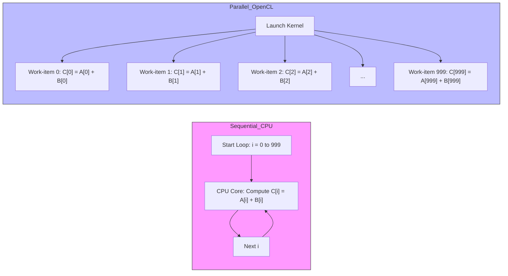
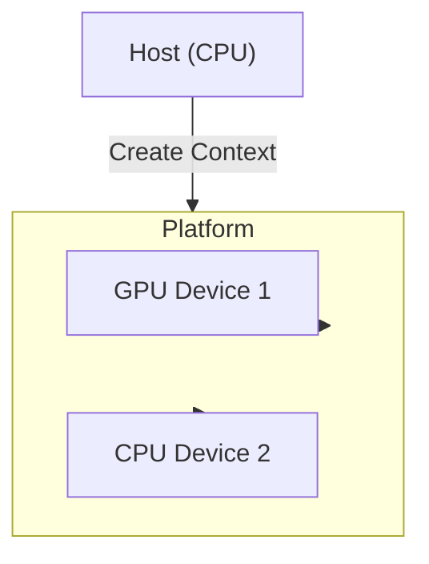
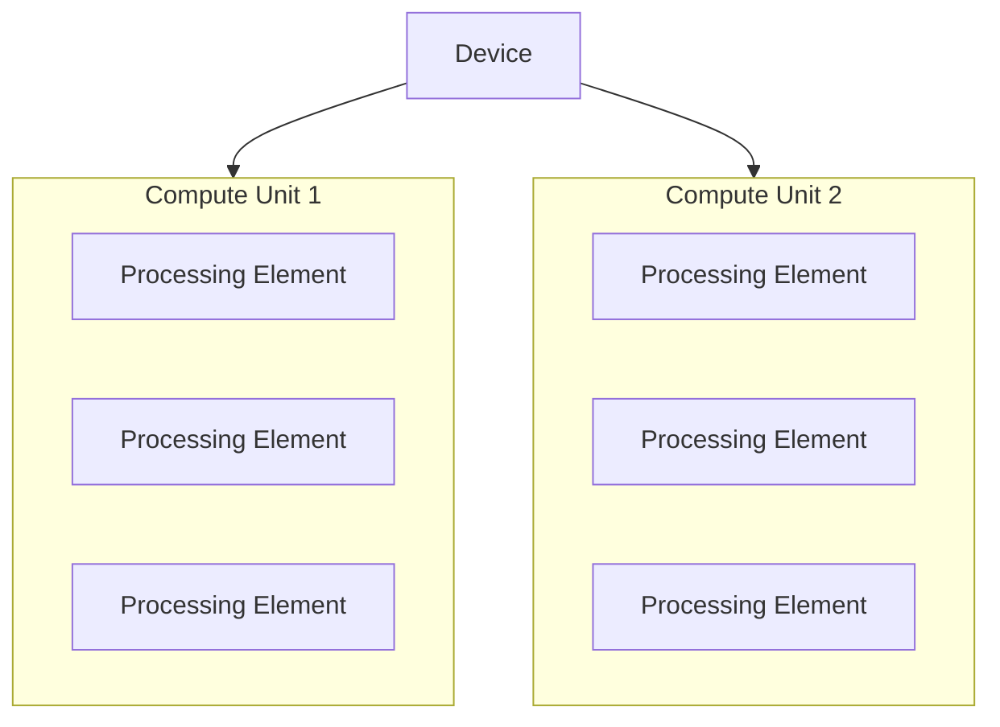
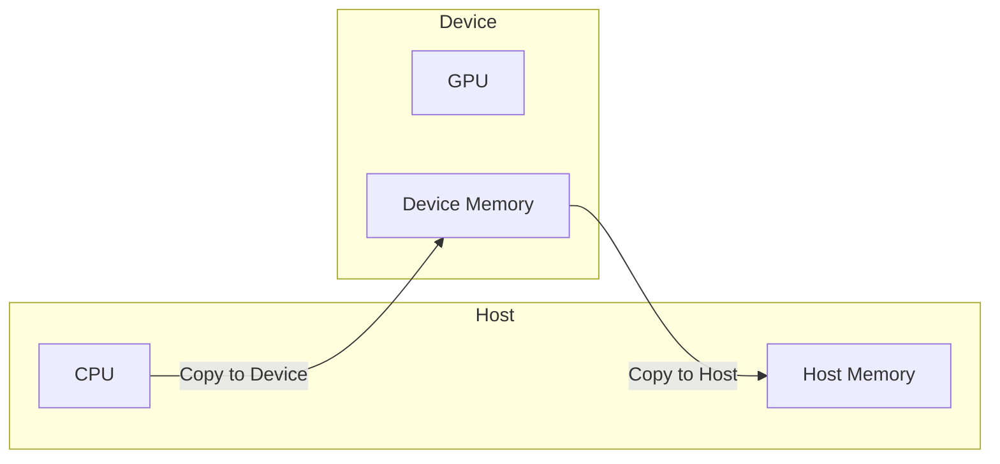

import Tabs from '@theme/Tabs';
import TabItem from '@theme/TabItem';
import AdBanner from '@site/src/components/AdBanner';


#  Beginner to Expert Guide: Running Your First OpenCL Hello World Program

<div>
    <AdBanner />
</div>

     
 Welcome to your first step into the world of **OpenCL** — a powerful framework that allows you to write programs capable of running on heterogeneous computing devices such as CPUs, GPUs, and other accelerators.

This guide is designed to take you from a basic understanding of how OpenCL works to confidently writing and running your first “Hello World” program using OpenCL on your local system.

## About This Series

This is **Part 1** of a two-part series designed to help you run a basic OpenCL program on your system.

- **Part 1 – Theoretical Foundation**: This part focuses on building a solid understanding of key OpenCL concepts such as kernels, platform and device models, memory management, and host-device interactions.
- **Part 2 – Practical Implementation**: In the next part, we will apply what we've learned by writing, compiling, and executing a complete OpenCL program.

By separating the theory from the implementation, this series ensures you understand the **why** before learning the **how**, which is especially important when dealing with parallel computing and hardware-level programming.

## Prerequisites

To follow along, you should have already completed the following:

- [Setting up OpenCL on your system](https://www.compilersutra.com/docs/gpu/opencl/basic/setting_up_opencl)
- [Reading the introduction to OpenCL](https://compilersutra.com/docs/gpu/opencl/basic/what_is_opencl)

These resources help ensure your system is properly configured and that you are familiar with the motivation behind using OpenCL.

## What You Will Learn in This Guide

In Part 1, you will:

1. [What is a Kernel in OpenCL?](#1️⃣-what-is-a-kernel-in-opencl)  
   Understand what a kernel is, how it is defined in OpenCL, and its role in data-parallel computing.

2. [Why Do We Need a Kernel?](#2️⃣-why-do-we-need-a-kernel)  
   Learn why sequential code falls short for large datasets and how OpenCL kernels solve this problem through parallelism.

3. [OpenCL Platform Model Explained](#3️⃣-opencl-platform-model-explained)  
   Explore how the host, platform, devices, contexts, and command queues work together in a layered architecture.

4. [OpenCL Device Model Overview](#4️⃣-opencl-device-model-overview)  
   Gain insight into how a device like a GPU is structured internally with compute units and processing elements.

5. [Context: How CPU and GPU Share Data](#5️⃣-context-how-cpu-and-gpu-share-data  )  
   Understand how memory is managed between host and device, and how efficient data transfer is crucial to performance.


By the end of this part, you will have the theoretical knowledge needed to move forward and write your first OpenCL program with confidence.

<details> 
<summary> Who This Guide Is For </summary>

:::caution For Whom? 
This guide is intended for:

- Developers new to OpenCL who want to understand the fundamentals before jumping into code
- Students or professionals looking to leverage parallel computing in their applications
- Anyone interested in exploring GPU computing using a cross-platform, open standard

:::
</details>
---

Let’s begin by exploring the building blocks of OpenCL starting with kernels, execution models, and how devices communicate with each other.

---

:::note
> Whether you're exploring parallel computing or targeting heterogeneous devices,  this article is the perfect launchpad.
:::

<p>
  🎥 <strong>Watch the tutorial playlist</strong>: 
  <a href="https://www.youtube.com/watch?v=WstjeANBXX4&list=PLdhENd4XPZLrVmQNquEN3BUPjfwvxu9nQ&index=5" target="_blank">
    CompilerSutra OpenCL Series
  </a>
</p>

<div style={{ marginTop: '20px', display: 'flex', justifyContent: 'center' }}>
  <iframe 
    width="560" 
    height="315" 
    src="https://www.youtube.com/embed/WstjeANBXX4?autoplay=0&mute=1&list=PLdhENd4XPZLrVmQNquEN3BUPjfwvxu9nQ&index=5" 
    title="CompilerSutra OpenCL Playlist" 
    frameborder="0" 
    allow="accelerometer; autoplay; clipboard-write; encrypted-media; gyroscope; picture-in-picture; web-share" 
    allowfullscreen>
  </iframe>
</div>


<div>
    <AdBanner />
</div>


## 📚 Table of Contents

1. [What is a Kernel in OpenCL?](#1️⃣-what-is-a-kernel-in-opencl)
2. [Why Do We Need a Kernel?](#2️⃣-why-do-we-need-a-kernel)
3. [OpenCL Platform Model Explained](#3️⃣-opencl-platform-model-explained)
4. [OpenCL Device Model Overview](#4️⃣-opencl-device-model-overview)
5. [Context: How CPU and GPU Share Data](#5️⃣-context-how-cpu-and-gpu-share-data)
6. [Sample Hello World Host Code (C)](#✅-sample-hello-world-host-code-c)
7. [Comparison: OpenCL vs CUDA vs CPU](#📊-comparison-opencl-vs-cuda-vs-cpu)
8. [Ready to Run your First Opencl ](#ready-to-code-heres-whats-next)
9. [More Artilces](#more-articles)

<div>
    <AdBanner />
</div>


## 1️⃣ What is a Kernel in OpenCL?

A **kernel** in OpenCL is a function written in **OpenCL C** that is designed to execute on a **compute device**,  such as a **GPU**,  **multicore CPU**,  or other accelerators.

Kernels are the foundation of OpenCL’s parallel computing model. They enable developers to define **data-parallel operations**,  allowing **thousands of compute elements** to work on large datasets **simultaneously**,  significantly accelerating computation.

### Key Features

* **Parallel Execution**: Kernels are designed to run in parallel across many data elements,  utilizing the massive parallelism offered by modern GPUs and CPUs.
* **Cross-Device Compatibility**: A single kernel can be executed on various OpenCL-compatible devices,  ensuring broad hardware support.
* **Work-Items**: Kernels are executed over a range of **independent work-items**,  with each work-item responsible for processing a portion of the data.

### Syntax Example

OpenCL kernels are defined using the `__kernel` qualifier:

```c
__kernel void add_vectors(__global const float* A, 
                          __global const float* B, 
                          __global float* result) {
    int i = get_global_id(0);
    result[i] = A[i] + B[i];
}
```

In this example:

* `__kernel` identifies the function as an OpenCL kernel.
* Each work-item computes the sum of the corresponding elements in vectors `A` and `B`,  storing the result in `result[i]`.

---

:::caution More about kernel
Kernels are a core concept in OpenCL that enable scalable and high-performance parallel computing across a wide range of hardware platforms.


Kernels are declared with the `__kernel` qualifier and executed over a range of independent work-items,  each responsible for a portion of the data.
:::

<details>
<summary>🧠 More about Kernels</summary>

Think of a kernel as a C-like function that you want to execute in parallel. Kernels are declared using the `__kernel`  keyword and are designed to run across multiple work-items. 

Each work-item is an independent thread of execution with a unique ID,  obtained using functions like `get_global_id(0)`. 

This ID helps divide the overall task into smaller parts,  with each work-item handling a specific piece of data. using the `__kernel` keyword and are designed to run across multiple work-items.

 Each work-item is an independent thread of execution with a unique ID,  obtained using functions like `get_global_id(0)`. This ID helps divide the overall task into smaller parts,  with each work-item handling a specific piece of data.

</details>


<div>
    <AdBanner />
</div>


## 2️⃣ Why Do We Need a Kernel?

In ***high-performance and data-parallel computing***,  traditional sequential programming approaches often become bottlenecks. To overcome these limitations and fully utilize hardware capabilities,  **OpenCL kernels** are used to execute code in parallel across multiple processing units like GPU cores.

### Conceptual Overview

A **kernel** in OpenCL is a small function designed to operate on a single element of data. When launched,  it gets executed by many **work-items** (lightweight threads) in parallel. This approach allows us to process large datasets efficiently.

### Why Sequential Code Falls Short

Imagine you're adding two arrays `A` and `B`,  each of size 1000,  and storing the result in array `C`. A basic C++ approach would look like this:

<Tabs>
<TabItem value="C++ (Sequential)" label="C++ (Sequential)" default>

```cpp
for (int i = 0; i < 1000; ++i) {
    C[i] = A[i] + B[i];
}
```

</TabItem>

<TabItem value="OpenCL (Parallel)" label="OpenCL (Parallel)">

```c
__kernel void vector_add(__global const float* A, 
                         __global const float* B, 
                         __global float* C) {
    int id = get_global_id(0);
    C[id] = A[id] + B[id];
}
```

</TabItem>
</Tabs>


<details>
<summary> Digram explanation with real life example </summary>

##### Diagram Explanation: Sequential vs Parallel Execution

To better understand the two approaches,  consider this real-life analogy:

Imagine you need to address and seal 1000 envelopes for a mail campaign.

##### Sequential_CPU Block

- **Analogy**: One person (the CPU core) sits at a desk and processes each envelope one at a time, writes the address,  seals it,  and then moves to the next. Even if this person is fast,  it will still take significant time to complete all 1000 envelopes.

- **Technical View**:
  - **Start Loop (i = 0 to 999)**: The CPU begins a loop to handle each operation.
  - **Compute `C[i] = A[i] + B[i]`**: At each iteration,  a single addition is performed.
  - **Next i**: Once the current addition is done,  the CPU moves to the next index.
  - This happens sequentially, **one step at a time**, using a single CPU thread or core.

##### Parallel_OpenCL Block

- **Analogy**: Instead of one person,  you now have 1000 workers,  each with their own desk. Every worker is responsible for addressing and sealing exactly one envelope. All workers start at the same time,  and the entire job is completed almost instantly.

- **Technical View**:
  - **Launch Kernel**: The OpenCL kernel is dispatched on the GPU.
  - **Work-item 0 to Work-item 999**: Each work-item independently computes one result:  
    - Work-item 0 does `C[0] = A[0] + B[0]`  
    - Work-item 1 does `C[1] = A[1] + B[1]`  
    - ...  
    - Work-item 999 does `C[999] = A[999] + B[999]`
  - All work-items run simultaneously across multiple GPU compute units.

##### Summary

| Aspect              | Sequential CPU                          | Parallel OpenCL (GPU)               |
|---------------------|------------------------------------------|-------------------------------------|
| Real-life analogy   | One person sealing 1000 envelopes        | 1000 people sealing 1 envelope each |
| Execution model     | One step at a time                       | Thousands of steps at once          |
| Efficiency          | Slower as data size grows                | Fast and scalable                   |
| Hardware usage      | One core                                 | Hundreds or thousands of cores      |

### Key Takeaway

Sequential code is like working alone on a large task, it works,  but it's slow.  
Parallel execution using OpenCL kernels is like dividing the work among many workers,  completing the same task much faster and more efficiently.

</details>

### The Kernel Advantage

Using an OpenCL kernel,  **each addition can be handled by a different work-item** running on a GPU. Instead of 1000 cycles (one per addition),  you can ideally complete the operation in just **one cycle**, **if enough compute units are available**.

#### Key Elements in OpenCL Kernel

| Term               | Description                                   |
| ------------------ | --------------------------------------------- |
| `__kernel`         | Marks the function as a kernel for the device |
| `__global`         | Qualifies pointers to global memory           |
| `get_global_id(0)` | Retrieves the unique ID of the work-item      |

Each invocation of the kernel handles one index,  allowing massive **parallelism**.

##### Benefits of Using Kernels

* ✅ **Massive Parallelism**: Thousands of threads run simultaneously
* ✅ **Hardware Utilization**: Maximizes GPU compute resources
* ✅ **Scalability**: Easily handles large datasets
* ✅ **Portability**: Runs across CPU,  GPU,  and even FPGAs

##### Summary: Sequential vs Parallel

| Feature         | Sequential CPU            | OpenCL Kernel (GPU)         |
| --------------- | ------------------------- | --------------------------- |
| Execution Model | One instruction at a time | Thousands in parallel       |
| Performance     | Slower for large data     | Highly efficient & scalable |
| Resource Usage  | Single thread/core        | Hundreds/thousands of cores |

##### Final Takeaway

OpenCL kernels aren’t just about speed. They’re about **portable,  scalable parallelism**. Whether you're dealing with **scientific data,  machine learning,  or media processing**,  kernels let you **tap into the full potential of modern hardware**.

Think of a kernel as a **tiny function** that runs **simultaneously thousands of times**, compact,  elegant,  and powerful.

<div>
    <AdBanner />
</div>


## 3️⃣ OpenCL Platform Model Explained

After understanding what a kernel is and why it's needed,  the next logical step is to understand the **OpenCL Platform Model**. This model defines how a host (typically a CPU) coordinates with various compute devices (like GPUs or other CPUs) to execute parallel workloads efficiently.

##### 🔍 Theoretical Overview

The OpenCL platform model is based on a hierarchy of computational components:

* **Host**: The CPU that runs your main application and controls OpenCL execution.
* **Platform**: An abstraction provided by a vendor (e.g.,  Intel,  AMD,  NVIDIA). A system can have multiple OpenCL platforms.
* **Device**: Each platform may have one or more devices,  which can be CPUs,  GPUs,  FPGAs,  etc.
* **Context**: A context links the host and a set of devices. It's used to manage memory,  programs,  and command queues.
* **Command Queue**: Used by the host to send commands to a specific device,  such as kernel execution or memory transfers.

##### 📊 OpenCL Platform Architecture Diagram



##### Real-World Analogy

Imagine you're a **project manager (Host)** working with multiple **specialized teams (Devices)** under a **vendor's branch office (Platform)**. You define a **workspace (Context)** where tasks are organized and assigned to the teams through **task queues (Command Queues)**. Each team can work on different parts of a large project (kernel execution),  and the manager collects the results.

##### 💡 Summary

The platform model abstracts the complexity of heterogeneous computing devices. It lets developers write code that is portable and scalable across different vendor hardware. This separation of concerns enables OpenCL to serve as a unified programming framework for CPUs,  GPUs,  and other accelerators.

<details>
<summary>  Mapping Analogy to OpenCL API </summary>
| Role                     | Real World Term        | OpenCL API Object          | Description                                                                 |
|--------------------------|------------------------|-----------------------------|-----------------------------------------------------------------------------|
| Vendor Branch Office     | Platform               | `cl_platform_id`            | Represents the vendor-specific implementation (Intel,  AMD,  NVIDIA,  etc.)   |
| Specialized Teams        | Device                 | `cl_device_id`              | Actual computing units like CPU,  GPU,  FPGA,  etc.                           |
| Project Workspace        | Context                | `cl_context`                | Execution environment for managing resources between host and devices.     |
| Task Assignment Queue    | Command Queue          | `cl_command_queue`          | Queue used to send commands (kernels,  memory operations) to a device.      |
| Project Manager          | Host                   | Host Code (C/C++ + OpenCL)  | manages tasks,  sets up environment,  compiles and dispatches kernels.  |
| Task                     | Kernel                 | `cl_kernel`                 | Function written in OpenCL C that runs on devices.                         |
| Task Instructions        | Program                | `cl_program`                | Compiled kernel code loaded into a context.                                |
| Work Instructions        | NDRange / Work-Items   | `clEnqueueNDRangeKernel`    | Execution configuration for parallel processing.                           |

---

##### 💡 Summary

The **platform model** abstracts the complexity of heterogeneous computing devices.  
It allows developers to write code that is **portable and scalable** across different vendor hardware.

This **separation of concerns** enables OpenCL to serve as a **unified programming framework** for CPUs,  GPUs,  and other accelerators.

---

#####  Conceptual Analogy

To better understand how OpenCL components interact:

- The **Platform Model** sets the stage by providing the structure and available resources.
- The **Host** acts as the director,  orchestrating the flow and issuing commands.
- The **Kernel** is the actual performance being executed by the compute devices.

---

##### 🛠️ Next Steps

A solid understanding of this model is **crucial before diving** into:

- Buffer management (`clCreateBuffer`,  `clEnqueueReadBuffer`,  etc.)
- Kernel compilation (`clCreateProgramWithSource`,  `clBuildProgram`)
- Command scheduling (`clEnqueueNDRangeKernel`,  etc.)

</details>

> A solid understanding of this model is crucial before diving into buffer management,  kernel compilation,  or command scheduling in OpenCL.

:::tip Conceptual Analogy

To better understand how the components of OpenCL interact:

- The **Platform Model** sets the stage by providing the structure and resources.
- The **Host** acts as the director,  manages the flow and issuing commands.
- The **Kernel** is the actual performance being executed by the compute devices.

This analogy helps clarify that while the platform enables execution,  the kernel is where computation happens,  and the host manages everything from the top.

:::


<div>
    <AdBanner />
</div>


## 4️⃣ OpenCL Device Model Overview

Once the platform is selected and the context is created,  the next level of understanding focuses on the **Device Model**, how an individual compute device (like a GPU) is internally organized to execute workloads in parallel.

---

#### 🔍 Theoretical Overview

The OpenCL **Device Model** describes how compute devices are structured internally:

* **Device**: A compute unit capable of running kernels (e.g.,  a GPU).
* **Compute Units (CUs)**: Each device consists of multiple compute units (like GPU cores).
* **Processing Elements (PEs)**: Each compute unit contains multiple processing elements,  which are the actual ALUs that perform computations.

Kernels are executed across multiple **work-items**,  which are grouped into **work-groups**. These are then scheduled onto compute units,  with work-items assigned to processing elements.

---

#### 📊 OpenCL Device Architecture Diagram



---

:::caution Mapping to OpenCL Execution

| OpenCL Term        | Hardware/Conceptual Equivalent | Description                                       |
| ------------------ | ------------------------------ | ------------------------------------------------- |
| `cl_device_id`     | Device                         | Represents the physical or logical compute device |
| Compute Unit       | SIMD Core or GPU Core          | Schedules and executes work-groups                |
| Processing Element | ALU or execution lane          | Executes individual work-items                    |
| Work-Item          | Thread                         | Executes a single kernel instance                 |
| Work-Group         | Thread Block                   | Group of work-items executed together             |
:::
---

##### Real-World Analogy

Imagine a **manufacturing plant (Device)**:

* It has multiple **workstations (Compute Units)**.
* Each workstation has several **workers (Processing Elements)**.
* The **task list (Kernel)** is divided into **mini-tasks (Work-Items)** grouped into **teams (Work-Groups)**.
* Each team is assigned to a workstation,  and workers handle mini-tasks in parallel.

This structure allows a large job to be processed efficiently in parallel,  leveraging all available compute power.

---

##### 💡 Summary

The **Device Model** in OpenCL breaks down how parallel tasks are physically distributed within a compute device. It provides the mental model necessary to:

* Tune performance by choosing optimal **work-group sizes**
* Understand **memory hierarchy** and **synchronization scopes**
* Design kernels that effectively map to hardware capabilities

This model is crucial for writing efficient,  hardware-aware OpenCL programs that scale well across a variety of compute devices.

---

## 5️⃣ Context: How CPU and GPU Share Data

Understanding how the **host (CPU)** and **device (GPU)** share data is vital for writing efficient OpenCL programs. Memory transfers between host and device can be a major performance bottleneck if not managed correctly.

---

##### 🔍 Theoretical Overview

OpenCL defines different **memory regions** to facilitate data sharing:

* **Host Memory**: The RAM accessible by the CPU.
* **Device Memory**: High-speed memory accessible only by the GPU.
* **Shared Memory (Unified Memory)**: Some systems support a shared memory region accessible by both CPU and GPU.

Data transfer between host and device is performed using OpenCL APIs like `clEnqueueWriteBuffer` and `clEnqueueReadBuffer`. The developer must explicitly manage this data movement unless unified memory is supported.

---

##### 📊 Memory Access Model Diagram



---

:::caution 🛠️ Key OpenCL Functions for Data Sharing

| API Function           | Purpose                                               |
| ---------------------- | ----------------------------------------------------- |
| `clCreateBuffer`       | Allocates memory buffer in device memory              |
| `clEnqueueWriteBuffer` | Transfers data from host to device                    |
| `clEnqueueReadBuffer`  | Transfers data from device to host                    |
| `clEnqueueMapBuffer`   | Maps a device buffer to host address space for access |
| `clSetKernelArg`       | Binds a memory buffer to a kernel                     |
:::
---

##### Real-World Analogy

Think of the CPU as a **head office** and the GPU as a **factory**:

* The head office prepares **documents (data)** and sends them to the factory.
* The factory **processes** those documents and returns the results.
* The exchange requires **shipping time (data transfer)** which can delay the project.

Optimizing this shipping process, by reducing the number of transfers or using faster channels, improves overall productivity.

---

##### Summary

Efficiently managing data between host and device is key to performance:

* Minimize host-device data transfers.
* Batch data transfers wherever possible.
* Use **pinned** or **mapped memory** to reduce latency.

Understanding this context allows developers to build OpenCL applications that better utilize the memory bandwidth and reduce bottlenecks in compute-intensive applications.

<div>
    <AdBanner />
</div>


## Ready to Code? Here's What's Next!

Now that you've built a solid foundation in OpenCL's core concepts — **kernels**, **platform/device models**, **parallelism**, and **memory sharing** — you're ready to take the next step.

### 🎯 In the next tutorial

We'll move from **theory to practice** and write a **complete OpenCL "Hello World" program in C**, compiling and running it on real hardware (CPU or GPU).

We'll walk through:

- Creating memory **buffers** and writing initial data from the host
- **Compiling** an OpenCL kernel at runtime using `clCreateProgramWithSource` and `clBuildProgram`
- **Executing** the kernel using `clEnqueueNDRangeKernel`
- **Reading results** back to the host with `clEnqueueReadBuffer`

---

📌 **Up Next**: Start coding your first real OpenCL program — the classic Hello World, but this time on a GPU or multicore CPU.


<div>
    <AdBanner />
</div>


## More Articles

<Tabs>
  <TabItem value="docs" label="📚 Documentation">
             - [CompilerSutra Home](https://compilersutra.com)
                - [CompilerSutra Homepage (Alt)](https://compilersutra.com/)
                - [Getting Started Guide](https://compilersutra.com/get-started)
                - [Newsletter Signup](https://compilersutra.com/newsletter)
                - [Skip to Content (Accessibility)](https://compilersutra.com#__docusaurus_skipToContent_fallback)


  </TabItem>

  <TabItem value="tutorials" label="📖 Tutorials & Guides">

        - [AI Documentation](https://compilersutra.com/docs/Ai)
        - [DSA Overview](https://compilersutra.com/docs/DSA/)
        - [DSA Detailed Guide](https://compilersutra.com/docs/DSA/DSA)
        - [MLIR Introduction](https://compilersutra.com/docs/MLIR/intro)
        - [TVM for Beginners](https://compilersutra.com/docs/tvm-for-beginners)
        - [Python Tutorial](https://compilersutra.com/docs/python/python_tutorial)
        - [C++ Tutorial](https://compilersutra.com/docs/c++/CppTutorial)
        - [C++ Main File Explained](https://compilersutra.com/docs/c++/c++_main_file)
        - [Compiler Design Basics](https://compilersutra.com/docs/compilers/compiler)
        - [OpenCL for GPU Programming](https://compilersutra.com/docs/gpu/opencl)
        - [LLVM Introduction](https://compilersutra.com/docs/llvm/intro-to-llvm)
        - [Introduction to Linux](https://compilersutra.com/docs/linux/intro_to_linux)

  </TabItem>

  <TabItem value="assessments" label="📝 Assessments">

        - [C++ MCQs](https://compilersutra.com/docs/mcq/cpp_mcqs)
        - [C++ Interview MCQs](https://compilersutra.com/docs/mcq/interview_question/cpp_interview_mcqs)

  </TabItem>

  <TabItem value="projects" label="🛠️ Projects">

            - [Project Documentation](https://compilersutra.com/docs/Project)
            - [Project Index](https://compilersutra.com/docs/project/)
            - [Graphics Pipeline Overview](https://compilersutra.com/docs/The_Graphic_Rendering_Pipeline)
            - [Graphic Rendering Pipeline (Alt)](https://compilersutra.com/docs/the_graphic_rendering_pipeline/)

  </TabItem>

  <TabItem value="resources" label="🌍 External Resources">

            - [LLVM Official Docs](https://llvm.org/docs/)
            - [Ask Any Question On Quora](https://compilersutra.quora.com)
            - [GitHub: FixIt Project](https://github.com/aabhinavg1/FixIt)
            - [GitHub Sponsors Page](https://github.com/sponsors/aabhinavg1)

  </TabItem>

  <TabItem value="social" label="📣 Social Media">

            - [🐦 Twitter - CompilerSutra](https://twitter.com/CompilerSutra)
            - [💼 LinkedIn - Abhinav](https://www.linkedin.com/in/abhinavcompilerllvm/)
            - [📺 YouTube - CompilerSutra](https://www.youtube.com/@compilersutra)

  </TabItem>
</Tabs>

---

<div>
    <AdBanner />
</div>

```bash
# 💬 Found this useful? Tweet us @CompilerSutra and check the full OpenCL course on YouTube!
```

<div>
    <AdBanner />
</div>

