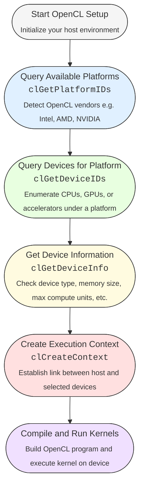

import Tabs from '@theme/Tabs';
import TabItem from '@theme/TabItem';
import AdBanner from '@site/src/components/AdBanner';

<div>
    <AdBanner />
</div>


# Detect Your GPU Device Using OpenCL


Welcome to your next step in mastering **OpenCL**  a powerful framework for running code across a range of devices, including GPUs, CPUs, and other accelerators.

This is **Part 2** of our OpenCL learning series, where we transition from theoretical understanding to practical implementation. If you’ve already explored [Part 1](https://www.compilersutra.com/docs/gpu/opencl/basic/running_first_opencl_code), you should now have a strong grasp of concepts like kernels, the ``platform/device model``, ``memory architecture``, and the ``host-device`` interaction model.


:::caution Before You Begin: Detect OpenCL-Compatible Devices

To harness GPU acceleration in your application, the first critical step is identifying the OpenCL-compatible devices available on your system. These may include GPUs, CPUs, or other compute devices supported by your OpenCL platform (such as Intel, AMD, or NVIDIA).
:::
In this guide, you will learn how to:

- Detect OpenCL platforms installed on your system
- Enumerate available devices under each platform
- Select the appropriate device for running your OpenCL program

<details>
<summary><strong> Youtube Video Tutorial</strong></summary>
## Watch the Tutorial

**[CompilerSutra – How To Run OpenCL Kernel Part 3a: Detect GPU Device](https://youtu.be/r17Tcq7VUGY?si=mB4-j-DVeB_e7Lk0)**


---

## What You'll Learn

* **Platform & Device Discovery**
  Understand how to enumerate OpenCL platforms and devices using `clGetPlatformIDs` and `clGetDeviceIDs`.

* **Device Info Queries**
  Learn how to query device properties such as:

  * Device name
  * Vendor
  * Global memory size
  * Number of compute units
  * OpenCL version

* **Device-Type Filtering**
  Use filters like `CL_DEVICE_TYPE_GPU` to list only GPU devices.

* **Cross-Platform C++ Implementation**
  Includes a complete working example in C++ that runs on:

  * macOS
  * Linux
  * WSL (Windows Subsystem for Linux)

* **Practical Use**
  This foundational step is essential for setting up and optimizing OpenCL workloads for your specific hardware.

## Related Videos in the Series

1. [Part 1: OpenCL What is Kernel](https://www.youtube.com/watch?v=MOoTbvJjnfw)
2. [Part 2: Platform and Context Setup](https://www.youtube.com/watch?v=VioeLisot5I)
3. [Part 3a: Detect GPU Device](https://youtu.be/r17Tcq7VUGY?si=mB4-j-DVeB_e7Lk0)
---

For more content and tutorials, visit the [CompilerSutra YouTube Channel](https://youtube.com/@compilersutra).

</details>
<div>
    <AdBanner />
</div>


<details>
<summary><strong>  Prerequisites </strong></summary>

To follow along, you should have already completed the following:

- [Setting up OpenCL on your system](https://www.compilersutra.com/docs/gpu/opencl/basic/setting_up_opencl)
- [Reading the introduction to OpenCL](https://compilersutra.com/docs/gpu/opencl/basic/what_is_opencl)
- [Part 1 of the series](https://www.compilersutra.com/docs/gpu/opencl/basic/running_first_opencl_code)

These resources help ensure your system is properly configured and that you are familiar with the motivation behind using OpenCL.
</details>

## Table of Contents

* [1. Introduction to OpenCL Device Detection](#1-introduction-to-opencl-device-detection)
  * [Why Device Detection Important](#why-device-detection-is-important)
  * [OpenCL Intiallization](#the-opencl-initialization-path)     

* [2. Key OpenCL APIs](#2-key-opencl-apis)

  * [clGetPlatformIDs](#clgetplatformids)
  * [clGetDeviceIDs](#clgetdeviceids)
  * [clGetDeviceInfo](#clgetdeviceinfo)
* [3. Step-by-Step GPU Detection Algorithm](#3-step-by-step-gpu-detection-algorithm)
* [4. Complete C++ Code Example](#4-complete-c-code-example)
* [5. How to Run](#5-how-to-compiler-and-run)
* [6. What’s Next](#6-whats-next)
* [7. References](#7-references)


<div>
    <AdBanner />
</div>


## 1. Introduction to OpenCL Device Detection

Before running a kernel on a GPU, it's important to understand how OpenCL APIs work and how to detect the compute devices available on your system. This is the **first and essential step** in setting up your OpenCL environment.

OpenCL (Open Computing Language) is a framework for writing programs that execute across **heterogeneous platforms** — including ``CPUs``, ``GPUs``, ``DSPs``, ``FPGAs``, and other accelerators. Its strength lies in its ability to target multiple vendor devices from a single codebase.

However, OpenCL programs cannot assume the presence of any device or platform by default. Instead, every program must begin by explicitly discovering and selecting a supported device — typically a GPU — and preparing it for computation.

### Why Device Detection Is Important
- **No device, no compute**: Without detecting and selecting a valid OpenCL device,you
cannot allocate memory, compile kernels, or run parallel workloads.

- **Vendor-agnostic programming**: OpenCL supports platforms from ``NVIDIA``, ``Intel``, ``AMD``,``Apple``, and others. Detecting platforms and devices dynamically helps keep your application portable.

- **Optimization**: Knowing details like ``device memory``, ``compute units``, and ``supported features`` helps you ```optimize kernel execution```.

<div>
    <AdBanner />
</div>


### The OpenCL Initialization Path

To properly set up and execute OpenCL programs, you need to follow these initialization steps. These steps ensure that your program can reliably discover available compute resources, allocate memory, and launch kernels in a vendor-agnostic, scalable way.

1. **Query Platforms** – <span style={{ color: '#007acc' }}><em>Identify available OpenCL vendor platforms</em></span>  
   This means checking which OpenCL runtimes are installed on your system. Each "platform" corresponds to a vendor’s implementation (e.g., NVIDIA, AMD, Intel). A platform acts as the interface between your application and that vendor's hardware.

2. **Query Devices** – <span style={{ color: '#007acc' }}><em>Find all compute devices under each platform</em></span>  
   This step lists the actual hardware (like CPUs, GPUs, or accelerators) exposed by a given platform. For example, an Intel platform might expose both a CPU and an integrated GPU.

3. **Inspect Device Info** – <span style={{ color: '#007acc' }}><em>Retrieve technical details of each device</em></span>  
   After finding devices, you need to inspect their capabilities — such as memory size, type (CPU/GPU), max work-group size, number of compute units, etc. This helps you decide whether the device is suitable for your workload.

4. **Select Device and Create Context** – <span style={{ color: '#007acc' }}><em>Choose a device and create an OpenCL execution environment</em></span>  
   Once you've chosen a device, you use it to create a "context." The context is like a session that links your application to the device. All memory allocations, kernels, and command queues will exist within this context.


---

<details>
<summary><strong>Why these steps are necessary</strong></summary>

OpenCL is designed to be platform-agnostic, meaning it supports multiple hardware vendors (NVIDIA, AMD, Intel, etc.). However, to leverage this flexibility, your application must perform the following:

- **Query Platforms**  
  This helps you detect what OpenCL runtimes (e.g., Intel, AMD, NVIDIA) are installed. Each platform corresponds to a vendor’s OpenCL implementation.

- **Query Devices**  
  Every platform can expose multiple devices — for example, your Intel platform may include both an integrated CPU and GPU. You need to know what hardware is available for computation.

- **Inspect Device Info**  
  Devices vary significantly in capabilities. Before running kernels, you need to know each device’s memory size, compute units, and other features to make informed decisions.

- **Select Device and Create Context**  
  The context defines where your program will execute. It wraps together your chosen device(s), command queues, memory buffers, and kernel programs — forming the basis of your OpenCL application.
</details>

:::note
- **Device discovery is not automatic** — OpenCL is a ``low-level framework``, and it requires explicit ``device discovery`` and ``selection``.
- **Platform abstraction** — Multiple vendors may be present. ``Platform`` and ``device separation`` ensures ``portability`` and ``flexibility``.
- **Memory management** — OpenCL programs manage ``memory buffers manually``. Initialization steps ensure proper ``allocation and linkage``.
- **Kernel compilation is per-device** — Code must be compiled at ``runtime for a specific device``, and that process needs a ``well-prepared context`` and ``program object``.
- **Explicit command submission** — You manage ``when and how work`` is sent to the ``GPU/CPU`` via ``command queues``, which are part of the ``initialization sequence``.

:::

---

### Visual Overview


<details>
<summary><strong> Understanding the OpenCL Initialization Flow</strong></summary>

The following flow represents the standard sequence for initializing and executing an OpenCL program on a heterogeneous computing device (such as a GPU or CPU). Each step is a crucial part of the OpenCL host-device interaction model.

**1. Start OpenCL Setup**

**Diagram Node:** `Start OpenCL Setup`  
**Details:** This step represents the beginning of your OpenCL program execution from the host side (usually written in C/C++). At this point, you typically include OpenCL headers, define required variables, and prepare to query the system for available platforms and devices.

**2. Query Available Platforms**

**Diagram Node:** `clGetPlatformIDs`  
**Details:** This function returns a list of OpenCL platforms installed on your system. A platform represents a vendor's OpenCL implementation (e.g., Intel, AMD, NVIDIA). Each platform can expose one or more compute devices. You must call this first to identify what platforms are available before interacting with any devices.

**3. Query Devices for Platform**

**Diagram Node:** `clGetDeviceIDs`  
**Details:** Once a platform is selected, this function retrieves all compute devices available under it — including CPUs, GPUs, or other accelerators. You can specify the device type (e.g., GPU only) and get a list of matching devices for later use.


**4. Get Device Information**

**Diagram Node:** `clGetDeviceInfo`  
**Details:** After discovering devices, you can query specific information about them — such as device name, vendor, available global memory, local memory size, max compute units, and supported extensions. This information helps you select the best device for your workload and plan memory usage accordingly.

**5. Create Execution Context**

**Diagram Node:** `clCreateContext`  
**Details:** An OpenCL context is an environment within which kernels execute and memory objects are managed. It links the host to one or more compute devices. All OpenCL operations (like memory allocation, kernel launching, etc.) happen within a context.

**6. Compile and Run Kernels**

**Diagram Node:** `Compile and Run Kernels`  
**Details:** With the context and selected device ready, you compile your OpenCL C kernel source code using functions like `clCreateProgramWithSource` and `clBuildProgram`. Then, you launch the compiled kernel using `clEnqueueNDRangeKernel`, and data is processed on the compute device.

This initialization flow ensures that your OpenCL program can dynamically detect available compute resources and safely prepare for executing data-parallel workloads across heterogeneous platforms.

</details>
:::important
 Summary of Key Functions

| Function | Purpose |
|----------|---------|
| `clGetPlatformIDs` | Lists OpenCL platforms (vendor-specific drivers) available |
| `clGetDeviceIDs`   | Lists devices (e.g., GPU, CPU) available under a platform |
| `clGetDeviceInfo`  | Retrieves detailed information about a specific device |
:::
## 2. Key OpenCL APIs

Before launching any kernel or allocating memory on a GPU or CPU via OpenCL, your host application must first discover what compute resources are available. OpenCL exposes a low-level API that enables you to query:

* Which OpenCL platforms (vendor drivers) are installed
* What compute devices (CPUs, GPUs, accelerators) are available
* What are the capabilities of each device

These operations are handled through three key functions:

* `clGetPlatformIDs`
* `clGetDeviceIDs`
* `clGetDeviceInfo`

Each function plays a critical role in the OpenCL initialization sequence.

---

<Tabs>

<TabItem value="clGetPlatformIDs" label="clGetPlatformIDs">

### `clGetPlatformIDs`

```c
cl_int clGetPlatformIDs(cl_uint num_entries,
                        cl_platform_id *platforms,
                        cl_uint *num_platforms);
```

**Purpose**: Retrieves the number and IDs of OpenCL platforms (e.g., Intel, AMD, NVIDIA).

**Parameters**:

* `num_entries`: Maximum number of platform IDs that can be returned.
* `platforms`: Memory buffer to store returned platform IDs. Can be `NULL` when querying only the count.
* `num_platforms`: Outputs the number of platforms found.

:::tip
First, call with `platforms = NULL` to get the platform count. Then allocate memory and call again to get the IDs.
:::

</TabItem>

<TabItem value="clGetDeviceIDs" label="clGetDeviceIDs">

### `clGetDeviceIDs`

```c
cl_int clGetDeviceIDs(cl_platform_id platform,
                      cl_device_type device_type,
                      cl_uint num_entries,
                      cl_device_id *devices,
                      cl_uint *num_devices);
```

**Purpose**: Retrieves a list of devices (CPU, GPU, or accelerator) associated with a given platform.

**Parameters**:

* `platform`: The platform for which devices are queried.
* `device_type`: The type of device you want (e.g., `CL_DEVICE_TYPE_GPU`).
* `num_entries`: Max number of device IDs to return.
* `devices`: Buffer to store device IDs.
* `num_devices`: Outputs the actual number of devices found.

</TabItem>

<TabItem value="clGetDeviceInfo" label="clGetDeviceInfo">

### `clGetDeviceInfo`

```c
cl_int clGetDeviceInfo(cl_device_id device,
                       cl_device_info param_name,
                       size_t param_value_size,
                       void *param_value,
                       size_t *param_value_size_ret);
```

**Purpose**: Queries technical details about an OpenCL device, such as name, vendor, memory size, and compute units.

**Parameters**:

* `device`: The device to query.
* `param_name`: Which information to retrieve (e.g., `CL_DEVICE_NAME`).
* `param_value_size`: Size of the memory buffer provided.
* `param_value`: Memory location where the result is stored.
* `param_value_size_ret`: Actual size of the returned data.

</TabItem>

</Tabs>

<div>
    <AdBanner />
</div>

## 3. Step-by-Step GPU Detection Algorithm

This guide walks you through the essential steps to detect GPU devices using OpenCL. These steps are foundational for building any OpenCL application.

<details>
<summary>**1. Define OpenCL Version** </summary>

Before you begin using OpenCL, you must specify which version of the OpenCL API your application will use. This is usually done by including the correct header files and ensuring your development environment supports the desired version.

Example:

```c
#define CL_TARGET_OPENCL_VERSION 220  // Target OpenCL 2.2
```
</details>

<details>
<summary> **2. Include Headers**</summary>

To access OpenCL functions and types, include the OpenCL headers in your code.

Example:

```c
#include <CL/cl.h>
```
</details>

<details>

<summary> **3. Discover OpenCL Platforms**</summary>

Platforms in OpenCL represent vendor-specific implementations (e.g., NVIDIA, Intel, AMD). First, query how many platforms are available, then retrieve their IDs.

Example:

```c
cl_uint num_platforms;
clGetPlatformIDs(0, NULL, &num_platforms);
cl_platform_id platforms[num_platforms];
clGetPlatformIDs(num_platforms, platforms, NULL);
```
</details>

<details>
<summary> **4. Select the First Platform**</summary>

If multiple platforms are available, you can choose one (commonly the first). This platform will be used for querying devices.

Example:

```c
cl_platform_id platform = platforms[0];
```
</details>

<details>
<summary> **5. Discover GPU Devices Under Platform**</summary>

Query how many GPU devices are available under the selected platform, then get their device IDs.

Example:

```c
cl_uint num_devices;
clGetDeviceIDs(platform, CL_DEVICE_TYPE_GPU, 0, NULL, &num_devices);
cl_device_id devices[num_devices];
clGetDeviceIDs(platform, CL_DEVICE_TYPE_GPU, num_devices, devices, NULL);
```
</details>

<details>
<summary> **6. Select the First GPU Device**</summary>

Choose one GPU device to use (typically the first one).

Example:

```c
cl_device_id device = devices[0];
```
</details>

<details>
<summary> **7. Query Device Name, Vendor, Memory, Compute Units**</summary>

Use `clGetDeviceInfo` to get detailed information about the selected device, such as:

* Device name
* Vendor
* Global memory size
* Number of compute units

Example:

```c
char name[128];
char vendor[128];
cl_ulong mem_size;
cl_uint compute_units;

clGetDeviceInfo(device, CL_DEVICE_NAME, sizeof(name), name, NULL);
clGetDeviceInfo(device, CL_DEVICE_VENDOR, sizeof(vendor), vendor, NULL);
clGetDeviceInfo(device, CL_DEVICE_GLOBAL_MEM_SIZE, sizeof(mem_size), &mem_size, NULL);
clGetDeviceInfo(device, CL_DEVICE_MAX_COMPUTE_UNITS, sizeof(compute_units), &compute_units, NULL);
```
</details>

<details>
<summary> **8. Print the Information** </summary>

Finally, display the gathered device information.

Example:

```c
printf("Device Name: %s\n", name);
printf("Vendor: %s\n", vendor);
printf("Global Memory: %llu MB\n", mem_size / (1024 * 1024));
printf("Compute Units: %u\n", compute_units);
```

This completes the basic setup for discovering and inspecting OpenCL-compatible GPU devices. These steps are crucial for initializing and configuring any GPU-accelerated application using OpenCL.
</details>

## 4. Complete C++ Code Example

> **Here is the whole** ``cpp code`` for checking your **gpu device** with the ``opencl``
```cpp
#define CL_TARGET_OPENCL_VERSION 200
#include <CL/cl.h>
#include <iostream>

int main() {
    // Step 1: Get number of OpenCL platforms
    cl_uint numPlatforms;
    clGetPlatformIDs(0, nullptr, &numPlatforms);

    // Step 2: Get the first available platform
    cl_platform_id platform;
    clGetPlatformIDs(1, &platform, nullptr);

    // Step 3: Get number of GPU devices available on the platform
    cl_uint numDevices;
    clGetDeviceIDs(platform, CL_DEVICE_TYPE_GPU, 0, nullptr, &numDevices);

    // Step 4: Get the first GPU device ID
    cl_device_id device;
    clGetDeviceIDs(platform, CL_DEVICE_TYPE_GPU, 1, &device, nullptr);

    // Step 5: Define buffers to store device info
    char name[128], vendor[128];
    cl_ulong mem;
    cl_uint units;

    // Step 6: Retrieve device name, vendor, memory size, and compute units
    clGetDeviceInfo(device, CL_DEVICE_NAME, sizeof(name), name, nullptr);
    clGetDeviceInfo(device, CL_DEVICE_VENDOR, sizeof(vendor), vendor, nullptr);
    clGetDeviceInfo(device, CL_DEVICE_GLOBAL_MEM_SIZE, sizeof(mem), &mem, nullptr);
    clGetDeviceInfo(device, CL_DEVICE_MAX_COMPUTE_UNITS, sizeof(units), &units, nullptr);

    // Step 7: Print the collected device information
    std::cout << "Device Name: " << name << "\n";
    std::cout << "Vendor: " << vendor << "\n";
    std::cout << "Memory: " << mem / (1024 * 1024) << " MB\n";
    std::cout << "Compute Units: " << units << "\n";

    return 0;
}
```

---
:::caution
This completes the basic setup for discovering and inspecting ***OpenCL-compatible GPU*** devices. These steps are crucial for initializing and configuring any ***GPU-accelerated*** application using ***OpenCL***.
:::

---

## 5. How to Compiler and Run 
<Tabs>

<TabItem value="macOS" label="macOS">

**Prerequisites**

* Ensure **Xcode Command Line Tools** are installed:
* Clone the official opencl headers.
* Install the **clang compiler** .

```python
xcode-select --install  # Install if not already done (it will install all required things)

git clone https://github.com/KhronosGroup/OpenCL-Headers.git opencl_headers 

```
:::note
**xcode-select --install** 
This provides:
``clang``, ``clang++``

``make``, ``git``, ``ld``, and ***other developer tools***.
:::

**▶️ Compile and Run**

```python
clang++ your_file.cpp -I/path/to/opencl_headers -framework OpenCL -o opencl_device
./opencl_device
```
**Output**
```python

Device Name: Apple M1 Pro
Vendor: Apple
Memory: 10922 MB
Compute Units: 16
```

</TabItem>

<TabItem value="Linux" label="Linux (Ubuntu/Debian/Fedora)">

**Prerequisites**

* Install OpenCL headers and libraries.
* Install the clang compiler
* If headers are missing, clone from the official Khronos repo:

```python
git clone https://github.com/KhronosGroup/OpenCL-Headers.git opencl_headers
sudo apt-get install clang++
// Include the path during compilation using -I flag
```

**▶️ Install Dependencies (Ubuntu/Debian)**

```python
sudo apt update
sudo apt install ocl-icd-opencl-dev
```

**▶️ Compile and Run**

```python
clang++ your_file.cpp -I/path/to/opencl -lOpenCL -o opencl_device
./opencl_device
```

</TabItem>

<TabItem value="WSL" label="WSL (Windows Subsystem for Linux)">

**Prerequisites**

* Use **WSL2**
* Install GPU vendor’s OpenCL drivers ``(Intel, AMD, NVIDIA)`` on Windows
* Inside WSL, install OpenCL development libraries:

```python
sudo apt update
sudo apt install ocl-icd-opencl-dev
```

**▶️ Compile and Run**

```python
clang++ your_file.cpp -I/path/to/opencl -lOpenCL -o opencl_device
./opencl_device
```

> :::note
> Ensure that WSL2 GPU support is enabled and your drivers are up to date on the Windows side.


</TabItem>

</Tabs>

---
:::caution Basic Thing to Keep Mind
This ***completes the basic setup*** for ***discovering*** and ***inspecting OpenCL-compatible GPU devices*** . These steps are crucial for ***initializing and configuring*** any GPU-accelerated application using OpenCL.
:::

<div>
    <AdBanner />
</div>

## 6. What’s Next

Now that you can query GPU info, the next step is to:

* Create a context and command queue
* Write and build OpenCL kernels
* Transfer data between host and device
* Execute kernels and read back results

Stay tuned for the next article: ***"Running Your First Kernel with OpenCL in C++"***.

<Tabs>
  <TabItem value="docs" label="📚 Documentation">
             - [CompilerSutra Home](https://compilersutra.com)
                - [CompilerSutra Homepage (Alt)](https://compilersutra.com/)
                - [Getting Started Guide](https://compilersutra.com/get-started)
                - [Newsletter Signup](https://compilersutra.com/newsletter)
                - [Skip to Content (Accessibility)](https://compilersutra.com#__docusaurus_skipToContent_fallback)


  </TabItem>

  <TabItem value="tutorials" label="📖 Tutorials & Guides">

        - [AI Documentation](https://compilersutra.com/docs/Ai)
        - [DSA Overview](https://compilersutra.com/docs/DSA/)
        - [DSA Detailed Guide](https://compilersutra.com/docs/DSA/DSA)
        - [MLIR Introduction](https://compilersutra.com/docs/MLIR/intro)
        - [TVM for Beginners](https://compilersutra.com/docs/tvm-for-beginners)
        - [Python Tutorial](https://compilersutra.com/docs/python/python_tutorial)
        - [C++ Tutorial](https://compilersutra.com/docs/c++/CppTutorial)
        - [C++ Main File Explained](https://compilersutra.com/docs/c++/c++_main_file)
        - [Compiler Design Basics](https://compilersutra.com/docs/compilers/compiler)
        - [OpenCL for GPU Programming](https://compilersutra.com/docs/gpu/opencl)
        - [LLVM Introduction](https://compilersutra.com/docs/llvm/intro-to-llvm)
        - [Introduction to Linux](https://compilersutra.com/docs/linux/intro_to_linux)

  </TabItem>

  <TabItem value="assessments" label="📝 Assessments">

        - [C++ MCQs](https://compilersutra.com/docs/mcq/cpp_mcqs)
        - [C++ Interview MCQs](https://compilersutra.com/docs/mcq/interview_question/cpp_interview_mcqs)

  </TabItem>

  <TabItem value="projects" label="🛠️ Projects">

            - [Project Documentation](https://compilersutra.com/docs/Project)
            - [Project Index](https://compilersutra.com/docs/project/)
            - [Graphics Pipeline Overview](https://compilersutra.com/docs/The_Graphic_Rendering_Pipeline)
            - [Graphic Rendering Pipeline (Alt)](https://compilersutra.com/docs/the_graphic_rendering_pipeline/)

  </TabItem>

  <TabItem value="resources" label="🌍 External Resources">

            - [LLVM Official Docs](https://llvm.org/docs/)
            - [Ask Any Question On Quora](https://compilersutra.quora.com)
            - [GitHub: FixIt Project](https://github.com/aabhinavg1/FixIt)
            - [GitHub Sponsors Page](https://github.com/sponsors/aabhinavg1)

  </TabItem>

  <TabItem value="social" label="📣 Social Media">

            - [🐦 Twitter - CompilerSutra](https://twitter.com/CompilerSutra)
            - [💼 LinkedIn - Abhinav](https://www.linkedin.com/in/abhinavcompilerllvm/)
            - [📺 YouTube - CompilerSutra](https://www.youtube.com/@compilersutra)

  </TabItem>
</Tabs>


<div>
    <AdBanner />
</div>

## 7. References

<Tabs>
  <TabItem value="resource1" label="1. 3D Game Engine Programming">

  ### 🔗 [Introduction to OpenCL – 3D Game Engine Programming](https://www.3dgep.com/introduction-to-opencl/)

  **Summary**:  
  A beginner-friendly tutorial that introduces the OpenCL platform and device model with clear C++ examples.

  **Details**:
  - Explains the concept of platforms and devices in OpenCL
  - Shows how to use `clGetPlatformIDs`, `clGetDeviceIDs`, and `clGetDeviceInfo`
  - Walks through writing and executing your first OpenCL program
  - Ideal for developers starting OpenCL with a C++ background

  </TabItem>

  <TabItem value="resource2" label="2. Bit-Brick Guide">

  ### 🔗 [OpenCL Programming Guide – Bit-Brick Documentation](https://docs.bit-brick.com/docs/k1/software/graphics/openCL_programming_guide)

  **Summary**:  
  A practical guide to implementing OpenCL in real-world projects.

  **Details**:
  - Covers platform/device detection and context creation
  - Guides you through kernel compilation and execution
  - Good for embedded system developers or those integrating OpenCL in production tools

  </TabItem>

  <TabItem value="resource3" label="3. Khronos Specification">

  ### 🔗 [The OpenCL Specification – Khronos Group](https://registry.khronos.org/OpenCL/specs/3.0-unified/html/OpenCL_API.html)

  **Summary**:  
  The official API specification for OpenCL 3.0 maintained by Khronos.

  **Details**:
  - Contains exhaustive documentation of all OpenCL functions
  - Use this for function syntax, data types, and compliance
  - Essential for developers building cross-vendor tools and debugging at API level

  </TabItem>

  <TabItem value="resource4" label="4. Khronos Main Site">

  ### 🔗 [Khronos Group OpenCL Resources](https://www.khronos.org/opencl/)

  **Summary**:  
  The official landing page for all things OpenCL.

  **Details**:
  - News, SDK downloads, and conformance tools
  - Links to vendor-specific OpenCL implementations (NVIDIA, Intel, AMD)
  - Entry point for both specification and community resources

  </TabItem>

  <TabItem value="resource5" label="5. Codeplay GitHub SDK">

  ### 🔗 [OpenCL SDK Examples – Codeplay ComputeCpp](https://github.com/codeplaysoftware/computecpp-sdk)

  **Summary**:  
  A GitHub repo containing real-world OpenCL sample code using CMake.

  **Details**:
  - Discover platforms and devices using C++
  - Build and execute OpenCL kernels with ComputeCpp
  - Useful for setting up SDK projects and understanding integration

  </TabItem>
</Tabs>

:::tip
> These references provide **both theoretical depth** and **hands-on implementation** support.         
> Start with **official docs** for correctness and use tutorial articles for guided learning.
:::

