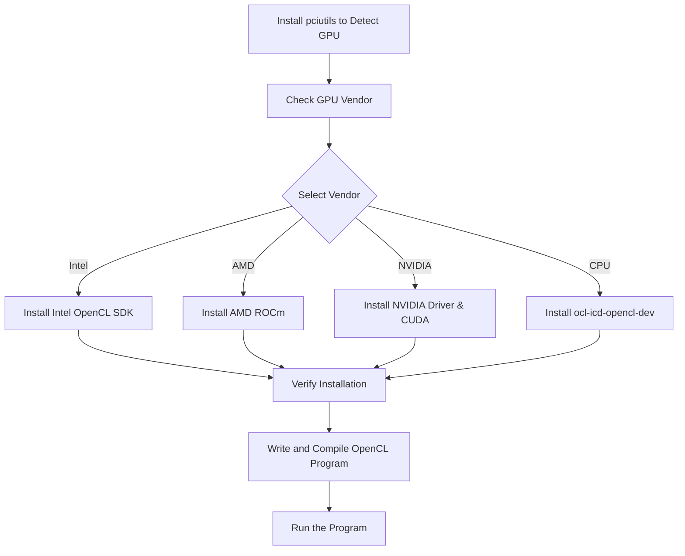

import Tabs from '@theme/Tabs';
import TabItem from '@theme/TabItem';
import AdBanner from '@site/src/components/AdBanner';

---

OpenCL ``(Open Computing Language)`` is an open standard for ``parallel programming of heterogeneous systems``, enabling developers to write portable code that runs efficiently on a wide variety of devices such as ``CPUs, GPUs, FPGAs, and other accelerators``.

 Whether you're working on high-performance computing (HPC), machine learning, real-time graphics, or embedded systems, OpenCL provides a unified framework for harnessing the power of parallelism.

:::cautions
This guide is designed to help you set up ```OpenCL across Linux, macOS, and Windows`` platforms, ensuring you're ready to build and run OpenCL programs on your hardware```. We'll walk you through the installation process, demonstrate ```how to verify your setup```, and provide a hands-on example of an OpenCL program. Additionally, we’ll address common pitfalls and provide resources for further learning.
:::

Whether you're a developer exploring GPU acceleration for the first time, a researcher optimizing algorithms for high-throughput systems, or an engineer working on AI workloads, this guide will give you the solid foundation you need to get started with OpenCL.

## Table of Contents

1. [Prerequisites for Setting Up OpenCL](#1-prerequisites-for-setting-up-opencl)
2. [Steps to Install OpenCL on Linux](#2-how-to-install-opencl-on-linux-ubuntudebian)
3. [How to Verify the OpenCL Installation](#3--how-to-verify-the-opencl-installation)

5. [Troubleshooting Common OpenCL Setup Issues](#4--troubleshooting-common-opencl-setup-issues)
6. [Conclusion and Resources for Further Learning](#5--conclusion-and-resources-for-further-learning)

---
## OpenCL Setup Flow Diagram


<details>
<summary> Digram Explanation  </summary>

To set up OpenCL on your system, start by identifying your hardware platform — whether it’s an **Intel**, **AMD**, or **NVIDIA** GPU, or a **CPU**. First, install the `pciutils` tool to detect available OpenCL platforms and devices.
<details>
<summary> On Mac Use </summary>
```bash
 system_profiler SPDisplaysDataType
 ```
 Output
 ```bash
Graphics/Displays:

    Apple M1 Pro:

      Chipset Model: Apple M1 Pro
      Type: GPU
      Bus: Built-In
      Total Number of Cores: 16
      Vendor: Apple (0x106b)
      Metal Support: Metal 3
      Displays:
        Color LCD:
          Display Type: Built-in Liquid Retina XDR Display
          Resolution: 3024 x 1964 Retina
          Main Display: Yes
          Mirror: Off
          Online: Yes
          Automatically Adjust Brightness: Yes
          Connection Type: Internal

 ```
</details>

 Running `lspci` helps you check which GPU vendor is detected on your system, guiding your next steps.

 :::note
 On linux use 
 ```bash
 lspci | grep -i vga
 ```
 output
 ```bash
 00:02.0 VGA compatible controller: Intel Corporation Iris Plus Graphics G7 (rev 07)

  ```
  > As per output your GPU vendor is Intel
 :::

Based on the detected vendor, install the corresponding OpenCL SDK or driver:  
- For **Intel**, install the **Intel OpenCL SDK** (supports CPUs and Intel GPUs).  
- For **AMD**, install the **AMD ROCm** platform for GPU support.  
- For **NVIDIA**, install the **NVIDIA driver** along with the **CUDA toolkit**, which includes OpenCL support.  
- For CPU-only setups, ensure the CPU OpenCL runtime is installed, often included in Intel’s SDK or system packages.

Next, install the **`ocl-icd-opencl-dev`** package (or equivalent) to provide the OpenCL Installable Client Driver (ICD) loader. This allows multiple OpenCL implementations to coexist smoothly on the system.

After installation, run `clinfo` again to verify that the OpenCL platform and devices are properly recognized and available. Finally, write, compile, and run a simple OpenCL program (e.g., vector addition) to confirm your environment works as expected.

---

:::tips  
- Always check `clinfo` output carefully for the presence and status of OpenCL platforms and devices.  
- Keep GPU drivers up to date to avoid compatibility issues.  
- Use vendor-specific SDK documentation for troubleshooting and optimization tips.  
- When developing OpenCL programs, start with simple examples to verify your setup before moving to complex kernels.  
- On Linux, the ICD loader (`ocl-icd-opencl-dev`) is crucial for handling multiple vendors' OpenCL implementations without conflict.

This process ensures a smooth setup for OpenCL development across Intel, AMD, NVIDIA GPUs, and CPUs.
:::
</details>


## 1. Prerequisites for Setting Up OpenCL

### Step 1: Identify Your Hardware and Tools
- Intel  
- AMD  
- NVIDIA  
- CPU  
- Install `pciutils` and run ``lspci`` to Detect GPU  
- Check GPU Vendor  
- Select Vendor  

### Step 2: Install Necessary SDKs and Tools
- Install Intel OpenCL SDK  
- Install AMD ROCm  
- Install NVIDIA Driver & CUDA  
- Install `ocl-icd-opencl-dev` (for generic CPU OpenCL on Linux)  
- Verify Installation with `clinfo`  
- Write and Compile OpenCL Program  
- Run the Program

<Tabs>
  <TabItem value="hardware" label="Hardware Requirements" default>
    - **GPUs**: Intel, AMD, NVIDIA (GeForce, Quadro, Radeon, etc.)  
      *Note: Ensure your GPU drivers support OpenCL.*

    - **ARM-based Processors**: e.g., Raspberry Pi (requires vendor-specific OpenCL support).

    - **CPUs**: Intel Core i3/i5/i7, AMD Ryzen, etc.

    - **Other Devices**: Some FPGAs and accelerators support OpenCL.

    ---
    **Tip:** Check your hardware vendor’s website for OpenCL compatibility.
  </TabItem>

  <TabItem value="software" label="Software Requirements & Setup Steps">
    ### Software Requirements
    - **C/C++ Compiler** (GCC, Clang, MSVC)
    - **OpenCL runtimes and SDKs** (Intel, AMD ROCm, NVIDIA CUDA Toolkit)
    - **`clinfo` utility** for detecting OpenCL platforms/devices
    - **Build tools** (`build-essential`, CMake, Visual Studio Build Tools)
    <details>
   <summary> Step-by-step Setup Guide </summary>

    1. **Detect your GPU and OpenCL Platforms**
    ```bash
        lspci | grep -i vga
    ```
    Use this command to list installed OpenCL platforms and devices.

    2. **Check GPU Vendor**  
    Identify if your system has Intel, AMD, NVIDIA, or CPU OpenCL support.

    3. **Select your Vendor and Install the Corresponding OpenCL SDK:**

    - **Intel:**
      - Install Intel OpenCL Runtime/SDK from [Intel’s official site](https://software.intel.com/content/www/us/en/develop/tools/opencl-sdk.html)
      - For Intel CPUs/GPUs, install the Intel OpenCL CPU runtime package.

    - **AMD:**
      - Install AMD ROCm or AMD APP SDK from [AMD's ROCm website](https://rocmdocs.amd.com/en/latest/)
      - For Windows, AMD's drivers include OpenCL support.

    - **NVIDIA:**
      - Install the latest NVIDIA drivers from [NVIDIA's site](https://www.nvidia.com/Download/index.aspx)
      - Install CUDA Toolkit (includes OpenCL headers and libraries)

    - **CPU (Generic OpenCL):**
      - On Linux, install `ocl-icd-opencl-dev` and `ocl-icd-libopencl1` for ICD loader support.
      ```bash
      sudo apt-get install ocl-icd-opencl-dev ocl-icd-libopencl1
      ```

    4. **Verify Installation**
    Run `clinfo` again to confirm that your OpenCL platform and devices are correctly detected.

    5. **Write and Compile Your First OpenCL Program**
    - Write a simple OpenCL kernel in C.
    - Compile with your C/C++ compiler linking OpenCL libraries.

    6. **Run the OpenCL Program**
    - Execute the binary and verify that the OpenCL kernel executes on your device.

    ---
    **Tip:** Keep your OpenCL SDKs and GPU drivers up to date to avoid compatibility issues.
    </details>
  </TabItem>
</Tabs>
---

## 2. How to Install OpenCL on Linux (Ubuntu/Debian)

OpenCL (Open Computing Language) enables programs to run across heterogeneous platforms including CPUs, GPUs, and other processors.

---

### Step 1: Verify Your Vendor System

Install `psutils` to check which OpenCL platforms and devices are available:

```bash
sudo apt update
sudo apt install psutils
lspci | grep -i vga
```

This will show a list of OpenCL-capable devices. Identify whether your system has an Intel, AMD, or NVIDIA GPU, or if you're using CPU-only support.

---

<Tabs>
<TabItem value="intel" label="Intel">

### Intel GPU Support

Install required packages:

```bash
sudo apt install build-essential libclang-dev libopencl1
```

Then download and install the Intel OpenCL SDK or runtime:

[Visit Intel OpenCL SDK](https://www.intel.com/content/www/us/en/docs/oneapi/installation-guide-linux/2023-1/configure-wsl-2-for-gpu-workflows.html)

</TabItem>

<TabItem value="amd" label="AMD">

### AMD GPU Support (ROCm Stack)

Install ROCm (Radeon Open Compute):

```bash
sudo apt install rocm-dkms
```

For detailed and up-to-date instructions:

[Visit ROCm Installation Guide](https://rocm.docs.amd.com/projects/install-on-linux/en/latest/)

</TabItem>

<TabItem value="nvidia" label="NVIDIA">

### NVIDIA GPU Support

Install the NVIDIA driver and CUDA toolkit (includes OpenCL runtime):

```bash
sudo apt install nvidia-driver-535 nvidia-cuda-toolkit
```

Download the latest version as needed:

[Visit NVIDIA CUDA Downloads](https://developer.nvidia.com/cuda-downloads)

</TabItem>

<TabItem value="cpu" label="CPU (Intel/AMD)">

### CPU-Only OpenCL Support

For systems without a discrete GPU or for CPU testing:

```bash
sudo apt install ocl-icd-opencl-dev
```

This installs the OpenCL Installable Client Driver (ICD) loader, enabling OpenCL execution on supported CPUs.

</TabItem>
</Tabs>

---

:::note
* Ensure your kernel headers and driver versions are compatible when installing vendor-specific runtimes.
* Use `clinfo`  after installation to verify that the OpenCL platform and devices are correctly recognized.
:::
---

With these steps, you should be able to develop and run OpenCL applications on most Linux systems with Intel, AMD, NVIDIA GPUs or CPU-only setups.

OpenCL (Open Computing Language) support depends on your hardware and vendor. Choose the appropriate SDK and runtime for your system:

### 🔧 Windows Installation

Download and install the SDK/runtime provided by your hardware vendor:

| **Vendor** | **Download Link**                                                                                  |
|------------|----------------------------------------------------------------------------------------------------|
| **Intel**  | [Intel OpenCL SDK](https://www.intel.com/content/www/us/en/developer/articles/tool/opencl-drivers.html)       |
| **AMD**    | [AMD OpenCL SDK](https://www.amd.com/en/developer/opencl.html)                                     |
| **NVIDIA** | [NVIDIA CUDA Toolkit (includes OpenCL support)](https://developer.nvidia.com/cuda-downloads)      |

> 💡 **Tip:** For NVIDIA devices, OpenCL is installed as part of the CUDA Toolkit.

**Steps:**
1. Download the installer from your vendor’s website.
2. Follow the on-screen instructions or refer to vendor documentation.
3. Set environment variables (like `PATH`, `LIB`, `INCLUDE`) if not set automatically.

---

### 🐧 Linux Installation

Linux systems typically require manual setup. Follow the detailed guide here:

👉 [Steps to Install OpenCL on Linux (Ubuntu/Debian)](#2-how-to-install-opencl-on-linux-ubuntudebian)

> Ensure you install both the ICD loader and the vendor-specific implementation (Intel, AMD, NVIDIA).

---

### 🍏 macOS

OpenCL is **pre-installed** on macOS. However:

- Apple has **deprecated OpenCL** in favor of **Metal** in macOS Mojave and later.
- OpenCL programs may still work, but cross-platform compatibility could be limited.

> ⚠️ For new macOS projects, consider using Metal or building separate OpenCL support for other platforms.

---

## 3 . How to Verify the OpenCL Installation

Run `clinfo` to verify installation:

### Linux/Mac

```bash
clinfo | grep "OpenCL"
```

### Windows

```cmd
clinfo | findstr "OpenCL"
```
:::important
> For windows recommendation is ``WSL``.
:::

If you see platform and device information, your installation is successful.

---
-

## 4 . Troubleshooting Common OpenCL Setup Issues

### Platform Not Found

* Double-check driver and SDK installation.
* Ensure your GPU is supported and enabled in BIOS.

### Insufficient Memory

* Check available system and device memory.
* Reduce data size or optimize buffer usage.

### Driver Issues

* Ensure you are using the latest drivers.
* Reinstall drivers if issues persist.
* Check `dmesg` logs (Linux) or Device Manager (Windows).

---

## 5 . Conclusion and Resources for Further Learning

🎓 You’ve set up OpenCL on your system and run a basic program! Keep exploring:

* [Khronos OpenCL](https://www.khronos.org/opencl/)
* [Intel OpenCL](https://www.intel.com/content/www/us/en/developer/tools/opencl-sdk.html)
* [AMD ROCm](https://rocm.docs.amd.com/projects/install-on-linux/en/latest/)
* [NVIDIA CUDA](https://developer.nvidia.com/cuda-downloads)

For community support:

* Stack Overflow (`[opencl]` tag)
* Reddit communities (e.g., r/gpgpu, r/computervision)
* GitHub discussions


---
