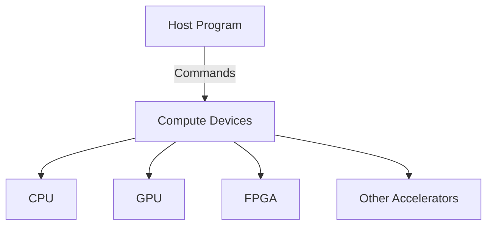

import AdBanner from '@site/src/components/AdBanner';

# What is OpenCL? The Complete Introduction

In an era where computing power is distributed across a multitude of platforms, the ability to write programs that seamlessly run on diverse hardware has never been more crucial. **OpenCL** empowers developers to unlock this potential by enabling efficient **parallel programming** across a broad spectrum of processors — from traditional **CPUs** to high-performance **GPUs** and specialized accelerators like **FPGAs**. 

With its unified framework, OpenCL allows for unparalleled flexibility, enabling developers to harness the full capabilities of each device. This opens up new frontiers in fields such as **graphics rendering**, **scientific simulations**, **machine learning**, and more, driving innovation in both everyday applications and cutting-edge technologies.

---
<details open>
<summary style={{ fontSize: '1.2em', fontWeight: 'bold' }}>📺 YouTube Video Playlist</summary>

  <br/>

  <h3>🎥 Video Tutorial Series</h3>

  <p>
    Learn the full topic with this curated video series on YouTube.<br/>
    👉 <a href="https://www.youtube.com/playlist?list=PLdhENd4XPZLrVmQNquEN3BUPjfwvxu9nQ" target="_blank"><strong>Click here to watch the full playlist</strong></a>
  </p>

  <a href="https://www.youtube.com/playlist?list=PLdhENd4XPZLrVmQNquEN3BUPjfwvxu9nQ" target="_blank">
    
  </a>

</details>

<div>
<AdBanner />
</div>


---
:::caution

<details>
<summary> Why Learn OpenCL? </summary>

Learning OpenCL is valuable for developers, researchers, and engineers working in high-performance computing (HPC), machine learning, real-time graphics, or any field where compute-intensive tasks are required. Here’s why:

- **Hardware-Agnostic Skills**: OpenCL teaches you to write code that works on various platforms — not just one brand or device family.
- **Parallel Programming Proficiency**: It helps you build a strong foundation in parallelism — a must-have skill in modern computing.
- **Future-Proofing Your Knowledge**: With the industry's shift toward heterogeneous computing (e.g., CPUs + GPUs + accelerators), OpenCL makes you adaptable across platforms.
- **Optimization Control**: OpenCL offers low-level access to memory and execution models, allowing for fine-tuned performance optimizations.
- **Cross-Industry Demand**: Whether you're in AI, finance, biotech, or embedded systems, OpenCL is used where speed and efficiency matter.

Whether you're building a graphics pipeline or accelerating data analysis on edge devices, OpenCL empowers you to write portable and high-performance code.
</details>
:::
---
OpenCL serves as a ***powerful tool*** for harnessing the full potential of ***modern hardware*** by enabling efficient parallel execution across diverse processors.
 Whether it's **accelerating graphics rendering**, **optimizing scientific computations**, enhancing video processing, or boosting machine learning workloads, OpenCL ensures that applications make the most of available computing resources.


---
<div>
<AdBanner />
</div>


## Table of Contents

1. [Introduction to OpenCL](#1-introduction-to-opencl)
2. [Key Components of OpenCL](#2-key-components-of-opencl)
   * [Platform Model](#21-platform-model)
   * [Execution Model](#22-execution-model)
   * [Memory Hierarchy](#23-memory-hierarchy)
3. [How OpenCL Works: Programming Model](#3-how-opencl-works-programming-model)
4. [Performance Advantages](#4-performance-advantages)
5. [Real-World Applications of OpenCL](#5-real-world-applications-of-opencl)
6. [Common Pitfalls in OpenCL Programming](#6-common-pitfalls-in-opencl-programming)
7. [OpenCL vs Alternatives](#7-opencl-vs-alternatives)
8. [Expert Insights & What's Next](#8-expert-insights--whats-next)

---

<div>
<AdBanner />
</div>


## 1. Introduction to OpenCL

**OpenCL (Open Computing Language)** is an open, royalty-free standard developed by the [Khronos Group](https://www.khronos.org/opencl/) for writing parallel programs that execute across heterogeneous platforms. 

OpenCL is a robust and ``versatile framework`` designed to enable efficient parallel programming across a wide array of hardware platforms. It allows developers to write code that can execute seamlessly on multiple types of processors, including general-purpose CPUs, high-performance GPUs, specialized FPGAs, and DSPs. By providing a unified programming model, OpenCL abstracts away the complexities of hardware-specific architectures, allowing code to be portable and scalable across different devices.

Through its standardized interface, ``OpenCL offers`` fine-grained control over parallel ***execution, memory management, and synchronization, empowering developers to optimize their applications for maximum performance***.

---
:::important
 It supports both ***task-based*** and ***data-based*** parallelism, making it suitable for a variety of applications ranging from scientific simulations and machine learning to real-time graphics rendering and video processing. 
 :::
 ---


 >***As a result, OpenCL enables the development of high-performance applications that can efficiently utilize the computational power of heterogeneous systems, regardless of the underlying hardware***.
---

With OpenCL, developers can unlock the full potential of a system, taking advantage of the parallel processing capabilities of modern processors to speed up complex workloads and achieve significant performance gains.

:::tip
<details>
<summary><strong>Heterogeneous Program vs. Heterogeneous Platform</strong> 📊</summary>

A **heterogeneous program** is software written to utilize different types of processors (CPU, GPU, TPU, etc.).  
A **heterogeneous platform** is the hardware system made up of those diverse processing units.

| Aspect                  | Heterogeneous Program                           | Heterogeneous Platform                          |
|------------------------|--------------------------------------------------|-------------------------------------------------|
| Definition             | Software using multiple processor types         | System with multiple processor types            |
| Focus                  | How tasks are divided and run                   | What hardware components are available          |
| Example                | ML code running on CPU & GPU                    | A laptop with CPU, GPU, and NPU                 |
| Goal                   | Efficiency and speed in execution               | Flexibility and optimized performance           |
| Dependency             | Depends on heterogeneous platform               | Independent of specific programs                |

</details>
:::

<div>
<AdBanner />
</div>


This unified model helps eliminate the need for platform-specific codebases, allowing for greater code reusability and simplified development workflows. OpenCL applications are particularly well-suited for domains like **scientific computing**, **image processing**, **financial modeling**, and **machine learning**, where performance across multiple hardware types is critical.

> 💡 **Tip**: Think of OpenCL as a universal translator that lets your code speak to CPUs, GPUs, and other processors using the same language.
  
---

<div>
<AdBanner />
</div>


:::note
<details>
<summary> Why OpenCL? </summary>

* **Cross-Platform Compatibility**: Run the same OpenCL code on different hardware without modification. This makes development faster and maintenance easier, especially when targeting diverse devices from vendors like Intel, AMD, NVIDIA, or ARM.
* **Scalable Parallelism**: Supports fine-grained (data-level) and coarse-grained (task-level) parallelism. Whether you’re parallelizing a simple image filter or a complex simulation, OpenCL can adapt to the scale and complexity of the computation.
* **Vendor-Neutral**: No dependency on a specific vendor ecosystem (unlike CUDA with NVIDIA). This means you avoid lock-in, and your applications can run on a wider range of devices, from embedded processors to high-performance clusters.
* **Standardized API**: Backed by the Khronos Group, ensuring future support and extensibility. As the ecosystem evolves, OpenCL continues to grow with consistent updates, support for new features, and collaboration among industry leaders.
</details>
:::

<div>
<AdBanner />
</div>


:::tip
<details>
<summary> Why Was OpenCL Created? </summary>

The computing world has rapidly shifted from single-core to multi-core processors, and now toward highly parallel architectures like GPUs and FPGAs. This evolution has led to a massive increase in computing power, but also in complexity for software developers.

However, programming these different hardware types required different tools and languages. This lack of portability and standardization was a major barrier for developers. Writing performance-critical code meant rewriting and optimizing for each hardware type individually—an expensive and error-prone process.

OpenCL was introduced to solve this by providing a **common language** for all compute devices. It allows developers to write code once and run it on various hardware, enabling better utilization of system resources and reducing development costs. With OpenCL, developers can abstract the hardware differences and focus on parallel logic, trusting the runtime and driver implementations to handle the specifics.

> 📝 **Note**: OpenCL was designed to be an open standard to prevent vendor lock-in and to help developers scale across hardware platforms. Its mission is to unify the fragmented landscape of high-performance computing into a consistent and portable programming model.
</details>
:::
---
<div>
<AdBanner />
</div>


## 2. Key Components of OpenCL

OpenCL (Open Computing Language) provides a framework to develop parallel programs that can execute across a wide variety of compute devices, including CPUs, GPUs, FPGAs, and other accelerators. The architecture is designed to maximize parallelism, enabling high-performance computing on heterogeneous platforms.


<details>
<summary> Digram Explanation </summary>

As illustrated in the diagram above, the **OpenCL system** consists of a **Host Program** (typically running on a CPU) that interacts with various **Compute Devices** such as CPUs, GPUs, FPGAs, or other accelerators through the OpenCL runtime. The Host Program sends commands to the Compute Devices, which are responsible for executing the parallel tasks defined by OpenCL kernels. Each type of compute device has specific capabilities:

- **CPU**: Handles general-purpose tasks and is efficient at executing serial operations.
- **GPU**: Specializes in highly parallel computations, making it ideal for tasks like graphics rendering or scientific computing.
- **FPGA**: Field-Programmable Gate Arrays provide specialized hardware for certain tasks requiring parallelism and customization.
- **Other Accelerators**: Devices like **TPUs** (Tensor Processing Units) or other specialized hardware tailored for specific types of computations.

This architecture allows for flexible and efficient parallel processing across a diverse range of hardware, enabling a wide variety of applications in scientific computing, machine learning, and graphics rendering.

<div>
<AdBanner />
</div>

</details>

### 2.1 Platform Model

The **Platform Model** in OpenCL defines the relationship between the **host** (typically a CPU) and **compute devices** (such as GPUs, FPGAs, and other accelerators). The OpenCL runtime connects the host and the devices, allowing efficient parallel processing through coordinated execution.

#### Key Components

- **Host Program**: The host program runs on the CPU and is responsible for managing the OpenCL tasks. It coordinates memory allocation, kernel execution, and the overall control of the OpenCL program.
  
- **Compute Devices**: These devices execute OpenCL kernels and include:
  - **CPU (Central Processing Unit)**: Typically handles serial or control-oriented tasks.
  - **GPU (Graphics Processing Unit)**: Performs parallel tasks, especially suited for computations involving massive data sets, like graphics rendering or scientific computing.
  - **FPGA (Field-Programmable Gate Array)**: Hardware accelerator for custom parallel tasks, providing flexibility for specialized operations.
  - **Other Accelerators**: These include **TPUs (Tensor Processing Units)** and other specialized hardware accelerators designed to execute specific types of calculations more efficiently.

The **Platform Model** abstracts these various devices, allowing developers to write portable code that can be executed on different types of hardware without modification.

> 📝 **Summary**: OpenCL allows for a unified interface to access a variety of compute devices, such as CPUs, GPUs, and FPGAs. This architecture facilitates efficient parallel processing across heterogeneous platforms.

| Component               | Description                                         |
| ----------------------- | --------------------------------------------------- |
| Host                    | Manages OpenCL objects, memory, and execution flow  |
| Device                  | Executes OpenCL kernels (e.g., CPU, GPU, FPGA)      |
| Compute Unit (CU)       | Logical processing blocks inside a device, responsible for computation tasks |
| Processing Element (PE) | SIMD (Single Instruction, Multiple Data)-capable units that perform the actual computations |

> 💡 **Tip**: Always query the available devices at runtime to adapt to different hardware capabilities and configurations.

---

<div>
<AdBanner />
</div>


### 2.2 Execution Model

The **Execution Model** in OpenCL describes how parallel programs are executed across compute devices using **kernels**, which are the fundamental units of work in OpenCL. These kernels are launched across multiple **work-items** and organized into **work-groups**.

#### Key Concepts

- **Kernel**: A kernel is a function written in a C-like programming language that runs on the compute device. It defines the task to be performed in parallel by each work-item.
  
- **NDRange (N-Dimensional Range)**: Specifies the total index space over which a kernel is executed. This index space can be 1D, 2D, or 3D, depending on the problem being solved.

- **Work-Item**: A work-item is the smallest unit of work in OpenCL. Each work-item executes an instance of a kernel, and the execution of all work-items occurs in parallel across available compute resources.

- **Work-Group**: A work-group is a collection of work-items that execute together. Work-items within a work-group can share local memory and synchronize their execution, which allows for efficient data sharing and coordination during parallel execution.

#### Example Kernel

Here is an example of a simple kernel that performs vector addition:

```c
__kernel void vector_add(__global const float *A, __global const float *B, __global float *C) {
    int i = get_global_id(0);  // Get the global ID of the work-item
    C[i] = A[i] + B[i];        // Perform the vector addition
}
```
This kernel will be executed in parallel, where each work-item computes one element of the result vector.

💡 **Tip**: The optimal size for a work-group often depends on the device architecture. Start with 64 or 128 work-items per work-group and adjust based on performance testing.

📝 **Note**: `get_global_id(0)` is commonly used to index 1D data, but OpenCL supports up to 3D ranges for more complex data layouts.

---

<div>
<AdBanner />
</div>


### 2.3 Memory Hierarchy

The Memory Model in OpenCL defines several memory regions with different characteristics, including access speed, scope, and lifetime. Proper memory management is critical to achieving high performance in OpenCL applications, as it helps reduce memory bottlenecks and latency.

| **Memory Type**     | **Scope**        | **Lifetime**      | **Access Speed** | **Example Use Case**               |
| ------------------- | ---------------- | ----------------- | ---------------- | ---------------------------------- |
| Global Memory       | All work-items   | Kernel duration   | Slow             | Large input/output buffers         |
| Constant Memory     | Read-only        | Kernel duration   | Medium           | Constants shared by all work-items |
| Local Memory        | Work-group       | Kernel duration   | Medium           | Shared data among work-items in the same work-group |
| Private Memory      | Work-item        | Kernel duration   | Fast             | Local variables inside kernels     |

#### Key Considerations

- **Global Memory**: This memory is accessible by all work-items, but it is the slowest type of memory in OpenCL. It is typically used to store large input or output buffers that need to be shared across work-items.
- **Constant Memory**: This memory is read-only and shared across all work-items. It is generally faster than global memory and is used for storing constant values that are shared across the entire kernel execution.
- **Local Memory**: Local memory is shared between work-items within the same work-group. It provides faster access than global memory and is ideal for storing intermediate results that need to be shared between work-items in a work-group.
- **Private Memory**: This memory is used by individual work-items and is the fastest memory type. It is used for storing temporary variables that are local to each work-item.

<div>
<AdBanner />
</div>


#### Optimization Tips

- **Minimize global memory accesses**: Global memory is slow, so try to load data into local memory when possible to reduce access time.
- **Use local memory effectively**: Local memory allows for faster access within work-groups, so use it for storing intermediate results that need to be shared by work-items in the same group.

💡 **Tip**: Memory optimization is key to achieving high performance in OpenCL applications. Efficient use of memory can dramatically reduce execution time.

📝 **Summary**:

- **Global Memory**: Use for storing large buffers, but avoid frequent access in kernels.
- **Local Memory**: Use for intermediate results that need to be shared among work-items in a work-group.
- **Private Memory**: Use for work-item-specific variables to minimize access latency.

> 💡 **Tip**: Optimal **work-group size** often depends on your device. Start with 64 or 128 and benchmark.


> 📝 **Note**: `get_global_id(0)` is commonly used for 1D data, but OpenCL supports up to 3D ranges.

---
<div>
<AdBanner />
</div>


### 2.3 Memory Hierarchy

OpenCL defines multiple levels of memory to optimize performance:

| Memory Type     | Scope          | Lifetime        | Access Speed | Example Use Case               |
| --------------- | -------------- | --------------- | ------------ | ------------------------------ |
| Global Memory   | All work-items | Kernel duration | Slow         | Input/output buffers           |
| Constant Memory | Read-only      | Kernel duration | Medium       | Constants for all work-items   |
| Local Memory    | Work-group     | Kernel duration | Medium       | Shared intermediate results    |
| Private Memory  | Work-item      | Kernel duration | Fast         | Local variables inside kernels |

Correct usage of these memory types is crucial for maximizing throughput.

> 💡 **Tip**: Minimize access to global memory inside kernels. Instead, load into local memory when possible.

> 📝 **Summary**:
>
> * Use **global** for main data storage.
> * Use **local** for shared buffers inside a work-group.
> * Use **private** for temporary per-thread variables.

---

## 3. How OpenCL Works: Programming Model

1. **Query Platforms and Devices**:
   Use `clGetPlatformIDs()` and `clGetDeviceIDs()` to identify available platforms and supported devices.

2. **Create Context and Command Queue**:
   A context groups devices. Command queues manage execution.

3. **Write and Build Kernel Code**:
   Kernels are written in OpenCL C and compiled at runtime using `clBuildProgram()`.

4. **Allocate Buffers and Transfer Data**:
   Buffers are allocated in device memory using `clCreateBuffer()`. Data is transferred using `clEnqueueWriteBuffer()`.

5. **Enqueue Kernel Execution**:
   Execute kernels using `clEnqueueNDRangeKernel()` with specified global and local sizes.

6. **Read Back Results**:
   Retrieve computed results using `clEnqueueReadBuffer()`.

### Minimal Host Program Flow (C API)

```c
cl_platform_id platform;
cl_device_id device;
cl_context context;
cl_command_queue queue;
cl_program program;
cl_kernel kernel;

// Query device, create context/queue
// Build program and create kernel
// Allocate memory and transfer data
// Execute kernel
// Read results back to host
```

> 💡 **Tip**: Use `cl_int err` to store return codes and always validate after each API call.

> 📝 **Note**: Runtime compilation via `clBuildProgram()` enables device-specific optimizations but can cause runtime failures. Always check build logs.

---

## 4. Performance Advantages

OpenCL allows developers to fully utilize the computing power of heterogeneous systems. Key benefits include:

* **Workload Offloading**: Transfer compute-heavy tasks to GPUs or FPGAs.
* **Fine-grained Parallelism**: Highly optimized execution through work-items and SIMD instructions.
* **Portability and Tuning**: Write once, optimize per platform.
* **Energy Efficiency**: Perform the same task faster on energy-efficient hardware accelerators.

> 💡 **Tip**: Profiling tools like CodeXL, Intel VTune, or NVIDIA Nsight help pinpoint bottlenecks.

---

## 5. Real-World Applications of OpenCL

* **Gaming**: Physics simulations, real-time rendering.
* **Finance**: Risk analysis, option pricing, and Monte Carlo simulations.
* **Healthcare**: Medical image processing and DNA sequencing.
* **AI/ML**: Preprocessing, feature extraction, and custom layers in neural networks.
* **Scientific Computing**: Molecular dynamics, weather simulation, and signal processing.

---

## 6. Common Pitfalls in OpenCL Programming

* **Lack of Error Checking**: Always verify return codes.
* **Inefficient Memory Usage**: Overuse of global memory drastically reduces performance.
* **Poor Work-Group Size Choices**: Mismatch can cause suboptimal use of hardware.
* **Non-Coalesced Memory Access**: Random access patterns are slow.
* **Runtime Compilation Errors**: Always check build logs after compiling kernels.

---
<div>
<AdBanner />
</div>

---

## 7. OpenCL vs Alternatives

| Feature        | OpenCL                   | CUDA        | SYCL            | Vulkan Compute      |
| -------------- | ------------------------ | ----------- | --------------- | ------------------- |
| Vendor Support | AMD, Intel, NVIDIA, etc. | NVIDIA only | Intel, Codeplay | Broad (GPU-focused) |
| Portability    | High                     | Low         | Medium          | Medium              |
| Maturity       | High                     | Very High   | Growing         | Medium              |
| Ecosystem      | Broad but fragmented     | Extensive   | Expanding       | Growing             |

> 💡 **Tip**: Choose CUDA if locked into NVIDIA, OpenCL for cross-vendor deployment, and SYCL for modern C++ integration.

---

## 8. Expert Insights & What's Next

OpenCL continues to evolve with support for newer versions and better integration into modern software stacks. Tools like SYCL (from the Khronos Group as well) offer a more C++-friendly approach, but OpenCL remains relevant for its universal reach.

**What's Next?**

* Learn about SPIR-V, OpenCL's intermediate representation.
* Explore OpenCL 3.0 and its new flexible device capabilities.
* Dive into case studies and tutorials on optimizing OpenCL code for specific hardware.

> 🧠 Stay tuned for practical labs and tutorials where you'll write, compile, and benchmark OpenCL programs!

<div>
<AdBanner />
</div>
