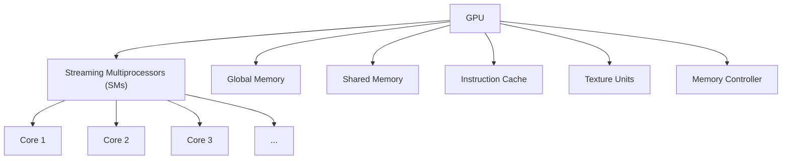
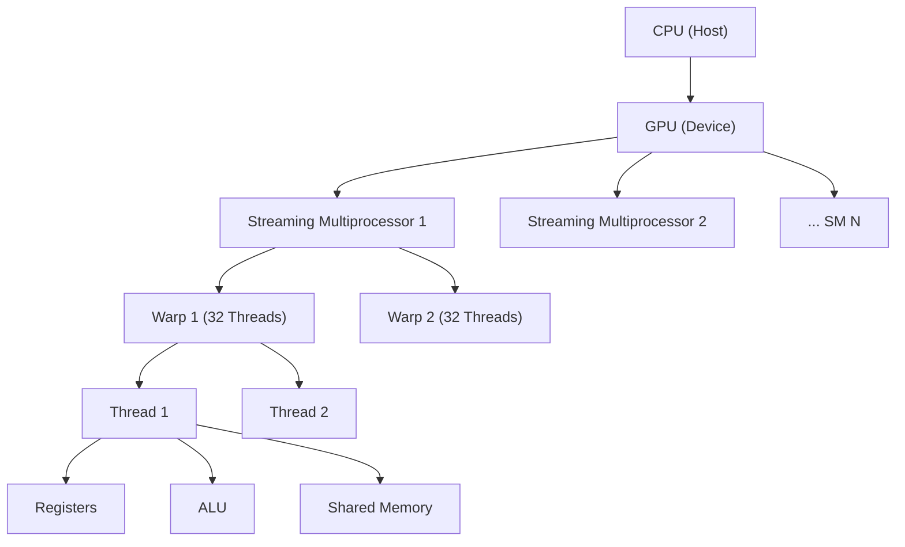
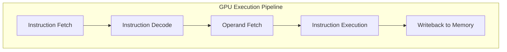
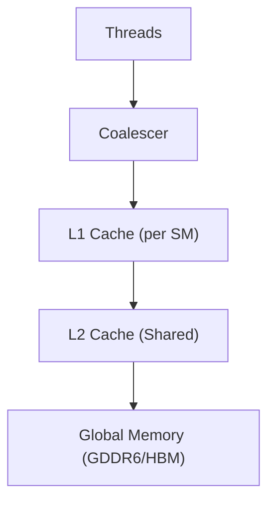

---

title: Introduction to GPU - What is a Graphics Processing Unit?
description: Learn what a GPU is, how it works, key architectural elements, and its growing impact on industries like AI, gaming, and scientific computing.
keywords:
- GPU  
- Graphics Processing Unit  
- GPU architecture  
- GPU in AI  
- Parallel computing  
- Deep learning GPU  
- GPU applications  
- GPU meaning  
- GPU definition  
- GPU full form  
- GPU vs CPU  
- GPU cores  
- GPU function  
- How GPU works  
- Types of GPU  
- GPU for gaming  
- GPU acceleration  
- Integrated GPU  
- Dedicated GPU  
- GPU rendering  
- GPU compute  
- CUDA GPU  
- OpenCL GPU  
- GPU performance  
- High-performance computing (HPC)  
- GPU memory  
- Real-time rendering  
- 3D graphics GPU  
- Machine learning GPU  
- Tensor cores  
- GPU power consumption  
- GPU technologies  
- GPU programming  
- Evolution of GPU  
- GPU in scientific computing  
- Modern GPU design  
- Future of GPUs  


---


import Tabs from '@theme/Tabs';
import TabItem from '@theme/TabItem';

---

# What is a GPU (Graphics Processing Unit)?

A **Graphics Processing Unit (GPU)** is a specialized processor designed to accelerate the rendering of images and visual data. Originally built for gaming and graphics, GPUs have evolved into high-performance computing engines powering fields like artificial intelligence (AI), deep learning, video processing, and scientific simulations.

GPUs excel at **parallel processing**, meaning they can perform thousands of operations simultaneously, making them ideal for tasks involving large-scale data and repetitive calculations.
<details>
<summary> More easy terms</summary>
# What is a GPU (Graphics Processing Unit)?

A **Graphics Processing Unit (GPU)** is a specialized electronic circuit designed to rapidly manipulate and alter memory to accelerate the creation of images, videos, and animations for display. While originally created for rendering graphics in video games and 3D applications, modern GPUs have evolved into powerful parallel processors used across many computing fields.

## Key Characteristics of GPUs

1. **Massively Parallel Design**:
   - Contains hundreds/thousands of smaller cores (vs. CPU's few complex cores)
   - Optimized for executing many simple operations simultaneously

2. **Specialized for Throughput**:
   - Processes large blocks of data in parallel
   - Excels at repetitive calculations on large datasets

3. **Visual Computing Focus**:
   - Originally designed for real-time graphics rendering
   - Handles matrix/vector operations efficiently (crucial for graphics)

</details>

## Table of Contents

* [How Does a GPU Work?](#how-does-a-gpu-work)
* [GPU Architecture Diagram](#gpu-architecture-diagram)
* [How GPUs Work – Theoretical Overview with Data Flow](#how-gpus-work--theoretical-overview-with-data-flow)
* [GPU Architecture in Detail](#gpu-architecture-in-detail)
* [SIMT Model](#simt-model)
* [Kernel and Thread Hierarchy](#kernel-and-thread-hierarchy)
* [GPU Execution Pipeline](#gpu-execution-pipeline)
* [Warp Scheduling and Latency Hiding](#warp-scheduling-and-latency-hiding)
* [Memory Access Hierarchy](#memory-access-hierarchy)
* [Performance Factors](#performance-factors)
* [Evolution of GPU SMs](#evolution-of-gpu-sms)
* [Summary](#summary)
* [FAQ](#frequently-asked-questions-faq)

## How Does a GPU Work?

Unlike CPUs that handle a few complex tasks at once, GPUs are optimized for executing thousands of simple operations in parallel. They achieve this using a massive array of cores designed to handle multiple threads concurrently.

### Architecture Highlights

* **Massive Core Count**: Modern GPUs contain hundreds to thousands of small cores.
* **Thread Parallelism**: Each core can manage multiple threads, enabling high throughput.
* **Memory Bandwidth**: GPUs have high memory bandwidth, allowing them to transfer data quickly, which is crucial for large-scale computations like AI model training.

## GPU Architecture Diagram



This architecture diagram highlights the key building blocks of a GPU: streaming multiprocessors (SMs), memory systems, and control units.

## How GPUs Work – Theoretical Overview with Data Flow

To appreciate the power of GPUs, it's helpful to follow the **end-to-end data flow** from CPU to GPU and back.

### 0. From CPU to GPU – The Journey Begins

 1. **Data Preparation (CPU)**
 
 Before the GPU can perform any computation, the necessary data must be transferred from the CPU (host) to the GPU (device). This step sets the stage for efficient parallel execution on the GPU.


<Tabs>
<TabItem value="Nvidia" label= "NVIDIA CUDA">

```cpp
// Allocate memory on GPU
float* d_data;
cudaMalloc((void**)&d_data, size);

// Copy data from CPU (host) to GPU (device)
cudaMemcpy(d_data, h_data, size, cudaMemcpyHostToDevice);
```

</TabItem>
<TabItem value="AMD" label="AMD (HIP)"> 

```cpp // Allocate memory on GPU float* d_data; 
hipMalloc((void**)&d_data, size);
// Copy data from CPU (host) to GPU (device)
hipMemcpy(d_data, h_data, size, hipMemcpyHostToDevice);
```
</TabItem>
</Tabs>

---

###  What happens in this step?

***GPU Memory Allocation***

A block of memory is allocated on the GPU using `cudaMalloc` (for NVIDIA) or `hipMalloc` (for AMD HIP).

- This memory is typically in **global memory**, which is accessible by all threads during kernel execution.


***Host-to-Device Data Transfer**

The CPU-side data (`h_data`) is transferred to the GPU-side memory (`d_data`) using `cudaMemcpy` or `hipMemcpy`.

- The direction of the transfer is explicitly specified using the `HostToDevice` flag.

:::note
<details>
<summary> **Why It Matters** </summary>

- The GPU cannot access CPU memory directly; all data needed for computation must reside in the GPU’s memory space.
- This step is critical for performance: improper or inefficient memory handling can become a major bottleneck in GPU-accelerated applications.
</details>
:::
---


2. **Kernel Launch**

***What Is a Kernel Launch?***

A **kernel** is a function written to run on the GPU and executed by many threads in parallel.  
A **kernel launch** is the process by which the **host (CPU)** instructs the **device (GPU)** to start executing that function across a grid of threads.

<Tabs>

<TabItem value="NVIDIA" label="NVIDIA (CUDA)">

```cpp
// Launch kernel from CPU
my_kernel<<<gridDim, blockDim>>>(d_data);
```
</TabItem>

 <TabItem value="AMD" label="AMD (HIP)">

```cpp 
// Launch kernel from CPU
 my_kernel<<<gridDim, blockDim>>>(d_data);
 ``` 
 </TabItem> 
 </Tabs>

This is a key step in GPU programming — it moves computation from the CPU to the massively parallel cores of the GPU.

   * CPU initiates a GPU kernel function.
   * GPU executes the kernel across many threads simultaneously.

## GPU Architecture in Detail

**Streaming Multiprocessors (SMs)** are the core units in a GPU. Each SM includes:
<details>
<summary> What is Streaming Process </summary>
# Streaming Multiprocessors (SMs) in GPU

Streaming Multiprocessors (SMs) are the core units in a **Graphics Processing Unit (GPU)**, designed to process data in parallel. Each SM is capable of executing multiple threads concurrently, enabling high-throughput performance. The streaming process in a GPU involves the following key elements:

## Key Components of Streaming Process in SMs:
1. **Warp**: A group of threads (typically 32 threads) that are executed together on the SM.
2. **Thread Blocks**: A collection of threads grouped together in a grid, which are mapped to SMs for execution.
3. **Registers and Shared Memory**: Each SM has its own set of registers and shared memory, which are used by threads for computation and data sharing.
4. **Execution Pipeline**: The SM executes the threads in a pipeline, performing arithmetic operations, memory accesses, and synchronization as needed.

# Streaming Multiprocessors (SMs) in GPUs: NVIDIA vs AMD

## Core Processing Units
| Component          | NVIDIA Term           | AMD Term             | Notes                                                                 |
|--------------------|-----------------------|----------------------|-----------------------------------------------------------------------|
| Basic Unit         | SM (Streaming Multiprocessor) | CU (Compute Unit)    | AMD CUs are typically smaller in size                                |
| Sub-components     | Processing Blocks     | SIMD Units           | NVIDIA splits SMs into partitions (e.g., 4 per SM in Ampere)         |
| Execution Cores    | CUDA Cores            | Stream Processors    | NVIDIA: 64-128 per SM; AMD: 64 per CU (GCN) or 32 (RDNA)             |

## Thread Organization
| Concept            | NVIDIA                | AMD                  | Details                                                              |
|--------------------|-----------------------|----------------------|-----------------------------------------------------------------------|
| Thread Group       | Warp (32 threads)     | Wavefront           | AMD: 64 threads in GCN, 32 in RDNA                                   |
| Thread Block       | Thread Block          | Work Group          | Max size: NVIDIA 1024, AMD 1024 (architecture-dependent)             |
| Scheduling         | GigaThread Engine     | ACE (Asynchronous Compute Engine) | AMD uses multiple independent schedulers                           |

## Memory Architecture
| Memory Type        | NVIDIA                | AMD                  | Key Differences                                                     |
|--------------------|-----------------------|----------------------|-----------------------------------------------------------------------|
| Shared Memory      | Shared Memory         | LDS (Local Data Store) | Similar functionality, different implementations                   |
| Cache Hierarchy    | L1/L2/Unified         | L0/L1/L2 + Infinity Cache | AMD's Infinity Cache is unique to RDNA2/3                          |
| Register File      | Per-thread            | Shared per Wavefront | NVIDIA provides more registers per thread                           |

## Execution Models
| Feature            | NVIDIA                | AMD                  |
|--------------------|-----------------------|----------------------|
| Architecture       | SIMT                  | SIMD                 |
| Divergence Handling| Dynamic Warp Scheduling | Wavefront Serialization |
| Parallel Execution | Warp-level            | Wavefront-level      |


## Key Differences Summary
1. **NVIDIA SMs** are generally larger than AMD CUs
2. **AMD Wavefronts** changed size from 64→32 threads in RDNA
3. **Memory Systems**: NVIDIA uses unified memory, AMD uses HBCC
4. **Execution**: NVIDIA's SIMT handles divergence better than AMD's SIMD
5. **Special Units**: NVIDIA has dedicated Tensor/RT cores, AMD integrates accelerators in CUs

</details>

## Streaming Process Steps (After Data Transfer from CPU to GPU):

In modern GPUs, parallel processing is the key to achieving high performance, particularly in tasks such as graphics rendering, machine learning, and scientific simulations. The **Streaming Multiprocessors (SMs)** in the GPU are designed to process large amounts of data in parallel by utilizing many threads working simultaneously on different parts of the data. 

Before the processing begins, the data must first be transferred from the **CPU to the GPU** which we already seen in [step 0](./what_is_gpu.md#how-gpus-work--theoretical-overview-with-data-flow). This transfer typically occurs through a high-speed bus like **PCIe**. Once the data is transferred, the GPU takes over, executing complex calculations and operations on the data in parallel. The streaming process that follows utilizes the GPU’s architecture to maximize throughput and computational efficiency. Here’s how the streaming process unfolds:

1. **Data Loading into GPU Memory**:
   - Once the CPU transfers data to the GPU's **global memory**, the GPU begins loading this data into its **shared memory** or **registers** on the **Streaming Multiprocessors (SMs)**.
   - **Global memory** is where data is initially stored after transfer from the CPU, but this memory is relatively slower compared to the local memory in the SMs (i.e., registers and shared memory). Therefore, the data must be loaded into faster memory to improve the efficiency of computations.
   - **Shared memory** is located within the SM and is much faster to access than global memory, so the GPU loads data from the global memory into shared memory for the processing steps that follow. Registers are used for thread-specific fast storage during computation.

2. **Thread Block Assignment**:
   - The data is organized into **thread blocks**, which consist of a group of threads. Each thread block is mapped to a specific SM on the GPU, allowing the work to be divided across many SMs for parallel processing.
   - The threads within each thread block execute the same program but work on different parts of the data. This is crucial for efficient parallel processing.
   
3. **Warp Scheduling**:
   - The threads within a block are grouped into **warps**, where a warp consists of 32 threads that execute in parallel. These warps are then scheduled for execution on the SMs.
   - **Warp Schedulers** ensure that warps are executed efficiently by mapping them to the available execution resources of the SMs, optimizing the GPU's parallel execution capacity.

4. **Instruction Decoding**:
   - **Instruction Decoders** are responsible for translating high-level code into machine instructions that can be executed by the GPU. The decoded instructions are dispatched to the relevant execution units of the SM, such as **ALUs** for mathematical computations or other specialized units for tasks like data loading or memory operations.

5. **Execution in ALUs**:
   - The **ALUs (Arithmetic Logic Units)** carry out the actual computations (like arithmetic, logical operations) on the data. Each thread in the warp executes the same instruction but on different data, which allows the GPU to process large amounts of data in parallel.

6. **Data Access from Registers and Shared Memory**:
   - **Registers** are used by each thread to store local, thread-specific data during execution. These registers offer the fastest memory access but are limited in size.
   - **Shared memory** provides a space where threads within the same block can share data with one another, facilitating communication between threads and reducing the need to access slower global memory.

7. **Synchronization and Coordination**:
   - In parallel processing, synchronization ensures that threads that need to work together do so in a coordinated manner. The GPU provides mechanisms for **thread synchronization**, ensuring that all threads within a block properly communicate and do not interfere with each other’s memory access.

8. **Results Writing Back**:
   - Once the threads finish their computations, the results are either written back to **shared memory** or **global memory**. These results may be passed to other parts of the GPU pipeline for further processing (like rendering or post-processing).

9. **Data Transfer Back to CPU (Optional)**:
   - Once the GPU completes its computation, the results can be transferred back to the **CPU** if needed. This is done by moving data from the GPU’s **global memory** to the system memory of the CPU, often through PCIe or another data bus.

10. **Post-Processing or Output**:
    - In many applications, the results of the GPU computation are used directly for **output rendering** (in graphics processing) or **post-processing** (in machine learning or scientific applications). These results might be displayed, further analyzed, or used in additional computations.

## Key GPU Components Involved:
- **Warp Schedulers**: Manage and schedule threads for execution on SMs.
- **ALUs (Arithmetic Logic Units)**: Perform mathematical and logical computations.
- **Registers**: Provide fast, thread-specific memory.
- **Shared Memory**: Facilitates communication between threads in a block.
- **Instruction Decoders**: Decode high-level instructions for execution by the GPU.
- **Synchronization Mechanisms**: Ensure that threads execute in a coordinated, error-free manner.

This parallel processing workflow allows the GPU to handle massive datasets and complex computations, delivering high performance for tasks such as graphics rendering, deep learning, and scientific simulations.




## SIMT Model

* Threads are organized into **warps** (typically 32 threads).
* Each warp executes the **same instruction simultaneously** on different data.
* Divergence in thread execution (e.g., different branches) reduces efficiency.

## Kernel and Thread Hierarchy

A **kernel** is the function executed by GPU threads.

* Threads are grouped into **blocks**.
* Blocks are organized into a **grid**.

```cpp
__global__ void add(int *a, int *b, int *c) {
    int idx = threadIdx.x + blockIdx.x * blockDim.x;
    c[idx] = a[idx] + b[idx];
}
```

## GPU Execution Pipeline (NVIDIA and AMD Terminology)



<details>
<summary> Instruction Fetch</summary>


<Tabs>
<TabItem value="nvidia" label="NVIDIA">

- The **Warp Scheduler** fetches instructions for execution.
- Instructions are grouped into **warps**, which are collections of 32 threads.
- Uses **SIMT (Single Instruction, Multiple Threads)** model to fetch instructions for the entire warp simultaneously.

</TabItem>

<TabItem value="amd" label="AMD">

- In **RDNA** architecture, the **Wavefront Scheduler** handles this step.
- AMD uses **wavefronts** (groups of 64 threads), similar in concept to NVIDIA's warps.
- The **Command Processor (CP)** fetches and dispatches instructions for execution.

</TabItem>
</Tabs>

</details>

<details>
 <summary>Decode</summary>

<Tabs>
<TabItem value="nvidia" label="NVIDIA">

- The **Instruction Decoder** decodes the fetched instructions.
- This stage translates the instructions into GPU-specific operations.
- Operations are dispatched to execution units like **ALUs**, **Tensor Cores**, or **Memory Units**.

</TabItem>

<TabItem value="amd" label="AMD">

- Instructions are decoded by the **Shader Core** inside the **Compute Unit (CU)**.
- AMD uses a **VLIW (Very Long Instruction Word)** or scalar+vector ISA (in RDNA), enabling parallel execution.
- The decoded instructions are optimized for execution across **Wavefronts**.

</TabItem>
</Tabs>
</details>
---

<details>
<summary> Operand Fetch</summary>

<Tabs>
<TabItem value="nvidia" label="NVIDIA">

- The **Memory Controller** fetches operands from **global memory** or **shared memory** within the SM.
- Fetched data is placed into **registers** or **shared memory** for execution.

</TabItem>

<TabItem value="amd" label="AMD">

- **Memory Unit (MU)** fetches operands from **global memory** or **Shared Local Memory (SLM)** in the **Compute Unit**.
- Data may also be fetched by the **Texture Unit** for graphics workloads.
- Fetched data is loaded into **registers** or SLM for execution.

</TabItem>
</Tabs>
</details>
---


<details>
<summary> Instruction Execution</summary>
<Tabs>
<TabItem value="nvidia" label="NVIDIA">

- Decoded instructions are executed by **Execution Units (EUs)** inside each **Streaming Multiprocessor (SM)**.
- **ALUs (Arithmetic Logic Units)** handle standard arithmetic and logic operations.
- **Tensor Cores** perform high-throughput matrix operations, especially useful in deep learning tasks.

</TabItem>

<TabItem value="amd" label="AMD">

- Execution is carried out by **Execution Units (EUs)** within each **Compute Unit (CU)**.
- **Scalar Units (SUs)** handle general-purpose scalar operations.
- **Vector Units (VUs)** execute SIMD-style parallel instructions.
- **Matrix Units**, available in RDNA and CDNA architectures, handle tensor operations like matrix multiplications.

</TabItem>
</Tabs>

</details>

<details>
<summary> Writeback</summary>

<Tabs>
<TabItem value="nvidia" label="NVIDIA">

- After execution, results are written back to **registers**, **shared memory**, or **global memory**, based on the instruction.
- The **Memory Controller** manages writes to **global memory**.
- **Shared memory** is typically used for temporary results or inter-thread communication within a block.

</TabItem>

<TabItem value="amd" label="AMD">

- Results are written to **Registers**, **Global Memory**, or **Local Data Share (LDS)**.
- The **Memory Controller** coordinates data transfers to memory.
- In graphics pipelines, results may be written directly to the **Render Target** for final image output.

</TabItem>
</Tabs>
</details>

---

### Terminology Comparison (NVIDIA vs AMD):

| Stage               | **NVIDIA Terminology**                        | **AMD Terminology**                         |
|---------------------|-----------------------------------------------|---------------------------------------------|
| Instruction Fetch    | Warp Scheduler, SIMT                         | Wavefront Scheduler, Command Processor     |
| Decode              | Instruction Decoder, Decoding Units           | Shader Core, VLIW                          |
| Operand Fetch       | Memory Controller, Registers, Shared Memory   | Memory Unit, Registers, Local Memory       |
| Execution           | Execution Units (EUs), ALUs, Tensor Cores      | Execution Units (EUs), Scalar Units, Vector Units, Matrix Units |
| Writeback           | Memory Controller, Registers, Shared Memory   | Memory Controller, Local Data Share (LDS), Global Memory |

---
:::tips
This pipeline ensures that data is processed efficiently on the GPU, leveraging massive parallelism. Both NVIDIA and AMD utilize similar concepts but have their own architectural implementations and terminologies to optimize computation, memory access, and instruction handling.
:::

---

## Warp Scheduling and Latency Hiding

In massively parallel architectures like GPUs, each **Streaming Multiprocessor (SM)** in NVIDIA or **Compute Unit (CU)** in AMD executes thousands of threads. These threads are grouped into **warps** (NVIDIA, 32 threads) or **wavefronts** (AMD, 64 threads). However, not all instructions complete instantly—many are delayed due to **memory latency**, **resource conflicts**, or **data dependencies**.

To keep the GPU cores busy and avoid stalling, GPUs use **warp/wavefront scheduling**. This technique rapidly switches between different groups of threads (warps/wavefronts), allowing one to execute while others are waiting. This approach is crucial for **hiding latency** and ensuring **high throughput**.

### What Does This Step Do?
- Decides **which warp/wavefront** gets to execute next.
- Helps **balance workloads** across execution units.
- Ensures **maximum utilization** of compute resources.

### Why Is It Required?
- Memory operations often take hundreds of cycles to complete.
- Without scheduling, cores would sit idle during stalls.
- Rapid switching between threads allows GPUs to **hide latency** and **overlap memory with compute**.

---

<Tabs>
<TabItem value="nvidia" label="NVIDIA">

- NVIDIA uses **warp-based scheduling**: 32 threads per warp.
- **Warp Schedulers** pick a ready warp each cycle to issue instructions.
- Supports **zero-overhead context switching** between warps.
- Scheduling strategies include:
  - **Round-robin**
  - **Greedy-then-oldest (GTO)**
  - **Two-level warp scheduling (TLWS)**
- **SIMT (Single Instruction, Multiple Threads)** model is followed, where all threads in a warp execute the same instruction.
- Up to 64 warps can be active per SM, depending on resource availability.

</TabItem>

<TabItem value="amd" label="AMD">

- AMD uses **wavefront-based scheduling**: 64 threads per wavefront.
- **Wavefront Schedulers** in each **Shader Core** decide which wavefront to execute.
- AMD relies on **vector-SIMD** execution, optimizing instruction parallelism.
- Scheduling often includes:
  - **Round-robin or priority-based selection**
  - **Scoreboarding** to resolve dependencies
- Each Compute Unit (CU) can manage dozens of active wavefronts to keep execution units busy.

</TabItem>
</Tabs>

## Memory Access Hierarchy



* Memory requests are coalesced for efficiency.
* Access sequence: Registers → L1 → L2 → DRAM
* Modern GPUs offer memory bandwidth exceeding **750 GB/s**.

## Performance Factors

| Factor        | Description          | Optimization Tip                 |
| ------------- | -------------------- | -------------------------------- |
| Compute Bound | ALU is bottleneck    | Increase arithmetic intensity    |
| Memory Bound  | Limited by bandwidth | Use shared memory effectively    |
| Occupancy     | Threads per SM       | Balance block size and registers |

## Evolution of GPU SMs

| Architecture | Year | Key Innovations                    |
| ------------ | ---- | ---------------------------------- |
| Fermi        | 2010 | First SM-based architecture        |
| Kepler       | 2012 | Dynamic Parallelism introduced     |
| Maxwell      | 2014 | Energy-efficient scheduling        |
| Pascal       | 2016 | FP16 support, unified memory       |
| Volta        | 2017 | Tensor cores, fine-grained threads |
| Ampere       | 2020 | 3rd-gen Tensor cores, higher perf  |
| Hopper       | 2022 | Transformer Engine for AI/ML       |

Also:

* **AMD**: RDNA (graphics), CDNA (compute)
* **Qualcomm**: Adreno GPUs optimized for mobile

## Summary

GPUs deliver immense parallel performance by executing thousands of threads in the **SIMT model**, using a hierarchy of memory and schedulers. Understanding the GPU execution pipeline helps developers optimize applications in graphics, AI, and beyond.

### Final GPU Structure Diagram


> **Note:**
>
> * **NVIDIA**: Streaming Multiprocessors (SMs), Warps
> * **AMD**: Compute Units (CUs), Wavefronts (64 threads)

---
### Frequently Asked Questions (FAQ)

#### 1. **What is the difference between CUDA and HIP?**
- **CUDA** is NVIDIA's parallel computing platform and API, designed to leverage the power of NVIDIA GPUs for general-purpose computing.  
- **HIP (Heterogeneous Interface for Portability)** is AMD's parallel computing framework, designed to be compatible with CUDA, enabling the portability of code between AMD and NVIDIA GPUs.

#### 2. **What is GPU memory allocation?**
- **GPU memory allocation** refers to the process of reserving memory on the GPU (device) to store data that will be processed. This is typically done using functions like `cudaMalloc` (for NVIDIA) or `hipMalloc` (for AMD).

#### 3. **How does data transfer between CPU and GPU work?**
- Data needs to be transferred from the **CPU (host)** to the **GPU (device)** for computation. This is accomplished using memory copy functions like `cudaMemcpy` or `hipMemcpy`, which transfer data from host memory to device memory.

#### 4. **What are Tensor Cores in NVIDIA GPUs?**
- **Tensor Cores** are specialized processing units in NVIDIA GPUs designed to accelerate operations commonly used in deep learning, such as matrix multiplications. They are particularly efficient for training neural networks and performing high-throughput computations.

#### 5. **What are the Execution Units (EUs) in GPUs?**
- **Execution Units (EUs)** are the hardware components within GPUs responsible for executing instructions. In NVIDIA GPUs, these are within the **Streaming Multiprocessors (SMs)**, while in AMD GPUs, they are part of the **Compute Units (CUs)**.

#### 6. **How are tensor operations handled on AMD GPUs?**
- AMD GPUs handle tensor operations using **Matrix Units**, which are specialized components within their RDNA and CDNA architectures designed for high-performance matrix calculations, commonly used in AI and deep learning workloads.

#### 7. **What is the importance of memory management in GPU programming?**
- Efficient **memory management** is crucial for performance in GPU programming. Poor memory allocation and transfer strategies can become bottlenecks, reducing the overall performance of GPU-accelerated applications. Ensuring optimal memory usage can lead to significant speedups in computation.

#### 8. **What are the main differences between AMD and NVIDIA GPU architectures?**
- **NVIDIA** relies on **Streaming Multiprocessors (SMs)** with ALUs and Tensor Cores for execution, focused on deep learning and high-performance computing.  
- **AMD** uses **Compute Units (CUs)**, which contain Scalar Units for general computation and Vector Units for parallel processing. AMD also uses specialized **Matrix Units** in RDNA and CDNA for tensor operations.
