import AdBanner from '@site/src/components/AdBanner';
import Tabs from '@theme/Tabs';
import TabItem from '@theme/TabItem';

# Introduction 

CMake is the `de facto` standard build system generator for modern C++ development. Whether you're building for `Linux`, `Windows`, or `embedded systems`, mastering CMake will save you countless hours of pain that traditional Makefiles tend to cause. This guide is a step-by-step tutorial to help you build a simple C++ project using `CMakeLists.txt`.

🎥 **Watch the Playlist**: 
<div style={{ position: 'relative', paddingBottom: '56.25%', height: 0, overflow: 'hidden', marginTop: '20px' }}>
  <iframe 
    src="https://www.youtube.com/embed/WYKgxA4c4s4"
    title="MakeFile tutorial"
    style={{ position: 'absolute', top: 0, left: 0, width: '100%', height: '100%' }}
    frameBorder="0"
    allow="accelerometer; autoplay; clipboard-write; encrypted-media; gyroscope; picture-in-picture; web-share"
    allowFullScreen
  />
</div>

---

## Table of Contents
- [1. What You’ll Learn](#section-1-core-concepts)
- [2. Core Concepts: Makefile Limitation](#makefile-limitations)
        * Why CMake came?
        * CMake Design Philosophy
        * Generators in CMake
        * How it solves Makefile limitations.

- [3. C++ Simple Project with CMake](#section-2-c-simple-project-with-cmake)
- [4. Common CMake Commands](#section-3-common-cmake-commands)
- [6. Final Thoughts and Next Steps](#final-thoughts-and-next-steps)
        * [More Article](#more-articles)

---
<div style={{ textAlign: "center" }}>

<div>
  <AdBanner />
</div>

## Section 1: Core Concepts

</div>


CMake is much more than just a build tool it’s a build **system generator** that abstracts away platform-specific quirks and helps developers write maintainable, cross-platform code. In this guide, you’ll not only understand *how* to use CMake, but also *why* it was designed the way it is. Whether you’re transitioning from Makefiles or starting fresh, this guide will give you the foundation and best practices to build and scale your C++ projects efficiently.

:::important **By the end, you’ll learn:**

* The **design philosophy** behind CMake and its separation of configuration from build
* How to **build a basic C++ project** with CMake from scratch
* The use of **modular `CMakeLists.txt` files** and directory structure planning
* How to define and manage **targets** (`add_executable`, `add_library`)
* Linking static and shared libraries the right way
* Using **CMake variables**, cache, options, and custom flags
* Working with **generators** like Unix Makefiles, Ninja, and Visual Studio
* Managing **external dependencies** using `find_package`, `FetchContent`, and `ExternalProject`
* Setting up and using **different build types** (Debug, Release, etc.)
* Writing **cross-platform CMake code** that works on Windows, macOS, and Linux
* Debugging common issues and **avoiding CMake anti-patterns**
* Best practices used in **large-scale, professional C++ codebases**
:::


<div>
  <AdBanner />
</div>

### Makefile Limitations

In the [previous article](https://www.compilersutra.com/docs/how_to/how_to_build_cpp_with_make), we explored how Makefiles work and how to use them to build a C++ project.

Make is `powerful` and `lightweight` but as projects grow larger or need to be built across platforms (like `Linux, macOS, and Windows`), the shortcomings of Makefiles become more evident. Let’s explore why Makefiles may not be the best tool for long-term or large-scale C++ development.

:::caution  Why Rethink Makefiles?
While Makefiles offer low-level control over how things are built, they are also very manual and procedural. This makes them fragile and harder to maintain as complexity grows. Modern software development demands tools that are:

- Cross-platform
- Modular and reusable
- Easy to maintain
- Scalable across teams and systems
:::tip Makefiles don’t check all these boxes
:::


**Lets discuss its limitation**

| Limitation | Description |
|------------|-------------|
| Platform Dependency | Makefiles often rely on Unix-specific shell commands (like `rm`, `cp`, `mkdir`) that don’t work on Windows without additional tools. |
| Poor Modularity | There’s no clean, native way to break up a build into reusable components across multiple files. |
| Lacks High-Level Abstractions | All build rules and dependencies must be manually defined, leading to repetitive and verbose code. |
| Tedious for Complex Projects | Managing multiple executables, libraries, source directories, and build configurations becomes error-prone and hard to scale. |
| No Dependency Management | Make does not offer built-in tools to handle third-party packages or external dependencies, unlike modern alternatives. |


## Why CMake Came

<Tabs>

<TabItem value="Why CMake Came" label="Why CMake Came" default>

> CMake was created to simplify cross-platform builds and abstract away low-level build 
>  details, enabling developers to work with a unified configuration system that generates  platform-specific build files.


<details>
<summary><strong> Digram Explanation </strong></summary>
    :::tip modern software development

    In `modern software development`, traditional build systems like manual `Makefiles` posed significant challenges. 
    - These approaches often relied heavily on platform-specific scripting, leading to compatibility issues across different environments.

    - Developers had to write separate scripts for Windows, Linux, and macOS, which made collaboration and portability difficult.

    - As projects grew larger, these manually maintained scripts became harder to scale and debug. 

    - This lack of scalability and reliability often led to frequent build errors and, ultimately, developer frustration.

    - To address these recurring pain points, the need for a more robust, flexible, and cross-platform build system became evident. 

    - This shift marked the introduction of **CMake** as a solution  a tool designed to simplify builds, enable cross-platform compatibility, and support large-scale modular projects with ease.
    :::

    📊 **Diagram Breakdown**

    
    :::note 🔴 **Problem Section: Traditional Build Challenges**

    * **Manual Makefiles**
    Developers manually write `Makefile`s to describe how code should be compiled.

    * **Platform-Specific Build Scripts**
    Scripts are often tailored to specific systems, making them brittle on other platforms.

    * **Errors on Other Platforms**
    When the same codebase is moved to a different OS or environment, builds frequently break.

    * **Hard to Maintain Large Projects**
    As the codebase scales, maintaining these scripts becomes cumbersome and error-prone.

    * **Developer Frustration**
    The combined effect of all the above  inconsistent builds and wasted time  leads to developer dissatisfaction.
    :::

    :::caution 🔁 **Turning Point**

    * **CMake Introduced**
    A pivot in the development workflow where the shift from traditional to modern build systems begins.
    :::
    :::tip 🔵 **Solution Section: CMake Benefits**

    * **Cross-Platform Support**
    CMake abstracts platform differences, enabling seamless builds on Windows, Linux, and macOS.

    * **Generates Native Build Files**
    It can create platform-specific files like `Makefile`, `Ninja`, or `MSBuild` without manual effort.

    * **Easy Configuration with `CMakeLists.txt`**
    Centralized and declarative config file simplifies project setup.

    * **Modular & Scalable**
    Suits both small and enterprise-level projects due to its modular structure.
    :::
   
    </details>

</TabItem>

<TabItem value="Design Philosophy" label="CMake Design Philosophy">

>CMake separates **configuration** from **execution**. You describe *what* your project needs, and CMake generates the appropriate native build files for your platform and toolchain.

It follows a two-phase design philosophy:
 - **Configuration Phase** – You write `CMakeLists.txt` to declare what your project needs (e.g., source files, dependencies, compiler settings).
 
 - **Generation Phase** – CMake translates this into `native build files` suited to the `host system` (`Makefiles`, `Ninja`, `MSBuild` ,etc.).

```mermaid
flowchart LR
    A["**Configure**<br/><i>CMakeLists.txt</i><br/>**Define your project**"] --> B["⚙️ **Generate**<br/><i>Native Build Files<i><br/>**(Make, Ninja, MSBuild)**"]
    B --> C["**Build**<br/>Using selected generator"]
    C --> D["**Run**<br/>Execute compiled binary"]

    style A fill:#ffe6e6,stroke:#cc0000,stroke-width:2px,color:#1a1a1a
    style B fill:#fff3cd,stroke:#ffcc00,stroke-width:2px,color:#1a1a1a
    style C fill:#e2f0fb,stroke:#3399cc,stroke-width:2px,color:#1a1a1a
    style D fill:#e6ffe6,stroke:#33cc33,stroke-width:2px,color:#1a1a1a
``` 


This configuration is portable and works across systems.

<details>
<summary><strong>Digram Explanation</strong></summary>

CMake follows a clean and structured workflow that separates the stages of a project build process: **configuration**, **generation**, **building**, and **execution**. This design philosophy allows developers to focus on *what* they want to build rather than *how* to build it across platforms. 

:::caution The above `flowchart visually represents` this pipeline, where each step builds upon the previous one, `creating a robust and reproducible build` system `suitable for modern software projects`.
:::

:::tip Let's understand digram in the details

* 🔴 **Configure**
  The developer writes a `CMakeLists.txt` file that describes the project structure, source files, dependencies, compiler options, etc. This file serves as the high-level configuration input to CMake.

* 🟡 **Generate**
  CMake processes the configuration and produces **native build files** depending on the system and chosen generator (like `Make`, `Ninja`, or `MSBuild`). This abstracts away platform-specific differences.

* 🔵 **Build**
  The generated native build files are executed using the respective build system. This step compiles the source code into executable binaries or libraries.

* 🟢 **Run**
  The final binaries can now be executed or tested. This marks the completion of the build pipeline.
:::
</details>
</TabItem>

<TabItem value="Generators" label="Generators in CMake">

A **generator** in CMake is the backend tool that produces the actual build system files for your project.
Think of it like a **translator** it takes your `CMakeLists.txt` and converts it into native build scripts for tools like `make`, `ninja`, or Visual Studio.

For example:

* `Unix Makefiles` → generates traditional `Makefile`s
* `Ninja` → generates `build.ninja` files for the Ninja build tool (fast and minimal)
* `Visual Studio` → generates `.sln` and `.vcxproj` files for Windows development

You specify the generator using the `-G` flag when invoking `cmake`.

**Install CMake**

<Tabs>

<TabItem value="linux" label="Linux">

```rust
sudo apt update
sudo apt install cmake
```

</TabItem>

<TabItem value="macos" label="macOS">

Using Homebrew:

```python
brew install cmake
```

</TabItem>

<TabItem value="windows" label="Windows">

Download the installer from:
👉 [https://cmake.org/download/](https://cmake.org/download/)

Or install using Winget:

```powershell
winget install Kitware.CMake
```

</TabItem>

</Tabs>

<div>
  <AdBanner />
</div>


### List All Available Generators

You can check which generators are available on your system using:

```python
cmake --help
```
:::tip Output related to generator
:::

```rust
The following generators are available on this platform (* marks default):
* Unix Makefiles               = Generates standard UNIX makefiles.
  Ninja                        = Generates build.ninja files.
  Ninja Multi-Config           = Generates build-<Config>.ninja files.
  Watcom WMake                 = Generates Watcom WMake makefiles.
  Xcode                        = Generate Xcode project files.
  CodeBlocks - Ninja           = Generates CodeBlocks project files (deprecated).
  CodeBlocks - Unix Makefiles  = Generates CodeBlocks project files (deprecated).
  CodeLite - Ninja             = Generates CodeLite project files (deprecated).
  CodeLite - Unix Makefiles    = Generates CodeLite project files (deprecated).
  Eclipse CDT4 - Ninja         = Generates Eclipse CDT 4.0 project files (deprecated).
  Eclipse CDT4 - Unix Makefiles= Generates Eclipse CDT 4.0 project files (deprecated).
  Kate - Ninja                 = Generates Kate project files (deprecated).
  Kate - Ninja Multi-Config    = Generates Kate project files (deprecated).
  Kate - Unix Makefiles        = Generates Kate project files (deprecated).
  Sublime Text 2 - Ninja       = Generates Sublime Text 2 project files (deprecated).
  Sublime Text 2 - Unix Makefiles
                               = Generates Sublime Text 2 project files (deprecated).

```
> This displays a list of all generators supported by your current platform.


:::tip **Example Usage with Generator**

Use the `-G` flag to specify the generator when configuring your project:

🛠️ Selecting a Generator with `-G`

Use the `-G` flag to specify the generator when configuring your project:

```python
cmake -G "<GeneratorName>" ..
````
:::
<Tabs groupId="cmake-generators">

<TabItem value="ninja" label="🧵 Ninja">

```python
cmake -G "Ninja" ..
```
</TabItem>

<TabItem value="make" label="🧱 Unix Makefiles">

```python
cmake -G "Unix Makefiles" ..
```

</TabItem>

<TabItem value="vs2022" label="🪟 Visual Studio 17 2022">

```python
cmake -G "Visual Studio 17 2022" ..
```

> ℹ️ You can also specify architecture (e.g., Win64) for Visual Studio:

```python
cmake -G "Visual Studio 17 2022" -A x64 ..
```

</TabItem>

</Tabs>

</TabItem>

<TabItem value="Advantages" label="How CMake Solves Makefile Limitations and Generator vs Build">


:::tip Makefile Limitations Resolved by CMake

Traditional `Makefiles` often fall short in handling `complex`, `cross-platform` projects. CMake was designed to address `these limitations` by offering a `higher level` of abstraction and a more flexible build configuration process. 

- Whether you're targeting `Linux`, `Windows`, or `macOS`, `CMake` adapts to the environment, `ensuring your builds` are `portable`, `maintainable`, and `IDE-friendly`.
:::

:::important Key Advantages of CMake Over Makefiles:

* **Cross-platform generation:**
  CMake automatically generates native build files for various platforms including Linux, Windows, and macOS.

* **Built-in dependency management:**
  CMake tracks file changes and ensures only the affected parts of your project are rebuilt, improving efficiency.

* **IDE integration:**
  Easily generate project files for modern IDEs like Visual Studio, CLion, and Xcode, enhancing the developer experience.

* **Support for modular projects:**
  Large and complex codebases are easily managed using features like `add_subdirectory()` and `target_link_libraries()`, promoting better organization and scalability.
:::

:::tip Generator vs 🛠️ Build in CMake
:::

> In CMake’s workflow, **"Generator"** and **"Build"** represent two distinct phases. The **generator** is responsible for converting your CMake project (defined in `CMakeLists.txt`) into native build files (like `Makefiles`, `Ninja files`, or `Visual Studio solutions`) depending on your target environment. Once generated, the **build** phase is where your actual source code is compiled into executables or libraries using the generated files. In simpler terms: ***generator creates the blueprint***, and ***build uses that blueprint to construct your project.***


:::important 🔄 Comparison: Generator vs Build

| Aspect        | Generator Phase                                | Build Phase                                     |
| ------------- | ---------------------------------------------- | ----------------------------------------------- |
| **Purpose**   | Converts CMake scripts into native build files | Compiles code using generated files             |
| **Tool**      | CMake                                          | Make / Ninja / MSBuild / etc.                   |
| **Input**     | `CMakeLists.txt`                               | Native build files (Makefile, `.ninja`, `.sln`) |
| **Output**    | Build system files for chosen generator        | Compiled binaries (executables/libraries)       |
| **Command**   | `cmake -G "Ninja"` or `cmake ..`               | `ninja`, `make`, or `cmake --build .`           |
| **Frequency** | Usually done once or when config changes       | Done every time you want to build or rebuild    |
:::

</TabItem>

</Tabs>


<div>
  <AdBanner />
</div>


<div align="center">

## Section 2: C++ Simple Project with CMake

</div>

We’re creating a ***modular C++ project*** using ***CMake*** as the build system.

:::caution The goal of this mini-project is to:
:::

>>
>>                * Demonstrate how to structure a `basic C++ project` with `multiple files`.
>>                * Use **CMake** to build the project instead of a manual `Makefile`.
>>                * Keep the code modular with separate header and source files.
>>

:::tip 📌 **What the Program Does:**

* Add two numbers using a custom `add()` function defined in its own `.cpp` and `.hpp` files.
* Print the result from the `main.cpp`.

:::important To achieve this, we will:
1. **Create three C++ files**:
   * `main.cpp` → entry point, prints the result.
   * `add.cpp` → defines the `add()` logic.
   * `add.hpp` → declares the function prototype.
2. **Write a CMakeLists.txt** file to tell CMake how to build the project.
3. **Use build commands** to compile and run the program.
:::

:::note Let's see the project layout
:::


```python
MyModularApp/
├── CMakeLists.txt
├── main.cpp
├── add.cpp
├── add.hpp
└── build/
```

:::tip Let’s break down each file and directory:
:::
```rust
| File/Folder      | Description                                                                                                                                                                        |
| ---------------- | ---------------------------------------------------------------------------------------------------------------------------------------------------------------------------------- |
| `CMakeLists.txt` | This is the main CMake build configuration file. It defines how the project is compiled—listing source files, include directories, and compiler options.                           |
| `main.cpp`       | The entry point of your application. This file contains the `main()` function that gets executed when the program runs.                                                            |
| `add.cpp`        | This source file contains the implementation of one or more functions, likely defined in the `add.hpp` header. It’s compiled and linked into the final executable.                 |
| `add.hpp`        | A header file that declares functions (e.g., `int add(int, int);`) used across multiple source files. It allows the compiler to understand function signatures during compilation. |
| `build/`         | A directory (usually empty at first) where CMake will generate all build artifacts like Makefiles, object files, and executables. This keeps the source directory clean.           |

```
<Tabs>
<TabItem value="main" label="main.cpp">

```cpp
#include <iostream>
#include "add.hpp"

int main() {
    int result = add(10, 20);
    std::cout << "Sum is: " << result << std::endl;
    return 0;
}
```

**Explanation**:

* This is the entry point of the program.
* It includes the `add.hpp` header and calls the `add` function with two numbers.
* The result is printed to the console using `std::cout`.
</TabItem>
<TabItem value="add" label="add.cpp">

```cpp
#include "add.hpp"

int add(int a, int b) {
    return a + b;
}
```

**Explanation**:

* Implements the function `add()` declared in `add.hpp`.
* This file separates logic from the main application code for better modularity and reusability.
</TabItem>

 <TabItem value="header" label="add.hpp">

```cpp
#pragma once

int add(int a, int b);
```

**Explanation**:

* Declares the `add()` function.
* Uses `#pragma once` to prevent multiple inclusions of the header file during compilation.

</TabItem>
 <TabItem value="cmake" label="CMakeLists.txt">

```rust
cmake_minimum_required(VERSION 3.10)
project(MyModularApp)

add_executable(MyApp main.cpp add.cpp)
```

**Explanation**:

* Sets the minimum CMake version and project name.
* Instructs CMake to compile `main.cpp` and `add.cpp` into an executable called `MyApp`.
</TabItem>
 <TabItem value="build" label="Build Commands">

```rust
mkdir build
cd build
cmake ..
make
./MyApp
```

**Explanation**:

* Creates a `build/` directory for an out-of-source build.
* Runs CMake to generate build files.
* Compiles the project with `make`.
* Executes the final program.

</TabItem>
</Tabs>


<div>
  <AdBanner />
</div>


<div style={{ textAlign: "center" }}>

## Section 3: Common CMake Commands

</div>

`CMake provides powerful` **command-line flags** that let you control how your project is configured, built, and installed  especially useful for `scripting, automation, or multi-platform` builds.

---

 **🔧 `cmake` Command Structure**

```rust
cmake [options] <path-to-source>
```

Example:

```rust
cmake -DCMAKE_BUILD_TYPE=Release -G "Ninja" ..
```


:::tip Common CMake Flags
:::

| Flag                        | Description                                                                          |
| --------------------------- | ------------------------------------------------------------------------------------ |
| `-S <path>`                 | Specifies the **source directory** (CMake 3.13+)                                     |
| `-B <path>`                 | Specifies the **build directory** (CMake 3.13+)                                      |
| `-G <generator>`            | Choose a **build system** (e.g., "Ninja", "Unix Makefiles", "Visual Studio 17 2022") |
| `-DCMAKE_BUILD_TYPE=<type>` | Set build type: `Debug`, `Release`, `RelWithDebInfo`, or `MinSizeRel`                |
| `-D<VAR>=<value>`           | Define a **CMake cache variable**, e.g. `-DMY_FEATURE=ON`                            |
| `-Wdev`                     | Show developer warnings                                                              |
| `--build <dir>`             | Build a CMake-generated project without needing a Makefile or IDE                    |
| `--install <dir>`           | Run the `install` step defined in the `CMakeLists.txt`                               |
| `--preset <name>`           | Use a **CMake preset** (from `CMakePresets.json`)                                    |
| `-LA` or `-L`               | Print all cached CMake variables (useful for debugging)                              |

---

:::note Example: Full Command with Flags
:::

```rust
cmake -S . -B build \
  -DCMAKE_BUILD_TYPE=Release \
  -DDEBUG_LOGGING=ON \
  -G "Ninja"
```

Then build:

```rust
cmake --build build
```

---

 **Setting Install Prefix**

To control where files get installed with `make install` or `cmake --install`, use:

```rust
-D CMAKE_INSTALL_PREFIX=/custom/install/path
```

---

:::caution Always Use Out-of-Source Builds
:::

```rust
cmake -S . -B build
cmake --build build
```

This keeps source code clean and separates configs for different build types (Debug vs Release).

| Command                   | Purpose                                |
| ------------------------- | -------------------------------------- |
| `cmake_minimum_required`  | Sets minimum required version of CMake |
| `project()`               | Defines the project name and languages |
| `add_executable()`        | Adds an executable target              |
| `add_library()`           | Adds a library target                  |
| `target_link_libraries()` | Links libraries to targets             |
| `include_directories()`   | Adds include paths                     |
| `set()`                   | Sets a variable                        |

---

:::important Out-of-source builds generate all intermediary files in a separate folder, making cleanup and version control easier.

| Feature         | Makefile | CMake          |
| --------------- | -------- | -------------- |
| Cross-platform  | No       | Yes            |
| IDE Integration | Manual   | Native support |
| Dependency Mgmt | Manual   | Automatic      |
| Modularity      | Low      | High           |

:::tip keyword
* Use `target_include_directories` over global includes
* Leverage `target_compile_features` to enforce standards
* Avoid using relative paths for source files
:::
:::
---

<div>
  <AdBanner />
</div>

## Final Thoughts and Next Steps

CMake enables scalable, cross-platform C++ development with minimal hassle. Once you grasp its declarative design, you'll wonder how you ever managed with raw Makefiles.


:::tip  What's Next
:::

* Learn about **CMake for Static and Shared Libraries**
* Integrate **Unit Testing** using CMake and GoogleTest
* Optimize builds with **CMake + Ninja** and **Clang Sanitizers**
* Setup cross-platform CI/CD with CMake in **GitHub Actions**

## More Articles

<Tabs>
  <TabItem value="docs" label="📚 Documentation">
             - [CompilerSutra Home](https://compilersutra.com)
                - [CompilerSutra Homepage (Alt)](https://compilersutra.com/)
                - [Getting Started Guide](https://compilersutra.com/get-started)
                - [Newsletter Signup](https://compilersutra.com/newsletter)
                - [Skip to Content (Accessibility)](https://compilersutra.com#__docusaurus_skipToContent_fallback)


  </TabItem>

  <TabItem value="tutorials" label="📖 Tutorials & Guides">

        - [AI Documentation](https://compilersutra.com/docs/Ai)
        - [DSA Overview](https://compilersutra.com/docs/DSA/)
        - [DSA Detailed Guide](https://compilersutra.com/docs/DSA/DSA)
        - [MLIR Introduction](https://compilersutra.com/docs/MLIR/intro)
        - [TVM for Beginners](https://compilersutra.com/docs/tvm-for-beginners)
        - [Python Tutorial](https://compilersutra.com/docs/python/python_tutorial)
        - [C++ Tutorial](https://compilersutra.com/docs/c++/CppTutorial)
        - [C++ Main File Explained](https://compilersutra.com/docs/c++/c++_main_file)
        - [Compiler Design Basics](https://compilersutra.com/docs/compilers/compiler)
        - [OpenCL for GPU Programming](https://compilersutra.com/docs/gpu/opencl)
        - [LLVM Introduction](https://compilersutra.com/docs/llvm/intro-to-llvm)
        - [Introduction to Linux](https://compilersutra.com/docs/linux/intro_to_linux)

  </TabItem>

  <TabItem value="assessments" label="📝 Assessments">

        - [C++ MCQs](https://compilersutra.com/docs/mcq/cpp_mcqs)
        - [C++ Interview MCQs](https://compilersutra.com/docs/mcq/interview_question/cpp_interview_mcqs)

  </TabItem>

  <TabItem value="projects" label="🛠️ Projects">

            - [Project Documentation](https://compilersutra.com/docs/Project)
            - [Project Index](https://compilersutra.com/docs/project/)
            - [Graphics Pipeline Overview](https://compilersutra.com/docs/The_Graphic_Rendering_Pipeline)
            - [Graphic Rendering Pipeline (Alt)](https://compilersutra.com/docs/the_graphic_rendering_pipeline/)

  </TabItem>

  <TabItem value="resources" label="🌍 External Resources">

            - [LLVM Official Docs](https://llvm.org/docs/)
            - [Ask Any Question On Quora](https://compilersutra.quora.com)
            - [GitHub: FixIt Project](https://github.com/aabhinavg1/FixIt)
            - [GitHub Sponsors Page](https://github.com/sponsors/aabhinavg1)

  </TabItem>

  <TabItem value="social" label="📣 Social Media">

            - [🐦 Twitter - CompilerSutra](https://twitter.com/CompilerSutra)
            - [💼 LinkedIn - Abhinav](https://www.linkedin.com/in/abhinavcompilerllvm/)
            - [📺 YouTube - CompilerSutra](https://www.youtube.com/@compilersutra)

  </TabItem>
</Tabs>


<div>
  <AdBanner />
</div>