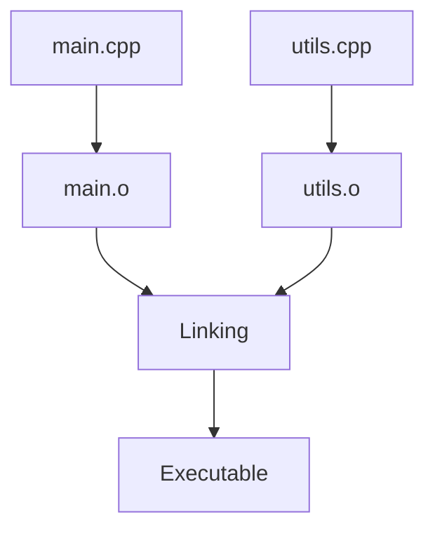

import AdBanner from '@site/src/components/AdBanner';

import Tabs from '@theme/Tabs';
import TabItem from '@theme/TabItem';

# Running Multiple C++ Files Together

Multi-file C++ projects are foundational for building modular, maintainable software. This guide walks you through structuring your code, compiling it correctly, avoiding common pitfalls, and adopting professional practices for modern C++ development.

<div style={{ position: 'relative', paddingBottom: '56.25%', height: 0, overflow: 'hidden', marginTop: '20px' }}>
  <iframe
    src="https://www.youtube.com/embed/P-hjAcF_RNE"
    title="MakeFile tutorial"
    style={{ position: 'absolute', top: 0, left: 0, width: '100%', height: '100%' }}
    frameBorder="0"
    allow="accelerometer; autoplay; clipboard-write; encrypted-media; gyroscope; picture-in-picture; web-share"
    allowFullScreen
  />
</div>

> Want to learn from real examples and walkthroughs? Check out our companion video series.

<div>
  <AdBanner />
</div>

## Table of Contents

1. [Introduction](#introduction)
2. [Project Structure](#project-structure)
3. [Creating Header and Source Files](#creating-header-and-source-files)
4. [Writing Multi-File Code](#writing--compiling-multi-file-c-code)
       - 4.1 [Compiling Multiple Files]
       - 4.2 [Using Makefiles for Automation]
       - 4.3 [Common Errors & Fixes]
       - 4.4 [Best Practices]
       - 4.5 [Advanced Tips]
5. [What next](#more-articles)

## Introduction

In C++, splitting code across multiple files helps improve clarity, reusability, and manageability. Instead of cramming all logic into a single file, you define reusable components, utility functions, and class logic in separate source files.

## Project Structure

Typical layout for a basic multi-file C++ project:

```python
project/
├── main.cpp
├── utils.cpp
└── utils.h
```
:::tip
Each source ``file (.cpp)`` implements functionality, while header files (.h) declare interfaces.
| File        | Purpose                                | Typical Contents                                                |
|-------------|----------------------------------------|-----------------------------------------------------------------|
| `main.cpp`  | Entry point of the program             | `main()` function, includes `utils.h`, calls utility functions |
| `utils.h`   | Header file for declarations           | Function prototypes like `int add(int a, int b);`              |
| `utils.cpp` | Implementation of utility functions    | Function definitions like `int add(int a, int b) { return a + b; }` |
:::
<div>
  <AdBanner />
</div>

## Creating Header and Source Files

`Header` and `source files` help organize code in a modular fashion. Header files typically contain `function declarations`, `macros`, `constants`, and `class definitions` that can be shared across multiple source files. They act as the contract that other .cpp files rely on, and they are included using #include directives.


### Header and Source Files

<Tabs>
<TabItem value="Header File (utils.h)" label="utils.h" default>

```cpp
#ifndef UTILS_H
#define UTILS_H

int add(int a, int b);

#endif // UTILS_H
```
<details>
<summary><strong>What is #ifndef? (include gaurds) </strong></summary>

**What is an Include Guard?**

An **include guard** is a preprocessor directive used in ``C++ header files`` to prevent the file from being included more than ``once during compilation``.

---
:::caution ***Why Include Guards Are Needed***

* ***Avoid Multiple Inclusions***: Prevents the same header file from being processed multiple times in a single compilation unit.
* ***Eliminates Redefinition Errors***: Avoids errors caused by repeated declarations of functions, variables, or classes.
* ***Improves Compilation Safety***: Ensures consistent and error-free compilation in large projects with many interdependent files.
* ***Supports Modular Code***: Encourages clean, reusable, and maintainable code by allowing headers to be safely shared across multiple files.
* ***Portable and Standard***: Works across all compilers and platforms; unlike `#pragma once`, it's part of the standard C++ practice.
:::

</details>
| Line | Code                     | Explanation                                                                 |
| ---- | ------------------------ | --------------------------------------------------------------------------- |
| 1    | `#ifndef UTILS_H`        | Checks if `UTILS_H` is **not defined** to prevent multiple inclusions.      |
| 2    | `#define UTILS_H`        | Defines the macro `UTILS_H`, marking that this header has been included.    |
| 4    | `int add(int a, int b);` | Declares a function named `add` that takes two integers and returns an int. |
| 6    | `#endif // UTILS_H`      | Ends the conditional directive started by `#ifndef`.                        |


</TabItem>

<TabItem value="Source File (utils.cpp)" label="utils.cpp">

```cpp
#include "utils.h"

int add(int a, int b) {
    return a + b;
}
```

>This is the source file that provides the **definition** of the `add` function declared in the `utils.h` header file.

>- The file begins by including `"utils.h"`, ensuring that the declaration of the `add` function is known before defining it.
>- The function `add(int a, int b)` takes two integer parameters and returns their sum.
>- By separating the declaration (in the header) from the definition (in this source file), we enable **modular development** and ``allow the function`` to be reused ``across multiple files``.

This structure supports clean organization and avoids redundancy, especially in large projects.

</TabItem>

<TabItem value="Main file acutal logic" label="main.cpp">

```cpp
#include <iostream>
#include "utils.h" 

int main() {
    std::cout << add(5, 3) << std::endl;
    return 0;
}
---
```
* `int main()`
  The main function is the entry point of any C++ program. Execution starts here.

* `std::cout << add(5, 3) << std::endl;`

  * Calls the `add` function with arguments `5` and `3`.
  * The result of the addition (`8`) is printed to the console using `std::cout`.
  * `std::endl` inserts a newline and flushes the output buffer.

* `return 0;`
  Indicates that the program has ended successfully.
:::note
 This `main.cpp` file uses a helper function `add` from another file to perform addition and print the result. It demonstrates basic modular programming in C++ by separating logic into header and source files.
:::
</TabItem>
</Tabs>
---


## Writing & Compiling Multi-File C++ Code

Writing C++ code in multiple files is essential for managing large projects, improving modularity, and enabling team collaboration. This guide explains the key concepts and tools used to manage such codebases efficiently.


<Tabs groupId="build-method">

<TabItem value="writing-code" label="Writing Multi-File Code">

In C++, splitting your code into multiple files helps organize logic and allows for better maintainability. This typically involves:

* **Header files (`.h` or `.hpp`)** for function declarations, class definitions, and constants.
* **Source files (`.cpp`)** for implementing the actual logic defined in headers.

Use `#include` to import declarations from headers into source files. Avoid placing full function definitions in headers unless they are explicitly marked as `inline`, as this can lead to **multiple definition errors** during the linking phase.

Also, always protect headers using **include guards** or `#pragma once` to prevent multiple inclusion.

</TabItem>

<TabItem value="compile-together" label="Compile Together">

**Compiling All Files at Once**

This is a quick and simple method for smaller projects:

```python
clang++  main.cpp utils.cpp -o my_program
```
**Pros**:

* Easy to use and manage
* Suitable for simple projects or quick prototypes

**Cons**:

* Every change re-compiles all files, even if only one has changed

</TabItem>

<TabItem value="compile-separately" label="Compile Separately">

***Separate Compilation and Linking***
<details>
<summary>**What we are gonna to do here is** </summary>

<div> **What we are gonna to do here is**</div>


To build a complete C++ program from **multiple source files** in a modular and efficient way by:

1. **Compiling** each `.cpp` file into a separate **object file (`.o`)**.
2. **Linking** all object files together to produce a single **executable (`my_program`)**.

</details>
**Step 1:** Compile each file into object code:

```python
clang++  -c main.cpp
```
<details>
<summary><strong> What does ``-c`` flag does? </strong></summary>
:::important
**clang++** : This is the Clang compiler for C++ source code (an ``alternative to g++``).

**-c** : This tells the compiler to compile only, not to link. It generates an object file (.o) from the source file.

**main.cpp** : This is your C++ source file to be compiled.
:::
</details>

```python
clang++  -c utils.cpp
```
:::note
creating object file for the ``utils.cpp``.
:::

---
**Step 2:** **Link the object files into an executable:**

```python
clang++  main.o utils.o -o my_program
```


**Pros**:

* Faster incremental builds since only modified files are recompiled
* Better for larger projects with multiple contributors

**Cons**:

* More steps or automation required

</TabItem>

<TabItem value="makefile" label="Using Makefiles">

## Automating with a Makefile
A `Makefile` automates the build process and recompiles only the necessary files:

```rust
# Default target: builds the final executable 'my_program'

all: my_program

# Link object files to create the final executable

my_program: main.o utils.o
	clang++  main.o utils.o -o my_program  # => Linking object files to produce the executable

#Compile main.cpp into main.o, depends on main.cpp and utils.h

main.o: main.cpp utils.h
	clang++  -c main.cpp  # =>Compile source file to object file

# Compile utils.cpp into utils.o, depends on utils.cpp and utils.h
utils.o: utils.cpp utils.h
	clang++  -c utils.cpp  # =>Compile source file to object file

# Clean target: removes all object files and the executable
clean:
	rm -f *.o my_program  # =>Delete generated files to start fresh
```

To build the program:

```python
make
```

**Pros**:

* Efficient and repeatable builds
* Easy cleanup with `make clean`

**Cons**:

* Requires learning Makefile syntax for complex builds

</TabItem>

<TabItem value="errors-fixes" label="Common Errors and Fixes">

***Troubleshooting Build Issues***

* **Multiple definitions**: Usually occurs if function definitions are placed in headers instead of source files.
* **Undefined reference**: Indicates a missing object file during linking. Ensure all source files are compiled.
* **Circular includes**: Caused by mutual inclusion of headers. Use forward declarations or refactor the structure.

</TabItem>

<TabItem value="best-practices" label="Best Practices">

* Organize code logically by modules (e.g., math, io, network)
* Use include guards or `#pragma once` in all header files
* Separate compilation (object creation) from linking
* Keep header files minimal—only declare what's necessary
* Add comments and documentation for public interfaces

</TabItem>

<TabItem value="advanced" label="Advanced Concepts">

<details>
<summary>Why Split Code?</summary>

Splitting code into multiple files enables multiple developers to work in parallel, supports better organization, and dramatically speeds up compilation with incremental builds.
</details>

<details>
<summary>Build System Alternatives</summary>

For complex or cross-platform projects, consider using advanced build systems such as:

* **CMake** (widely used, integrates with IDEs and CI/CD tools)
* **Meson** (fast and modern syntax)
* **Ninja** (optimized for speed)

</details>

<details>
<summary>Practical Development Tips</summary>
- Use tools like `clang-format`, `clang-tidy`, or `cppcheck` to maintain code quality
- Document interfaces clearly in headers
- Avoid unnecessary dependencies between files
</details>

</TabItem>

</Tabs>

---

## More Articles

<Tabs>
  <TabItem value="docs" label="📚 Documentation">
             - [CompilerSutra Home](https://compilersutra.com)
                - [CompilerSutra Homepage (Alt)](https://compilersutra.com/)
                - [Getting Started Guide](https://compilersutra.com/get-started)
                - [Newsletter Signup](https://compilersutra.com/newsletter)
                - [Skip to Content (Accessibility)](https://compilersutra.com#__docusaurus_skipToContent_fallback)


  </TabItem>

  <TabItem value="tutorials" label="📖 Tutorials & Guides">

        - [AI Documentation](https://compilersutra.com/docs/Ai)
        - [DSA Overview](https://compilersutra.com/docs/DSA/)
        - [DSA Detailed Guide](https://compilersutra.com/docs/DSA/DSA)
        - [MLIR Introduction](https://compilersutra.com/docs/MLIR/intro)
        - [TVM for Beginners](https://compilersutra.com/docs/tvm-for-beginners)
        - [Python Tutorial](https://compilersutra.com/docs/python/python_tutorial)
        - [C++ Tutorial](https://compilersutra.com/docs/c++/CppTutorial)
        - [C++ Main File Explained](https://compilersutra.com/docs/c++/c++_main_file)
        - [Compiler Design Basics](https://compilersutra.com/docs/compilers/compiler)
        - [OpenCL for GPU Programming](https://compilersutra.com/docs/gpu/opencl)
        - [LLVM Introduction](https://compilersutra.com/docs/llvm/intro-to-llvm)
        - [Introduction to Linux](https://compilersutra.com/docs/linux/intro_to_linux)

  </TabItem>

  <TabItem value="assessments" label="📝 Assessments">

        - [C++ MCQs](https://compilersutra.com/docs/mcq/cpp_mcqs)
        - [C++ Interview MCQs](https://compilersutra.com/docs/mcq/interview_question/cpp_interview_mcqs)

  </TabItem>

  <TabItem value="projects" label="🛠️ Projects">

            - [Project Documentation](https://compilersutra.com/docs/Project)
            - [Project Index](https://compilersutra.com/docs/project/)
            - [Graphics Pipeline Overview](https://compilersutra.com/docs/The_Graphic_Rendering_Pipeline)
            - [Graphic Rendering Pipeline (Alt)](https://compilersutra.com/docs/the_graphic_rendering_pipeline/)

  </TabItem>

  <TabItem value="resources" label="🌍 External Resources">

            - [LLVM Official Docs](https://llvm.org/docs/)
            - [Ask Any Question On Quora](https://compilersutra.quora.com)
            - [GitHub: FixIt Project](https://github.com/aabhinavg1/FixIt)
            - [GitHub Sponsors Page](https://github.com/sponsors/aabhinavg1)

  </TabItem>

  <TabItem value="social" label="📣 Social Media">

            - [🐦 Twitter - CompilerSutra](https://twitter.com/CompilerSutra)
            - [💼 LinkedIn - Abhinav](https://www.linkedin.com/in/abhinavcompilerllvm/)
            - [📺 YouTube - CompilerSutra](https://www.youtube.com/@compilersutra)

  </TabItem>
</Tabs>


    

 
