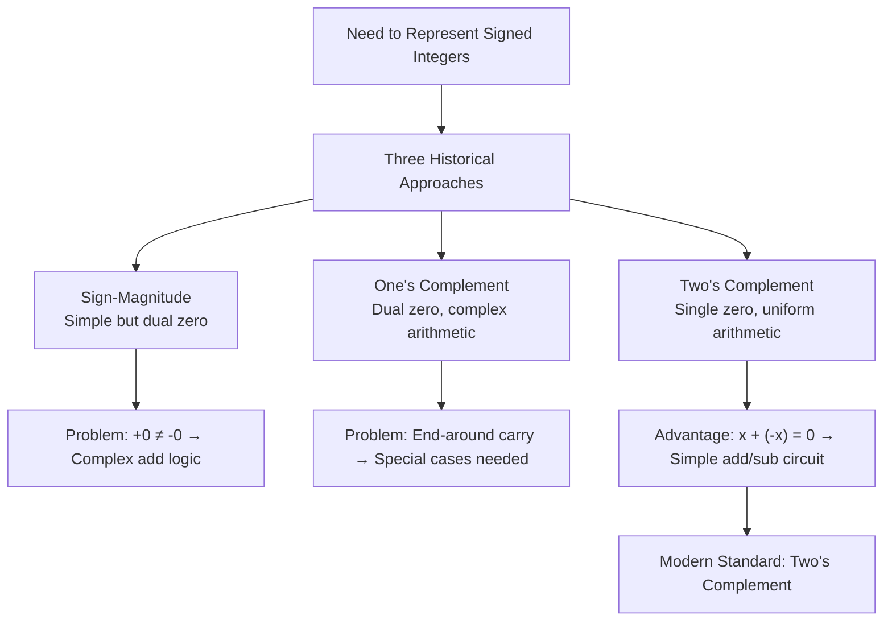

import AdBanner from '@site/src/components/AdBanner';
import Tabs from '@theme/Tabs';
import TabItem from '@theme/TabItem';

## Have you Thought

You may have studied Computer Science for years.
You have written bitwise code, debugged integer overflows, 
and confidently used `-x` without a second thought.

:::caution But pause for a moment.
:::

***Did you ever ask the machine what -x actually means?***
***Did you understand why, deep in memory, negation becomes `~x + 1`or did you simply accept it because every textbook said so?***

>>> Most of us memorized the rule. Few of us questioned it.

- You stopped asking why.
- You learned that negative numbers exist.
- You learned that CPUs use two’s complement.
- You learned almost casually that `-x` is implemented as `~x + 1`.

And then you moved on.

Not because it made sense, but because it worked.

:::important Years passed. 
You wrote kernels, compilers, device drivers, and optimizers.
You trusted the rule the same way you trust gravity present, reliable, unquestioned.
:::

But imagine explaining negation to a machine.
Not to a student.
Not to a textbook.
To silicon.

***A machine that knows nothing of “minus,” nothing of “negative,” nothing of math as we know it.***

>>> It understands only voltage, states, and addition.
>>>> - No subtraction.
>>>> - No sign bit magic.
>>>> - No hidden trick.
    >>> This article is not about repeating a formula you already know.

It is about retracing the path from **physical bits** to **mathematical meaning**
about watching how a computer, with no concept of “negative,” invents one using only **zeros, ones, and addition**.

***By the end, you won’t remember that `-x = ~x + 1`.***

You will *see* why it could not have been anything else.

>>> ***This article is written to eliminate rote memorization and replace it with first‑principles understanding.***
<details>
<summary><strong> Rote Learning</strong> </summary>

Learning what to do, but not why it works.
    - e.g. in Math
    `Memorizing` that
    `area of a circle = πr²`
    `without knowing why that formula exists` → rote learning

</details>

<details>
<summary> How to reach to Us </summary>

            - [🐦 Twitter - CompilerSutra](https://twitter.com/CompilerSutra)
            - [💼 LinkedIn - Abhinav](https://www.linkedin.com/in/abhinavcompilerllvm/)
            - [📺 YouTube - CompilerSutra](https://www.youtube.com/@compilersutra)
            - [💬 Join the CompilerSutra Discord for discussions](https://discord.gg/DXJFhvzz3K)
            - osc@compilersutra.com
</details>

:::note
Content by Human, AI Provided Support
:::


<div>
  <AdBanner />
</div>


## Why −x = ~x + 1:
     >> ***A Bit-Level and Mathematical Explanation of Two's Complement***

## Table of Contents
1. [Introduction: The Ubiquity of Two's Complement](#introduction)
2. [Binary Representation and Fixed-Width Arithmetic](#binary-representation)
3. [Introducing Two's Complement](#intwo)
4. [Deriving −x = ~x + 1](#derivation)
5. [Equivalence of ~x + 1 and ~(x - 1)](#equivalence)
6. [Common Misconceptions and Clarifications](#misconceptions)
7. [Real-World Implications](#real-world)
8. [Conclusion and Mental Models](#conclusion)
9. [References](#references)
10. [More Artilce](#more)

## 1. Introduction: The Ubiquity of Two's Complement <a name="introduction"></a>

In low-level systems programming, few concepts are as fundamental yet frequently misunderstood as two's complement representation. This elegant encoding scheme governs how positive and negative integers are stored and manipulated in virtually every modern CPU, from embedded microcontrollers to server-class processors. Its implications permeate multiple layers of the computing stack:

**In C/C++ Programming:** The C and C++ standards explicitly define signed integer representations, with [two's complement becoming mandatory in C++20 and C23](https://www.open-std.org/jtc1/sc22/wg21/docs/papers/2018/p1236r1.html). Understanding this representation is crucial for bitwise operations, overflow detection, and writing portable code that works correctly across different architectures.

**In Compiler Backends:** Compiler engineers constantly generate machine code that leverages two's complement properties. Optimization passes routinely transform arithmetic expressions using identities like `-x = ~x + 1` to produce more efficient code sequences, especially when targeting architectures without dedicated negation instructions.

**In CPU ALU Design:** Hardware designers exploit two's complement's mathematical consistency to build simpler, faster arithmetic logic units (ALUs). A single addition circuit can handle both signed and unsigned addition, subtraction becomes simple addition of a complemented value, and comparison operations unify signed and unsigned comparison logic.

This article provides both intuitive understanding and rigorous proof of the fundamental two's complement identity `-x = ~x + 1`, explaining why this representation dominates modern computing and how its mathematical properties enable efficient hardware implementation.

## 2. Binary Representation and Fixed-Width Arithmetic <a name="binary-representation"></a>

Before we explore negation and two’s complement, we need to understand **how numbers live inside a computer**.

Computers don’t store numbers like we write them on paper. They store them as **bits**  0s and 1s  in **fixed-size boxes** called registers or memory words. These boxes are usually **8, 16, 32, or 64 bits wide**, and the width **limits the range of numbers** you can represent.

Let’s focus on **8-bit numbers** to keep it simple:

```cpp
Unsigned 8-bit range: 0 to 255

Binary examples:
  0   = 0000 0000
  1   = 0000 0001
  127 = 0111 1111
  128 = 1000 0000
  255 = 1111 1111
```

There are **256 patterns** (2⁸). When you reach the maximum value (255) and add 1, the number **wraps around** back to 0:

```
255 + 1 = 0
```
> *Think of it like a **clock**: after 12 comes 1 again. Computers **expect** this behavior; it’s normal, predictable, and forms the basis of arithmetic in fixed-width memory.*


**Signed vs Unsigned Numbers (8-bit)**

Here’s where it gets interesting: 
    > The **same bits** can represent very different values depending on whether the number is **unsigned** or **signed**.

* **Unsigned numbers**: all 8 bits represent the value directly. Range: 0 → 255.
* **Signed numbers (two’s complement)**: the **most significant bit (MSB, the leftmost bit)** is reserved as the **sign bit**.

  * `0` in the MSB → positive number
  * `1` in the MSB → negative number

With 1 bit used for the sign, only **7 bits remain for magnitude**, so half of the 256 patterns represent negative numbers.

```
Signed 8-bit range (two’s complement): -128 → -1, 0 → 127
```

Example:

```
Binary: 1111 1111
  Unsigned: 255
  Signed : -1
```

Notice? **Same bits**, different meaning. The computer doesn’t change anything in hardware  it just **interprets the top bit differently**.


**How Wrap-Around Creates Negatives**

Let’s see a concrete example in C:

```c
#include <stdio.h>

int main() {
    unsigned char u = 255; // max 8-bit unsigned
    signed char s = u;     // same bits, interpreted as signed

    printf("Unsigned u = %u\n", u); // 255
    printf("Signed s   = %d\n", s); // -1

    u = u + 1;
    s = s + 1;

    printf("Unsigned u+1 = %u\n", u); // 0
    printf("Signed s+1   = %d\n", s); // 0

    return 0;
}
```
<details>
<summary><strong>Code Explanation</strong></summary>

The primary objective of this program is to **demonstrate the effect of signedness on 8-bit integer representation and arithmetic**. It highlights how **the same binary pattern can be interpreted differently** depending on whether the variable is signed or unsigned, and how this affects **overflow behavior** during arithmetic operations.
[Link of output](https://godbolt.org/z/MxhMKxsq4)

1. **Variable Initialization**

```c
unsigned char u = 255;
signed char s = u;
```

* `u` is assigned the maximum value for an 8-bit unsigned integer (`255`).
* `s` is assigned the same bits as `u`. Although the bits are identical (`11111111`), the signed type interprets this as `-1` in **two’s complement representation**.

2. **Printing Initial Values**

```c
printf("Unsigned u = %u\n", u);
printf("Signed s   = %d\n", s);
```

* `u` prints `255`, as expected for unsigned interpretation.
* `s` prints `-1`, illustrating the **difference in interpretation** caused by signedness.

3. **Increment Operations**

```c
u = u + 1;
s = s + 1;
```

* For the **unsigned variable**, `255 + 1` exceeds the maximum representable value (8 bits), causing a **wrap-around modulo 256**, resulting in `0`.
* For the **signed variable**, `-1 + 1` evaluates to `0` under **two’s complement arithmetic**, which is standard for signed integers.

4. **Printing Incremented Values**

```c
printf("Unsigned u+1 = %u\n", u);
printf("Signed s+1   = %d\n", s);
```

* Confirms the wrap-around behavior for the unsigned integer and standard arithmetic for the signed integer.

**Overall:** 
- The code aim is to effectively demonstrates how **bit patterns, signedness, and arithmetic operations interact** 
- In low-level C programming, providing a tangible example of **two’s complement representation and overflow behavior**.


</details>


**Explanation:**

* `u` wraps from 255 → 0 (like a clock).
* `s` wraps from -1 → 0, because two’s complement **naturally interprets the bits as negative first**.

All the arithmetic is done with the **same addition circuits**. Two’s complement simply **relabels the patterns** to give negative numbers meaning.

***Visualizing the Number Line**
You can imagine it like a **circle of numbers**:

```
Unsigned: 0 → 1 → 2 → ... → 254 → 255 → back to 0
Signed:  -128 → -127 → ... → -1 → 0 → 1 → ... → 127 → back to -128
```

The **top bit decides the sign**. That’s why two’s complement works so naturally: the machine never needs to “know” negatives  it just adds and wraps around, and we humans interpret the top bit as the sign.


<div>
  <AdBanner />
</div>


**Why This Matters**

Understanding signed vs unsigned numbers in **8-bit memory** helps you:

1. **Debug overflows**: Know why numbers sometimes “jump” unexpectedly.
2. **Write better compilers**: Predictable patterns allow optimizations.
3. **Understand hardware**: CPUs use the same adder for signed and unsigned numbers.
4. **Master bitwise operations**: Shifts, masks, and negation rely on fixed-width numbers.


> Once you understand **bits, widths, and how numbers loop around**, you’re halfway to understanding **why `-x` naturally becomes `~x + 1`**.
> Two’s complement isn’t magic it’s **the simplest, most elegant way** to handle negatives in finite memory.

## 3. Introducing Two's Complement <a name="intwo"></a>

###### 3.1 What is Two’s Complement?

Two’s complement is a clever way to represent **signed integers** in binary so that addition, subtraction, and negation all “just work” using the same hardware.

In an **n-bit number**, each bit has a weight. But here’s the twist:

* **Most significant bit (MSB, leftmost)** = negative weight: `-2ⁿ⁻¹`
* **All other bits** = positive weights: `2⁰, 2¹, … 2ⁿ⁻²`

So the **value of an n-bit two’s complement number** is:

```
Value = -bₙ₋₁ × 2ⁿ⁻¹ + Σ(bᵢ × 2ⁱ) for i = 0 to n-2
```

**Example: 8-bit numbers**

| Binary    | Value |
| --------- | ----- |
| 0000 0000 | 0     |
| 0111 1111 | 127   |
| 1000 0000 | -128  |
| 1111 1111 | -1    |

Notice how **the top bit decides the sign**, and the rest encode magnitude.


###### 3.2 Range of Values

For **n bits**:

* **Minimum value** = `-2ⁿ⁻¹` → binary: `100…0`
* **Maximum value** = `2ⁿ⁻¹ - 1` → binary: `011…1`

**8-bit example:**

```
Range: -128 → 127
-128 = 1000 0000
127  = 0111 1111
0    = 0000 0000
-1   = 1111 1111
```

This range shows why two’s complement is **asymmetric**: there is one extra negative number compared to positive.


###### 3.3 Why Two’s Complement is Elegant

Two’s complement fixes problems that older representations had:

* **Sign-Magnitude**: Simple, but has **two zeros** (`+0` = 0000 0000, `-0` = 1000 0000). This creates **complex addition logic**.

<details>
<summary> Know Why </summary>

    In **sign-magnitude**, the **MSB is the sign**:

* `0` → positive
* `1` → negative
* Remaining 7 bits → magnitude

**Example with 8 bits:**

```
+0 = 0000 0000
-0 = 1000 0000
```
 Two zeros exist one as +ve representation other as negative representation.

Now, try **adding numbers**:

```
+5 = 0000 0101
-5 = 1000 0101
```

Add them as if they were normal binary:

```
  0000 0101
+ 1000 0101
--------------
  1000 1010
```

The result is **incorrect**. Why?

* In sign-magnitude, addition must **consider signs separately**.
* You need to **check if signs match** and **subtract magnitudes** if they differ.
* This creates **complex addition hardware**.

Also:

```
+0 + -0 = 0000 0000 + 1000 0000 = 1000 0000 → not zero without extra logic
```
 > ***Dual zero breaks arithmetic unless you add special cases***.

</details>

* **One’s Complement**: Still has **dual zeros** and needs **end-around carry** in arithmetic.

<details>
  <summary>Challenges with One Compliment </summary>

In **one’s complement**, negative numbers are represented by **flipping all bits** of the positive number:

```
x → x
-x → ~x
```

**Example (8 bits):**

```
+0 = 0000 0000
-0 = 1111 1111
```
 Still dual zero.

Check addition: `+5 + (-5)`:

```
+5 = 0000 0101
-5 = 1111 1010   (flip all bits)
----------------
Sum = 1111 1111   (not zero!)
```

To fix this, **one must add the end-around carry**:

```
1111 1111 + 1 → 0000 0000
```

 Works, but now addition **requires extra step** (carry wrap-around), complicating hardware.
</details>

**Two’s complement solves both problems:**

* Only **one zero** (`0000 0000`)
* Addition and subtraction are **uniform**, even with negative numbers



**In short:**

> Two’s complement is elegant because it makes negative numbers **just another pattern of bits**, so the machine can **add, subtract, and negate numbers without extra rules or hardware**.


<div>
  <AdBanner />
</div>

## 4. Deriving −x = ~x + 1 <a name="derivation"></a>

Now that we understand **two’s complement** and **fixed-width arithmetic**, let’s see **why negation in a computer becomes `-x = ~x + 1`**.

We’ll stick with **8-bit numbers** for clarity.

###### 4.1 Bitwise Example

Take **x = 42**:

```
x       = 0010 1010  (binary for 42)
~x      = 1101 0101  (bitwise NOT, flip all bits)
~x + 1  = 1101 0110
```

What is `1101 0110` in two’s complement?

* MSB = 1 → negative
* Remaining bits = 1010110 = 86
* Value = -128 + 86 = **-42 ✓**


###### Why Adding 1 Works

In two’s complement, **x + (-x) = 0 (mod 2⁸)**.

Check `x + ~x`:

```
x   = 0010 1010
~x  = 1101 0101
-------------
Sum = 1111 1111 → -1 (in signed 8-bit)
```

Notice? The sum is **-1**, not 0.

Now add 1:

```
1111 1111 (-1)
+        1
-------------
0000 0000 (0, with carry out)
```

 Perfect.

So:

```
x + (~x + 1) = 0
```

Which means:

```
-x = ~x + 1
```


###### 4.2 Modular Arithmetic Proof

Formally, in **n-bit arithmetic**, all numbers operate **mod 2ⁿ**.

The **bitwise NOT** computes:

```
~x = 2ⁿ - 1 - x
```

* All 1’s = `2ⁿ - 1` in decimal

Then:

```
~x + 1 = (2ⁿ - 1 - x) + 1 = 2ⁿ - x
```

In **modulo 2ⁿ arithmetic**, we know:

```
2ⁿ ≡ 0 (mod 2ⁿ)
```

So:

```
~x + 1 ≡ -x (mod 2ⁿ)
```

 This **mathematically proves** that negation is exactly `~x + 1`.


###### 4.3 Visualizing on the 8-bit Number Circle

Think of 8-bit numbers as a **clock with 256 steps**:

```
0 → 1 → 2 → … → 254 → 255 → back to 0
```

* `x = 42` → start at 42
* `~x = 213` → bit-flip → jump to “mirror position”
* `~x + 1 = 214` → final position → interpreted as -42 in signed 8-bit
* Add x + (-x) → 42 + 214 = 256 → wraps around → 0

Everything fits **naturally**, no special rules required.


**Key Insight:**

> Negation in computers is **forced by modular arithmetic and bit patterns**, not magic.
> The formula `-x = ~x + 1` is **inevitable** in any fixed-width binary system.

Thus, `-x = ~(x - 1)`.


| x (decimal) | x (binary) | ~x (binary) | ~x + 1 (binary) | ~x + 1 (decimal, signed) | -x (decimal, signed) |
| ----------: | :--------- | :---------- | :-------------- | :----------------------- | :------------------- |
|           1 | 0000 0001  | 1111 1110   | 1111 1111       | -1                       | -1                   |
|           2 | 0000 0010  | 1111 1101   | 1111 1110       | -2                       | -2                   |
|           5 | 0000 0101  | 1111 1010   | 1111 1011       | -5                       | -5                   |
|          42 | 0010 1010  | 1101 0101   | 1101 0110       | -42                      | -42                  |
|         127 | 0111 1111  | 1000 0000   | 1000 0001       | -127                     | -127                 |
|         128 | 1000 0000  | 0111 1111   | 1000 0000       | -128                     | -128                 |


## 5. Equivalence of ~x + 1 and ~(x - 1) <a name="equivalence"></a>

We already know the famous formula:

```
-x = ~x + 1
```

But there’s an **equivalent alternative form** that’s often handy:

```
-x = ~(x - 1)
```

Let’s see **why this works**, step by step.


###### 5.1 Algebraic Proof

Start with the standard formula:

```
-x = ~x + 1
```

Now, notice something interesting: we can **add and subtract 1** inside the parentheses without changing the value:

```
-x = ~x + 1
   = ~(x - 1 + 1) + 1
```

Next, use a **bitwise NOT property**:

> `~(a + 1) = ~a - 1`

Applying this property:

```
-x = (~(x - 1) - 1) + 1
   = ~(x - 1)
```
Algebraically, we’ve arrived at:

```
-x = ~(x - 1)
```


###### 5.2 Bitwise Intuition

Let’s **see it in action with bits**.

**Example: x = 44 (8-bit)**

1. Direct method: `-x = ~x + 1`

```
x       = 0010 1100
~x      = 1101 0011
~x + 1  = 1101 0100 = -44
```

2. Alternative method: `-x = ~(x - 1)`

```
x - 1   = 0010 1011
~(x-1)  = 1101 0100 = -44
```
 Same result, perfectly matching the direct method.

###### 5.3 Small 4-bit Example for Clarity

Let’s shrink it to **4 bits** to see the pattern clearly:

**Direct method (x = 4):**

```
x    = 0100
~x   = 1011
+1   = 1100 = -4
```

**Alternative method:**

```
x - 1    = 0011
~(x - 1) = 1100 = -4
```

Notice how the alternative method **avoids adding 1 after the complement**, which can sometimes be convenient in low-level programming or hardware design.


## 6. Common Misconceptions and Clarifications <a name="misconceptions"></a>

Even experienced programmers sometimes **misunderstand two’s complement**. Let’s clear up the most common confusions.


###### 6.1 “Why Not Just Flip the Sign Bit?”

Many beginners think: *“Why not just flip the MSB to negate a number?”*

It seems intuitive: sign-magnitude uses the **leftmost bit** as the sign. But here’s why it **fails in practice**:

```
Sign-magnitude (8-bit):
+5 = 0000 0101
-5 = 1000 0101

Add them:
  0000 0101 (+5)
+ 1000 0101 (-5)
-------------
  1000 1010 → -10 (!)  ← Wrong!
```

Notice? Arithmetic **breaks immediately**. Flipping only the sign bit does **not preserve the x + (-x) = 0 rule**, and the hardware must implement **special-case logic** for every addition and subtraction.

Two’s complement solves this elegantly: the same addition circuitry works for **all numbers**, positive and negative, except for the single edge case of -2ⁿ⁻¹.

> Lesson from experience: *never assume intuition matches binary reality. Two’s complement exists because it **makes arithmetic reliable and hardware simple**.*


###### 6.2 “Why Does ~x = -x - 1?”

Another confusing question: *“Why is the bitwise NOT related to negation?”*

Look closely at the identity:

```
-x = ~x + 1
```

Rearrange it:

```
~x = -x - 1
```

This is **not magic**. It simply tells you:

* Bitwise NOT is equivalent to **subtracting x from -1**.
* Examples:

```
~0 = -1
~(-1) = 0
~5 = -6
```

> Tip from experience: Understanding this identity prevents confusion when combining **bitwise operations with arithmetic**, especially in low-level code or compiler optimizations.


###### 6.3 The -2ⁿ⁻¹ Anomaly

Here’s a classic “gotcha” for signed integers: the **most negative number** has no positive counterpart in n-bit two’s complement.

Example: **8-bit signed integer**

```
-128 = 1000 0000
~(-128) = 0111 1111
~(-128) + 1 = 1000 0000 → -128 again!
```

Why? Because **8-bit signed integers can represent only -128 → 127**. There’s no +128.

In modular arithmetic terms:

```
-(-2ⁿ⁻¹) ≡ -2ⁿ⁻¹ (mod 2ⁿ)
```

> Wisdom from experience: This is **not a bug**—it’s a natural consequence of finite-width arithmetic. Always remember the **asymmetry of two’s complement**: one extra negative number exists because the zero takes one positive slot.


###### 6.4 Experienced Advice

* Don’t memorize rules blindly. Observe how **bit patterns behave**.
* Visualize **wrap-around arithmetic** — it explains almost everything.
* When writing low-level code, always account for the **-2ⁿ⁻¹ edge case** to avoid surprises.

> In other words: two’s complement is simple **if you understand its story**, not just the formula.


## 7. Real-World Implications <a name="real-world"></a>

Two’s complement isn’t just a neat theory—it’s **everywhere in real systems**, quietly making arithmetic work without anyone noticing. Let’s see how it shows up in the wild.


###### 7.1 CPU Instruction Sets: Negation in Hardware

Imagine the CPU as a **tiny mathematician** that only understands addition, subtraction, and flipping bits. It doesn’t know the word “negative”—it only knows patterns.

Most modern CPUs provide a **NEG (negate) instruction**, which implements `~x + 1` under the hood. For example, in x86 assembly:

```
NEG reg  ; Computes reg = 0 - reg, which is ~reg + 1 in hardware
```

As a programmer, you might write:

```c
int a = -b;
```

or

```c
int a = ~b + 1;
```

Either way, the compiler generates the **same machine code**, because it **knows the CPU understands only ~x + 1**.

> Behind every subtraction and negative literal, two’s complement is doing the invisible work.


###### 7.2 Overflow Detection: Predictable Rules

Two’s complement also makes **overflow predictable**. You don’t need special hardware tricks to detect it:

* **Addition:** Overflow occurs only when **both operands have the same sign**, but the result has the **opposite sign**.
* **Negation:** Overflow occurs only when you try to negate the **most negative number** (`-2ⁿ⁻¹`), because its positive counterpart cannot be represented.

In C/C++, this shows up in compiler flags:

* `-fwrapv`: Treats signed overflow as **wrapping** (mod 2ⁿ), just like two’s complement.
* `-ftrapv`: Generates **trapping code** for overflows, useful for catching errors during debugging.

> Experienced tip: Understanding overflow rules can prevent subtle bugs in arithmetic-heavy code, like graphics, cryptography, or kernel development.


###### 7.3 Sign Extension: Growing Numbers Without Breaking Them

Another magical feature of two’s complement is **sign extension**. Imagine you have an 8-bit number and want to store it in a 16-bit register:

```
8-bit -5:  1111 1011
```

To extend it safely to 16 bits, you **just replicate the MSB**:

```
16-bit -5: 1111 1111 1111 1011
```

Why does this work?

* The MSB carries **negative weight (-2ⁿ⁻¹)**.
* By replicating it, the **value remains identical**, and the CPU can perform arithmetic seamlessly with larger registers.

> In practice, this means **signed arithmetic scales naturally**—no extra hardware needed. Compilers and CPU pipelines love this simplicity.


###### 7.4 Experienced Perspective

If you’ve written compilers, device drivers, or low-level libraries, you quickly notice:

1. **Negation is everywhere**, silently relying on `~x + 1`.
2. **Overflow is consistent and predictable**, not mysterious.
3. **Sign extension is a built-in convenience**, allowing arithmetic to scale with word size.

Two’s complement isn’t just a representation—it’s a **bridge between bit patterns and real-world arithmetic**, enabling CPUs to do **more with less hardware**.

## 8. Conclusion and Mental Models <a name="conclusion"></a>

If you step back and look at two’s complement, it’s not just a formula in a textbook. It’s a **masterpiece of elegance** in computer engineering—a way for machines, which understand only **zeros, ones, and addition**, to handle positive and negative numbers seamlessly.

The identity:

```
-x = ~x + 1
```

is not a trick. It’s the natural outcome of **modular arithmetic in finite, fixed-width memory**. Once you see it this way, it all clicks.


###### 8.1 Imagine the CPU

Picture the CPU as a tiny mathematician living in **8-bit, 16-bit, or 32-bit worlds**. It knows:

* How to **add numbers**
* How to **flip bits**
* Nothing about “negative” or “minus” as humans think of it

Two’s complement is the **language that lets the CPU understand negative numbers** using only what it already knows.

* Flip the bits → check
* Add one → check
* Result is -x → check

No extra hardware. No special rules. Just pure logic and arithmetic.


###### 8.2 Mental Models for Engineers

Here’s how to **think about it like a seasoned engineer**:

1. **Numbers are on a loop (mod 2ⁿ)**

   * Positive numbers climb up
   * When you pass the maximum, you wrap around into negatives
   * Negation = finding the **additive inverse** on this loop

2. **Negation is flipping bits + one**

   * `~x + 1` isn’t magic—it’s the only way to reach the additive inverse with **binary patterns**

3. **Two views, same result**

   * `-x = ~x + 1` → intuitive for arithmetic
   * `-x = ~(x - 1)` → handy for certain optimizations, avoids edge-case pitfalls

4. **Hardware loves simplicity**

   * One adder handles all arithmetic
   * Sign extension works naturally
   * Overflow is predictable


###### 8.3 Why This Matters

When you debug low-level code, write a compiler backend, or design a CPU:

* Think of numbers **not as sequences of bits**, but as points on a **cyclic number line**.
* Negation becomes **walking halfway around the loop**.
* Overflow, edge cases, and even the infamous -2ⁿ⁻¹ anomaly suddenly make sense.

Two’s complement is **more than a representation**—it’s a **mental model** that explains why computers behave exactly as they do, without surprises.

> Next time you write `-x` in C, pause and imagine: the CPU isn’t subtracting; it’s **flipping bits and adding one**, traversing a **beautiful, logical loop** of 0s and 1s. That’s the elegance of two’s complement.

## 9. References <a name="references"></a>

1. Bryant, R. E., & O’Hallaron, D. R. (2016). *Computer Systems: A Programmer’s Perspective* — Chapter 2 sample (online). https://csapp.cs.cmu.edu/2e/samples.html

2. Bryant, R. E., & O’Hallaron, D. R. (2016). *Computer Systems: A Programmer’s Perspective* (PDF). https://shuyuej.com/books/Computer%20Systems-%20A%20Programmer%27s%20Perspective.pdf 

3. Two’s complement — Wikipedia. https://en.wikipedia.org/wiki/Two%27s_complement 

4. Hacker’s Delight — Wikipedia summary (as overview of bitwise algorithms). https://en.wikipedia.org/wiki/Hacker%27s_Delight 

5. C23 (C standard revision) — Wikipedia. https://en.wikipedia.org/wiki/C23_%28C_standard_revision%29 

6. Intel® 64 and IA‑32 Architectures Software Developer’s Manual (Intel SDM). https://www.intel.com/content/www/us/en/developer/articles/technical/intel-sdm.html


# More


<Tabs>
  <TabItem value="docs" label="📚 Documentation">
             - [CompilerSutra Home](https://compilersutra.com)
                - [CompilerSutra Homepage (Alt)](https://compilersutra.com/)
                - [Getting Started Guide](https://compilersutra.com/get-started)
                - [Skip to Content (Accessibility)](https://compilersutra.com#__docusaurus_skipToContent_fallback)


  </TabItem>

  <TabItem value="tutorials" label="📖 Tutorials & Guides">

        - [AI Documentation](https://compilersutra.com/docs/Ai)
        - [DSA Overview](https://compilersutra.com/docs/DSA/)
        - [DSA Detailed Guide](https://compilersutra.com/docs/DSA/DSA)
        - [MLIR Introduction](https://compilersutra.com/docs/MLIR/intro)
        - [TVM for Beginners](https://compilersutra.com/docs/tvm-for-beginners)
        - [Python Tutorial](https://compilersutra.com/docs/python/python_tutorial)
        - [C++ Tutorial](https://compilersutra.com/docs/c++/CppTutorial)
        - [C++ Main File Explained](https://compilersutra.com/docs/c++/c++_main_file)
        - [Compiler Design Basics](https://compilersutra.com/docs/compilers/compiler)
        - [OpenCL for GPU Programming](https://compilersutra.com/docs/gpu/opencl)
        - [LLVM Introduction](https://compilersutra.com/docs/llvm/intro-to-llvm)
        - [Introduction to Linux](https://compilersutra.com/docs/linux/intro_to_linux)

  </TabItem>

  <TabItem value="assessments" label="📝 Assessments">

        - [C++ MCQs](https://compilersutra.com/docs/mcq/cpp_mcqs)
        - [C++ Interview MCQs](https://compilersutra.com/docs/mcq/interview_question/cpp_interview_mcqs)

  </TabItem>

  <TabItem value="projects" label="🛠️ Projects">

            - [Project Documentation](https://compilersutra.com/docs/Project)
            - [Project Index](https://compilersutra.com/docs/project/)
            - [Graphics Pipeline Overview](https://compilersutra.com/docs/The_Graphic_Rendering_Pipeline)
            - [Graphic Rendering Pipeline (Alt)](https://compilersutra.com/docs/the_graphic_rendering_pipeline/)

  </TabItem>

  <TabItem value="resources" label="🌍 External Resources">

            - [LLVM Official Docs](https://llvm.org/docs/)
            - [Ask Any Question On Quora](https://compilersutra.quora.com)
            - [GitHub: FixIt Project](https://github.com/aabhinavg1/FixIt)
            - [GitHub Sponsors Page](https://github.com/sponsors/aabhinavg1)

  </TabItem>

  <TabItem value="social" label="📣 Social Media">

            - [🐦 Twitter - CompilerSutra](https://twitter.com/CompilerSutra)
            - [💼 LinkedIn - Abhinav](https://www.linkedin.com/in/abhinavcompilerllvm/)
            - [📺 YouTube - CompilerSutra](https://www.youtube.com/@compilersutra)
            - [💬 Join the CompilerSutra Discord for discussions](https://discord.gg/DXJFhvzz3K)

  </TabItem>
</Tabs>


