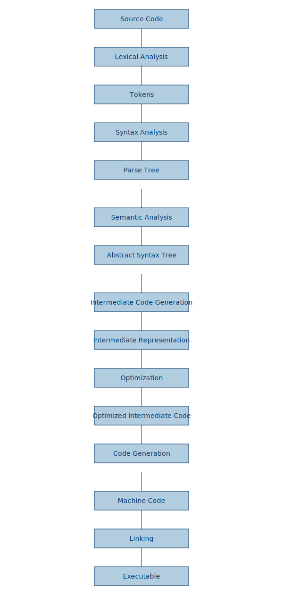

# Introduction to Compilers

## What is a Compiler?

A compiler is a specialized program that translates high-level programming code written by developers into low-level machine code or intermediate code that can be executed by a computer's processor. This process typically involves several stages, such as parsing, optimization, and code generation. Compilers play a crucial role in software development as they allow developers to write code in human-readable languages, which are then transformed into instructions that a machine can understand and execute.

### Compiler Stages

Here’s a visual representation of the stages involved in the compilation process:

### Key Roles of a Compiler
- **Translation**: Converts code from a source language (like C, C++, or Python) to a target language (such as machine code or an intermediate representation).
- **Optimization**: Improves the performance and efficiency of the generated code by removing redundancies and applying advanced optimization techniques.
- **Error Checking**: Identifies syntax, semantic, and runtime errors during the compilation process, helping developers identify issues before the code is executed.

## Why Do We Need Compilers?

Without compilers, developers would have to write machine code directly, which is a tedious and error-prone task. Compilers bridge the gap between human understanding and machine execution by:
- **Increasing Productivity**: Developers can write complex programs in high-level languages that are more intuitive and easier to maintain.
- **Platform Independence**: High-level languages are portable, allowing developers to write code once and run it on multiple platforms without modification.
- **Performance Enhancements**: Compilers can apply sophisticated optimizations to produce efficient machine code, improving the runtime performance of applications.

## Evolution of Compilers and the Industry Shift

The compiler industry has gone through significant transformations over the decades, influenced by advancements in computer architecture, programming languages, and development methodologies.

### Early Compilers
The earliest compilers were simple, translating code from a high-level language to assembly or machine code with minimal optimization. As hardware evolved and software became more complex, compilers had to adapt by supporting multiple architectures and incorporating optimization phases to generate faster and more efficient code.

### Modern Compiler Frameworks
In the modern era, compiler development has become more modular and flexible, thanks to frameworks like **LLVM** (Low-Level Virtual Machine). LLVM represents a shift from traditional monolithic compilers to more reusable, modular, and scalable infrastructure that can target multiple architectures and languages.

## Why Developers are Moving to LLVM?

LLVM has gained significant popularity and is now widely adopted in both industry and academia due to several advantages over traditional compilers:

### 1. **Modularity and Reusability**
LLVM provides a set of reusable components for building compilers, making it easier to develop new programming languages and add support for multiple platforms without rewriting large portions of the compiler. This modularity allows for more efficient compiler development and maintenance.

### 2. **Cross-Platform Support**
LLVM's intermediate representation (IR) allows developers to target multiple architectures (e.g., x86, ARM, RISC-V) with a single codebase. This makes LLVM highly desirable in environments that require cross-platform support, such as embedded systems, mobile devices, and cloud platforms.

### 3. **Advanced Optimizations**
LLVM provides highly sophisticated optimization techniques, making it ideal for performance-critical applications. It supports both static and just-in-time (JIT) compilation, which can generate highly optimized machine code at runtime.

### 4. **Rich Ecosystem**
LLVM is used as the backend for many modern languages, including **Rust**, **Swift**, and **Julia**, due to its rich ecosystem and active community. This has accelerated innovation in language design and compiler construction, allowing developers to leverage cutting-edge optimizations without starting from scratch.

### 5. **Open-Source and Extensible**
LLVM's open-source nature has fostered a large and active community of contributors, which has led to rapid improvements and broad adoption across different industries. Its extensibility allows developers to add new features and optimizations specific to their use cases.

## Conclusion

The shift towards LLVM marks a new era in compiler technology, one characterized by flexibility, reusability, and performance. As computing environments become more diverse, and performance demands increase, LLVM’s modular and cross-platform design makes it the go-to solution for many modern compiler developers. By providing a robust, open-source foundation, LLVM is helping to drive innovation in compiler design and programming language development.
