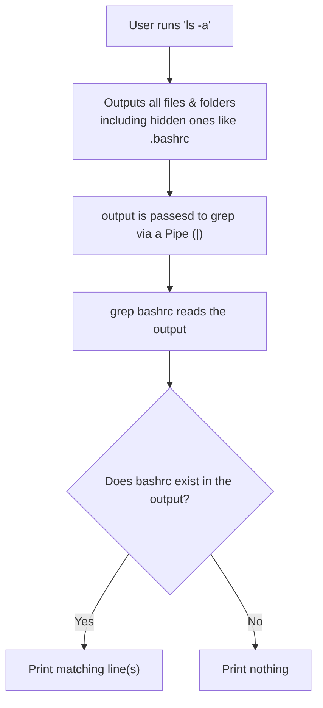

import AdBanner from '@site/src/components/AdBanner';
import Tabs from '@theme/Tabs';
import TabItem from '@theme/TabItem';

<details>
<summary> Social Media </summary>


  <TabItem value="social" label="📣 Social Media">

    - [🐦 Twitter - CompilerSutra](https://twitter.com/CompilerSutra)  
    - [💼 LinkedIn - Abhinav](https://www.linkedin.com/in/abhinavcompilerllvm/)  
    - [📺 YouTube - CompilerSutra](https://www.youtube.com/@compilersutra)  
    - [📘 Facebook - CompilerSutra](https://www.facebook.com/profile.php?id=61577245012547)  
    - [📝 Quora - CompilerSutra](https://compilersutra.quora.com/)  
    
  </TabItem>

</details>

# Mastering Aliases in Linux: `.bashrc` and `.zshrc` Guide

The `.bashrc` file is a shell script that Bash runs whenever it is started interactively. It allows you to configure your shell environment, define environment variables, and create command shortcutsalso known as aliases. For Zsh users, the equivalent configuration file is `.zshrc`.

These files are powerful because they let you:

* Customize your terminal behavior
* Automatically set variables or settings at the start of each session
* Define reusable command shortcuts

### Why Use Aliases?

If you frequently run long or repetitive commands, aliases let you create short forms of those commands. This helps reduce errors, saves time, and improves productivity. For example, instead of typing `sudo apt-get update && sudo apt-get upgrade` every time, you can just type `update`.

:::caution what you will learn
Configuring ``aliases`` in your Linux shell is one of the ``easiest ways to boost your productivity``. If you find yourself repeatedly ``typing long commands`` or ``navigating deeply nested directories``, aliases can help simplify your workflow. 

***In this guide*** , you'll learn how to set up ``aliases`` using the ``.bashrc`` or ``.zshrc`` file, why these files matter, and how they affect your shell experience. 

``It also introduces key terminal`` tools like ***ls*** and ***grep*** that ***support efficient*** file navigation and discovery. With step-by-step instructions and practical examples, this tutorial is designed to be both accessible and practicalwhether ***you're new to the terminal or looking to level up your shell skills***.
:::

<div>
  <AdBanner />
</div>


## Table of Contents

* [Introduction to `ls` Command](#introduction-to-ls-command)

* [Show Hidden Files](#show-hidden-files)

  * [Understanding `grep`](#understanding-grep)

* [Repetitive Commands in Ubuntu](#repetitive-commands-in-ubuntu)

* [What is an Alias?](#what-is-an-alias)

* [How to Create an Alias](#how-to-create-an-alias)

* [Make Your Alias Permanent](#make-your-alias-permanent)

* [Advanced Alias Tips](#advanced-alias-tips)

* [Useful Aliases for Everyday Use](#useful-aliases-for-everyday-use)

* [Related Shell Config Customizations](#related-shell-config-customizations)

* [Summary](#summary)

* [Introduction to `ls` Command](#introduction-to-ls-command)

* [Show Hidden Files](#show-hidden-files)

* [Repetitive Commands in Ubuntu](#repetitive-commands-in-ubuntu)

* [What is an Alias?](#what-is-an-alias)

* [How to Create an Alias](#how-to-create-an-alias)

* [Make Your Alias Permanent](#make-your-alias-permanent)

* [Advanced Alias Tips](#advanced-alias-tips)

* [Useful Aliases for Everyday Use](#useful-aliases-for-everyday-use)

* [Related Shell Config Customizations](#related-shell-config-customizations)

* [Summary](#summary)

<div>
  <AdBanner />
</div>

## Introduction to `ls` Command

The `ls` command is used to list directory contents in Unix/Linux systems. It's one of the most essential and frequently used commands.

### Common `ls` Flags

| Flag | Description                                                        |
| ---- | ------------------------------------------------------------------ |
| `-a` | Display all files including hidden ones (those beginning with `.`) |
| `-l` | Use a long listing format with detailed file information           |
| `-h` | Display file sizes in a human-readable format (used with `-l`)     |
| `-t` | Sort files by modification time (newest first)                     |
| `-S` | Sort files by file size                                            |
| `-r` | Reverse the sorting order                                          |
| `-R` | Recursively list all subdirectories                                |

Example usage:

```javascript
ls -lah
```

This command shows all files in a long, human-readable format.
<details>
 <summary> `ls -lah`  Flags, Use Cases & Hidden Tricks </summary>
 <Tabs>
  <TabItem value="basic" label="🔍 ls (Basic)" default>

**Description:**  
Lists visible files and folders in the current directory without any extra detail.

```javascript
ls
# Just shows files and folders (no hidden files)
# ❌ No size, date, or permission info
```

**Use Case:**  
Quick glance at the contents of a directory.

  </TabItem>

  <TabItem value="long" label="🧾 -l (Long Format)">

**Description:**  
Lists files in long format: shows permissions, owners, size, and modified date.

```javascript
ls -l
# Permissions, ownership, size, and time shown
# Example:
# -rw-r--r--  1 user user 2048 Jun 16 12:01 notes.txt

ls -lh
# Adds human-readable size like 2.0K, 4.5M

ls -lS
# Sort by file size (largest first)

ls -ltr
# Sort by time, oldest first

ls -l --color
# Add color-coded output (if supported)
```

**Use Case:**  
See file details and sort or filter output more meaningfully.

  </TabItem>

  <TabItem value="all" label="👻 -a (All Files)">

**Description:**  
Includes hidden files (those starting with a dot).

```javascript
ls -a
# Shows files like .bashrc, .gitignore, .env

ls -la
# Combine with -l to show hidden files with details
```

**Use Case:**  
Reveal and inspect configuration or hidden project files.

  </TabItem>

  <TabItem value="combo" label="🔧 -lah (Full Combo)">

**Description:**  
Most commonly used combo for deep inspection:
- `-l`: long format
- `-a`: all files
- `-h`: human readable sizes

```javascript
ls -lah
# Full details with hidden files and readable sizes
# Great for debugging, backups, or audits
```

**Use Case:**  
Perfect for system admins and developers who want a full view of a folder.

  </TabItem>
</Tabs>

---

### Summary Table

| Command      | Description                             | Use Case                             |
|--------------|------------------------------------------|---------------------------------------|
| `ls`         | Show visible files                      | Basic listing                        |
| `ls -l`      | Show detailed info                      | Permissions & ownership              |
| `ls -a`      | Include hidden files                    | Show `.bashrc`, etc.                 |
| `ls -lh`     | Human-readable sizes                    | Easier to interpret file sizes       |
| `ls -lah`    | Full detail + hidden + readable sizes   | Comprehensive overview               |

</details>


<div>
  <AdBanner />
</div>


## Show Hidden Files

When a directory contains many files and folders, it can be difficult to visually spot a specific oneespecially if it's a hidden file (i.e., starts with a dot). That's where combining `ls` with another tool, `grep`, becomes powerful.

### Understanding `grep`

***grep*** is a command-line utility used for searching plain-text data using patterns. When you use a pipe (`|`) to send the output of one command (like `ls -a`) into `grep`, you can filter the results to only show lines that match a certain pattern.

In this context, we're looking for `.bashrc` among many other files:

```javascript
ls | grep bashrc
```

## 📁 How ``ls  | grep bashrc`` Works

```javascript
ls  | grep bashrc
```

---
<details> 
<summary> Step-by-Step Breakdown </summary>

#### 1. `ls`

- Lists **all files and directories**, including **hidden files** (those starting with a dot `.`).
- Example output:
  ```
  Documents
  Downloads
  ```

#### 2. `|` (Pipe Operator)

- The **pipe (`|`)** takes the output of the command on the left (`ls -a`) and **passes it as input** to the command on the right (`grep bashrc`).

#### 3. `grep bashrc`

- `grep` is a **search tool**. It filters lines of text to show only those that **contain the string `bashrc`**.
- From the example output above, this would return:
  ```
  .bashrc
  ```
</details>

### ⚠️ Why not use just `ls | grep bashrc`?

If you run:
```bash
ls | grep bashrc
```
You likely won't see any output, **even if `.bashrc` exists**, because:
- `ls` (without `-a`) does **not show hidden files**.
- `.bashrc` is a **hidden file**, so it's **excluded** from the output of `ls`.

So, we use `ls -a` to make sure hidden files like `.bashrc` are included.




### 🎯 Final Output

The whole command:
```bash
ls -a | grep bashrc
```

:::note
> “List all files (including hidden ones), then show only the line(s) that contain `bashrc`.”
:::

### 💡 Use Case

This is useful when you're trying to **locate a specific hidden file** (like `.bashrc`) in a cluttered or large directory.


<div>
  <AdBanner />
</div>


## Repetitive Commands in Ubuntu

On Ubuntu and similar distributions, users often repeat these commands:

```javascript
sudo apt-get update && sudo apt-get upgrade
sudo apt-get install <package>
```
:::caution Why These Commands Are Frequently Used

These commands are essential for maintaining and managing your Ubuntu or Debian-based system:

- **Keeping the system up to date** – `sudo apt-get update && sudo apt-get upgrade` ensures all installed packages are refreshed and upgraded to their latest versions, which is critical for security and stability.

- **Installing new software** – `sudo apt-get install <package>` is used to install any package or tool from the official repositories.


However, repeatedly typing these commands can lead to:

- **Time consumption** – Especially when done multiple times a day.
- **Typing errors** – Long commands are more prone to mistakes.
- **Repetitive strain** – Not efficient for developers or power users.

Using **aliases** can significantly reduce this friction by turning long commands into short, memorable words.

:::

This redundancy can be avoided by creating aliases.

<div>
  <AdBanner />
</div>


## What is an Alias?

An alias in Linux is a way to create shortcuts for long or frequently used commands. This makes your workflow faster and less error-prone.

Example:

```javascript
alias update='sudo apt-get update && sudo apt-get upgrade'
```

Then simply use:

```javascript
update
```

<div>
  <AdBanner />
</div>


## How to Create an Alias

To define an alias temporarily (for the current session):

```javascript
alias install='sudo apt-get install'
alias update='sudo apt-get update && sudo apt-get upgrade'
```

These aliases will not persist after you close the terminal.


<div>
  <AdBanner />
</div>


## Make Your Alias Permanent

### Step 1: Determine Your Shell

Run the following command to check your shell:

```javascript
echo $SHELL
```

* If it outputs `/bin/bash`, edit `~/.bashrc`
* If it outputs `/bin/zsh`, edit `~/.zshrc`

> Note: If you're using another shell like Fish or CSH, the process will differ.

### Step 2: Edit Your Shell Config

Open your shell config file with an editor:

```javascript
nano ~/.bashrc
```

Then add aliases at the bottom:

```javascript
alias update='sudo apt-get update && sudo apt-get upgrade'
alias install='sudo apt-get install'
alias cls='clear'
alias gs='git status'
alias ll='ls -la'
```

### Step 3: Apply Changes

After editing, reload the config file to apply changes immediately:

```javascript
source ~/.bashrc
```

---

## Advanced Alias Tips

* Use shell functions for parameterized shortcuts:

```javascript
mkcd() { mkdir -p "$1" && cd "$1"; }
```

* Chain multiple actions in one alias:

```javascript
alias dev='cd ~/projects && code . && npm start'
```

* Load aliases conditionally:

```javascript
if [[ $- == *i* ]]; then
  alias l='ls -CF'
fi
```

---

## Useful Aliases for Everyday Use

```javascript
alias c='clear'
alias h='history'
alias ..='cd ..'
alias ...='cd ../..'
alias please='sudo'
alias py='python3'
```

---

## Related Shell Config Customizations

Other useful customizations:

* Customize your prompt (`PS1`)
* Add environment variables
* Enable plugins and themes in Zsh using frameworks like Oh-My-Zsh

Example `.zshrc` snippet:

```javascript
ZSH_THEME="agnoster"
plugins=(git zsh-autosuggestions zsh-syntax-highlighting)
```

---

## Summary

Aliases are a simple yet powerful way to enhance your productivity in the terminal. By configuring them properly in `.bashrc` or `.zshrc`, you can save time and reduce mistakes.

For more tips on development and productivity, visit **CompilerSutra**.

## More Articles

<Tabs>
  <TabItem value="docs" label="📚 Documentation">
             - [CompilerSutra Home](https://compilersutra.com)
                - [CompilerSutra Homepage (Alt)](https://compilersutra.com/)
                - [Getting Started Guide](https://compilersutra.com/get-started)
                - [Newsletter Signup](https://compilersutra.com/newsletter)
                - [Skip to Content (Accessibility)](https://compilersutra.com#__docusaurus_skipToContent_fallback)


  </TabItem>

  <TabItem value="tutorials" label="📖 Tutorials & Guides">

        - [AI Documentation](https://compilersutra.com/docs/Ai)
        - [DSA Overview](https://compilersutra.com/docs/DSA/)
        - [DSA Detailed Guide](https://compilersutra.com/docs/DSA/DSA)
        - [MLIR Introduction](https://compilersutra.com/docs/MLIR/intro)
        - [TVM for Beginners](https://compilersutra.com/docs/tvm-for-beginners)
        - [Python Tutorial](https://compilersutra.com/docs/python/python_tutorial)
        - [C++ Tutorial](https://compilersutra.com/docs/c++/CppTutorial)
        - [C++ Main File Explained](https://compilersutra.com/docs/c++/c++_main_file)
        - [Compiler Design Basics](https://compilersutra.com/docs/compilers/compiler)
        - [OpenCL for GPU Programming](https://compilersutra.com/docs/gpu/opencl)
        - [LLVM Introduction](https://compilersutra.com/docs/llvm/intro-to-llvm)
        - [Introduction to Linux](https://compilersutra.com/docs/linux/intro_to_linux)

  </TabItem>

  <TabItem value="assessments" label="📝 Assessments">

        - [C++ MCQs](https://compilersutra.com/docs/mcq/cpp_mcqs)
        - [C++ Interview MCQs](https://compilersutra.com/docs/mcq/interview_question/cpp_interview_mcqs)

  </TabItem>

  <TabItem value="projects" label="🛠️ Projects">

            - [Project Documentation](https://compilersutra.com/docs/Project)
            - [Project Index](https://compilersutra.com/docs/project/)
            - [Graphics Pipeline Overview](https://compilersutra.com/docs/The_Graphic_Rendering_Pipeline)
            - [Graphic Rendering Pipeline (Alt)](https://compilersutra.com/docs/the_graphic_rendering_pipeline/)

  </TabItem>

  <TabItem value="resources" label="🌍 External Resources">

            - [LLVM Official Docs](https://llvm.org/docs/)
            - [Ask Any Question On Quora](https://compilersutra.quora.com)
            - [GitHub: FixIt Project](https://github.com/aabhinavg1/FixIt)
            - [GitHub Sponsors Page](https://github.com/sponsors/aabhinavg1)

  </TabItem>

  <TabItem value="social" label="📣 Social Media">

    - [🐦 Twitter - CompilerSutra](https://twitter.com/CompilerSutra)  
    - [💼 LinkedIn - Abhinav](https://www.linkedin.com/in/abhinavcompilerllvm/)  
    - [📺 YouTube - CompilerSutra](https://www.youtube.com/@compilersutra)  
    - [📘 Facebook - CompilerSutra](https://www.facebook.com/profile.php?id=61577245012547)  
    - [📝 Quora - CompilerSutra](https://compilersutra.quora.com/)  


  </TabItem>
</Tabs>

<div>
  <AdBanner />
</div>
