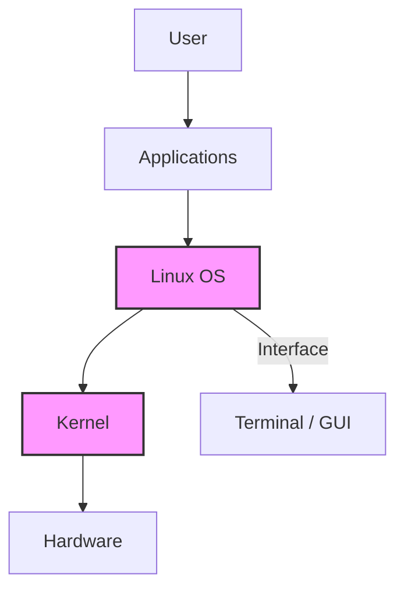

import Tabs from '@theme/Tabs';
import TabItem from '@theme/TabItem';

# Linux Basics for Beginners: A Comprehensive Guide

Linux is a powerful, open-source operating system renowned for its stability, flexibility, and security. This Linux basics guide is designed for beginners, offering a step-by-step introduction to essential commands, the file system, and practical tips to confidently start your Linux journey. Whether you're using Ubuntu, Fedora, or Debian, this tutorial will equip you with the foundational skills to navigate and manage a Linux system.

## Table of Contents

* [What is Linux?](#what-is-linux)
* [Key Features of Linux](#key-features-of-linux)
* [Exploring the Linux File System](#exploring-the-linux-file-system)
* [Mastering the Linux Terminal](#mastering-the-linux-terminal)
* [Essential Linux Commands](#essential-linux-commands)
* [Installing Software with Package Managers](#installing-software-with-package-managers)
* [Getting Started with Linux](#getting-started-with-linux)
* [Why Choose Linux?](#why-choose-linux)
* [Beginner Tips for Success](#beginner-tips-for-success)
* [Next Steps for Learning Linux](#next-steps-for-learning-linux)

## What is Linux?

**Linux** is an **open-source** operating system (OS) kernel, first developed by **Linus Torvalds** in ``1991``. It powers a vast ecosystem, from ``web servers`` and ``supercomputers`` to ``desktops`` and ``Android`` smartphones. Unlike proprietary systems like ``Windows`` or ``macOS``, Linux is ``freely customizable``, maintained by a global community, and ``distributed`` under ``open-source licenses``.

:::note
An **Operating System (OS)** acts as a bridge between hardware and software. It manages hardware resources (like CPU, memory, storage, and input/output devices) and provides a platform for software applications to run. Linux, as an OS, enables users and programs to interact with the hardware in a stable and efficient way.
:::



```mermaid
graph TD
    subgraph Application Layer
        A1[User Applications]
        A2[System Utilities]
    end

    subgraph Operating_System
        OS[Operating System (Linux/Windows/macOS)]
    end

    subgraph Hardware_Layer
        H1[CPU]
        H2[Memory]
        H3[Storage]
        H4[Input/Output Devices]
    end

    A1 --> OS
    A2 --> OS
    OS --> H1
    OS --> H2
    OS --> H3
    OS --> H4

    classDef os fill:#fef3c7,stroke:#f59e0b,stroke-width:2px;
    class OS os;
```


## Key Features of Linux

* **Distributions (Distros):** Linux comes in various flavors, such as Ubuntu, Fedora, Debian, and Arch Linux, each bundling the Linux kernel with tailored software and interfaces.
* **Open Source:** The source code is publicly available, enabling users to modify and redistribute it.
* **Multi-User and Secure:** Supports multiple users with robust permission controls, enhancing security.

\:::tip Why Learn Linux?
Linux is free, highly customizable, and in demand for careers in software development, DevOps, and cybersecurity. It’s a gateway to mastering modern computing!
\:::

## Exploring the Linux File System

The Linux file system is a hierarchical structure starting from the root directory (/). Understanding its layout is crucial for navigation and management.

**Key Directories**

* `/home`: Stores personal files for each user (e.g., `/home/john`).
* `/etc`: Contains system configuration files.
* `/bin`: Holds essential executable binaries (e.g., `ls`, `cat`).
* `/var`: Stores variable data like logs and temporary files.
* `/root`: Home directory for the root user (system administrator).

\:::note File System Nuances
Linux uses forward slashes (/) for paths and is case-sensitive (e.g., `File.txt` is different from `file.txt`). Hidden files start with a dot (e.g., `.bashrc`).
\:::

## Mastering the Linux Terminal

The terminal is the primary interface for interacting with Linux, offering speed and precision for system tasks. Most distributions include terminal emulators like GNOME Terminal, Konsole, or Terminator.

**Benefits of the Terminal**

* **Efficiency:** Execute complex tasks with simple commands.
* **Automation:** Write scripts to automate repetitive tasks.
* **Control:** Access low-level system functions not available in graphical interfaces.

## Essential Linux Commands

Below are beginner-friendly Linux commands, organized into categories for easy learning. Use the tabs to explore each group.

<Tabs>
<TabItem value="navigation" label="Navigation">

```bash
pwd        # Print the current working directory
ls         # List directory contents
cd         # Change directory
cd ..      # Move up one directory level
```

</TabItem>
<TabItem value="file" label="File Management">

```bash
mkdir projects             # Create a directory
touch notes.txt            # Create an empty file
cp notes.txt backup/       # Copy file
mv notes.txt notes_old.txt # Rename or move file
rm file.txt                # Delete file
```

</TabItem>
<TabItem value="edit" label="File Viewing/Editing">

```bash
cat notes.txt     # Display file contents
less notes.txt    # View file with scrollable navigation
nano notes.txt    # Edit using Nano
vim notes.txt     # Edit using Vim
```

</TabItem>
<TabItem value="system" label="System Info">

```bash
whoami   # Show current user
df -h    # Disk usage
free -h  # Memory usage
top      # Monitor processes
```

</TabItem>
<TabItem value="permissions" label="Permissions">

```bash
chmod +x script.sh      # Make script executable
chown john file.txt     # Change file ownership
```

</TabItem>
</Tabs>

\:::tip Practice Tip
Create a test directory (e.g., `mkdir ~/test`) to safely experiment with these commands. Use `man <command>` (e.g., `man ls`) to access detailed documentation.
\:::

## Installing Software with Package Managers

Linux distributions use package managers to install, update, and remove software. Below are examples for popular distros.

<Tabs>
<TabItem value="apt" label="APT (Debian/Ubuntu)">

```bash
sudo apt update
sudo apt install python3
```

</TabItem>
<TabItem value="dnf" label="DNF (Fedora)">

```bash
sudo dnf install git
```

</TabItem>
<TabItem value="pacman" label="Pacman (Arch)">

```bash
sudo pacman -S vim
```

</TabItem>
</Tabs>

## Getting Started with Linux

1. **Choose a Distro:** Start with beginner-friendly options like Ubuntu or Linux Mint for their intuitive graphical interfaces.
2. **Install Linux:**

   * Use a virtual machine (e.g., VirtualBox) to test Linux without altering your current OS.
   * Create a bootable USB for a full installation on a dedicated device.
3. **Practice Commands:** Open a terminal and experiment with the commands above in a safe directory.
4. **Explore Resources:** Use man pages, online forums, or distro-specific wikis for help.

\:::note Virtual Machines
Virtual machines are perfect for beginners to test Linux safely. Tools like VirtualBox are free and easy to set up.
\:::

## Why Choose Linux?

* **Cost-Free:** No licensing fees, unlike proprietary systems.
* **Highly Customizable:** Tailor the system to your needs, from desktop environments to kernel tweaks.
* **Secure and Stable:** Strong permissions and regular updates minimize vulnerabilities.
* **Career Opportunities:** Linux skills are highly valued in tech fields like development, cloud computing, and cybersecurity.

## Beginner Tips for Success

* **Start Small:** Learn a few commands daily to build confidence.
* **Use GUI Tools:** Explore graphical file managers or software centers alongside the terminal.
* **Backup Data:** Always back up important files before experimenting.
* **Join Communities:** Engage on Reddit, Stack Exchange, or distro forums.
* **Experiment Safely:** Use a test directory or virtual machine.

\:::caution Root Access
Running commands as the root user (`sudo`) can modify critical system files. Always verify commands before executing them with elevated privileges.
\:::

## Next Steps for Learning Linux

* **Install a Distro:** Try Ubuntu or Linux Mint in a VM or spare device.
* **Practice Daily:** Spend 10–15 minutes daily in the terminal.
* **Explore Advanced Topics:** Shell scripting, cron jobs, server management.
* **Leverage Resources:** Ubuntu’s Help, Linux Journey, Linux Foundation courses.

By mastering Linux basics, you’re unlocking a world of open-source possibilities. Start exploring today and join the global Linux community!

