import AdBanner from '@site/src/components/AdBanner';
import Tabs from '@theme/Tabs';
import TabItem from '@theme/TabItem';


# Introduction

Bash ``scripting`` is one of the most powerful tools for ``automating tasks`` in ``Linux`` and ``Unix-like systems``. Whether you're a beginner or a seasoned system administrator, learning Bash scripting can greatly improve your efficiency, automate repetitive tasks, and help you become more productive. This guide will introduce you to Bash scripting, starting from basic commands to advanced scripting techniques.

<div>
<AdBanner />
<div>

<details>
<summary> For Windows </summary>

For ``Windows`` use [WSL](https://learn.microsoft.com/en-us/windows/wsl/tutorials/linux)
</details>

:::info
Bash is the default shell on most Linux systems, making it a vital skill for automation and system management.
:::

:::note
You don’t need to be a programming expert to start writing Bash scripts—basic command-line knowledge is enough to begin.
:::

:::cautions

Practice by writing small scripts to automate tasks you do often, like cleaning up directories or backing up files.
:::


<details>
<summary> Youtube Video Playlist</summary>

[](https://youtu.be/jyigdPpeoCE)

</details>


## Table of Contents

* [What is Bash?](#what-is-bash)
* [What is a Shell?](#what-is-a-shell)
* [Types of shell in linux](#types-of-shells-in-linux)
* [What is a Bash Script?](#what-is-a-bash-script)
* [Why Use Bash Scripts?](#why-use-bash-scripts)
* [Getting Started: Writing Your First Bash Script](#getting-started-writing-your-first-bash-script)

  * [The Shebang (`#!/bin/bash`)](#the-shebang-binbash)
  * [Making a Script Executable](#making-a-script-executable)
* [Reference](#references)

  

<div>
<AdBanner />
<div>

## What is Bash?

**Bash** stands for **Bourne Again SHell** and is a Unix shell and command language written as a free software replacement for the Bourne shell (`sh`). It is widely used on Linux and macOS systems as the default login shell.

Bash provides a command-line interface (CLI) for users to interact with the operating system. It's not just for executing individual commands — Bash also supports programming constructs like **variables**, **conditionals**, **loops**, and **functions**, which allows users to write scripts that automate tasks.

Bash can be used interactively (typing commands one by one) or non-interactively (running a script). It reads commands from the standard input or from a script file and executes them line by line.

```mermaid
flowchart TD
    %% Title
    A[Start: User Interaction with System] --> User

    %% Main flow
    User[User\ntypes a command like `ls`] --> Bash[Bash Shell\ninterprets the command]
    Bash --> Kernel[Linux Kernel\nhandles system calls]
    Kernel --> Hardware[💻 Hardware\nDisk, CPU, Memory, etc.]
    Hardware --> Kernel
    Kernel --> Bash
    Bash --> User

    %% Output result
    User --> Output[🖥️ Output on Terminal\ne.g., List of files]

    %% Styling
    classDef shell fill:#f9f,stroke:#333,stroke-width:1px;
    classDef kernel fill:#bbf,stroke:#333,stroke-width:1px;
    classDef hardware fill:#bfb,stroke:#333,stroke-width:1px;
    class Bash shell;
    class Kernel kernel;
    class Hardware hardware;
```



<details>
<summary> Digram Explanation</summary>
### Bash System Overview – Diagram Explanation

The diagram above shows how a command flows through the Linux system using the Bash shell.

<div>
<AdBanner />
<div>

#### Step-by-Step Breakdown:

1. **User**
   - The user types a command (e.g., `ls`, `echo "Hello"`, `pwd`) into the terminal.

2. **Bash Shell**
   - Bash is the default shell in most Linux systems.
   - It parses the command, resolves variables (if any), and checks for syntax.
   - Then it sends a request to the **Linux kernel** using system calls.

3. **Linux Kernel**
   - The kernel is the core part of the OS that handles resource management, process scheduling, and hardware communication.
   - It receives the system call from Bash and takes the necessary action (e.g., accessing files, listing directories).

4. **Hardware**
   - The kernel interacts with the hardware (disk, memory, CPU, etc.) to perform the requested operation.

5. **Back to Kernel → Bash → User**
   - The result of the operation is passed back from the hardware to the kernel, then to Bash, which displays the output to the user in the terminal.

</details>

<div>
<AdBanner />
<div>

:::caution You know What
This flow demonstrates the layered architecture of Linux and how Bash serves as the interface between users and the underlying system.
:::


## What is a Shell?

A **Shell** is a command-line interface that allows users to interact with the operating system by typing commands. It serves as an intermediary between the user and the kernel (core of the OS). The shell interprets the commands given by the user into actions that the kernel can perform, such as running programs, managing files, and executing scripts. Shells like **Bash**, **Zsh**, and **PowerShell** also support scripting to automate repetitive tasks.

<div>
<AdBanner />
<div>


<details>
<summary> Detailed Explanation of Shell Diagram </summary>

### Detailed Explanation of Shell Diagram

- **User**  
  This is you—the person sitting at the computer. You want the computer to do something, like show files, run a program, or open a document. But the computer doesn’t understand plain English or human language. It understands commands, and you give those commands through the **shell**.

- **Shell (CLI Interpreter)**  
  The shell is like a helpful assistant or translator. You type in a command like `ls` to list files or `cd` to change folders. The shell understands what you're asking for and converts it into a form that the deeper part of the computer (the kernel) can act on. Shells also allow you to write small programs (called shell scripts) to automate tasks like backups or data processing.

- **Operating System Kernel**  
  The kernel is the core part of the operating system—it’s the boss. It receives the translated instructions from the shell and decides how to carry them out. For example, if you want to open a file, the kernel finds it on the hard disk and loads it into memory. It also controls things like how memory is used, how files are stored, and how programs run. You never interact directly with the kernel—it always works behind the scenes.

- **System Hardware**  
  These are the actual physical parts of the computer: the CPU (brain), RAM (memory), hard drives (storage), graphics card, and so on. The kernel tells the hardware what to do—like displaying text on your monitor, reading from the hard drive, or sending data to a printer.

### Real-Life Example

Imagine you're ordering food at a restaurant:

1. **User**: You're the customer placing an order.
2. **Shell**: The waiter who takes your order and explains it to the chef.
3. **Kernel**: The chef who understands how to prepare the food based on the request.
4. **Hardware**: The kitchen appliances and tools used to cook and serve the food.


### Step-by-Step Flow

1. **You type a command** like `mkdir new_folder` to make a new folder.
2. The **shell reads it**, understands it means “make a new directory,” and tells the kernel.
3. The **kernel processes the request**, asking the file system and memory to create space for a new folder.
4. The **hardware (like your hard drive)** is used to physically store that folder.
5. The result is shown on your screen, usually with no error if it worked.


This system keeps things organized, secure, and efficient, letting users control a powerful machine with just a few words.

</details>

<Tabs>
  <TabItem value="Navigation" label="Navigation">

        ***Navigation Commands***

            - `ls` – list directory contents  
            - `cd` – change directory  
            - `pwd` – print working directory  
  </TabItem>

  <TabItem value="File Ops" label="File Ops">
 
        ***File Operations***

            - `cp` – copy files and directories  
            - `mv` – move or rename files and directories  
            - `rm` – remove files and directories  
            - `touch` – create an empty file  
            - `cat` – display file contents  
            - `echo` – print text to the terminal  

 </TabItem>
 
 <TabItem value="Permissions" label="Permissions">

    **Permissions**

    - `chmod` – change file permissions  
    - `chown` – change file ownership  

 </TabItem>
 <TabItem value="Search" label="Search">

    **Searching**

    - `grep` – search text using patterns  
    - `find` – search for files in a directory hierarchy  
    - `head` / `tail` – view beginning or end of files  

  </TabItem>

<TabItem value="Archiving" label="Archiving">

    **Archiving**

    - `tar` – archive files  
    - `gzip` – compress files  
    - `unzip` – extract zip files  

</TabItem>

<TabItem value="Monitoring" label="Monitoring">

    ***System Monitoring***

    - `df` – report disk space usage  
    - `du` – estimate file space usage  
    - `top` – display real-time process information  
    - `ps` – report process status  
    - `kill`, `pkill`, `killall` – send signals to processes  

</TabItem>

<TabItem value="Networking" label="Networking">

    ***Network Utilities***

    - `wget` – download files from the web  
    - `curl` – transfer data from or to a server  

</TabItem>

<TabItem value="Editors & Aliases" label="Editors & Aliases">

    **Editors & Aliases**

    - `nano`, `vim`, `vi` – text editors  
    - `history` – show command history  
    - `alias` – create shortcuts for commands  

</TabItem>
</Tabs>

<div>
<AdBanner />
<div> 

## Types of Shells in Linux

<Tabs>
 <TabItem value="bash" label="Bash">

**Bash (Bourne Again SHell)** is the most commonly used shell in Linux systems. It is a free software replacement for the Bourne shell (`sh`) and includes many improvements such as:

- **Command History**: Recall previously executed commands using the `history` command or arrow keys.
- **Tab Completion**: Auto-complete commands, file names, and directories using the Tab key.
- **Scripting Support**: Create shell scripts using loops, conditionals, and functions.
- **Variable Handling**: Easily assign and manipulate variables.

Bash is the default shell in many Linux distributions and ideal for both interactive use and scripting.

Example of a simple Bash script:

```bash
#!/bin/bash
echo "Hello from Bash!"
```

</TabItem>

<TabItem value="zsh" label="Zsh">

**Zsh (Z Shell)** is an extended and highly customizable Unix shell that incorporates features from `bash`, `ksh`, and `tcsh`. It's favored by power users and developers due to its advanced capabilities and support for themes and plugins.

### 🔧 Key Features of Zsh:

- **Advanced Auto-completion**: Suggests commands, filenames, options, and even Git branches.
- **Spelling Correction**: Automatically corrects minor typos in commands.
- **Plugin and Theme Support**: Easily customized with frameworks like **Oh My Zsh** and **Prezto**.
- **Powerful Globbing**: Advanced wildcard matching for files and directories.
- **Shared History**: Combines command histories from all open sessions.
- **Prompt Customization**: Create informative and visually appealing command prompts.

Zsh is a great alternative for users who want a more interactive and modern shell experience.

### 📦 Installing Zsh & Oh My Zsh

```bash
# Install Zsh (if not already installed)
sudo apt install zsh

# Make Zsh the default shell
chsh -s $(which zsh)

# Install Oh My Zsh (optional, enhances Zsh)
sh -c "$(curl -fsSL https://raw.githubusercontent.com/ohmyzsh/ohmyzsh/master/tools/install.sh)"
```
</TabItem>

<TabItem value="fish" label="Fish">

**Fish (Friendly Interactive SHell)** is a modern, user-friendly shell designed to be easy to use out of the box. It offers several features that make the command-line experience more intuitive, especially for beginners or those coming from graphical environments.


### 🌟 Key Features:

* **Syntax Highlighting**: Automatically highlights valid commands and flags in real time.
* **Autosuggestions**: Suggests commands from your history as you type, just like predictive text.
* **Web-based Configuration**: You can configure Fish from your web browser with `fish_config`.
* **Smart Tab Completion**: Offers helpful tab completions with descriptions and context-aware suggestions.
* **No need to configure much**: Comes with sensible defaults, so you can be productive immediately.
* **Scripting with Simpler Syntax**: Fish scripting is more readable compared to Bash or Zsh.


### 🧪 Example:

```fish
# Print a message
echo "Hello from Fish!"

# Set a variable
set greeting "Hi there!"
echo $greeting

# Create a function
function say_hello
    echo "Welcome to the Fish shell!"
end

say_hello
```


### Installation

To install Fish on Ubuntu:

```bash
sudo apt update
sudo apt install fish
```

To make Fish your default shell:

```bash
chsh -s /usr/bin/fish
```


### Tip:

To open the web-based configuration UI, simply type:

```bash
fish_config
```

This launches a browser interface where you can choose themes, functions, and completions interactively.

</TabItem>

<TabItem value="ksh" label="Ksh">

**Ksh (Korn Shell)** is backward-compatible with the Bourne shell and includes features from the C shell. It is often used in legacy systems and older UNIX environments where scripting and performance are key.


### 🌟 Key Features:

* Backward compatibility with Bourne shell (`sh`)
* Includes enhancements from C shell (`csh`)
* Suitable for scripting and legacy application support
* Often used in commercial UNIX systems like AIX, HP-UX


### Example:

```ksh
echo "Hello from Ksh!"
```


### Installation:

To install Ksh on Ubuntu:

```bash
sudo apt update
sudo apt install ksh
```

To start a Ksh session:

```bash
ksh
```

</TabItem>


<TabItem value="csh" label="Csh">

**Csh (C Shell)** is a Unix shell developed by Bill Joy at the University of California, Berkeley. It introduced a C-like scripting syntax and interactive features like command history, aliases, and job control.


### Key Features

- C-like syntax for scripting (`if`, `while`, `foreach`, etc.)
- Command history and event substitution (e.g., `!!`, `!$`)
- Support for aliases to simplify commands
- Job control support
- Historically used in BSD systems and legacy UNIX setups


### Example

```csh
echo "Hello from Csh!"
set name = "Abhinav"
echo "Welcome, $name"
```

### Installation
To install Csh on Ubuntu:

```bash
sudo apt update
sudo apt install csh
```
To start a Csh session:
```bash
csh
```

</TabItem>
</Tabs>

<div>
<AdBanner />
<div>

## What is a Bash Script?

A **Bash script** is a plain text file that contains a series of commands written for the **Bash shell** to execute. These scripts automate tasks by running multiple shell commands in sequence, reducing the need for manual input.

Bash scripts are commonly used in Linux and Unix systems for:

- Automating repetitive tasks (like backups or installations)
- Running system administration jobs
- Creating deployment pipelines
- Simplifying command-line workflows

A typical Bash script starts with a **shebang** (`#!`) to indicate the interpreter:


```bash
#!/bin/bash
echo "Hello, this is a Bash script!"
```


<details>
<summary>  Bash Script Flowchart Explanation</summary>

This document explains the flow of how a Bash script works based on the given diagram.


##### 1. Bash Script → Text File

A **Bash script** is essentially a plain **text file** that contains a series of commands to be executed by the Bash shell.


####  2. Bash Script → Contains Bash Commands

The script includes **Bash commands**, just like the ones you would type into a terminal. These can include file operations, loops, conditionals, and function definitions.


##### 3. Bash Script → Executable on Linux/Unix Systems

A Bash script is intended to be **executed on Linux or Unix-like systems**, where Bash is available. It should have the correct **shebang** line at the top, such as:

```bash
#!/bin/bash
```

and similarly other 
</details>


    

 

## Why Use Bash Scripts?

``Bash scripts`` are powerful tools used in ``Unix-like`` operating systems ``(Linux, macOS, etc.)`` to automate and streamline ``command-line`` tasks. Instead of manually entering a sequence of commands every time, you can save them in a file and execute them together.

<details>
<summary> Know the Reason</summary>

Here are key reasons why Bash scripts are widely used:

:::caution Reason to Use bash
### 1. 🛠 Automation
Bash scripts help automate repetitive tasks, reducing manual effort and human error. Tasks like backups, log rotation, system updates, or file transfers can be scripted once and run anytime.

### 2. 🔁 Reusability
Scripts can be reused and shared across different systems or users. Once written, they can be executed multiple times without changes, ensuring consistency.

### 3. Simplified Workflow
Multiple complex terminal commands can be combined into a single, executable `.sh` file. This reduces cognitive load and improves productivity.

### 4. 👨‍💻 System Administration
System administrators use Bash scripts to manage users, configure environments, install packages, check system status, and automate scheduled tasks using cron.

### 5. 🧰 Custom Tool Creation
You can build lightweight tools for your daily use — such as file converters, monitoring scripts, or launchers — using just Bash and built-in commands.

### 6. Scheduling with Cron Jobs
Bash scripts can be scheduled using `cron` to run at specific times or intervals (daily, hourly, etc.), enabling unattended operations like backups or report generation.

### 7. ⚙️ Integration with Linux Ecosystem
Bash scripts work seamlessly with other command-line tools (like `grep`, `awk`, `sed`, `curl`, etc.), making them extremely versatile.

### 8. Performance & Portability
Since Bash is pre-installed on most Linux systems, Bash scripts don’t require external dependencies and execute quickly.
:::   
</details>


<div>
<AdBanner />
<div> />


## Getting Started: Writing Your First Bash Script

Bash scripting is a powerful way to automate tasks on Unix-like systems. Let's walk through how to write and run your first Bash script.

## The Shebang (`#!/bin/bash`)

The **shebang** is the first line of every Bash script. It tells the system which interpreter to use to run the script.

```bash
#!/bin/bash
```

* `#!` is a special character sequence called the **shebang**.
* `/bin/bash` is the path to the **Bash** shell interpreter.

### Example:

Create a new file called `hello.sh`:

```bash
#!/bin/bash
echo "Hello, world!"
```

This script will simply print "Hello, world!" to the terminal.


<div>
<AdBanner />
<div>
## Making a Script Executable

After writing the script, you need to make it executable to run it directly.

### Step-by-Step:

1. Save your script, e.g., `hello.sh`.
2. Open a terminal and navigate to the directory containing the file.
3. Run the following command to make it executable:

```bash
chmod +x hello.sh
```

4. Now run the script with:

```bash
./hello.sh
```

You should see the output:

```
Hello, world!
```


Congratulations! You've just written and executed your first Bash script!

<div>
<AdBanner />
<div>

## References

Here are some helpful resources to further your understanding of Linux:

- [The Linux Foundation Training](https://training.linuxfoundation.org/)
- [Linux Journey - A free, handy learning portal](https://linuxjourney.com/)
- [Ubuntu Documentation](https://help.ubuntu.com/)
- [Debian Wiki](https://wiki.debian.org/)
- [Fedora Docs](https://docs.fedoraproject.org/)
- [Arch Wiki](https://wiki.archlinux.org/)
- [Explainshell - Learn what each part of a shell command does](https://explainshell.com/)
- [LinuxCommand.org - Learning the shell](http://linuxcommand.org/)
- [GNU Bash Manual](https://www.gnu.org/software/bash/manual/bash.html)
- [TLDP: The Linux Documentation Project](https://tldp.org/)
- [OverTheWire: Bandit (Linux terminal wargame for practice)](https://overthewire.org/wargames/bandit/)


By regularly using and referencing these resources, you can reinforce your Linux knowledge and become more confident navigating both the terminal and system internals.

## More Articles

<Tabs>
  <TabItem value="docs" label="📚 Documentation">
             - [CompilerSutra Home](https://compilersutra.com)
                - [CompilerSutra Homepage (Alt)](https://compilersutra.com/)
                - [Getting Started Guide](https://compilersutra.com/get-started)
                - [Newsletter Signup](https://compilersutra.com/newsletter)
                - [Skip to Content (Accessibility)](https://compilersutra.com#__docusaurus_skipToContent_fallback)


  </TabItem>

  <TabItem value="tutorials" label="📖 Tutorials & Guides">

        - [AI Documentation](https://compilersutra.com/docs/Ai)
        - [DSA Overview](https://compilersutra.com/docs/DSA/)
        - [DSA Detailed Guide](https://compilersutra.com/docs/DSA/DSA)
        - [MLIR Introduction](https://compilersutra.com/docs/MLIR/intro)
        - [TVM for Beginners](https://compilersutra.com/docs/tvm-for-beginners)
        - [Python Tutorial](https://compilersutra.com/docs/python/python_tutorial)
        - [C++ Tutorial](https://compilersutra.com/docs/c++/CppTutorial)
        - [C++ Main File Explained](https://compilersutra.com/docs/c++/c++_main_file)
        - [Compiler Design Basics](https://compilersutra.com/docs/compilers/compiler)
        - [OpenCL for GPU Programming](https://compilersutra.com/docs/gpu/opencl)
        - [LLVM Introduction](https://compilersutra.com/docs/llvm/intro-to-llvm)
        - [Introduction to Linux](https://compilersutra.com/docs/linux/intro_to_linux)

  </TabItem>

  <TabItem value="assessments" label="📝 Assessments">

        - [C++ MCQs](https://compilersutra.com/docs/mcq/cpp_mcqs)
        - [C++ Interview MCQs](https://compilersutra.com/docs/mcq/interview_question/cpp_interview_mcqs)

  </TabItem>

  <TabItem value="projects" label="🛠️ Projects">

            - [Project Documentation](https://compilersutra.com/docs/Project)
            - [Project Index](https://compilersutra.com/docs/project/)
            - [Graphics Pipeline Overview](https://compilersutra.com/docs/The_Graphic_Rendering_Pipeline)
            - [Graphic Rendering Pipeline (Alt)](https://compilersutra.com/docs/the_graphic_rendering_pipeline/)

  </TabItem>

  <TabItem value="resources" label="🌍 External Resources">

            - [LLVM Official Docs](https://llvm.org/docs/)
            - [Ask Any Question On Quora](https://compilersutra.quora.com)
            - [GitHub: FixIt Project](https://github.com/aabhinavg1/FixIt)
            - [GitHub Sponsors Page](https://github.com/sponsors/aabhinavg1)

  </TabItem>

  <TabItem value="social" label="📣 Social Media">

            - [🐦 Twitter - CompilerSutra](https://twitter.com/CompilerSutra)
            - [💼 LinkedIn - Abhinav](https://www.linkedin.com/in/abhinavcompilerllvm/)
            - [📺 YouTube - CompilerSutra](https://www.youtube.com/@compilersutra)

  </TabItem>
</Tabs>


    

 
