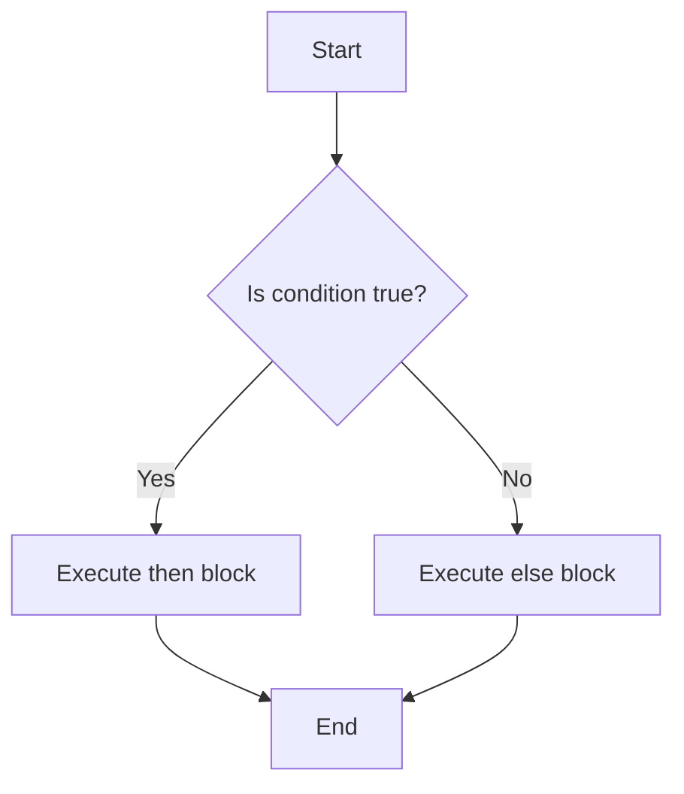

import AdBanner from '@site/src/components/AdBanner';
import Tabs from '@theme/Tabs';
import TabItem from '@theme/TabItem';

<details>
<summary> Social Media </summary>

- [🐦 Twitter - CompilerSutra](https://twitter.com/CompilerSutra)  
- [💼 LinkedIn - Abhinav](https://www.linkedin.com/in/abhinavcompilerllvm/)  
- [📺 YouTube - CompilerSutra](https://www.youtube.com/@compilersutra)  
- [📘 Facebook - CompilerSutra](https://www.facebook.com/profile.php?id=61577245012547)  
- [📝 Quora - CompilerSutra](https://compilersutra.quora.com/)  

</details>

<div>
    <AdBanner />
</div>


## Introduction

Whether you're just starting out or writing automation scripts every day, understanding how to use `if-else` statements with file handling in Bash is essential.

These two ``elements conditional`` logic and ***file operations form*** the backbone of real-world shell scripting. From checking ***if a file exists before processing it*** , to safely deleting a directory only if certain conditions are met, combining `if else` with file handling allows you to write ``smarter and safer`` scripts.

:::caution **Why does this matter?**

Because in day-to-day scripting, you'll often face questions like:
- Should I create this file or is it already there?
- What happens if the directory doesn't exist?
- Can I delete this file safely, or do I need confirmation?
:::

:::tip
Learning these patterns not only sharpens your scripting logic but also helps you automate tasks reliably making your scripts more resilient, efficient, and easier to maintain.
:::

<div style={{ position: 'relative', paddingBottom: '56.25%', height: 0, overflow: 'hidden', marginTop: '20px' }}>
  <iframe
    src="https://www.youtube.com/embed/r1HOGs1zSAM?start=24"
    title="If Else in Bash | CompilerSutra"
    style={{ position: 'absolute', top: 0, left: 0, width: '100%', height: '100%' }}
    frameBorder="0"
    allow="accelerometer; autoplay; clipboard-write; encrypted-media; gyroscope; picture-in-picture"
    allowFullScreen
  />
</div>


<div>
    <AdBanner />
</div>


## Table of Contents

1. [Introduction](#1-introduction)
2. [Why If-Else with File Handling Matters](#2-why-if-else-with-file-handling-matters)
3. [File Check Examples](#3-file-check-examples)

   * [Check if File Exists](#check-if-file-exists)
   * [Check if Directory Exists](#check-if-directory-exists)
   * [Check File Permissions](#check-file-permissions)
4. [Conditional File Operations](#4-conditional-file-operations)

   * [Create a File If Not Exists](#create-a-file-if-not-exists)
   * [Backup a File If Exists](#backup-a-file-if-exists)
   * [Delete a File Conditionally](#delete-a-file-conditionally)
5. [Real-World Scripting Examples](#5-real-world-scripting-examples)

   * [Log File Checker](#log-file-checker)
   * [Config File Backup](#config-file-backup)
   * [Auto Directory Creator](#auto-directory-creator)
6. [Common Mistakes to Avoid](#6-common-mistakes-to-avoid-in-bash-scripting)
7. [Resources](#resources)
8. [More Article](#more-articles)

<div>
    <AdBanner />
</div>

## 1. Introduction
`if-else` statements in Bash allow scripts to make decisions and perform different actions based on specific conditions. When combined with file handling (like checking if a file exists, creating directories, or deleting old logs), this becomes a powerful tool for building reliable automation scripts, maintaining system health, and managing files efficiently.

Think of it like this:

***How `if-else` Works : In Plain Terms***

1. **Evaluate a condition**  
   Bash checks if a certain condition is true (for example, "Does the file exist?").

2. **If the condition is true**  
   Run the set of commands inside the `if` block.

3. **Else (if the condition is false)**  
   Run a different set of commands inside the `else` block.

***Simple Algorithm***

<details>
<summary><strong> Digram and algo explanation</strong></summary>

This flowchart represents a basic `if-else` structure in Bash scripting:

* **Start**: Your script begins execution.
* **Condition Check**: The script evaluates a condition (e.g., if a file exists, if a variable is set, etc.).
* **Yes (True)**:

  * If the condition is true, the code inside the `then` block executes.
* **No (False)**:

  * If the condition is false, the code inside the `else` block runs instead.
* **End**: The script proceeds to the next steps after handling the condition.

This control flow is essential in automating decisions based on system state or input, such as checking if a file exists before attempting to read it.
</details>


<div>
    <AdBanner />
</div>


## 2. Why If-Else with File Handling Matters

When writing Bash scripts that interact with the file system, one of the most important control structures is the `if-else` statement. It allows scripts to make decisions based on the current state of files and directories:whether they exist, are accessible, or require specific actions. This kind of logic is essential for writing reliable, fault-tolerant automation.

Below are some common and important use cases where `if-else` enhances file handling in Bash:


**Preventing Overwrites**  
In many scripts, especially those that generate reports, write logs, or configure systems, overwriting an existing file by mistake can result in data loss or misconfiguration. Using an `if` condition like `[ -f "filename" ]`, you can detect if a file already exists and take appropriate action:such as skipping the operation, creating a backup, or prompting the user for confirmation. This preventive check is a fundamental part of writing safe scripts.

:::caution usecase

| Use Case                             | Description |
|-------------------------------------|-------------|
| **Preventing Overwrites**           | In scripts that generate reports, update config files, or manage logs, accidentally overwriting an existing file can lead to critical data loss or misbehavior. Using `if [ -f "filename" ]`, you can first check whether the file exists and then choose to skip, back up, or prompt before proceeding. This safeguards your automation from unintended consequences. |
| **Automating Configuration and Backup Tasks** | Many scripts require conditional logic to check if certain files or folders exist before proceeding with deployment, configuration, or backup tasks. With `if-else`, you can create missing directories, only back up existing data, or apply environment-specific settings:making your script more adaptive and reliable. |
| **Logging and System State Notifications** | Automation often needs transparency. With conditional checks, your script can verify file presence or permissions and log meaningful messages. For example, if a config file is missing, log it or alert the user. This is crucial for auditability, monitoring, and debugging in production environments. |
| **Handling Missing or Inaccessible Files** | If a script attempts to access a non-existent or restricted file, it can crash or behave unpredictably. Use checks like `-e`, `-r`, `-w`, or `-x` to verify the file's state before operating on it. Based on the result, you can skip the operation, inform the user, or take corrective action. This ensures your script handles failures gracefully. |
:::


<div>
    <AdBanner />
</div>


## 3. File Check Examples

Bash `if` statements allow scripts to execute commands conditionally, depending on whether a test expression evaluates to true.

***<u>Syntax</u>***

```python
if [ condition ]; then
    # commands when true
else
    # commands when false
fi
```
<details>
<summary><strong><u>***Common Test Flags***</u></strong></summary>

| Flag | Purpose |
|------|---------|
| `-f` | True if **file exists** and is a regular file |
| `-d` | True if **directory exists** |
| `-e` | True if **file or directory exists** |
| `-r` | True if the file is **readable** |
| `-w` | True if the file is **writable** |
| `-x` | True if the file is **executable** |
| `-s` | True if the file **exists and is not empty** |
| `-L` | True if the file is a **symbolic link** |
| `-h` | Same as `-L` (True if **symbolic link**) |
| `-b` | True if the file is a **block special file** (like a USB device) |
| `-c` | True if the file is a **character special file** (like a keyboard or terminal) |
| `-p` | True if the file is a **named pipe** (FIFO) |
| `-S` | True if the file is a **socket** |
| `-u` | True if the file has the **set-user-ID** bit set |
| `-g` | True if the file has the **set-group-ID** bit set |
| `-k` | True if the file has the **sticky bit** set |
| `-N` | True if the file was **modified since it was last read** |
| `file1 -nt file2` | True if `file1` is **newer than** `file2` |
| `file1 -ot file2` | True if `file1` is **older than** `file2` |
| `file1 -ef file2` | True if `file1` and `file2` **refer to the same file** |
</details>

<div>
    <AdBanner />
</div>

<Tabs groupId="bash-file-checks">

<TabItem value="file" label="Check if File Exists">

### Check if File Exists

```python
FILE="/etc/passwd"
if [ -f "$FILE" ]; then
    echo "$FILE exists."
else
    echo "$FILE not found."
fi
```

 **Explanation**:
> `-f` checks whether the file exists and is a **regular file**.
>
>This script sets the variable `FILE` to a common system file (`/etc/passwd`). The `-f` test checks if this file exists and is a >regular file (not a directory, device, or symlink). If true, it confirms the file's existence; otherwise, it reports it as missing. >This check is useful when your script depends on a specific file being present.

</TabItem>

<TabItem value="directory" label="Check if Directory Exists">

### Check if Directory Exists

```python
DIR="/var/log"
if [ -d "$DIR" ]; then
    echo "Directory exists."
else
    echo "Directory not found."
fi
```

**Explanation**:
> `-d` checks whether the directory exists.

>This block verifies whether the specified directory (`/var/log`) exists. The `-d` flag ensures the target is indeed a directory. >This is especially important when preparing to read from or write logs into a path, preventing directory-related errors.

</TabItem>

<TabItem value="permissions" label="Check File Permissions">

### Check File Permissions

```python
if [ -r "$FILE" ]; then echo "Readable"; fi
if [ -w "$FILE" ]; then echo "Writable"; fi
if [ -x "$FILE" ]; then echo "Executable"; fi
```

 **Explanation**:

>This snippet checks the accessibility of the file referenced by `FILE`. It uses:
>* `-r` to check if the file can be read,
>* `-w` to check if it can be written to,
>* `-x` to determine if it can be executed.
>Such permission checks help avoid permission denied errors when interacting with files in scripts.

</TabItem>

</Tabs>


<div>
    <AdBanner />
</div>

## 4. Conditional File Operations

Bash allows you to perform actions like creating, backing up, or deleting files based on conditions. These operations are especially useful in scripts that automate tasks.

<Tabs groupId="bash-conditional-ops">

<TabItem value="create" label="Create File If Not Exists">

### Create a File If Not Exists

```python
FILE="notes.txt"
if [ ! -f "$FILE" ]; then
    touch "$FILE"
    echo "File created."
else
    echo "File already exists."
fi
```

**Explanation**:

> `! -f` means the file does **not exist**. `touch` creates a new empty file.

</TabItem>

<TabItem value="backup" label="Backup a File If Exists">

### Backup a File If Exists

```python
ORIG="settings.conf"
BACKUP="settings.bak"
if [ -f "$ORIG" ]; then
    cp "$ORIG" "$BACKUP"
    echo "Backup created."
else
    echo "Original file not found."
fi
```

**Explanation**:

> `-f` checks if the original file exists. If so, it is copied to a new backup file.

</TabItem>

<TabItem value="delete" label="Delete a File Conditionally">

### Delete a File Conditionally

```python
FILE="temp.log"
if [ -f "$FILE" ]; then
    rm "$FILE"
    echo "File deleted."
else
    echo "Nothing to delete."
fi
```

**Explanation**:

> `-f` ensures that the file exists before attempting to delete it.

</TabItem>

</Tabs>


<div>
    <AdBanner />
</div>


## 5. Real-World Scripting Examples

In this section, we’ll explore practical Bash scripting scenarios that are commonly used in real-world automation tasks. These examples combine `if-else` logic with file operations to solve problems like log monitoring, file backups, and system status checks.

:::note
Each script is designed to be simple, readable, and immediately applicable, whether you're a beginner or working in a production environment.
:::

<Tabs>

<TabItem value="Log File Checker" label="Log File Checker">

```python
LOG="/var/log/syslog"
if grep -q "error" "$LOG"; then
    echo "Errors found in the log!"
else
    echo "Log is clean."
fi
```

>**Explanation**
>Searches the system log for lines containing "error". The `-q` flag makes `grep` quiet (exit status only). Ideal for automated >health checks or log monitoring scripts.

</TabItem>

<TabItem value="Config File Backup" label="Config File Backup">

```python
CONFIG="/etc/nginx/nginx.conf"
if [ -f "$CONFIG" ]; then
    cp "$CONFIG" "/tmp/nginx.conf.bak"
    echo "Backup done."
else
    echo "Config file not found."
fi
```

>**Explanation**
>Checks if the Nginx config file exists, and if so, backs it up. Helps prevent accidental loss before deployment or config edits.

</TabItem>

<TabItem value="Auto Directory Creator" label="Auto Directory Creator">

```python
DIR="/data/reports"
if [ ! -d "$DIR" ]; then
    mkdir -p "$DIR"
    echo "Directory created."
else
    echo "Directory already exists."
fi
```

>**Explanation**
>Checks if the `/data/reports` directory exists. If not, it creates it using `mkdir -p`. Useful for automated report generation or >data pipeline setups.

</TabItem>

</Tabs>


<div>
    <AdBanner />
</div>


## 6 Common Mistakes to Avoid in Bash Scripting

When writing Bash scripts, even minor oversights can lead to serious errors or unexpected behavior. Below are some of the most common mistakes along with guidance on how to avoid them.


***1. Omitting Quotes Around Variables***
<details>
<summary>**❌ Problem:**     </summary>

:::caution 
Leaving variables unquoted can lead to word-splitting, glob expansion, or script failures—especially when values include spaces or special characters.
:::

| Syntax          | Code Example                                   | Explanation |
|----------------|--------------------------------------------------|-------------|
| ❌ **Incorrect** | `if [ $name = "admin" ]; then`                  | Without quotes, if `$name` is empty or contains spaces, it can cause syntax errors or unintended behavior. |
| ✅ **Correct**   | `if [ "$name" = "admin" ]; then`                | Quoting `$name` ensures it is treated as a single string, even if it's empty or contains spaces. This is safer and prevents script crashes. |
</details>

***2.Using `=` Instead of `==` in Conditional Tests***
<details>
<summary>**❌ Problem:**     </summary>
:::caution
**❌ Problem:**
In `[[ ... ]]` tests, using `=` works, but `==` is preferred for string comparison. However, inside `[ ... ]`, only `=` is POSIX-compliant.
:::

| Syntax          | Code Example                                      | Explanation |
|----------------|----------------------------------------------------|-------------|
| ❌ **Incorrect** | `if [[ $role = "admin" ]]; then`                  | Although `=` works inside `[[ ]]`, it's more conventional and clearer to use `==` for string comparison. Some linters or style guides may flag this. |
| ✅ **Correct**   | `if [[ $role == "admin" ]]; then`                 | Using `==` is preferred for clarity and consistency within `[[ ]]` test commands in Bash. |
</details>

***3. Ignoring File Permissions***
<details>
<summary> **❌ Problem:**</summary>

**❌ Problem:**
Assuming files are always readable or writable can cause script failures when permissions are restricted.

**Tip:** Always check file permissions before attempting read/write operations.

```python
if [ -r "$file" ]; then
  cat "$file"
else
  echo "Cannot read file: $file"
fi
```
</details>


***4. Skipping Error Handling***
<details>
<summary> **❌ Problem:**</summary>

**❌ Problem:**
Assuming every command will succeed can leave your script vulnerable to silent failures.

**Solution:** Always check return codes using `$?` or use `set -e` to stop on errors.

```python
cp config.txt /etc/app/
if [ $? -ne 0 ]; then
  echo "Failed to copy configuration file."
  exit 1
fi
```
</details>

:::caution
**Alternative (automatic exit on error):**

```python
set -e
cp config.txt /etc/app/
```
:::
---
:::tip
> By avoiding these common pitfalls, you'll write more robust, portable, and maintainable Bash scripts.
:::

---

<div>
    <AdBanner />
</div>

## Resources


Here are some helpful resources to further your understanding of Linux:

- [The Linux Foundation Training](https://training.linuxfoundation.org/)
- [Linux Journey - A free, handy learning portal](https://linuxjourney.com/)
- [Ubuntu Documentation](https://help.ubuntu.com/)
- [Debian Wiki](https://wiki.debian.org/)
- [Fedora Docs](https://docs.fedoraproject.org/)
- [Arch Wiki](https://wiki.archlinux.org/)
- [Explainshell - Learn what each part of a shell command does](https://explainshell.com/)
- [LinuxCommand.org - Learning the shell](http://linuxcommand.org/)
- [GNU Bash Manual](https://www.gnu.org/software/bash/manual/bash.html)
- [TLDP: The Linux Documentation Project](https://tldp.org/)
- [OverTheWire: Bandit (Linux terminal wargame for practice)](https://overthewire.org/wargames/bandit/)


<div>
    <AdBanner />
</div>


## More Articles

<Tabs>
  <TabItem value="docs" label="📚 Documentation">
             - [CompilerSutra Home](https://compilersutra.com)
                - [CompilerSutra Homepage (Alt)](https://compilersutra.com/)
                - [Getting Started Guide](https://compilersutra.com/get-started)
                - [Newsletter Signup](https://compilersutra.com/newsletter)
                - [Skip to Content (Accessibility)](https://compilersutra.com#__docusaurus_skipToContent_fallback)


  </TabItem>

  <TabItem value="tutorials" label="📖 Tutorials & Guides">

        - [AI Documentation](https://compilersutra.com/docs/Ai)
        - [DSA Overview](https://compilersutra.com/docs/DSA/)
        - [DSA Detailed Guide](https://compilersutra.com/docs/DSA/DSA)
        - [MLIR Introduction](https://compilersutra.com/docs/MLIR/intro)
        - [TVM for Beginners](https://compilersutra.com/docs/tvm-for-beginners)
        - [Python Tutorial](https://compilersutra.com/docs/python/python_tutorial)
        - [C++ Tutorial](https://compilersutra.com/docs/c++/CppTutorial)
        - [C++ Main File Explained](https://compilersutra.com/docs/c++/c++_main_file)
        - [Compiler Design Basics](https://compilersutra.com/docs/compilers/compiler)
        - [OpenCL for GPU Programming](https://compilersutra.com/docs/gpu/opencl)
        - [LLVM Introduction](https://compilersutra.com/docs/llvm/intro-to-llvm)
        - [Introduction to Linux](https://compilersutra.com/docs/linux/intro_to_linux)

  </TabItem>

  <TabItem value="assessments" label="📝 Assessments">

        - [C++ MCQs](https://compilersutra.com/docs/mcq/cpp_mcqs)
        - [C++ Interview MCQs](https://compilersutra.com/docs/mcq/interview_question/cpp_interview_mcqs)

  </TabItem>

  <TabItem value="projects" label="🛠️ Projects">

            - [Project Documentation](https://compilersutra.com/docs/Project)
            - [Project Index](https://compilersutra.com/docs/project/)
            - [Graphics Pipeline Overview](https://compilersutra.com/docs/The_Graphic_Rendering_Pipeline)
            - [Graphic Rendering Pipeline (Alt)](https://compilersutra.com/docs/the_graphic_rendering_pipeline/)

  </TabItem>

  <TabItem value="resources" label="🌍 External Resources">

            - [LLVM Official Docs](https://llvm.org/docs/)
            - [Ask Any Question On Quora](https://compilersutra.quora.com)
            - [GitHub: FixIt Project](https://github.com/aabhinavg1/FixIt)
            - [GitHub Sponsors Page](https://github.com/sponsors/aabhinavg1)

  </TabItem>

  <TabItem value="social" label="📣 Social Media">

            - [🐦 Twitter - CompilerSutra](https://twitter.com/CompilerSutra)
            - [💼 LinkedIn - Abhinav](https://www.linkedin.com/in/abhinavcompilerllvm/)
            - [📺 YouTube - CompilerSutra](https://www.youtube.com/@compilersutra)

  </TabItem>
</Tabs>


<div>
    <AdBanner />
</div>
