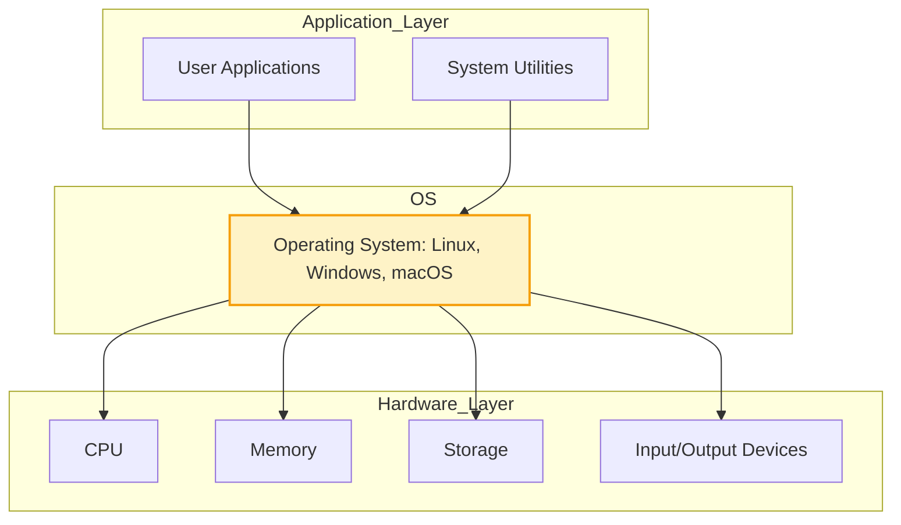
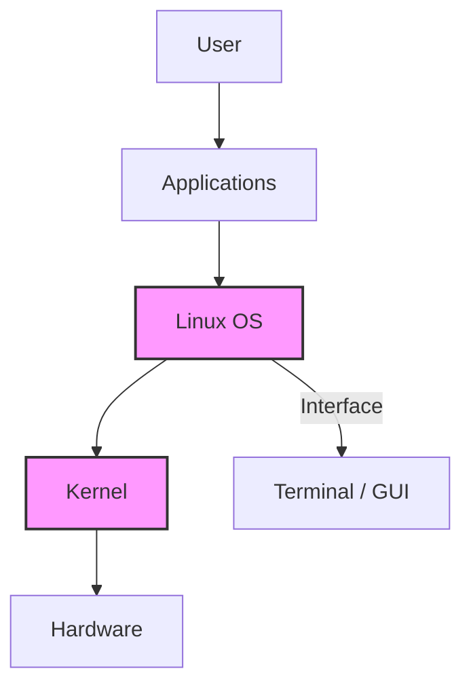

import AdBanner from '@site/src/components/AdBanner';

import Tabs from '@theme/Tabs';
import TabItem from '@theme/TabItem';

# Linux Basics for Beginners: A Comprehensive Guide

**Linux is a powerful**, open-source operating system renowned for its ``stability, flexibility``, and ``security``. This ``Linux basics guide`` is ``designed for beginners``, offering a step-by-step introduction to essential commands, the file system, and practical tips to ``confidently start`` your Linux journey. Whether you're using ``Ubuntu``, ``Fedora``, or ``Debian`` , this tutorial will equip you with the ``foundational skills`` to navigate and ``manage a Linux system``.

<details>
<summary> Youtube Video Playlist</summary>

<div style={{ marginTop: '20px', display: 'flex', justifyContent: 'center' }}>
  <iframe 
    width="560" 
    height="315" 
    src="https://www.youtube.com/embed/jyigdPpeoCE?mute=1" 
    title="Watch CompilerSutra Video" 
    frameborder="0" 
    allow="accelerometer; autoplay; clipboard-write; encrypted-media; gyroscope; picture-in-picture; web-share" 
    allowfullscreen>
  </iframe>
</div>

</details>

<div>
    <AdBanner />
</div>

## Table of Contents

* [What is Linux?](#what-is-linux)
* [Key Features of Linux](#key-features-of-linux)
* [Exploring the Linux File System](#exploring-the-linux-file-system)
* [Mastering the Linux Terminal](#mastering-the-linux-terminal)
* [Essential Linux Commands](#essential-linux-commands)
* [Installing Software with Package Managers](#installing-software-with-package-managers)
* [Getting Started with Linux](#getting-started-with-linux)
* [Why Choose Linux?](#why-choose-linux)
* [Beginner Tips for Success](#beginner-tips-for-success)
* [Next Steps for Learning Linux](#next-steps-for-learning-linux)
* [References](#references)
* [More Article to Read](#more-articles)


<div>
    <AdBanner />
</div>

## What is Linux?

**Linux** is an **open-source** operating system (OS) kernel, first developed by **Linus Torvalds** in ``1991``. It powers a vast ecosystem, from ``web servers`` and ``supercomputers`` to ``desktops`` and ``Android`` smartphones. Unlike proprietary systems like ``Windows`` or ``macOS``, Linux is ``freely customizable``, maintained by a global community, and ``distributed`` under ``open-source licenses``.


<details> 
<summary> Operating System (OS)  </summary>

<div>
    <AdBanner />
</div>

:::note
An **Operating System (OS)** acts as a bridge between hardware and software. It manages hardware resources (like CPU, memory, storage, and input/output devices) and provides a platform for software applications to run. Linux, as an OS, enables users and programs to interact with the hardware in a stable and efficient way.
:::



<div>
    <AdBanner />
</div>

:::tip
The **Operating System (OS)** plays a crucial role in managing the interaction between software and hardware. It provides an abstraction layer that allows user applications to function without needing to manage hardware directly.
:::

---

## Hardware Layer

The foundational layer consists of the physical components of a computer system:

- **CPU** – Executes instructions from programs.
- **Memory (RAM)** – Temporarily stores data and code for active processes.
- **Storage** – Persistent data storage (e.g., SSD, HDD).
- **Input/Output Devices** – Interfaces for user interaction (e.g., keyboard, mouse, display, network).

---

## ⚙️ Operating System (OS)

The OS acts as the **intermediary** between hardware and user applications. It:

- Manages hardware resources.
- Schedules processes and threads.
- Handles system calls from applications.
- Provides security and user authentication.
- Examples: **Linux**, **Windows**, **macOS**

---

##  System Utilities

System utilities are software components provided by the OS to manage the system, such as:

- File explorers
- Task managers
- Terminal/shell interfaces
- Update managers

---

##  Application Layer

This top layer includes **User Applications**:

- Web browsers
- Code editors (e.g., VSCode)
- Office software
- Games

These applications rely on **OS services** to perform their tasks like reading files, accessing the internet, or allocating memory.

</details>


<details>
<summary> Digram Explanation</summary>

### Understanding the Linux System Architecture

The ``Linux Operating System`` is a layered architecture that provides a structured interface between the user and the computer hardware. Each layer has a specific role in ``managing tasks``, resources, and ``communication``.

---

### Interface

The **Interface** is how users interact with the system. It can be:

- **Graphical User Interface (GUI)** – Desktop environments like GNOME, KDE.
- **Terminal (Command-Line Interface)** – Shells like Bash, Zsh.

---

### User

The **User** is the person operating the computer. They interact with applications through the interface (GUI or Terminal).

- Can be an end user, system administrator, or developer.
- Executes commands, runs applications, and manages files.

---

### Applications

**Applications** are software tools built to perform specific tasks:

- Examples: Web browsers, text editors, games, compilers.
- Run in user space and make system calls to interact with the OS.

---

## 🐧 Linux OS

<div>
    <AdBanner />
</div>

The **Linux Operating System** includes:

- **System Libraries** – Support application functionality.
- **System Tools** – Utilities for managing the system.
- **Shell** – Interface to run commands and scripts.
- Provides a complete environment to run applications and manage resources.

---

## Kernel

The **Kernel** is the core component of Linux:

- Manages system resources (CPU, memory, devices).
- Handles process scheduling, file systems, and device drivers.
- Acts as a bridge between hardware and applications.

---

## Hardware

The **Hardware** includes physical components of the computer:

- CPU, RAM, Disk, GPU
- Input/Output Devices (keyboard, mouse, display)

The kernel interacts directly with hardware to perform operations requested by the applications.

---
</details>

## Key Features of Linux

* **Distributions (Distros):** Linux comes in various flavors, such as Ubuntu, Fedora, Debian, and Arch Linux, each bundling the Linux kernel with tailored software and interfaces.
* **Open Source:** The source code is publicly available, enabling users to modify and redistribute it.
* **Multi-User and Secure:** Supports multiple users with robust permission controls, enhancing security.

:::tip
 Why Learn Linux?
Linux is free, highly customizable, and in demand for careers in software development, DevOps, and cybersecurity. It’s a gateway to mastering modern computing!
:::

## Exploring the Linux File System

The Linux file system is a hierarchical structure starting from the root directory (/). Understanding its layout is crucial for navigation and management.

**Key Directories**

* `/home`: Stores personal files for each user (e.g., `/home/john`).
* `/etc`: Contains system configuration files.
* `/bin`: Holds essential executable binaries (e.g., `ls`, `cat`).
* `/var`: Stores variable data like logs and temporary files.
* `/root`: Home directory for the root user (system administrator).


:::note 
File System Nuances
Linux uses forward slashes (/) for paths and is case-sensitive (e.g., `File.txt` is different from `file.txt`). Hidden files start with a dot (e.g., `.bashrc`).
:::

<div>
<AdBanner />
</div>

## Mastering the Linux Terminal

The terminal is the primary interface for interacting with Linux, offering speed and precision for system tasks. Most distributions include terminal emulators like GNOME Terminal, Konsole, or Terminator.

**Benefits of the Terminal**

* **Efficiency:** Execute complex tasks with simple commands.
* **Automation:** Write scripts to automate repetitive tasks.
* **Control:** Access low-level system functions not available in graphical interfaces.

## Essential Linux Commands

Below are beginner-friendly Linux commands, organized into categories for easy learning. Use the tabs to explore each group.

<Tabs>
<TabItem value="navigation" label="Navigation">

```bash
pwd        # Print the current working directory
ls         # List directory contents
cd         # Change directory
cd ..      # Move up one directory level
```

</TabItem>
<TabItem value="file" label="File Management">

```bash
mkdir projects             # Create a directory
touch notes.txt            # Create an empty file
cp notes.txt backup/       # Copy file
mv notes.txt notes_old.txt # Rename or move file
rm file.txt                # Delete file
```

</TabItem>
<TabItem value="edit" label="File Viewing/Editing">

```bash
cat notes.txt     # Display file contents
less notes.txt    # View file with scrollable navigation
nano notes.txt    # Edit using Nano
vim notes.txt     # Edit using Vim
```

</TabItem>
<TabItem value="system" label="System Info">

```bash
whoami   # Show current user
df -h    # Disk usage
free -h  # Memory usage
top      # Monitor processes
```

</TabItem>
<TabItem value="permissions" label="Permissions">

```bash
chmod +x script.sh      # Make script executable
chown john file.txt     # Change file ownership
```

</TabItem>
</Tabs>

:::tip
 Practice Tip
Create a test directory (e.g., `mkdir ~/test`) to safely experiment with these commands. Use `man <command>` (e.g., `man ls`) to access detailed documentation.
:::

## Installing Software with Package Managers

Linux distributions use package managers to install, update, and remove software. Below are examples for popular distros.

<Tabs>
<TabItem value="apt" label="APT (Debian/Ubuntu)">

```bash
sudo apt update
sudo apt install python3
```

</TabItem>
<TabItem value="dnf" label="DNF (Fedora)">

```bash
sudo dnf install git
```

</TabItem>
<TabItem value="pacman" label="Pacman (Arch)">

```bash
sudo pacman -S vim
```

</TabItem>
</Tabs>

## Getting Started with Linux

1. **Choose a Distro:** Start with beginner-friendly options like Ubuntu or Linux Mint for their intuitive graphical interfaces.
2. **Install Linux:**

   * Use a virtual machine (e.g., VirtualBox) to test Linux without altering your current OS.
   * Create a bootable USB for a full installation on a dedicated device.
3. **Practice Commands:** Open a terminal and experiment with the commands above in a safe directory.
4. **Explore Resources:** Use man pages, online forums, or distro-specific wikis for help.

:::note
 **Virtual Machines**
Virtual machines are perfect for beginners to test Linux safely. Tools like VirtualBox are free and easy to set up.
:::

<div>
    <AdBanner />
</div>

## Why Choose Linux?

* **Cost-Free:** No licensing fees, unlike proprietary systems.
* **Highly Customizable:** Tailor the system to your needs, from desktop environments to kernel tweaks.
* **Secure and Stable:** Strong permissions and regular updates minimize vulnerabilities.
* **Career Opportunities:** Linux skills are highly valued in tech fields like development, cloud computing, and cybersecurity.

## Beginner Tips for Success

* **Start Small:** Learn a few commands daily to build confidence.
* **Use GUI Tools:** Explore graphical file managers or software centers alongside the terminal.
* **Backup Data:** Always back up important files before experimenting.
* **Join Communities:** Engage on Reddit, Stack Exchange, or distro forums.
* **Experiment Safely:** Use a test directory or virtual machine.

:::caution Root Access
Running commands as the root user (`sudo`) can modify critical system files. Always verify commands before executing them with elevated privileges.
:::

## Next Steps for Learning Linux

* **Install a Distro:** Try Ubuntu or Linux Mint in a VM or spare device.
* **Practice Daily:** Spend 10–15 minutes daily in the terminal.
* **Explore Advanced Topics:** Shell scripting, cron jobs, server management.
* **Leverage Resources:** Ubuntu’s Help, Linux Journey, Linux Foundation courses.

By mastering Linux basics, you’re unlocking a world of open-source possibilities. Start exploring today and join the global Linux community!

## References

Here are some helpful resources to further your understanding of Linux:

- [The Linux Foundation Training](https://training.linuxfoundation.org/)
- [Linux Journey - A free, handy learning portal](https://linuxjourney.com/)
- [Ubuntu Documentation](https://help.ubuntu.com/)
- [Debian Wiki](https://wiki.debian.org/)
- [Fedora Docs](https://docs.fedoraproject.org/)
- [Arch Wiki](https://wiki.archlinux.org/)
- [Explainshell - Learn what each part of a shell command does](https://explainshell.com/)
- [LinuxCommand.org - Learning the shell](http://linuxcommand.org/)
- [GNU Bash Manual](https://www.gnu.org/software/bash/manual/bash.html)
- [TLDP: The Linux Documentation Project](https://tldp.org/)
- [OverTheWire: Bandit (Linux terminal wargame for practice)](https://overthewire.org/wargames/bandit/)

---

By regularly using and referencing these resources, you can reinforce your Linux knowledge and become more confident navigating both the terminal and system internals.

## More Articles

<Tabs>
  <TabItem value="docs" label="📚 Documentation">
             - [CompilerSutra Home](https://compilersutra.com)
                - [CompilerSutra Homepage (Alt)](https://compilersutra.com/)
                - [Getting Started Guide](https://compilersutra.com/get-started)
                - [Newsletter Signup](https://compilersutra.com/newsletter)
                - [Skip to Content (Accessibility)](https://compilersutra.com#__docusaurus_skipToContent_fallback)


  </TabItem>

  <TabItem value="tutorials" label="📖 Tutorials & Guides">

        - [AI Documentation](https://compilersutra.com/docs/Ai)
        - [DSA Overview](https://compilersutra.com/docs/DSA/)
        - [DSA Detailed Guide](https://compilersutra.com/docs/DSA/DSA)
        - [MLIR Introduction](https://compilersutra.com/docs/MLIR/intro)
        - [TVM for Beginners](https://compilersutra.com/docs/tvm-for-beginners)
        - [Python Tutorial](https://compilersutra.com/docs/python/python_tutorial)
        - [C++ Tutorial](https://compilersutra.com/docs/c++/CppTutorial)
        - [C++ Main File Explained](https://compilersutra.com/docs/c++/c++_main_file)
        - [Compiler Design Basics](https://compilersutra.com/docs/compilers/compiler)
        - [OpenCL for GPU Programming](https://compilersutra.com/docs/gpu/opencl)
        - [LLVM Introduction](https://compilersutra.com/docs/llvm/intro-to-llvm)
        - [Introduction to Linux](https://compilersutra.com/docs/linux/intro_to_linux)

  </TabItem>

  <TabItem value="assessments" label="📝 Assessments">

        - [C++ MCQs](https://compilersutra.com/docs/mcq/cpp_mcqs)
        - [C++ Interview MCQs](https://compilersutra.com/docs/mcq/interview_question/cpp_interview_mcqs)

  </TabItem>

  <TabItem value="projects" label="🛠️ Projects">

            - [Project Documentation](https://compilersutra.com/docs/Project)
            - [Project Index](https://compilersutra.com/docs/project/)
            - [Graphics Pipeline Overview](https://compilersutra.com/docs/The_Graphic_Rendering_Pipeline)
            - [Graphic Rendering Pipeline (Alt)](https://compilersutra.com/docs/the_graphic_rendering_pipeline/)

  </TabItem>

  <TabItem value="resources" label="🌍 External Resources">

            - [LLVM Official Docs](https://llvm.org/docs/)
            - [Ask Any Question On Quora](https://compilersutra.quora.com)
            - [GitHub: FixIt Project](https://github.com/aabhinavg1/FixIt)
            - [GitHub Sponsors Page](https://github.com/sponsors/aabhinavg1)

  </TabItem>

  <TabItem value="social" label="📣 Social Media">

            - [🐦 Twitter - CompilerSutra](https://twitter.com/CompilerSutra)
            - [💼 LinkedIn - Abhinav](https://www.linkedin.com/in/abhinavcompilerllvm/)
            - [📺 YouTube - CompilerSutra](https://www.youtube.com/@compilersutra)

  </TabItem>
</Tabs>