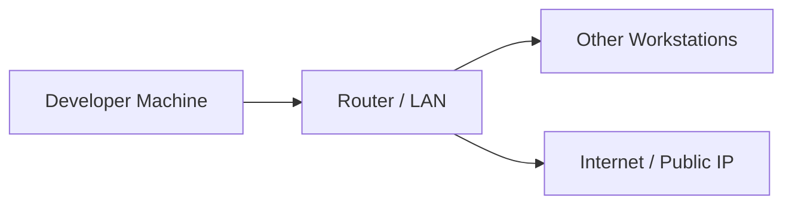

import AdBanner from '@site/src/components/AdBanner';
import Tabs from '@theme/Tabs';
import TabItem from '@theme/TabItem';
import { ComicQA } from '../mcq/interview_question/Question_comics' ;


Every developer or IT professional at some point needs to identify their ***machine on a network***. 
Whether you’re connecting via ***SSH***, transferring files with SCP, or ***troubleshooting network issues***, knowing your machine name and IP address is essential.


:::tip What we will know
This guide walks you through step-by-step instructions for Linux, Windows, and Mac, showing you how to quickly find your device name, local IP address, and even test network connectivity. 
:::important By the end, 
you’ll have a solid understanding of your ***system’s identity on your local network***, along with practical tips for accurate detection and troubleshooting.
:::

## Table of Contents

1. [Introduction](#introduction)
2. [Why Machine Name and IP Address Matter](#why-machine-name-and-ip-address-matter)
3. [Step 1: Find Your Machine Name](#step-1-find-your-machine-name)
4. [Step 2: Find Your IP Address](#step-2-find-your-ip-address)
5. [Step 3: Quickly Get Only Your Local IP](#step-3-quickly-get-only-your-local-ip)
6. [Step 4: Check Connectivity (Optional)](#step-4-check-connectivity-optional)
7. [Collapsible Insights](#collapsible-insights)
8. [What’s Next](#whats-next)
9. [More Article](#more-article)
10. [FAQ](#faq)

---

## Introduction

###### Finding Your Machine Name and IP Address on Linux, Windows, and Mac

Knowing your **machine name** and **IP address** is fundamental for developers, system administrators, and IT professionals. It enables SSH connections, file transfers with SCP, network troubleshooting, and overall system identification.

<Tabs>
<TabItem value="Video" label="Video Playlist">
<div style={{ position: 'relative', paddingBottom: '56.25%', height: 0, overflow: 'hidden' }}>
  <iframe
    src="https://www.youtube.com/embed/fPMbTyEbMWU"
    title="CompilerSutra Video"
    style={{ position: 'absolute', top: 0, left: 0, width: '100%', height: '100%' }}
    frameBorder="0"
    allow="accelerometer; autoplay; clipboard-write; encrypted-media; gyroscope; picture-in-picture"
    allowFullScreen
  />
</div>
</TabItem>
<TabItem value="Ad" label="Ad/Promotion">
<div>
  <AdBanner />
</div>
</TabItem>
</Tabs>

---

## Why Machine Name and IP Address Matter

In any network from your home Wi-Fi to the global Internet devices need to be **identified** and **located**. 
Two key concepts make this possible:
  * The **machine name (hostname)**: a human-friendly name that identifies a device.
  * The **IP address**: a numerical label that pinpoints the device’s exact location 
      on the network.

> *Together, they allow devices to communicate reliably.*


###### Beginner / General User Perspective

* **Machine Name (Hostname):**

  * Think of it like the “name” of your computer on the network.
  * Makes it easier to recognize devices (e.g., *Abhinav-PC* instead of *192.168.1.5*).

* **IP Address:**

  * Similar to a house address where information (data packets) is delivered.
  * Two types:

    * **Private IP** → Used within your home or office network.
    * **Public IP** → Used on the internet.

* **Why It Matters for You:**

  * Sharing files or streaming across devices in your home.
  * Ensuring a stable connection to printers, Wi-Fi, or smart home devices.
  * Troubleshooting network problems (e.g., “Why isn’t my Wi-Fi working?”).

###### Developer / Beginner Programmer Perspective

* **Machine Name (Hostname):**

  * Used in SSH commands: `ssh user@hostname`.
  * Helps distinguish between multiple servers or containers.

* **IP Address:**

  * Directly used in networking commands (`ping`, `scp`, `curl`).
  * Required for client-server apps, APIs, and distributed systems.

* **Why It Matters for Developers:**

  * **Remote Access (SSH):** Connect to remote servers securely.
  * **File Transfers:** Send code, datasets, or binaries between systems.
  * **Debugging:** Identify which machine is failing in a multi-node setup.
  * **Networking Projects:** Build apps that rely on sockets, REST APIs, or databases.


:::tip 👉 In short:

* For **users** → Helps connect devices and troubleshoot Wi-Fi issues.
* For **developers** → Fundamental for programming with networks, servers, and cloud systems.
:::

:::caution point to note
While the hostname provides a human-friendly label for the device, the IP address acts as the precise numerical location that other devices use to communicate. Together, they form the foundation of seamless connectivity and network operations.
:::


<div>
  <AdBanner />
</div>

---


###### Step 1: Find Your Machine Name

<Tabs>
<TabItem value="Linux" label="Linux">
```rust
hostname
````

</TabItem>
<TabItem value="Windows" label="Windows">
```cmd
hostname
```
```python
// Using PowerShell
$env:COMPUTERNAME  

```
```python
// Check system information
systeminfo | findstr /B /C:"Host Name"

```

</TabItem>
<TabItem value="MacOS" label="MacOS">
```rust
hostname
```
</TabItem>
</Tabs>

###### Step 2: Find Your IP Address

<Tabs>
<TabItem value="Linux" label="Linux">
```rust
ifconfig
```
> If `ifconfig` is not available:
```rust
sudo apt-get install net-tools
```
* Ignore `lo` or `lo0` → loopback interface
* Ignore inactive or VPN interfaces
* Look for active interface (`en0` or `eth0`)

**Example Output:**

```
en0: inet 192.168.0.110 netmask 0xffffff00 broadcast 192.168.0.255
```

</TabItem>

<TabItem value="Windows" label="Windows">

```rust
// Show all IP configurations
ipconfig  

// Show detailed info
ipconfig /all  

 //(PowerShell) Filter only IPv4
Get-NetIPAddress -AddressFamily IPv4

```

* Look for `IPv4 Address` under your active network adapter (Wi-Fi/Ethernet).

**Example Output:**

```rust
IPv4 Address. . . . . . . . . . . : 192.168.0.105
```

</TabItem>

<TabItem value="MacOS" label="MacOS">
```rust
# Show IP configuration
ifconfig  

# Quick view (just IPv4 for en0)
ipconfig getifaddr en0  

# Show all addresses in use
networksetup -listallhardwareports
```

* Ignore `lo0` (loopback).
* Look for `en0` (Ethernet) or `en1` (Wi-Fi).

**Example Output:**

```rust
en0: inet 192.168.0.110 netmask 0xffffff00 broadcast 192.168.0.255
```

</TabItem>
</Tabs>

---

###### Step 3: Quickly Get Only Your Local IP

<Tabs>
<TabItem value="Linux/MacOS" label="Linux / MacOS">
```rust
ifconfig | grep "inet " | grep "192"
```
**Explanation:**
1. `ifconfig` → lists all network interfaces
2. `grep "inet "` → filters IPv4 addresses
3. `grep "192"` → filters typical LAN addresses

**Example Output:**

```
inet 192.168.0.110 netmask 0xffffff00 broadcast 192.168.0.255
```

</TabItem>

<TabItem value="Windows" label="Windows">
```cmd
ipconfig | findstr "IPv4"
```
**Explanation:**
- `ipconfig` → lists all interfaces
- `findstr "IPv4"` → filters IPv4 addresses
</TabItem>
</Tabs>

<div>
  <AdBanner />
</div>

---

###### Step 4: Check Connectivity (Optional)

<Tabs>
<TabItem value="Linux/MacOS" label="Linux / MacOS">
```rust
ping 192.168.0.111
```
</TabItem>

<TabItem value="Windows" label="Windows">
```cmd
ping 192.168.0.111
```
</TabItem>
</Tabs>

* If you get a response, the other machine is reachable.
* Works only for devices on the **same network** unless using a public IP.

---

## Collapsible Insights

<details>
<summary>Explanation / Insight</summary>
* Machine names are essential for internal network identification.
* IP addresses differentiate devices within LAN or VPN networks.
</details>

<details>
<summary>Comparison / Alternatives</summary>
| Platform | Command    | Notes                     |
| -------- | ---------- | ------------------------- |
| Linux    | `hostname` | Terminal-based            |
| Windows  | `hostname` | CMD or PowerShell         |
| MacOS    | `hostname` | Terminal                  |
| Linux    | `ip addr`  | Alternative to `ifconfig` |
</details>

<details>
<summary>Practical Tips / Best Practices</summary>
* Use `grep` filters to extract only relevant IPs.
* Check loopback and VPN interfaces to avoid incorrect IPs.
* Verify connectivity with `ping` before SSH or SCP.
</details>

---

## Network Architecture Diagram

<details>
<summary>View Network Diagram</summary>



* **A**: Your computer
* **B**: Router or switch managing the LAN
* **C**: Other local devices
* **D**: Internet access point

</details>

---

## What’s Next

* Use the IP address for **SSH connections** to remote servers.
* Transfer files securely with **SCP**.
* Learn advanced networking commands like `netstat`, `traceroute`, and `nmap`.

<div>
  <AdBanner />
</div>

## More Article

<Tabs>
  <TabItem value="docs" label="📚 Documentation">
             - [CompilerSutra Home](https://compilersutra.com)
                - [CompilerSutra Homepage (Alt)](https://compilersutra.com/)
                - [Getting Started Guide](https://compilersutra.com/get-started)
                - [Newsletter Signup](https://compilersutra.com/newsletter)
                - [Skip to Content (Accessibility)](https://compilersutra.com#__docusaurus_skipToContent_fallback)


  </TabItem>

  <TabItem value="tutorials" label="📖 Tutorials & Guides">

        - [AI Documentation](https://compilersutra.com/docs/Ai)
        - [DSA Overview](https://compilersutra.com/docs/DSA/)
        - [DSA Detailed Guide](https://compilersutra.com/docs/DSA/DSA)
        - [MLIR Introduction](https://compilersutra.com/docs/MLIR/intro)
        - [TVM for Beginners](https://compilersutra.com/docs/tvm-for-beginners)
        - [Python Tutorial](https://compilersutra.com/docs/python/python_tutorial)
        - [C++ Tutorial](https://compilersutra.com/docs/c++/CppTutorial)
        - [C++ Main File Explained](https://compilersutra.com/docs/c++/c++_main_file)
        - [Compiler Design Basics](https://compilersutra.com/docs/compilers/compiler)
        - [OpenCL for GPU Programming](https://compilersutra.com/docs/gpu/opencl)
        - [LLVM Introduction](https://compilersutra.com/docs/llvm/intro-to-llvm)
        - [Introduction to Linux](https://compilersutra.com/docs/linux/intro_to_linux)

  </TabItem>

  <TabItem value="assessments" label="📝 Assessments">

        - [C++ MCQs](https://compilersutra.com/docs/mcq/cpp_mcqs)
        - [C++ Interview MCQs](https://compilersutra.com/docs/mcq/interview_question/cpp_interview_mcqs)

  </TabItem>

  <TabItem value="projects" label="🛠️ Projects">

            - [Project Documentation](https://compilersutra.com/docs/Project)
            - [Project Index](https://compilersutra.com/docs/project/)
            - [Graphics Pipeline Overview](https://compilersutra.com/docs/The_Graphic_Rendering_Pipeline)
            - [Graphic Rendering Pipeline (Alt)](https://compilersutra.com/docs/the_graphic_rendering_pipeline/)

  </TabItem>

  <TabItem value="resources" label="🌍 External Resources">

            - [LLVM Official Docs](https://llvm.org/docs/)
            - [Ask Any Question On Quora](https://compilersutra.quora.com)
            - [GitHub: FixIt Project](https://github.com/aabhinavg1/FixIt)
            - [GitHub Sponsors Page](https://github.com/sponsors/aabhinavg1)

  </TabItem>

  <TabItem value="Courses" label="📣 Explore Cirriculum">
            - [GPU Programming from non CS to Expert](https://www.compilersutra.com/docs/gpu/gpu_programming/gpu_programming_toc/)
            - [C++ Tutorial](https://www.compilersutra.com/docs/c++/cpp-learning-roadmap)
  </TabItem>
  <TabItem value="social" label="📣 Social Media">

    - [🐦 Twitter - CompilerSutra](https://twitter.com/CompilerSutra)  
    - [💼 LinkedIn - Abhinav](https://www.linkedin.com/in/abhinavcompilerllvm/)  
    - [📺 YouTube - CompilerSutra](https://www.youtube.com/@compilersutra)  
    - [📘 Facebook - CompilerSutra](https://www.facebook.com/profile.php?id=61577245012547)  
    - [📝 Quora - CompilerSutra](https://compilersutra.quora.com/)  


  </TabItem>
</Tabs>


# FAQ

<ComicQA
  question="1) How do I find my machine name on Linux?"
  answer="Use the `hostname` command in your terminal."
  code={`hostname`}
  example="// Prints your Linux machine name."
  whenToUse="When you need to check or change hostnames in Linux servers."
/>

<ComicQA
  question="2) How do I find my machine name on Windows?"
  answer="Run `hostname` in Command Prompt or PowerShell."
  code={`C:\\> hostname`}
  example="// Displays the computer name in Windows."
  whenToUse="Useful for network identification or troubleshooting in Windows environments."
/>

<ComicQA
  question="3) How do I find my machine name on Mac?"
  answer="Use `scutil --get ComputerName` in the terminal."
  code={`scutil --get ComputerName`}
  example="// Shows your Mac's computer name."
  whenToUse="When connecting Mac systems to a local or corporate network."
/>

<ComicQA
  question="4) How do I check my IP address on Linux?"
  answer="Use the `ip addr` command."
  code={`ip addr`}
  example="// Lists all network interfaces and IP addresses."
  whenToUse="When troubleshooting network issues or setting up SSH on Linux."
/>

<ComicQA
  question="5) How do I check my IP address on Windows?"
  answer="Run `ipconfig` in Command Prompt."
  code={`C:\\> ipconfig`}
  example="// Shows IPv4, IPv6, and other interface details."
  whenToUse="Useful for checking LAN/WAN settings in Windows."
/>

<ComicQA
  question="6) How do I check my IP address on Mac?"
  answer="Use `ifconfig` in the terminal."
  code={`ifconfig`}
  example="// Lists interfaces like en0, en1 with their IPs."
  whenToUse="When you want to see IP addresses of network adapters on Mac."
/>

<ComicQA
  question="7) How do I quickly find only my local IP on Linux?"
  answer="Use `hostname -I` to get a simple list."
  code={`hostname -I`}
  example="// Returns only assigned IPs without extra details."
  whenToUse="Handy for quick SSH connection setup."
/>

<ComicQA
  question="8) How do I quickly find my public IP address?"
  answer="Use curl with an external service."
  code={`curl ifconfig.me`}
  example="// Shows your external IP from the internet's perspective."
  whenToUse="When setting up remote access or checking VPN connections."
/>

<ComicQA
  question="9) How do I test connectivity once I have the IP?"
  answer="Use the `ping` command."
  code={`ping 8.8.8.8`}
  example="// Sends ICMP packets to check network reachability."
  whenToUse="When debugging if your system can access the internet or another host."
/>

<ComicQA
  question="10) Why are machine name and IP address important together?"
  answer="Machine names identify devices locally, IP addresses locate them across networks."
  code={`hostname && ip addr`}
  example="// Run both commands for full identification."
  whenToUse="When documenting or verifying system details in DevOps workflows."
/>
