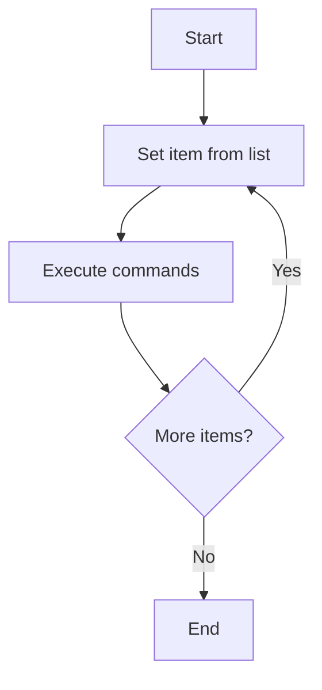
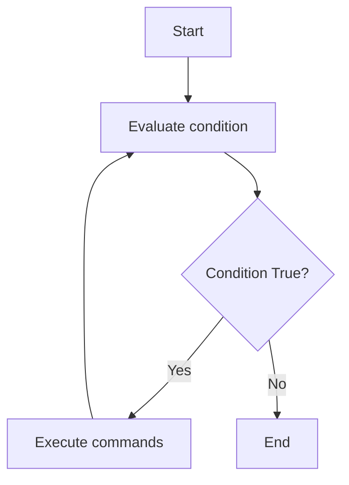

---

title: "Loop in the Bash"
description: "A comprehensive guide to loops in Bash including for, while, until, and loop control statements with syntax, examples, and best practices for efficient scripting."
keywords:
- For Loop Bash
- While Loop Bash
- Until Loop Bash
- Bash Loop Syntax
- Bash Script Loop Examples
- Bash Nested Loops
- Bash Loop File Reading
- Bash Loop Command Output
- Bash Loop Over Array
- Bash C-style Loop
- Bash Break Statement
- Bash Continue Statement
- Bash Exit in Loop
- Bash Loop Tips
- Bash Best Practices
- Looping in Shell Scripts
- Shell Scripting Loops
- Unix Bash Loops
- Bash Loop Error Handling
- Bash Loop Pitfalls
- Bash Loop Control Flow
- bash until loop example
- loop over files bash
- loop through lines bash
- performance tips bash loops
- advanced bash scripting
- conditional loops bash
- infinite loop bash
- shell script loop techniques
- loop counter bash
- Bash script automation
- Bash loop efficiency
- shell script tutorial
- beginner bash scripting
---
import AdBanner from '@site/src/components/AdBanner';
import Tabs from '@theme/Tabs';
import TabItem from '@theme/TabItem';

# Loops in Bash

Loops are fundamental in any programming or scripting language, `allowing repetitive` tasks to be automated efficiently. In Bash, loops help in `iterating over files`, command outputs, ranges, and more. This guide covers all major loop types, `control statements`, and `advanced patterns` to make you proficient in Bash scripting.

<div style={{ position: 'relative', paddingBottom: '56.25%', height: 0, overflow: 'hidden', marginTop: '20px' }}>
  <iframe
    src="https://www.youtube.com/embed/0gCcMHeD8d4"
    title="MakeFile tutorial"
    style={{ position: 'absolute', top: 0, left: 0, width: '100%', height: '100%' }}
    frameBorder="0"
    allow="accelerometer; autoplay; clipboard-write; encrypted-media; gyroscope; picture-in-picture; web-share"
    allowFullScreen
  />
</div>


<div>
  <AdBanner />
</div>

## Table of Contents: Loops in Bash

1. [Introduction to Loops](#1-introduction-to-loops)
2. [For Loop](#2-for-loop)
   * Basic Syntax
   * Looping Through a List
   * C-style For Loop
3. [While Loop](#3-while-loop)
   * Basic Syntax
   * Reading Input with While
4. [Until Loop](#4-until-loop)
5. [Loop Control Statements](#5-loop-control-statements)
   * [break](#51-break)
   * [continue](#52-continue)
   * [exit](#53-exit)
6. [Best Practices](#6-best-practices)
7. [Conclusion](#7-conclusion)
8. [More Articles](#8-more-articles)
9. [References](#9-references)


<div>
    <AdBanner />
</div>


### 1. Introduction to Loops


Loops allow you to execute a block of code repeatedly under certain conditions. 
Bash supports multiple loop types, and each one is suited for different scenarios:

* **`for` loop** – Iterate over a list of items.
* **`while` loop** – Run a command block as long as a condition is true.
* **`until` loop** – Run a command block until a condition becomes true.

***Loop Control Flow Diagram***

Below is a **flowchart** to visualize how loops work in Bash:
<Tabs>
  <TabItem value="for-loop" label="For Loop">


<details>
<summary> **Flowchart Explanation: `for` Loop** </summary>

This flowchart represents the logic of a `for` loop in Bash or similar scripting languages.

**Step-by-Step Breakdown**

1. **Start**  
   The loop begins execution.

2. **Set item from list**  
   The loop selects the next item from a predefined list or range.  
   In Bash, this could look like:
   ```python
   for item in list
   ```

3. **Execute commands**  
   Executes the commands defined inside the loop body.
   ```python
   do
     # your commands
   ```

4. **More items?**  
   Checks if there are more items left in the list to process.

5. **Yes → Loop continues**  
   If there are more items, it goes back to pick the next item.

6. **No → End**  
   If no items are left, the loop ends and control moves forward.

**Sample Bash Code**

```python
for file in *.txt
do
  echo "Processing $file"
done
```

This script loops over all `.txt` files and echoes a message for each.
</details>
  </TabItem>

  <TabItem value="while-loop" label="While Loop">



<details>
<summary> **Flowchart Explanation: `while loop` Explanation** </summary>

**Flowchart Explanation: `while` Loop**

This flowchart illustrates the logic of a `while` loop in Bash or similar scripting languages.

**Step-by-Step Breakdown**

1. **Start**  
   The loop begins execution.

2. **Evaluate condition**  
   Before each iteration, the loop checks whether a specified condition is true.

3. **Condition True?**  
   This is a decision point:
   - If **yes**, the loop proceeds to execute the commands.
   - If **no**, the loop ends.

4. **Execute commands**  
   If the condition is true, the loop executes the commands inside its body.

5. **Loop back**  
   After executing the commands, control returns to evaluate the condition again.

6. **End**  
   When the condition becomes false, the loop terminates and execution continues after the loop.

**Sample Bash Code**

```python
while [ $count -lt 5 ]
do
  echo "Count is $count"
  count=$((count + 1))
done
```

This script prints the count until it reaches 5, incrementing it in each loop iteration.

</details>


  </TabItem>

  <TabItem value="until-loop" label="Until Loop">


<details>
<summary> **Flowchart Explanation: `until` Loop** </summary>

**Flowchart Explanation: `until` Loop**

This flowchart illustrates the logic of an `until` loop in Bash or similar scripting languages.

**Step-by-Step Breakdown**

1. **Start**  
   The loop begins execution.

2. **Evaluate condition**  
   Before each iteration, the loop checks whether a condition is false.

3. **Condition False?**  
   This is a decision point:
   - If **yes** (the condition is false), the loop proceeds to execute the commands.
   - If **no** (the condition is true), the loop ends.

4. **Execute commands**  
   If the condition is false, the commands inside the loop body are executed.

5. **Loop back**  
   After executing the commands, control returns to evaluate the condition again.

6. **End**  
   When the condition becomes true, the loop terminates and execution continues after the loop.

**Sample Bash Code**

```python
count=0
until [ $count -ge 5 ]
do
  echo "Count is $count"
  count=$((count + 1))
done
```

This script runs the loop until the condition `[ $count -ge 5 ]` becomes true. It prints the count and increments it in each iteration.

</details>

  </TabItem>
</Tabs>

This diagram shows how Bash determines whether to continue or exit a loop.

:::caution Loop Summary

| Loop Type | Condition Check | Loop Continues When | Typical Use Case               |
| --------- | --------------- | ------------------- | ------------------------------ |
| `for`     | List iteration  | More items in list  | Iterating over arguments/files |
| `while`   | Start of loop   | Condition is true   | Waiting or polling             |
| `until`   | Start of loop   | Condition is false  | Retry until successful         |
:::

<div>
  <AdBanner />
</div>


## 2. For Loop

A `for` loop is one of the most commonly used control structures in Bash.
 It allows you to iterate over a list of items or the output of a command and 
 execute a block of code for each item. This makes it useful for performing repetitive tasks such as file processing, numeric ranges, or iterating over command-line arguments.

:::tip
The `for` loop is compact, flexible, and easy to read. It's ideal when you know in advance how many times you want the loop to run or when you need to iterate over a predefined list.
:::

 ***2.1 Basic Syntax***

```python
for var in item1 item2 item3; do
  echo "$var"
done
```
> ***Explanation***
This is a basic `for` loop in Bash, used to iterate over a list of items.

***Syntax Breakdown:***

| Component                      | Description                                                                                                           |
| ------------------------------ | --------------------------------------------------------------------------------------------------------------------- |
| `for var in item1 item2 item3` | Initializes a loop where the variable `var` takes on each value in the list (`item1`, `item2`, `item3`) sequentially. |
| `do ... done`                  | Defines the body of the loop. All commands within this block are executed once for each item.                         |
| `echo "$var"`                  | Prints the current value of `var` to the standard output.                                                             |


:::caution Task
Write a Bash `for` loop that prints the names of all **folders** (directories) in the current directory.
<details>
<summary><strong> Approach </strong></summary>

In Bash, the `for` loop can iterate over a list of items, such as file names. To list only **folders (directories)** in the current directory, we can use:

- A `globbing` pattern like `*/` which matches all entries ending with a `/` typically directories.
- (Optional) A test with `-d` to ensure each item is a directory.
***For Loop Syntax***

```python
for item in */; do
  echo "$item"
done
```
> **with -d**
```python
for item in *; do
  if [ -d "$item" ]; then
    echo "$item"
  fi
done
```
***Expected output***
```python
Documents
Downloads
Projects

```
</details>
:::


***2.2 Looping Through a List***

:::caution Task
Write a Bash `for` loop that performs an action on a list of real-world items (e.g., filenames, services, or config files).

<details>
<summary><strong> Approach </strong></summary>

In Bash, you can define a list using an array and iterate over it using the `${array[@]}` syntax. This is practical for automation scripts involving system administration or file handling.

---

***Iterating Over Filenames***

***For Loop Syntax***

```python
files=("report.txt" "data.csv" "summary.docx")
for file in "${files[@]}"; do
  echo "Processing $file"
done
```

***Expected output***

```python
Processing report.txt
Processing data.csv
Processing summary.docx
```

---

### 💡 Example: Restarting Services

```python
services=("nginx" "mysql" "redis")
for service in "${services[@]}"; do
  systemctl restart "$service"
done
```

***Expected output (silent or success messages)***

```
(restarts services if they are running)
```

---

### 🗃️ Example: Backing Up Config Files

```python
configs=("/etc/hosts" "/etc/fstab" "/etc/passwd")
for config in "${configs[@]}"; do
  cp "$config" ~/backup/
done
```

***Expected output***

```
(copies files to ~/backup directory)
```

</details>
:::

***2.3 C-style For Loop***

```python
for ((i=0; i<5; i++)); do
  echo "Counter: $i"
done
```

<div>
  <AdBanner />
</div>

## 3. While Loop

The `while` loop in Bash executes a block of code **as long as a specified condition is true**. It is commonly used when you do not know in advance how many times a loop should run. It's useful for reading input, waiting for conditions, and handling system monitoring scripts.

:::tip
In Bash, the ``while loop`` is useful for ``iterating as long as a command`` or ```condition evaluates`` to ``true``. It's ideal for tasks like reading input ``line-by-line``, ``waiting for a file to exist``, or ``performing repeated checks`` until a condition changes. 
> Great when the number of iterations isn't known ahead of time.

:::

***3.1 Basic Syntax***

```python
while [ condition ]; do
  # commands
done
```

> ***Explanation***
> This is the standard form of a `while` loop in Bash.

***Syntax Breakdown:***

| Component             | Description                                                                  |
| --------------------- | ---------------------------------------------------------------------------- |
| `while [ condition ]` | Tests a condition. As long as it evaluates to true, the loop continues.      |
| `do ... done`         | Marks the beginning and end of the loop body. Commands go inside this block. |


***Example: Counter from 1 to 5***

```python
counter=1
while [ $counter -le 5 ]; do
  echo "Counter: $counter"
  ((counter++))
done
```

***Expected Output***

```python
Counter: 1
Counter: 2
Counter: 3
Counter: 4
Counter: 5
```

:::caution Task
Write a Bash `while` loop that prints the names of all **folders** (directories) in the current directory.

<details>
<summary><strong> Approach </strong></summary>

We can use the `ls -d */` command to get folder names and process them using `read` in a `while` loop. Here's how:

***While Loop Syntax***

```python
ls -d */ | while read folder; do
  echo "${folder%/}"
done
```

> **Explanation**

* `ls -d */` lists all folders (directories) in the current directory.
* `| while read folder` feeds each folder name into the loop.
* `echo "${folder%/}"` removes the trailing slash for cleaner output.

***Expected Output***

```
Documents
Downloads
Projects
```

</details>
:::


:::caution Task

Write a infinite Bash `while` loop that keep running after waiting for 1 second
<details> 
<summary><strong>Infinite While Loop </strong> </summary>
```python
while true; do
  echo "Running..."
  sleep 1
done
```
</details>
:::

> This loop will run indefinitely until manually stopped (e.g., with `Ctrl+C`).

:::caution Task
Write a Bash `while` loop for reading a file line by line.

<details>
<summary>***3.3 While Loop for File Reading***</summary>

```python
while IFS= read -r line; do
  echo "Line: $line"
done < file.txt
```

> Used for safely reading a file line-by-line.

***Expected Output (example file.txt)***

```
Line: Hello
Line: World
Line: Bash is powerful
```
</details>
:::

<div>
  <AdBanner />
</div>


## 4. Until Loop

The `until` loop in Bash executes a block of code **as long as a specified condition is false**. It is the inverse of a `while` loop. It continues to run the loop **until** the condition becomes true.

***4.1 Basic Syntax***

```python
until [ condition ]; do
  # commands
done
```

> ***Explanation***
> This structure keeps looping **as long as the condition is false**. Once it becomes true, the loop exits.

***Syntax Breakdown:***


| Component             | Description                                                                  |
| --------------------- | ---------------------------------------------------------------------------- |
| `while [ condition ]` | Tests a condition. As long as it evaluates to true, the loop continues.      |
| `do ... done`         | Marks the beginning and end of the loop body. Commands go inside this block. |


:::caution Task
Write a Bash `until` loop that counts from 1 to 5.

<details>
<summary><strong> Approach </strong></summary>

Use a counter that increments each iteration. The loop continues **until** the counter exceeds 5.

***Until Loop Syntax***

```python
counter=1
until [ $counter -gt 5 ]; do
  echo "Counter: $counter"
  ((counter++))
done
```

***Expected Output***

```python
Counter: 1
Counter: 2
Counter: 3
Counter: 4
Counter: 5
```

</details>
:::

:::caution Task
Write a Bash `until` loop that waits until a file named `trigger.txt` appears in the directory.

<details>
<summary><strong> Approach </strong></summary>

Use `-e` to check file existence. Keep checking every 2 seconds until the file is found.

```python
until [ -e "trigger.txt" ]; do
  echo "Waiting for trigger.txt to appear..."
  sleep 2
done

echo "File found!"
```

***Expected Output (repeats until file appears)***

```python
Waiting for trigger.txt to appear...
Waiting for trigger.txt to appear...
File found!
```

</details>
:::


:::caution Task
Write a Bash `until` loop that simulates service status checking until `service_running` variable becomes true.

<details>
<summary><strong> Approach </strong></summary>

Use a fake service status simulation using a variable:

```python
service_running=false

until [ "$service_running" = true ]; do
  echo "Checking service..."
  # Simulate service starting
  sleep 1
  service_running=true
  echo "Service started."
done
```

***Expected Output***

```python
Checking service...
Service started.
```

</details>
:::


## 5. Loop Control Statements

Loop control statements allow you to alter the flow of a loop, such as skipping iterations or exiting early.

<Tabs>

<TabItem value="break" label="break">

***`break` Statement***

The `break` statement immediately exits the loop.

```python
for i in {1..5}; do
  if [ "$i" -eq 3 ]; then
    break
  fi
  echo "Number: $i"
done
```

***Expected Output***

```
Number: 1
Number: 2
```

</TabItem>

<TabItem value="continue" label="continue">

***`continue` Statement***

The `continue` statement skips the rest of the loop for the current iteration and continues with the next iteration.

```python
for i in {1..5}; do
  if [ "$i" -eq 3 ]; then
    continue
  fi
  echo "Number: $i"
done
```

***Expected Output***

```
Number: 1
Number: 2
Number: 4
Number: 5
```

</TabItem>

<TabItem value="exit" label="exit">

***`exit` Statement***

The `exit` command terminates the entire script, not just the loop.

```python
for i in {1..5}; do
  if [ "$i" -eq 3 ]; then
    echo "Critical error at $i"
    exit 1
  fi
  echo "Number: $i"
done
```

***Expected Output***

```
Number: 1
Number: 2
Critical error at 3
```

> The script will stop completely after encountering `exit`.

</TabItem>

</Tabs>


**Summary Table**

| Statement  | Effect                                |
| ---------- | ------------------------------------- |
| `break`    | Exits the loop entirely               |
| `continue` | Skips current iteration and continues |
| `exit`     | Stops the entire script immediately   |


## 6. Best Practices

<details>
<summary><strong>Explanation: Why use Until Loop?</strong></summary>

`until` is the opposite of `while`. It runs until the condition becomes true. It’s useful when you want to retry until success.

</details>

<details>
<summary><strong>Comparison: for vs while vs until</strong></summary>

| Feature       | for           | while             | until       |
| ------------- | ------------- | ----------------- | ----------- |
| Iterates over | Lists, ranges | Conditional       | Conditional |
| Stops on      | End of list   | False             | True        |
| Usage         | More common   | For dynamic input | For retries |

</details>

<details>
<summary><strong>Best Practice Tips</strong></summary>

* Quote variables: `"$var"`
* Always check input files exist
* Avoid infinite loops unless necessary

</details>

## 7. Conclusion

Loops are essential in Bash scripting, enabling automation of repetitive tasks. By mastering each loop type, control statements, and safe practices, you can write robust and maintainable scripts.

:::caution What’s Next

* Dive deeper with [Advanced Bash Scripting Guide](https://tldp.org/LDP/abs/html/)
* Try building real-world cron jobs
* Integrate loops with conditionals and functions
:::

## 8. More Articles

<Tabs>
  <TabItem value="docs" label="📚 Documentation">
             - [CompilerSutra Home](https://compilersutra.com)
                - [CompilerSutra Homepage (Alt)](https://compilersutra.com/)
                - [Getting Started Guide](https://compilersutra.com/get-started)
                - [Newsletter Signup](https://compilersutra.com/newsletter)
                - [Skip to Content (Accessibility)](https://compilersutra.com#__docusaurus_skipToContent_fallback)


  </TabItem>

  <TabItem value="tutorials" label="📖 Tutorials & Guides">

        - [AI Documentation](https://compilersutra.com/docs/Ai)
        - [DSA Overview](https://compilersutra.com/docs/DSA/)
        - [DSA Detailed Guide](https://compilersutra.com/docs/DSA/DSA)
        - [MLIR Introduction](https://compilersutra.com/docs/MLIR/intro)
        - [TVM for Beginners](https://compilersutra.com/docs/tvm-for-beginners)
        - [Python Tutorial](https://compilersutra.com/docs/python/python_tutorial)
        - [C++ Tutorial](https://compilersutra.com/docs/c++/CppTutorial)
        - [C++ Main File Explained](https://compilersutra.com/docs/c++/c++_main_file)
        - [Compiler Design Basics](https://compilersutra.com/docs/compilers/compiler)
        - [OpenCL for GPU Programming](https://compilersutra.com/docs/gpu/opencl)
        - [LLVM Introduction](https://compilersutra.com/docs/llvm/intro-to-llvm)
        - [Introduction to Linux](https://compilersutra.com/docs/linux/intro_to_linux)

  </TabItem>

  <TabItem value="assessments" label="📝 Assessments">

        - [C++ MCQs](https://compilersutra.com/docs/mcq/cpp_mcqs)
        - [C++ Interview MCQs](https://compilersutra.com/docs/mcq/interview_question/cpp_interview_mcqs)

  </TabItem>

  <TabItem value="projects" label="🛠️ Projects">

            - [Project Documentation](https://compilersutra.com/docs/Project)
            - [Project Index](https://compilersutra.com/docs/project/)
            - [Graphics Pipeline Overview](https://compilersutra.com/docs/The_Graphic_Rendering_Pipeline)
            - [Graphic Rendering Pipeline (Alt)](https://compilersutra.com/docs/the_graphic_rendering_pipeline/)

  </TabItem>

  <TabItem value="resources" label="🌍 External Resources">

            - [LLVM Official Docs](https://llvm.org/docs/)
            - [Ask Any Question On Quora](https://compilersutra.quora.com)
            - [GitHub: FixIt Project](https://github.com/aabhinavg1/FixIt)
            - [GitHub Sponsors Page](https://github.com/sponsors/aabhinavg1)

  </TabItem>

  <TabItem value="social" label="📣 Social Media">

    - [🐦 Twitter - CompilerSutra](https://twitter.com/CompilerSutra)  
    - [💼 LinkedIn - Abhinav](https://www.linkedin.com/in/abhinavcompilerllvm/)  
    - [📺 YouTube - CompilerSutra](https://www.youtube.com/@compilersutra)  
    - [📘 Facebook - CompilerSutra](https://www.facebook.com/profile.php?id=61577245012547)  
    - [📝 Quora - CompilerSutra](https://compilersutra.quora.com/)  


  </TabItem>
</Tabs>


<div>
    <AdBanner />
</div>

## 9. References

<Tabs>

<TabItem value="resource1" label="1. GNU Bash Manual">

### 🔗 [GNU Bash Reference Manual](https://www.gnu.org/software/bash/manual/bash.html)

**Summary**:
The official and comprehensive manual covering all built-in Bash features.

**Details**:

* Syntax, parameter expansion, quoting, and built-in commands
* Useful for advanced script debugging and POSIX compliance
* A must-read for production-level Bash scripting

</TabItem>

<TabItem value="resource2" label="2. TLDP Advanced Bash Guide">

### 🔗 [Advanced Bash-Scripting Guide – TLDP](https://tldp.org/LDP/abs/html/)

**Summary**:
Community-driven detailed guide ideal for intermediate to advanced users.

**Details**:

* Covers practical examples and edge cases
* Includes chapters on I/O, arrays, and script structuring
* Frequently updated with real-world examples

</TabItem>

<TabItem value="resource3" label="3. ShellCheck Tool">

### 🔗 [ShellCheck – Bash Script Linter](https://www.shellcheck.net/)

**Summary**:
A powerful static analysis tool for Bash scripts.

**Details**:

* Detects syntax errors, quoting issues, and stylistic bugs
* Offers suggestions with explanations
* Can be used in CI pipelines or locally via CLI

</TabItem>

<TabItem value="resource4" label="4. Devhints Bash Cheatsheet">

### 🔗 [Bash Cheatsheet – Devhints](https://devhints.io/bash)

**Summary**:
A quick reference sheet for commonly used Bash commands and patterns.

**Details**:

* Handy for day-to-day usage
* Great for beginners who want to avoid memorizing syntax
* Includes redirections, arrays, loops, conditionals, and more

</TabItem>

</Tabs>