import AdBanner from '@site/src/components/AdBanner';
import Tabs from '@theme/Tabs';
import TabItem from '@theme/TabItem';
import EzoicAd from '@site/src/components/ezoic_add';

<EzoicAd id={101} />


# Markdown Link Checker in Bash

Writing technical documentation is one **thing keeping** it ***error-free*** is another. Broken links in your `README.md`, guides, or blog posts undermine quality and user trust. This guide will help you build a **simple, portable Bash script** to ***recursively scan and validate all Markdown files in your project*** no external dependencies beyond Node.js and `markdown-link-check`.

<div style={{ position: 'relative', paddingBottom: '56.25%', height: 0, overflow: 'hidden', marginTop: '20px' }}>
  <iframe
    src="https://www.youtube.com/embed/AP672uiTh_I"
    title="MakeFile tutorial"
    style={{ position: 'absolute', top: 0, left: 0, width: '100%', height: '100%' }}
    frameBorder="0"
    allow="accelerometer; autoplay; clipboard-write; encrypted-media; gyroscope; picture-in-picture; web-share"
    allowFullScreen
  />
</div>

<EzoicAd id={102} />


## Table of Contents

- [Problem Statement](#problem-statement)
- [How We Will Solve it](#how-we-will-solve-this)
  - [a.Bash for automation and setup](#bash-for-automation-and-setup)
  - [b.Python for parsing and Decision Making](#python-for-parsing-and-decision-making)
  - [markdown link checker ](#markdown-link-checker)
  - [think bash will handle](#think-bash-will-handle)
  - [think python will handle](#think-python-will-handle)
- [What You Should Know Before Jumping In](#what-you-should-know-before-jumping-in)  
  - [Bash Essentials](#bash-essentials)  
    - [Basic Bash Scripting Syntax](#basic-of-the-bash-script)  
    - [Writing Executable Bash Scripts (chmod +x)](#writting-executable-in-the-bash)  
    - [Taking CLI Arguments in Bash ($1, $2, etc.)](#taking-cli-arguments)  
    - [Storing Output in a Text File (> and >>)](#storing-output)  
    - [Installing CLI Tools in Bash (npm install, apt-get, etc.)](#installing-cli-tools-in-bash-npm-install-apt-get-etc)  

  - [Python Essentials](#python-essentials)  
    - [Python Basics Required](#python-basics-required)  
    - [Reading and Parsing Text Files in Python](#reading-and-parsing-text-files)  
    - [Popular python library](#popular-python-libraries-for-data-and-analysis) 
 - [Next](#what-next)
 - [More Article](#more-articles)

 

<EzoicAd id={103} />


## Problem Statement

In modern `software projects`,` documentation` is a `first-class` citizen but even well-written docs can lose credibility if they `contain broken` or `outdated links`. This is especially true for Markdown-based documentation (`.md` files), which is used widely across GitHub projects, technical blogs, open-source libraries, and internal wikis.

Yet, link validation is often neglected until after deployment or user complaints.

:::tip `The Core Challenge`
>> ***How can we build an automated, repeatable, and portable system to validate all links within Markdown files without relying on heavyweight tooling or complex setups?***

:::important solution robust solution should meet the following criteria:
:::caution What should they have?
* **Recursive**: Traverse all nested folders and check every `.md` file.
* **Portable**: Work on any Unix-like environment with Bash and Node.js no external packages like `find`, `shopt`, or custom tools.
* **CI-Friendly**: Easily integrate into CI pipelines like GitHub Actions, GitLab CI, or Jenkins.
* **Developer-Readable**: Clean logic using simple Bash constructs (`for`, `if`, function).
* **Flexible**: Allow configuration (e.g., ignore certain links or domains like `mailto:` or `localhost`).
:::


## **How We Will Solve This**

To solve the problem of checking and validating all links in a Markdown file, we will use a **combination of Bash and Python**, leveraging the strengths of each.

### **Bash for Automation and Setup**

Bash will handle the following:

* **Install Required Tools**: Ensure `markdown-link-check` or any other CLI is installed.
* **Run the Link Checker**: Execute the CLI tool on the given Markdown file.
* **Generate a Report**: Save the output of the link checker to a structured file (e.g., `links_report.txt`).
* **Invoke Python**: Call the Python script with the report as input for further analysis.

### **Python for Parsing and Decision-Making**

Python will be used to:

* **Parse the Link Report**: Read the raw report and extract broken and valid links.
* **Validate and Summarize**: Filter, count, and optionally display summary results.
* **Exit with Code**: Return `0` if all links are valid or `1` if broken links are found (for CI/CD to catch).


:::caution `By combining Bash and Python`:

* Bash ensures `automation` and `environment` readiness.
* Python `provides clarity`, `power`, and `extensibility` in logic and `reporting`.
* This approach is scalable and CI/CD-friendly.
:::


<Tabs>
<TabItem value="Complete Digram" label="Markdown Link Checker">

## Markdown Link Checker

- **Bash part:** Install tool → run check → generate report → invoke Python.  
- **Python part:** Parse report → validate links → summarize → exit with code.


**Working**
> ***The tool works in two phases using `Bash `and `Python`:***

**Bash Part:**
Sets up the environment, runs a Markdown link checker, saves the results to a report, and passes control to Python.

**Python Part:**
Reads the report, analyzes which links are valid or broken, summarizes the result, and exits with a status code (for CI/CD or automation purposes).


</TabItem>
<TabItem value = "Part 1" label = "think bash will handle">

## think bash will handle

```mermaid
flowchart TD
  A([Start Bash Script]) --> B(["Check if  <br/>markdown-link-check <br/> is Installed"])
  B --> C{{Installed?}}
  C -- No --> D([Install Using npm])
  C -- Yes --> E([Proceed])
  D --> E
  E --> F([Parse CLI Arguments])
  F --> G(["Run markdown-link-check <br/> .md File"])
  G --> H(["Save Output to Temporary <br/ > .txt  File"])
  H --> I([Pass .txt File to Python Script])
  I --> Z([➡️ Handoff to Python])

  %% Style
  classDef process fill:#007bff,color:#fff,stroke:#004a99;
  classDef decision fill:#ffc107,color:#000,stroke:#b58b00,font-weight:bold;
  classDef startNode fill:#28a745,color:#fff,stroke:#1f512b,font-weight:bold;
  classDef endNode fill:#6f42c1,color:#fff,stroke:#3b1c85,font-weight:bold;

  class A startNode;
  class Z endNode;
  class C decision;
  class B,D,E,F,G,H,I process;

```


<details>
<summary><strong>Bash Script Responsibilities (Complete Breakdown)</strong></summary>

:::tip `The Bash part of the pipeline acts as the **initial orchestrator**. It sets up the environment, runs the core link checking tool, and invokes the Python script for detailed processing.`
:::


**1. Tool Check and Installation**

* **Objective**: Ensure the required CLI tool `markdown-link-check` is available.

* **Action**:

  * Use `which markdown-link-check` or `command -v` to check if it's already installed.
  * If not found, automatically install it using:

    ```rust
    npm install -g markdown-link-check
    ```

* **Why**: This makes the script portable and removes the need for manual setup.


**2. Run Link Checker Tool**

* **Objective**: Scan the input `.md` file(s) for broken or unreachable links.

* **Action**:

  * Run:

    ```bash
    markdown-link-check "$input_file" > links_report.txt
    ```
  * This command checks all hyperlinks and outputs their status.

* **Result**: A raw report (`links_report.txt`) containing all link statuses is generated.

**3. Save Report**

* **Objective**: Persist the link checker output.
* **Action**:

  * Capture the result of the previous step and store it in `links_report.txt`.
  * The format may include:

    ```
    [✓] https://openai.com
    [✗] http://broken-link.example.com
    ```

**4. Invoke Python Script**

* **Objective**: Trigger the Python parser to process the generated report.

* **Action**:

  * Execute:

    ```bash
    python3 parse_links.py links_report.txt
    ```
  * The report file is passed as a command-line argument to the Python script.

:::note why: `Delegates logic-heavy parsing and summarization to Python, keeping the Bash    script lightweight`.
:::

---

**🔧 Summary of Bash Duties**

| **Step**           | **Description**                                            |
| ------------------ | ---------------------------------------------------------- |
| Tool Check         | Verifies if `markdown-link-check` is installed             |
| Install if Missing | Installs the tool via `npm` if it's not available          |
| Run Link Checker   | Executes the check on `.md` files                          |
| Generate Report    | Saves output to `links_report.txt`                         |
| Invoke Python      | Passes the report file to Python for parsing and exit code |

</details>
</TabItem>

<TabItem value = "Part 2" label = "think python will handle">

## think python will handle

```mermaid
flowchart TD
  A([Start Python Script]) --> B([Parse CLI Arguments])
  B --> C{{Valid Input Directory?}}
  C -- No --> D([Display Usage Help]) --> Z([❌ Exit 1])
  
  C -- Yes --> E([Initialize Reporting System])
  E --> F([Read .txt Output from Bash Script])
  F --> G([Parse & Analyze Output])
  
  G --> H([Generate Summary Report])
  H --> I{{Any Critical Errors?}}
  I -- Yes --> J([Set Exit Code 2])
  I -- No --> K{{Any Warnings?}}
  K -- Yes --> L([Set Exit Code 1])
  K -- No --> M([Set Exit Code 0])
  
  J --> N([❗ Output Error Report])
  L --> O(["⚠️ Output Warning <br/> Summary"])
  M --> P(["✅ Clean Bill of<br/> Health"])
  
  N --> Q([Exit])
  O --> Q
  P --> Q

  %% Style
  classDef process fill:#007bff,color:#fff,stroke:#004a99;
  classDef decision fill:#ffc107,color:#000,stroke:#b58b00,font-weight:bold;
  classDef startNode fill:#28a745,color:#fff,stroke:#1f512b,font-weight:bold;
  classDef endNode fill:#6f42c1,color:#fff,stroke:#3b1c85,font-weight:bold;

  class A startNode;
  class Z,Q endNode;
  class C,I,K decision;
  class B,D,E,F,G,H,J,L,M,N,O,P process;
  ```
<details>
<summary><strong>Python Script Responsibilities (Complete Breakdown)</strong></summary>

**What Python Will Handle**

Once the Bash script has invoked the Python script (after generating `links_report.txt`), the Python logic takes over. Here's a breakdown of what Python is responsible for:

**1. Parse the Report**

* **Input**: The link report file generated by the Bash script.
* **Action**: Open and read the file contents.
* **Goal**: Extract relevant information like:

  * List of all links
  * Status of each link (valid or broken)
  * Location or context of the link (optional)

**2. Validate Links (Optional Re-checking)**

* **Input**: List of links parsed from the report.
* **Action**: Optionally, Python can re-check the links using its own logic (e.g., using `requests` to make HTTP calls).
* **Goal**: Double-check link status or handle edge cases that the Bash tool missed.

**3. Summarize Results**

* **Action**:

  * Count total links, valid links, and broken links.
  * Group broken links by error (e.g., 404, timeout).
  * Format the summary for clear readability.
* **Goal**: Generate a concise summary for logging, CI pipelines, or user feedback.

**4. Exit with Code**

* **Logic**:

  * If all links are valid → `exit(0)`
  * If any broken links are found → `exit(1)`
* **Purpose**:

  * Integration with CI/CD systems (like GitHub Actions or GitLab CI) to **fail builds** on broken links.


:::tip Why Python?

* Better suited for parsing and logic-heavy tasks.
* Easier to maintain and extend with conditions, filtering, or JSON support.
* Can easily integrate with APIs or databases if needed later.
:::
</details>
</TabItem>

</Tabs>
---

:::important **How the System Works (Bash + Python Dependency)**

This tool is built using **Bash** and **Python**, each handling separate responsibilities in a two-stage workflow.

* **Bash** acts as the initializer — it validates input, locates `.md` files, checks links, and writes raw results to a text file.
* **Python** is then used to parse the text output (`validate_output.txt`) and generate a more readable Excel report for human-friendly analysis.
:::

<div>
    <AdBanner />
</div>

## What You Should Know Before Jumping In

<Tabs>
<TabItem value="#bash-essentials" label=" Thinks to know in bash bash-essentials">

 ###### bash-essentials


 <Tabs>

 <TabItem value="#basic bash script " label="basic-bash-scripting-syntax">

###### Basic of The bash script
:::tip learn from

| Topic                                  | Description                                      | Link |
|----------------------------------------|--------------------------------------------------|------|
| 🧾 Basic Bash Script Example           | Get started with a simple shell script example   | [basic_Script](https://www.compilersutra.com/docs/linux/intro_to_linux) |
| 📂 Basic of Linux                      | Understand the foundation of Linux systems       | [basic_of_linux](https://www.compilersutra.com/docs/linux/basic_of_linux) |
| ⚙️ What is `.bashrc`                   | Learn about the `.bashrc` file and its purpose   | [What_is_bashrc](https://www.compilersutra.com/docs/linux/What_is_bashrc) |
| 🌍 Environment Variables in Linux      | Explore how environment variables work in Bash   | [Environment_variable_in_linux](https://www.compilersutra.com/docs/linux/Environment_variable_in_linux) |
| 🧠 Declaring Variables in Bash         | Understand how to declare and use variables      | [Declaring_Variable_In_bash](https://www.compilersutra.com/docs/linux/Declaring_Variable_In_bash) |
| 🔁 If-Else in Bash                     | Write conditional logic using `if` and `else`    | [if_else_in_bash](https://www.compilersutra.com/docs/linux/if_else_in_bash) |
| 🔄 Loops in Bash                       | Learn to automate repetition with loops          | [loop_in_bash](https://www.compilersutra.com/docs/linux/loop_in_bash) |
:::

</TabItem>
<TabItem value="writing exectuable bash " label="writing-executable-bash-scripts-chmod-x">

 ######  Writting executable in the Bash
 :::tip learn more
 | Topic                                  | Description                                      | Link |
|----------------------------------------|--------------------------------------------------|------|
| 🧾 Basic Bash Script Example           | Get started with a simple shell script example   | [basic_Script](https://www.compilersutra.com/docs/linux/intro_to_linux) |
| 📂 Basic of Linux                      | Understand the foundation of Linux systems       | [basic_of_linux](https://www.compilersutra.com/docs/linux/basic_of_linux) |
| ⚙️ What is `.bashrc`                   | Learn about the `.bashrc` file and its purpose   | [What_is_bashrc](https://www.compilersutra.com/docs/linux/What_is_bashrc) |
| 🌍 Environment Variables in Linux      | Explore how environment variables work in Bash   | [Environment_variable_in_linux](https://www.compilersutra.com/docs/linux/Environment_variable_in_linux) |
| 🧠 Declaring Variables in Bash         | Understand how to declare and use variables      | [Declaring_Variable_In_bash](https://www.compilersutra.com/docs/linux/Declaring_Variable_In_bash) |
| 🔁 If-Else in Bash                     | Write conditional logic using `if` and `else`    | [if_else_in_bash](https://www.compilersutra.com/docs/linux/if_else_in_bash) |
| 🔄 Loops in Bash                       | Learn to automate repetition with loops          | [loop_in_bash](https://www.compilersutra.com/docs/linux/loop_in_bash) |
:::
</TabItem>

<TabItem value="take cli" label="#taking-cli-arguments-in-bash-1-2-eth">

###### taking-cli-arguments

**How to Take Command Line Arguments in Bash**

Bash scripts can accept input from the command line using **positional parameters** like `$1`, `$2`, etc.

:::important
***This is useful when you want to pass values ``directly while running the script`` like filenames, URLs, numbers, or other user input.***
:::

**✅ Basic Example**

```python
#!/bin/bash

echo "First argument is: $1"
echo "Second argument is: $2"
````

**📌 Save this as `args.sh`, then run:**

```rust
chmod +x args.sh
./args.sh apple banana
```

**🖨️ Output:**

```
First argument is: apple
Second argument is: banana
```

---
<details>
<summary> **📘 Useful Special Variables** </summary>

| Variable | Description                      |
| -------- | -------------------------------- |
| `$0`     | The name of the script           |
| `$1`     | First argument                   |
| `$2`     | Second argument                  |
| `$#`     | Total number of arguments passed |
| `$@`     | All arguments as a list          |
| `$*`     | All arguments as a single string |

</details>

**🔁 Loop Through Arguments**

```python
#!/bin/bash

echo "Total args: $#"
for arg in "$@"
do
    echo "Arg: $arg"
done
```

**▶️ Run:**

```python
./args.sh red green blue
```

**🖨️ Output:**

```
Total args: 3
Arg: red
Arg: green
Arg: blue
```

---

:::tip **⚠️ Tips**

* Always quote `"$@"` to preserve spaces in arguments.
* Use conditionals (`if [ $# -eq 0 ]; then`) to check if arguments are passed.
* Use `shift` to loop and discard processed arguments.
:::
---

**📚 Related Reading**

* [Basic of Linux – CompilerSutra](https://www.compilersutra.com/docs/linux/basic_of_linux)
* [Declaring Variables in Bash](https://www.compilersutra.com/docs/linux/Declaring_Variable_In_bash)
* [If-Else in Bash](https://www.compilersutra.com/docs/linux/if_else_in_bash)

</TabItem>

<TabItem value="storing cli" label="#storing-output-in-a-text-file--and-h">

###### storing output


**🧾 Redirecting Output in Bash: stdout, stderr, and More**

Bash allows you to redirect output streams — **standard output (stdout)**, **standard error (stderr)**, or both — to files, other commands, or nowhere.

**✅ Redirect stdout to a file**

```rust
echo "This will go to a file" > output.txt
```

* Overwrites `output.txt`. Use `>>` to append instead.

**✅ Redirect stderr to a file**

```rust
ls nonexistentfile 2> error.txt
```

* `2>` redirects stderr (file descriptor 2) to `error.txt`.

**✅ Redirect both stdout and stderr**

```rust
command > all_output.txt 2>&1
```

* Redirects stderr (2) to wherever stdout (1) is going.

**✅ Suppress all output**

```rust
command > /dev/null 2>&1
```

* Silently runs the command without showing any output or errors.

---

<details>
<summary> **📘 Common Redirection Symbols** </summary>

| Symbol      | Meaning                                   |
| ----------- | ----------------------------------------- |
| `>`         | Redirect stdout (overwrite)               |
| `>>`        | Redirect stdout (append)                  |
| `2>`        | Redirect stderr                           |
| `&>`        | Redirect both stdout and stderr (Bash 4+) |
| `2>&1`      | Redirect stderr to stdout                 |
| `/dev/null` | Discard output                            |

</details>

**📌 Combine Redirection with Pipes**

```rust
command 2>&1 | tee log.txt
```

* Sends both stdout and stderr to `tee`, which saves to `log.txt` and prints on screen.

:::tip **⚠️ Tips**

* Always use `2>&1` **after** redirecting stdout.
* Use `tee` to **save and view** output at the same time.
* Redirecting to `/dev/null` is useful for scripts running silently in the background.
  :::


</TabItem>
</Tabs>
</TabItem> 

<TabItem value="#python essential" label=" Thinks to know in python python-essentials">

 ### Python Essential

 <Tabs>

<TabItem value="#python-basics" label="Python Basics Required">

###### Python Basics Required

:::tip Learn the Basics
| Topic                                | Description                                        | Link |
|--------------------------------------|----------------------------------------------------|------|
| 🐍 Python Syntax                     | Basic syntax to get started with Python            | [Python Syntax](https://www.compilersutra.com/docs/python/python_syntax) |
| 🔢 Data Types & Variables            | Understand Python data types and variables         | [Data Types](https://www.compilersutra.com/docs/python/data_types) |
| 🔄 Loops and Conditionals            | How to use `if`, `for`, and `while` loops          | [Control Flow](https://www.compilersutra.com/docs/python/control_flow) |
| 🧰 Functions and Modules             | Define reusable functions and import modules       | [Functions in Python](https://www.compilersutra.com/docs/python/functions) |
| 📦 Installing Packages               | Use `pip` to install external libraries             | [Installing Libraries](https://www.compilersutra.com/docs/python/pip_install) |
:::

</TabItem>


<TabItem value="#reading-files" label="Reading and Parsing Text Files in Python">

###### Reading and Parsing Text Files

:::tip Learn more
| Topic                            | Description                                         | Link |
|----------------------------------|-----------------------------------------------------|------|
| 📖 Reading Files                 | Use `open()` and `readlines()` to read files        | [Read Files](https://www.compilersutra.com/docs/python/read_files) |
| ✂️ String Manipulation           | Clean and split strings for processing              | [String Ops](https://www.compilersutra.com/docs/python/string_operations) |
| 📊 Parsing CSV/Text              | Read structured files like CSVs using Python        | [CSV Parsing](https://www.compilersutra.com/docs/python/csv_parsing) |
| 🔄 Looping Through Lines         | Process each line using `for line in file`          | [Looping Lines](https://www.compilersutra.com/docs/python/loop_lines) |
:::

**📌 Example Code:**

```python
with open("data.txt", "r") as file:
    for line in file:
        print(line.strip())
````

</TabItem>

<TabItem value="#popular-libraries" label="Popular Python Libraries">

###### Popular Python Libraries for Data and Analysis

:::tip Commonly Used Libraries
* `pandas`
* `numpy`
* `matplotlib`
* `seaborn`
* `scikit-learn`
:::

**📌 Example: Load CSV using `pandas`**

```python
import pandas as pd

df = pd.read_csv("data.csv")
print(df.head())
```

**📌 Example: Plot using `matplotlib`**

```python
import matplotlib.pyplot as plt

x = [1, 2, 3]
y = [4, 5, 6]

plt.plot(x, y)
plt.title("Simple Line Plot")
plt.xlabel("X-axis")
plt.ylabel("Y-axis")
plt.show()
```

</TabItem>

</Tabs>

</TabItem> 

</Tabs>

<div>
    <AdBanner />
</div>

## What Next 
We’ve laid the groundwork for a ***portable, automated Markdown link checker*** by:  
 Defining the ***problem*** (broken links in docs).  
 Designing a ***Bash + Python solution*** (lightweight + powerful).  
 Covering ***prerequisites*** (Bash basics, Python parsing).  

***In the next article***, we’ll dive into ***hands-on implementation***:  
🔧 **Writing the Bash script**:  
   - Installing `markdown-link-check`.  
   - Recursively scanning `.md` files.  
   - Generating a report.  
 **Building the Python parser**:  
   - Analyzing link statuses (200 vs. 404).  
   - Exporting clean reports (CSV/JSON).  
 **CI/CD Integration**:  
   - Automating checks in GitHub Actions.  

**Stay tuned!** Want alerts when Part 2 drops? **Star this repo** ⭐ or subscribe [here](#).  

## More Articles

<Tabs>
  <TabItem value="docs" label="📚 Documentation">
             - [CompilerSutra Home](https://compilersutra.com)
                - [CompilerSutra Homepage (Alt)](https://compilersutra.com/)
                - [Getting Started Guide](https://compilersutra.com/get-started)
                - [Newsletter Signup](https://compilersutra.com/newsletter)
                - [Skip to Content (Accessibility)](https://compilersutra.com#__docusaurus_skipToContent_fallback)


  </TabItem>

  <TabItem value="tutorials" label="📖 Tutorials & Guides">

        - [AI Documentation](https://compilersutra.com/docs/Ai)
        - [DSA Overview](https://compilersutra.com/docs/DSA/)
        - [DSA Detailed Guide](https://compilersutra.com/docs/DSA/DSA)
        - [MLIR Introduction](https://compilersutra.com/docs/MLIR/intro)
        - [TVM for Beginners](https://compilersutra.com/docs/tvm-for-beginners)
        - [Python Tutorial](https://compilersutra.com/docs/python/python_tutorial)
        - [C++ Tutorial](https://compilersutra.com/docs/c++/CppTutorial)
        - [C++ Main File Explained](https://compilersutra.com/docs/c++/c++_main_file)
        - [Compiler Design Basics](https://compilersutra.com/docs/compilers/compiler)
        - [OpenCL for GPU Programming](https://compilersutra.com/docs/gpu/opencl)
        - [LLVM Introduction](https://compilersutra.com/docs/llvm/intro-to-llvm)
        - [Introduction to Linux](https://compilersutra.com/docs/linux/intro_to_linux)

  </TabItem>

  <TabItem value="assessments" label="📝 Assessments">

        - [C++ MCQs](https://compilersutra.com/docs/mcq/cpp_mcqs)
        - [C++ Interview MCQs](https://compilersutra.com/docs/mcq/interview_question/cpp_interview_mcqs)

  </TabItem>

  <TabItem value="projects" label="🛠️ Projects">

            - [Project Documentation](https://compilersutra.com/docs/Project)
            - [Project Index](https://compilersutra.com/docs/project/)
            - [Graphics Pipeline Overview](https://compilersutra.com/docs/The_Graphic_Rendering_Pipeline)
            - [Graphic Rendering Pipeline (Alt)](https://compilersutra.com/docs/the_graphic_rendering_pipeline/)

  </TabItem>

  <TabItem value="resources" label="🌍 External Resources">

            - [LLVM Official Docs](https://llvm.org/docs/)
            - [Ask Any Question On Quora](https://compilersutra.quora.com)
            - [GitHub: FixIt Project](https://github.com/aabhinavg1/FixIt)
            - [GitHub Sponsors Page](https://github.com/sponsors/aabhinavg1)

  </TabItem>

  <TabItem value="Courses" label="📣 Explore Cirriculum">
            - [GPU Programming from non CS to Expert](https://www.compilersutra.com/docs/gpu/gpu_programming/gpu_programming_toc/)
            - [C++ Tutorial](https://www.compilersutra.com/docs/c++/cpp-learning-roadmap)
  </TabItem>
  <TabItem value="social" label="📣 Social Media">

    - [🐦 Twitter - CompilerSutra](https://twitter.com/CompilerSutra)  
    - [💼 LinkedIn - Abhinav](https://www.linkedin.com/in/abhinavcompilerllvm/)  
    - [📺 YouTube - CompilerSutra](https://www.youtube.com/@compilersutra)  
    - [📘 Facebook - CompilerSutra](https://www.facebook.com/profile.php?id=61577245012547)  
    - [📝 Quora - CompilerSutra](https://compilersutra.quora.com/)  


  </TabItem>
</Tabs>


<EzoicAd id={104} />


