import AdBanner from '@site/src/components/AdBanner';
import Tabs from '@theme/Tabs';
import TabItem from '@theme/TabItem';
import { ComicQA } from '../../../mcq/interview_question/Question_comics';


# Static Single Assignment (SSA) Deep Dive

In the [previous article](https://www.compilersutra.com/docs/llvm/llvm_Curriculum/level0/Static_Single_Assignment/), we explored the foundations of Static Single Assignment (SSA): 
>>
            >  -  ***what it is***, 
            >  -  ***why it exists***  ,and 
            >  -  ***how compilers use it to reason about variable values and control flow***.

We saw how programs are represented as control-flow graphs, how [`φ-functions`](https://pages.cs.wisc.edu/~fischer/cs701.f08/lectures/Lecture23.4up.pdf) merge multiple definitions, and how `SSA enables precise`, `local optimizations` in real compilers like [`LLVM`](https://llvm.org/) and [`GCC`](https://gcc.gnu.org/). That article focused heavily on the mechanics of [SSA](https://www.compilersutra.com/docs/llvm/llvm_Curriculum/level0/Static_Single_Assignment/#1-introduction-the-ubiquity-of-ssa) its construction, variable renaming, live ranges, and the concrete ways it simplifies `def-use` chains.


In the [previous article](https://www.compilersutra.com/docs/llvm/llvm_Curriculum/level0/Static_Single_Assignment/), we also established the foundations of Static Single Assignment (SSA): [why it became then standard](https://www.compilersutra.com/docs/llvm/llvm_Curriculum/level0/Static_Single_Assignment/#1-introduction-the-ubiquity-of-ssa), how programs are modeled as control-flow graphs, [the core problems SSA solves](https://www.compilersutra.com/docs/llvm/llvm_Curriculum/level0/Static_Single_Assignment/#3-the-problem-ssa-solves), and the standard construction and destruction algorithms.

:::caution In modern optimizing compilers,
  The internal representation of a program serves as the foundation for 
 ***analysis and transformation,***
 governing both the expressiveness of ***compiler reasoning*** and the 
 ***practical cost of optimization.***
:::

:::note
>> ***A poor choice of data structure can hide critical information about a program***.

Limiting what the compiler can understand


Two representations, which will be helpful in addressing the issue of poor data structures 
that can hide critical information and make program analysis difficult, 
are [**Static Single Assignment (SSA)**](https://www.cs.utexas.edu/~pingali/CS380C/2010/papers/ssaCytron.pdf) form and the **Control Dependence Graph (CDG)**.  
SSA makes it explicit that is, clearly shows where each value comes from, 
while the CDG captures how program execution depends on control decisions.  
Although developed independently, together they form a strong foundation for many 
modern compiler optimizations.

In the past, SSA and CDG were often seen as hard to construct and too expensive to use in real compilers. 

In this article, we show that these concerns are largely unfounded.

:::tip In this second part,
:::
In this part, we move beyond those fundamentals and take a broader and more structured view of SSA. We begin by revisiting what SSA is and why compilers needed it in the first place, followed by a deeper discussion of why modern compiler IRs are almost universally built around SSA. 

We then look at how compilers functioned before SSA, and walk step by step through how SSA resolves the challenges of value tracking across control flow.

At a high level, we discuss the algorithms used to build SSA, with special attention to the role of φ-nodes in real control-flow scenarios. 

We also examine how SSA is realized in practice by compilers like GCC and LLVM, how its correctness can be verified, and where SSA breaks down and must be rebuilt.

 ***Finally, we explain why SSA continues to dominate modern compiler design and conclude with open problems, research directions, and future work that point beyond today’s SSA-based intermediate representations.***


<Tabs>
  <TabItem value="social" label="📣 Social Media">
    - [🐦 Twitter - CompilerSutra](https://twitter.com/CompilerSutra)
    - [💼 LinkedIn - Abhinav](https://www.linkedin.com/in/abhinavcompilerllvm/)
    - [📺 YouTube - CompilerSutra](https://www.youtube.com/@compilersutra)
    - [💬 Join the CompilerSutra Discord for discussions](https://discord.gg/DXJFhvzz3K)
  </TabItem>

  <TabItem value="contact" label="✉️ Contact Us">
    - Email: [osc@compilersutra.com](mailto:osc@compilersutra.com)
    - Feedback / Queries: Use our mail us for suggestions or issues.
  </TabItem>
</Tabs>


<AdBanner />


###### Static Single Assignment: (Part II)


1. [Revisiting SSA: Motivation Beyond the Definition](#revisiting-ssa-motivation-beyond-the-definition)
2. [How SSA Encode Value Flow ](#how-ssa-encodes-value-flow)
3. [How SSA Makes Value Flow Explicit](#how-ssa-makes-value-flow-explicit)
4. [Challenges Without SSA](#challenges-without-ssa)
5. [SSA and Control Dependence: Complementary Views (SSA + CDG)](#ssa-and-control-dependence)
6. [SSA in Practice: GCC and LLVM](#ssa-in-practice-gcc-and-llvm)


## Revisiting SSA: Motivation Beyond the Definition

As we saw in the [previous article](https://www.compilersutra.com/docs/llvm/llvm_Curriculum/level0/Static_Single_Assignment/), ***SSA is often introduced as a simple rule**: 
                                > ***each variable is assigned exactly once. While this definition is technically correct*** 

It captures only the surface syntax of SSA and does not explain its deeper motivation.

SSA was not invented to impose a stylistic constraint on programs, but to make value flow explicit. 
By ensuring that every value has a single, well-defined definition, SSA transforms implicit 
dataflow previously recovered through complex global analyses into an explicit graph structure.

This explicit representation is what allows modern compilers to reason locally about values. 
Analyses and optimizations that once required expensive, whole-program dataflow iterations can instead be expressed as simple traversals over def–use chains. 

***As a result, optimizations become more scalable, composable, and easier to reason about.***

In this sense, the “single assignment” rule is merely the tip of the iceberg. The real power of SSA lies in how it reshapes the compiler’s internal view of program semantics, enabling the sophisticated optimization pipelines used by modern compilers such as LLVM and GCC.


Let’s see this in action. Consider the simple program:

```cpp
int x = 0;

if (cond) {
    x = 5;
}

int y = x + 1;
````

:::caution  As humans, this is obvious:
:::

>> * `x` starts as `0`
>> * If `cond` is true, `x` becomes `5`
>> * At `y = x + 1`, the value of `x` must be either `0` or `5`


:::caution But for the compiler, 
:::

The value of `x` at `y = x + 1` is **not explicit**. The compiler must answer:

     >   * Which assignment to `x` actually reaches this use?
     >   * Can both assignments reach it, or only one?
     >   * Is one of the assignments redundant?


### How SSA Encodes Value Flow

Without SSA, the compiler must recover this information using [**global dataflow analysis**](https://www.brainkart.com/article/Introduction-to-Global-Dataflow-Analysis_8114/), which can be complex and expensive. With SSA, this information is encoded **directly in the IR**, making the value flow explicit and trivial to track.

In SSA form, every definition of a variable is assigned a **unique name**, and every use of that variable explicitly references the definition it depends on. 

***This eliminates ambiguity***:
 > Instead of the compiler inferring which assignment reaches a use through iterative analysis of all paths, the IR itself clearly shows the relationship between definitions and uses. For example, a variable assigned outside a conditional and reassigned inside it will each have separate names, and a **φ-node** at the merge point explicitly combines the possible values.

Let`s see with an example:

```cpp
int x = 0;

if (cond) {
    x = 5;
}

int y = x + 1;
```

<Tabs>

  <TabItem value="withoutSSA" label="Without SSA">

**Using Global Dataflow Analysis**

Global dataflow analysis is a **technique compilers use to infer information about variables across the entire program**, especially when the same variable can be assigned in multiple places. It answers questions like:

* Which assignments can reach a particular use of a variable?
* Are there any redundant computations that can be eliminated?
* What are the possible values a variable can take at a given point in the program?

**Explanation in this example:**

* `x` is a single variable that can be reassigned.
* At `y = x + 1`, the compiler **cannot immediately tell** whether `x` is `0` or `5`.
* To figure it out, the compiler must perform **global dataflow analysis**:

  * Build the **control-flow graph (CFG)** of the program
  * Track all definitions of `x` along all possible paths
  * Iteratively propagate **reaching definitions** until a fixed point is reached
* This process is **expensive**, especially for programs with multiple variables, nested conditionals, or loops.
* Optimizations based on this information require **additional passes** over the CFG.

</TabItem>

<TabItem value="withSSA" label="With SSA">

**SSA Form of the Code**

In SSA, each variable assignment is given a **unique name**, and every use explicitly references the definition it depends on. This eliminates ambiguity and **encodes value flow directly in the IR**, removing the need for iterative global analysis.

```cpp
x0 = 0
if (cond) {
    x1 = 5
}
x2 = φ(x0, x1)
y0 = x2 + 1
```

**Explanation in this example:**

* `x0` represents the **initial assignment** before the conditional.
* `x1` represents the **assignment inside the conditional**.
* `x2 = φ(x0, x1)` **merges the possible values** of `x` at the join point.
* `y0` directly references `x2`, so the compiler **knows exactly which values can reach this point**.
* No iterative global analysis is needed; all information about value flow is **explicit in the IR**.
* Optimizations like **constant propagation**, **dead code elimination**, and **common subexpression elimination** <br/> can now operate **locally** on this SSA graph, making them faster and easier to reason about.

</TabItem>


  <TabItem value="cfgWithoutSSA" label="CFG Visualization Without SSA">


**Explanation:**

* **Entry → x = 0**: Program starts, `x` initialized to `0`.
* **Cond**: Conditional branch splits control flow:

  * True → `x = 5`
  * False → skip assignment
* **Y = x + 1**: The value of `x` is **ambiguous**  compiler must analyze both paths to know if `x` is `0` or `5`.
* **Exit**: Program continues.

This CFG shows **why global dataflow analysis is needed without SSA**.

```mermaid
flowchart TD
    Entry([Entry])
    X0["x = 0"]
    Cond{"cond?"}
    X1["x = 5"]
    X2["x2 = φ(x0, x1)"]
    Y["y = x2 + 1"]
    Exit([Exit])

    Entry --> X0 --> Cond
    Cond -->|true| X1 --> X2
    Cond -->|false| X2
    X2 --> Y --> Exit
```

  </TabItem>

  <TabItem value="cfg" label="CFG Visualization With SSA">



**Explanation of CFG:**

* **Entry → x = 0**: Program starts, `x` initialized to `0`.
* **Cond**: Conditional branch splits control flow:

  * True → `x = 5`
  * False → skip assignment
* **X2 = φ(x0, x1)**: SSA φ-node merges values from both branches.
* **Y = x2 + 1**: Uses the merged value; now the compiler **knows exactly which values reach this point**.
* **Exit**: Program continues.

</TabItem>

</Tabs>

---

After seeing the examples and CFGs, it becomes clear **why SSA makes a big difference**:

* Without SSA, the compiler has to **look at all possible paths** to figure out which <br/>
  values reach a point in the program. This is **slow and complicated**, especially when <br/>
  there are loops, branches, or nested conditionals.
* With SSA, every assignment has a **unique name**, and φ-nodes at join points **explicitly merge values**. <br/>
  The compiler can now **directly see which values flow to each use**.

:::caution In simple terms, SSA **moves the work from analysis to representation**:

* **Before SSA** → The compiler must repeatedly **analyze** the program to infer value flow.
* **With SSA** → The program’s IR **already shows the value flow**, so optimizations <br/>
        like **constant propagation**, **dead code elimination**, and **common subexpression elimination** <br/>
can run **locally and efficiently**.
:::
This makes SSA **scalable**, **easy to reason about**, and a **backbone of modern compiler optimizations** <br/> 
In tools like LLVM and GCC.


:::important 💡 **Key takeaway:**
SSA doesn’t just rename variables it **turns implicit, hard-to-track information into an explicit graph**, making the compiler’s job **much simpler and faster**.
:::

This explicit representation transforms what was previously **implicit and costly** into a clear, local graph traversal. Optimizations that rely on knowing the origin of values  such as ``constant propagation``, ``dead code elimination``, or ``common subexpression elimination``  can now be performed **directly and efficiently**, without repeatedly performing global analysis.  

Moreover, SSA naturally **composes with other analyses**. Since each use points to exactly one definition, tracking dependencies across complex control flow becomes straightforward. Loops, branches, and nested conditionals no longer require special-case handling: the φ-nodes capture all potential value merges, and the compiler can follow the graph locally to determine exactly which values are involved.  

By making value flow explicit, SSA effectively **shifts the complexity from analysis to representation**. The compiler no longer has to repeatedly rediscover relationships between definitions and uses  the IR encodes them once and for all. This is why SSA not only simplifies reasoning about programs but also forms the backbone of modern compiler optimization pipelines in tools like LLVM and GCC.


## Challenges Without SSA

Before SSA, compilers had a big headache: **one variable name could hold different values.**

Think of a variable `x` like a box. Without SSA:
- You put a `10` in the box.
- Then later, you might put a `20` in the same box.
- The compiler looks at the box and asks: "What's in here right now? 10 or 20?" **It can't be sure.**

This gets messy when code splits and joins, like in an `if` statement:

```cpp
int x = 10;        // Put 10 in the box
if (condition) {
    x = 20;        // Might put 20 in the box
}
// After the 'if' - what's in the box now?
// Could be 10, could be 20. Who knows?
print(x);
```

:::important How Compilers Tried to Fix It (The Hard Way)
:::

1. **Following Every Path**
   - The compiler would check all possible routes the program could take.
   - For our example, it would check: "If we took the if, x=20. If we skipped it, x=10."
   - Problem: Lots of paths = lots of work. Gets slow fast.

2. **Conservative Analysis (The Safe Default)**
   - When analysis got too complex, compilers would default to **safe assumptions**.
   - Instead of "giving up," the math of data-flow analysis would return **"all possible values"** as the answer.
   
   **Example from real compilers:**
   ```c
   int x = 10;
   if (complex_function()) {
       x = 20;
   }
   // Old GCC might conclude: "x ∈ {all integers}"
   // Not guessing, but mathematical result of incomplete analysis
   ```

   **Which compilers did this?**
   - **GCC before version 3.0** (pre-2001) - used traditional non-SSA analysis
   - **Early Unix compilers** (PCC, commercial C compilers)
   - **Old Fortran compilers** (IBM FORTRAN, g77)
   - These compilers often made conservative assumptions about loops and pointers

3. **Local Fixes**
   - They could fix simple cases in straight-line code.
   - But once you had `if` statements or loops, these fixes broke down.

:::tip Why This Sucked for Optimizations
:::
Because the compiler couldn't be sure about values:
- It couldn't replace variables with constants (even when obvious)  
  > Example: `print(x + 5)` → if `x` is "any integer", can't say this equals `15` or `25`
- It couldn't safely remove unused code
- It couldn't combine identical calculations
- Everything required expensive analysis

**The reality:** This conservative approach wasn't "lazy"   it was **mathematically safe**. But it meant missing obvious optimizations that humans could see.

**Note:** Even modern compilers (GCC, Clang, LLVM) still use conservative analysis for **edge cases** like:
- Pointers/aliasing they can't prove
- External function calls
- Volatile variables
But thanks to SSA, this happens *way less often*.


:::caution The SSA Solution (Simple Preview)
:::
SSA fixes this with one simple rule: **Every time you assign to a variable, you use a NEW name.**

So instead of reusing the `x` box:
- First assignment: `x1 = 10`
- Second assignment: `x2 = 20`
- Now there's no confusion! `x1` is always 10, `x2` is always 20

When paths merge, SSA uses a special "phi" function to pick the right version.


<AdBanner />

## SSA and Control Dependence

While SSA makes **data dependence** explicit, it does not directly capture **control dependence**. That is, SSA tells us *where a value comes from*, but not *why a particular piece of code executes*. This is where the **Control Dependence Graph (CDG)** becomes essential.

[Control dependence graph](https://llvm.org/docs/DependenceGraphs/index.html) describes how the execution of one statement depends on the outcome of a control decision, such as a conditional branch or loop predicate. For example, whether a statement executes may depend on the result of an `if` condition, even if no data flows directly between them.

SSA and CDG were developed independently, but together they form a **complete semantic view of a program**:

* **SSA answers “what value is used?”**
* **CDG answers “under what condition does this execute?”**

:::note Why SSA Alone Is Not Enough?
:::
Consider the following code:

```cpp
if (cond) {
    x = 10;
}
use(x);
```

In SSA form, the value flow is explicit:

```cpp
x0 = undef
if (cond) {
    x1 = 10
}
x2 = φ(x0, x1)
use(x2)
```

SSA clearly shows that `use(x2)` depends on either `x0` or `x1`.
However, SSA alone does **not** encode that `x1` is only defined when `cond` is true.

That information is **control dependence**, not data dependence.

:::important What the Control Dependence Graph Adds
:::

The CDG explicitly represents relationships such as:

* “***This assignment executes only if `cond` is true***”
* “***This block is control-dependent on a loop condition***”
* “***This instruction is guarded by a particular branch***”

In a CDG:

* ***Nodes represent program statements or basic blocks***
* ***Edges represent control dependence on branch conditions***

This allows the compiler to reason about **execution context**, not just value flow.

:::tip SSA + CDG: A Unified View of Program Semantics
:::
When combined:

* **SSA** precisely captures *how values flow*
* **CDG** precisely captures *when code executes*

Together, they enable optimizations that are difficult or unsafe using either representation alone:

* **Speculative code motion**
* **If-conversion and predication**
* **Partial redundancy elimination**
* **Code sinking and hoisting**
* **Advanced program slicing**

For example, an optimization may want to move a computation out of a conditional.
SSA can verify that the value dependencies are safe, while the CDG can verify that moving the code does not change when it executes.


:::caution Historical Context
:::

Early compilers often relied on ad-hoc mechanisms to approximate both dataflow and control dependence, leading to conservative assumptions and missed optimizations. SSA and CDG replaced these approximations with **explicit, graph-based representations**, making compiler reasoning both more precise and more scalable.

Modern compilers such as **LLVM** and **GCC** implicitly or explicitly rely on both ideas:

* SSA-based IRs encode value flow
* Control dependence is recovered via dominance relations, post-dominators, or CDG-like structures


:::tip  Key Insight

> **SSA and CDG answer complementary questions.**
> SSA explains *what flows*, CDG explains *what controls*.
> Together, they give the compiler a clear, structured understanding of program behavior.
:::
This combination is a major reason why modern compilers can perform aggressive optimizations while still preserving correctness.


SSA is not just a theoretical idea it fundamentally changed how real-world compilers are built and optimized. Both **GCC** and **LLVM** adopted SSA-based intermediate representations to overcome the limitations of earlier compiler designs, but they did so in different ways.

### SSA in Practice: GCC and LLVM

Early versions of GCC did **not** use SSA internally. Variables were mutable, reassigned multiple times, and value flow was implicit. As a result, many optimizations required complex and expensive global dataflow analyses.

You can observe this directly in older GCC versions. For example, GCC 3.4 does not produce SSA form:

```python
$ GCC_3/gcc-3.4 -O2 -c test.c -da
> ls
ls                 test.c.04.jump       test.c.09.loop    test.c.18.cse2     test.c.24.lreg        test.c.29.ce3     test.c.35.mach
test.c             test.c.05.null       test.c.10.bypass  test.c.19.life     test.c.25.greg        test.c.30.rnreg   test.i
test.c.00.cgraph   test.c.06.cse        test.c.11.cfg     test.c.20.combine  test.c.26.postreload  test.c.31.bbro    test.o
test.c.01.rtl      test.c.07.addressof  test.c.12.bp      test.c.21.ce2      test.c.27.flow2       test.c.33.sched2  test.s
test.c.02.sibling  test.c.08.gcse       test.c.14.ce1     test.c.22.regmove  test.c.28.peephole2   test.c.34.stack

```
:::caution you can see no pass name with suffix ssa
:::
<details>
<summary>How to install GCC 3.x and some important links</summary>

 **Step 1: Download GCC 3.x packages**

You can download the required `.deb` packages from the Ubuntu old releases archive:

```python
# GCC core packages
wget http://old-releases.ubuntu.com/ubuntu/pool/universe/g/gcc-3.4/gcc-3.4_3.4.6-8ubuntu2_amd64.deb
wget http://old-releases.ubuntu.com/ubuntu/pool/universe/g/gcc-3.4/g++-3.4_3.4.6-8ubuntu2_amd64.deb
wget http://old-releases.ubuntu.com/ubuntu/pool/universe/g/gcc-3.4/gcc-3.4-base_3.4.6-8ubuntu2_amd64.deb
wget http://old-releases.ubuntu.com/ubuntu/pool/universe/g/gcc-3.4/cpp-3.4_3.4.6-8ubuntu2_amd64.deb

# Optional documentation
wget http://old-releases.ubuntu.com/ubuntu/pool/universe/g/gcc-3.4/gcc-3.4-doc_3.4.6-8ubuntu2_all.deb
```


 **Step 2: Install the packages locally**

You can install GCC 3.x in a **local directory** (without affecting your system GCC) using:

```python
# Replace ./local with your preferred installation directory
sudo dpkg -i --root=$(pwd)/local --force-depends gcc-3.4-base_3.4.6-8ubuntu2_amd64.deb
sudo dpkg -i --root=$(pwd)/local --force-depends gcc-3.4_3.4.6-8ubuntu2_amd64.deb
sudo dpkg -i --root=$(pwd)/local --force-depends cpp-3.4_3.4.6-8ubuntu2_amd64.deb
sudo dpkg -i --root=$(pwd)/local --force-depends gcc-3.4-doc_3.4.6-8ubuntu2_all.deb
```

> ⚠️ Using `--force-depends` is required because these packages are old and may conflict with modern system packages.


 **Step 3: Set GCC 3.x environment variable**

After installation, point to your local GCC 3 binaries:

```python
export GCC_3=/path/to/local/usr/bin
```

Now you can use GCC 3 explicitly, for example:

```python
$GCC_3/gcc-3.4 -O2 -c test.c -da
```
[what da does look in to official document of gcc](https://gcc.gnu.org/onlinedocs/gcc-4.9.2/gcc/Debugging-Options.html#Debugging-Options)
:::note 
search Produce all the dumps in the doc so that you can easily navigate where da is 
:::


**Notes & Useful Links**

* Ubuntu old releases: [http://old-releases.ubuntu.com/](http://old-releases.ubuntu.com/)
* This setup **does not replace your system GCC**, making it safe for modern Linux distributions.


</details>
The generated dumps contain no φ-nodes and no single-assignment variables      just traditional variables being repeatedly overwritten. This limited how aggressive and reliable optimizations could be.

The major shift occurred with **GCC 4.0 (released in April 2005)**. From this point onward, GCC began making **extensive use of SSA**, fundamentally restructuring its middle end.

:::tip GCC’s Modern SSA Pipeline (Post-4.x)
:::
In modern GCC, compilation proceeds through a clearly layered pipeline:


1. **Frontends** (C, C++, Fortran, etc.) generate a high-level IR called **GENERIC**
2. GENERIC is lowered into **GIMPLE** by the *gimplifier*
3. GIMPLE is converted into **SSA form**
4. Most **high-level optimizations** run on **GIMPLE-SSA**
5. The optimized GIMPLE is lowered into **RTL**
6. **Low-level and target-specific optimizations** operate on RTL
7. Backend emits **assembly code**

From GCC 4.x onward, optimizations such as:

* Constant propagation
* Dead code elimination
* Common subexpression elimination
* Loop optimizations

are primarily performed on **SSA-form GIMPLE**, where value flow is explicit and def–use chains are directly available.

This architectural change dramatically reduced the reliance on heavyweight global analyses and enabled optimizations that were previously difficult or impossible to implement reliably.


<Tabs>

<TabItem value="command" label="Command & File Setup">

 **Step 1: Create the test file**

```c
// test.c
#include <stdio.h>

int main() {
    int cond;
    scanf("%d", &cond);  // unknown at compile time

    int a;
    if (cond) {
        a = 10;  // path 1
    } else {
        a = 20;  // path 2
    }

    int b = a + 5;  // merge point
    printf("%d\n", b);

    return 0;
}
```

---

 **Step 2: Compile with SSA dumps enabled**

```python
$ gcc -c test.c -fdump-tree-all
```

---

 **Step 3: List generated SSA files**

```python
$ ls | grep ssa
test.c.023t.ssa
```

> `-fdump-tree-all` tells GCC to dump **all stages of the GIMPLE tree**, including **SSA form**.
> `test.c.023t.ssa` contains the **SSA version of your function**, after middle-end optimizations.

</TabItem>

<TabItem value="ssa-dump" label="GCC SSA Dump Explanation">

 **Step 4: View SSA dump**

```python
➜  test cat test.c.023t.ssa

;; Function main (main, funcdef_no=1, decl_uid=4909, cgraph_uid=2, symbol_order=1)

int main ()
{
  int b;
  int a;
  int cond;
  int D.4918;
  int cond.0_1;
  int _9;

  <bb 2> :
  scanf ("%d", &cond);
  cond.0_1 = cond;
  if (cond.0_1 != 0)
    goto <bb 3>; [INV]
  else
    goto <bb 4>; [INV]

  <bb 3> :
  a_6 = 10;
  goto <bb 5>; [INV]

  <bb 4> :
  a_5 = 20;

  <bb 5> :
  a_2 = PHI <a_6(3), a_5(4)>
  b_7 = a_2 + 5;
  printf ("%d\n", b_7);
  _9 = 0;
  cond ={v} {CLOBBER(eos)};

  <bb 6> :
<L4>:
  return _9;

}
```
**Explanation**

**1. SSA Variables**

| SSA Name   | Assigned Where         | Meaning                              |
| ---------- | ---------------------- | ------------------------------------ |
| `a_6`      | `<bb 3>` (if branch)   | `a = 10`                             |
| `a_5`      | `<bb 4>` (else branch) | `a = 20`                             |
| `a_2`      | `<bb 5>` (merge)       | **PHI node** merging `a_6` and `a_5` |
| `b_7`      | `<bb 5>`               | `b = a_2 + 5`                        |
| `cond.0_1` | `<bb 2>`               | SSA name for `cond`                  |
| `_9`       | `<bb 6>`               | Return value                         |

 Each variable assignment gets a **unique SSA name**, enforcing **single assignment** per variable.

**2. Basic Blocks (`<bb N>`)**

| Block    | Description                                     |
| -------- | ----------------------------------------------- |
| `<bb 2>` | Reads input `cond` (`scanf`)                    |
| `<bb 3>` | `if` branch (`a_6 = 10`)                        |
| `<bb 4>` | `else` branch (`a_5 = 20`)                      |
| `<bb 5>` | Merge point → PHI node for `a_2`, compute `b_7` |
| `<bb 6>` | Return `_9`                                     |

**3. PHI Node**

```c
a_2 = PHI <a_6(3), a_5(4)>
```

* Merges values from **two branches**
* Ensures `a` has **a single SSA value** after control flow merge
* Compiler uses this to correctly compute `b_7` later


**4. Control Flow**

* `<bb 2>` → entry, input
* `<bb 3>` → `if` branch
* `<bb 4>` → `else` branch
* `<bb 5>` → merge + PHI node
* `<bb 6>` → return

> SSA makes **def-use chains explicit**, simplifying optimizations like **constant propagation, dead code elimination, and common subexpression elimination**.

</TabItem>

<TabItem value="cfg-ssa" label="SSA Graph Visualization">

 **Generate and Visualize SSA Graph**

If you want to generate a **graphical representation of SSA**, follow these steps:

 **1. Compile with SSA graph dump**

```python
$ gcc -c test.c -fdump-tree-ssa-graph
```

* This produces files like `test.c.*t.ssa.dot`
* Contains a **graph of basic blocks, SSA variables, and PHI nodes**
ls

**3. Install Graphviz (if not installed)**

```python
# Ubuntu / Debian
$ sudo apt install graphviz

# MacOS (brew)
$ brew install graphviz
```
 **4. Generate a PNG / PDF**

```python
$ dot -Tpng test.c.*t.ssa.dot -o test_graph.png

```

* `-Tpng` → produces PNG image
* `-Tpdf` → produces PDF version

> Now you can open the PNG or PDF to **see the SSA graph** with **basic blocks, SSA variables, and PHI nodes**.


**5. Example Diagram (simplified mermaid version)**


**Explanation:**

* `<bb 2>` → entry / input
* `<bb 3>` / `<bb 4>` → conditional branches
* `<bb 5>` → merge point; **PHI node merges `a_6` and `a_5`**
* `<bb 6>` → function return

> Using `-fdump-tree-ssa-graph` + Graphviz is a **practical way to visualize SSA** in GCC.

</TabItem>


</Tabs>

---


:::tip LLVM: SSA from Day One
:::
LLVM is another **industry- and academic-favorite compiler framework**. Unlike early GCC, LLVM was designed **from the ground up around SSA**. Every value in LLVM IR has a **single assignment**, and control-flow merges are handled via **PHI nodes**, making **def–use chains explicit** and optimizations much simpler.

In LLVM:

* **Every value is assigned exactly once**.
* **PHI nodes** handle merging values from different control-flow paths.
* Optimizations like **constant propagation, dead code elimination, loop transformations,<br/> 
  and vectorization** operate directly on **SSA-form IR**.
* Multiple optimization passes can run without reconstructing value-flow information.

> In LLVM, SSA is **not an optional trick it is the core invariant of the IR**.

Sometimes, trivial if statements are converted into a [select](https://stackoverflow.com/questions/63048341/what-is-the-difference-between-select-and-phi-in-llvm-ir) instruction, <br/>
 and no explicit PHI appears. To force a PHI node, we need:

1. **Multiple basic blocks** (cannot be merged into a single block).
2. **Assignments that depend on branches**.
3. **Non-trivial side effects** (to prevent if-conversion optimizations).

That’s why we will modify test case:

```c++
int foo(int a, int b, volatile int *p) {
    int x = a + 1;
    if (b > 0) {
        *p = b;      // side-effect prevents select conversion
        x = x + b;
    }
    return x * 2;
}
```

> The `volatile *p` write **prevents LLVM from converting the branch to a `select`**, ensuring a **real SSA PHI node** appears.


<Tabs>
<TabItem value="command" label="Command & File Setup">

**Step 1: Save the test file**

```python
cat > ssa.cpp << 'EOF'
int foo(int a, int b, volatile int *p) {
    int x = a + 1;
    if (b > 0) {
        *p = b;      // side-effect
        x = x + b;
    }
    return x * 2;
}
```

**Step 2: Compile to LLVM IR with SSA preserved**

```python
clang++ -S -emit-llvm ssa.cpp  -o out.ll
```

* `-S` → emit human-readable IR
* `-emit-llvm` → LLVM IR instead of assembly


**Step 3: Open the SSA dump**

```python
cat out.ll
; ModuleID = './ssa.cpp'
source_filename = "./ssa.cpp"
target datalayout = "e-m:o-p270:32:32-p271:32:32-p272:64:64-i64:64-i128:128-n32:64-S128-Fn32"
target triple = "arm64-apple-macosx14.5.0"

; Function Attrs: mustprogress nofree norecurse nounwind ssp memory(argmem: readwrite, inaccessiblemem: readwrite) uwtable(sync)
define noundef range(i32 -2147483648, 2147483647) i32 @_Z3fooiiPVi(i32 noundef %0, i32 noundef %1, ptr noundef %2) local_unnamed_addr #0 {
  %4 = add nsw i32 %0, 1
  %5 = icmp sgt i32 %1, 0
  br i1 %5, label %6, label %8

6:                                                ; preds = %3
  store volatile i32 %1, ptr %2, align 4, !tbaa !6
  %7 = add nsw i32 %4, %1
  br label %8

8:                                                ; preds = %6, %3
  %9 = phi i32 [ %7, %6 ], [ %4, %3 ]
  %10 = shl nsw i32 %9, 1
  ret i32 %10
}

attributes #0 = { mustprogress nofree norecurse nounwind ssp memory(argmem: readwrite, inaccessiblemem: readwrite) uwtable(sync) "frame-pointer"="non-leaf" "no-trapping-math"="true" "stack-protector-buffer-size"="8" "target-cpu"="apple-m1" "target-features"="+aes,+altnzcv,+ccdp,+ccidx,+ccpp,+complxnum,+crc,+dit,+dotprod,+flagm,+fp-armv8,+fp16fml,+fptoint,+fullfp16,+jsconv,+lse,+neon,+pauth,+perfmon,+predres,+ras,+rcpc,+rdm,+sb,+sha2,+sha3,+specrestrict,+ssbs,+v8.1a,+v8.2a,+v8.3a,+v8.4a,+v8a" }

!llvm.module.flags = !{!0, !1, !2, !3, !4}
!llvm.ident = !{!5}

!0 = !{i32 2, !"SDK Version", [2 x i32] [i32 14, i32 5]}
!1 = !{i32 1, !"wchar_size", i32 4}
!2 = !{i32 8, !"PIC Level", i32 2}
!3 = !{i32 7, !"uwtable", i32 1}
!4 = !{i32 7, !"frame-pointer", i32 1}
!5 = !{!"Homebrew clang version 21.1.1"}
!6 = !{!7, !7, i64 0}
!7 = !{!"int", !8, i64 0}
!8 = !{!"omnipotent char", !9, i64 0}
!9 = !{!"Simple C++ TBAA"}
```

    > You will now see PHI nodes for variables modified inside branches.

</TabItem>

<TabItem value="ssa-dump" label="LLVM SSA Dump Explanation">

**Relevant LLVM IR snippet:**
```python
6:                                                ; preds = %3
  store volatile i32 %1, ptr %2, align 4, !tbaa !6
  %7 = add nsw i32 %4, %1
  br label %8

8:                                                ; preds = %6, %3
  %9 = phi i32 [ %7, %6 ], [ %4, %3 ]
  %10 = shl nsw i32 %9, 1
  ret i32 %10
```
**Explanation:**

| LLVM Name | Meaning                                            | Where Defined |
| --------- | -------------------------------------------------- | ------------- |
| `%4`      | `x = a + 1`                                        | entry         |
| `%7`      | `x + b` in `if` branch                             | bb `%6`       |
| `%9`      | PHI node → merges `%7` (if branch) and `%4` (else) | bb `%8`       |
| `%10`     | `return %9 * 2`                                    | bb `%8`       |

* `%9 = phi i32 [ %7, %6 ], [ %4, %3 ]`
  This is **SSA in action**: after the `if` branch, `%9` picks **either updated `x` or original `x`**, depending on control flow.

* The **PHI node** ensures **single assignment per SSA rules**, even with multiple paths.

**Control Flow**


* Entry → evaluates `x = a + 1`
* Branch taken → write to `*p`, compute `x + b`
* Merge → `%9` PHI node combines values → multiply by 2 → return

> The **volatile write prevents LLVM from simplifying the branch**, so the PHI node appears in IR.

</TabItem>

<TabItem value="why-modified" label="Why We Modified the Test Case">

1. **Simple `if` statements often get converted into `select`** in LLVM (`%5 = select i1 %cond, val1, val2`).
2. **We needed PHI nodes** to show real SSA merges.
3. Adding **side effects** (like `*p = b` with `volatile`) prevents LLVM’s **if-conversion**, forcing **two basic blocks**.
4. This ensures `%9` PHI node appears in the IR — ideal for tutorial/illustration.

**Key Takeaways:**

* LLVM **always enforces SSA**.
* PHI nodes are created **where multiple control-flow paths merge**.
* If-else can be simplified to `select` **unless you prevent it with side effects or multiple basic blocks**.
* This test case shows **SSA mechanics clearly**, like GCC examples with GIMPLE-SSA.

</TabItem>

<TabItem value="cfg" label="LLVM CFG (DOT)">

**Generate Control-Flow Graph (CFG)**

You can generate the CFG for a function in LLVM IR using:

```python
opt -passes=dot-cfg -disable-output out.ll
```

* `-passes=dot-cfg` → generates DOT-format CFG for each function.
* `-disable-output` → prevents producing IR output, only writes CFG files.

> After running, you’ll see:

```text
Writing '._Z3fooiiPVi.dot'..
```

This file (`._Z3fooiiPVi.dot`) contains the **control-flow graph** for the `foo` function in DOT format.


**View CFG visually**

1. **Install Graphviz** if not already installed:

```python
# Ubuntu / Debian
sudo apt install graphviz

# macOS (Homebrew)
brew install graphviz
```

2. **Convert DOT to PNG / PDF:**

```python
dot -Tpng ._Z3fooiiPVi.dot -o foo_cfg.png
dot -Tpdf ._Z3fooiiPVi.dot -o foo_cfg.pdf
```

3. **Open the image / PDF** to see the CFG:

```python
# Open PNG on macOS
open foo_cfg.png

# Open PDF
open foo_cfg.pdf
```

> Each node represents a **basic block**, edges show **control flow**, and PHI nodes (if any) are included in merge blocks.

**Tip:** LLVM CFG is extremely useful to **visualize SSA merges**, branch conditions, and optimization opportunities.

</TabItem>

</Tabs>


:::tip Key Takeaway

> **SSA is not just an optimization technique it is a structural foundation.**

GCC demonstrates how SSA can be integrated into a mature, multi-language compiler, while LLVM shows what becomes possible when SSA is treated as a fundamental invariant from day one. Together, they explain why SSA remains central to modern compiler design.
:::


<AdBanner />


## Closing Remark

Static Single Assignment represents one of the most impactful innovations in compiler design over the past three decades. What began as an academic insight about value naming has transformed into the foundational representation for virtually all modern optimizing compilers. 

As we've started to explore `SSA`, SSA's power lies not in its syntactic constraint of single assignment, but in how it **makes implicit value flow explicit**. By converting complex global analysis problems into simple local graph traversals, SSA enabled compilers to perform optimizations that were previously impractical or impossible.

The journey from `GCC's` pre-SSA `days to today's` sophisticated SSA-based pipelines in both GCC and LLVM demonstrates a fundamental truth in software engineering: **the right representation can dramatically simplify reasoning**. SSA turned compiler optimization from a collection of `ad-hoc` analyses into a systematic, composable discipline.

Looking forward, SSA continues to evolve. Extensions like **MemorySSA** show that the same principles can apply to memory operations, while research into **polyhedral models** and **sea-of-nodes** representations explores what might come next. Yet for the foreseeable future, SSA remains the bedrock upon which modern compiler optimization is built.

Whether you're a compiler developer implementing new optimizations, a systems programmer trying to understand why your code behaves a certain way, or simply a curious engineer interested in how tools work, understanding SSA provides insight into one of computer science's most successful abstractions. It's a testament to the power of simple, elegant ideas to transform complex systems.

The story of SSA is ultimately a story about **clarity** about finding ways to see through complexity to the essential relationships that matter. In this sense, SSA is more than just a compiler technique; it's a paradigm for how to think clearly about the flow of information in any system.

# References

**Academic Papers & Technical Documents**
1. [Static Single Assignment (SSA) Form - Cytron et al.](https://www.cs.utexas.edu/~pingali/CS380C/2010/papers/ssaCytron.pdf) - The seminal paper on SSA
2. [φ-functions - University of Wisconsin](https://pages.cs.wisc.edu/~fischer/cs701.f08/lectures/Lecture23.4up.pdf) - Comprehensive explanation of φ-functions

**Compiler Documentation**
3. [LLVM Official Documentation](https://llvm.org/) - LLVM compiler infrastructure
4. [GCC Official Documentation](https://gcc.gnu.org/) - GNU Compiler Collection
5. [LLVM Dependence Graphs Documentation](https://llvm.org/docs/DependenceGraphs/index.html) - Control dependence graphs in LLVM

**Educational Resources**
6. [Global Dataflow Analysis Introduction](https://www.brainkart.com/article/Introduction-to-Global-Dataflow-Analysis_8114/) - Dataflow analysis concepts
7. [GCC Debugging Options](https://gcc.gnu.org/onlinedocs/gcc-4.9.2/gcc/Debugging-Options.html#Debugging-Options) - GCC debugging flags including `-da`

**Stack Overflow Discussions**
8. [LLVM Select vs Phi Instruction](https://stackoverflow.com/questions/63048341/what-is-the-difference-between-select-and-phi-in-llvm-ir) - Practical differences in LLVM IR

**Previous Article in Series**
9. [Static Single Assignment (SSA) Foundations](https://www.compilersutra.com/docs/llvm/llvm_Curriculum/level0/Static_Single_Assignment/) - Part 1 of this series
10. [SSA Introduction & Ubiquity](https://www.compilersutra.com/docs/llvm/llvm_Curriculum/level0/Static_Single_Assignment/#1-introduction-the-ubiquity-of-ssa) - Why SSA became standard
11. [Problems SSA Solves](https://www.compilersutra.com/docs/llvm/llvm_Curriculum/level0/Static_Single_Assignment/#3-the-problem-ssa-solves) - Core challenges addressed by SSA


## More Article

<Tabs>
  <TabItem value="docs" label="📚 Documentation">
             - [CompilerSutra Home](https://compilersutra.com)
                - [CompilerSutra Homepage (Alt)](https://compilersutra.com/)
                - [Getting Started Guide](https://compilersutra.com/get-started)
                - [Skip to Content (Accessibility)](https://compilersutra.com#__docusaurus_skipToContent_fallback)


  </TabItem>

  <TabItem value="tutorials" label="📖 Tutorials & Guides">

        - [AI Documentation](https://compilersutra.com/docs/Ai)
        - [DSA Overview](https://compilersutra.com/docs/DSA/)
        - [DSA Detailed Guide](https://compilersutra.com/docs/DSA/DSA)
        - [MLIR Introduction](https://compilersutra.com/docs/MLIR/intro)
        - [TVM for Beginners](https://compilersutra.com/docs/tvm-for-beginners)
        - [Python Tutorial](https://compilersutra.com/docs/python/python_tutorial)
        - [C++ Tutorial](https://compilersutra.com/docs/c++/CppTutorial)
        - [C++ Main File Explained](https://compilersutra.com/docs/c++/c++_main_file)
        - [Compiler Design Basics](https://compilersutra.com/docs/compilers/compiler)
        - [OpenCL for GPU Programming](https://compilersutra.com/docs/gpu/opencl)
        - [LLVM Introduction](https://compilersutra.com/docs/llvm/intro-to-llvm)
        - [Introduction to Linux](https://compilersutra.com/docs/linux/intro_to_linux)

  </TabItem>

  <TabItem value="assessments" label="📝 Assessments">

        - [C++ MCQs](https://compilersutra.com/docs/mcq/cpp_mcqs)
        - [C++ Interview MCQs](https://compilersutra.com/docs/mcq/interview_question/cpp_interview_mcqs)

  </TabItem>

  <TabItem value="projects" label="🛠️ Projects">

            - [Project Documentation](https://compilersutra.com/docs/Project)
            - [Project Index](https://compilersutra.com/docs/project/)
            - [Graphics Pipeline Overview](https://compilersutra.com/docs/The_Graphic_Rendering_Pipeline)
            - [Graphic Rendering Pipeline (Alt)](https://compilersutra.com/docs/the_graphic_rendering_pipeline/)

  </TabItem>

  <TabItem value="resources" label="🌍 External Resources">

            - [LLVM Official Docs](https://llvm.org/docs/)
            - [Ask Any Question On Quora](https://compilersutra.quora.com)
            - [GitHub: FixIt Project](https://github.com/aabhinavg1/FixIt)
            - [GitHub Sponsors Page](https://github.com/sponsors/aabhinavg1)

  </TabItem>

  <TabItem value="social" label="📣 Social Media">

            - [🐦 Twitter - CompilerSutra](https://twitter.com/CompilerSutra)
            - [💼 LinkedIn - Abhinav](https://www.linkedin.com/in/abhinavcompilerllvm/)
            - [📺 YouTube - CompilerSutra](https://www.youtube.com/@compilersutra)
            - [💬 Join the CompilerSutra Discord for discussions](https://discord.gg/DXJFhvzz3K)

  </TabItem>
</Tabs>


