```mermaid
flowchart LR
    classDef lang fill:#1e1e2f,stroke:#00d4ff,stroke-width:4px,color:#ffffff,font-size:24px,font-weight:bold,padding:20px;
    classDef boundary fill:#2b2b2b,stroke:#ff9800,stroke-width:4px,color:#ffffff,font-size:24px,font-weight:bold,padding:20px;
    classDef ir fill:#002b36,stroke:#4caf50,stroke-width:4px,color:#ffffff,font-size:24px,font-weight:bold,padding:20px;

    A["📄 Source Code"]:::lang --> B["⚙️ Preprocessor"]:::lang
    B --> C["📄 Preprocessed File"]:::lang
    C --> D["🔍 Parser"]:::lang
    D --> E["🌲 AST"]:::boundary
    E --> F["🔄 Semantic Analysis"]:::lang
    F --> G["⚡ IR Generation"]:::lang
    G --> H["🔷 LLVM IR (SSA)"]:::ir
```

```mermaid
flowchart LR
    classDef ir fill:#002b36,stroke:#4caf50,stroke-width:4px,color:#ffffff,font-size:24px,font-weight:bold,padding:20px;
    classDef opt fill:#1e1e2f,stroke:#00d4ff,stroke-width:4px,color:#ffffff,font-size:24px,font-weight:bold,padding:20px;
    classDef boundary fill:#2b2b2b,stroke:#ff9800,stroke-width:4px,color:#ffffff,font-size:24px,font-weight:bold,padding:20px;

    A["🔷 LLVM IR (SSA)"]:::ir --> B["⚙️ Analysis Passes"]:::opt
    B --> C["🔄 Transformation Passes"]:::opt
    C --> D["📈 Optimized LLVM IR"]:::boundary
```

```mermaid
flowchart LR
    classDef ir fill:#002b36,stroke:#4caf50,stroke-width:4px,color:#ffffff,font-size:24px,font-weight:bold,padding:20px;
    classDef lower fill:#1e1e2f,stroke:#00d4ff,stroke-width:4px,color:#ffffff,font-size:24px,font-weight:bold,padding:20px;
    classDef boundary fill:#2b2b2b,stroke:#ff9800,stroke-width:4px,color:#ffffff,font-size:24px,font-weight:bold,padding:20px;

    A["📈 Optimized LLVM IR"]:::ir --> B["⚙️ Instruction Selection"]:::lower
    B --> C["🔄 Legalization & Lowering"]:::lower
    C --> D["🖥️ Machine IR (MIR)"]:::boundary
```

```mermaid
flowchart LR
    classDef asm fill:#002b36,stroke:#4caf50,stroke-width:4px,color:#ffffff,font-size:20px,font-weight:bold,padding:16px;
    classDef emit fill:#1e1e2f,stroke:#00d4ff,stroke-width:4px,color:#ffffff,font-size:20px,font-weight:bold,padding:16px;
    classDef final fill:#2b2b2b,stroke:#ff9800,stroke-width:4px,color:#ffffff,font-size:20px,font-weight:bold,padding:16px;

    A["📜 Assembly File (.s)"]:::asm
    B["⚙️ Instruction Encoding"]:::emit
    C["📦 Object File (.o)"]:::emit
    D["🔗 Linking"]:::emit
    E["🚀 Executable Binary"]:::final

    A --> B --> C --> D --> E
```

import AdBanner from '@site/src/components/AdBanner';
import Tabs from '@theme/Tabs';
import TabItem from '@theme/TabItem';
import { ComicQA } from '../../mcq/interview_question/Question_comics' ;


# High-Level LLVM Architecture Overview

In today’s era of modern systems software, it is difficult to imagine learning compiler engineering without understanding LLVM.

>> LLVM has become the ***living laboratory*** of ***compiler design**. 

It is where theory meets production reality. If you want to understand 
                                                            - how real compilers are structured, 
                                                            - how optimizations are engineered at scale, and 
                                                            - how hardware abstraction is actually implemented.
<br/>

:::tip ***LLVM is no longer optional knowledge it is foundational.***
:::

But simply using LLVM tools is not enough. The real insight comes from understanding its architecture.

:::important Question
- Why is LLVM structured the way it is?
- Why does it separate IR from MIR?
- Why is the middle-end independent from hardware details?
- How does one representation transform into another without losing correctness?
:::

In this article, we will explore the architecture of LLVM from a structural and pipeline perspective.


We will walk step by step through the transformation pipeline:
```python
Source → LLVM IR → Optimized LLVM IR  → MIR (Machine IR) → Assembly → Object File
```


:::note Goal
The goal is not just to understand **how LLVM works**, but to develop architectural intuition, 
the kind that allows you to **read backend code**, **reason about optimizations**, and design **your own compiler components with clarity**.
:::

:::tip Let us begin 
:::
By looking at LLVM not as a collection of tools, but as a carefully layered system built on deliberate architectural decisions.

>>> ***Not by memorizing components, but by tracing the flow of data and asking deeper questions at each stage***:

:::important
* What exists at this layer?
* What guarantees does it provide?
* What transformations are allowed here?
* Why is this layer separated from the others?
:::


**CompilerSutra LLVM Architecture Playlist**

YouTube Playlist:
[https://www.youtube.com/@compilersutra](https://www.youtube.com/watch?v=0MVe0wGG1Ns)


  <Tabs>
  <TabItem value="social" label="📣 Social Media">

            - [🐦 Twitter - CompilerSutra](https://twitter.com/CompilerSutra)
            - [💼 LinkedIn - Abhinav](https://www.linkedin.com/in/abhinavcompilerllvm/)
            - [📺 YouTube - CompilerSutra](https://www.youtube.com/@compilersutra)
            - [💬 Join the CompilerSutra Discord for discussions](https://discord.gg/DXJFhvzz3K)
  </TabItem>
  </Tabs>
  

<div>
  <AdBanner />
</div>


# Table of Contents

1. [Introduction](#introduction)
2. [LLVM as a Modular Compiler Infrastructure](#section-1-llvm-as-a-modular-compiler-infrastructure)
3. [Layered Architecture of LLVM](#section-2-layered-architecture-of-llvm)
4. [LLVM IR: The Architectural Core](#section-3-llvm-ir--the-architectural-core)
5. [FAQ: LLVM Architecture](#faq-llvm-architecture)
6. [Expert Insight and What’s Next](#expert-insight-and-whats-next)

---

## Introduction

Modern software systems have evolved far beyond the traditional “compile once, run forever” model.

:::tip Today’s applications:
:::
* Grow continuously in size and complexity
* Change behavior dynamically during execution
* Support plugins, dynamic loading, and live upgrades
* Combine components written in multiple programming languages
* Exhibit diverse performance profiles — some dominated <br/> by small [hot paths](https://stackoverflow.com/questions/68947219/what-is-fast-path-slow-path-hot-path), others distributing execution cost across large portions of the codebase.


***In such an environment, static, one-time optimization is no longer sufficient.***


To truly maximize performance, **analysis and transformation must extend across the entire lifetime of a program** not just at [compile time](https://en.wikipedia.org/wiki/Compile_time). 

>>> ***Optimization must become a continuous capability rather than a single compilation event.***

<details>
<summary><strong>Entire Life Program</strong></summary>

The program can be analyzed and optimized not just once at compile-time,
but at multiple stages  from compilation until it is running on a user’s machine.
</details>
This idea leads to what can be described as:

> **Lifelong code optimization**

:::important Lifelong optimization includes techniques such as:

* Interprocedural analysis across modules
* Link-time optimization (LTO)
* Profile-guided optimization (PGO)
* Runtime specialization
* Dynamic recompilation
* Idle-time re-optimization
:::

Instead of optimizing code only once before deployment, the system retains enough structural information to refine and improve it later
when more context becomes available.

**The Core Vision Behind LLVM**

The fundamental goal of the LLVM compiler framework is to make such sophisticated, multi-stage optimization practical.

LLVM is designed so that a program can remain in a rich intermediate representation the **LLVM IR** <br/>
across multiple phases of its lifecycle:

* **Compile-time**
* **Link-time**
* **Install-time**
* **Runtime**
* **Idle-time**

>>> ***By preserving a structured, analyzable representation throughout these stages, <br/> LLVM enables transformations to be applied when the most information is available.***

***For example:***

* At link-time, cross-module inlining and dead code elimination become possible.
* At install-time, optimizations can specialize code for a specific target machine.
* At runtime, profile data can guide adaptive transformations.
* During idle-time, background re-optimization can refine performance-critical paths.

:::note This architecture makes LLVM not just a compiler, but an optimization infrastructure that spans the full execution lifecycle.
:::


**Practical Constraints**

However, such power must satisfy strict real-world requirements:

1. **Transparency** <br/>
   Developers should not need to change their programming model. <br/>
   End users should not notice disruptive compilation behavior.

2. **Efficiency** <br/>
   The system must scale to large production codebases. <br/>
   Transformation overhead must justify its performance gains.

3. **Correctness** <br/>
   Transformations acros stages must preserve program semantics. <br/>
   Representation transitions must maintain strong invariants.


LLVM’s architecture is shaped precisely by these constraints.
It aims to balance theoretical sophistication with industrial practicality.

This is why LLVM is structured as a layered, retargetable, and modular system:
so that optimizations can be applied anywhere in the pipeline —
without sacrificing correctness, performance, or developer usability.

And this design decision is what makes LLVM foundational in modern compiler engineering.

Which will start exploring now.

<details>
<summary><strong>Traditional compiler Limitation</strong></summary>

Traditional compilers embed frontend, optimization, and backend logic tightly together.<br/>
 LLVM exposes each stage as a composable library, allowing you to:

* Build custom toolchains
* Embed JIT in applications
* Reuse optimizers across languages
* Implement custom targets

This design decision is the reason LLVM scales.

</details>


<div>
  <AdBanner />
</div>


## Section 1 LLVM As A Modular Compiler Infrastructure

From the previous section, we understood that modern software systems demand **lifelong optimization**.

We saw that:

* Programs evolve.
* Behavior changes at runtime.
* Hardware diversity increases.
* Optimization must extend beyond compile-time.

But this immediately raises a deeper architectural question:

> ***How can a compiler infrastructure support optimization across compile-time, link-time, runtime, and even idle-time <br/>***
>> ***without collapsing into complexity?***

The answer lies in **LLVM’s modular architecture**.

LLVM is not designed as a single monolithic compiler.
It is built as a carefully layered, reusable compiler infrastructure.


<Tabs>

  <TabItem value="language" label="🌐 Language Modularity">

  ### Frontend Independence

  LLVM achieves scalability by separating language semantics from optimization and code generation.

  Multiple frontends lower into the same **LLVM IR**:

  - C/C++ (Clang)
  - Rust
  - Swift
  - Julia
  - Zig
  - Research languages

  Instead of rebuilding optimizers for every language, LLVM provides a shared IR layer.

  **Why this matters:**
  - Language innovation without reimplementing optimizers
  - Shared optimization infrastructure
  - Unified backend targeting
  - Clean separation of language semantics from hardware details

  This abstraction is what makes lifelong optimization reusable across ecosystems.

  </TabItem>

  <TabItem value="optimization" label="⚙️ Optimization Modularity">

  ### Pass Infrastructure

  LLVM’s middle-end is built as a composable **pass pipeline**.

  Each pass:
  - Performs one transformation or analysis
  - Preserves well-defined IR invariants
  - Can be reordered, added, or removed

  Examples:
  - Dead Code Elimination
  - Loop Unrolling
  - Inlining
  - LICM
  - GVN

  **Why this matters:**
  - Custom optimization pipelines
  - Research experimentation
  - Scalable engineering
  - Independent evolution of analyses and transforms

  Optimization remains manageable because complexity is decomposed into small, isolated passes.

  </TabItem>

  <TabItem value="target" label="🖥️ Target Modularity">

  ### Backend Abstraction

  LLVM strictly separates:

  - Target-independent LLVM IR
  - Target-specific Machine IR (MIR)

  The middle-end never depends on hardware details.

  Backends handle:
  - Instruction Selection
  - Register Allocation
  - Scheduling
  - Encoding

  Supported targets include:
  - x86
  - ARM
  - RISC-V
  - AMDGPU
  - WebAssembly

  **Why this matters:**
  - Easy retargeting
  - Hardware scalability
  - Clean abstraction boundaries
  - Independent backend evolution

  This separation prevents hardware complexity from polluting higher-level optimization logic.

  </TabItem>

  <TabItem value="tooling" label="🧰 Tooling Modularity">

  ### Infrastructure Beyond a Single Compiler

  LLVM exposes each stage as a reusable tool:

  - `opt` – Optimization experimentation
  - `llc` – IR to assembly
  - `llvm-link` – Module linking
  - `llvm-dis` – Bitcode disassembly
  - `lld` – Linker
  - `clang` – Frontend

  **Why this matters:**
  - Clear stage observability
  - Debuggable pipeline
  - Independent experimentation
  - Composable compiler construction

  LLVM is not just a compiler it is a toolbox for building compilers.

  </TabItem>

  <TabItem value="architecture" label="🏗️ Architectural Insight">

  ### Separation of Concerns

  LLVM enforces strict architectural boundaries:

  | Layer | Responsibility | Must Not Know |
  |--------|---------------|----------------|
  | Frontend | Language semantics | Hardware details |
  | Middle-End | Program optimization | Instruction encoding |
  | Backend | Hardware mapping | Source language semantics |

  **This enables:**
  - Lifelong optimization
  - Retargetability
  - Maintainability at scale
  - Correctness isolation
  - Scalable compiler evolution

  Without this layered design, continuous optimization across a program’s lifetime would not be feasible.

  </TabItem>

</Tabs>

>> "***Now that we understand LLVM’s modularity, let us trace the transformation pipeline layer by layer*** "


## Section 2: Layered Architecture of LLVM

##### End-to-End Compilation Flow

LLVM’s power does not come merely from having many components.
It comes from how those components are **layered**.

Each layer introduces:

* A specific abstraction
* A well-defined set of invariants
* A restricted class of legal transformations
* A strict boundary with adjacent layers

The result is architectural clarity.

Instead of one large compiler blob, we get a staged transformation system.

```mermaid
%%{init: {"flowchart": {"curve": "basis", "htmlLabels": true, "useMaxWidth": true, "fontSize": 28}}}%%
flowchart LR

    classDef stage fill:#1e1e2f,stroke:#00d4ff,stroke-width:13px,color:#ffffff,font-size:40px,font-weight:bold,padding:30px;
    classDef highlight fill:#002b36,stroke:#ff9800,stroke-width:15px,color:#ffffff,font-size:40px,font-weight:bold,padding:35px;
    classDef final fill:#1b5e20,stroke:#4caf50,stroke-width:4px,color:#ffffff,font-size:40px,font-weight:bold,padding:35px;

    A["📄 Source Code"]:::stage
    B["⚙️ Frontend"]:::stage
    C["🔷 LLVM IR"]:::highlight
    D["🔄 Middle-End<br>Optimizer"]:::stage
    E["✨ Optimized<br>LLVM IR"]:::highlight
    F["🔧 Backend<br>CodeGen"]:::stage
    G["📊 MIR"]:::stage
    H["📝 Assembly"]:::stage
    I["📦 Object File"]:::final

    A ===>  B
    B ===>  C
    C ===>  D
    D ===>  E
    E ===>  F
    F ===>  G
    G ===>  H
    H ===> I
```


**Explanation of the Pipeline**

This diagram is not just a flow of tools.
It represents a **progressive lowering of abstraction**.

Each arrow represents a controlled transformation step.

Let us interpret them architecturally.


<Tabs>
<TabItem value="ir" label="Frontend → LLVM IR">

### Canonical IR Generation

***Clang Stage Breakdown***

You can observe these stages directly:

```python
clang -E file.c              # Preprocessing only
clang -Xclang -ast-dump file.c  # View AST
clang -S -emit-llvm file.c   # Generate LLVM IR
```


***Flow (Left → Right)***



***What Happens Internally?***

**Preprocessing**

* Macro expansion
* Header inclusion
* Conditional compilation

Output: **Pure C/C++ text**

 ***Parsing → AST***

The parser builds an **Abstract Syntax Tree (AST)**.

The AST represents:

* Expressions
* Statements
* Control flow
* Types
* Templates
* Language semantics

👉 This is still **language-specific**.

***AST → LLVM IR Lowering***

Now the crucial transformation happens.

The frontend:

* Resolves types
* Applies language rules
* Handles implicit casts
* Converts control structures
* Generates SSA form
* Builds explicit control flow (basic blocks)

Output: **LLVM IR**


:::tip The First Major Abstraction Boundary

The AST → IR transition is the first architectural boundary.

After LLVM IR is produced:

* Templates disappear.
* Operator overloading disappears.
* Language-specific constructs disappear.
* The optimizer does not know whether input was C++, Rust, or Swift.

What remains is:

* Typed SSA instructions
* Explicit basic blocks
* Explicit control flow
* Target-independent operations
:::

LLVM IR becomes the **contract between frontend and middle-end**.

***Why This Matters Architecturally***

This boundary enables:

* Multi-language support
* Reusable optimizations
* Hardware-independent reasoning
* Lifelong optimization capability

The frontend is responsible for **semantic correctness**.

From this point onward, LLVM reasons about **program structure — not language syntax**.

</TabItem>


<TabItem value="middle" label="LLVM IR → Middle-End">

### Target-Independent Optimization

Front end gives the IR and  middle end generate the optimized IR.

***Observing the Middle-End***

You can experiment with middle-end passes directly using:

```bash
opt -passes='default<O2>' file.ll -S -o optimized.ll
opt --print-passes #to see all the passes
```

The `opt` tool operates purely on **LLVM IR**.

***Flow (Left → Right)***



***What Happens Internally?***

**Analysis Passes**

Before transforming code, LLVM gathers information:

* Control Flow Graph (CFG)
* Dominator Tree
* Loop Information
* Alias Analysis
* Data Flow Information

These analyses **do not modify code**.
They provide facts that transformations rely on.


**Transformation Passes**

Now optimization happens:

* Dead Code Elimination
* Inlining
* Loop Unrolling
* LICM (Loop Invariant Code Motion)
* GVN (Global Value Numbering)
* InstCombine
* Scalar Replacement of Aggregates

Each pass:

* Preserves SSA form
* Maintains IR invariants
* Operates without hardware assumptions

Output: **Optimized LLVM IR**


:::tip The Second Major Abstraction Boundary

The middle-end operates under a strict rule:

> No hardware-specific assumptions are allowed.

This guarantees:

* Portability across architectures
* Reuse across targets
* Clean separation from backend complexity

The IR remains:

* Strongly typed
* In SSA form
* Explicit in control flow
* Target-independent
  :::


:::tip Why This Matters Architecturally
:::

The middle-end is where most “intelligence” of the compiler lives.

Because it is:

* Hardware-agnostic
* Language-agnostic
* Modular (pass-based)
* Reorderable
* Extensible

This design enables:

* Lifelong optimization
* Cross-language reuse
* Research experimentation
* Scalable optimization pipelines

The middle-end improves **program structure and efficiency**
without knowing anything about instruction encodings or registers.

From this point onward, the compiler transitions from
**abstract program reasoning** → **hardware mapping**.

</TabItem>
<TabItem value="backend" label="Optimized IR → MIR">

### Target-Specific Lowering

The middle-end produces **Optimized LLVM IR**.

Now the backend begins transforming this abstract IR into
a representation that understands real hardware constraints.

***Observing the Backend***

You can generate Machine IR using:

```rust
llc -stop-after=instruction-select file.ll -o output.mir
llc -stop-after=legalizer file.ll -o output.mir
llc -print-after-all file.ll
````

The `llc` tool performs target-specific lowering.


***Flow (Left → Right)***



***What Happens Internally?***

**Instruction Selection**

LLVM maps abstract IR operations into:

* Target-specific instructions
* Instruction patterns (TableGen driven)
* Calling convention implementations
* Target constraints

Example:

```python
add i32 %a, %b
```

Might become:

```python
ADD32rr %vreg1, %vreg2
```

This step introduces hardware awareness.


**Legalization**

Not all IR operations are directly supported by hardware.

The backend:

* Breaks unsupported types (e.g., i128 → i64 pairs)
* Expands unsupported operations
* Adjusts operations to fit target capabilities

Now the code respects hardware limits.


**Machine IR (MIR)**

MIR introduces:

* Target-specific instructions
* Virtual registers
* Physical register constraints
* Target-specific instruction formats

Important:

* Register allocation is NOT finalized yet.
* Scheduling is NOT finalized yet.
* Encoding is NOT done yet.

MIR is hardware-aware but not yet binary-ready.

Output: **Machine IR**

:::tip The Third Major Abstraction Boundary

This is where hardware abstraction disappears.

From this stage onward:

* The compiler knows the target architecture.
* Instructions are concrete.
* Register pressure becomes visible.
* Scheduling constraints appear.

The representation is now target-specific.
:::


:::important Why This Matters Architecturally
:::

This separation ensures:

* Middle-end optimizations remain portable.
* Backend complexity does not pollute IR reasoning.
* New targets can be added without touching the optimizer.
* Hardware mapping happens only after structural optimization.

This is the transition from:

**Abstract program reasoning → Hardware-aware reasoning**

From here onward, the compiler begins thinking like the CPU.

</TabItem>

<TabItem value="asm" label="MIR → Assembly">

### Backend Finalization (Hardware-Constrained Transformation)

The backend has produced **Machine IR (MIR)**.

At this stage:

- Instructions are target-specific.
- Virtual registers exist.
- Hardware constraints are visible.

Before emitting assembly, multiple backend transformation passes refine the program under hardware constraints.

***Flow (Left → Right)***




```mermaid
flowchart LR
    classDef mir fill:#002b36,stroke:#4caf50,stroke-width:4px,color:#ffffff,font-size:20px,font-weight:bold,padding:16px;
    classDef pass fill:#1e1e2f,stroke:#00d4ff,stroke-width:4px,color:#ffffff,font-size:20px,font-weight:bold,padding:16px;
    classDef final fill:#2b2b2b,stroke:#ff9800,stroke-width:4px,color:#ffffff,font-size:20px,font-weight:bold,padding:16px;

    A["🖥️ Machine IR (MIR)"]:::mir
    B["⚙️ Backend Transformation Passes"]:::pass
    C["🎯 Register Allocation"]:::pass
    D["⏱️ Instruction Scheduling"]:::pass
    E["📜 Final Assembly"]:::final

    A --> B --> C --> D --> E
```

***What Happens Conceptually?***

During these backend transformation stages, the compiler:

* Resolves register constraints
* Handles limited hardware resources
* Inserts spill/reload logic if needed
* Adjusts instruction forms
* Finalizes calling convention details
* Optimizes for pipeline and latency models
* Enforces architectural constraints

The abstraction is progressively reduced.

Virtual constructs disappear.

Only hardware-executable instructions remain.


:::tip Final Backend Collapse

This stage completes the transition from:

**Hardware-aware reasoning → Concrete hardware execution plan**

After this:

* No SSA
* No virtual registers
* No abstract instructions
* No high-level structure

Only real machine instructions ready for encoding.
:::


***Why This Architectural Separation Matters***

LLVM does not mix:

* Instruction selection
* Resource allocation
* Scheduling
* Emission

Each phase solves a distinct hardware constraint problem.

This modular backend design enables:

* Target tuning
* Microarchitecture-aware optimization
* Independent evolution of backend strategies
* Clean separation from the middle-end

This is where LLVM fully becomes a hardware execution planner.

</TabItem>


<TabItem value="object" label="6️⃣ Assembly → Object File">

### Binary Emission & Linking

This stage takes as input the **assembly file generated in the previous stage (MIR → Assembly)**.

The compiler has already:

- Selected target-specific instructions  
- Allocated physical registers  
- Scheduled instructions  
- Finalized execution order  

Now the goal is to convert that assembly into a real binary format.

***Flow (Left → Right)***




***What Happens Internally?***

**Instruction Encoding**

The assembler converts:

* Assembly mnemonics
* Operands
* Addressing modes

Into:

* Raw machine instruction bytes
* Encoded opcodes
* Immediate values

Now instructions become binary data.


**Object File Generation**

The object file contains:

* Machine code sections (.text)
* Data sections (.data, .rodata)
* Symbol tables
* Relocation entries
* Debug metadata (optional)

Important:

The object file is **relocatable**, not yet a complete program.


***Linking***

The linker:

* Resolves external symbols
* Combines multiple object files
* Resolves relocations
* Builds the final memory layout
* Links standard libraries

The output is a fully executable binary.

:::tip Final Architectural Completion

This stage consumes the assembly generated earlier and transforms it into:

**Executable machine code ready for the operating system.**

All compiler abstractions are now gone.

Only binary instructions remain.
:::


***Why This Matters Architecturally***

LLVM separates:

* Code generation
* Encoding
* Object emission
* Linking

This modularity enables:

* Different object formats (ELF, COFF, Mach-O)
* Link-Time Optimization (LTO)
* Cross-platform toolchains
* Runtime linking support

This completes the journey from:

**High-level semantics → Executable binary**

</TabItem>


  <TabItem value="insight" label="🏗️ Architectural Insight">

  ### Why This Layering Matters

  What makes LLVM powerful is not the existence of these stages.

  It is the **strict separation between them**.

  Each stage:

  * Has clearly defined inputs and outputs  
  * Enforces invariants  
  * Restricts what transformations are legal  
  * Does not leak abstraction across boundaries  

  This separation provides:

  * Retargetability  
  * Maintainability  
  * Correctness guarantees  
  * Optimization scalability  
  * Lifelong transformation capability  

  Without these boundaries, the system would collapse into cross-layer complexity.

  </TabItem>
<TabItem value="verbose" label="📦 Complete Pipeline (clang -v)">

### Complete Pipeline from Verbose Output

Let us validate the entire layered architecture using a real terminal session.

---

### 📄 Source Code

```python
➜  ~ cat hello.c
#include<stdio.h>
int main()
{
        printf("Hello from  compilersutra team\n");
}
```
***simple print statement***


##### Compile with Verbose Mode

```python
➜  ~ clang hello.c -isysroot $(xcrun --show-sdk-path) -v
Homebrew clang version 21.1.1
Target: arm64-apple-darwin25.0.0
Thread model: posix
InstalledDir: /opt/homebrew/Cellar/llvm/21.1.1/bin
Configuration file: /opt/homebrew/etc/clang/arm64-apple-darwin25.cfg
System configuration file directory: /opt/homebrew/etc/clang
User configuration file directory: /Users/compile_sanatan/.config/clang
 "/opt/homebrew/Cellar/llvm/21.1.1/bin/clang-21" -cc1 -triple arm64-apple-macosx14.5.0 -Wundef-prefix=TARGET_OS_ -Werror=undef-prefix -Wdeprecated-objc-isa-usage -Werror=deprecated-objc-isa-usage -emit-obj -dumpdir a- -disable-free -clear-ast-before-backend -disable-llvm-verifier -discard-value-names -main-file-name hello.c -mrelocation-model pic -pic-level 2 -mframe-pointer=non-leaf -ffp-contract=on -fno-rounding-math -funwind-tables=1 -target-sdk-version=14.5 -fcompatibility-qualified-id-block-type-checking -fvisibility-inlines-hidden-static-local-var -fbuiltin-headers-in-system-modules -fdefine-target-os-macros -enable-tlsdesc -target-cpu apple-m1 -target-feature +v8.4a -target-feature +aes -target-feature +altnzcv -target-feature +ccdp -target-feature +ccpp -target-feature +complxnum -target-feature +crc -target-feature +dotprod -target-feature +flagm -target-feature +fp-armv8 -target-feature +fp16fml -target-feature +fptoint -target-feature +fullfp16 -target-feature +jsconv -target-feature +lse -target-feature +neon -target-feature +pauth -target-feature +perfmon -target-feature +predres -target-feature +ras -target-feature +rcpc -target-feature +rdm -target-feature +sb -target-feature +sha2 -target-feature +sha3 -target-feature +specrestrict -target-feature +ssbs -target-abi darwinpcs -debugger-tuning=lldb -fdebug-compilation-dir=/Users/compile_sanatan -target-linker-version 1115.7.3 -v -fcoverage-compilation-dir=/Users/compile_sanatan -resource-dir /opt/homebrew/Cellar/llvm/21.1.1/lib/clang/21 -isysroot /Library/Developer/CommandLineTools/SDKs/MacOSX26.sdk -isysroot /Applications/Xcode.app/Contents/Developer/Platforms/MacOSX.platform/Developer/SDKs/MacOSX.sdk -internal-isystem /Applications/Xcode.app/Contents/Developer/Platforms/MacOSX.platform/Developer/SDKs/MacOSX.sdk/usr/local/include -internal-isystem /opt/homebrew/Cellar/llvm/21.1.1/lib/clang/21/include -internal-externc-isystem /Applications/Xcode.app/Contents/Developer/Platforms/MacOSX.platform/Developer/SDKs/MacOSX.sdk/usr/include -internal-iframework /Applications/Xcode.app/Contents/Developer/Platforms/MacOSX.platform/Developer/SDKs/MacOSX.sdk/System/Library/Frameworks -internal-iframework /Applications/Xcode.app/Contents/Developer/Platforms/MacOSX.platform/Developer/SDKs/MacOSX.sdk/System/Library/SubFrameworks -internal-iframework /Applications/Xcode.app/Contents/Developer/Platforms/MacOSX.platform/Developer/SDKs/MacOSX.sdk/Library/Frameworks -ferror-limit 19 -fmessage-length=179 -stack-protector 1 -fblocks -fencode-extended-block-signature -fregister-global-dtors-with-atexit -fgnuc-version=4.2.1 -fskip-odr-check-in-gmf -fmax-type-align=16 -fcolor-diagnostics -D__GCC_HAVE_DWARF2_CFI_ASM=1 -o /var/folders/.../hello-5cd8d8.o -x c hello.c
clang -cc1 version 21.1.1 based upon LLVM 21.1.1 default target arm64-apple-darwin25.0.0
#include "..." search starts here:
#include <...> search starts here:
 /opt/homebrew/Cellar/llvm/21.1.1/lib/clang/21/include
 /Applications/Xcode.app/.../usr/include
End of search list.
 "/opt/homebrew/bin/ld64.lld" -demangle -dynamic -arch arm64 -platform_version macos 14.5.0 14.5 -syslibroot ... -o a.out /var/folders/.../hello-5cd8d8.o -lSystem
```

---

##### What Just Happened?

This single command executed the **entire LLVM layered architecture**:

When you ran `clang hello.c -v`, the entire pipeline executed in one command, but internally it happened in clearly separated stages. 

<br/>
First, the Clang driver invoked `clang -cc1`, which performed the **compilation stage**: preprocessing the source file, building the AST, generating LLVM IR, running middle-end optimizations, performing backend lowering, selecting instructions for ARM64 (Apple M1), allocating registers, and producing machine code. Because the flag `-emit-obj` was used internally

<br/>
Clang did not stop at assembly it directly generated an **object file (.o)**, which means instruction encoding and binary section creation were also completed. 

<br/>
Finally, the driver invoked the linker (`ld64.lld`), which performed the **linking stage**: resolving symbols, linking system libraries (like `-lSystem`), applying relocations, and producing the final executable (`a.out`). So although it looked like a single command, under the hood it executed three distinct phases: compilation, object generation (assembly + encoding), and linking — exactly matching LLVM’s layered architecture.


The verbose output proves:

* `clang` is only a driver.
* `clang -cc1` performs frontend + LLVM pipeline.
* Object file generation happens before linking.
* `ld64.lld` performs linking.
* Target-specific backend was selected automatically.
* The entire abstraction stack collapsed step-by-step.

This is LLVM’s layered architecture running in the real world.

</TabItem>
</Tabs>


## Section 3: LLVM IR – The Architectural Core


Up to this point, we have traced the entire compilation pipeline:

```python
Source → Frontend → Middle-End → Backend → Assembly → Object → Linking
```

But there is a crucial architectural observation:

> All core reasoning, analysis, and optimization in LLVM happens on **LLVM IR**.

The frontend’s primary responsibility is to translate source code into **LLVM IR**.

After that:

* The middle-end optimizes LLVM IR.
* Analyses operate on LLVM IR.
* Transformations preserve LLVM IR invariants.
* Even backend lowering begins from LLVM IR.

LLVM IR is not just an intermediate step.

It is the **architectural center of gravity**.


**From Frontend to IR**

The frontend performs:

* Parsing
* AST construction
* Semantic analysis
* Type checking
* Undefined behavior validation

But its real output is:

```
LLVM IR
```

Once IR is generated:

* Language-specific constructs disappear.
* Templates are resolved.
* Operator overloading is lowered.
* High-level control structures become explicit basic blocks.

The program is now expressed in a form suitable for global reasoning.


**Why LLVM Works on IR**

LLVM does not optimize:

* AST
* Assembly
* Object files

It optimizes **IR**.

Because IR is:

* SSA-based
* Strongly typed
* Explicit in control flow
* Target-independent

These properties make it ideal for:

* Data-flow analysis
* Loop transformations
* Inlining
* Dead code elimination
* Interprocedural reasoning
* Whole-program optimization

LLVM IR is designed for optimization — not execution.


## The Structural Hierarchy of LLVM IR

LLVM IR has a well-defined hierarchy:

* **Module**

  * Represents a translation unit
  * Contains global variables and functions

* **Function**

  * Contains basic blocks

* **BasicBlock**

  * A sequence of instructions
  * Ends with a terminator instruction

* **Instruction**

  * A single SSA operation

* **Value**

  * The base abstraction
  * Everything in LLVM IR is a Value

This hierarchical design enables:

* Modular analysis
* Pass-level granularity
* Controlled transformations
* Structural guarantees


***We will discuss more about it in upcoming blogs.


**Comparison: LLVM IR vs Assembly**

<details>
<summary><strong>LLVM IR vs Assembly</strong></summary>

| Feature             | LLVM IR               | Assembly |
| ------------------- | --------------------- | -------- |
| Abstraction         | High                  | Low      |
| Registers           | Infinite virtual      | Physical |
| Target Independence | Yes                   | No       |
| Optimization Scope  | Global & structural   | Limited  |
| Control Flow        | Explicit basic blocks | Linear   |

LLVM IR is designed for optimization, not execution.

Assembly is designed for execution, not optimization.

</details>


**The Architectural Insight**

If you remove LLVM IR, the architecture collapses.

* Frontend cannot share optimizations.
* Middle-end cannot remain target-independent.
* Backend cannot isolate hardware mapping.
* Lifelong optimization becomes impossible.

LLVM IR is the reason LLVM is modular.

It is the layer that allows:

* Multi-language ecosystems
* Retargetability
* Global optimization
* Link-time optimization
* JIT compilation
* Research experimentation

Everything meaningful in LLVM revolves around IR.

It is not just an intermediate representation.

It is the architectural core.


<div>
  <AdBanner />
</div>


## FAQ: LLVM Architecture

<ComicQA
question="What is the difference between LLVM IR and MIR?"
answer="LLVM IR is a target-independent intermediate representation in SSA form. MIR is a target-aware machine-level representation used during backend code generation."
code={`// LLVM IR
%sum = add i32 %a, %b

// MIR (conceptual)
ADD32rr %vreg1, %vreg2`}
example="IR is used for optimization, MIR for register allocation and scheduling."
whenToUse="Use LLVM IR during middle-end optimization. Use MIR for backend debugging."
/>

<ComicQA
question="Why does LLVM separate middle-end and backend?"
answer="To ensure portability and scalability. Target-independent optimizations must not depend on hardware-specific constraints."
code={`opt -O2 input.ll
llc optimized.ll`}
example="You can optimize IR once and generate code for multiple targets."
whenToUse="When building cross-platform toolchains."
/>

<ComicQA
question="Is MIR executable machine code?"
answer="No. MIR is an intermediate backend representation. Final machine code is generated after instruction encoding in the MC layer."
code={`llc -stop-after=regalloc input.ll`}
example="Use MIR for debugging register allocation issues."
whenToUse="When analyzing backend transformations."
/>
<ComicQA
question="What is 'opt' and what does it do?"
answer="opt is the LLVM optimizer tool. It reads LLVM IR, runs optimization passes, and outputs optimized LLVM IR. Think of it as the middle-end of the compiler pipeline."
code={`# Basic usage
opt input.ll -O2 -o output.ll

# See all available passes
opt --print-passes

# Run specific passes
opt input.ll --passes='instcombine,gvn' -S`}
example="opt input.ll -O3 -S | less  # View optimized IR"
whenToUse="Use opt when you want to experiment with optimizations without running the entire compiler."
/>

<ComicQA
question="What is 'llc' and what does it do?"
answer="llc is the LLVM static compiler. It takes LLVM IR as input and generates assembly or machine code. This is the backend of the compiler pipeline."
code={`# Generate assembly
llc input.ll -o output.s

# Generate object file directly
llc input.ll -filetype=obj -o output.o

# Stop at specific stage (for debugging)
llc input.ll -stop-after=regalloc`}
example="llc input.ll -march=x86-64  # Generate x86 assembly"
whenToUse="Use llc when you want to see how IR translates to assembly for a specific target."
/>

<ComicQA
question="What does the frontend do in LLVM?"
answer="The frontend (like Clang) takes source code and converts it to LLVM IR. It handles language-specific parsing, semantic analysis, and IR generation."
code={`# See frontend stages
clang -E file.c           # Preprocessing only
clang -Xclang -ast-dump file.c  # See AST
clang -S -emit-llvm file.c      # Generate LLVM IR

# Typical flow: 
# Source → Preprocessor → Parser → AST → LLVM IR`}
example="clang -emit-llvm hello.c -S -o hello.ll  # Generate IR from C"
whenToUse="Use frontend tools when you want to see how your source code transforms into IR."
/>

<ComicQA
question="What does the backend do in LLVM?"
answer="The backend takes LLVM IR and generates target-specific machine code. It handles instruction selection, register allocation, scheduling, and assembly emission."
code={`# Backend stages visualized
LLVM IR → Instruction Selection → MIR → 
Register Allocation → Scheduling → Assembly

# See backend in action
llc input.ll -print-after-all  # Print after each stage
llc input.ll -stop-after=isel   # Stop after instruction selection`}
example="llc input.ll -debug-only=isel  # Debug instruction selection"
whenToUse="Use backend tools when you want to understand how IR becomes machine code for your CPU."
/>

<ComicQA
question="What is the difference between -S and -c flags?"
answer="-S stops after generating assembly (.s file). -c stops after generating object code (.o file) but before linking."
code={`# Source → Assembly
clang -S hello.c -o hello.s

# Source → Object file
clang -c hello.c -o hello.o

# Source → Executable
clang hello.c -o hello

# See the pipeline
clang -### hello.c  # Show all stages`}
example="clang -c file.c && ls file.o  # Produces object file, not executable"
whenToUse="Use -S to read assembly output. Use -c to create object files for later linking."
/>

<ComicQA
question="What is LLVM IR and why is it important?"
answer="LLVM IR is the intermediate representation that connects frontends to backends. It's like a portable assembly language with infinite registers, SSA form, and type information."
code={`// Simple C code: int add(int a, int b) { return a + b; }

// Generated LLVM IR:
define i32 @add(i32 %a, i32 %b) {
  %sum = add i32 %a, %b
  ret i32 %sum
}

// Generated x86 assembly:
addl %edi, %esi
movl %esi, %eax
retq`}
example="clang -S -emit-llvm file.c -o file.ll  # Generate IR to see it"
whenToUse="Learn IR when you want to understand what the compiler 'sees' before generating machine code."
/>

<ComicQA
question="What is MIR (Machine IR)?"
answer="MIR is a low-level representation used inside the backend. It sits between LLVM IR and assembly, showing target-specific instructions but with virtual registers before allocation."
code={`# Generate MIR for debugging
llc input.ll -stop-after=legalizer -o output.mir

# Example MIR (simplified)
name: add
body: |
  bb.0:
    %0:gpr(s32) = G_LOAD %ptr
    %1:gpr(s32) = G_CONSTANT i32 5
    %2:gpr(s32) = G_ADD %0, %1
    G_STORE %2, %ptr`}
example="llc input.ll -print-before-all 2>&1 | less  # See all MIR stages"
whenToUse="Use MIR when debugging backend issues like instruction selection or register allocation."
/>

<ComicQA
question="What's the difference between clang and clang++?"
answer="clang is the C compiler, clang++ is the C++ compiler. They both use the same LLVM backend but clang++ links C++ standard library and enables C++ features."
code={`# C compilation
clang program.c -o program

# C++ compilation  
clang++ program.cpp -o program

# Under the hood, they're the same:
clang -x c++ program.c  # Force C++ mode
clang++ -x c program.cpp # Force C mode`}
example="clang++ -std=c++17 main.cpp -o app  # Compile C++17 code"
whenToUse="Use clang for C code, clang++ for C++ code (it automatically links stdc++)."
/>

<ComicQA
question="What is 'lld' and what does it do?"
answer="lld is LLVM's linker. It takes object files (.o) and combines them into an executable or library, resolving symbols and applying relocations."
code={`# Link object files
ld.lld file1.o file2.o -o program

# See linking process
ld.lld file.o -trace-symbol=main -o output

# Link with libraries
clang -fuse-ld=lld program.c -o program`}
example="ld.lld -v  # Check lld version and enabled targets"
whenToUse="Use lld when you need a fast linker or want to understand the final linking stage."
/>

<ComicQA
question="How do I see the LLVM IR for my C program?"
answer="Use clang with -emit-llvm flag to generate IR instead of machine code."
code={`# Generate readable IR
clang -S -emit-llvm program.c -o program.ll

# Generate IR with debug info
clang -S -emit-llvm -g program.c -o program.ll

# Optimized IR
clang -S -emit-llvm -O2 program.c -o program.ll

# See IR in pipeline
clang -O2 -mllvm -print-after-all program.c`}
example="clang -S -emit-llvm hello.c -o - | less  # View IR directly"
whenToUse="Use this anytime you want to see what your code looks like after frontend processing."
/>

<ComicQA
question="What is the difference between .ll and .bc files?"
answer=".ll files are human-readable LLVM IR text files. .bc files are binary-encoded LLVM bitcode. They contain the same information but in different formats."
code={`# Text IR (readable)
clang -S -emit-llvm file.c -o file.ll
cat file.ll  # You can read this

# Binary IR (compact)
clang -c -emit-llvm file.c -o file.bc
hexdump -C file.bc | head  # Binary data

# Convert between formats
llvm-dis file.bc -o file.ll    # Binary → Text
llvm-as file.ll -o file.bc      # Text → Binary`}
example="llvm-dis file.bc | grep 'define'  # Read binary bitcode"
whenToUse="Use .ll for debugging/learning. Use .bc for storage/distribution."
/>


## Expert Insight and What’s Next

If you want to go deeper:

* Study SelectionDAG and GlobalISel internals.
* Know how new pass manager and legacy pass manager works.
* Trace `clang -O2 file.c` with `-print-after-all`.
* Explore MIR dumps with `llc -stop-after`.

For serious compiler engineers:

* Implement a minimal backend.
* Write a custom IR pass.
* Modify register allocation heuristics.

Understanding high-level architecture is the foundation. Mastery comes from tracing real pipelines.

This concludes the High-Level LLVM Architecture Overview.


### More Article

- [how LLVM solve MXN Problem](https://www.compilersutra.com/docs/llvm/llvm_basic/Why_What_Is_LLVM)
- [How to  Understand LLVM IR](https://www.compilersutra.com/docs/llvm/llvm_basic/markdown-features)
- [LLVM Tools](https://www.compilersutra.com/docs/llvm/llvm_extras/manage_llvm_version)
- [learn LLVM Step By Step](https://www.compilersutra.com/docs/llvm/llvm_extras/translate-your-site)
- [Power of the LLVM](https://www.compilersutra.com/docs/llvm/llvm_extras/llvm-guide)
- [How to disable LLVM Pass](https://www.compilersutra.com/docs/llvm/llvm_extras/disable_pass)
- [see time of each pass LLVM](https://www.compilersutra.com/docs/llvm/llvm_extras/llvm_pass_timing)
- [Learn LLVM step by Step](https://www.compilersutra.com/docs/llvm/intro-to-llvm)
- [Create LLVM Pass](https://www.compilersutra.com/docs/llvm/llvm_basic/pass/Function_Count_Pass)

<Tabs>
  <TabItem value="docs" label="📚 Documentation">
             - [CompilerSutra Home](https://compilersutra.com)
                - [CompilerSutra Homepage (Alt)](https://compilersutra.com/)
                - [Getting Started Guide](https://compilersutra.com/get-started)
                - [Skip to Content (Accessibility)](https://compilersutra.com#__docusaurus_skipToContent_fallback)


  </TabItem>

  <TabItem value="tutorials" label="📖 Tutorials & Guides">

        - [AI Documentation](https://compilersutra.com/docs/Ai)
        - [DSA Overview](https://compilersutra.com/docs/DSA/)
        - [DSA Detailed Guide](https://compilersutra.com/docs/DSA/DSA)
        - [MLIR Introduction](https://compilersutra.com/docs/MLIR/intro)
        - [TVM for Beginners](https://compilersutra.com/docs/tvm-for-beginners)
        - [Python Tutorial](https://compilersutra.com/docs/python/python_tutorial)
        - [C++ Tutorial](https://compilersutra.com/docs/c++/CppTutorial)
        - [C++ Main File Explained](https://compilersutra.com/docs/c++/c++_main_file)
        - [Compiler Design Basics](https://compilersutra.com/docs/compilers/compiler)
        - [OpenCL for GPU Programming](https://compilersutra.com/docs/gpu/opencl)
        - [LLVM Introduction](https://compilersutra.com/docs/llvm/intro-to-llvm)
        - [Introduction to Linux](https://compilersutra.com/docs/linux/intro_to_linux)

  </TabItem>

  <TabItem value="assessments" label="📝 Assessments">

        - [C++ MCQs](https://compilersutra.com/docs/mcq/cpp_mcqs)
        - [C++ Interview MCQs](https://compilersutra.com/docs/mcq/interview_question/cpp_interview_mcqs)

  </TabItem>

  <TabItem value="projects" label="🛠️ Projects">

            - [Project Documentation](https://compilersutra.com/docs/Project)
            - [Project Index](https://compilersutra.com/docs/project/)
            - [Graphics Pipeline Overview](https://compilersutra.com/docs/The_Graphic_Rendering_Pipeline)
            - [Graphic Rendering Pipeline (Alt)](https://compilersutra.com/docs/the_graphic_rendering_pipeline/)

  </TabItem>

  <TabItem value="resources" label="🌍 External Resources">

            - [LLVM Official Docs](https://llvm.org/docs/)
            - [Ask Any Question On Quora](https://compilersutra.quora.com)
            - [GitHub: FixIt Project](https://github.com/aabhinavg1/FixIt)
            - [GitHub Sponsors Page](https://github.com/sponsors/aabhinavg1)

  </TabItem>

  <TabItem value="social" label="📣 Social Media">

            - [🐦 Twitter - CompilerSutra](https://twitter.com/CompilerSutra)
            - [💼 LinkedIn - Abhinav](https://www.linkedin.com/in/abhinavcompilerllvm/)
            - [📺 YouTube - CompilerSutra](https://www.youtube.com/@compilersutra)
            - [💬 Join the CompilerSutra Discord for discussions](https://discord.gg/DXJFhvzz3K)

  </TabItem>
</Tabs>


