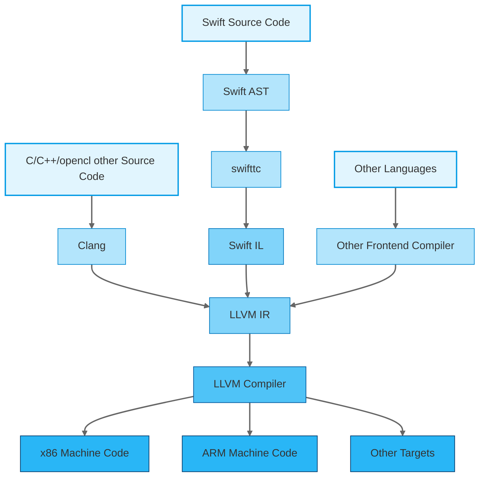

# LLVM Tutorial - What is LLVM?

## Table of Contents

- [Introduction](#introduction)
- [Where is LLVM Used?](#where-is-llvm-used)
- [Why Learn LLVM?](#why-learn-llvm)
- [LLVM Architecture](#llvm-architecture)
- [LLVM Compilation Pipeline (Mermaid Diagram)](#llvm-compilation-pipeline-mermaid-diagram)
- [Explanation of the Compilation Pipeline](#explanation-of-the-compilation-pipeline)
- [Conclusion](#conclusion)
- [More Articles](#more-article)

---
import Tabs from '@theme/Tabs';
import TabItem from '@theme/TabItem';


## Introduction

LLVM (Low-Level Virtual Machine) is a robust compiler infrastructure designed to support life-long program analysis and transformation. It offers a flexible intermediate representation (IR) and modular components that enable high-performance compilation, optimization, and code generation. Originally developed at the University of Illinois, LLVM has evolved into a foundational technology behind many modern compilers.

### Key Components of LLVM:
- **LLVM Core**: Handles intermediate representation, optimization, and code generation.
- **Clang**: The LLVM front-end for C, C++, and Objective-C.
- **LLD**: LLVM's linker.
- **LLDB**: LLVM's powerful debugger.

---

## Where is LLVM Used?

LLVM’s design and flexibility make it suitable across diverse domains:

- **Compilers**: LLVM is the backend for Clang, Rust, Swift, and more.
- **Operating Systems**: Used in macOS, iOS, and other OS components.
- **Graphics**: Vulkan shader compilers and GPU tools rely on LLVM.
- **Embedded Systems**: LLVM's optimizations are ideal for constrained environments.
- **Research**: LLVM provides an excellent platform for prototyping language features and optimizations.

---

## Why Learn LLVM?

Learning LLVM is beneficial for:

- **Compiler Developers**: Understand how modern compilers work.
- **Researchers**: Explore new program analyses and optimizations.
- **System Programmers**: Optimize performance-critical software.
- **Tool Builders**: Create linters, analyzers, or refactoring tools.

By mastering LLVM IR and passes, developers can gain fine-grained control over code transformation and performance tuning.

---

## LLVM Architecture

LLVM follows a modular design. Here’s a breakdown of how it processes source code:

1. **Frontend** (Clang): Translates high-level source code to LLVM IR.
2. **Optimizer**: Applies a series of transformation and analysis passes.
3. **Backend**: Converts optimized LLVM IR to target machine code.

---

## LLVM Compilation Pipeline (Mermaid Diagram)





<details>
<summary> More detail digram</summary>

```mermaid
flowchart LR
    %% Main Compilation Flow
    A[Source Code<br/>C/C++/Rust] --> B[Clang Frontend]
    B --> C[LLVM IR Generation]
    C --> D[Optimization Passes]
    D --> E[Target Code Generation]
    E --> F[Assembly / Object File]
    F --> G[Linker]
    G --> H[Executable]

    %% Clang Frontend Details
    subgraph Clang_Frontend [Clang Frontend]
        B1[Lexical Analysis]
        B2[Parsing AST]
        B3[Semantic Analysis]
    end
    B --> B1 --> B2 --> B3

    %% LLVM IR Generation Details
    subgraph LLVM_IR_Generation [LLVM IR Generation]
        C1[IR Construction]
        C2[LLVM IR Form]
    end
    C --> C1 --> C2

    %% Optimization Passes Details
    subgraph Optimization_Passes [Optimization Passes]
        D1[Constant Folding]
        D2[Dead Code Elimination]
        D3[Loop Optimizations]
        D4[Inlining]
        D5[Register Allocation]
    end
    D --> D1 --> D2 --> D3 --> D4 --> D5

    %% Code Generation Details
    subgraph Code_Generation [Code Generation]
        E1[Machine Code Emission]
        E2[Target-specific Optimizations]
    end
    E --> E1 --> E2

    %% Linker Details
    subgraph Linking [Linking]
        G1[Symbol Resolution]
        G2[Relocation]
    end
    G --> G1 --> G2

    %% Styling
    classDef stage fill:#D9EAF7,stroke:#333,stroke-width:2px;
    class A,B,C,D,E,F,G,H stage;
    classDef detail fill:#F0F8FF,stroke:#666,stroke-width:1px;
    class B1,B2,B3,C1,C2,D1,D2,D3,D4,D5,E1,E2,G1,G2 detail;

    %% Optional animation class (may not be supported in all Mermaid renderers)
    classDef animation animation: fadeIn 1s ease-in-out forwards;
    class A,B,C,D,E,F,G,H animation;


  ```

</details>
---

## Explanation of the Compilation Pipeline
---

### 🏭 **The Compiler Factory: Unlocking the Power of LLVM**

Imagine a high-tech factory, where raw materials (your source code) enter, and a finished product (an optimized, executable program) comes out. This factory is powered by LLVM, a sophisticated compiler infrastructure that can transform code from many languages into optimized machine code for different devices. Let’s take a journey through the LLVM pipeline and explore how each part of the factory works, in a way that’s both exciting for beginners and informative for experienced developers.

<Tabs>
  <TabItem value="frontend" label="Frontend Workers">
    <details>
      <summary>🔍 Frontend: Language Specialists</summary>
      
      In this stage, the raw materials—your code in various languages—are processed by the frontend workers.
      
      - **C/C++ Expert (Clang)**: Think of Clang as the factory's "C/C++ specialist." It reads your C or C++ code, understands it, and turns it into a standardized intermediate form (LLVM IR). The result? Your program is ready for the next phase.
      
      - **Swift Expert (swifttc)**: Swift doesn’t get left behind. With **swifttc**, Swift code goes through a three-step refinement process:
        - **Step 1**: Breaks it down into Swift AST (Abstract Syntax Tree) – like a recipe.
        - **Step 2**: Refines it into Swift Intermediate Language (IL) – like prepping ingredients.
        - **Step 3**: Converts it to LLVM IR – the universal intermediate recipe that’s ready for optimization.
        
      - **Other Language Teams**: Whether it's Python, Rust, or other languages, each language has its own specialists who convert their code into LLVM IR, making LLVM a universal intermediate step for multiple languages.

      **Output**: All these teams (C, C++, Swift, Python, Rust, etc.) convert their code into **LLVM IR**, a universal “intermediate recipe.”

    </details>
  </TabItem>
  
  <TabItem value="middle" label="Middle Manager">
    <details>
      <summary>⚙️ Middle: The Optimizer</summary>
      
      The middle manager is responsible for refining the code to make it as efficient as possible.
      
      - **LLVM Optimizer**: The LLVM Optimizer takes the LLVM IR produced by the frontend workers and performs several important tasks:
        - **Optimization**: It analyzes the LLVM IR and removes unnecessary instructions or redundant operations, making the code faster and smaller. Think of it as trimming excess ingredients to make the recipe more efficient.
        - **Performance Boosts**: It reorganizes and fine-tunes the code to make sure it runs faster and uses less power. This is crucial for ensuring that your program runs efficiently on various devices.

      **Why it matters**: Optimization at this stage improves performance for all subsequent platforms, ensuring that no matter the target device (x86, ARM, etc.), the code runs efficiently. This optimization happens once, at the LLVM IR level, instead of being repeated for each device or language.

    </details>
  </TabItem>
  
  <TabItem value="backend" label="Backend Workers">
    <details>
      <summary>💻 Backend: The Machine Experts</summary>
      
      Now that the code has been optimized, it’s time for the backend workers to turn the refined LLVM IR into machine-specific code.

      - **x86 Team**: The x86 team takes the optimized LLVM IR and turns it into machine code designed for Intel/AMD chips (the CPUs found in most desktop computers and laptops).
      - **ARM Team**: The ARM team optimizes the code for mobile devices, like smartphones and tablets. ARM chips are used in most mobile devices, so ensuring the code is optimized for ARM is crucial.
      - **Other Teams**: There are also backend teams for other platforms, like GPUs (Graphics Processing Units) for high-performance tasks, or even custom hardware like TPUs (Tensor Processing Units) for machine learning tasks.

      **Final Product**: After all the teams have worked their magic, the code is transformed into machine-specific code, such as:
        - Executable programs for desktops (`.exe`, `.app`, etc.)
        - Mobile apps for iOS/Android
        - Specialized code for GPUs, custom hardware, or other devices.

    </details>
  </TabItem>
</Tabs>

### 🌟 **Why This Matters**

- **For Developers**: With LLVM, you can write code in any language—C, C++, Swift, Python, etc.—and LLVM handles the rest. You don’t have to worry about writing separate code for each platform; LLVM makes your code compatible with multiple platforms with minimal changes.
  
- **For Devices**: One system, LLVM, supports all chip architectures (x86, ARM, GPUs, etc.). You can target a wide range of devices without writing platform-specific code.

- **For Performance**: LLVM optimizes your code once at the LLVM IR level, which improves performance across all platforms and devices. This means you get better performance without having to manually optimize each language or platform.

### 🛠️ **Real-World Example**

Let’s say you’re writing an app in **Swift**. 

1. You write your Swift code.
2. The **swifttc** compiler converts it to **LLVM IR**.
3. The LLVM Optimizer fine-tunes the code for better performance.
4. The **ARM Team** then turns it into machine code for iPhones (ARM-based architecture).
5. At the same time, the **x86 Team** would generate machine code for Mac (x86-based architecture).

This process ensures that your app works seamlessly on both your iPhone and your Mac with **the same underlying optimizations**. You write the code once, and LLVM makes sure it runs efficiently on both platforms.

### 5. **Target-Specific Code Generation (E)**
The backend converts LLVM IR to machine-specific instructions based on the target architecture (e.g., x86, ARM).

### 6. **Assembly/Object File (F)**
The generated machine code is saved as an object or assembly file.

### 7. **Executable via Linker (G)**
The final step is linking all object files and libraries to produce a runnable executable.

---

## Conclusion

LLVM is a cornerstone technology in modern software development. Its power lies in its modular design, powerful IR, and support for custom compiler passes. Whether you're building a new language, developing performance-critical applications, or diving into compiler research, LLVM offers the tools you need.

Stay tuned for upcoming tutorials on:
- Writing custom LLVM passes
- Creating a toy language using LLVM
- Using ML with LLVM for smarter optimizations

---

### More Article
- [how LLVM solve MXN Problem](https://www.compilersutra.com/docs/llvm/llvm_basic/Why_What_Is_LLVM)
- [How to  Understand LLVM IR](https://www.compilersutra.com/docs/llvm/llvm_basic/markdown-features)
- [LLVM Tools](https://www.compilersutra.com/docs/llvm/llvm_extras/manage_llvm_version)
- [learn LLVM Step By Step](https://www.compilersutra.com/docs/llvm/llvm_extras/translate-your-site)
- [Power of the LLVM](https://www.compilersutra.com/docs/llvm/llvm_extras/llvm-guide)
- [How to disable LLVM Pass](https://www.compilersutra.com/docs/llvm/llvm_extras/disable_pass)
- [see time of each pass LLVM](https://www.compilersutra.com/docs/llvm/llvm_extras/llvm_pass_timing)
- [Learn LLVM step by Step](https://www.compilersutra.com/docs/llvm/intro-to-llvm)
- [Create LLVM Pass](https://www.compilersutra.com/docs/llvm/llvm_basic/pass/Function_Count_Pass)

---
