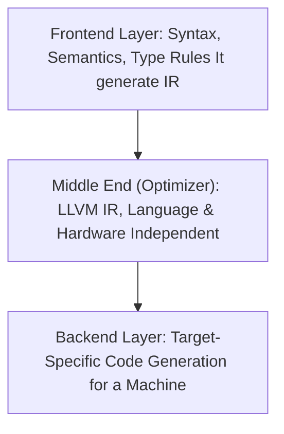
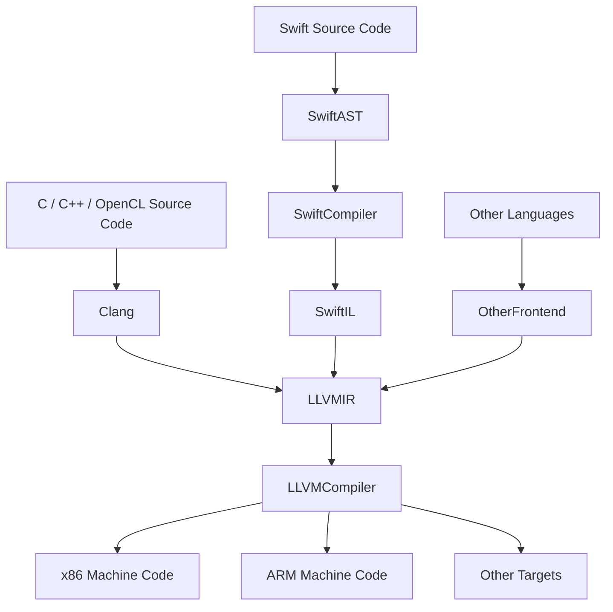

import Tabs from '@theme/Tabs';
import TabItem from '@theme/TabItem';
import AdBanner from '@site/src/components/AdBanner';

# LLVM Tutorial - What is LLVM? 
                          >> ***Understand LLVM at a conceptual and architectural level.***

LLVM its abbreviation expands to **Low-Level Virtual Machine**, but if you have spent even a little time around compilers, you already know this truth:

> ***LLVM stopped being just a name a long time ago.***

LLVM is not a traditional virtual machine, not merely a compiler backend, and definitely not “just another tool in the toolchain.” It is a **deep rethinking of how programs should be represented, optimized, and evolved over time**. 

:::tip
While most compilers treat compilation as a one-time event, LLVM treats it as a **continuous process** something that can happen at compile time, link time, run time, and even *after the program has already shipped to users*.
:::

If you are interested in **compilers, performance, systems programming, GPUs, or low-level optimization**, chances are LLVM has already crossed your paththrough Clang, Rust, Swift, Vulkan, JITs, or modern toolchains. But many people *use* LLVM without ever truly understanding **why it was designed this way** and **why it won**. 

:::caution This Article
This article is written to **connect those dots** to explain LLVM not as a collection of tools, but as a **compiler philosophy** that quietly became the backbone of modern software systems.
:::

:::important little bit history

LLVM was proposed in 2004, when:
- JVM optimizations were limited
- GCC was monolithic
- link-time optimization was rare

LLVM solved problems that the industry
had not fully realized yet  which is why
its relevance has only increased over time.

:::

  <Tabs>
  <TabItem value="social" label="📣 Social Media">

            - [🐦 Twitter - CompilerSutra](https://twitter.com/CompilerSutra)
            - [💼 LinkedIn - Abhinav](https://www.linkedin.com/in/abhinavcompilerllvm/)
            - [📺 YouTube - CompilerSutra](https://www.youtube.com/@compilersutra)
            - [💬 Join the CompilerSutra Discord for discussions](https://discord.gg/DXJFhvzz3K)
  </TabItem>
  </Tabs>
<AdBanner />

## Table of Contents

* [Introduction](#introduction)
* [Why LLVM Succeeded](#why-llvm-succeeded)
* [LLVM Architecture](#llvm-architecture)
* [Why This Design Matters](#why-this-design-matter)
* [Real-World Example](#-real-world-example)
* [Conclusion](#conclusion)
* [More Articles](#more-articles)

## Introduction

LLVM (Low-Level Virtual Machine) is a robust compiler infrastructure designed to support life-long program analysis and transformation. It offers a flexible intermediate representation (IR) and modular components that enable high-performance compilation, optimization, and code generation. Originally developed at the University of Illinois, LLVM has evolved into a foundational technology behind many modern compilers.

Before reading further let us be on the same page and the same page is
> ***LLVM (Low-Level Virtual Machine) is not just another compiler backend it's a compiler framework designed from the ground up to support lifelong program analysis and transformation.***

Unlike traditional compilers that discard high-level information after generating machine code, LLVM preserves a rich intermediate representation (IR) throughout a program's entire lifecyclefrom compile time to link time, install time, runtime, and even in idle time between runs.

:::note
Originally developed at the University of Illinois at Urbana-Champaign by Chris Lattner and Vikram Adve, LLVM was conceived with a clear goal: 
                  - to make sophisticated, 
                  - language-independent optimization accessible and transparent for real-world software.

***Key Components of LLVM:***
- **LLVM Core**: Handles intermediate representation, optimization, and code generation.
- **Clang**: The LLVM front-end for C, C++, and Objective-C.
- **LLD**: LLVM's linker.
- **LLDB**: LLVM's powerful debugger.

:::

## Why LLVM Succeeded

What began as a research project at the University of Illinois has evolved into the foundational compilation infrastructure powering everything from smartphone apps to supercomputers, from web browsers to operating systems. Unlike traditional compilers that treat compilation as a one-time translation from source to machine code, LLVM introduced a revolutionary concept: **maintaining a rich program representation throughout the software lifecycle**, enabling continuous optimization and analysis. This persistent intermediate representation (IR) acts as a "digital DNA" for programs, allowing sophisticated transformations at compile time, link time, runtime, and even during idle periods between executions. 

:::tip LLVM Framework
The LLVM framework's unique combination of a typed, SSA-based IR with a modular, pass-based architecture has made it the compilation backbone for diverse languages including Swift, Rust, Clang (C/C++), Julia, and countless research languages, while simultaneously serving as the optimization engine for GPU shaders, embedded systems, and security analysis tools. Its language-agnostic design and lack of enforced runtime dependencies make it uniquely positioned to bridge the gap between high-level programming abstractions and low-level hardware realities.
:::

Also what llvm does not do intentionally help it to gain popularity and be the backbone of the modern compiler 
LLVM is powerful because of what it avoids:
- It does not define a programming language
- It does not enforce memory safety
- It does not provide a standard runtime
- It does not replace language frontends

These constraints are intentional and allow LLVM
to remain flexible, low-level, and widely applicable.

<Tabs>
  <TabItem value="architecture" label="Core Architecture">

LLVM’s success comes from a **simple but powerful idea**:  
each part of the compiler should do **one job well**, and nothing more.

LLVM divides compilation into **three cleanly separated layers**:

1. **Frontend Layer**  
   Understands the programming language  
   (syntax, semantics, type rules)

2. **Middle End (Optimizer)**  
   Works on LLVM IR, independent of any language or hardware

3. **Backend Layer**  
   Knows how to generate efficient code for a specific machine

This separation allows each layer to **evolve independently**:
- New languages can reuse decades of optimization work by targeting LLVM IR
- New hardware can immediately benefit from existing optimizations by adding a backend

The real innovation is that **LLVM IR does not disappear after compilation**.  
It can be preserved and reused for:
- Link-time optimization across modules
- Runtime optimization using profiling data
- Offline (idle-time) reoptimization
- Whole-program analysis that is impractical during normal compilation

Because of this, LLVM is not just a compiler backend it is a **lifelong optimization framework**.
</TabItem>

<TabItem value="languages" label="Programming Languages">

LLVM acts as a **shared optimization engine** for many programming languages.

Each language provides its own **frontend**, which:
- Enforces language-specific rules
- Performs language-specific checks
- Lowers the program into LLVM IR

After this point, LLVM treats all programs the same.

**How Different Languages Use LLVM**

- **C / C++ (Clang)**  
  Preserves low-level control while enabling aggressive optimization

- **Rust**  
  Ownership and borrowing rules are enforced by the Rust compiler  
  LLVM only sees the resulting safe, lowered IR

- **Swift**  
  High-level features like protocols and generics are lowered into
  structures, vtables, and function calls

- **Julia**  
  Dynamic, high-level code is specialized and compiled into efficient LLVM IR

- **Kotlin/Native**  
  JVM-like language features are translated into native code using LLVM

***Why LLVM IR Works Well Here***

LLVM IR sits in a **sweet spot**:
- High-level enough to perform meaningful analysis
- Low-level enough to map efficiently to hardware

This allows different languages to **share optimization breakthroughs**
without sharing language runtimes or semantics.
</TabItem>

<TabItem value="os-platforms" label="Operating Systems & Platforms">

LLVM is especially strong in **system-level software**, where flexibility matters.

***Deep Platform Usage***

- **Apple platforms**  
  macOS, iOS, watchOS, and tvOS all use LLVM-based toolchains

- **Android NDK**  
  Modern Android native development uses Clang/LLVM

- **Linux and Embedded Systems**  
  LLVM is used for kernels, drivers, firmware, and utilities

***Why LLVM Fits System Programming***

1. **No Mandatory Runtime**  
   Unlike JVM or .NET, LLVM does not require a garbage collector or object model

2. **Direct Hardware Mapping**  
   LLVM IR maps cleanly to registers, memory, and control flow

3. **Same Optimizations Everywhere**  
   System code benefits from the same optimizations as application code

4. **Security and Safety Research**  
   Projects like SAFECode extend LLVM to experiment with memory safety for C/C++

LLVM can compile everything from **bootloaders to system libraries**, which is rare for compiler infrastructures.

</TabItem>

<TabItem value="gpu" label="Graphics, GPUs & Accelerators">

LLVM plays a major role in **modern GPU and accelerator compilation**.

***GPU and Accelerator Pipelines***

- **Vulkan / SPIR-V toolchains**
- **OpenCL compute kernels**
- **Metal shaders (Apple platforms)**
- **Vendor-neutral GPU compute projects**

***Why LLVM Works for GPUs***

- Core LLVM optimizations (SSA-based analysis, loop transforms, simplification)
  are shared across CPU and GPU targets
- Target-specific passes handle hardware differences
- One IR can generate code for CPUs, GPUs, and other accelerators

This makes LLVM ideal for **heterogeneous computing**, where a single program
targets multiple kinds of hardware.

***Industry Impact***

Many GPU vendors use LLVM-based compilers, meaning:
- Improvements benefit multiple vendors
- Optimizations scale across architectures
- Tooling becomes more consistent

</TabItem>
<TabItem value="research" label="Research & Tooling">

LLVM is widely used in research because it lets developers work at the
**intermediate representation level**, without building a compiler from scratch.

***Common Research and Tooling Uses***

- Static analysis (dataflow, pointer analysis)
- Security tools (memory safety, control-flow integrity)
- Performance profilers
- Custom optimization passes
- Domain-specific compilers

Because LLVM IR is:
- Well-defined
- Stable
- Language-independent

Research ideas can move from **prototypes into production systems**.
This is one reason LLVM has had such long-term impact in both academia and industry.

  </TabItem>
</Tabs>

---

:::important
The original LLVM paper's vision of ["lifelong program analysis"](https://llvm.org/pubs/2003-09-30-LifelongOptimizationTR.pdf) has expanded into a vibrant ecosystem where academia and industry collaborate to advance compilation technology.
:::

LLVM’s design and flexibility make it suitable across diverse domains:

- **Compilers**: LLVM is the backend for Clang, Rust, Swift, and more.
- **Operating Systems**: Used in macOS, iOS, and other OS components.
- **Graphics**: Vulkan shader compilers and GPU tools rely on LLVM.
- **Embedded Systems**: LLVM's optimizations are ideal for constrained environments.
- **Research**: LLVM provides an excellent platform for prototyping language features and optimizations.

## LLVM Architecture
We have discussed a lot about LLVM so far.
In this section, we will mostly focus on the **architecture of LLVM** how LLVM is structured internally and how it processes source code step by step.

:::tip ***Let's Begin***
:::

LLVM follows a **modular design**. Instead of being a single, tightly coupled compiler, LLVM is built as a collection of **independent but well-connected components**, each responsible for a specific task.

This modularity is not accidental. It is the **core reason** LLVM scales across:

* multiple programming languages
* multiple hardware architectures
* decades of evolution

Let’s break down how LLVM processes source code and why each stage exists.

**High-Level View of LLVM Architecture**

At a high level, LLVM processes source code in **three major phases**:

1. **Frontend**
   Responsible for understanding the programming language and converting it into LLVM IR.

2. **Optimizer (Middle End)**
   Performs analysis and optimizations on LLVM IR, independent of language and hardware.

3. **Backend**
   Converts optimized LLVM IR into machine-specific code (x86, ARM, GPU, etc.).

This clean separation is the **foundation of LLVM’s success**.

**High-Level LLVM Compilation Pipeline**

The diagram below shows how different programming languages enter LLVM and how LLVM targets multiple architectures from a single intermediate representation.

** LLVM Compilation Pipeline (High-Level)

**What this diagram tells us**

This diagram captures the **big idea behind LLVM**:

* Different languages use **different frontends**
* All frontends **converge at LLVM IR**
* LLVM IR is optimized **once**
* The same optimized IR is lowered to **many architectures**

This is why LLVM is often described as a **hub-and-spoke model**:

* many languages in
* many targets out
* one powerful IR in the middle

***Detailed LLVM Compilation Flow (Step by Step)***

If we zoom in further, the LLVM pipeline looks like this:

:::tip
This diagram represents the **standard compilation path** followed by Clang, Rust, Swift, and many other LLVM-based compilers.
:::

**Breaking Down Each Stage**

Now let’s understand **why each stage exists** and what problem it solves.

**. Frontend – Language Understanding**

The frontend is **language-specific**.

> Its job is to understand *what the programmer wrote*.

The frontend performs:

* Lexical analysis (breaking code into tokens)
* Parsing (building an AST)
* Semantic checks (types, scopes, language rules)
* Lowering the program into LLVM IR

Examples:

* Clang understands C and C++
* Rust frontend enforces ownership and borrowing rules
* Swift frontend understands protocols and generics

Once this stage finishes, the original language details are **no longer needed**.

> From this point onward, LLVM works only with LLVM IR.

**2. LLVM IR – The Central Representation**

LLVM IR is the **heart of the entire architecture**.

It acts as a **stable contract** between:

* all programming languages
* all optimizations
* all hardware targets

LLVM IR is:

* SSA-based (each value is assigned once)
* Typed
* Explicit in control flow
* Explicit in memory operations

This makes LLVM IR:
* high-level enough for deep analysis
* low-level enough for efficient code generation

This balance is what makes LLVM fundamentally different from traditional compilers.

**3. Optimizer – The Middle End**

The optimizer operates **only on LLVM IR**.

It does not care:
* which language the program came from
* which hardware the program will run on

Typical optimizations include:
* Constant folding
* Dead code elimination
* Loop optimizations
* Function inlining
* Control-flow simplification

Because these optimizations are **language and hardware-independent**, they automatically benefit **every frontend and every backend**.

This is where LLVM achieves massive reuse.

**4. Backend Target-Specific Code Generation**

The backend is **hardware-specific**.

Each backend understands:

* The instruction set
* Register layout
* Calling conventions
* Hardware constraints

Examples:

* x86 backend for desktops and servers
* ARM backend for mobile and embedded systems
* GPU backends for compute and graphics workloads

The backend transforms optimized LLVM IR into:

* assembly
* object files
* final machine instructions

**5. Linking – Producing the Final Executable**

After code generation:

* Object files are passed to the linker
* Symbols are resolved
* Libraries are combined
* A final executable is produced

LLVM provides **LLD**, but it also works seamlessly with system linkers.

***Why This Architecture Matters**

This architecture gives LLVM three huge advantages:

1. **Language Independence**
   Any new language only needs to write a frontend.

2. **Target Independence**
   Any new hardware only needs to implement a backend.

3. **Reusable Optimizations**
   Optimizations are written once and reused everywhere.

This is why LLVM became the **backbone of modern compilers**.

:::tip Mental Model (Easy to Remember)

A simple way to remember LLVM’s architecture:

* Frontend: *What does the program mean?*
* LLVM IR: *What does the program do?*
* Optimizer: *How can it do it better?*
* Backend: *How do we tell this machine to do it?*
:::

## Why This Design Matter

Before we move ahead, let’s step back for a moment and look at the bigger picture.
The frontend, optimizer, and backend separation we just discussed is not only about clean design it directly affects how LLVM is used in the real world. This structure explains why LLVM can support many languages, run on many kinds of hardware, and keep improving over time without breaking. In the next section, we’ll see how this architecture turns into real benefits and why these design choices actually matter in practice.

<Tabs>
  <TabItem value="mxn" label="M × N Problem">

LLVM’s architecture directly addresses one of the oldest problems in compiler design:  
the **M × N problem**.

###### What Is the M × N Problem?

Historically:
- **M programming languages**
- **N hardware architectures**

Without a shared intermediate layer, every language had to support every hardware target.

This quickly becomes unmanageable.

###### How LLVM Solves It

LLVM introduces **LLVM IR as a stable middle layer**:

- Each language implements **one frontend**
- Each hardware platform implements **one backend**
- Optimizations live **once in the middle**

As a result:

> Languages scale linearly.  
> Hardware scales linearly.  
> Complexity does **not** explode.

This is one of the most important reasons LLVM succeeded.

  </TabItem>

  <TabItem value="separation" label="Separation of Responsibilities">

LLVM works because **each stage has a single, well-defined responsibility**.

###### Clear Division of Labor

- **Frontends** focus on language correctness  
- **Optimizer** focuses on improving the program  
- **Backends** focus on hardware efficiency  

This separation prevents:
- language logic leaking into optimizations
- hardware quirks polluting high-level analysis

###### Why This Matters

Because responsibilities are isolated, LLVM becomes easier to:
- understand
- extend
- debug
- maintain over long periods of time

This is critical for a project meant to live for decades.

  </TabItem>

  <TabItem value="optimizations" label="Scalable Optimizations">

LLVM performs optimizations on **LLVM IR**, not on source code or machine code.

###### Why This Is Powerful

Optimizations written on LLVM IR are:
- language-independent
- hardware-independent

This means:
- A new optimization benefits **every language**
- A new backend benefits from **all existing optimizations**

This reuse is why LLVM can grow without collapsing under complexity.

  </TabItem>

  <TabItem value="hardware" label="Hardware Innovation">

LLVM’s design is especially powerful for **hardware companies**.

###### Adding New Hardware with LLVM

If a company builds a new processor:
- they do **not** need to write compilers for every language
- they mostly implement a **backend**

Once the backend exists:
- C, C++, Rust, Swift, and more work almost immediately
- existing optimizations apply automatically
- tooling (debugging, profiling) comes for free

This dramatically lowers the barrier for **new hardware adoption**.

  </TabItem>

  <TabItem value="lifelong" label="Lifelong Optimization">

Traditional compilers treat compilation as a **one-time event**.

LLVM treats it as an **ongoing process**.

###### Why This Is Possible

Because LLVM IR is:
- well-defined
- serializable
- reloadable

Programs can be optimized at:
- compile time
- link time
- run time (JIT)
- idle time (profile-guided reoptimization)

This idea is called **lifelong optimization**, and it was a core motivation behind LLVM’s design.

  </TabItem>

  <TabItem value="research" label="Research to Production">

LLVM uniquely supports both:
- **academic research**
- **industrial-scale production**

###### Why Researchers Love LLVM

Researchers can:
- experiment with new analyses
- prototype optimizations
- study real-world programs

###### Why Industry Loves LLVM

Industry can:
- adopt proven ideas
- reuse infrastructure
- deploy at scale

This tight feedback loop is one reason LLVM keeps improving year after year.

  </TabItem>

  <TabItem value="stability" label="Long-Term Stability">

Languages evolve.  
Hardware changes.  
Optimization techniques improve.

LLVM’s architecture absorbs this change without breaking.

###### How LLVM Stays Relevant

- New languages plug in at the frontend
- New hardware plugs in at the backend
- Optimizations evolve independently

This is why LLVM has remained relevant for decades and continues to power modern compiler ecosystems.

  </TabItem>

  <TabItem value="takeaway" label="Final Takeaway">

LLVM’s design matters because it transforms compilation from:

> a rigid, one-time translation step  
> into a **flexible, extensible, long-lived system**

By cleanly separating concerns and centering everything around LLVM IR, LLVM enables:
- scalability
- innovation
- long-term evolution

That is why LLVM is not just a compiler it is a **compiler platform**.

  </TabItem>
</Tabs>

## Conclusion

LLVM is a cornerstone technology in modern software development. Its power lies in its modular design, powerful IR, and support for custom compiler passes. Whether you're building a new language, developing performance-critical applications, or diving into compiler research, LLVM offers the tools you need.

Stay tuned for upcoming tutorials on:
- Writing custom LLVM passes
- Creating a toy language using LLVM
- Using ML with LLVM for smarter optimizations

---

### More Article
- [how LLVM solve MXN Problem](https://www.compilersutra.com/docs/llvm/llvm_basic/Why_What_Is_LLVM)
- [How to  Understand LLVM IR](https://www.compilersutra.com/docs/llvm/llvm_basic/markdown-features)
- [LLVM Tools](https://www.compilersutra.com/docs/llvm/llvm_extras/manage_llvm_version)
- [learn LLVM Step By Step](https://www.compilersutra.com/docs/llvm/llvm_extras/translate-your-site)
- [Power of the LLVM](https://www.compilersutra.com/docs/llvm/llvm_extras/llvm-guide)
- [How to disable LLVM Pass](https://www.compilersutra.com/docs/llvm/llvm_extras/disable_pass)
- [see time of each pass LLVM](https://www.compilersutra.com/docs/llvm/llvm_extras/llvm_pass_timing)
- [Learn LLVM step by Step](https://www.compilersutra.com/docs/llvm/intro-to-llvm)
- [Create LLVM Pass](https://www.compilersutra.com/docs/llvm/llvm_basic/pass/Function_Count_Pass)

<Tabs>
  <TabItem value="docs" label="📚 Documentation">
             - [CompilerSutra Home](https://compilersutra.com)
                - [CompilerSutra Homepage (Alt)](https://compilersutra.com/)
                - [Getting Started Guide](https://compilersutra.com/get-started)
                - [Skip to Content (Accessibility)](https://compilersutra.com#__docusaurus_skipToContent_fallback)

  </TabItem>

  <TabItem value="tutorials" label="📖 Tutorials & Guides">

        - [AI Documentation](https://compilersutra.com/docs/Ai)
        - [DSA Overview](https://compilersutra.com/docs/DSA/)
        - [DSA Detailed Guide](https://compilersutra.com/docs/DSA/DSA)
        - [MLIR Introduction](https://compilersutra.com/docs/MLIR/intro)
        - [TVM for Beginners](https://compilersutra.com/docs/tvm-for-beginners)
        - [Python Tutorial](https://compilersutra.com/docs/python/python_tutorial)
        - [C++ Tutorial](https://compilersutra.com/docs/c++/CppTutorial)
        - [C++ Main File Explained](https://compilersutra.com/docs/c++/c++_main_file)
        - [Compiler Design Basics](https://compilersutra.com/docs/compilers/compiler)
        - [OpenCL for GPU Programming](https://compilersutra.com/docs/gpu/opencl)
        - [LLVM Introduction](https://compilersutra.com/docs/llvm/intro-to-llvm)
        - [Introduction to Linux](https://compilersutra.com/docs/linux/intro_to_linux)

  </TabItem>

  <TabItem value="assessments" label="📝 Assessments">

        - [C++ MCQs](https://compilersutra.com/docs/mcq/cpp_mcqs)
        - [C++ Interview MCQs](https://compilersutra.com/docs/mcq/interview_question/cpp_interview_mcqs)

  </TabItem>

  <TabItem value="projects" label="🛠️ Projects">

            - [Project Documentation](https://compilersutra.com/docs/Project)
            - [Project Index](https://compilersutra.com/docs/project/)
            - [Graphics Pipeline Overview](https://compilersutra.com/docs/The_Graphic_Rendering_Pipeline)
            - [Graphic Rendering Pipeline (Alt)](https://compilersutra.com/docs/the_graphic_rendering_pipeline/)

  </TabItem>

  <TabItem value="resources" label="🌍 External Resources">

            - [LLVM Official Docs](https://llvm.org/docs/)
            - [Ask Any Question On Quora](https://compilersutra.quora.com)
            - [GitHub: FixIt Project](https://github.com/aabhinavg1/FixIt)
            - [GitHub Sponsors Page](https://github.com/sponsors/aabhinavg1)

  </TabItem>

  <TabItem value="social" label="📣 Social Media">

            - [🐦 Twitter - CompilerSutra](https://twitter.com/CompilerSutra)
            - [💼 LinkedIn - Abhinav](https://www.linkedin.com/in/abhinavcompilerllvm/)
            - [📺 YouTube - CompilerSutra](https://www.youtube.com/@compilersutra)
            - [💬 Join the CompilerSutra Discord for discussions](https://discord.gg/DXJFhvzz3K)

  </TabItem>
</Tabs>

