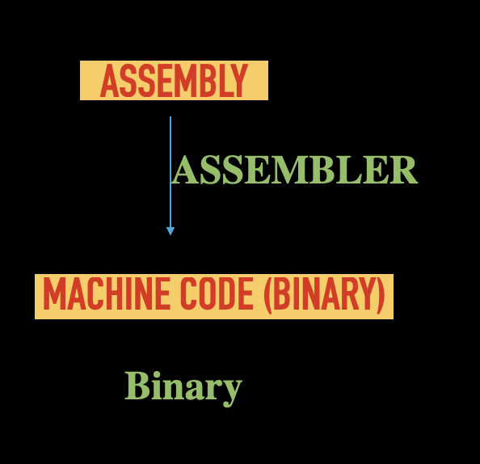
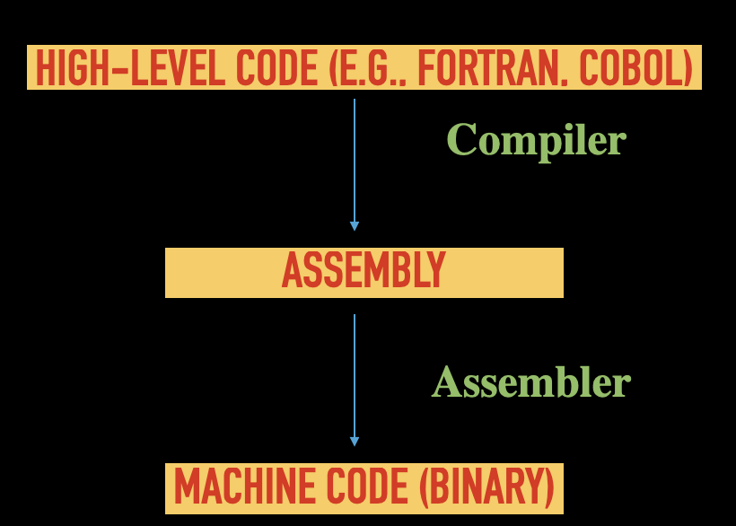
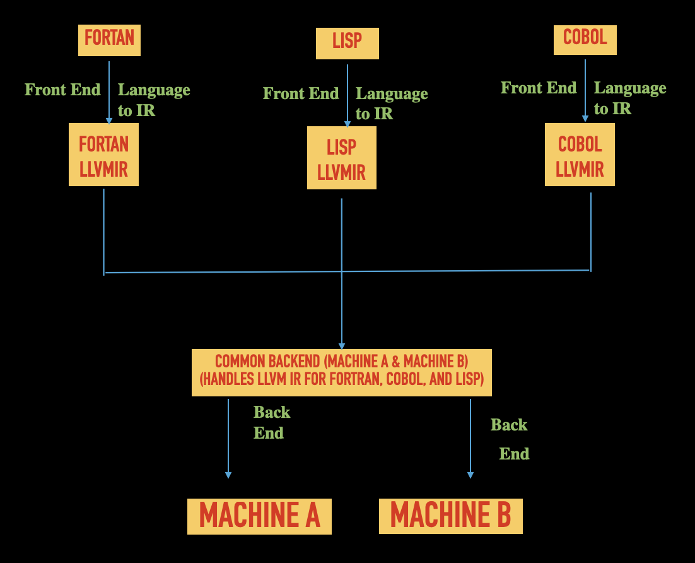

# LLVM Architecture: Revolutionizing Modern Compilers
## 1. Introduction to LLVM
`LLVM (Low-Level Virtual Machine)` can be describe as a  compiler framework which is modular and used to create, optimize, extend programming languages. Now LLVM as became the backbone of the modern ``compiler development``.

Due to all the reason mentioned below (their can be more reason) `LLVM` has became the heart of the compiler development of the ``modern era``.
 Because of the offering features such as: 
 - unmatched flexibility
 - powerful optimization(both target independent and dependent) 
 - cross-platform support.
 - Easily extendable for both new hardware and new front end langugage.
 :::note  
`In this article we will explore the evolution of programming langugage and the problem old design of the compiler persist which was improved by the   ``new design of LLVM`` which help us to transform the compiler development  from ``m*n`` model  to ``m+n`` model.
:::

---

## 2. The Evolution of Programming Languages
We all know that hardware is only capable of ``executing`` the  binary language (0 and 1).
But its limitation is:-
- its hard to right.
- Difficult to maintain. 
- Difficult to Debug.
- Have no Cross Platform Compatibility.
--- 
This leads to give development of the first generation of the programming language i.e. ``Assembly`` to ``Binary``. 

### From Binary to Assembly
---
  -  **Assembly Language**:
            This ``Assembly langauge`` introduce ``Acronyms``(mnemonics) to represent the machine ``instruction``which is easy to understand by the human. As mnemonics were easy to understood by the human this leads to developed the first generation of the programming language shifting from ``Binary`` to ``Assembly``.
:::note
Now the Piece of code which convert assembly to binary is called ``assembler``. 

:::
  - **Advantages**:
    - Simple to code and understand as compared to binary.
    - Also allowed symbols while representation of memory locations and instructions.
    - Helps to have low level control on hardware.
  - **Challenges**:
    - Its more hardware specific and less portable.
    - Requires in depth understandig of the hardware specs.
    - Maintaing and Debugging still was far behind.

:::note
The challenges while working with assembly language was ``portability`` and required in depth understanding of hardware ISA.
This leads to create a language which can enable abstraction from hardware also the program must be more closer to human readable format.
Due to this challenge we got the HLL.
:::

---
### Emergence of High-Level Programming Languages
The HLL is a  language which is more close to human being to understand . It remove the abstraction of the complexity of the hardware, allowing developers to write a program which is in ``human-readable format``. This leads to remove the barrier of the dependency of programming on the developer who are expert in hardware and broden the scope of the programming.s.
- **Examples**:
  - FORTRAN (1957): For scientific and engineering tasks.
  - COBOL (1959): For business and administrative purposes.
  - LISP (1958): For artificial intelligence research.
  - C (1972): For system programming, operating systems, and embedded applications.
- **Advantages**:
  - Easy to code and understand as compare to assembly.
  - Enables Cross platfrom portability.
  - Broader the scope of programming.
- **Challenges**:
  - Take more time as compare to assembly.
  - Have dependency on tool to translate HLL to machine code.
  - Reduced hardware optimization capabilities.
---
:::note
As HLL is written in human format. That's the reason we needed a tool which can convert HLL -> Binary. This requirement gives a ``scope`` of a tool which can convert  ``HLL`` to the ``binary`` and this tool is called ``compiler``.
But generally compiler convert HLL -> Assembly then assembler convert HLL -> Binary.                          

:::
---

## 3. Introduction to Compilers
### What is a Compiler?
A piece of code whose work is to translate the HLL to low level assembly or machine code is called as ``compiler``.
From above article we came to understand why we need compiler.
:::tip
A new solution always comes with new challenges first in implementation and then in optimization. But each challenge presents an **opportunity** to fix it, learn from it, and improve it. As we fix one challenge, new ones arise. This cycle goes on an on , driving progress and innovation forward till manking is alive.

> — **KarmicTechnology**                                     
> _This quote is originally written by [karmicTechnology],
> _published on_ **[27/01/2025]._
:::
---
:::note
> "The journey of ``problem-solving`` is ``destinationless`` as every solution opens a doors to new problem.
> —**KarmicTechnology**                                 
> _This quote is originally written by [karmicTechnology],
> _published on_ **[27/01/2025]._
:::
---

---

## 4. Problems with Traditional Compilers
### M × N Problem
Lets understand the problem at first place.
>Let's suppose I have a 
> ``Languages``: FORTRAN, COBOL, LISP  
> ``Machines``: Machine A, Machine B 
___           
> Then We need Compiler for 
    - FORTRAN → Machine A 
    - FORTRAN → Machine B 
    - COBOL → Machine A 
    - COBOL → Machine B 
    - LISP → Machine A 
    - LISP → Machine B 
    - Total = 3 * 2 = 6 Compilers 
---
:::note
**Required Compilers**: 
From above eg Lets suppose we have M programming language and N as the hardware architecture then traditional compilers requires M*N unique compilers. 
Which leads 
- Challenges in the portability.
- Overhead for the maintainance.
- Redundany of the code.

### Additional Issues
- Challenges for each plafrom.
- Less flexible  approach.
- Customer will depend on particular vendor (VendorLockIn)
- Resource-intensive cross-platform development.
:::
---

## 5. The Birth of LLVM
Lets discuss here how LLVM or modern compiler solve the problem of m*n.
Instead of directly convertion from the HLL -> Assembly the modern compiler first convert Source Code to one Intermediate representation (in case of LLVM LLVMIR) and then LLVM convert it to required architecture assembly.

### Solving the M × N Problem with LLVM IR
Lets see by eg we will take above example
> ``Languages``: FORTRAN, COBOL, LISP  
> ``Machines``: Machine A, Machine B 
___           
> Then We need Compiler for 

As in digram we see that one set of backend for Machine A and Machine B is shared among all the 3 front end. Instead of depending on the source code solo the front end is converting source code to the LLVM IR and this LLVM IR is mapping the IR to backend. 
- Total = 3(No of front end ) + 2(No of backend) = 5 

> Let's describe how it works:
- Each source code is converted to its correspoding LLVMIR(done by front end).
- Instead of having a seperate backend. The backend for each IR is shared among them.
- Due to this sharing of the backend both ``Machine A`` and ``Machine B`` share a common backend that takes LLVMIR as input from all three (front end) languages and generate machine code for the respective machine. making it a more efficient and centralized system.  
---


- **Intermediate Representation (IR)**:
  - Acts as a common bridge between front-end (language-specific) and back-end (architecture-specific) compilation.
  - Translates high-level code to IR and then IR to machine code.
- **Advantages**:
  - Reduces the problem from M × N to M + N compilers.
  - Ensures modularity, scalability, and maintainability.

### Key Features of LLVM
- Modular design for flexible compiler construction.
- Optimization passes for platform-independent and dependent improvements .
- Reusability of components for rapid development.

> Let's discuss how can we now generate the ``LLVM IR from the Front end clang``.
---

## 6. Installing LLVM
> Before Generating IR lets install it.
### On Linux
1. **Update the system**:
   ```bash
   sudo apt update
   sudo apt upgrade
   ```
2. **Install LLVM**:
   ```bash
   sudo apt install llvm clang
   ```
3. **Verify installation**:
   ```bash
   clang --version
   llvm-config --version
   ```

### On Mac
1. **Install Xcode Command Line Tools**:
   ```bash
   xcode-select --install
   ```
2. **Install LLVM via Homebrew**:
   ```bash
   brew install llvm
   ```
3. **Add LLVM to your PATH** (optional):
   ```bash
   echo 'export PATH="$(brew --prefix llvm)/bin:$PATH"' >> ~/.zshrc
   source ~/.zshrc
   ```
4. **Verify installation**:
   ```bash
   clang --version
   llvm-config --version
   ```

### On Windows
1. **Download LLVM binaries** from the [LLVM official website](https://releases.llvm.org/).
2. **Install LLVM**:
   - Run the installer and follow the on-screen instructions.
3. **Add LLVM to your PATH**:
   - Open "System Properties" > "Environment Variables".
   - Add the LLVM `bin` directory (e.g., `C:\Program Files\LLVM\bin`) to the PATH variable.
4. **Verify installation**:
   ```cmd
   clang --version
   llvm-config --version
   ```

---

## 7. Generating LLVM IR
### Steps to Generate IR from Source Code
1. **Create a simple C program** (e.g., `hello.c`):
   ```c
   #include <stdio.h>
   int main() {
       printf("Hello, LLVM!\n");
       return 0;
   }
   ```
2. **Compile the program to LLVM IR**:
   ```bash
   clang -S -emit-llvm hello.c -o hello.ll
   ```
   - `-S`: Generates human-readable output.
   - `-emit-llvm`: Specifies that the output should be in LLVM IR format.
   - `-o hello.ll`: Specifies the output file name.
3. **View the LLVM IR**:
   ```bash
   cat hello.ll
   ```

### Example Output (Partial IR):
```llvm
; ModuleID = 'hello.c'
source_filename = "hello.c"
target datalayout = "e-m:e-i64:64-f80:128-n8:16:32:64-S128"
target triple = "x86_64-pc-linux-gnu"

define dso_local i32 @main() #0 {
entry:
  %0 = call i32 (i8*, ...) @printf(i8* getelementptr inbounds ([12 x i8], [12 x i8]* @.str, i64 0, i64 0))
  ret i32 0
}

@.str = private unnamed_addr constant [12 x i8] c"Hello, LLVM!\00", align 1
```

---

## 8. Next Steps
- Experiment with optimizations using LLVM (e.g., `clang -O3`).
- Explore converting LLVM IR to assembly or other formats.
- Dive deeper into LLVM tools like `opt` for applying optimization passes.
