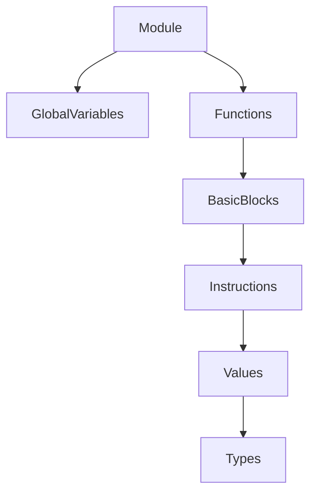
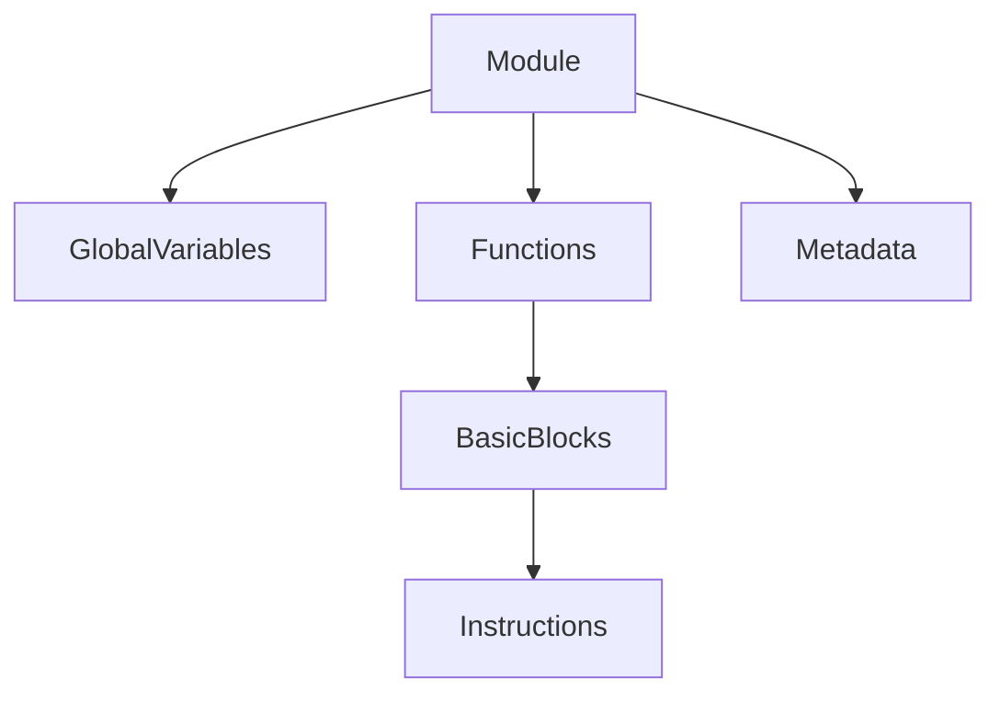
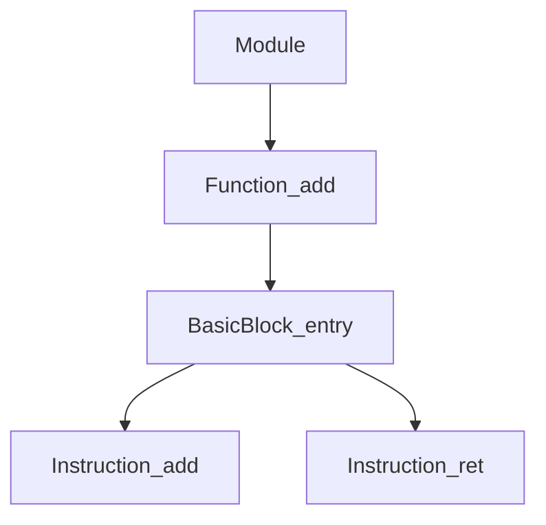
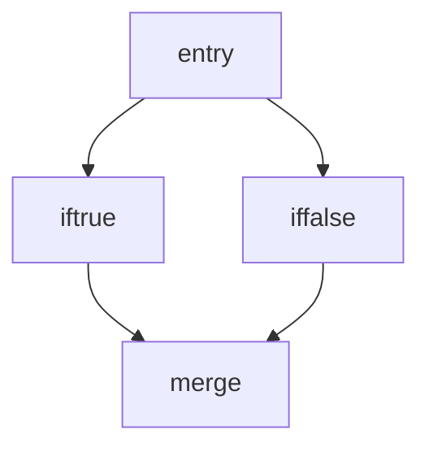
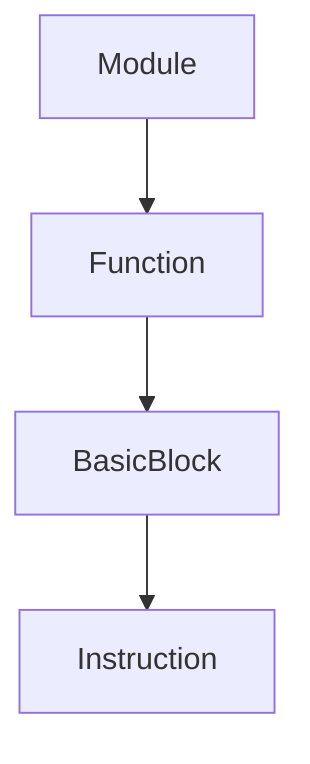

import AdBanner from '@site/src/components/AdBanner';
import Tabs from '@theme/Tabs';
import TabItem from '@theme/TabItem';
import { ComicQA } from '../../mcq/interview_question/Question_comics' ;

# Understanding LLVM IR Hierarchy


📩 Interested in deep dives like pipelines, cache, and compiler optimizations?

<div
  style={{
    width: '100%',
    maxWidth: '900px',
    margin: '1rem auto',
  }}
>
  <iframe
    src="https://docs.google.com/forms/d/e/1FAIpQLSebP1JfLFDp0ckTxOhODKPNVeI1e21rUqMJ0fbBwJoaa-i4Yw/viewform?embedded=true"
    style={{
      width: '100%',
      minHeight: '620px',
      border: '0',
      borderRadius: '12px',
      background: '#fff',
    }}
    loading="lazy"
  >
    Loading…
  </iframe>
</div>

        >>>>>>>>>>>>>>>>> Module → Function → Basic Block → Instruction

LLVM IR is not just random text it’s a **strictly layered architecture**.

If you don’t know *why we even need IR*, read the previous article: [Intro to LLVM IR](https://www.compilersutra.com/docs/llvm/llvm_ir/intro_to_llvm_ir/#why-do-compilers-need-ir).
LLVM IR specifically solves the classic **m × n explosion → m + n sanity** problem in compiler design (frontends × backends). If you’re wondering *what that means and how LLVM fixes it*, read: [Why / What is LLVM](https://www.compilersutra.com/docs/llvm/llvm_basic/why_what_is_llvm/).

This article, as the title suggests, **Hierarchy of LLVM IR Constructs**, focuses on the structure that powers everything. Because if you don’t understand this hierarchy, you’ll keep “reading IR” but never *reasoning* about it.

You might recognize instructions.
You might identify a `br` or a `phi`.
But unless you see how they sit inside **basic blocks**, inside **functions**, inside a **module**, governed by **types and values**, you are missing the architectural picture.

:::tip note
If you don’t understand **Module → Function → Basic Block → Instruction → Value → Type**, you don’t truly understand how:

* SSA works
* CFG is formed
* Dominance is computed
* Passes are structured and composed
  :::

:::caution *Every analysis and optimization depends on this structure.*
:::

Dominance trees? Built over basic blocks.
LoopInfo? Derived from CFG edges.
mem2reg? Inserts phi nodes at dominance frontiers.
Inliner? Operates at the function level but affects module scope.

Nothing in LLVM is random.
Everything is scoped.
Everything is layered.
Everything is intentional.

And once you internalize this hierarchy, LLVM IR stops looking like text
it starts looking like a **well-engineered graph machine**.

So let’s slow down, zoom out, and rebuild your uunderstanding before going more in depth.

Let’s begin.

<Tabs>
  <TabItem value="social" label="📣 Social Media">

            - [🐦 Twitter - CompilerSutra](https://twitter.com/CompilerSutra)
            - [💼 LinkedIn - Abhinav](https://www.linkedin.com/in/abhinavcompilerllvm/)
            - [📺 YouTube - CompilerSutra](https://www.youtube.com/@compilersutra)
            - [💬 Join the CompilerSutra Discord for discussions](https://discord.com/invite/ty5xKCkyRP)

  </TabItem>
</Tabs>

<div>
    <AdBanner />
</div>

---

## Table of Contents
 
- [Why LLVM IR Hierarchy Matters](#why-llvm-ir-hierarchy-matters)
- [The Full IR Hierarchy Overview](#the-full-ir-hierarchy-overview)
- [Module Level Architecture](#module-level-structure)
- [Function Level Structure](#function-hierarchy-view)
- [Basic Blocks and Control Flow](#basic-blocks-and-control-flow)
- [Instructions Values and SSA](#instructions-values-and-ssa)
- [Hands On Generate Inspect Debug](#hands-on-generate-inspect-debug)
- [Deep Dive CFG Dominance and Phi](#deep-dive-cfg-dominance-and-phi)
- [Common Mistakes and Gotchas](#common-mistakes-and-gotchas)
- [Tools and Workflow](#tools-and-workflow)
- [Real World Use Cases](#real-world-use-cases)
- [Summary](#summary)
- [FAQs](#faqs)
- [What Is Next](#what-is-next)


<div>
    <AdBanner />
</div>

## Why LLVM IR Hierarchy Matters
LLVM is designed around **structured transformation**.

Passes operate at specific **levels** (what people often call “granularity” meaning *how big is the thing we are working on?*).

If a pass runs on:

* The whole file → Module level
* One function → Function level
* One loop → Loop level

That “size” is the level of operation.


:::important Why Was Hierarchy Created in LLVM?
:::

Let’s understand this properly.

<Tabs>
<TabItem value="flat" label="If There Was No Hierarchy">

***❌ No Clear Boundaries***

If IR was just one long list of instructions:

* Where does a function start?
* Where does it end?
* How do we build a call graph?

***❌ Analysis Becomes Messy***

* Dominance would be unclear.
* Loop detection would be unreliable.
* SSA would be hard to enforce.

***❌ Unsafe Optimizations***

If you modify one part:

* What exactly changed?
* What analyses are invalid now?

***❌ Poor Scalability***

Parallel optimization becomes dangerous.

</TabItem>

<TabItem value="structured" label="With LLVM Hierarchy">

***✅ Clear Ownership***

* Instruction → inside Basic Block
* Basic Block → inside Function
* Function → inside Module

***✅ Scoped Analysis***

* DominatorTree → function scope
* LoopInfo → function scope
* Inliner → call graph scope

***✅ Safe Invalidation***

If a function changes,
only that function’s analyses need recomputation.

***✅ Scalable Compilation***

Functions can be optimized independently.
Modules can be compiled separately.

</TabItem>
</Tabs>


:::tip Simple Real-World Analogy
:::

If someone asks:

> “Where do humans live in the universe?”

You don’t answer with one word.

You explain it like this:

<Tabs>
<TabItem value="universe" label="Universe Hierarchy">

* Humans live in a **room**
* Room is inside a **home**
* Home is on a **street**
* Street is inside a **city**
* City is inside a **district**
* District is inside a **state**
* State is inside a **country**
* Country is on **Earth**
* Earth is in the **Solar System**
* Solar System is in the **Milky Way**
* Milky Way is in the **Universe**
---
</TabItem>

<TabItem value="llvm" label="LLVM IR Hierarchy">

* Instruction lives in a **Basic Block**
* Basic Block lives in a **Function**
* Function lives in a **Module**
* Module lives inside a **Program / Compilation Unit**

</TabItem>
</Tabs>

See the pattern?

You describe existence using **layers of containment**.

Each level:

* Has clear boundaries
* Has its own rules
* Exists inside something bigger


:::important Why This Matters for LLVM
:::

Hierarchy makes these possible:

***1️⃣ DominatorTree***

Requires structured basic blocks inside functions.

***2️⃣ LoopInfo***

Needs well-defined control flow inside a function.

***3️⃣ Inliner***

Needs function boundaries and module-level visibility.

***4️⃣ Pass Manager Design***

Passes operate safely at known levels.


***What we Understood***

Hierarchy was created because compilers need:

* Clear boundaries
* Safe optimization scope
* Efficient analysis
* Scalable design
* Predictable transformations

Without hierarchy, LLVM would be:

* Hard to analyze
* Hard to scale
* Hard to debug
* Easy to break

Hierarchy is not decoration.

It is the reason:

* SSA works cleanly
* CFG is valid
* Passes scale
* Optimizations remain correct

It turns LLVM from plain IR text
into a **structured, analyzable, optimization engine**.
LLVM is designed around **structured transformation**.


:::tip CompilerSutra Definition

> LLVM IR hierarchy is a layered structural model where a Module contains Functions, Functions contain Basic Blocks, Basic Blocks contain Instructions, and Instructions produce or consume Values governed by Types.

This layered design enables:

* Precise scoping
* Efficient analysis reuse
* Deterministic transformations
:::

Let's now see the hirerachy


<div>
    <AdBanner />
</div>

## The Full IR Hierarchy Overview



Let’s understand the hierarchy using a simple C example first then we’ll connect it to LLVM IR.

Suppose we have this C code:

```c
#include <stdio.h>

int add(int a, int b) {
    int sum = a + b;
    return sum;
}

int main() {
    int x = add(2, 3);
    printf("%d\n", x);
    return 0;
}
```

Now think in terms of **structure**, not syntax.

When `clang` compiles this file, it creates **one LLVM Module**.
That module represents this entire `.c` file as a single compilation unit.

Inside that Module, there are:

* Two Functions → `add` and `main`
* External declaration → `printf`
* Possibly global data (like format strings)

So the flow starts like this:

> **One source file → One LLVM Module → Multiple Functions**

Now zoom inside one function — say `add`.

The function `add` does not exist as one flat block of instructions.
It is divided into **Basic Blocks**.

Even simple functions have at least one basic block called `entry`.

Inside `add`, the structure becomes:

> Function → Basic Block(s) → Instructions

Now zoom further.

Inside the `entry` block of `add`, LLVM IR will contain instructions like:

* Add two numbers
* Return the result

Each of those lines is an **Instruction**.

Each instruction:

* Produces a **Value**
* Uses other **Values**
* Has a specific **Type**

So the complete structural flow becomes:


> Module <div/>
> → contains Functions <div/>
> → each Function contains Basic Blocks <div/>
> → each Basic Block contains Instructions <div/>
> → each Instruction produces or consumes Values <div/>
> → each Value has a Type <div/>

This is not random nesting. It is a containment hierarchy.

Just like:

* A building contains floors
* Floors contain rooms
* Rooms contain objects

LLVM IR works the same way:

* Module contains functions
* Functions contain control flow
* Control flow contains computation
* Computation manipulates typed values

This layered flow is what allows:

* Control Flow Graph to be built (from basic blocks)
* SSA to exist (values defined once per function scope)
* Dominator Tree to be computed (inside function boundaries)
* Passes to operate safely at different levels

So before we study each construct individually, remember this mental model:

LLVM IR is not flat text.
It is a **structured, layered system of containment**.

Everything lives inside something bigger.

Let's now understand each one in better way

<div>
    <AdBanner />
</div>


## Module Level Structure

A **Module** represents a single translation unit — typically one source file after compilation.

When you run:

```bash
clang -S -emit-llvm test.c -o test.ll
```

You get **one LLVM Module**.

That module is the top-level container.
Everything lives inside it.

It contains:

* Functions
* Global variables
* Constant data
* Metadata (debug info, annotations)
* Target information (data layout, triple)
* Linkage and visibility rules

Think of a Module as:

> The universe of a single compilation unit.

---

### Example Module

```llvm
@global = global i32 42

define i32 @main() {
entry:
  ret i32 0
}
```

What is happening here?

* `@global` → Global variable stored at module scope
* `@main` → Function defined inside the module
* `entry:` → Basic block inside main

Everything belongs to the same module.


***Module Hierarchy Diagram***



This shows containment.

Module owns everything below it.


***Key Properties***

| Feature        | Description                   |
| -------------- | ----------------------------- |
| Linkage        | external, internal, private   |
| Data layout    | Target-specific layout rules  |
| Named metadata | Debug info, annotations       |
| Target triple  | Architecture + OS information |


***Why Module Matters***

1️⃣ Linkage affects inlining across files
2️⃣ Visibility determines optimization scope
3️⃣ Global variables impact alias analysis
4️⃣ LTO (Link Time Optimization) works at module level

If module-level invariants break → verifier errors.

**Key Takeaway:**
Module defines the global optimization boundary.

<div>
    <AdBanner />
</div>


**Function Level Structure**

Inside the module, we have **Functions**.

A Function defines:

* Name
* Return type
* Parameter list
* Calling convention
* Attributes
* Body (basic blocks)

Example:

```python
define i32 @add(i32 %a, i32 %b) {
entry:
  %sum = add i32 %a, %b
  ret i32 %sum
}
```

Let’s break it down:

* `define i32` → return type
* `@add` → function name
* `(i32 %a, i32 %b)` → parameters
* `{ ... }` → body
* `entry:` → first basic block


## Function Hierarchy View



This shows one function with one basic block.


***Important Concepts***

| Concept             | Why Important                  |
| ------------------- | ------------------------------ |
| Calling convention  | Must match ABI                 |
| Attributes          | readonly, nounwind, inlinehint |
| Argument attributes | noalias, byval                 |
| Entry block         | Must exist                     |


***Why Function Level Matters***

Most scalar optimizations run here:

* InstCombine
* GVN
* DCE
* SROA
* Mem2Reg

Dominance, SSA, and LoopInfo are computed per function.

**Key Takeaway:**
Function is the primary unit of optimization.

<div>
    <AdBanner />
</div>


## Basic Blocks and Control Flow

A **Basic Block** is:

* A sequence of instructions
* Single entry
* Single exit (must end with terminator)

A function is not random instructions — it is a graph of basic blocks.


**Terminator Instructions**

A basic block must end with:

* `br` (branch)
* `switch`
* `ret`
* `invoke`
* `unreachable`

Example:

```python
entry:
  %cond = icmp eq i32 %a, 0
  br i1 %cond, label %iftrue, label %iffalse
```

Here:

* `%cond` → instruction
* `br` → terminator
* `%iftrue` and `%iffalse` → successor blocks


***Control Flow Graph (CFG)***

Basic blocks form a graph.



This is the CFG.

Each arrow is a possible control flow path.


***Generate CFG***

```python
opt -passes=dot-cfg test.ll -disable-output       
dot -Tpng .main.dot -o main.png     
open main.png     
```

LLVM generates `.dot` files for visualization.

---

### Basic Block Invariants

* Must end with exactly one terminator
* No instructions allowed after terminator
* Each block belongs to exactly one function
* No mid-block jumps allowed

Without structured basic blocks:

* DominatorTree cannot be computed
* Loop detection fails
* SSA construction becomes impossible


***Flow Summary***

Let’s combine everything:



The containment is strict:

* Module owns functions
* Function owns blocks
* Block owns instructions

That structure is what enables:

* CFG construction
* Dominance analysis
* Loop analysis
* SSA form
* Safe optimization passes

LLVM IR is not flat text.

It is a **structured, layered control-flow machine**.


## Instructions Values and SSA

In LLVM:

* Every instruction producing a result is a **Value**
* Each Value has exactly one definition [(SSA)](https://www.compilersutra.com/docs/llvm/llvm_Curriculum/level0/Static_Single_Assignment/)

Example (non-SSA C style):

```c
x = 1;
x = 2;
```

After mem2reg:

```llvm
%x1 = ...
%x2 = ...
```

Phi node example:

```llvm
%x = phi i32 [1, %iftrue], [2, %iffalse]
```

Why SSA?

* Enables dataflow analysis
* Simplifies optimization reasoning

**Key Takeaway:**
SSA transforms variable assignment into graph-based value flow.

<div>
    <AdBanner />
</div>

---

## Hands On Generate Inspect Debug

<Tabs>
<TabItem value="generate" label="Generate IR">

```bash
clang -S -emit-llvm test.c -o test.ll
```

</TabItem>

<TabItem value="assemble" label="Assemble to Bitcode">

```bash
llvm-as test.ll -o test.bc
```

</TabItem>

<TabItem value="disassemble" label="Disassemble">

```bash
llvm-dis test.bc -o test.ll
```

</TabItem>

<TabItem value="opt" label="Run Optimization">

```bash
opt -passes="instcombine" test.ll -S -o out.ll
```

</TabItem>
</Tabs>

---

## Deep Dive CFG Dominance and Phi

### Why Dominance Exists

A node A dominates B if every path to B passes through A.

Dominance enables:

* Safe code motion (LICM)
* Phi placement
* Dead code elimination

Mini example:

Input:

```c
if (a)
  x = 1;
else
  x = 2;
return x;
```

IR requires:

* Two blocks
* Merge block
* Phi node

Without dominance frontier computation → incorrect SSA.

---

## Common Mistakes and Gotchas

### 1. Missing Terminator

Every Basic Block must end with a terminator.

### 2. Type Mismatch

LLVM is strongly typed.

### 3. Invalid SSA

Using a value before definition.

### 4. Ignoring Module-Level Metadata

Debug info can break if improperly modified.

---

## Tools and Workflow

| Tool     | Purpose           |
| -------- | ----------------- |
| clang    | Emit IR           |
| llvm-as  | Assemble          |
| llvm-dis | Disassemble       |
| opt      | Analyze/transform |
| llc      | Lower to assembly |
| lli      | Interpret bitcode |

Debugging:

```bash
opt -verify-each test.ll -S
```

---

## Real World Use Cases

### 1. Custom Static Analysis

Traverse:

* Module → Functions → Blocks → Instructions

### 2. Writing FunctionPass

Operate only within Function boundary.

### 3. CFG Visualization

Debug control-flow errors.

---

## Summary

LLVM IR hierarchy is:

* Structured
* Layered
* SSA-based
* Analysis-friendly

Understanding it unlocks:

* Correct pass writing
* Efficient debugging
* Safe transformations

**Hierarchy is the skeleton of LLVM.**

---

## FAQs

<ComicQA
question="What is the smallest unit in LLVM IR?"
answer="Instruction."
code={`%x = add i32 %a, %b`}
example="Produces a Value."
whenToUse="Understanding SSA."
/>

<ComicQA
question="Why are basic blocks single-entry?"
answer="Ensures structured CFG."
code={`br label %next`}
example="No mid-block jumps."
whenToUse="CFG reasoning."
/>

<ComicQA
question="What enforces SSA?"
answer="Verifier and construction rules."
code={`opt -verify-each test.ll`}
example="Detects invalid use."
whenToUse="Debugging invalid IR."
/>

<ComicQA
question="Why does phi need dominance?"
answer="Because definitions must dominate uses."
code={`%x = phi i32 [...]`}
example="Merge block example."
whenToUse="Understanding mem2reg."
/>

<ComicQA
question="What is Module scope?"
answer="Whole translation unit."
code={`@g = global i32 0`}
example="Global variable."
whenToUse="Interprocedural passes."
/>

<ComicQA
question="Can instruction exist without block?"
answer="No."
code={`Invalid IR`}
example="Verifier error."
whenToUse="IR construction."
/>

---

## What Is Next

* Study LLVM LangRef deeply
* Implement simple FunctionPass
* Explore DominatorTree and LoopInfo
* Inspect O2 pipeline structure


<Tabs>
  <TabItem value="docs" label="📚 Documentation">
             - [CompilerSutra Home](https://compilersutra.com)
                - [CompilerSutra Homepage (Alt)](https://compilersutra.com/)
                - [Getting Started Guide](https://compilersutra.com/get-started)
                - [Skip to Content (Accessibility)](https://compilersutra.com#__docusaurus_skipToContent_fallback)


  </TabItem>

  <TabItem value="tutorials" label="📖 Tutorials & Guides">

        - [AI Documentation](https://compilersutra.com/docs/Ai)
        - [DSA Overview](https://compilersutra.com/docs/DSA/)
        - [DSA Detailed Guide](https://compilersutra.com/docs/DSA/DSA)
        - [MLIR Introduction](https://compilersutra.com/docs/MLIR/intro)
        - [TVM for Beginners](https://compilersutra.com/docs/tvm-for-beginners)
        - [Python Tutorial](https://compilersutra.com/docs/python/python_tutorial)
        - [C++ Tutorial](https://compilersutra.com/docs/c++/CppTutorial)
        - [C++ Main File Explained](https://compilersutra.com/docs/c++/c++_main_file)
        - [Compiler Design Basics](https://compilersutra.com/docs/compilers/compiler)
        - [OpenCL for GPU Programming](https://compilersutra.com/docs/gpu/opencl)
        - [LLVM Introduction](https://compilersutra.com/docs/llvm/intro-to-llvm)
        - [Introduction to Linux](https://compilersutra.com/docs/linux/intro_to_linux)

  </TabItem>

  <TabItem value="assessments" label="📝 Assessments">

        - [C++ MCQs](https://compilersutra.com/docs/mcq/cpp_mcqs)
        - [C++ Interview MCQs](https://compilersutra.com/docs/mcq/interview_question/cpp_interview_mcqs)

  </TabItem>

  <TabItem value="projects" label="🛠️ Projects">

            - [Project Documentation](https://compilersutra.com/docs/Project)
            - [Project Index](https://compilersutra.com/docs/project/)
            - [Graphics Pipeline Overview](https://compilersutra.com/docs/The_Graphic_Rendering_Pipeline)
            - [Graphic Rendering Pipeline (Alt)](https://compilersutra.com/docs/the_graphic_rendering_pipeline/)

  </TabItem>

  <TabItem value="resources" label="🌍 External Resources">

            - [LLVM Official Docs](https://llvm.org/docs/)
            - [Ask Any Question On Quora](https://compilersutra.quora.com)
            - [GitHub: FixIt Project](https://github.com/aabhinavg1/FixIt)
            - [GitHub Sponsors Page](https://github.com/sponsors/aabhinavg1)

  </TabItem>

  <TabItem value="social" label="📣 Social Media">

            - [🐦 Twitter - CompilerSutra](https://twitter.com/CompilerSutra)
            - [💼 LinkedIn - Abhinav](https://www.linkedin.com/in/abhinavcompilerllvm/)
            - [📺 YouTube - CompilerSutra](https://www.youtube.com/@compilersutra)
            - [💬 Join the CompilerSutra Discord for discussions](https://discord.com/invite/ty5xKCkyRP)

  </TabItem>
</Tabs>


---

Next in series: **Optimization Workflow and Pass Pipelines in LLVM.**
`