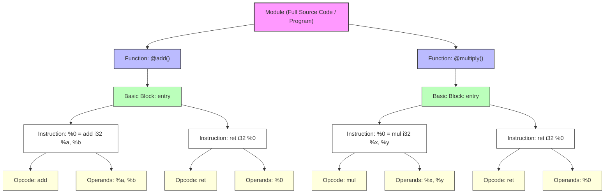
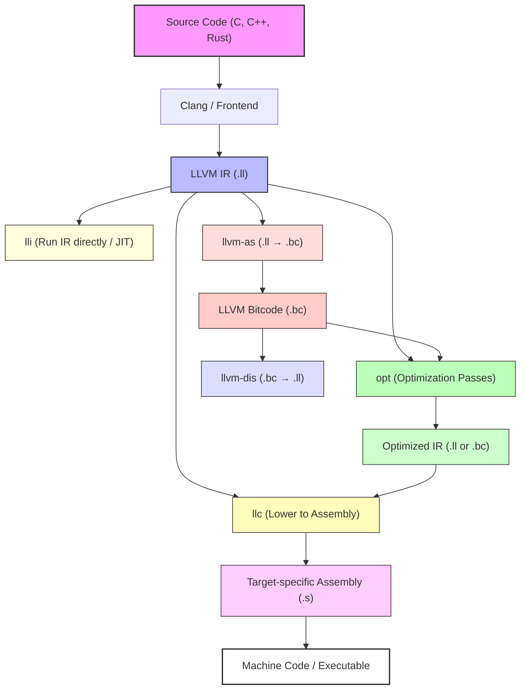

import AdBanner from '@site/src/components/AdBanner';
import Tabs from '@theme/Tabs';
import TabItem from '@theme/TabItem';
import { ComicQA } from '../../mcq/interview_question/Question_comics' ;

# LLVM IR Explained: The Backbone of Modern Compilers

***LLVM IR (Intermediate Representation)*** is the central foundation of the entire LLVM compiler framework. It acts as a universal, platform-independent code format that all frontends and backends in LLVM rely on. 

By sitting between source code and machine code, ***LLVM IR unlocks powerful optimizations, provides extraordinary portability***, and allows LLVM to remain highly modular across languages, tools, and hardware targets.

More importantly, LLVM IR is designed to be both human-readable and machine-friendly.

:::caution LLVM IR 
>> It is  **SSA-based (Static Single Assignment)** which gives compilers a precise, 
>> way to model program behavior, enabling sophisticated analyses  and optimization
>> such as ***constant propagation,dead code elimination, loop optimizations, alias analysis***, and more. 

As every ***frontend translates to the similar IR***, these optimizations automatically benefit any programming language that uses LLVM C, C++, Rust, Swift, Julia, Zig, and many others.
:::

:::tip Backend Side
>> LLVM IR makes it easier to generate machine code for multiple CPU and GPU architectures, including x86, ARM, AArch64, RISC-V, NVIDIA, AMD GPUs, and even custom or experimental hardware. 

This modularity is one of the biggest reasons LLVM is widely used in compilers, JIT engines, static analyzers, binary tools, and academic research.
:::

:::note In short
 ***LLVM IR is the single, powerful bridge*** that connects high-level languages to highly optimized machine code, giving LLVM its flexibility, performance, and dominance in modern compiler design.
:::

<div>
    <AdBanner />
</div>


## Table of Contents

1. [Why Do Compilers Need IR?](#why-do-compilers-need-ir)
2. [What is Intermediate Representation (IR)?](#what-is-intermediate-representation-ir)
3. [What is LLVM IR?](#what-is-llvm-ir)
4. [Evolution of IR in Compilers](#history--evolution-of-ir-in-compilers)
5. [Key Features of LLVM IR](#key-features-of-llvm-ir)
6. [Generating LLVM IR using Clang](#generating-llvm-ir-using-clang)
7. [Structure of LLVM IR](#structure-of-llvm-ir)
8. [Optimizing LLVM IR using opt](#optimizing-llvm-ir-using-opt)
9. [LLVM Developer Tools Overview](#llvm-developer-tools-overview)
10. [Real-World Applications of LLVM IR](#real-world-applications-of-llvm-ir)
11. [Summary](#summary)
12. [FAQs](#faqs)
13. [What’s Next](#whats-next)

---

## Why Do Compilers Need IR?

Modern compilers face a major challenge:-
        - They must handle **many different programming languages**
        - and generate code for **many different hardware architectures**.

For example:

* Languages → C, C++, Rust, Swift, Python (via LLVM), Zig, Julia…
* Targets → x86, ARM, AArch64, RISC-V, PowerPC, GPUs…

Without IR, the compiler must implement **every language-to-hardware mapping manually**, which quickly becomes unmanageable:

```rust
Languages × Targets = Total Compiler Work
10        × 10      = 100 code generators!
```

This is why IR exists.

- [💬 Join the CompilerSutra Discord for discussions](https://discord.com/invite/ty5xKCkyRP)


:::important **Why M × N?**  
To understand *why compilers explode into M × N combinations*  
and how LLVM solves it using IR, check out:  
👉 [Why M × N Happens in Compilers](https://www.compilersutra.com/docs/llvm/llvm_basic/why_what_is_llvm/)  
:::

**IR Splits the Compiler into Three Clear Stages**

Instead of connecting every language to every architecture directly, LLVM breaks the workflow into:

**Frontend → IR → Middle-End (Optimizer) → Backend**

This reduces complexity dramatically.

 **Role of Each Component**

| Component     | Responsibility                                                                       | Benefit                                |
| ------------- | ------------------------------------------------------------------------------------ | -------------------------------------- |
| **Frontend**  | Parses source code and converts it into LLVM IR                                      | One frontend per language              |
| **Optimizer** | Performs advanced IR transformations (inlining, DCE, loop opts, vectorization, etc.) | Shared optimizations for all languages |
| **Backend**   | Converts optimized IR into target-specific machine code                              | One backend per hardware architecture  |

:::caution Why This Design Is So Powerful
✔ **Universal optimizer**
- All languages that compile to IR automatically benefit from the same optimizations.

✔ **Massive portability**
- Add a new backend → all languages can target the new hardware.

✔ **Modularity & Maintainability**
- Teams can work independently on frontends, optimizations, and backends.

✔ **Better performance**
- SSA-based IR lets compilers reason better about the program and apply deeper transformations.
:::


<div>
  <AdBanner />
</div>


## What is Intermediate Representation (IR)?

Now that we’ve discussed *why* IR exists and *why* it is essential in modern compilers, let's formally define it.

:::tip Defination by CompilerSutra
**Intermediate Representation (IR)** is a **normalized, language-independent** code format used internally by compilers to analyze, optimize, and transform programs.

It acts as a bridge between the frontend (languages) and the backend (hardware), enabling portability and powerful optimizations.
:::


**Types of IR**

IR comes in different abstraction levels depending on how close it is to the source code or machine code:

| IR Level          | Close To         | Example           |
| ----------------- | ---------------- | ----------------- |
| **High-Level IR** | Source code      | AST, GIMPLE       |
| **Mid-Level IR**  | Abstract machine | **LLVM IR**       |
| **Low-Level IR**  | Assembly         | RTL, SelectionDAG |

:::note Why IR Matters

<details>
<summary>Expand</summary>

**IR provides a balance between readability and machine operability**. 

It is high-level enough for aggressive optimization and low-level enough for hardware mapping.

**Common benefits**:
* Faster optimizations
* Retargetable compilation
* Better tools and analysis frameworks
* Secure and reliable transformations
* Reduce redundant work

</details>
:::

## What is LLVM IR?

By the time you’ve reached here, if you’ve followed everything carefully, you should have a clear understanding of what an Intermediate Representation (IR) is and why compilers rely on it.

Now let’s dive into the most popular, powerful, and industry-defining IR used today **LLVM IR**.

:::caution  By Defination
**LLVM IR (Intermediate Representation)** is a ***low-level, strongly typed, SSA-based, and target-independent representation*** used inside the ***LLVM compiler framework***.

It acts as the “common language” that all frontends generate and all backends consume, enabling deep optimizations and broad portability across hardware architectures.
:::

> LLVM IR is a mid-level, strongly-typed IR used by LLVM. It comes in three forms:

| IR Format | Description | Tool |
|---------|-------------|------|
| `.ll` | Human-readable text | clang `-S -emit-llvm` |
| `.bc` | Compact bitcode | opt, llc |
| In-Memory | Compiler internal form | LLVM API |

:::tip
The same IR can be:
Frontend-generated → Optimized → JIT/AOT emitted

 SSA: Static Single Assignment
Every variable is assigned once, improving optimization accuracy.
:::


<div>
  <AdBanner />
</div>


## History & Evolution of IR in Compilers

| Compiler System | IR Used      | Origin Era |
| --------------- | ------------ | ---------- |
| Early compilers | Ad-hoc forms | 1960s      |
| GCC             | GIMPLE + RTL | 1987       |
| JVM             | Bytecode     | 1995       |
| LLVM            | LLVM IR      | 2000+      |

**LLVM IR brought significant improvements over earlier IRs:**

* **Full SSA form** → simplifies optimizations like constant propagation, dead code elimination, and value tracking.
* **Cleaner and strongly-typed system** → reduces errors and makes transformations safer.
* **Easier retargeting** → the same IR works for multiple architectures, including CPUs, GPUs, and AI accelerators.
* **JIT support** → enables runtime compilation and optimization.


<details>
<summary>Difference: LLVM IR vs GCC GIMPLE/RTL</summary>

| Feature                         | LLVM IR                  | GCC GIMPLE/RTL       |
| ------------------------------- | ------------------------ | -------------------- |
| **SSA**                         | Full                     | Partial              |
| **Readability**                 | Very high                | Low                  |
| **API / Ecosystem**             | Rich                     | Limited              |
| **Extensibility**               | Excellent                | Hard                 |
| **Modern Targets**              | Strong (GPU/AI/Embedded) | Limited              |
| **Debugging & Tooling**         | Easy & well-integrated   | Harder, less modular |
| **JIT / Runtime Optimizations** | Supported                | Not native           |


</details>

> **Key Takeaway:** LLVM IR is **designed for modern compiler needs**, offering **modularity, clarity, and cross-platform support**, whereas older IRs like GCC’s GIMPLE/RTL are more rigid and harder to extend.


## Key Features of LLVM IR

* Strongly typed
* Full SSA support
* Target-independent binary format
* Supports profile-guided & link-time optimization (LTO)
* Rich metadata (debug, alias, optimization hints)
* Designed for JIT & AOT compilation


## Generating LLVM IR using Clang

Before we dive into the commands, let’s understand **what you will learn here**:

* How **C code is converted into LLVM Intermediate Representation (IR)**.
* The difference between **Text IR (`.ll`)** and **Bitcode (`.bc`)**.
* How to **inspect IR generated by the compiler** to understand what optimizations or transformations have been applied.
* The role of IR as a **bridge between high-level source code and low-level machine code**.

Essentially, by the end of this section, you will know **how your code looks internally in LLVM**, why LLVM represents it this way, and how to explore it using LLVM tools.


<Tabs>
<TabItem value="Generate .ll" label="Emit Text IR (.ll)">

```rust
# Generate human-readable LLVM IR (.ll) from C source
clang -S -emit-llvm test.c -o test.ll
```
 Text IR is human-readable and allows you to inspect the compiler’s representation of your program.
 It’s useful for debugging, learning, and understanding optimizations.

</TabItem>

<TabItem value="Generate .bc" label="Emit Bitcode (.bc)">

```rust
# Generate LLVM bitcode (.bc) from C source
clang -c -emit-llvm test.c -o test.bc
```
 Bitcode is a compact, binary form of IR.
 It’s efficient for storage, linking, and further optimization passes.

</TabItem>

<TabItem value="View IR from Object" label="View IR from Object File">

```rust
# Convert object file or bitcode back to textual IR
llvm-dis a.out -o output.ll
```
You can disassemble compiled object files or bitcode back into textual IR to inspect the compiler’s transformations.

</TabItem>

</Tabs>

---

**Example C Code**

```c
int add(int a, int b) {
    return a + b;
}
```


 **Extracted LLVM IR (.ll)**

```llvm
define i32 @add(i32 %a, i32 %b) {
entry:
    %0 = add i32 %a, %b
    ret i32 %0
}
```

> **Explanation:**
>
> * `define i32 @add(i32 %a, i32 %b)` → Declares the function `add` returning a 32-bit integer with two 32-bit integer parameters.
> * `entry:` → Entry block of the function.
> * `%0 = add i32 %a, %b` → Adds `%a` and `%b` in SSA form and stores the result in `%0`.
> * `ret i32 %0` → Returns the computed value.

**Key Takeaways**

* LLVM IR is **SSA-based**, typed, and target-independent.
* Text IR (`.ll`) is human-readable; Bitcode (`.bc`) is efficient for tools.
* Understanding IR is the first step to exploring **LLVM optimizations, backends, and compiler design**.

<div>
  <AdBanner />
</div>


## Structure of LLVM IR

LLVM IR is highly structured, which allows compilers to analyze and optimize programs efficiently. It is organized hierarchically from the entire program down to individual instructions.

| Component       | Meaning                                        | Explanation                                                                                                                                                      |
| --------------- | ---------------------------------------------- | ---------------------------------------------------------------------------------------------------------------------------------------------------------------- |
| **Module**      | Full program / source code / library           | The top-level container in LLVM IR. A module represents your **entire source file, program, or library**. It contains functions, global variables, and metadata. |
| **Function**    | Executable unit                                | Functions correspond to routines in your source code. Each has a **return type, parameters, and a body** made of basic blocks.                                   |
| **Basic Block** | Straight-line code with one entry and one exit | A basic block is a **sequence of instructions executed sequentially**, ending with a control flow instruction like `ret` or `br`.                                |
| **Instruction** | Single operation                               | Instructions perform **arithmetic, memory, or control operations**. Each instruction has:                                                                        |
|   **Opcode**    | Operation type                                 | The action performed, e.g., `add`, `sub`, `mul`, `load`, `store`, `call`, etc.                                                                                   |
|   **Operands**  | Input / Output values                          | The data the instruction operates on, e.g., `%a`, `%b`, constants, or pointers.                                                                                  |


**Example: Structure in Practice**


```c
int add(int a, int b) {
    return a + b;
}
```

**LLVM IR:**

```llvm
define i32 @add(i32 %a, i32 %b) {   ; Function
entry:                             ; Basic Block
    %0 = add i32 %a, %b            ; Instruction
    ret i32 %0                     ; Instruction
}
```

**Explanation:**

1. **Module** → The entire source code / compiled unit (`.ll` file).
2. **Function** → Each routine/procedure inside the module.
3. **Basic Block** → Straight-line sequence of instructions.
4. **Instruction** → Individual operation inside a basic block.
5. **Opcode** → The operation type (`add`, `mul`, `ret`).
6. **Operands** → Inputs and outputs used by the instruction (`%a`, `%b`, `%0`).



**Key Points**

* Modules can contain **multiple functions**, **global variables**, and metadata.
* Functions consist of **one or more basic blocks**.
* Basic blocks ensure **straight-line execution**, ending with a terminator like `ret`, `br`, or `switch`.
* Instructions are the **atomic operations** in LLVM IR, each producing a value in SSA form.


## Optimizing LLVM IR using opt

**What is `opt`?**
:::tip defination
`opt` is a **command-line tool provided by LLVM** that allows you to **analyze, transform, and optimize LLVM Intermediate Representation (IR)**.
:::
It is primarily used to:

* Apply **predefined optimization levels** (e.g., `-O1`, `-O2`, `-O3`)
* Run **individual passes** (e.g., `mem2reg`, `instcombine`, `dce`)
* Experiment with **custom pass pipelines** for research or debugging
* Produce **optimized IR or bitcode** ready for code generation

>>Think of `opt` as the **“optimizer engine” of LLVM**, sitting between your **frontend** (Clang, Rustc, etc.) and the **backend** (machine code generator).


:::caution **Why Use `opt`?**

* **Improve performance** of your program
* **Simplify IR** for better analysis or debugging
* **Experiment with compiler optimizations** without recompiling from source
* **Understand how specific LLVM passes transform IR**
:::
> **Tip:** Run `opt --help` to see the full list of available options and passes.
> In the next article, we will cover **how to build and customize your own optimization pipelines**.


**Common Optimization Workflows**

```rust
# Apply standard optimization level O2 to bitcode
opt -O2 test.bc -o opt.bc
```

> Applies a set of LLVM optimization passes to improve performance and reduce code size.

```rust
# Apply a specific pass (mem2reg) on textual IR
opt -S -mem2reg test.ll -o mem2reg.ll
```

> Promotes memory allocations (alloca) to registers (SSA values).
> The `-S` flag outputs **human-readable textual IR**.

```rust
# Inspect all available passes
opt -print-passes
```

> Prints the list of optimization passes in your LLVM installation, helping you understand which passes are available.

---

**How It Works**

1. Input: LLVM IR (`.ll`) or Bitcode (`.bc`)
2. `opt` runs **one or more optimization passes** (e.g., simplification, dead code elimination, inlining)
3. Output: Optimized LLVM IR or Bitcode
4. Optimized IR can then be sent to the **backend** to generate machine code

More about it we will cover in upcoming articles

---

## From LLVM IR to Machine Code

```rust
llc opt.bc -o output.s      # IR to Assembly
clang output.s -o a.out     # Assembly to Executable
```

Or single step:

```rust
clang test.bc -o a.out
```


<div>
    <AdBanner />
</div>


## LLVM Developer Tools Overview
| Command      | Purpose & Description                                                                                                                                          |
| ------------ | -------------------------------------------------------------------------------------------------------------------------------------------------------------- |
| **opt**      | Run **optimization passes** on LLVM IR or Bitcode. Used to improve performance, simplify IR, or experiment with custom optimization pipelines.                 |
| **llc**      | **Lower LLVM IR to assembly** for a target architecture. Converts `.bc` or `.ll` into target-specific machine code or `.s` files.                              |
| **llvm-as**  | **Assemble textual IR (`.ll`) into Bitcode (`.bc`)**. Useful for compiling human-readable IR into a binary form for faster processing.                         |
| **llvm-dis** | **Disassemble Bitcode (`.bc`) back to textual IR (`.ll`)**. Helpful for inspecting compiled IR or debugging transformations.                                   |
| **lli**      | **Run LLVM IR directly using JIT (Just-In-Time compiler)**. Executes `.ll` or `.bc` without generating machine code files. Useful for testing and prototyping. |


> To know more about these tools, visit: [CompilerSutra – Commonly Used LLVM Tools](https://www.compilersutra.com/docs/llvm/llvm_tools/#commonly-used-llvm-tools)



**Workflow**
1. **Source Code** → Processed by **Clang** to generate LLVM IR (`.ll`)
2. **LLVM IR** can go through:

   * **opt** → apply optimization passes
   * **llc** → lower IR to assembly
   * **lli** → run IR directly using JIT
   * **llvm-as** → convert `.ll` to bitcode (`.bc`)
3. **Bitcode** can be disassembled back to `.ll` using **llvm-dis**, or optimized with **opt**
4. Finally, **optimized IR** is lowered to assembly and compiled into **machine code / executable**


## Real-World Applications of LLVM IR

LLVM IR is not just a theoretical concept — it powers **many real-world systems, tools, and optimizations**. Some notable applications include:


:::caution Some Real World Application
* **Compiler Engineering**
  Used as the backbone for **modern compilers** like Swift, Rust, Zig, and Julia. IR enables **cross-language analysis, optimizations, and code generation**.

* **GPU and AI Compilers**
  Frameworks like **ROCm, CUDA-LLVM, and MLIR** rely on LLVM IR to generate optimized GPU code and accelerate AI workloads efficiently.

* **Binary Instrumentation & Security Analysis**
  LLVM IR allows **instrumenting binaries** for profiling, detecting vulnerabilities, or analyzing malware without modifying the original source code.

* **Sanitizers, Coverage Tools, and Fuzzers**
  Tools like **AddressSanitizer, ThreadSanitizer, coverage analysis tools, and fuzzers** leverage LLVM IR to inject runtime checks and track execution behavior.

* **Game Engines & JIT Compute Layers**
  Some game engines and high-performance applications use LLVM IR for **Just-In-Time (JIT) compilation** of scripts or compute shaders, providing **runtime optimization**.

* **Performance Tuning and Static Analysis**
  LLVM IR facilitates **advanced static analysis**, vectorization, loop optimizations, and other transformations for **high-performance software development**.
:::
> 
    LLVM IR’s flexibility, SSA form, and platform-independence make it the **heart of modern compiler and runtime systems**.


## Summary

* **IR is the core of modern compiler design**
  Intermediate Representation (IR) acts as a **bridge between high-level source code and machine code**, enabling analysis, optimization, and portability.

* **LLVM IR is the most advanced and widely-adopted IR today**
  Used by compilers like **Clang, Swift, Rust, Julia, and MLIR**, LLVM IR provides a **powerful, flexible, and modular framework** for compiler development.

* **SSA form, strong typing, and flexibility power industry compilers**
  LLVM IR’s **Static Single Assignment (SSA) form** simplifies optimizations and analysis, while its **strong typing** ensures correctness across transformations.

* **Same IR supports multiple frontends and backends**
  A single LLVM IR can be generated from **different programming languages** and compiled for **different hardware architectures**, drastically **reducing compiler development effort**.

* **Real-world impact**
  LLVM IR is used in **GPU/AI compilers, game engines, static analysis tools, fuzzers, and performance tuning**, proving its versatility and industrial relevance.

> Understanding LLVM IR is the first step toward mastering **modern compiler design and optimization pipelines**.


## FAQs

<ComicQA
question="How do I view LLVM IR from a compiled program?"
answer="Use 'llvm-dis' to convert LLVM bitcode (.bc) into human-readable LLVM IR (.ll)."
code={`llvm-dis test.bc -o test.ll`}
example="Inspect optimized IR to understand transformations."
whenToUse="When you want to debug or analyze the IR generated by your compiler."
/>

<ComicQA
question="Why does LLVM IR use SSA form?"
answer="SSA ensures each variable is written once, simplifying optimization like constant propagation and dead code elimination."
code={`%z = phi i32 [%x, %bb1], [%y, %bb2]`}
example="Tracking exact value origins in control flow."
whenToUse="Whenever control flow merges occur."
/>

<ComicQA
question="How do I compile LLVM IR into machine code?"
answer="Use llc or clang to lower IR to binary."
code={`llc test.bc -o test.s && clang test.s -o test.out`}
example="Generate native code for debugging performance."
whenToUse="End of build pipeline or testing backend output."
/>

<ComicQA
question="How do I optimize LLVM IR?"
answer="Use the 'opt' tool with either optimization levels like -O2 or specific passes."
code={`opt -O2 test.bc -o opt.bc`}
example="Speed up program execution or reduce code size."
whenToUse="Before lowering IR to machine code for performance-critical builds."
/>

<ComicQA
question="How can I inspect the available LLVM optimization passes?"
answer="Run 'opt -print-passes' to list all passes."
code={`opt -print-passes`}
example="Understand what transformations LLVM can perform."
whenToUse="When planning custom optimization pipelines."
/>

<ComicQA
question="How do I run LLVM IR directly without generating machine code?"
answer="Use 'lli' to JIT-execute LLVM IR or bitcode."
code={`lli test.bc`}
example="Test IR transformations or prototype code quickly."
whenToUse="For experimentation or debugging IR without a full build."
/>

<ComicQA
question="How do I convert human-readable LLVM IR to bitcode?"
answer="Use 'llvm-as' to assemble .ll files into .bc format."
code={`llvm-as test.ll -o test.bc`}
example="Prepare IR for optimization or JIT execution."
whenToUse="When you want the IR in a compact, binary format."
/>

<ComicQA
question="How do I promote memory variables to registers in LLVM IR?"
answer="Use the 'mem2reg' pass to convert allocas to SSA registers."
code={`opt -S -mem2reg test.ll -o mem2reg.ll`}
example="Simplify IR and enable better optimizations."
whenToUse="Early in the optimization pipeline, before intensive analysis."
/>


---

## What’s Next

* Advanced LLVM IR Optimizations (GVN, SROA, LICM)
* Writing Custom LLVM Passes
* Building Your Own Language Frontend with LLVM
* MLIR and Next-Gen Compiler Design

Follow continuation articles in this LLVM series on CompilerSutra.


<Tabs>
  <TabItem value="docs" label="📚 Documentation">
             - [CompilerSutra Home](https://compilersutra.com)
                - [CompilerSutra Homepage (Alt)](https://compilersutra.com/)
                - [Getting Started Guide](https://compilersutra.com/get-started)
                - [Skip to Content (Accessibility)](https://compilersutra.com#__docusaurus_skipToContent_fallback)


  </TabItem>

  <TabItem value="tutorials" label="📖 Tutorials & Guides">

        - [AI Documentation](https://compilersutra.com/docs/Ai)
        - [DSA Overview](https://compilersutra.com/docs/DSA/)
        - [DSA Detailed Guide](https://compilersutra.com/docs/DSA/DSA)
        - [MLIR Introduction](https://compilersutra.com/docs/MLIR/intro)
        - [TVM for Beginners](https://compilersutra.com/docs/tvm-for-beginners)
        - [Python Tutorial](https://compilersutra.com/docs/python/python_tutorial)
        - [C++ Tutorial](https://compilersutra.com/docs/c++/CppTutorial)
        - [C++ Main File Explained](https://compilersutra.com/docs/c++/c++_main_file)
        - [Compiler Design Basics](https://compilersutra.com/docs/compilers/compiler)
        - [OpenCL for GPU Programming](https://compilersutra.com/docs/gpu/opencl)
        - [LLVM Introduction](https://compilersutra.com/docs/llvm/intro-to-llvm)
        - [Introduction to Linux](https://compilersutra.com/docs/linux/intro_to_linux)

  </TabItem>

  <TabItem value="assessments" label="📝 Assessments">

        - [C++ MCQs](https://compilersutra.com/docs/mcq/cpp_mcqs)
        - [C++ Interview MCQs](https://compilersutra.com/docs/mcq/interview_question/cpp_interview_mcqs)

  </TabItem>

  <TabItem value="projects" label="🛠️ Projects">

            - [Project Documentation](https://compilersutra.com/docs/Project)
            - [Project Index](https://compilersutra.com/docs/project/)
            - [Graphics Pipeline Overview](https://compilersutra.com/docs/The_Graphic_Rendering_Pipeline)
            - [Graphic Rendering Pipeline (Alt)](https://compilersutra.com/docs/the_graphic_rendering_pipeline/)

  </TabItem>

  <TabItem value="resources" label="🌍 External Resources">

            - [LLVM Official Docs](https://llvm.org/docs/)
            - [Ask Any Question On Quora](https://compilersutra.quora.com)
            - [GitHub: FixIt Project](https://github.com/aabhinavg1/FixIt)
            - [GitHub Sponsors Page](https://github.com/sponsors/aabhinavg1)

  </TabItem>

  <TabItem value="social" label="📣 Social Media">

            - [🐦 Twitter - CompilerSutra](https://twitter.com/CompilerSutra)
            - [💼 LinkedIn - Abhinav](https://www.linkedin.com/in/abhinavcompilerllvm/)
            - [📺 YouTube - CompilerSutra](https://www.youtube.com/@compilersutra)
            - [💬 Join the CompilerSutra Discord for discussions](https://discord.com/invite/ty5xKCkyRP)

  </TabItem>
</Tabs>

