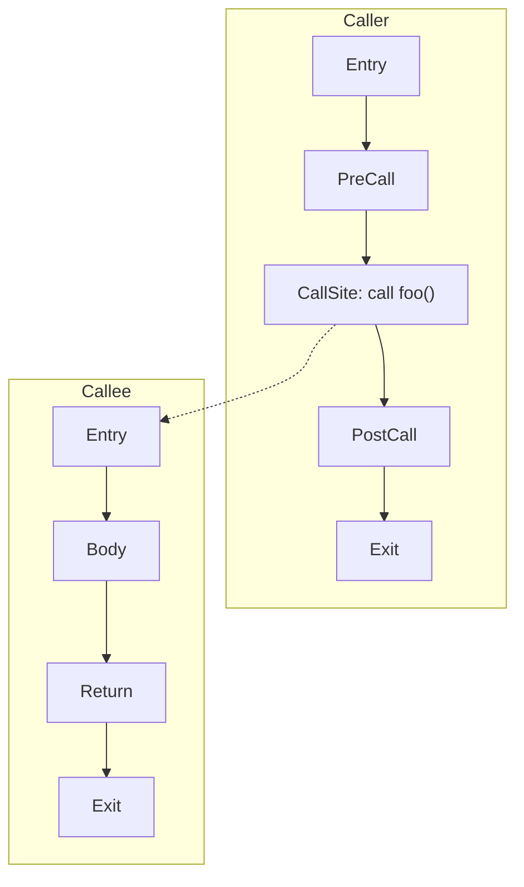
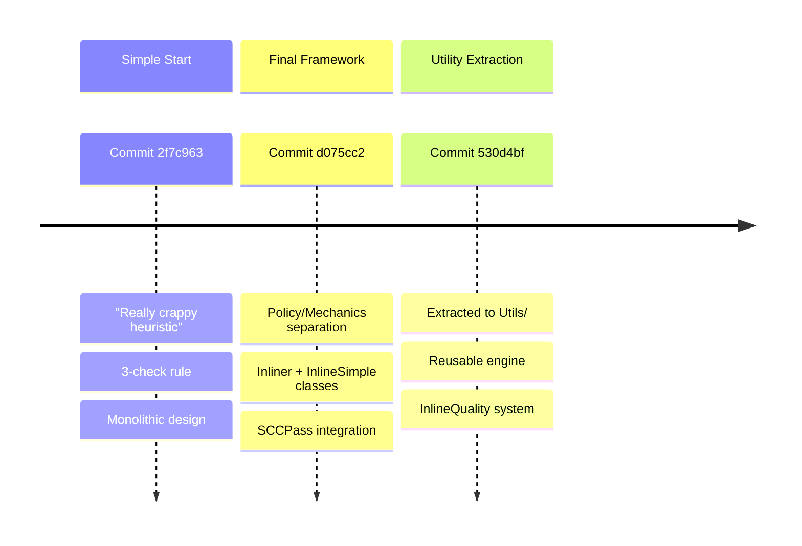
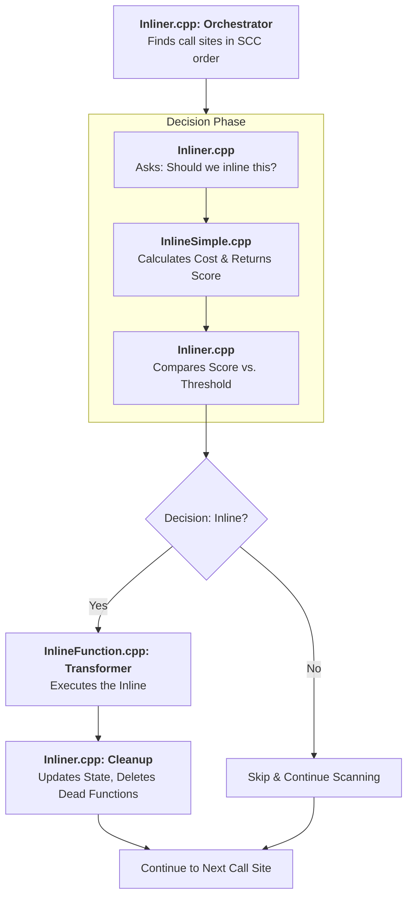

import AdBanner from '@site/src/components/AdBanner';
import Tabs from '@theme/Tabs';
import TabItem from '@theme/TabItem';
import { ComicQA } from '../../../mcq/interview_question/Question_comics' ;

<div>
    <AdBanner />
</div>


## Introduction

Whether you’re a **fresher**, a **seasoned developer**, or someone from **any technical domain**, If you’ve spent even a little time around programmers, you’ve probably heard this line at least once.

- *you’ve surely heard this classic line:*
  >>> ***“Compilers inline small functions to make programs faster.”***


**Sounds simple, right?**

Most people hear `the compiler will inline it` and think,
`Well… great`. 
> **Why should **I** bother?** 
 >Let the compiler do its job.”*

And honestly, that’s fair.
On the surface, it *does* sound obvious. Almost boring.

But that’s exactly where the twist comes in.

One random day, while looking at some LLVM IR, you might pause and ask yourself:

:::tip But have you ever stopped and asked yourself:
- Wait… who decides which function is ‘small’?
- ➡️ How does a compiler actually decide ***when to inline***?
- ➡️ How does it weigh the cost, the benefit, and the impact on performance?
- 
- ➡️ How has this logic evolved over the last two decades of LLVM’s growth?
:::

When I first tried understanding LLVM’s inliner years ago, I imagined a simple yes/no switch.
But the deeper I went, the more I realized I was standing on two decades of evolving ideas, experiments, algorithms, and tiny design decisions:some brilliant, some odd, and some frozen forever in history.

And at the very beginning of that story sits [**LLVM Inliner Version 1.0**](https://releases.llvm.org/1.0/docs/ReleaseNotes.html).

It wasn’t fancy.
It wasn’t powered by modern cost models.
But it laid the foundation for everything that came after.

:::tip Think of it like discovering the first rough sketch 
 - Behind a now-famous architectural masterpiece.
:::

:::important This early inliner taught LLVM:

* how to inspect a call and decide if it’s worth expanding,
* how to analyze cost vs. benefit,
* how to walk the call graph without getting hopelessly lost,
* and how to transform IR without breaking the world around it.
:::
It wasn't perfect but it was the seed.

This article is my attempt to walk you through that seed. Not in a dry, academic way, but in a way that shows **the human side of an engineering idea as it grew and evolved**.


>> ***This is where the real story begins.***

>>>:::note The *Inliner* is one of the most critical [interprocedural optimization (IPO)](https://www.intel.com/content/www/us/en/docs/dpcpp-cpp-compiler/developer-guide-reference/2023-0/interprocedural-optimization.html) [passes](https://llvm.org/docs/WritingAnLLVMNewPMPass.html) in LLVM. 

***Its core responsibility is simple in theory yet deeply complex in practice***

Overall it just say:
> **Replace a function call with the body of the callee only when it is profitable.**

- The [LLVM Inliner Pass (Version **1.0**)](https://github.com/llvm/llvm-project/tree/release/1.0.x) represents the early yet foundational design of inlining in LLVM’s pass ecosystem. 

- It exposes several characteristics that continue to influence modern inliners particularly in terms of cost modelling, call graph handling, and transformation utilities.

:::caution **Before going further, let’s understand who this article is for**
<details>
<summary><strong>This article is specifically crafted for:</strong> </summary>

* **Compiler Engineers**
  Developers working on LLVM optimization pipelines who need a *version-locked and historically accurate* understanding of the Inliner in LLVM 1.0.

* **Systems & Architecture Researchers**
  Those analyzing early IR design choices, interprocedural optimization strategies, and foundational compiler infrastructures.

* **Graduate Students & Academic Learners**
  Students studying advanced topics like SSA form, IR transformations, and control-flow restructuring as part of compiler coursework.

* **Performance & Toolchain Engineers**
  Engineers optimizing toolchains for embedded, mobile, or GPU platforms where inlining decisions can critically impact runtime behavior.

* **LLVM Backend & Tooling Developers**
  Engineers integrating LLVM with custom hardware who require deep insight into structural IR transformations.

* **✨ New Compiler Learners**
  Anyone who has **just started learning compilers** and wants to understand *how a compiler really works under the hood* specially how individual passes transform programs step-by-step.
</details>
:::


This is the **first chapter** in the series where we track the **complete evolution of every LLVM pass**, from its origin to its current form.

Welcome to the journey of understanding the **heart of modern compilers** starting with the Inliner.

:::caution Before Reading Further
Assisted by AI for writing clarity and structure. All technical analysis and conclusions are the author’s own.
:::

<details>
<summary><strong>What This Article Provides</strong></summary>

* **Simple explanation of how the LLVM Inliner works** in each version
* **Clear details** on what changed in that inliner version
* **Practical guidance** for developers upgrading or modifying passes
* **Easy examples** showing how inlining affects the IR and performance
* **Quick benchmark comparison** (with vs without inlining)
* **Beginner-friendly intro** for anyone who wants to understand how compilers work
</details>

## Table of Contents

1. [Introduction](#introduction)

2. [Understanding InlinerPass in LLVM](#understanding-inlinerpass-in-llvm)
   - [Example of Inlining](#example-of-inlining)

3. [Core Implementation Details](#core-implementation-details)
   - [Data Structures Breakdown](#data-structures-used)
        - [Order & Safety](#order--safety)
        - [Decision Logic](#decision-logic)
        - [Transformation](#transformation)
        - [Bookkeeping](#bookkeeping)

4. [Algorithm: Bottom-Up SCC and Inline Transform](#algorithm-bottomup-scc-and-inline-transform)
   - [The Rule: How It Worked](#the-rule-how-it-worked)
   - [Why It Was So Simple](#why-it-was-so-simple)

5. [Limitations and Refactor in Future Commits](#limitation-and-refactor-in-future-commit)

6. [The Architectural Split: Policy vs. Mechanics](#the-architectural-split-policy-vs-mechanics)
   - [Key Technical Changes in the Code](#key-technical-changes-in-the-code)

7. [The Intermediate Leap: Smarter Heuristics and Utility Extraction](#the-intermediate-leap-smarter-heuristics-and-utility-extraction)
   - [From Blocks to Quality: Birth of a Cost Model](#from-blocks-to-quality-the-birth-of-a-cost-model)
   - [Extracting the Grunt Work: InlineFunction.cpp](#2-extracting-the-grunt-work-the-creation-of-inlinefunctioncpp)

8. [Algorithmic Evolution Between Commits](#algorithmic-evolution-between-commits)

9. [The Path to the Final Architecture](#the-path-to-the-final-architecture)


10. [Conclusion](#conclusion)
11. [More Articles](#more-article)
  

---

## Understanding InlinerPass In LLVM

In compiler design, the **Inliner Pass** is an **inter-procedural optimization** that replaces function calls with the body of the called function. This enables the compiler to see the caller and callee as a single block, improving optimization opportunities.

### Example of Inlining

Below is a minimal example that demonstrates what inlining does at the IR level and why it’s beneficial.

<Tabs>
  <TabItem value="c" label="C/C++">

```c
static inline int add(int a, int b) { return a + b; }
int foo(int x) { return add(x, 42); }
```

  </TabItem>
  <TabItem value="ir-before" label="LLVM IR (before)">

```python
define i32 @add(i32 %a, i32 %b) {
entry:
  %0 = add i32 %a, %b
  ret i32 %0
}

define i32 @foo(i32 %x) {
entry:
  %0 = call i32 @add(i32 %x, i32 42)
  ret i32 %0
}
```

  </TabItem>
  <TabItem value="ir-after" label="LLVM IR (after)">

```python
define i32 @foo(i32 %x) {
entry:
  %0 = add i32 %x, 42
  ret i32 %0
}
```

  </TabItem>
  <TabItem value="benefits" label="Benefits">

<ul>
  <li>Removes call overhead.</li>
  <li>Exposes constants (42) to later passes for constant-folding.</li>
  <li>Simplifies control flow, enabling InstCombine and DCE to do more work.</li>
</ul>

  </TabItem>
</Tabs>


<details>
<summary><strong>Key Concepts</strong></summary>

- <strong>Caller Function</strong>: The function that initiates a call (e.g., <code>main</code> or <code>foo</code>).
- <strong>Callee Function</strong>: The function being invoked and potentially inlined (e.g., <code>add</code>).
- <strong>Call Site</strong>: The exact instruction where a call occurs; this is where the inlining transformation is applied.
- <strong>Inline Threshold</strong>: A heuristic limit (e.g., instruction count) that determines when a function is considered small enough to inline.
- <strong>Profitability</strong>: The cost/benefit decision combining code-size growth and expected performance wins.
- <strong>Attributes</strong>: User or compiler hints like <code>alwaysinline</code> and <code>noinline</code> that override/guide the decision.
- <strong>SSA Remapping</strong>: Rewriting values, PHIs, and branches so the cloned callee instructions integrate correctly in the caller.

</details>

<details>
<summary><strong>Visual Representation</strong></summary>

#### Before Inlining (Call remains)


#### After Inlining (Callee body cloned into caller)


Legend:
- <strong>Dashed edge</strong> indicates cross-function control transfer (before inlining).
- <strong>Inlined nodes</strong> are cloned blocks inserted into the caller (after inlining).
- PHIs and return handling are updated to keep SSA form valid.

</details>

> :::note **Note:**
> This transformation exposes all instructions in a single control flow graph segment, allowing subsequent optimization passes to perform **constant propagation, dead-code elimination, and loop optimizations** more effectively.

## Core Implementation Details

###### File Structure (historical context) {#file-structure-historical-context}

```python
llvm-1.0/include/llvm/Transform/IPO/
├── Inliner.h                    # Primary pass interface

llvm-1.0/lib/Transform/IPO/
├── Inliner.cpp                  # Main pass implementation
├── InlineSimple.cpp            # Simplified strategy
└── InlineFunction.cpp          # Core cloning utilities (post-refactor)
```


***Reference***: 
> core refactor that extracted inlining utilities out of the pass into reusable helpers (see commits [530d4bff](https://github.com/llvm/llvm-project/commit/530d4bffbfa2b8482511b0137144b8f02a9b0925
) and [d075cc28](https://github.com/llvm/llvm-project/commit/d075cc282b601816077645716c6a4acd9ea98fcc
) in the LLVM repository).

> - **include/llvm/Transforms/IPO/**
  - **Inliner.h**: pass interface and configuration
  - **InlineCost.h**: early cost modeling hooks and helpers
> - **lib/Transforms/IPO/**
  - **Inliner.cpp**: legacy pass driver that decides profitability and orchestrates inlining
  - **InlineSimple.cpp**: simplified strategy for size-threshold-driven inlining
  - **InlineFunction.cpp**: central inlining utility (CloneFunctionInto, return handling, operand remapping)

:::note
- [530d4bff](https://github.com/llvm/llvm-project/commit/530d4bffbfa2b8482511b0137144b8f02a9b0925
): “Separate inlining grunt work into utils” (moved cloning/return/PHI handling into InlineFunction.cpp, called by the pass).
- [d075cc28](https://github.com/llvm/llvm-project/commit/d075cc282b601816077645716c6a4acd9ea98fcc
): follow‑up cleanup and API shaping around InlineFunction/InlineCost usage to reduce duplication in callers.
:::


### Data Structures Used

The LLVM inliner depends on **many data structures** it’s not a simple linked list of calls. To make it easier to understand, CompilerSutra groups these structures into **four major categories**:

1. [**Order & Safety**](#order--safety) : structures that decide *the safe order* to process functions
2. [**Decision Logic**](#decision-logic) : structures that decide *whether a call should be inlined*
3. [**Transformation**](#transformation) : structures that perform *the actual code cloning and IR updates*
4. [**Bookkeeping**](#bookkeeping) : structures that update analyses, statistics, and respect metadata

---

#### **Order & Safety**

 **Definition:** Structures that help the compiler determine a safe processing order and prevent infinite inlining, especially for recursive functions.

<Tabs>
  <TabItem value="CallGraphSCCPass" label="CallGraphSCCPass">

  **Purpose:** Groups functions into SCCs and processes them bottom-up to respect recursion.

 >> The compiler groups functions that call each other and processes these groups one by one.
It starts from the functions at the bottom (that don’t call others) and then moves upward

**What it does**
* Traverses functions in a safe **bottom-up order**
* Groups recursive and mutually recursive functions
* Drives the entire inlining process


**How it works**
* Builds the call graph
* Splits it into SCCs
* Calls `runOnSCC()` for each SCC
* Inlining happens inside each SCC

</TabItem>

<TabItem value="CallGraph" label="CallGraph & CallGraphNode">

  **Purpose:** Represents functions and their call relationships; updates connections after inlining.
  **Definition**

>   A graph representation where:
> *  Nodes = functions
> *   Edges = represent which function calls which

 **What it does**

* Tracks who calls whom
* Updates function relationships after inlining
* Helps identify and remove unused (dead) functions

 **How it works**

* Each function owns a `CallGraphNode`
* Edges are added/removed as calls change
* Inlining removes call edges and may delete nodes

 **Why inlining needs it**

Inlining changes how functions are connected.
LLVM must update this graph so its understanding of the program stays correct.

</TabItem>

  <TabItem value="SCCFunctions" label="SCCFunctions">

  **Purpose:** Holds functions in the current recursion group to detect self or mutual recursion.

  </TabItem>
</Tabs>

---

#### **Decision Logic**

**Definition:** Structures that help the inliner decide if a specific call site should be inlined based on cost, thresholds, and call properties.

<Tabs>
  <TabItem value="CallSite" label="CallSite">

  **Purpose:** Provides uniform access to all call instructions, hiding IR differences.
   **Definition**

A wrapper abstraction over:

* `CallInst`
* `InvokeInst`

 **What it does**

* Provides uniform access to all call instructions
* Hides IR instruction differences

 **How it works**

* Wraps the instruction
* Exposes callee, arguments, attributes
* Used by cost model and inliner

 **Why inlining needs it**

Inlining logic must work the same for:

* Normal calls
* Exception-handling calls

</TabItem>

  <TabItem value="CostModel" label="InlineThreshold & Cost Model">

  **Purpose:** Determines whether a call is cheap enough to inline, balancing speed and code size.
  **Definition**

A numeric limit that decides whether a function call is cheap enough to inline.

 **What it does**

* Prevents code size explosion
* Controls aggressiveness of inlining

 **How it works**

* Computes cost via `getInlineCost()`
* Recursive calls use stricter cost rules
* Compared against `InlineThreshold`

 **Why inlining needs it**

Inlining everything hurts performance.
LLVM must balance speed vs code size.


  </TabItem>

  <TabItem value="Worklists" label="Instruction Traversal & Worklists">

  **Purpose:** Iterates over instructions to find call sites and manage inlining candidates per call site.

 **Definition**

Iteration over:

```cpp
Function → BasicBlock → Instruction
```

 **What it does**

* Finds all call sites
* Manages inlining candidates

 **How it works**

* Walks IR instruction by instruction
* Uses temporary containers to avoid duplication

 **Why inlining needs it**

Inlining decisions are made **per call site**, not per function.

  </TabItem>
</Tabs>
---

#### **Transformation**

**Definition:** Structures that perform the actual code cloning, remapping, and IR updates when inlining.

<Tabs>
  <TabItem value="InlineFunction" label="InlineFunction & ValueToValueMapTy">

  **Purpose:** Clones callee code, remaps SSA values, and updates control flow.
   **Definition**

Core cloning utilities used to copy callee code into the caller.

 **What it does**

* Clones basic blocks
* Remaps SSA values
* Connects control flow

 **How it works**

* Copies callee IR
* Maps old values → new values
* Replaces call with cloned code

 **Why inlining needs it**

Inlining literally means **copying code** while preserving correctness.


  </TabItem>

  <TabItem value="InlineFunctionInfo" label="InlineFunctionInfo">

  **Purpose:** Maintains analysis information (DominatorTree, LoopInfo) during inlining to keep analyses valid.
   **Definition**

A helper structure carrying analysis information during inlining.

 **What it does**

* Updates DominatorTree
* Updates LoopInfo

 **How it works**

* Passed to `InlineFunction`
* Adjusts analyses as IR changes

 **Why inlining needs it**

Inlining changes control flow.
Analyses must stay valid.

  </TabItem>
</Tabs>

---

#### **Bookkeeping**

**Definition:** Structures that keep track of the inlining effects, statistics, and respect metadata such as developer annotations.

<Tabs>
  <TabItem value="Statistics" label="Statistics (STATISTIC Counters)">
  **Purpose:** Tracks number of inlined calls and deleted functions for diagnostics.
  </TabItem>

  <TabItem value="Attributes" label="Attributes & Linkage Flags">
  **Purpose:** Controls inlining behavior via `alwaysinline`, `noinline`, and internal linkage.
  </TabItem>
</Tabs>


:::tip
Inlining is a two-step process: decide where it is safe and profitable, then carefully copy code while keeping analyses correc
:::


### Algorithm (bottom‑up SCC and inline transform)

Till now, we have explored the data structures used in the LLVM inlining pass. Here, we explain the high-level logic and algorithm used by LLVM v1, with references to the commits of their very first file [InlineSimple.cpp](https://github.com/llvm/llvm-project/commit/2f7c963559dbc6dbda43df77a090a93f94c6625e#diff-b01c41a1a680a1c3a2c7c60f1fbf8a177c1957fe6d3a0fef82c3582a7c449538)

**LLVM's First Inlining Rule: The Simple 3-Check**

In the very first version of LLVM, deciding whether to put a function's code directly into another function (this is called "inlining") was very, very simple. They used just three basic checks.

```cpp
static inline bool ShouldInlineMethod(const CallInst *CI, const Method *M) {
  assert(CI->getParent() && CI->getParent()->getParent() && 
	 "Call not embedded into a method!");

  // Don't inline a recursive call.
  if (CI->getParent()->getParent() == M) return false;

  // Don't inline something too big.  This is a really crappy heuristic
  if (M->getBasicBlocks().size() > 3) return false;

  // Don't inline into something too big. This is a **really** crappy heuristic
  if (CI->getParent()->getParent()->getBasicBlocks().size() > 10) return false;

  // Go ahead and try just about anything else.
  return true;
}
```

## The Rule: How It Worked

Imagine the compiler looking at a line of code that calls another function. Before it copies that other function's code in, it asks three questions in order:

> **First Check: Is this function calling itself?**
> 
> If the answer is **YES**, stop. Do not inline.
> 
> **Second Check: Is the function being called too big?**
> 
> The rule said: If the function has more than **3 chunks of code** (called "basic blocks"), it's "too big."
> 
> If the answer is **YES**, stop. Do not inline.
> 
> **Third Check: Is the function doing the calling already too big?**
> 
> The rule said: If the function making the call has more than **10 chunks of code**, it's "too big."
> 
> If the answer is **YES**, stop. Do not inline.
> 
> If all three answers were **NO**, then the compiler said "Okay!" and did the inlining.

## **Why It Was So Simple**

The programmers who wrote this knew it wasn't perfect. Right in the code, they wrote comments calling their own rule a **"really crappy heuristic"** (a heuristic is just a rule-of-thumb).

They started with this as per compilersutra team because:
1.  **It was safe.** It almost never made the new code much bigger.
2.  **It was easy to write.** They didn't have to program complex math or analysis.
3.  **It was a starting point.** You have to start somewhere before you can make something smarter.


:::tip Limitation and Refactor in Future Commit

The limitations of the original three-check heuristic were clear. While safe and simple, it lacked nuance and was a dead-end for future improvements. 
The commit [d075cc2](https://github.com/llvm/llvm-project/commit/d075cc282b601816077645716c6a4acd9ea98fcc#diff-b01c41a1a680a1c3a2c7c60f1fbf8a177c1957fe6d3a0fef82c3582a7c449538) addressed this by performing a deep architectural refactor that laid the foundation for LLVM's modern, sophisticated inliner.

This wasn't a minor tweak; it was a complete restructuring based on the Separation of Concerns principle. The commit message itself states the goal: 
- [COMMIT](https://github.com/llvm/llvm-project/commit/d075cc282b601816077645716c6a4acd9ea98fcc#diff-b01c41a1a680a1c3a2c7c60f1fbf8a177c1957fe6d3a0fef82c3582a7c449538)
> - *Separate the policy decisions into a derived class* **[InlineSimple]** 
> - *Move the inlining mechanics into a base class* **[Inliner]**
> - *Change the inliner to be an **SCCPass**, 

***Making it more structured and eventually pipelinable with other SCC passes***
:::


### The Architectural Split: Policy vs. Mechanics

The refactor cleaved the monolithic [`InlineSimple.cpp`](https://github.com/llvm/llvm-project/commit/2f7c963559dbc6dbda43df77a090a93f94c6625e#diff-b01c41a1a680a1c3a2c7c60f1fbf8a177c1957fe6d3a0fef82c3582a7c449538) pass into two distinct layers:

1.  **The [`Inliner.cpp`](https://github.com/llvm/llvm-project/commit/d075cc282b601816077645716c6a4acd9ea98fcc#diff-b01c41a1a680a1c3a2c7c60f1fbf8a177c1957fe6d3a0fef82c3582a7c449538) Base Class (The "How")**: 
    - This new class, defined in `Inliner.h` and implemented in `Inliner.cpp`.
        - Became the engine. Its sole responsibility is the **mechanics** of inlining: 
            -  traversing the call graph, cloning instructions, 
            - remapping values, and updating control flow. 
            - It contains no logic for *deciding* what to inline.
2.  **The `InlineSimple.cpp` Derived Class (The "When")**: 
    - What was once the entire pass became a lean policy layer. Inheriting from `Inliner.cpp`, 
    - Its only job is to answer one question 
        - via the pure virtual [`getInlineCost(CallSite CS)`](https://github.com/llvm/llvm-project/commit/d075cc282b601816077645716c6a4acd9ea98fcc#diff-edf584fb5382797a9f3346da2469a297a21e1c3a4515ae140a09d28e909224ddR30) method: 
            - **"What is the cost of inlining this specific call?"**

:::tip This Split Transformed
The design from a **monolithic application** into a **reusable framework**. 
The complex, error-prone mechanics were written once in the base class. 
Different inlining policies (aggressive, size-optimized, profile-guided) 
could now be created simply by writing a new derived class with a different 
`getInlineCost` implementation.
:::

### Key Technical Changes in the Code

* **Interface Change**:
    - The binary `ShouldInlineFunction(CallSite CS)` function was replaced by the 
    >>granular `int getInlineCost(CallSite CS)`. 
    - Instead of a simple yes/no, the policy now returns an integer cost,
    - Where a **lower (or negative) cost means "more desirable to inline."**

* **Smarter Heuristics**: 
> The new `getInlineCost` function implemented a **multi-factor analysis** far beyond block counts. It considered:
- **Argument Analysis**: 
    - Inlining is encouraged (`cost -= 60`) 
        - if constants or known values are passed, 
            - enabling further optimizations like constant propagation.
- **Call Site Context**: 
    - A function with only one caller (`use_size() == 1`) 
        - receives a massive incentive (`cost -= 30000`), 
            - making dead code elimination highly likely.
- **Size Penalties**: 
    - Costs are still added for callee size (`+ BB->size()*10 + 20`) and 
    - caller size (`+ 1` per block), 
    - but these are now part of a balanced equation, not absolute gates.

- **Integration with the Pass Manager**: 
    - The base class was changed from a `ModulePass` to a `CallGraphSCCPass`. 
    - This means it analyzes functions in **Strongly Connected Component (SCC) order**
    - A ***bottom-up traversal of the call graph***. 

***This is crucial for correctly handling recursion and enables the inliner to be "pipelined" with other optimizations that also operate on the SCC structure.***

:::caution Why This Refactor Was Pivotal

This [commit](https://github.com/llvm/llvm-project/commit/d075cc282b601816077645716c6a4acd9ea98fcc#diff-b01c41a1a680a1c3a2c7c60f1fbf8a177c1957fe6d3a0fef82c3582a7c449538) moved LLVM's inliner from being a fixed, limited tool to an extensible platform. The "really crappy heuristic" was not just improved; it was **encapsulated and made replaceable**. The hardcoded policy of "3 blocks for the callee, 10 for the caller" was superseded by a configurable threshold (`-inline-threshold`) compared against a computed cost that could consider countless future factors.

This architectural pattern established in 1st version is precisely why LLVM today can seamlessly switch between different inlining strategies (like the optimization-for-size `Inliner` or the aggressive `ModuleInliner`) while sharing the same robust, battle-tested transformation core. It marked the evolution of the inliner from a simple compiler pass into a cornerstone of LLVM's interprocedural optimization pipeline.
:::


### The Intermediate Leap: Smarter Heuristics and Utility Extraction

While the architectural split in [**`d075cc2`**](https://github.com/llvm/llvm-project/commit/d075cc282b601816077645716c6a4acd9ea98fcc#diff-b01c41a1a680a1c3a2c7c60f1fbf8a177c1957fe6d3a0fef82c3582a7c449538) provided the framework for a sophisticated inliner, the intelligence of its decisions still needed to evolve. The commit [**`530d4bf`**](https://github.com/llvm/llvm-project/commit/530d4bffbfa2b8482511b0137144b8f02a9b0925#diff-b01c41a1a680a1c3a2c7c60f1fbf8a177c1957fe6d3a0fef82c3582a7c449538L1-L210) represents this crucial intermediate step. 

- Its commit message is direct: 
 > "***Separate all of the grunt work of inlining out into the Utils library. Make the function inliner _significantly_ smarter.***"

This commit delivered on both promises, marking a key evolution in the algorithm's *logic* and its *structure*.

#### 1. From "Blocks" to "Quality": The Birth of a Cost Model
The most significant algorithmic change was the replacement of the primitive block-counting check with a nuanced, multi-factor **InlineQuality** score.

**Before (`ShouldInlineMethod` in the initial commit):**
```cpp
// Simple, hardcoded block limits
if (M->getBasicBlocks().size() > 3) return false;
if (Caller->getBasicBlocks().size() > 10) return false;
```

**After (`ShouldInlineFunction` in `530d4bf`):**
```cpp
int InlineQuality = 200; // A starting threshold

// 1. REWARD favorable conditions
if (Callee->use_size() == 1 && Callee->hasInternalLinkage())
    InlineQuality += 30000; // Strong hint: private & single-use
if (isa<Constant>(I) || isa<GlobalVariable>(I) || isa<AllocaInst>(I))
    InlineQuality += 60;    // Encourages constant propagation

// 2. PENALIZE for size (more granular than before)
for (Function::const_iterator BB = Callee->begin(), E = Callee->end();
     BB != E; ++BB) {
    InlineQuality -= BB->size()*10 + 20; // Each instruction & block costs
    if (InlineQuality < 0) return false; // Early exit if budget exhausted
}
```

This transformed the decision from a **static filter** into a **dynamic balancing act**. The compiler now actively rewarded call sites that promised good optimization opportunities (like enabling constant propagation) while penalizing for size. The `InlineQuality` variable acted as a budget, allowing trade-offs—a large function might still be inlined if the call site context was exceptionally favorable.

#### 2. Extracting the "Grunt Work": The Creation of `InlineFunction.cpp`
The second major change was structural. The commit surgically extracted the core inlining transformation logic—over 160 lines of complex code handling block splitting, instruction cloning, value remapping, and return value handling—from the pass file (`FunctionInlining.cpp`) into a new, reusable utility: **`llvm/lib/Transforms/Utils/InlineFunction.cpp`**.

**Before (Monolithic Structure):** [commit](https://github.com/llvm/llvm-project/commit/2f7c963559dbc6dbda43df77a090a93f94c6625e#diff-b01c41a1a680a1c3a2c7c60f1fbf8a177c1957fe6d3a0fef82c3582a7c449538)
```python
InlineSimple.cpp
├──  // Decision logic
├── // Transformation logic 
└── // Driver logic
```

**After (Separated Concerns):** [commit](https://github.com/llvm/llvm-project/commit/530d4bffbfa2b8482511b0137144b8f02a9b0925#diff-b01c41a1a680a1c3a2c7c60f1fbf8a177c1957fe6d3a0fef82c3582a7c449538)

```python
InlineSimple.cpp 
├── ShouldInlineFunction() // Decision logic only
└── doInlining()   // Calls external utility

Utils/InlineFunction.cpp 
└── InlineFunction() // Pure transformation logic
```

**This extraction had two profound impacts:**
1.  **Separation of Concerns (Early Stage):** 
    - It created a clean boundary between the **decision logic** 
        - (the *policy* of whether to inline) and the **transformation logic** (**the *mechanism* of how to inline**). 
    - The pass could now focus on analysis and heuristics.
2.  **Code Reusability**:
    - The `InlineFunction(CallInst *CI)` utility became a standalone, well-tested component. 
    - Other parts of the compiler (like specializers or aggressive interprocedural optimizers)
    - could now perform inlining without duplicating this intricate and error-prone code.


### Algorithmic Evolution Between Commits

The three commits form a clear evolutionary path in LLVM's inliner design:

| Commit | Key Changes | Architecture | Decision Logic | Impact |
|--------|-------------|--------------|----------------|---------|
| **[2f7c963](https://github.com/llvm/llvm-project/commit/2f7c963559dbc6dbda43df77a090a93f94c6625e#diff-b01c41a1a680a1c3a2c7c60f1fbf8a177c1957fe6d3a0fef82c3582a7c449538)**  | Initial implementation | Monolithic `InlineSimple.cpp` | Simple 3-check rule (≤3/≤10 blocks) | Proof of concept, self-admitted "crappy heuristic" |
| **[d075cc2](https://github.com/llvm/llvm-project/commit/d075cc282b601816077645716c6a4acd9ea98fcc#diff-b01c41a1a680a1c3a2c7c60f1fbf8a177c1957fe6d3a0fef82c3582a7c449538)** | 1. Policy/Mechanics framework>2. SCCPass integration | Class hierarchy: `Inliner` base + `InlineSimple` derived | `getInlineCost()` interface with configurable threshold | **Final extensible framework** with proper recursion handling |
| **[530d4bf](https://github.com/llvm/llvm-project/commit/530d4bffbfa2b8482511b0137144b8f02a9b0925#diff-b01c41a1a680a1c3a2c7c60f1fbf8a177c1957fe6d3a0fef82c3582a7c449538)** | 1. **Extracted mechanics to utils** (`Utils/InlineFunction.cpp`)2. Smarter heuristic | Separated: Pass logic + Utility library | `InlineQuality` score with rewards/penalties for arguments & context | **Created reusable inlining engine** for other passes |

**Evolution Summary:**
1. **Simple Start** (Monolithic, 3-check rule)
2. **Utility Extraction** (Separated mechanics, better heuristic)
3. **Framework Finalization** (Class hierarchy, SCC integration)





### The Path to the Final Architecture
Commit `530d4bf` set the stage for the final refactor in `d075cc2`. It demonstrated that:
1.  A **cost-model-based heuristic** (`InlineQuality`) was vastly superior to hardcoded rules.
2.  The **mechanical transformation** (`InlineFunction`) was a distinct, reusable component.

The final step, realized in `d075cc2`, was to formalize these insights into a permanent architecture: turning the extracted utility into a base class (`Inliner`) and the quality heuristic into a virtual method (`getInlineCost`) within a policy class (`InlineSimple`).

Thus, `530d4bf` is the vital link in the chain—the commit where the inliner's algorithm gained its "smarts" and its code structure took the first step toward modern, maintainable design. This intermediate evolution made the subsequent architectural refactor not just possible, but logical and necessary.


## Let's Dive Into Implementation

let's break down how the [LLVM 1.0](https://github.com/llvm/llvm-project/tree/release/1.0.x) inliner works. It's split across three main files, each with a very specific job. Think of it like a team with different specialists.

| File | Role (The "What") | Key Responsibility |
| :--- | :--- | :--- |
|[**`Inliner.cpp`**](https://github.com/llvm/llvm-project/blob/release/1.0.x/llvm/lib/Transforms/IPO/Inliner.cpp) | **The Foreman & Scheduler** | Manages the whole process. It decides **in what order** to look at functions and **orchestrates** when to inline. |
|[**`InlineSimple.cpp`**](https://github.com/llvm/llvm-project/blob/release/1.0.x/llvm/lib/Transforms/IPO/InlineSimple.cpp) | **The Cost Estimator** | Answers the core question: **"Should we inline this specific call?"** It provides the "yes/no" logic. |
|[**`InlineFunction.cpp`**](https://github.com/llvm/llvm-project/blob/release/1.0.x/llvm/lib/Transforms/Utils/InlineFunction.cpp) | **The Construction Crew** | Does the **actual, mechanical work** of copying the function's code into the caller. It's the "how" of inlining. |


Now, let's walk through the complete algorithm step-by-step to see how these files work together.

### The Complete Inlining Algorithm (Step-by-Step)


**Step 1: Start with the Right Order (`Inliner.cpp`)**
  -  The algorithm doesn't just jump around randomly.
        - It uses a **Call Graph** (a map of which function calls which) to find groups of functions that 
        >>call each other, known as **Strongly Connected Components (SCCs)**.
        - It processes these groups from the **bottom up** (callees before callers). 
        - This is crucial for correctly handling recursive functions and making smart decisions.

**Step 2: Find a Call to Inline (`Inliner.cpp`)**
 - Within each function in the current SCC, the `Inliner.cpp` code scans every instruction. 
         - When it finds a `call` or `invoke` instruction.
         - It checks if it points to a real, defined function (not an external one).

**Step 3: Ask: "Should We Do It?" (`InlineSimple.cpp`)**
- For each valid call, the foreman (`Inliner.cpp`) asks the cost estimator (`InlineSimple.cpp`):
    - **"What's the cost of inlining this?"** This is the heart of the heuristic.
- The `getInlineCost` function in `InlineSimple.cpp` calculates a score:
    - **LOWER or NEGATIVE cost = GOOD (Inline it!).**
    - **HIGHER cost = BAD (Skip it).**

:::tip Cost Calculation
<details>
<summary><strong>How the cost is calculated</strong></summary>

The LLVM inliner uses a cost-based heuristic to decide whether to inline a function. The core logic is in the [`getInlineCost()`](https://github.com/llvm/llvm-project/blob/release/1.0.x/llvm/lib/Transforms/IPO/InlineSimple.cpp#L42) method, which returns a number where **lower (or negative) is better**. Let me walk you through how it calculates this cost.

**The Core Calculation Steps**
 - **Step 1: The Absolute Rule - No Direct Recursion**
    - First and simplest check: 
        - if a function is calling itself directly, we never inline it. 
        - The code returns a massive number (2 billion) that's guaranteed to be higher than any threshold.

**Why?** This prevents infinite inlining loops. If function A calls A, and we inline it, we'd get A calling A again, and we'd be stuck forever.

- **Step 2: The "Dead Code Elimination" Bonus**
    - If a function is private (has `internal` linkage) and has only **one caller**
    - It gets a huge bonus of `-30,000`.

**The reasoning as per Compilersutra**: 
- If a private function has only one caller, and we inline it, the original function becomes **dead code** that can be completely eliminated. 
- This is a triple win:
    - 1. We remove the function call overhead
    - 2. We delete the now-unused function body
    - 3. We enable better optimization within the single caller

- **Step 3: Smart Argument Analysis**
    - The algorithm looks at what arguments are being passed.
    -  Each argument starts with a base cost reduction of `-20` (encouraging fewer arguments),
    -  But certain argument types get **extra bonuses** because they enable powerful optimizations:

**Two special cases get extra bonuses**:
1. **Function pointers** (`-100` bonus): If you pass a function pointer as an argument, inlining might 
    >let us turn that indirect call into a direct call later.
2. **Constants, global variables, or stack allocations** (`-60` bonus): These are gold for optimization. 
    >If you pass `calculate(5, 10)` with constants, after inlining, we can propagate those constants and potentially simplify the whole calculation at compile time.

 - **Step 4: Size Penalties - The Reality Check**
- After all the bonuses, we apply penalties based on code size:

**Caller penalty**: Adds `+2` for each basic block in the **caller** function.  
**Why?** We don't want to make already-large functions even larger.

**Callee penalty**: Calculates the size of the **function being inlined**:
- `+10` per instruction
- `+20` per basic block

**Smart optimization**: The callee size is **cached** in a map. If we see the same function called from multiple places, we only count its size once.

 **The Final Decision**

All these calculations give us a final cost number. LLVM compares this against a **threshold** (default: 200).

**Simple rule**: If `cost < threshold`, we inline. If `cost >= threshold`, we skip it.

 **Real Example Walkthrough**

Let's say we have:
```cpp
static int helper(int x, int y) {  // Private, called once
    return x * y + 5;
}

void main() {
    int result = helper(10, 20);  // Passing constants
    // ...
}
```

**Cost calculation**:
1. No recursion: ✓
2. Private + single-use: `-30,000`
3. Two arguments: `-20 × 2 = -40` (base) + `-60 × 2 = -120` (constants bonus)
4. Main has ~3 blocks: `+2 × 3 = +6`
5. Helper has 1 block, 2 instructions: `+20 + 10×2 = +40`
6. **Total**: `-30,000 - 40 - 120 + 6 + 40 = -30,114`

**Decision**: `-30,114 < 200` → **Definitely inline!**
</details>
:::


**Step 4: Make the Decision (`Inliner.cpp`)**
The foreman (`Inliner.cpp`) gets the final cost back. It compares this cost to a **threshold** (by default, 200). If the cost is **less than the threshold**, the decision is **YES** – proceed to inline.

**Step 5: Do the Actual Work (`InlineFunction.cpp`)**
Once approved, the `Inliner.cpp` calls the `InlineFunction` utility from `InlineFunction.cpp`. This file is the workhorse. Its job is purely mechanical:
1.  **Split** the caller's basic block at the call site.
2.  **Clone** the entire body of the called function.
3.  **Remap** all the instructions so arguments from the call site replace the function's parameters.
4.  **Reroute** all `return` instructions in the cloned code to jump to the code after the original call.
5.  **Clean up** the control flow graph to merge blocks where possible.

**Step 6: Clean Up (`Inliner.cpp`)**
After inlining, the algorithm checks if the original function that was inlined now has **zero callers**. If it's a private function and is now dead, it deletes the function body entirely. Then, it continues scanning for more call sites.

### Summary: How the Files Work Together



:::caution **How the Files Collaborate:**
1. **`Inliner.cpp` is the Manager**: It starts the process, asks for a cost, makes the final decision, and handles cleanup.
2. **`InlineSimple.cpp` is the Advisor**: Its only job is to provide a cost score when asked. It has no say in the final decision.
3. **`InlineFunction.cpp` is the Specialist**: It only acts when told to. It performs the complex, mechanical code transformation but doesn't decide when to do it.
:::

## References and Further Reading

### Primary Sources

1. [**LLVM 1.0 Source Code**](https://github.com/llvm/llvm-project/tree/release/1.0.x/llvm)
2. **Commit 530d4bff**: ["Separate inlining grunt work into utils" - Critical refactoring](https://github.com/llvm/llvm-project/commit/530d4bffbfa2b8482511b0137144b8f02a9b0925#diff-b01c41a1a680a1c3a2c7c60f1fbf8a177c1957fe6d3a0fef82c3582a7c449538)
3. **Commit [d075cc2]**: ["Heavily refactor code"](https://github.com/llvm/llvm-project/commit/d075cc282b601816077645716c6a4acd9ea98fcc#diff-b01c41a1a680a1c3a2c7c60f1fbf8a177c1957fe6d3a0fef82c3582a7c449538)
4. **Commit [2f7c963]**: ["Initial revision"](https://github.com/llvm/llvm-project/commit/2f7c963559dbc6dbda43df77a090a93f94c6625e#diff-b01c41a1a680a1c3a2c7c60f1fbf8a177c1957fe6d3a0fef82c3582a7c449538)
5. [**Inlining for Code Size Reduction**](https://homepages.dcc.ufmg.br/~fernando/publications/papers/SBLP21Pacheco.pdf)

---


## Conclusion

The LLVM 1.0 Inliner Pass represents a critical point in compiler engineering history where pragmatic design met academic rigor. Its simplicity belied sophisticated architectural decisions that enabled two decades of evolution. By understanding this foundational implementation, modern compiler engineers can:

1. **Appreciate historical constraints** that shaped current designs
2. **Make informed decisions** when modernizing legacy code
3. **Recognize trade-offs** between simplicity and optimization power
4. **Understand evolution patterns** that continue to influence LLVM development

The journey from LLVM 1.0's straightforward size-based heuristics to today's ML-driven inlining strategies demonstrates the iterative, evidence-based approach that has made LLVM the dominant open-source compiler infrastructure. Each architectural decision in that early inliner:from utility separation to SSA preservation:created patterns that continue to serve the compiler community today.


## More Article
Explore More artilce
Follow continuation articles in this LLVM series on CompilerSutra.


<Tabs>
  <TabItem value="docs" label="📚 Documentation">
             - [CompilerSutra Home](https://compilersutra.com)
                - [CompilerSutra Homepage (Alt)](https://compilersutra.com/)
                - [Getting Started Guide](https://compilersutra.com/get-started)
                - [Skip to Content (Accessibility)](https://compilersutra.com#__docusaurus_skipToContent_fallback)


  </TabItem>

  <TabItem value="tutorials" label="📖 Tutorials & Guides">

        - [AI Documentation](https://compilersutra.com/docs/Ai)
        - [DSA Overview](https://compilersutra.com/docs/DSA/)
        - [DSA Detailed Guide](https://compilersutra.com/docs/DSA/DSA)
        - [MLIR Introduction](https://compilersutra.com/docs/MLIR/intro)
        - [TVM for Beginners](https://compilersutra.com/docs/tvm-for-beginners)
        - [Python Tutorial](https://compilersutra.com/docs/python/python_tutorial)
        - [C++ Tutorial](https://compilersutra.com/docs/c++/CppTutorial)
        - [C++ Main File Explained](https://compilersutra.com/docs/c++/c++_main_file)
        - [Compiler Design Basics](https://compilersutra.com/docs/compilers/compiler)
        - [OpenCL for GPU Programming](https://compilersutra.com/docs/gpu/opencl)
        - [LLVM Introduction](https://compilersutra.com/docs/llvm/intro-to-llvm)
        - [Introduction to Linux](https://compilersutra.com/docs/linux/intro_to_linux)

  </TabItem>

  <TabItem value="assessments" label="📝 Assessments">

        - [C++ MCQs](https://compilersutra.com/docs/mcq/cpp_mcqs)
        - [C++ Interview MCQs](https://compilersutra.com/docs/mcq/interview_question/cpp_interview_mcqs)

  </TabItem>

  <TabItem value="projects" label="🛠️ Projects">

            - [Project Documentation](https://compilersutra.com/docs/Project)
            - [Project Index](https://compilersutra.com/docs/project/)
            - [Graphics Pipeline Overview](https://compilersutra.com/docs/The_Graphic_Rendering_Pipeline)
            - [Graphic Rendering Pipeline (Alt)](https://compilersutra.com/docs/the_graphic_rendering_pipeline/)

  </TabItem>

  <TabItem value="resources" label="🌍 External Resources">

            - [LLVM Official Docs](https://llvm.org/docs/)
            - [Ask Any Question On Quora](https://compilersutra.quora.com)
            - [GitHub: FixIt Project](https://github.com/aabhinavg1/FixIt)
            - [GitHub Sponsors Page](https://github.com/sponsors/aabhinavg1)

  </TabItem>

  <TabItem value="social" label="📣 Social Media">

            - [🐦 Twitter - CompilerSutra](https://twitter.com/CompilerSutra)
            - [💼 LinkedIn - Abhinav](https://www.linkedin.com/in/abhinavcompilerllvm/)
            - [📺 YouTube - CompilerSutra](https://www.youtube.com/@compilersutra)
            - [💬 Join the CompilerSutra Discord for discussions](https://discord.com/invite/ty5xKCkyRP)

  </TabItem>
</Tabs>


