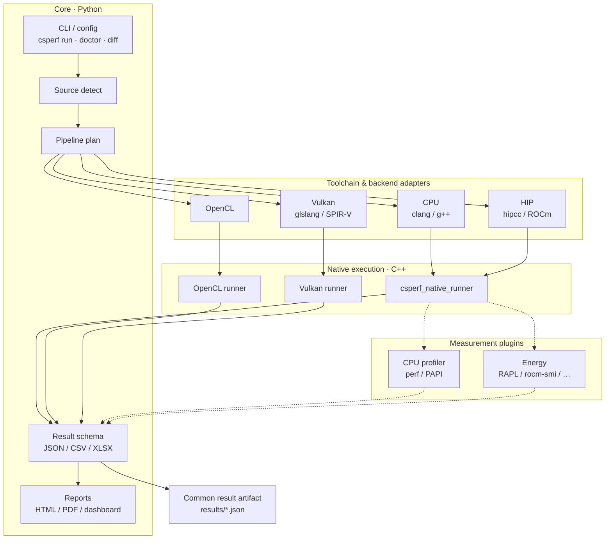
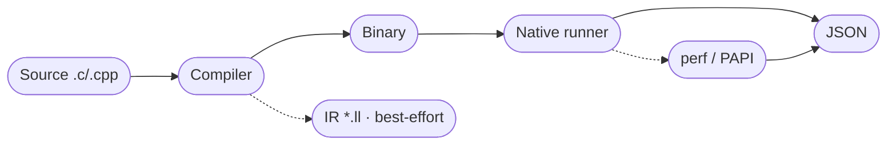
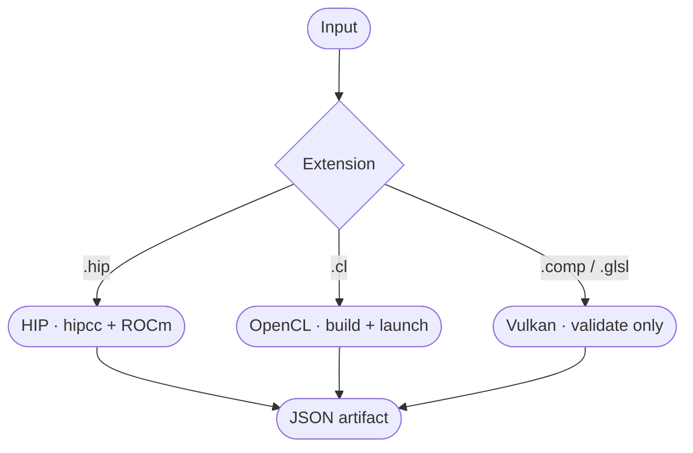
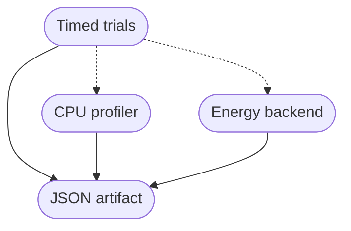

# Architecture

**CompilerSutraPerf** (`csperf`, [PyPI: `compilersutra-perf`](https://pypi.org/project/compilersutra-perf/)) is a **host-side orchestration layer** around existing compilers and profilers. It does not replace Clang, GCC, HIP, OpenCL, Vulkan, or Linux `perf` — it sequences them and normalizes what they produce.

Research framing: [Observatory](/docs/project/compilersutra-perf/observatory/).  
Day-one usage: [Getting started](/docs/project/compilersutra-perf/getting-started/) · [Tutorial](/docs/project/compilersutra-perf/tutorial/).

:::tip How to read this page
1. Skim the **project architecture** diagram (layers).  
2. Follow the **pipeline phases** left → right (one `csperf run`).  
3. Use the tables when you need field names or “what works today.”
:::

## Project architecture

Like IREE’s overview, think in **layers**: a stable core, pluggable adapters, optional measurement, and a common artifact.



| Layer | Responsibility |
| --- | --- |
| **Core** | Flags, manifests, detection, planning, schema, compare, reports |
| **Adapters** | Map a file type to a vendor/open toolchain |
| **Native** | Low-overhead launch, timers, device interaction |
| **Measurement** | Optional counters and energy — never invent values |
| **Artifact** | One reusable JSON (plus CSV / reports) |

**Design rule:** integrate existing tools; do not invent another general-purpose IR just to unify backends. Preserve native outputs; normalize only what must be compared.

## Pipeline phases

A single `csperf run` advances through discrete phases (same idea as IREE’s Input → … → VM overview):


| Phase | What happens | Stop early with |
| --- | --- | --- |
| **Input** | Read CLI / manifest / policy | — |
| **Detect** | Map extension → backend (`cpu`, `hip`, `opencl`, `vulkan`) | — |
| **Plan** | Build compile + run + profiler command list | `--plan-only` |
| **Compile** | Invoke toolchain (clang, hipcc, glslang, …) | — |
| **Execute** | Native runner: warmup + measured trials | `--execution-timeout` |
| **Measure** | Optional `perf` / PAPI / energy | `--no-perf`, `--no-energy` |
| **Artifact** | Write JSON (+ CSV; optional XLSX / HTML) | — |

Concrete CPU example (perfwiki-style: command first, then what it means):

```python
csperf run --input examples/cpp/matrix_traversal.cpp --backend cpu \
  --warmup-runs 1 --repeat-runs 3 --output results/cpu.json
csperf profile results/cpu.json
```

That path is: **Input → Detect(cpu) → Plan → Compile → Execute → Measure → Artifact**.

## Workflow overview

Using `csperf` in practice:

1. **Prepare a workload** — C/C++, HIP, OpenCL `.cl`, or Vulkan shader  
2. **Pick a backend** — explicit `--backend`, or `gpu` to auto-route by extension  
3. **Run** — `csperf run` (or `quickstart` for the smoke path)  
4. **Inspect** — `profile`, `diff`, `visualize`  


| Step | Typical command |
| --- | --- |
| Smoke test | `csperf quickstart --output-dir results/quickstart` |
| Time only | `csperf run … --no-perf --no-energy` |
| Opt sweep | `csperf run … --diff-optimize --report-format both` |
| Compare two JSON files | `csperf diff a.json b.json --csv out.csv` |

## CPU path (stable on Linux)



- Compiler resolution: `CXX_COMPILER` → `CXX` → default `clang++`  
- `CXXFLAGS` is **not** read — pass `--compiler-flag`  
- Prefer same-execution `perf` for branch/cache studies ([Methodology](/docs/project/compilersutra-perf/methodology/))

## GPU paths (experimental)



| Backend | Execute today? | Notes |
| --- | --- | --- |
| HIP | Yes | `kernel_time_ms` (events) ≠ `hip_profiler_*` (rocprof) |
| OpenCL | Yes | State `--opencl-measure` when publishing times |
| Vulkan | Partial | Shader-module validation; **no** full dispatch yet |

## Measurement model

Counters and energy are **plugins beside** the timed trials — not the timer itself.



| Flag | Effect |
| --- | --- |
| `--no-perf` | Skip hardware counters |
| `--no-energy` | Skip `power` block |
| `--cpu-profiler auto\|perf\|papi\|papi-native` | Choose counter path |

On Linux, the CPU profiler path is built on the same ideas as the [perfwiki tutorial](https://perfwiki.github.io/main/tutorial/): **events** (software vs PMU), **`perf stat`-style counting**, and **multiplexing/scaling** when you ask for more events than hardware counters. `csperf` records whether counts came from the **same execution** as wall time — that provenance is what makes a claim honest.

Before publishing numbers, read [Methodology](/docs/project/compilersutra-perf/methodology/) (events, same-execution, scaling).

## Result artifact

Every successful or partial run aims to be **self-describing** (commands, host, tool version, provenance).

| If you want… | Look at |
| --- | --- |
| Runtime | `metrics.execution_time_ms` |
| Per-trial times | `execution.trial_results` |
| Exact commands | `commands` |
| Same-exec counters? | `execution.measurement.same_execution` |
| Why counters missing | `execution.perf_error` / `metrics_availability` |

Top-level sections: `pipeline`, `commands`, `hardware`, `metrics`, `execution`, `artifacts`, optional `power`.

## Module map (0.2.0)

| Tree area | Role |
| --- | --- |
| `cli` | Unified entry (`run`, `doctor`, `diff`, …) |
| `execution/` | Compile/run adapters |
| `profiler/` | `perf`, PAPI, macOS paths |
| `energy/` | RAPL / AMD GPU / macOS backends |
| `report/` | HTML/PDF exporters |
| `experiments/` | row / column / tiled macros |
| `native/runtime/` | C++ runners |
| `examples/` | Seed workloads |

## Status matrix

| Path | Ready? |
| --- | --- |
| Linux CPU | Stable |
| OpenCL / HIP | Experimental |
| Vulkan | Partial (validate) |
| CUDA / Metal | Not implemented |

Roadmap milestones: [Observatory](/docs/project/compilersutra-perf/observatory/).

## See also

- [Observatory](/docs/project/compilersutra-perf/observatory/) — research goal and evidence labels  
- [Usage](/docs/project/compilersutra-perf/usage/) — flags and recipes  
- [Methodology](/docs/project/compilersutra-perf/methodology/) — what you can trust  
- [Energy & reports](/docs/project/compilersutra-perf/energy-and-reports/) — RAPL and HTML/PDF  
- [Troubleshooting](/docs/project/compilersutra-perf/troubleshooting/) — when a phase fails  
